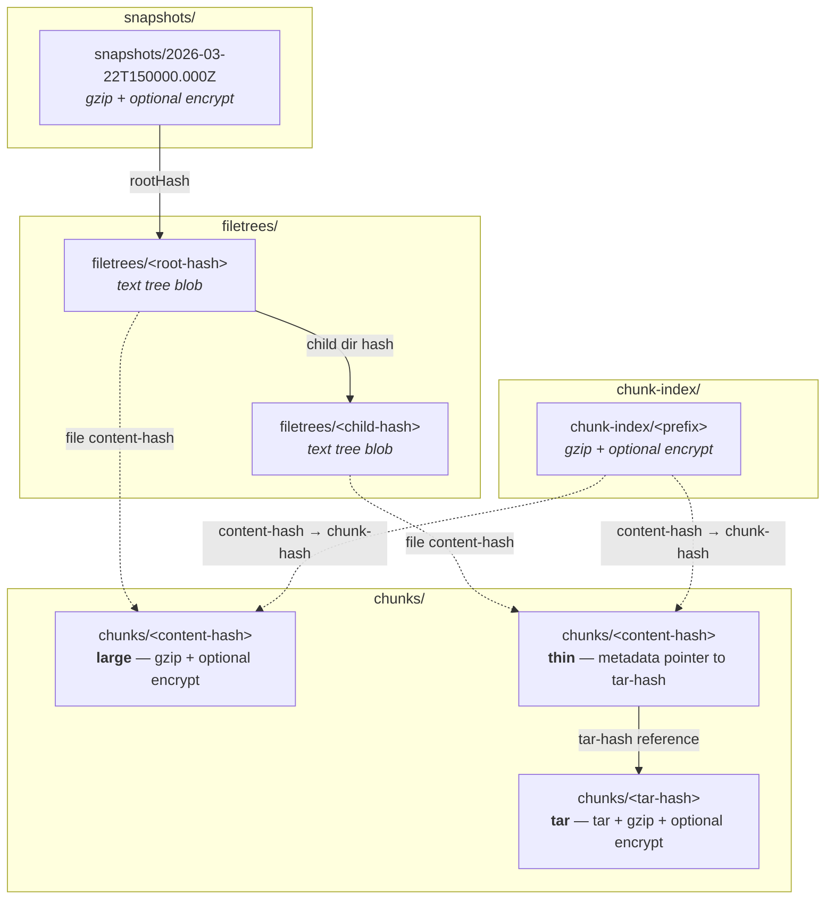

# Arius: a Lightweight Tiered Archival Solution for Azure Blob Storage

[](https://github.com/woutervanranst/Arius7/actions/workflows/ci.yml)
[](https://codecov.io/gh/woutervanranst/Arius7)


Arius is a lightweight archival solution, specifically built to leverage the Azure Blob Archive tier. It's content-addressable, deduplicated, client-side encrypted and versioned.

The name derives from the Greek for 'immortal'.

Arius7 is a deliberate Agentic Engineering (human-on-the-loop) rewrite of [Arius](https://github.com/woutervanranst/Arius).

Principles:
* Code is not human-written
* Important business logic may get glanced at
* Tests is where the human attention goes to - so coverage is inherently high
* Like [Peter Steinberger](https://youtube.com/watch?v=YFjfBk8HI5o&t=4437), the ClawdBot creator, I never revert, only fix forward

## Demo

Archive and restore at a glance:


## Installation

Download the binary for your platform from the
[latest release](https://github.com/woutervanranst/Arius7/releases/latest).

### Windows

Download arius-win-x64.exe and add its directory to your PATH

### Linux (& Synology NAS)

```bash
curl -Lo arius https://github.com/woutervanranst/Arius7/releases/latest/download/arius-linux-x64
chmod +x arius
sudo mv arius /usr/local/bin/
```

### macOS

```bash
curl -Lo arius https://github.com/woutervanranst/Arius7/releases/latest/download/arius-osx-arm64
chmod +x arius
sudo mv arius /usr/local/bin/
```

> **Note:** macOS may block the binary. Run `xattr -c /usr/local/bin/arius` to clear the quarantine flag.

## Usage

```
arius archive <path> -a <name> -k <key> -c <container> [options]
arius restore <path> -a <name> -k <key> -c <container> [options]
arius ls          -a <name> -k <key> -c <container> [options]
arius repair-index -a <name> -k <key> -c <container>
arius update
```

### Archive

```bash
arius archive ./photos \
  -a mystorageaccount \
  -c photos-backup \
  -t Archive \
  --remove-local
```

For large archives that change rarely, add `--fast-hash` to skip re-reading files whose content the local cache confirms as unchanged. The first run (or any run without `--fast-hash`) warms the cache; subsequent runs with `--fast-hash` only re-read changed files.

```bash
arius archive ./photos -a mystorageaccount -c photos-backup --fast-hash
```

Pointer sidecar files (`.pointer.arius`) are **off by default**. Pass `--write-pointers` to create them alongside the originals, or use `--remove-local` (which implies `--write-pointers` automatically).

### Restore

```bash
arius restore ./photos \
  -a mystorageaccount \
  -c photos-backup
```

Filter paths with `--target-path`.

### List files in a snapshot

```bash
arius ls \
  -a mystorageaccount \
  -c photos-backup
```

Filter with `--prefix <path>` and `--filter <substring>`, and pick an older snapshot with `-v <version>`.

### Repair chunk index

Run this when archive, restore, or list reports that the chunk index is corrupt, incomplete, or missing entries:

```bash
arius repair-index \
  -a mystorageaccount \
  -c photos-backup
```

The repair command rebuilds the chunk index from committed chunks and can be rerun safely if it is interrupted.

### Updating

Run:

```
arius update
```

This checks GitHub Releases for a newer version, downloads it, and replaces the binary in-place.

### Account key

Pass `-k` on the command line, set `ARIUS_KEY` environment variable, authenticate with the Azure CLI or store it in a `dotnet user-secrets set "arius:<account>:key" "<key>"`.

## Development

Building, running each host locally, and the full test-suite architecture (unit · integration · E2E · mutation · benchmarks) are covered in the **[Development guide](docs/guide/development.md)**.

## Blob Storage Structure

A single Azure Blob container holds the entire repository. Blobs are organized into
virtual directories (prefixes):

```
<container>
├── chunks/                   Content-addressable chunks (configurable tier)
├── chunks-rehydrated/        Temporary hot-tier copies during restore (auto-cleaned)
├── filetrees/                Merkle tree nodes — one text blob per directory (Cool tier)
├── snapshots/                Point-in-time snapshot manifests (Cool tier)
├── chunk-index/              Deduplication index shards (Cool tier)
|
|                             --- (v3/v5 legacy archives-only)
├── chunks-v5legacy-metadata/ Metadata for legacy chunks in Archive-tier (see ADR-0018)
└── states/                   v5/v3 state databases; deprecated once migrated
```

### How it fits together

The runtime coordinates four shared services: `SnapshotService` for snapshot manifests,
`FileTreeService` for cached filetree blobs, `ChunkIndexService` for deduplication shard
lookups and shard-cache ownership, and `ChunkStorageService` for chunk blob upload,
download, hydration, rehydration, and cleanup planning. Feature handlers are expected to
go through those shared services instead of depending directly on low-level blob
abstractions such as `IBlobContainerService`, `IBlobService`, or `IBlobServiceFactory`,
with only narrow exceptions where the feature itself is the blob-level boundary.
Repository-local cache and log directories are derived consistently through the shared
`RepositoryPaths` helper. Chunk hydration state is shared through
`Shared/ChunkStorage/ChunkHydrationStatus`.



### snapshots/

Each blob is a small JSON manifest (gzip-compressed, optionally AES-256-CBC encrypted)
that captures a point-in-time state of the repository:

| Field | Description |
|-------|-------------|
| `timestamp` | UTC time of snapshot creation |
| `rootHash` | SHA-256 hash of the root Merkle tree node |
| `fileCount` | Total number of files |
| `originalSize` | Logical size: sum of original (uncompressed) file sizes in bytes |
| `ariusVersion` | Tool version that created the snapshot |

Snapshots are immutable and never deleted. To browse the repository at a given point in
time, resolve the snapshot, then walk the tree from `rootHash`.

### filetrees/

Merkle tree nodes. Each blob is a UTF-8 text file named by its tree-hash (SHA-256 of the
canonical text, optionally passphrase-seeded). A tree blob lists the entries in one
directory — one line per entry, sorted by name:

See [`docs/design/core/shared/filetree.md`](docs/design/core/shared/filetree.md) for the archive-time staging, build, upload,
and cache pipeline behind these nodes.

```
abc123... F 2026-03-25T10:00:00.0000000+00:00 2026-03-25T12:30:00.0000000+00:00 photo.jpg
def456... D subdir/
```

- **File entries** (`F`): `<content-hash> F <created> <modified> <name>`
- **Directory entries** (`D`): `<tree-hash> D <name>`
- Names are always the last field and may contain spaces (no quoting needed).
- File entries point to a content-hash in `chunks/`.
- Directory entries point to another tree blob in `filetrees/`.
- Walking from the root hash recursively reconstructs the full directory tree.

### chunks/

Content-addressable storage for file data. Three blob types coexist under this prefix,
distinguishable by their HTTP `Content-Type` header and `arius_type` metadata:

| Type | Blob name | Content-Type | Body | Tier |
|------|-----------|-------------|------|------|
| **large** | `chunks/<content-hash>` | `application/aes256cbc+gzip` or `application/gzip` | Single file: gzip + optional encrypt | Configurable (`-t`) |
| **tar** | `chunks/<tar-hash>` | `application/aes256cbc+tar+gzip` or `application/tar+gzip` | Bundle of small files: tar + gzip + optional encrypt | Configurable (`-t`) |
| **thin** | `chunks/<content-hash>` | `text/plain; charset=utf-8` | Empty body; parent tar-hash in metadata | Always Cool |

**Routing rule:** files >= 1 MB are uploaded individually as **large** chunks. Files < 1 MB are accumulated into **tar** bundles (target size 64 MB, can become larger depending on TAR overhead). For each file in a tar bundle, a **thin** pointer blob is created so that every content-hash has a corresponding blob in `chunks/`.

Thin chunks are kept on Cool tier and include their parent tar-hash in metadata so repair can rebuild mappings without downloading each thin chunk.

### chunks-rehydrated/

Temporary prefix used only during restore. When chunks are stored on Archive tier, Arius
initiates a server-side copy from `chunks/<hash>` to `chunks-rehydrated/<hash>` at Hot
tier. Once rehydration completes and files are restored, these blobs are cleaned up.

### chunk-index/

Deduplication index split into prefix-keyed shards. Each shard is a text file (gzip-compressed, optionally encrypted) where
each line maps a content-hash to its chunk-hash, original size, stored chunk size, and the chunk's storage tier:

```text
<content-hash> <chunk-hash> <original-size> <chunk-size> <tier>
```

For large files, content-hash equals chunk-hash and the chunk-hash field is omitted.
For tar-bundled files, chunk-size is the full parent tar chunk size, so restore and rehydration estimates reflect the bytes Arius must actually download or rehydrate.
The tier field records the chunk's storage tier at archive time (`1`=hot, `2`=cool,
`3`=cold, `4`=archive); it is a hint that lets `ls` report whether a file is readily
downloadable or archived without contacting each blob. For tar-bundled files, chunk-hash
is the tar-hash and the tier is the tar blob's tier. Arius keeps local chunk-index state
in a SQLite cache under the repository state directory, validates touched prefixes lazily
against the latest snapshot, and can rebuild the local cache or the remote shards from
committed chunks when repair is needed.

## Disaster recovery

Normal recovery is `arius restore`. But your data does **not** depend on the Arius binary.
Every chunk is self-describing: an encryption envelope (detected from its leading magic bytes) wrapping a standard compression frame.

| Layer | Formats (auto-detected from magic bytes) |
|-------|------------------------------------------|
| Encryption | AES-256-GCM (`ArGCM1`, current) · AES-256-CBC (`Salted__`, legacy) |
| Compression | zstd — standard [RFC 8878](https://www.rfc-editor.org/rfc/rfc8878) frame (`28 B5 2F FD`) or gzip ([RFC 1952](https://www.rfc-editor.org/rfc/rfc1952), legacy) |

### Emergency single-chunk recovery (without Arius)

[`recover-chunk.py`](recover-chunk.py) decrypts and decompresses one chunk file given only the passphrase.
It auto-detects both the encryption and the compression format, validates the XXH64 checksum, and refuses
a truncated frame rather than emitting a partial prefix.

```bash
# Needs:  pip install cryptography zstandard
python3 recover-chunk.py <encrypted-chunk-file> <passphrase> [output-file]
```

## Documentation

- **Using Arius:** [CLI guide](docs/guide/cli.md) · [Web UI guide](docs/guide/web-ui.md) · [Explorer guide](docs/guide/explorer.md) · [Deployment](docs/guide/deployment.md)
- **Understanding & contributing:** start at the [documentation map](docs/README.md) — architecture and per-subsystem design under [`docs/design/`](docs/design/), decision records in [`docs/decisions/`](docs/decisions/), the [glossary](docs/glossary.md), and frozen [history](docs/history/).

## License

[MIT](LICENSE)
