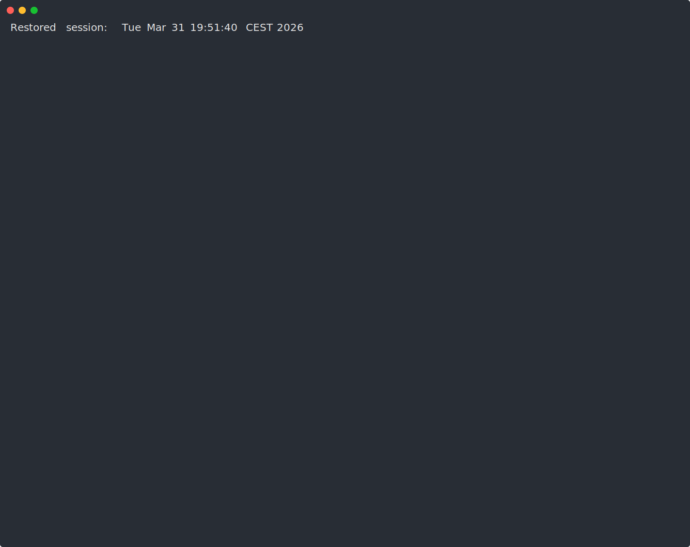
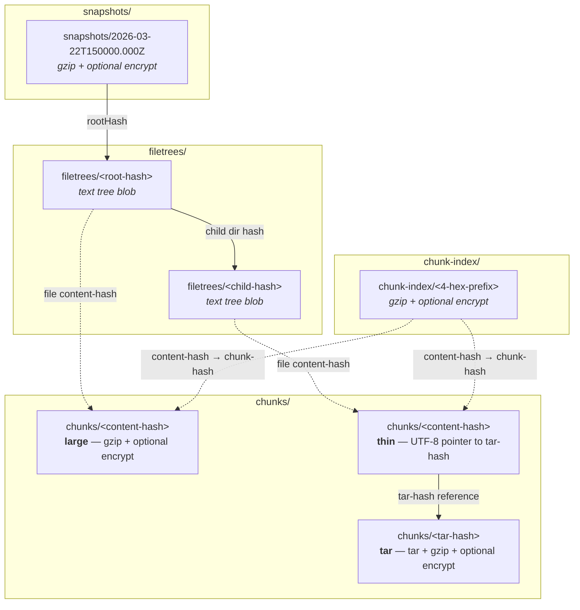

# Arius: a Lightweight Tiered Archival Solution for Azure Blob Storage

[](https://github.com/woutervanranst/Arius7/actions/workflows/ci.yml)
[](https://codecov.io/gh/woutervanranst/Arius7)


Arius is a lightweight archival solution, specifically built to leverage the Azure Blob Archive tier. It's content-addressable, deduplicated, client-side encrypted and versioned.

The name derives from the Greek for 'immortal'.

Arius7 is a deliberate Agentic Engineering (human-on-the-loop) rewrite of [Arius](https://github.com/woutervanranst/Arius).

Principles:
* Code is not human-written
* Important business logic may get glanced at
* Tests is where the human attention goes to - so coverage is inherently high
* Like [Peter Steinberger](https://youtube.com/watch?v=YFjfBk8HI5o&t=4437), the ClawdBot creator, I never revert, only fix forward

## Demo

Archive and restore at a glance:



## Installation

Download the binary for your platform from the
[latest release](https://github.com/woutervanranst/Arius7/releases/latest).

### Windows

```powershell
# Download arius-win-x64.exe and add its directory to your PATH
```

### Linux (& Synology NAS)

```bash
curl -Lo arius https://github.com/woutervanranst/Arius7/releases/latest/download/arius-linux-x64
chmod +x arius
sudo mv arius /usr/local/bin/
```

### macOS

```bash
curl -Lo arius https://github.com/woutervanranst/Arius7/releases/latest/download/arius-osx-arm64
chmod +x arius
sudo mv arius /usr/local/bin/
```

> **Note:** macOS may block the binary. Run `xattr -c /usr/local/bin/arius` to clear the quarantine flag.

## Usage

```
arius archive <path> -a <name> -k <key> -c <container> [options]
arius restore <path> -a <name> -k <key> -c <container> [options]
arius ls          -a <name> -k <key> -c <container> [options]
arius update
```

### Archive

```bash
arius archive ./photos \
  -a mystorageaccount \
  -c photos-backup \
  -t Archive \
  --remove-local
```

### Restore

```bash
arius restore ./photos \
  -a mystorageaccount \
  -c photos-backup
```

### List snapshots

```bash
arius ls \
  -a mystorageaccount \
  -c photos-backup
```

### Account key

Pass `-k` on the command line, set `ARIUS_KEY` environment variable, or store it in
[.NET user secrets](https://learn.microsoft.com/aspnet/core/security/app-secrets):

```bash
dotnet user-secrets set "arius:<account>:key" "<key>"
```

### Running tests locally

Most test projects can be run directly with `dotnet test --project <path-to-csproj>`.
`src/Arius.E2E.Tests` also requires `ARIUS_E2E_ACCOUNT` and `ARIUS_E2E_KEY` to be set; otherwise the suite fails immediately with a configuration error.

## Updating

Run:

```
arius update
```

This checks GitHub Releases for a newer version, downloads it, and replaces the binary in-place.

## Blob Storage Structure

A single Azure Blob container holds the entire repository. Blobs are organized into
virtual directories (prefixes):

```
<container>
├── chunks/              Content-addressable chunks (configurable tier)
├── chunks-rehydrated/   Temporary hot-tier copies during restore (auto-cleaned)
├── filetrees/           Merkle tree nodes — one text blob per directory (Cool tier)
├── snapshots/           Point-in-time snapshot manifests (Cool tier)
└── chunk-index/         Deduplication index shards (Cool tier)
```

### How it fits together



### snapshots/

Each blob is a small JSON manifest (gzip-compressed, optionally AES-256-CBC encrypted)
that captures a point-in-time state of the repository:

| Field | Description |
|-------|-------------|
| `timestamp` | UTC time of snapshot creation |
| `rootHash` | SHA-256 hash of the root Merkle tree node |
| `fileCount` | Total number of files |
| `totalSize` | Sum of original file sizes in bytes |
| `ariusVersion` | Tool version that created the snapshot |

Snapshots are immutable and never deleted. To browse the repository at a given point in
time, resolve the snapshot, then walk the tree from `rootHash`.

### filetrees/

Merkle tree nodes. Each blob is a UTF-8 text file named by its tree-hash (SHA-256 of the
canonical text, optionally passphrase-seeded). A tree blob lists the entries in one
directory — one line per entry, sorted by name:

```
abc123... F 2026-03-25T10:00:00.0000000+00:00 2026-03-25T12:30:00.0000000+00:00 photo.jpg
def456... D subdir/
```

- **File entries** (`F`): `<content-hash> F <created> <modified> <name>`
- **Directory entries** (`D`): `<tree-hash> D <name>`
- Names are always the last field and may contain spaces (no quoting needed).
- File entries point to a content-hash in `chunks/`.
- Directory entries point to another tree blob in `filetrees/`.
- Walking from the root hash recursively reconstructs the full directory tree.

### chunks/

Content-addressable storage for file data. Three blob types coexist under this prefix,
distinguishable by their HTTP `Content-Type` header and `arius_type` metadata:

| Type | Blob name | Content-Type | Body | Tier |
|------|-----------|-------------|------|------|
| **large** | `chunks/<content-hash>` | `application/aes256cbc+gzip` or `application/gzip` | Single file: gzip + optional encrypt | Configurable (`-t`) |
| **tar** | `chunks/<tar-hash>` | `application/aes256cbc+tar+gzip` or `application/tar+gzip` | Bundle of small files: tar + gzip + optional encrypt | Configurable (`-t`) |
| **thin** | `chunks/<content-hash>` | `text/plain; charset=utf-8` | UTF-8 string of the tar-hash (pointer, ~64 bytes) | Always Cool |

**Routing rule:** files >= 1 MB are uploaded individually as **large** chunks. Files
< 1 MB are accumulated into **tar** bundles (target size 64 MB). For each file in a tar
bundle, a **thin** pointer blob is created so that every content-hash has a
corresponding blob in `chunks/`.

Thin pointers are kept on Cool tier (cheap to read) so that restore can resolve
tar-hash references without rehydrating archive-tier blobs.

### chunks-rehydrated/

Temporary prefix used only during restore. When chunks are stored on Archive tier, Arius
initiates a server-side copy from `chunks/<hash>` to `chunks-rehydrated/<hash>` at Hot
tier. Once rehydration completes and files are restored, these blobs are cleaned up.

### chunk-index/

Deduplication index split into 65,536 shards (keyed by the first 4 hex chars of the
content-hash). Each shard is a text file (gzip-compressed, optionally encrypted) where
each line maps a content-hash to its chunk-hash:

```
<content-hash> <chunk-hash> <original-size> <compressed-size>
```

For large files, content-hash equals chunk-hash. For tar-bundled files, chunk-hash is
the tar-hash. A 3-tier cache (in-memory LRU, local disk at
`~/.arius/cache/<repo-id>/chunk-index/`, remote blob) makes lookups fast.

## License

[MIT](LICENSE)
