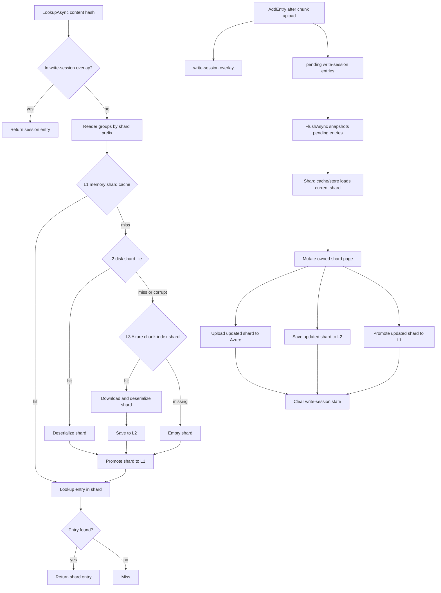

# Caching Architecture

## Overview

Shared singleton services own repository data access and local caching. They sit
between the feature handlers and Azure Blob Storage, eliminating redundant
network calls across and within runs.

```
  archive / ls / restore
         │
         ├── SnapshotService       disk JSON  ↔  Azure snapshots/
         │       │
         │       └── coordinates epoch for ──────────────────────┐
         │                                                        │
         ├── FileTreeService      disk files ↔  Azure filetrees/ │
         │       │                                                │
         │       └── on mismatch, invalidates ◄───────────────────┘
         │
         ├── ChunkIndexService     L1 memory LRU
         │                         L2 disk    ↔  Azure chunk-index/
         │                         L3 Azure

         └── ChunkStorageService              ↔  Azure chunks/
```

---

## SnapshotService

**What it caches:** `SnapshotManifest` — the root tree hash, file count, total
size, and timestamp recorded at the end of each archive run.

**Where:** `~/.arius/{account}-{container}/snapshots/{timestamp}` as plain JSON.
Azure stores the same data gzip-compressed and optionally encrypted.

**How it works:**

- `CreateAsync` — write-through: writes JSON to disk first, then uploads to
  Azure. The local file is always consistent with the remote after a successful
  archive.
- `ResolveAsync` — disk-first: lists remote blob names, selects the target
  (latest or version-matched), checks local disk. On a miss, downloads from
  Azure and caches to disk.

**Why it matters:** Snapshot timestamps are the coordination point for the
entire cache stack. `FileTreeService` compares the latest local snapshot name
against the latest remote one to decide whether the local tree and chunk-index
caches are trustworthy.

---

## FileTreeService

**What it caches:** serialized filetree nodes represented in code as
`IReadOnlyList<FileTreeEntry>` — the Merkle tree nodes that describe directory
structure. Each blob is content-addressed: its filename *is* its SHA-256 hash,
so a file on disk is correct by definition.

**Where:** `~/.arius/{account}-{container}/filetrees/{hash}` as canonical
plaintext filetree lines.
An empty (zero-byte) file is a *remote-existence marker* — the blob is known to
exist in Azure but has not been downloaded yet.

**How it works:**

- `ReadAsync` — disk-first. Non-empty file → deserialize and return immediately.
  Empty file or miss → download from Azure, write to disk, return. Concurrent
  reads for the same hash are coalesced into a single download.
- `WriteAsync` — upload to Azure (tolerates already-exists for crash recovery),
  then write to disk.
- `ExistsInRemote(hash)` — returns `File.Exists(diskPath)`. Reliable only after
  `ValidateAsync` has run; raises an exception otherwise.

**Validation (epoch check):** `ValidateAsync` runs once per archive pipeline,
before the tree-build phase.

- **Fast path** — the latest local snapshot filename matches the latest remote
  snapshot blob name. This machine was the last writer; the disk cache is
  complete and fully trusted. No network calls beyond the snapshot list.
- **Slow path** — names differ (another machine archived since the last local
  run, or this is a fresh machine). Lists all `filetrees/` blobs from Azure,
  creates empty marker files for any not yet on disk, and returns a snapshot
  mismatch result. During archive, the handler responds by calling
  `ChunkIndexService.InvalidateCaches()` before flushing pending shard entries.

The slow path runs at most once per archive run and makes the disk cache
complete for existence checks, so all subsequent `ExistsInRemote` calls are
pure local file-system lookups.

---

## ChunkIndexService

**What it caches:** `ShardEntry` records — the mapping from a file's content
hash to its storage chunk hash, original size, and compressed size. This is the
deduplication index.

Entries are grouped into *shards* by the first two hex characters of the
content hash (256 shards possible). Each shard is a dictionary of all
entries sharing that prefix.

**Three-tier cache:**

| Tier | Location | Notes |
|---|---|---|
| L1 — memory LRU | Process heap | Byte-budget eviction (default 512 MB). Thread-safe via lock + linked list. |
| L2 — disk | `~/.arius/{account}-{container}/chunk-index/{prefix}` | One file per shard prefix. Plain serialized bytes. Corrupt files are deleted and treated as misses. |
| L3 — Azure | `chunk-index/{prefix}` blob | Authoritative source. A hit populates L2 and L1. |

`ChunkIndexService` is the public facade for chunk-index operations. Internally,
it separates three responsibilities:

- a read-through shard cache/store that owns L1, L2, L3, L1 eviction, L2 saves,
  remote uploads, cache invalidation, and per-prefix synchronization;
- a read-only reader that groups persisted lookup misses by two-character shard
  prefix and asks the shard cache/store once per prefix;
- a write session that keeps same-run entries visible before flush and snapshots
  pending entries at archive tail.

The write session is a write-back overlay. It avoids per-upload remote shard
writes, but still makes newly uploaded chunks visible to subsequent lookups
before the buffered entries are flushed into shard files. This overlay is not
bounded by `DefaultL1CacheBudgetBytes`; that budget applies only to L1 shard
pages.



The write-session overlay and L1 overlap deliberately but represent different
states:

- The write-session overlay contains entries recorded after upload but before
  they have been merged into chunk-index shards.
- L1 is the bounded cache for whole materialized shards loaded from L2/L3 or
  promoted after `FlushAsync` writes shard state. A shard is the cache page.
- Before `FlushAsync`, L1 may still hold an older shard that does not contain a
  new entry. `LookupAsync` must check the write-session overlay first to avoid missing
  newly uploaded chunks.
- During `FlushAsync`, pending entries are applied to the current owned mutable
  shard page, then uploaded, saved to L2, and promoted to L1. Only after the
  whole flush succeeds is write-session state cleared.
- `DefaultL1CacheBudgetBytes` applies only to L1 shard objects. It does not limit
  the write-session overlay or pending entries.

This is intentionally not implemented as a dirty flag on L1 shard pages. A newly
uploaded entry may belong to a shard that is not currently loaded in L1. Marking
that shard dirty would require loading the full shard during `AddEntry`, making
upload workers perform shard-cache I/O and weakening flush batching. The write
buffer keeps `AddEntry` cheap; `FlushAsync` is the point where buffered entries
are applied to full shard pages and made clean in L1/L2/L3.

**Key operations:**

- `LookupAsync` — checks the write-session overlay first, then resolves misses
  through the reader and shared L1 → L2 → L3 shard cache.
- `AddEntry` — records a newly uploaded chunk in the write-session overlay and
  pending flush state immediately after upload.
- `FlushAsync` — snapshots pending entries, applies them to owned shard pages,
  uploads updated shards to Azure, saves to L2, promotes to L1, then clears
  write-session state after the whole flush succeeds.
- `InvalidateCaches` — clears L2 and L1. Called by `ArchiveCommandHandler` when
  `FileTreeService.ValidateAsync` reports a snapshot mismatch, so stale shard
  files and objects are not used during the following flush.
- `InvalidateL1` — clears only the in-memory LRU. Used when L2 has already been
  cleared by another code path.
- `RepairAsync` — marks repair in progress, clears L1 and L2 shard cache state,
  scans committed chunk blobs once with metadata, groups reconstructed entries by
  shard prefix in memory, then writes and uploads complete replacement shards for
  the rebuilt prefixes. It deletes stale remote shard blobs after rebuilt shards
  are uploaded and clears the repair marker only after completion.

Normal lookup, entry recording, and flush operations fail while the repair marker
exists. Explicit repair is allowed to run with the marker present so an
interrupted repair can be rerun safely. Cache invalidation does not delete the
repair marker.

`ArchiveCommandHandler` also keeps its own per-run `inFlightHashes` set during
dedup routing. That is the queued-upload guard that prevents duplicate uploads
before upload workers call `AddEntry`; it is separate from the write-session
overlay.

**Why mutable shards require tiered invalidation:** Unlike tree blobs, shards
are mutable — any machine can extend a shard by uploading new chunks. When the
epoch mismatches, the local L2 shard files may be stale. Wiping L2 and clearing
L1 forces fresh downloads from Azure on the next lookup or flush.

---

## How Commands Use the Services

```
                      SnapshotService   FileTreeService   ChunkIndexService
                      ───────────────   ────────────────   ─────────────────
archive
  stage 3 – dedup                                          LookupAsync (per file)
  stage 4 – upload                                         AddEntry (per chunk)
  end-of-pipeline     CreateAsync       ValidateAsync      FlushAsync
                                        ExistsInRemote     (InvalidateL1 via
                                        WriteAsync          ValidateAsync)
                                        ReadAsync

restore
  step 1 – resolve    ResolveAsync
  step 2 – walk tree                    ReadAsync
  step 4 – chunks                                          LookupAsync (batch)

ls
  entry point         ResolveAsync
  prefix nav                            ReadAsync
  per directory                         ReadAsync          LookupAsync (batch,
                                                            sizes only)
```

### archive — end-of-pipeline ordering

The order is deliberate:

1. `FileTreeService.ValidateAsync` — epoch check first. If a mismatch is
   detected, `ArchiveCommandHandler` calls `ChunkIndexService.InvalidateCaches()`
   before the flush. This prevents stale local shard data from overwriting newer
   remote shards.
2. `ChunkIndexService.FlushAsync` — merges and uploads pending shard entries
   with fresh data from Azure.
3. `FileTreeBuilder.BuildAsync` — calls `ExistsInRemote` and `WriteAsync` per
   tree node. After `ValidateAsync`, existence checks are pure disk lookups.
4. `SnapshotService.CreateAsync` — records the new snapshot. The timestamp
   written to disk becomes the next epoch baseline.

### restore and ls — read-only consumers

Neither command calls `ValidateAsync`, `FlushAsync`, `CreateAsync`, or
`AddEntry`. They consume the caches but never write to the repository.
Neither creates a blob container.

### Cross-run cache warm-up

Because `FileTreeService.ReadAsync` always writes to the disk cache on a miss,
caches warm organically:

| Sequence | Effect |
|---|---|
| archive → ls | ls finds all tree blobs already cached |
| archive → restore | restore finds all tree blobs already cached |
| ls → restore | restore benefits from ls's cache population |
| archive → archive (same machine) | fast-path epoch match; no remote listing |
| archive (machine A) → archive (machine B) | one `ListAsync` prefetch on mismatch, then full cache rebuild |
