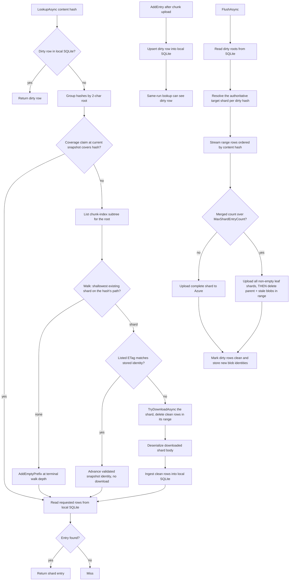

# Caching Architecture

## Overview

Shared singleton services own repository data access and local caching. They sit
between the feature handlers and Azure Blob Storage, eliminating redundant
network calls across and within runs.

```
  archive / ls / restore
         │
         ├── SnapshotService       disk JSON  ↔  Azure snapshots/
         │       │
         │       └── coordinates epoch for ──────────────────────┐
         │                                                        │
         ├── FileTreeService      disk files ↔  Azure filetrees/ │
         │       │                                                │
         │       └── on mismatch, invalidates ◄───────────────────┘
         │
         ├── ChunkIndexService     local SQLite ↔ Azure chunk-index/

         └── ChunkStorageService              ↔  Azure chunks/
```

---

## SnapshotService

**What it caches:** `SnapshotManifest` — the root tree hash, file count, total
size, and timestamp recorded at the end of each archive run.

**Where:** `~/.arius/{account}-{container}/snapshots/{timestamp}` as plain JSON.
Azure stores the same data gzip-compressed and optionally encrypted.

**How it works:**

- `CreateAsync` — write-through: writes JSON to disk first, then uploads to
  Azure. The local file is always consistent with the remote after a successful
  archive.
- `ResolveAsync` — disk-first: lists remote blob names, selects the target
  (latest or version-matched), checks local disk. On a miss, downloads from
  Azure and caches to disk.

**Why it matters:** Snapshot timestamps are the coordination point for the
entire cache stack. `FileTreeService` compares the latest local snapshot name
against the latest remote one to decide whether the local tree and chunk-index
caches are trustworthy.

---

## FileTreeService

**What it caches:** serialized filetree nodes represented in code as
`IReadOnlyList<FileTreeEntry>` — the Merkle tree nodes that describe directory
structure. Each blob is content-addressed: its filename *is* its SHA-256 hash,
so a file on disk is correct by definition.

**Where:** `~/.arius/{account}-{container}/filetrees/{hash}` as canonical
plaintext filetree lines.
An empty (zero-byte) file is a *remote-existence marker* — the blob is known to
exist in Azure but has not been downloaded yet.

**How it works:**

- `ReadAsync` — disk-first. Non-empty file → deserialize and return immediately.
  Empty file or miss → download from Azure, write to disk, return. Concurrent
  reads for the same hash are coalesced into a single download.
- `WriteAsync` — upload to Azure (tolerates already-exists for crash recovery),
  then write to disk.
- `ExistsInRemote(hash)` — returns `File.Exists(diskPath)`. Reliable only after
  `ValidateAsync` has run; raises an exception otherwise.

**Validation (epoch check):** `ValidateAsync` runs once per archive pipeline,
before the tree-build phase.

- **Fast path** — the latest local snapshot filename matches the latest remote
  snapshot blob name. This machine was the last writer; the disk cache is
  complete and fully trusted. No network calls beyond the snapshot list.
- **Slow path** — names differ (another machine archived since the last local
  run, or this is a fresh machine). Lists all `filetrees/` blobs from Azure,
  creates empty marker files for any not yet on disk, and returns a snapshot
  mismatch result. During archive, the handler responds by calling
  `ChunkIndexService.InvalidateCaches()` before flushing pending shard entries.

The slow path runs at most once per archive run and makes the disk cache
complete for existence checks, so all subsequent `ExistsInRemote` calls are
pure local file-system lookups.

---

## ChunkIndexService

**What it caches:** `ShardEntry` records — the mapping from a file's content
hash to its storage chunk hash, original size, stored chunk size, and storage
tier hint. This is the deduplication index.

Entries are grouped into *shards* by a hex prefix of the content hash with a
**dynamic length**. Small repositories use the 2-character layout (up to 256
shards, e.g. `chunk-index/aa`). When a shard exceeds `MaxShardEntryCount`
entries at flush time it is split 16-way by the next hex character
(`aa` → `aa0`..`aaf`), recursively and unevenly per subtree (`aaf` may later
split into `aaf0`.. while `ab` never splits). Only non-empty shards are
written, and there is no layout manifest — the layout is self-describing from
which shard blobs exist:

- **Routing (parent wins):** for a hash, walk down from its 2-character root;
  the *shallowest existing* shard blob on the hash's prefix path is
  authoritative. If no blob exists on the path, descend while any strictly
  deeper blob shares the prefix; the resulting depth is where the range is
  empty (and where new entries would be written).
- **Split ordering:** a split uploads all non-empty children *before* deleting
  the parent. A flush that crashes mid-split therefore leaves the parent
  intact; since the snapshot for that run was never published, the parent still
  contains everything any published snapshot references, so parent-wins reads
  stay correct without any sentinel. The crashed run's rows stay
  `pending_flush = 1` and the retry re-splits and converges.
- **Repair re-balances:** full repair recomputes the layout from the rebuilt
  entry counts (splitting and coarsening as needed) and deletes every other
  `chunk-index/` blob.

Known limitation (pre-existing, unchanged by dynamic sharding): concurrent
archives from two machines into the same repository can overwrite each other's
shard rewrites (last writer wins). Repair recovers; etag-conditional
chunk-index writes are a possible future hardening.

**Local cache shape:**

| Layer | Location | Notes |
|---|---|---|
| Local working store | `~/.arius/{account}-{container}/chunk-index/cache.sqlite` | Stores clean hydrated rows, dirty unflushed rows, and loaded-prefix validation state. |
| Remote repository index | `chunk-index/{prefix}` blob | Authoritative mutable shard blobs. Serialization format stays unchanged. |

`ChunkIndexService` remains the public facade for chunk-index operations. It now
uses a local SQLite store instead of an in-memory LRU plus plaintext per-prefix
disk shard files.

The local store keeps:

- clean rows hydrated from remote shard blobs;
- dirty rows recorded after chunk upload and before archive-tail flush;
- per-range validation state (`loaded_prefixes`): non-overlapping coverage
  claims for variable-length prefixes, each holding the last validated snapshot
  identity plus the last seen remote blob identity.

There is no separate L1 shard cache, no plaintext per-prefix local shard-file
cache, and no write-session overlay collection.



Dirty rows and clean rows are separate states in the same local database,
distinguished by the `pending_flush` column on `chunk_index_entries`:

- `pending_flush = 1` (dirty) means current-run or retryable archive state that
  must not be discarded silently.
- `pending_flush = 0` (clean) means discardable hydrated cache state that can be
  cleared and later rehydrated from remote shard blobs.

Routine snapshot changes do not force a repository-wide purge. The service
revalidates only touched prefixes lazily by comparing the stored remote blob
identity with the current remote blob identity for that prefix.

**Key operations:**

- `LookupAsync` — returns dirty rows immediately; otherwise validates the touched
  prefix lazily and reads only requested hashes from local SQLite.
- `AddEntry` — records a newly uploaded chunk as a dirty row immediately after
  upload.
- `FlushAsync` — reads dirty roots from SQLite, resolves the authoritative
  target shard per dirty hash (reloading the remote base when needed), uploads
  complete replacement shard blobs — splitting any shard that exceeds
  `MaxShardEntryCount` — then marks those rows clean only after all touched
  subtrees upload successfully.
- `InvalidateCaches` — clears discardable clean SQLite rows and loaded-prefix
  state while preserving dirty rows. It also deletes any leftover legacy
  plaintext per-prefix shard files as stale cache state.
- `RepairAsync` — marks repair in progress, replaces the local SQLite cache,
  scans committed chunk blobs once with metadata, stages rebuilt entries in
  SQLite, uploads deterministic replacement shard blobs, deletes stale remote
  shard blobs, and clears the repair marker only after completion.

Normal lookup, entry recording, and flush operations fail while the repair marker
exists. Explicit repair is allowed to run with the marker present so an
interrupted repair can be rerun safely. Cache invalidation does not delete the
repair marker.

`ArchiveCommandHandler` still keeps its own per-run `inFlightHashes` set during
dedup routing. That is the queued-upload guard that prevents duplicate uploads
before upload workers call `AddEntry`; it is separate from chunk-index dirty-row
state.

**Why mutable shards require validation:** Unlike tree blobs, shard blobs are
mutable. Another machine can upload a newer `chunk-index/{prefix}` blob after
this machine last validated a prefix. The local SQLite cache is therefore trusted
only after per-prefix validation against the current latest snapshot identity and
the current remote blob identity for that prefix.

---

## How Commands Use the Services

```
                      SnapshotService   FileTreeService   ChunkIndexService
                      ───────────────   ────────────────   ─────────────────
archive
  stage 3 – dedup                                          LookupAsync (per file)
  stage 4 – upload                                         AddEntry (per chunk)
  end-of-pipeline     CreateAsync       ValidateAsync      FlushAsync
                                        ExistsInRemote     (InvalidateCaches via
                                        WriteAsync          ValidateAsync)
                                        ReadAsync

restore
  step 1 – resolve    ResolveAsync
  step 2 – walk tree                    ReadAsync
  step 4 – chunks                                          LookupAsync (batch)

ls
  entry point         ResolveAsync
  prefix nav                            ReadAsync
  per directory                         ReadAsync          LookupAsync (batch,
                                                            sizes only)
```

### archive — end-of-pipeline ordering

The order is deliberate:

1. `FileTreeService.ValidateAsync` — epoch check first. If a mismatch is
   detected, `ArchiveCommandHandler` calls `ChunkIndexService.InvalidateCaches()`
   before the flush. This prevents stale local shard data from overwriting newer
   remote shards.
2. `ChunkIndexService.FlushAsync` — validates touched prefixes, uploads complete
   shard blobs, and marks dirty rows clean only after successful uploads.
3. `FileTreeBuilder.BuildAsync` — calls `ExistsInRemote` and `WriteAsync` per
   tree node. After `ValidateAsync`, existence checks are pure disk lookups.
4. `SnapshotService.CreateAsync` — records the new snapshot. The timestamp
   written to disk becomes the next epoch baseline.

### restore and ls — read-only consumers

Neither command calls `ValidateAsync`, `FlushAsync`, `CreateAsync`, or
`AddEntry`. They consume the caches but never write to the repository.
Neither creates a blob container.

### Cross-run cache warm-up

Because `FileTreeService.ReadAsync` always writes to the disk cache on a miss,
caches warm organically:

| Sequence | Effect |
|---|---|
| archive → ls | ls finds all tree blobs already cached |
| archive → restore | restore finds all tree blobs already cached |
| ls → restore | restore benefits from ls's cache population |
| archive → archive (same machine) | fast-path epoch match; no remote listing |
| archive (machine A) → archive (machine B) | one `ListAsync` prefetch on mismatch, then full cache rebuild |
