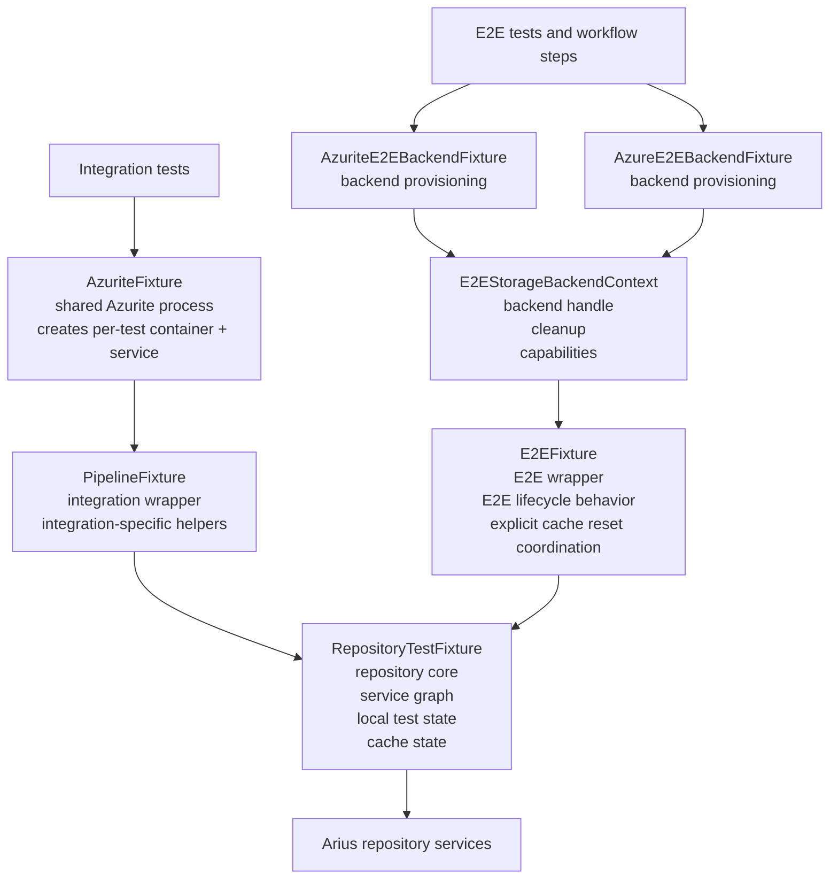

# Test fixtures are structured around an internal RepositoryTestFixture

## Context and Problem Statement

The Arius test suite uses multiple fixture layers because Azurite process lifetime, repository service-graph lifetime, backend provisioning, and workflow-specific test behavior are different concerns. The architecture needs explicit ownership so tests can see where repository services live, where repository-local cache directories live, and where integration-specific or E2E-specific behavior belongs.

The question for this ADR is how Arius test fixtures are structured so responsibilities and interactions stay explicit.

## Decision Drivers

* Repository service ownership should exist in one place.
* Integration and E2E fixtures should keep scenario-specific behavior.
* Wrapper fixtures should remain readable for common arrange/act/assert flows.
* E2E cache reset rules must remain explicit and local to the E2E layer.
* Test infrastructure should remain easy to understand.

## Considered Options

* Broad wrapper fixtures that expose repository services directly.
* Repository-centered fixture design with scenario-specific wrappers.

## Decision Outcome

Chosen option: "Repository-centered fixture design with scenario-specific wrappers", because it keeps repository ownership explicit while preserving wrapper helpers that keep tests readable.

Confidence: high. The current fixture code shows the intended ownership boundary directly, and fresh integration and E2E test runs confirm that the structure works in the active test suites.

The practical effect of this decision should be visible at a glance: tests interact with scenario-specific wrappers for common flows, and those wrappers compose a single repository-facing fixture for repository services and state.

### Fixture Boundaries and Interactions

* `AzuriteFixture` owns the shared Azurite process and creates disposable test containers and blob services on demand.
* `RepositoryTestFixture` is the repository-facing fixture. It owns repository services, rooted local test state, and repository-local cache state.
* `PipelineFixture` is the integration wrapper. It composes Azurite-backed storage with one `RepositoryTestFixture` and keeps integration-oriented test helpers close to the tests that use them.
* `AzuriteE2EBackendFixture` and `AzureE2EBackendFixture` own backend-specific provisioning, backend capabilities, and backend cleanup behavior.
* `E2EStorageBackendContext` carries the backend handle and backend metadata from a backend fixture into the E2E wrapper.
* `E2EFixture` is the E2E wrapper. It composes backend context with one `RepositoryTestFixture` and owns E2E-specific lifecycle behavior, including explicit cache-reset coordination.
* Integration flow: test class -> `AzuriteFixture` -> `PipelineFixture` -> `RepositoryTestFixture` -> Arius repository services.
* E2E flow: test or workflow step -> backend fixture -> `E2EStorageBackendContext` -> `E2EFixture` -> `RepositoryTestFixture` -> Arius repository services.

ASCII diagram:

```text
Integration tests
    |
    v
[AzuriteFixture]
    shared Azurite process
    creates per-test container + blob service
    |
    v
[PipelineFixture]
    integration wrapper
    - integration-specific test helpers
    |
    v
[RepositoryTestFixture]
    repository core
    - service graph
    - local test state
    - cache state
    |
    v
Arius repository services


E2E tests / representative workflow
    |
    +--> [AzuriteE2EBackendFixture] --+
    |                                 |
    +--> [AzureE2EBackendFixture] ----+--> [E2EStorageBackendContext]
                                              backend handle + cleanup + capabilities
                                                        |
                                                        v
                                                 [E2EFixture]
                                                  E2E wrapper
                                                  - E2E lifecycle behavior
                                                  - explicit cache reset coordination
                                                        |
                                                        v
                                                [RepositoryTestFixture]
                                                        |
                                                        v
                                               Arius repository services
```

Mermaid diagram:



### Responsibilities

* Backend fixtures manage backend startup, container provisioning, capabilities, and backend cleanup.
* `RepositoryTestFixture` owns repository wiring and repository-local state.
* Wrapper fixtures keep scenario-specific orchestration and test-facing convenience behavior.
* `E2EFixture` guards cache reset explicitly; disposing a fixture releases the active lease but does not itself perform cache reset.

### Consequences and Tradeoffs

* Good, because repository ownership is explicit and centralized in one fixture type.
* Good, because integration-specific and E2E-specific behavior stays local to the wrappers that own those workflows.
* Good, because `E2EFixture` can enforce explicit cache reset rules without pretending to own a separate repository model.
* Good, because backend provisioning is kept separate from repository composition through `E2EStorageBackendContext`.
* Bad, because wrapper convenience APIs still create more than one access path to some capabilities.
* Bad, because the design relies on discipline to keep new responsibilities from drifting into the wrong fixture layer.

### Confirmation

This decision is being followed when fixture code review and focused test verification show all of the following:

* `RepositoryTestFixture` is the only fixture that stores repository services, rooted test filesystem state, and repository-local cache state.
* `PipelineFixture` and `E2EFixture` expose `Repository` as the canonical repository boundary.
* `E2EFixture` no longer stores duplicated repository service state separately from `Repository`.
* Cache reset is explicit through `E2EFixture.ResetLocalCache(...)`, and disposal only releases the active lease.
* `dotnet test --project src/Arius.Integration.Tests/Arius.Integration.Tests.csproj` passes. Verified on 2026-05-24: 75 total, 0 failed, 71 succeeded, 4 skipped.
* `dotnet test --project src/Arius.E2E.Tests/Arius.E2E.Tests.csproj` passes. Verified on 2026-05-28: 6 total, 0 failed, 6 succeeded, 0 skipped.

## Pros and Cons of the Options

### Broad wrapper fixtures that expose repository services directly

* Good, because it keeps top-level test access short.
* Bad, because it blurs repository ownership.
* Bad, because it encourages wrappers to act like separate repository models.

### Repository-centered fixture design with scenario-specific wrappers

* Good, because `RepositoryTestFixture` is the repository-facing fixture and the wrappers keep scenario-specific responsibilities.
* Good, because it preserves readable test helpers without duplicating repository ownership.
* Good, because it keeps backend management, repository wiring, and workflow behavior as separate concerns.
* Bad, because some duplicated access paths remain by design for ergonomics rather than purity.
