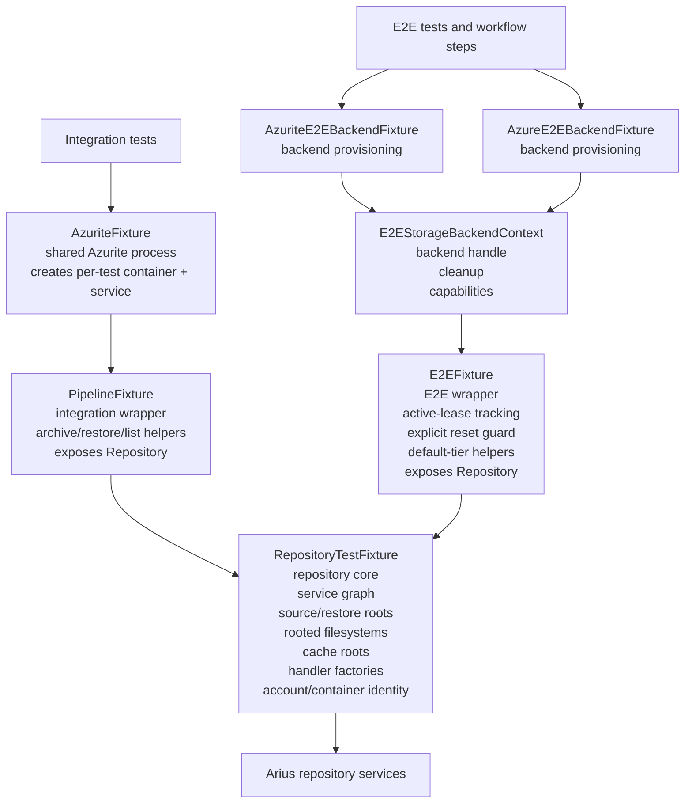

# Test fixtures are structured around an internal RepositoryTestFixture

## Context and Problem Statement

The Arius test suite uses multiple fixture layers because Azurite process lifetime, repository service-graph lifetime, backend provisioning, and workflow-specific test behavior are different concerns. The architecture needs explicit ownership so tests can see where repository services live, where repository-local cache directories live, and where integration-specific or E2E-specific behavior belongs.

The question for this ADR is how Arius test fixtures are structured so responsibilities and interactions stay explicit.

## Decision Drivers

* Repository service ownership should exist in one place.
* Integration and E2E fixtures should keep only scenario-specific behavior.
* Wrapper fixtures should remain readable for common arrange/act/assert flows.
* E2E cache reset rules must remain explicit and local to the E2E layer.
* Common test flows should stay short and readable.

## Considered Options

* Broad wrapper fixtures that expose repository services directly.
* Repository-centered fixture design with scenario-specific wrappers.

## Decision Outcome

Chosen option: "Repository-centered fixture design with scenario-specific wrappers", because it keeps repository ownership explicit while preserving wrapper helpers that keep tests readable.

Confidence: high. The current fixture code shows the intended ownership boundary directly, and fresh integration and E2E test runs confirm that the structure works in the active test suites.

The practical effect of this decision should be visible at a glance:

Fixture usage:

```csharp
var result = await fixture.ArchiveAsync();
var root = fixture.RestoreDirectory;
var restoreRoot = fixture.RestoreDirectory;
var index = fixture.Repository.Index;
```

Low-level repository internals live behind `Repository`. Wrapper-specific roots, handler factories, and workflow helpers remain directly available when they materially improve test readability.

### Fixture Boundaries and Interactions

* `AzuriteFixture` owns the shared Azurite process and creates disposable test containers and blob services on demand. It does not own repository services or local test roots.
* `RepositoryTestFixture` is an internal fixture that owns one repository service graph, one source root, one restore root, rooted filesystems for those roots, repository-local cache directories, handler factories, mediator/logger wiring, and repository account/container identity. It is the repository-facing fixture.
* `PipelineFixture` is an internal integration wrapper that composes an Azurite-backed container with one `RepositoryTestFixture`. It exposes `Repository` and keeps integration helpers such as archive, restore, and list operations plus selected convenience forwards that keep tests short.
* `AzuriteE2EBackendFixture` and `AzureE2EBackendFixture` are internal backend fixtures that own backend-specific container provisioning, capabilities, and best-effort cleanup behavior.
* `E2EStorageBackendContext` is an internal backend context that carries the backend handle, account/container identity, capabilities, and cleanup delegate from a backend fixture into `E2EFixture`.
* `E2EFixture` is an internal E2E wrapper that composes backend context with one `RepositoryTestFixture`. It owns lease-based coordination that blocks cache reset while a fixture is active, explicit `ResetLocalCache(...)` behavior after disposal, default-tier archive and restore helpers, and workflow-facing lifecycle behavior. Repository services live in `Repository`, not as separate stored wrapper state.
* Integration flow: test class -> `AzuriteFixture` -> `PipelineFixture` -> `RepositoryTestFixture` -> Arius repository services.
* E2E flow: test or workflow step -> backend fixture -> `E2EStorageBackendContext` -> `E2EFixture` -> `RepositoryTestFixture` -> Arius repository services.

ASCII diagram:

```text
Integration tests
    |
    v
[AzuriteFixture]
    shared Azurite process
    creates per-test container + blob service
    |
    v
[PipelineFixture]
    integration wrapper
    - archive/restore/list helpers
    - selected convenience forwards
    - exposes Repository
    |
    v
[RepositoryTestFixture]
    repository core
    - service graph
    - source/restore roots
    - rooted filesystems
    - chunk index / filetree / snapshot cache roots
    - handler factories
    - account/container identity
    |
    v
Arius repository services


E2E tests / representative workflow
    |
    +--> [AzuriteE2EBackendFixture] --+
    |                                 |
    +--> [AzureE2EBackendFixture] ----+--> [E2EStorageBackendContext]
                                              backend handle + cleanup + capabilities
                                                        |
                                                        v
                                                 [E2EFixture]
                                                  E2E wrapper
                                                  - active-lease tracking
                                                  - explicit reset guard
                                                  - default-tier archive/restore
                                                  - exposes Repository
                                                        |
                                                        v
                                               [RepositoryTestFixture]
                                                        |
                                                        v
                                               Arius repository services
```

Mermaid diagram:



### Surface Split

* `PipelineFixture` keeps wrapper-local access to `BlobContainer`, `Encryption`, `Mediator`, `LocalDirectory`, `RestoreDirectory`, `LocalFileSystem`, `RestoreFileSystem`, handler factories, and scenario helpers such as `ArchiveAsync`, `RestoreAsync`, and `ListAsync`.
* `E2EFixture` keeps wrapper-local access to `BlobContainer`, `Encryption`, `LocalDirectory`, `RestoreDirectory`, `LocalFileSystem`, `RestoreFileSystem`, handler factories, `ArchiveAsync`, `RestoreAsync`, and explicit `ResetLocalCache(...)` coordination.
* Repository-local surface behind `Repository`: `Index`, `ChunkStorage`, `FileTreeService`, `Snapshot`, `AccountName`, `ContainerName`, `ChunkIndexCacheDirectory`, `FileTreeCacheDirectory`, and `SnapshotCacheDirectory`.
* `E2EFixture` does not carry separate stored copies of repository services.
* Cache reset is explicit through `E2EFixture.ResetLocalCache(...)`; disposing a fixture only releases its active lease.

### Consequences and Tradeoffs

* Good, because repository ownership is explicit and centralized in one fixture type.
* Good, because integration-specific and E2E-specific behavior stays local to the wrappers that actually own those workflows.
* Good, because `E2EFixture` can enforce explicit cache reset rules without pretending to own a separate repository model.
* Good, because backend provisioning is kept separate from repository composition through `E2EStorageBackendContext`.
* Bad, because the wrappers still keep selected convenience forwards, so there is intentionally more than one access path for some high-traffic members.
* Bad, because tests can still mix `fixture.Member` and `fixture.Repository.Member` depending on which surface best matches the scenario.

### Confirmation

This decision is being followed when fixture code review and focused test verification show all of the following:

* `RepositoryTestFixture` is the only fixture that stores repository services, rooted test filesystem state, and repository-local cache directory state.
* `PipelineFixture` and `E2EFixture` expose `Repository` as the canonical repository boundary.
* `E2EFixture` no longer stores duplicated repository service state separately from `Repository`.
* Cache reset is explicit through `E2EFixture.ResetLocalCache(...)`, and disposal only releases the active lease.
* `dotnet test --project src/Arius.Integration.Tests/Arius.Integration.Tests.csproj` passes. Verified on 2026-05-24: 75 total, 0 failed, 71 succeeded, 4 skipped.
* `dotnet test --project src/Arius.E2E.Tests/Arius.E2E.Tests.csproj` passes. Verified on 2026-05-28: 6 total, 0 failed, 6 succeeded, 0 skipped.

## Pros and Cons of the Options

### Broad wrapper fixtures that expose repository services directly

* Good, because it keeps top-level test access short.
* Bad, because it blurs repository ownership.
* Bad, because it encourages wrappers to act like separate repository models.

### Repository-centered fixture design with scenario-specific wrappers

* Good, because `RepositoryTestFixture` is the repository-facing fixture and the wrappers keep only scenario-specific responsibilities plus selected convenience forwards.
* Good, because it preserves readable test helpers without duplicating repository ownership.
* Good, because it keeps Azurite process management, backend provisioning, repository service graphs, and E2E cache lifecycle as separate concerns.
* Bad, because some duplicated access paths remain by design for ergonomics rather than purity.
