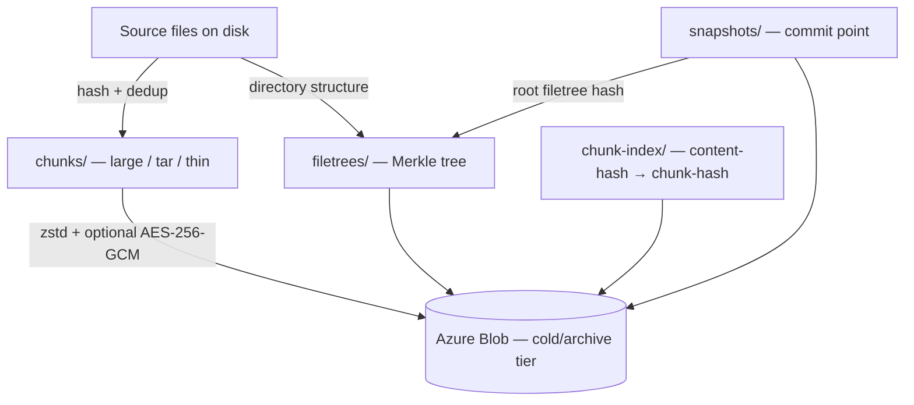
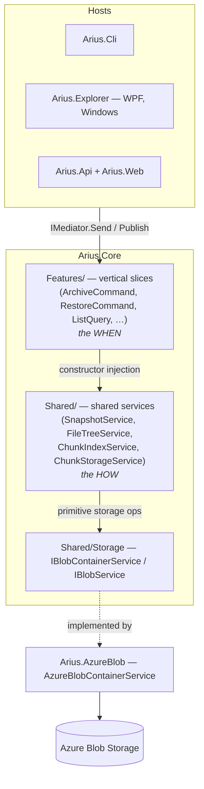
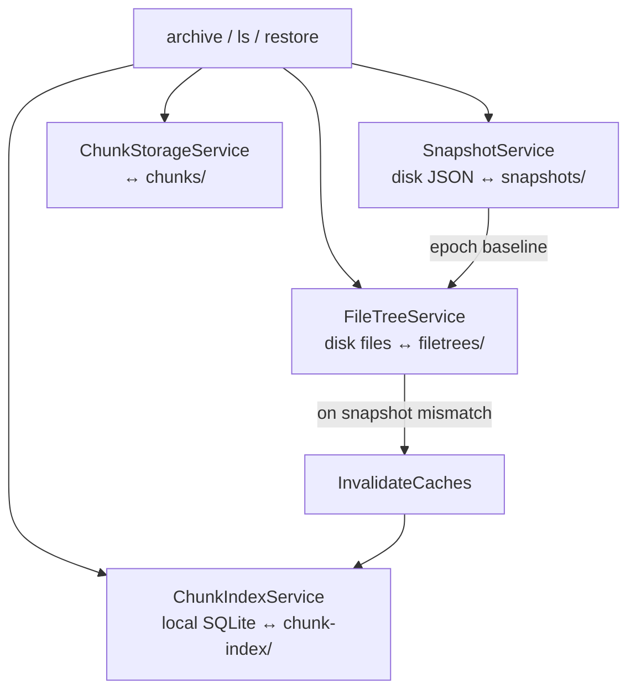

# Arius Design Overview

This is the conceptual and navigational entry point to `docs/design/`. Every other
design doc hangs off the picture described here: what Arius *is*, how the layers fit
together, the shared-service stack that owns repository data access (and how its
lifetime is scoped per repository), and the durability principles that constrain every
design decision.

For domain vocabulary (binary file, pointer file, chunk, shard, snapshot, filetree, …)
see the [Glossary](#glossary) at the end.

---

## 1. The big picture

Arius is a **content-addressed, tiered backup tool** for Azure Blob Storage. It splits
files into content-addressed **chunks**, deduplicates them, compresses (zstd) and
optionally encrypts (AES-256-GCM) each chunk, and uploads them to a cold or archive
storage tier. Small files are bundled into **tar chunks** so they remain cheap to
rehydrate from the archive tier; large files become **large chunks** stored directly.
Repository structure is recorded as immutable Merkle-tree **filetree** blobs, and each
archive run publishes an immutable **snapshot** manifest that pins the root filetree
hash and repository totals.

Three properties drive the whole design:

- **Content addressing** — a blob's name *is* the hash of its content. Filetree and
  chunk identity therefore self-validate, and identical content is stored once.
- **Tiering** — chunk bodies live in cheap cold/archive storage; metadata (snapshots,
  filetrees, the chunk index) lives in cool tier so it stays cheaply listable.
- **Vertical slicing** — each user-facing workflow (`archive`, `restore`, `ls`, …) is
  one self-contained feature slice in `Arius.Core` that orchestrates the shared
  services it needs, rather than a layer of generic managers. See
  [ADR-0010 — feature handlers for application use cases](../decisions/adr-0010-use-feature-handlers-for-application-use-cases.md).

The on-disk blob layout (`chunks/`, `chunks-rehydrated/`, `filetrees/`, `snapshots/`,
`chunk-index/`) is documented in the root [`README.md`](../../README.md) under
"Blob Storage Structure".

---

## 2. Layering

Arius is layered so that *when* something happens (orchestration) is cleanly separated
from *how* it happens (mechanics), and so that the domain never touches a cloud SDK.

**Hosts → `IMediator` → Features → Shared → `IBlobContainerService` → Azure.**

- **Hosts** (`Arius.Cli`, `Arius.Explorer`, `Arius.Api`/`Arius.Web`) translate user
  intent into Core requests. They build one `IServiceProvider` per repository
  (`AddMediator()` + `AddArius(...)`, registered in
  `src/Arius.Core/ServiceCollectionExtensions.cs`) and drive Core through `IMediator`.
  See [Hosts](hosts/).
- **`Features/`** decide *when* to resolve a snapshot, walk a tree, look up chunk
  metadata, upload chunks, or restore files. A handler is a long linear orchestration
  of numbered stages (e.g. `ArchiveCommandHandler`). See [Core / Features](core/features/).
- **`Shared/`** decides *how*: how snapshots are cached, how tree blobs are
  serialized and cached, how chunk-index shards are routed and cached, how chunk blobs
  are uploaded, downloaded, and rehydrated. See [Core / Shared](core/shared/).
- **`Shared/Storage`** is the primitive storage boundary: `IBlobContainerService`,
  `IBlobService`, `IBlobServiceFactory`, blob metadata models, and tier enums. These
  describe upload/download/list/metadata/tier-change/container-lookup and nothing more.
  The higher-level shared services build repository semantics on top of it; feature
  handlers go through those services rather than depending on the storage boundary
  directly (approved exceptions: `ArchiveCommandHandler` for container creation,
  `ContainerNamesQueryHandler` for repository-external container enumeration).

### Core ⊥ Azure SDK

`Arius.Core` does **not** reference the Azure Storage SDK. It depends only on the
`Shared/Storage` interfaces. The concrete implementation —
`AzureBlobContainerService` / `AzureBlobService` in the separate `Arius.AzureBlob`
project — is the only code that touches the Azure SDK. This keeps the domain testable
against fakes and an Azurite emulator and lets the storage backend be swapped without
disturbing Core. See [ADR-0013 — decouple Core from its hosts and storage backend](../decisions/adr-0013-core-host-separation.md).

---

## 3. Core ⊥ hosts loose coupling

Core does not know which host is driving it. Two mechanisms keep them decoupled:

- **Requests in** — every workflow is an `IRequest`/`IQuery` (`ArchiveCommand`,
  `RestoreCommand`, `ListQuery`, …) sent through `IMediator`. The host never calls a
  handler directly.
- **Events out** — long-running handlers publish `INotification` progress events
  through the same mediator (`Arius.Core/Features/ArchiveCommand/Events.cs`:
  `FileScannedEvent`, `FileHashingEvent`, `ChunkUploadingEvent`, `TarBundleSealingEvent`,
  `SnapshotCreatedEvent`, …). Core publishes; it does not assume a consumer. Each host
  subscribes independently and renders progress its own way — the CLI draws progress
  bars, `Arius.Api` relays events over SignalR to the Angular UI, and a host that
  ignores them still works.

This is the seam that lets the same Core power a CLI, a WPF Explorer, and a web API
without conditional host logic in the domain. See
[Cross-cutting / Events and progress](cross-cutting/events-and-progress.md).

---

## 4. The shared-service stack

Four shared services own all repository data access and local caching. They
sit between the feature handlers and Azure, eliminating redundant network calls both
within a run and across runs. They are registered as DI **singletons scoped to one
repository** — a *provider*, not the process, is the unit of scope — and injected into
handlers by constructor; helper types such as `FileTreeBuilder` receive
already-constructed services rather than building their own, since duplicate service
graphs for the same repository would split cache and validation state.

That per-repository scoping has a sharp edge: the model was designed for a short-lived
provider (one CLI command), and it leaks under the long-lived Web and Explorer hosts —
notably `ChunkIndexService` is **single-shot after flush**. How each host manages
provider lifetime (the Api's cached read providers + fresh per-job providers, Explorer's
swap-on-connect) is the subject of
[Cross-cutting / Service lifetimes](cross-cutting/service-lifetimes.md).

| Service | Owns | Backing store |
|---|---|---|
| `SnapshotService` | snapshot create / resolve / list + local snapshot disk state | `~/.arius/{account}-{container}/snapshots/` JSON ↔ `snapshots/` blobs |
| `FileTreeService` | filetree traversal, the immutable filetree blob cache, persistence | disk filetree files ↔ `filetrees/` blobs |
| `ChunkIndexService` | the deduplication index: lookup, mutation, flush, cache invalidation, repair | `chunk-index/cache.sqlite` ↔ mutable `chunk-index/{prefix}` shard blobs |
| `ChunkStorageService` | chunk blob upload / download / hydration / rehydration / cleanup planning | `chunks/` and `chunks-rehydrated/` blobs |

Snapshot timestamps are the coordination point for the whole stack:
`FileTreeService.ValidateAsync` compares the latest local snapshot name against the
latest remote one to decide whether the local tree and chunk-index caches are
trustworthy. Full detail lives in the per-service docs: [chunk-index](core/shared/chunk-index.md)
(routing, the dynamic shard layout, dirty/clean rows), [filetree](core/shared/filetree.md),
and [snapshot](core/shared/snapshot.md) (the epoch/coordination model).

### Command → service matrix

| | `SnapshotService` | `FileTreeService` | `ChunkIndexService` | `ChunkStorageService` |
|---|---|---|---|---|
| **archive** | `CreateAsync` (end) | `ValidateAsync`, `ExistsInRemote`, `WriteAsync`, `ReadAsync` | `LookupAsync` (dedup), `AddEntry` (per chunk), `FlushAsync`, `InvalidateCaches` (on mismatch) | upload chunks / seal tars |
| **restore** | `ResolveAsync` | `ReadAsync` (walk tree) | `LookupAsync` (batch) | download / rehydrate chunks |
| **ls** | `ResolveAsync` | `ReadAsync` (prefix nav, per dir) | `LookupAsync` (batch, sizes only) | — |

`restore` and `ls` are read-only consumers: they never call `ValidateAsync`,
`FlushAsync`, `CreateAsync`, or `AddEntry`, and neither creates a blob container.
Because `FileTreeService.ReadAsync` always writes to the disk cache on a miss, caches
warm organically across runs (an `archive` warms `ls` and `restore`; same-machine
re-archive hits the fast-path epoch match with no remote listing). Per-service detail
is under [Core / Shared](core/shared/).

---

## 5. Durability principles

Arius is a backup tool for important files: correctness, durability, and
recoverability outrank raw throughput. Four principles constrain every design.

1. **Snapshots are the commit point.** A snapshot is not published until every
   referenced filetree and chunk is durably in Azure. Readers only ever see fully
   materialized repository state, so a crashed run leaves no half-visible version.
   See [ADR-0017 — idempotent, non-distributed recovery](../decisions/adr-0017-idempotent-non-distributed-recovery.md).

2. **Caches are hints, never the source of truth.** Local SQLite and disk caches can
   be stale, incomplete, or corrupt. The remote repository is authoritative. Mutable
   chunk-index shards are trusted only after per-prefix validation; immutable
   content-addressed filetree blobs are trusted whenever the local file is non-corrupt.
   Any mutable metadata can be rebuilt from committed chunks via
   `ChunkIndexService.RepairAsync` (the `repair-index` command).
   See [ADR-0016 — multi-machine cache coherence](../decisions/adr-0016-multi-machine-cache-coherence.md).

3. **Bounded-memory streaming.** Repositories can be terabytes across many thousands
   of small files. Long-running handlers (`ArchiveCommandHandler`, `ListQueryHandler`)
   are channel-connected stages with bounded channels for backpressure; nothing
   materializes a whole repository in memory. `ls` streams output as results arrive.
   See [Cross-cutting / Memory boundedness](cross-cutting/memory-boundedness.md).

4. **Non-transactional blob storage → recoverable, not atomic.** Azure Blob has no
   cross-blob transaction. A crashed run can leave partial uploads or a partial
   shard split. The design makes these states *recoverable* rather than corrupting:
   uploads tolerate already-exists, shard splits write children before deleting the
   parent (parent-wins reads stay correct), dirty chunk-index rows survive until flush
   succeeds, and an unpublished snapshot means no reader ever observed the partial
   state. A retry converges.

---

## 6. Map of `docs/design/`

| Path | What lives there |
|---|---|
| [`core/features/`](core/features/) | One doc per vertical slice — `archive`, `restore`, `ls`, `repair-index`, the `*Query` reads — covering stage structure and the *when* of each workflow. |
| [`core/shared/`](core/shared/) | The shared services and supporting mechanics: `SnapshotService`, `FileTreeService`, `ChunkIndexService`, `ChunkStorageService`, plus `Compression`, `Encryption`, `Hashes`, `FileSystem`, `Streaming`, and the `Storage` boundary. |
| [`hosts/`](hosts/) | How `Arius.Cli`, `Arius.Explorer`, and `Arius.Api`/`Arius.Web` build per-repository providers, drive Core via `IMediator`, and consume progress events. |
| [`cross-cutting/`](cross-cutting/) | Concerns that span slices: [events and progress](cross-cutting/events-and-progress.md), [service lifetimes](cross-cutting/service-lifetimes.md), [memory boundedness](cross-cutting/memory-boundedness.md), [performance](cross-cutting/performance.md), [logging](cross-cutting/logging.md), [testing](cross-cutting/testing.md). |
| [`../decisions/`](../decisions/) | Architecture Decision Records (ADRs) recording the rationale behind these designs. |
| [`../glossary.md`](../glossary.md) | The grounded domain vocabulary. |

---

## Glossary

- **binary file** — a file on disk that Arius archives and restores.
- **pointer file** — a file on disk containing the content hash (stand-in for a removed binary).
- **FilePair** — the archive-time view of one path: binary-only, pointer-only, or both.
- **content hash** — the hash of a binary file's content; the basis for deduplication.
- **chunk hash** — the name of the chunk in which content is stored (equals the content hash for large chunks, differs for tar-bundled files).
- **chunk** — unique stored binary content. A **large chunk** stores one file directly (zstd + optional encryption); a **tar chunk** bundles many small files into one large-chunk-sized blob so they stay cheap to rehydrate; a **thin chunk** is a small metadata pointer whose body is the hash of the tar chunk holding the bytes.
- **chunk index** — the repository-wide content-hash → chunk-hash mapping, used for TAR lookups, deduplication existence checks, and metadata (stored chunk size, tier hint).
- **shard** — one mutable chunk-index blob, partitioned by a dynamic-length hex prefix; reads use the shallowest existing shard on a hash's prefix path (parent wins).
- **storage tier hint** — the chunk blob's tier recorded at archive time; a hint only, since lifecycle/rehydration can change the live tier (`ChunkHydrationStatusQuery` is live truth).
- **filetree** — an immutable Merkle-tree blob describing one directory's entries; models repository structure, not chunk storage.
- **snapshot** — an immutable point-in-time manifest recording the root filetree hash and repository totals; the repository commit point.
