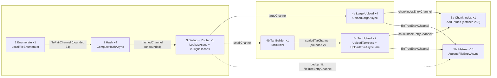
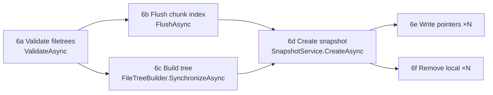

# Archive command

> **Code:** `src/Arius.Core/Features/ArchiveCommand/`  ·  **Decisions:** [ADR-0006](../../../decisions/adr-0006-build-filetrees-from-hashed-directory-staging.md) · [ADR-0007](../../../decisions/adr-0007-separate-phase-and-detail-logging-in-pipeline-handlers.md) · [ADR-0017](../../../decisions/adr-0017-idempotent-non-distributed-recovery.md) · [ADR-0002](../../../decisions/adr-0002-skip-snapshots-for-no-op-archives.md) · [ADR-0019](../../../decisions/adr-0019-central-file-exclusion-configuration.md)  ·  **Terms:** [content hash](../../../glossary.md#content-hash) · [chunk](../../../glossary.md#chunk) · [large chunk](../../../glossary.md#large-chunk) · [tar chunk](../../../glossary.md#tar-chunk) · [thin chunk](../../../glossary.md#thin-chunk) · [FilePair](../../../glossary.md#filepair) · [snapshot](../../../glossary.md#snapshot)

## Purpose

Backs the `archive` command: walk a local directory, deduplicate by [content hash](../../../glossary.md#content-hash), upload the new content as [chunks](../../../glossary.md#chunk), build the immutable filetree, and commit a [snapshot](../../../glossary.md#snapshot). It is one `Mediator` command handler (`ArchiveCommandHandler.Handle`) structured as a fan-out/fan-in pipeline of long-running stages connected by `System.Threading.Channels.Channel<T>`s — so enumeration, hashing, upload, and local-state writes all run concurrently with bounded memory.

## How it works

### Domain model (`Models.cs`)

The pipeline carries a small chain of immutable records, one per stage boundary:

- **`FilePair`** — the local view of one repository path ([FilePair](../../../glossary.md#filepair)): a `RelativePath` plus an optional `BinaryFile` and/or `PointerFile`. Unifies binary-only, [pointer-only](../../../glossary.md#pointer-file), and binary-plus-pointer cases.
- **`HashedFilePair`** — a `FilePair` after its `ContentHash` is computed. **Source `Created`/`Modified` timestamps are captured here, at hash time**, so no later stage re-reads the filesystem for metadata (keeps the snapshot consistent even if the file moves or is deleted mid-run).
- **`FileToUpload`** — a `HashedFilePair` that missed dedup and needs upload, plus its `FileSize`.
- **`TarEntry`** / **`SealedTar`** — a small file staged into a bundle, and the finished in-memory bundle (`ArraySegment<byte>` body + `TarHash` + member entries) handed to tar upload.

### Stage / channel pipeline

Each stage drains its input channel(s), does its work, and completes its output writer in a `finally` so downstream stages drain to completion in turn. Concurrency is fixed per stage (`HashWorkers=4`, `UploadWorkers=4`, `TarUploadWorkers=2`, `ThinEntryWorkers=64`, `FileTreeUpdateWorkers=16`), and most inter-stage channels are unbounded — **backpressure is concentrated at the two channels that carry real bytes**: `filePairChannel` (bounded `ChannelCapacity=64`, caps how far enumeration runs ahead of hashing) and `sealedTarChannel` (bounded `TarUploadWorkers`, caps how many full tar bundles sit in memory).

**1 Enumerate** (`LocalFileEnumerator.EnumerateAsync`, ×1) — single-pass depth-first walk via `RelativeFileSystem` that **prunes excluded directory subtrees and skips excluded files** as it descends. A `FileExclusionFilter` (built from the central [exclusion](../../../glossary.md#exclusion) defaults — name lists plus the `System`/`Hidden` attribute toggles; [ADR-0019](../../../decisions/adr-0019-central-file-exclusion-configuration.md)) is consulted per entry; an excluded directory is never recursed into, and `RelativeFileSystem.GetAttributes` is only read when an attribute rule is active. Recognizes `.pointer.arius` files, pairs each binary with its pointer (and vice versa) by *path derivation* — no dictionary or state tracking — and yields one `FilePair` per surviving path. The walk is an `IAsyncEnumerable<FilePair>` (synchronous I/O underneath); when it excludes an entry it invokes an injected `onExcluded` callback — the enumerator stays mediator-free and the **handler** does the logging (a warning per exclusion) and publishes an `EntryExcludedEvent(path, reason)`, exactly as it wires `TarBuilder`'s callbacks. A directory that can't be read (permission denied / vanished mid-walk) is reported the same way by `SafeEnumerate` so it never faults the scan; invalid pointer content is still logged by the enumerator (it's not an exclusion — the file is yielded). The handler tallies exclusions into `ArchiveResult.EntriesExcluded` (a pruned directory counts as one). Publishes `FileScannedEvent` per surviving file and `ScanCompleteEvent` at the end.

**2 Hash** (×4, `Parallel.ForEachAsync`) — re-hashes every binary by streaming it through `IEncryptionService.ComputeHashAsync` (wrapped in `ProgressStream` when `CreateHashProgress` is set). A pointer-only `FilePair` reuses `Pointer.Hash` directly. **Pointer hashes are never trusted as a cache** for a present binary: the binary is always re-hashed. Captures `(created, modified)` here and emits `HashedFilePair`.

**3 Dedup + Router** (×1) — drains `hashedChannel` in batches of 256, does **one batched `_chunkIndex.LookupAsync`** per batch (instead of a round-trip per file), then decides per item against the index *and* the in-run `inFlightHashes` set:
- **hit** (in index or already in-flight this run) → emit only a filetree entry; no upload, no index entry. Increments `filesDeduped`.
- **pointer-only with a missing chunk** → logged and dropped.
- **new** → `TryAdd` to `inFlightHashes`, then route by `FileSize` vs `opts.SmallFileThreshold` (default 1 MB): `largeChannel` if `≥`, else `smallChannel`.

Single-threaded by design: it owns `inFlightHashes` without locking.

**4a Large Upload** (×4) — one [large chunk](../../../glossary.md#large-chunk) per file via `IChunkStorageService.UploadLargeAsync` (stream the file → compress → optionally encrypt → blob `chunks/<content-hash>`; for a large chunk, chunk hash == content hash). Emits a `ShardEntry` to `chunkIndexEntryChannel` and the `HashedFilePair` to `fileTreeEntryChannel`.

**4b Tar Builder** (×1, `TarBuilder`) — packs small files into a tar bundle named by content hash (not path), sealing once the accumulated uncompressed size reaches `opts.TarTargetSize` (default 64 MB), then immediately starting the next. `TarBuilder` is decoupled from the mediator: it surfaces the three lifecycle moments (started / entry-added / sealing) as callbacks the handler wires to events. A bundle still open at `DisposeAsync` (fault or cancellation) is discarded.

**4c Tar Upload** (×2) — uploads the sealed [tar chunk](../../../glossary.md#tar-chunk) via `UploadTarAsync`, then fans out (`ThinEntryWorkers=64`) to write one [thin chunk](../../../glossary.md#thin-chunk) per entry via `UploadThinAsync` (an empty-body blob pointing back at the tar's chunk hash). Each entry emits a `ShardEntry` (carrying the tar's chunk hash and the bundle's tier) and a filetree entry.

**5a Chunk-index consumer** (×1) — single reader so writes funnel into batched (256) single-writer SQLite transactions via `_chunkIndex.AddEntries`. See [chunk index](../../../glossary.md#chunk-index).

**5b Filetree consumer** (×16) — appends one staging entry per file via `FileTreeStagingWriter.AppendFileEntryAsync` (stripe-locked), and records per-file follow-up intents into two `ConcurrentBag`s: `pendingPointers` (unless `--no-pointers`) and `pendingDeletes` (only if `--remove-local`). `pendingDeletes` gates on `Binary is not null`; `pendingPointers` is broader — it also fires for a pointer-only file flagged `IsLegacyFormat`, rewriting the legacy v5 pointer in place (hash/timestamps unchanged, so the snapshot is unaffected).

### Fan-in and end-of-pipeline

The handler awaits the upload producers (`Task.WhenAll(largeUploadTask, tarBuilderTask, tarUploadTask, dedupTask)`), then in a `finally` completes `chunkIndexEntryChannel` and `fileTreeEntryChannel`, then drains the two consumers and the upstream stages. After everything drains, it runs the commit sequence:

- **6a Validate filetrees** — `IFileTreeService.ValidateAsync`; on `SnapshotMismatch`, `_chunkIndex.InvalidateCaches()`.
- **6b/6c concurrent** — `_chunkIndex.FlushAsync` runs alongside `FileTreeBuilder.SynchronizeAsync`, which reads the staged node files, builds immutable nodes bottom-up, and returns the root `FileTreeHash` (`Task.WhenAll`). The filetree build itself (staging → bottom-up node construction) is its own component; see [ADR-0006](../../../decisions/adr-0006-build-filetrees-from-hashed-directory-staging.md).
- **6d Create snapshot** — if the root hash differs from the latest snapshot, `CreateAsync` writes the manifest and `PromoteToSnapshotVersionAsync` promotes the index; a matching root reuses the existing snapshot and creates nothing (ADR-0002). Emits `SnapshotCreatedEvent`.
- **6e/6f concurrent** — `pendingPointers` are written in parallel via `PointerFileFormat.WriteAsync` (unless `--no-pointers`) while `pendingDeletes` are deleted (only with `--remove-local`); their paths are disjoint (pointer sidecar vs binary), so they cannot race (`Task.WhenAll`).

`Handle` returns an `ArchiveResult` carrying `Success`, the scanned/uploaded/deduped counts, three sizes, and the snapshot root hash + time. The sizes separate the snapshot total from this run's increment: `OriginalSize` is the logical size of the whole snapshot (every file, deduped content counted once per file — not just what this run uploaded), while `IncrementalSize` (original/uncompressed bytes newly uploaded) and `IncrementalStoredSize` (compressed bytes newly written to storage) measure only this run's work. The whole body is wrapped so any fault returns a `Success=false` result with counters collected so far rather than throwing.

## Key invariants

- **The snapshot reflects exactly what enumeration yields this run.** Exclusions are applied during the walk, so an excluded — or newly-excluded — entry never reaches a stage and cannot enter the rebuilt filetree; re-archiving after adding an exclusion makes that file disappear from the new snapshot (older snapshots still reference it). [ADR-0019](../../../decisions/adr-0019-central-file-exclusion-configuration.md).
- **Timestamps are captured once, at hash time**, into `HashedFilePair` — no downstream stage re-reads file metadata.
- **A single unreadable file never faults a draining stage.** Hash, large upload, and tar build each catch a per-file open/read failure (`when (!ct.IsCancellationRequested)`), publish `FileSkippedEvent`, and continue — because faulting would stop draining a *bounded* channel and deadlock its producer. By contrast, **storage/index faults in upload propagate** and fail the run (a rerun then performs crash recovery rather than reporting a false success).
- **Every channel writer is completed in a `finally`** by the stage that owns it; the handler owns and completes `sealedTarChannel`, `chunkIndexEntryChannel`, and `fileTreeEntryChannel`. This is what lets downstream stages terminate.
- **`inFlightHashes` is mutated only by the single dedup stage**, so it needs no lock; it dedups *within* a run before the index is updated.
- **Legacy (v5) pointer-only files are read, not dropped.** A v5-migrated repo's local pointers use the old JSON format; parsing them keeps them in the rebuilt filetree — otherwise re-archiving sheds them and spawns a spurious snapshot — and upgrades them in place (stage 5b).
- **The snapshot is published last** and only after both the chunk-index flush and the filetree build succeed — it must never reference content the chunk index cannot resolve (ADR-0017).
- **`--remove-local` and `--no-pointers` are mutually exclusive** (validated up front: removing the binary while writing no pointer would lose the path entirely).
- **`ValidateAsync` must run before the tree build** — `ExistsInRemote` throws otherwise.
- Memory is bounded by the two byte-carrying bounded channels, *not* by file count: enumeration/hashing/upload-routing metadata flows through unbounded channels but stays small (path + hash).

## Why this shape

- **Channel pipeline over a monolithic loop** — independent stages run concurrently at their own degree of parallelism, with backpressure isolated to the two channels that hold bytes. Hashing (CPU) overlaps upload (network) overlaps local-state writes (disk/SQLite).
- **Tar bundling for small files** — the archive tier rehydrates per-blob, so thousands of tiny blobs are prohibitively expensive to restore; small files are tarred into one [tar chunk](../../../glossary.md#tar-chunk) with a [thin chunk](../../../glossary.md#thin-chunk) standing in for each member (see the [chunk](../../../glossary.md#chunk) glossary entries).
- **Filetree built from a hashed directory-staging area**, not in-memory — ADR-0006. The handler only decides *when* entries are staged and *when* the build starts; `FileTreeBuilder`/`FileTreeService` own the rest.
- **Crash recovery is idempotent and non-distributed** — ADR-0017. Uploads are optimistic (create-if-not-exists, no pre-flight HEAD); on `BlobAlreadyExistsException` a HEAD check uses the `arius_type` metadata sentinel to tell a fully-committed blob (recover its metadata, continue) from a body-without-metadata partial (delete and retry). Because the snapshot commits last, an interrupted run is simply re-run.
- **Skip the snapshot for a no-op archive** — ADR-0002 — when the rebuilt root hash matches the latest snapshot.
- **Phase vs detail logging** — ADR-0007 — the `[phase] …` lines mark stage boundaries; `[hash]`/`[upload]`/`[tar]`/`[dedup]` lines are per-item detail.
- **`TarBuilder` and `LocalFileEnumerator` are extracted, mediator-free helpers** — they keep the stateful tar lifecycle and the filesystem-pairing logic out of the handler, and surface lifecycle moments as callbacks so the handler keeps ownership of event publishing and log vocabulary.

## Open seams / future

- **Tar bundles are held fully in memory** (`SealedTar.Content` is an `ArraySegment<byte>`). `sealedTarChannel` capacity bounds this to `TarUploadWorkers` bundles, but `TarTargetSize` (64 MB) directly sets peak per-bundle memory; an older design spec described streaming tar to a temp file. A very large `TarTargetSize` or higher `TarUploadWorkers` raises the memory ceiling.
- **Per-file chunking is one-chunk-per-file** — there is no sub-file content-defined chunking yet; a large file is a single large chunk, so editing one byte re-uploads the whole file. (Future content-defined chunking would change the dedup/upload routing.)
- **Concurrency knobs are compile-time constants** (`HashWorkers`, `UploadWorkers`, etc.), not options — tuning requires a code change.
- **`SmallFileThreshold` and `TarTargetSize` interact with restore cost**; the current defaults (1 MB / 64 MB) are not derived from measured rehydration economics.
- **The `filePairChannel` writer carries a `TODO`** to make its single-writer/multi-reader channel options explicit.
- **Exclusion defaults are central but not yet host-overridable in practice** — `AddArius` accepts an `IConfiguration` to layer over the embedded [exclusion](../../../glossary.md#exclusion) defaults, but no shipped host passes one, so the defaults are currently fixed for every host ([ADR-0019](../../../decisions/adr-0019-central-file-exclusion-configuration.md)).
