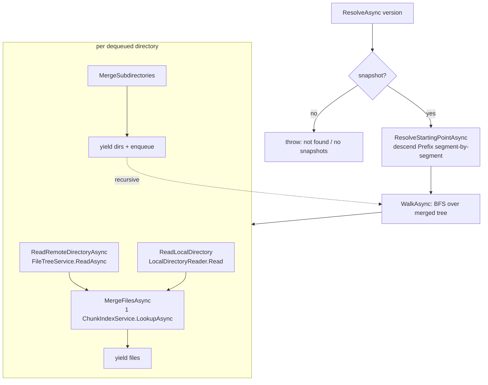

# List query (`ls`)

> **Code:** `src/Arius.Core/Features/ListQuery/` (`ListQueryHandler.cs`, `LocalDirectoryReader.cs`, `Models.cs`, `ListQuery.cs`)  ·  **Decisions:** [ADR-0010](../../../decisions/adr-0010-use-feature-handlers-for-application-use-cases.md) · [ADR-0015](../../../decisions/adr-0015-chunk-index-scalability.md) · [ADR-0016](../../../decisions/adr-0016-multi-machine-cache-coherence.md)  ·  **Terms:** [filetree](../../../glossary.md#filetree) · [snapshot](../../../glossary.md#snapshot) · [chunk size](../../../glossary.md#chunk-size) · [chunk index](../../../glossary.md#chunk-index) · [storage tier hint](../../../glossary.md#storage-tier-hint) · [pointer file](../../../glossary.md#pointer-file)

## Purpose

Streams the contents of a [snapshot](../../../glossary.md#snapshot) as a flat sequence of file and directory entries for `ls`. Optionally overlays the local filesystem so a single listing shows, per entry, what exists in the repository, what exists on disk, and whether the chunk is archived — without buffering the whole tree.

## How it works

`ListQuery` is a Mediator `IStreamQuery<RepositoryEntry>`; `ListQueryHandler.Handle` is the matching `IStreamQueryHandler` and returns `IAsyncEnumerable<RepositoryEntry>`. Consumers drive it with `mediator.CreateStream(query)` and each entry is emitted as soon as its directory is merged — nothing is collected before returning. `RepositoryEntry` is a discriminated union: `RepositoryFileEntry` (content hash, size, timestamps) and `RepositoryDirectoryEntry` (tree hash), each carrying a `[Flags] RepositoryEntryState` recording where it exists and, for files, the chunk's tier.

The handler walks **two trees that mirror each other**: the snapshot's persisted [filetree](../../../glossary.md#filetree) (the *remote* half) and, when `Options.LocalPath` is set, the local directory tree (the *local* half). Per directory it reads both halves, merges them, and emits — files first, then subdirectories.

**Starting point.** `ResolveStartingPointAsync` turns `Options.Prefix` (a validated `RelativePath`) into a `(FileTreeHash?, RelativePath)` by descending the Merkle tree one [`PathSegment`](../../../glossary.md#filetreeentry) at a time, reading only the tree blobs *on the path* to the prefix. Matching is segment-aware (`PathSegmentEqualsIgnoreCase`), never a raw string prefix — so `photos/` does not match `photoshop/`. If a segment is missing the remote hash becomes `null`; the walk can still proceed on a local-only directory.

**The walk (`WalkAsync`).** A FIFO `Queue<DirectoryToWalk>` drives a breadth-first traversal. Each dequeued directory:
1. `ReadRemoteDirectoryAsync(treeHash)` → `RemoteDirectoryListing` (the tree node split into `FileEntry`/`DirectoryEntry`, kept in **tree order** as the reference sequence). A `null` hash (local-only dir) yields `RemoteDirectoryListing.Empty`.
2. `ReadLocalDirectory(...)` → `LocalDirectoryListing` via `LocalDirectoryReader.Read` (immediate children only).
3. `MergeFilesAsync` emits files, then `MergeSubdirectories` emits directories and, when `Recursive`, enqueues them.

`Recursive` and `Prefix` are orthogonal: `Prefix` chooses where the walk *starts*, `Recursive` (default `true`) chooses whether subdirectories are enqueued. `Recursive=false` lists exactly one level.

**Merge — remote is the reference, local overlays it.** `MergeFilesAsync` iterates remote files in tree order; each `local.Files.Remove(name, out var localFile)` absorbs its local counterpart (removed even when `Filter` rejects the remote file, so it can never resurface in the local-only pass). After pairing, **one** `IChunkIndexService.LookupAsync` for the whole directory resolves [chunk size](../../../glossary.md#chunk-size) (`ShardEntry.OriginalSize`) and tier (`ShardEntry.StorageTierHint`); a missing entry leaves `OriginalSize` falling back to the local size or `null`. Remote files are emitted first, then local-only leftovers (no `ContentHash`). `MergeSubdirectories` does the same for directories and the merged list doubles as the BFS worklist; local-only subdirectories trail, sorted case-insensitively.

**State flags.** `RepositoryEntryState` combines: `Repository` (in the snapshot) plus `RepositoryHydrated`/`RepositoryArchived` from the [storage tier hint](../../../glossary.md#storage-tier-hint), and `LocalPointer`/`LocalBinary`/`LocalDirectory` from the disk overlay. `LocalDirectoryReader.PairFiles` collapses a binary and its `.pointer.arius` sidecar (see [pointer file](../../../glossary.md#pointer-file)) into one `LocalFile` keyed by binary name, so both flags can sit on a single row. `RepositoryRehydrating` is *not* set here — only live refinement (`ChunkHydrationStatusQuery`) knows that.

`Handle` accumulates summary counters (both / local-only / repository-only / archived) as entries stream past and logs them at completion, using the phase/detail logging split (`[phase]`/`[list]`).

## Key invariants

- **Streaming, never buffered.** Each entry is `yield return`ed as its directory is merged; cancellation via the `CancellationToken` stops the walk mid-traversal. Memory is bounded by directory width plus the BFS frontier, not by repository size — see [memory-boundedness](../../cross-cutting/memory-boundedness.md).
- **One chunk-index lookup per directory.** Sizes/tiers are resolved in a single batched `LookupAsync` per directory (all distinct content hashes), never per file — the [chunk index](../../../glossary.md#chunk-index) is sharded and per-key lookups would amplify reads. See [ADR-0015](../../../decisions/adr-0015-chunk-index-scalability.md).
- **Remote tree order is the reference order.** The remote listing defines emit order; the local listing only overlays onto it and contributes leftovers afterward.
- **Segment-aware navigation.** Prefix descent and name matching operate on `PathSegment`s, never raw substring prefixes.
- **Tree blobs are read through `FileTreeService.ReadAsync`** (cache-first, disk write-through), so a prior `ls`/`restore` reuses cached nodes without contacting Azure. Cache validity is epoch-gated — see [ADR-0016](../../../decisions/adr-0016-multi-machine-cache-coherence.md).
- **Overlay name matching is case-sensitive** (each case-variant gets its own row), while user-typed `Prefix`/`Filter` are case-insensitive conveniences.
- **Local IO degrades, never aborts.** `LocalDirectoryReader` catches enumeration/stat failures, logs a warning, and returns a partial/empty listing rather than failing the walk.

## Why this shape

- **Vertical feature slice with a streaming Mediator query** — one handler owns the whole `ls` use case end to end ([ADR-0010](../../../decisions/adr-0010-use-feature-handlers-for-application-use-cases.md)).
- **Breadth-first, not depth-first.** A FIFO queue makes the shallow structure of a large repository stream out before any deep subtree is descended, so interactive callers (Explorer/Web tree views) get visible results immediately rather than after a deep-left dive — the interactive-responsiveness intent. See [performance](../../cross-cutting/performance.md).
- **Symmetric read/merge of two mirrored trees.** The remote/local quartet (`Read{Remote,Local}` → `Merge{Files,Subdirectories}`) mirrors the archive file-pair enumeration pattern, giving one walk that answers "what's in the repo, what's on disk, and what's archived" in a single pass — the symmetric vocabulary makes the mirroring legible.
- **Tier reported from the index hint, not per-blob calls.** `ls` stays a metadata-only operation; archived-vs-hydrated comes from `StorageTierHint` rather than touching cold blobs.

## Open seams / future

- **`WalkAsync` uses `Queue<T>`**, noted for migration to a `Channel` for consistency with the rest of the codebase ([PR #104 discussion](https://github.com/woutervanranst/Arius7/pull/104#discussion_r3415043899)).
- **Corrupt-shard / interrupted-repair handling.** A corrupt remote shard or interrupted local repair surfaces from `LookupAsync` and should fail `ls` with an instruction to run the explicit chunk-index repair command (see [ADR-0015](../../../decisions/adr-0015-chunk-index-scalability.md) / [ADR-0017](../../../decisions/adr-0017-idempotent-non-distributed-recovery.md)); the messaging is owned by the chunk-index layer.
- **`Filter` is a case-insensitive filename substring**, not a glob/regex — a richer match syntax would slot into `MatchesFilter`.
