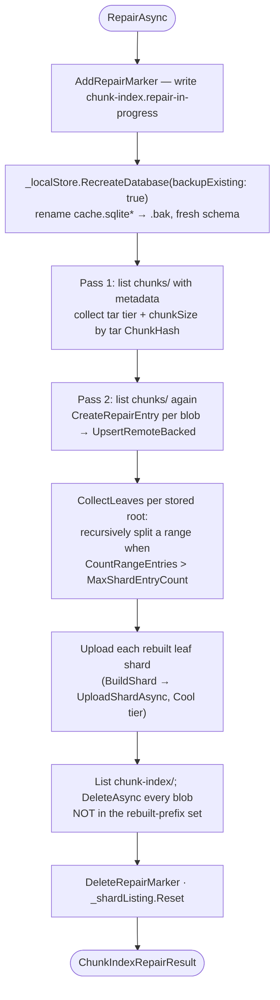

# Repair chunk-index

> **Code:** `src/Arius.Core/Features/RepairChunkIndexCommand/` · `ChunkIndexService.RepairAsync` in `src/Arius.Core/Shared/ChunkIndex/ChunkIndexService.cs`  ·  **Decisions:** [ADR-0015](../../../decisions/adr-0015-chunk-index-scalability.md) · [ADR-0017](../../../decisions/adr-0017-idempotent-non-distributed-recovery.md)  ·  **Terms:** [chunk index](../../../glossary.md#chunk-index) · [shard](../../../glossary.md#shard) · [chunk size](../../../glossary.md#chunk-size) · [storage tier hint](../../../glossary.md#storage-tier-hint)

## Purpose

The recovery path for the [chunk index](../../../glossary.md#chunk-index): it rebuilds every [shard](../../../glossary.md#shard) blob from scratch by reading the *authoritative* committed chunk blobs, then recomputes a freshly-balanced shard layout and deletes everything else under `chunk-index/`. It exists for when the shard layout is corrupt, over-split, or has drifted from the chunk blobs (e.g. after a crash, a multi-machine last-writer-wins overwrite, or a `ChunkIndexCorruptException`/`ChunkIndexRepairIncompleteException`). The chunk blobs — not the shards — are the source of truth.

## How it works

`RepairChunkIndexCommandHandler.Handle` is a thin Mediator wrapper: it logs the `repair-index` phase, calls `index.RepairAsync(ct)`, and maps the outcome into a `RepairChunkIndexResult` (`Success` + the `ChunkIndexRepairResult` counts, or an `ErrorMessage` on failure). `OperationCanceledException` is rethrown; any other exception is caught and reported as a failed result rather than crashing the host. The CLI `repair` verb (`Arius.Cli/Commands/Repair/RepairVerb.cs`) sends the command; the handler is registered in `ServiceCollectionExtensions` with the account/container baked in. All the substance lives in `ChunkIndexService.RepairAsync`.

**Repair marker.** `RepairAsync` writes the `chunk-index.repair-in-progress` marker file (`RepairInProgressMarkerPath`, in the repository local-state dir) *before* it recreates the local DB, and deletes it only after upload and stale-shard deletion both finish. While it exists, every other entry point — `LookupAsync`, `AddEntry(ies)`, `FlushAsync`, `PromoteToSnapshotVersionAsync`, `GetStatistics` — fails fast through `ThrowIfRepairIncomplete()` with `ChunkIndexRepairIncompleteException`. So a repair that crashes mid-flight leaves a tripwire: archive/restore/list refuse to run against a half-rebuilt index until repair is re-run to completion. The marker is local filesystem state, consistent with [non-distributed recovery](../../../decisions/adr-0017-idempotent-non-distributed-recovery.md).

**Local DB reset with backup.** `RecreateDatabase(backupExisting: true)` renames the existing `cache.sqlite`/`-wal`/`-shm` to `.bak` and creates a fresh schema, rather than mutating in place. Repair stages the rebuilt entries into a clean store, and the old cache survives as a `.bak` for forensics.

**Two-pass listing — why.** A [thin chunk](../../../glossary.md#thin-chunk)'s data lives inside its parent tar blob; the thin stub itself is always stored `Cool`, so its real [storage tier hint](../../../glossary.md#storage-tier-hint) and [chunk size](../../../glossary.md#chunk-size) must come from the *parent tar* blob's metadata. Pass 1 lists `chunks/` and collects `(BlobTier, ChunkSize)` keyed by tar `ChunkHash` for every `arius_type == tar` blob. Pass 2 lists `chunks/` again and builds one `ShardEntry` per blob via `CreateRepairEntry`, dispatching on `arius_type`:
- `large` → `CreateLargeRepairEntry`: content hash == chunk hash; size/tier read straight off the blob.
- `thin` → `CreateThinRepairEntry`: looks up the parent tar in the Pass 1 map for tier + chunk size. A parent tar absent from the listing throws `ChunkIndexRepairException` — repair fails rather than persisting a guessed (e.g. hydrated) tier.
- `tar` → `null`: tar blobs contribute no index entry of their own; their members are recovered via the thin stubs.

Keeping the tar metadata in a separate first pass bounds memory by the *tar count*, not the file count — no per-thin remote lookup, no buffering of unresolved thins.

**Re-balance the layout.** After staging, `CollectLeaves` walks each stored 2-hex root and recursively descends (`ChunkIndexRouter.GetChildPrefixes`) wherever `CountRangeEntries(prefix) > MaxShardEntryCount`, collecting the terminal non-empty prefixes into `rebuiltPrefixes`. This recomputes a balanced layout purely from the rebuilt entry counts — it coarsens an over-split layout and splits an under-split one in the same pass. Each rebuilt prefix is materialized with `BuildShard` and uploaded (`UploadShardAsync`, `BlobTier.Cool`, overwrite) under `FlushWorkers` parallelism.

**Delete stale shards.** Finally `RepairAsync` lists `chunk-index/` and deletes every blob whose name is *not* in `rebuiltPrefixes` — sweeping away old parents, leftover children of interrupted splits, and any shard a divergent machine wrote. Then it deletes the marker and calls `_shardListing.Reset()` (the run-scoped listing cache is now stale — the whole layout was just rewritten).

The returned `ChunkIndexRepairResult` reports `ListedChunkCount`, `RebuiltEntryCount`, `RebuiltShardCount` (= `rebuiltPrefixes.Count`), `UploadedShardCount` (non-empty shards actually written), and `DeletedStaleShardCount`.

## Key invariants

- **Chunk blobs are authoritative; shards are derived.** Repair reads `chunks/` and treats whatever shards exist as disposable. Anything not re-derived from a committed chunk blob is deleted. This only holds because a committed chunk blob is one that carries its `arius_type` metadata sentinel — the [commit point](../../../decisions/adr-0017-idempotent-non-distributed-recovery.md). Bodies without metadata are interrupted-run debris and carry no `arius_type`, so `CreateRepairEntry` skips them.
- **The marker brackets the whole rebuild.** It must be written before the DB is recreated and removed only after both upload and stale-delete complete. A crash anywhere in between must leave it present so the index stays quarantined (`ChunkIndexRepairIncompleteException`) until repair finishes cleanly.
- **A missing parent tar fails the repair.** A `thin` entry whose parent tar is not in the listing throws rather than guessing a tier/size — a guessed (hydrated) tier would silently corrupt restore cost and rehydration decisions.
- **Tar blobs never produce their own entry.** Tar members are reconstructed solely from thin stubs; emitting a tar entry would double-count or shadow the thin entries.
- **`MaxShardEntryCount` is the only layout knob.** The rebuilt layout is a pure function of the staged entry counts and this threshold ([ADR-0015](../../../decisions/adr-0015-chunk-index-scalability.md)); there is no manifest to keep consistent.
- **Upload-before-delete.** Rebuilt shards are uploaded before any stale blob is deleted; the delete pass keys off the already-computed `rebuiltPrefixes` set, so a freshly-written shard is never a delete candidate.

## Why this shape

- **Why a full rebuild rather than incremental reconciliation:** the layout is self-describing from which shard blobs exist, with no manifest — so the only trustworthy recovery is to discard the layout and recompute it from the authoritative chunk blobs. See [ADR-0015](../../../decisions/adr-0015-chunk-index-scalability.md) for the sharding model and its split/coarsen asymmetry (a normal flush only splits; a shard coarsens back *only* during repair).
- **Why a local marker instead of a distributed sentinel:** Arius assumes a single writer and no distributed coordinator; recovery is idempotent and non-distributed by design ([ADR-0017](../../../decisions/adr-0017-idempotent-non-distributed-recovery.md)). Re-running repair after a crash simply re-derives everything.
- **Why two listing passes and not one:** thin-chunk tier/size live on the parent tar, and resolving that inline would force per-thin lookups or unbounded buffering; the separate tar-metadata pass keeps memory bounded by tar count.
- The full chunk-index mechanism (routing, sharding, the local SQLite cache, normal flush/split) lives in [chunk-index](../shared/chunk-index.md); this doc covers only the recovery slice.

## Open seams / future

- **Cost.** Repair lists `chunks/` twice and rewrites the entire `chunk-index/` subtree — by [ADR-0015](../../../decisions/adr-0015-chunk-index-scalability.md)'s deliberate bias the once-per-machine cold rebuild is the expensive path; `MaxShardEntryCount = 1024` optimizes the daily incremental archive instead.
- **No partial / scoped repair.** It is all-or-nothing across the whole repository; there is no "repair just root `aa`" mode. A targeted repair would be the natural next seam if cold-rebuild cost becomes a problem.
- **No cross-blob atomicity during the rebuild itself.** Crash-safety rests on the marker quarantine, not on transactional uploads — a crashed repair is *recovered by re-running*, not rolled back. Etag-conditional shard writes (noted as a future hardening in [ADR-0015](../../../decisions/adr-0015-chunk-index-scalability.md) / [ADR-0016](../../../decisions/adr-0016-multi-machine-cache-coherence.md)) would further harden the multi-writer overwrite case that makes repair necessary in the first place.
