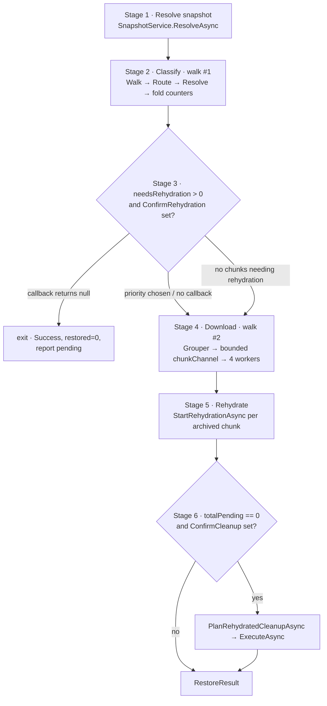
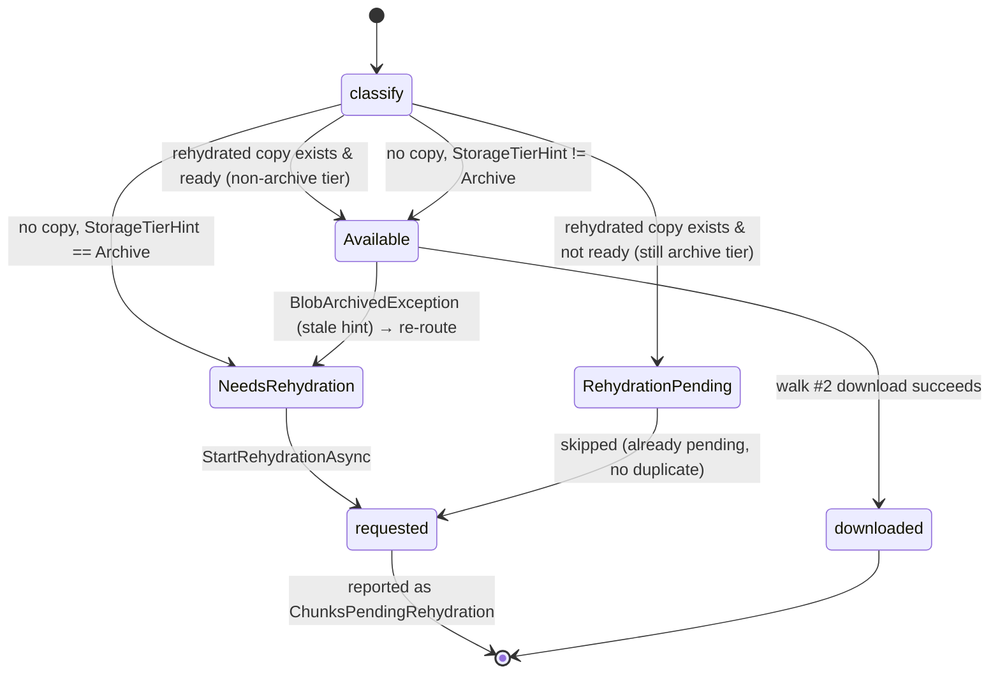

# Restore command

> **Code:** `src/Arius.Core/Features/RestoreCommand/`  ·  **Decisions:** [ADR-0017](../../../decisions/adr-0017-idempotent-non-distributed-recovery.md)  ·  **Terms:** [snapshot](../../../glossary.md#snapshot) · [filetree](../../../glossary.md#filetree) · [chunk size](../../../glossary.md#chunk-size) · [storage tier hint](../../../glossary.md#storage-tier-hint) · [large chunk](../../../glossary.md#large-chunk) · [tar chunk](../../../glossary.md#tar-chunk) · [chunk index](../../../glossary.md#chunk-index)

## Purpose

Materializes the files of a repository [snapshot](../../../glossary.md#snapshot) into a local directory: resolve the snapshot, walk its [filetree](../../../glossary.md#filetree), classify which chunks are downloadable now versus stuck in the archive tier, surface the **rehydration cost** so the user can confirm before any money is spent, then stream the available chunks to disk and kick off rehydration for the rest. The command is **idempotent** ([ADR-0017](../../../decisions/adr-0017-idempotent-non-distributed-recovery.md)) — each run is a self-contained scan-and-act cycle with no local progress state, so re-running after rehydration completes simply picks up where the last run left off.

## How it works

`RestoreCommandHandler.Handle` is one long linear method organized into six numbered stages. The first four read the **same** snapshot twice through `RestoreFilePipeline.GetStreamAsync` — once to classify (with events), once to download (events suppressed). Walking twice instead of buffering the whole file list is cheap because `IFileTreeService.ReadAsync` is cache-backed, and it keeps the must-confirm-before-downloading rule honest: no file is ever written before the cost prompt.

### Stage 1 — Resolve snapshot

`ISnapshotService.ResolveAsync(opts.Version, …)` returns the [snapshot](../../../glossary.md#snapshot) whose timestamp **starts with** the supplied version string (a partial match like `2026-03-21` is accepted), or the latest snapshot when `Version` is `null`. A `null` result is a clean failure (`Success = false`, `ErrorMessage`), not an exception. The resolved `RootHash` ([FileTreeHash](../../../glossary.md#filetreehash)) is the entry point for both walks.

### Stage 2 — Classify (walk #1)

The handler streams `RestoreFilePipeline.GetStreamAsync(fs, rootHash, opts, emitEvents: true, skipped, …)` and folds each `ResolvedFile` into aggregate counters. The pipeline composes three steps as one `IAsyncEnumerable<ResolvedFile>`:

1. **Walk** — `FileTreeWalker.WalkFilesAsync` does a breadth-first queue traversal of the snapshot's filetree nodes, yielding a `FileToRestore` per `FileEntry`. A `TargetPath` prunes the walk: `IsPathRelevant` keeps only branches on the path to the target prefix, and entry-level `StartsWith` filters the leaves. Progress is throttled (every 10 files or 100 ms) via `TreeTraversalProgressEvent`.
2. **Route** (`ShouldRestoreAsync`, parallel ×8) — applies the local-conflict rules and emits a `FileRoutedEvent` carrying a `RestoreRoute`. This is the per-file **disposition**:

   | Local state | `--overwrite` | Route | Restored? |
   |---|---|---|---|
   | missing | — | `New` | yes |
   | exists, hash matches snapshot | — | `SkipIdentical` | no (counted in `skipped`) |
   | exists, hash differs | off | `KeepLocalDiffers` | no (counted in `skipped`) |
   | exists, hash differs | on | `Overwrite` | yes |

   Skip detection hashes the local file (`IEncryptionService.ComputeHashAsync`) and compares to the snapshot's `ContentHash` — so re-runs naturally skip already-restored files, the idempotency property from [ADR-0017](../../../decisions/adr-0017-idempotent-non-distributed-recovery.md).
3. **Resolve** (`ResolveBatchAsync`, batches of 32) — looks each surviving file's content hash up in the [chunk index](../../../glossary.md#chunk-index) via `IChunkIndexService.LookupAsync`, pairing it with its `ShardEntry`. **Any** snapshot-referenced content hash missing from the index throws `InvalidOperationException` with a repair instruction — restore never auto-repairs the index.

For each distinct chunk (deduped by `seenChunks`), `ClassifyChunk` assigns a `ChunkHydrationStatus`, and the handler accumulates the byte/count totals that feed the cost estimate. This is where [chunk size](../../../glossary.md#chunk-size) matters: counters sum `entry.ChunkSize` (the full stored blob size) **per distinct chunk**, while `totalOriginalBytes` sums `entry.OriginalSize` per file.

### The rehydration state machine

`ClassifyChunk` decides a chunk's hydration status from exactly two inputs — one prefix listing (`IChunkStorageService.ListRehydratedChunksAsync`, mapping each chunk that has a `chunks-rehydrated/` copy to ready/not-ready) plus the chunk's index [storage tier hint](../../../glossary.md#storage-tier-hint). There are **no per-chunk storage round-trips** during classification.

`ChunkHydrationStatus.Unknown` exists on the enum (`Shared/ChunkStorage/ChunkHydrationStatus.cs`) but `ClassifyChunk` never returns it — the listing-plus-hint decision is total. A rehydrated copy is **authoritative** over the tier hint: even if the index still says Archive, a ready `chunks-rehydrated/` blob means download-now.

### Stage 3 — Cost estimate + confirm

If `needsRehydrationCount > 0` **and** `opts.ConfirmRehydration` is supplied, the handler computes a `RestoreCostEstimate` via `RestoreCostCalculator` and invokes the callback. Returning `null` cancels: the handler exits with `Success = true`, `FilesRestored = 0`, and `ChunksPendingRehydration` set — **nothing is downloaded or rehydrated**. Returning a `RehydratePriority` continues. When the callback is `null`, archive chunks are rehydrated at `Standard` priority with no prompt. When nothing needs rehydration, this stage is skipped entirely (downloads can proceed without a cost gate).

### The cost model (documentation gap — surfaced here)

`RestoreCostCalculator.Compute` turns classified counts and byte totals into a `RestoreCostEstimate` with four cost components, each split Standard vs High priority where Azure prices them differently. The model is the **only** code in the system that reasons about money, and it is easy to misread, so the actual formulas:

| Component | Formula | Driver |
|---|---|---|
| Archive retrieval | `totalGB × archive.retrieval[High]PerGB` | bytes of chunks **needing a new** rehydration request |
| Archive read ops | `(numberOfBlobs / 10_000) × archive.readOps[High]Per10000` | count of chunks needing rehydration |
| Write ops (to Hot) | `(numberOfBlobs / 10_000) × hot.writeOpsPer10000` | same count (one Hot write per rehydrated copy) |
| Storage (Hot, `monthsStored`=1) | `totalGB × hot.storagePerGBPerMonth × monthsStored` | same GB held in `chunks-rehydrated/` |

`TotalStandard` / `TotalHigh` sum their four components. Three things a reader must not assume:

- **`totalGB` and `numberOfBlobs` are driven by `chunksNeedingRehydration` / `bytesNeedingRehydration` only.** Chunks already pending (`bytesPendingRehydration`) and chunks available for direct download (`downloadBytes`) are carried on the estimate for display but **cost nothing** in the model — they have already been paid for or are not archive retrievals.
- **`opsUnits = numberOfBlobs / 10_000.0` is not rounded up.** Azure bills per operation; the calculator deliberately uses a fractional ratio of the per-10 000 rate rather than the `ceil(N/10000)` the older spec described. For a 200-chunk restore that is `0.02 × readOpsPer10000`, not one full batch.
- **The target tier is hard-coded to Hot.** Rehydrated copies land in `chunks-rehydrated/` (Hot), so the write-ops and storage rows always read `_pricing.Hot`, even though `PricingConfig` also parses `cool` and `cold` rates (currently unused by restore).

Rates load from the **embedded** `pricing.json` (`PricingConfig.LoadEmbedded`, EUR / West Europe, dated in the file's `_comment`). The handler constructs the calculator as `new RestoreCostCalculator(pricing: null)`, and the `pricing` parameter is the only override seam — **there is no working-directory or `~/.arius/pricing.json` file lookup** despite what an earlier OpenSpec restore-pipeline spec once required. Overriding rates today means passing a `PricingConfig` into the constructor in code; the file-override path is an open seam, not a feature.

### Stage 4 — Download (walk #2)

Runs only if `availableCount + rehydratedCount > 0`. A second `GetStreamAsync` (this time `emitEvents: false`) feeds a single **grouper** task that splits work by [chunk](../../../glossary.md#chunk) shape:

- **[Large chunks](../../../glossary.md#large-chunk)** (`entry.IsLargeChunk`, i.e. content hash == chunk hash) are enqueued immediately — one file per chunk.
- **[Tar chunks](../../../glossary.md#tar-chunk)** are accumulated into an `OpenTarChunk` keyed by chunk hash across the whole walk, then enqueued **after** the walk finishes, so each tar is downloaded once and every selected member is extracted in a single streaming pass.

The grouper writes `ChunkToRestore` items into a bounded `Channel` (capacity = `DownloadWorkers` = 4); `Parallel.ForEachAsync` drains it with 4 download workers. Downloads are fully streaming — `IChunkStorageService.DownloadAsync` returns a decrypted, decompressed payload stream that `RestoreLargeFileAsync` copies straight to the target path, and `RestoreTarBundleAsync` reads through with a `TarReader`, matching `tarEntry.Name` against the needed content hashes and skipping the rest. No intermediate temp file; peak temp disk is zero. Each restored file gets its tree timestamps applied and (unless `NoPointers`) a companion [pointer file](../../../glossary.md#pointer-file) via `PointerFileFormat.WriteAsync`.

**Channel-fault coordination:** all walk-#2 work shares a linked `CancellationTokenSource`. A download worker fault surfaces on `await downloadTask`; the `finally` cancels the CTS so the grouper, possibly blocked writing to the now-undrained bounded channel, unblocks instead of deadlocking, then both tasks are observed so nothing faults unobserved.

**Stale-classification re-route:** if a worker throws `BlobArchivedException` (the chunk's tier hint said Available but the blob is actually still archived — e.g. an external lifecycle change between walks), the chunk is added to `rerouteToRehydration` and folded into Stage 5 rather than failing the restore.

### Stage 5 — Rehydrate

For every chunk in `chunksNeedingRehydration` ∪ `rerouteToRehydration` (deduped), `IChunkStorageService.StartRehydrationAsync` requests a rehydrated copy at the chosen priority. Chunks already `RehydrationPending` are **not** re-requested — Azure's `StartCopyFromUri` returns 409 on an archived blob that already has a pending copy, so re-requesting would fail; the pending count is carried straight into `totalPending`. Individual request failures are logged and swallowed (the run still reports what it could start).

### Stage 6 — Cleanup

Only when `totalPending == 0` (everything restorable was restored) **and** `opts.ConfirmCleanup` is supplied: `PlanRehydratedCleanupAsync` previews the count/bytes of leftover `chunks-rehydrated/` copies, and if the callback approves, `ExecuteAsync` deletes them. These are Hot-tier copies that otherwise accrue ongoing storage cost, so cleanup is the natural end of a completed restore.

## Key invariants

- **No file is written before the cost confirmation.** Classification (walk #1) is read-only over the index and one rehydrated-prefix listing; downloads (walk #2) start only after Stage 3 returns a non-null priority. Cancelling rehydration must never leave a partially restored tree.
- **The two walks must select the same files.** Both passes call `GetStreamAsync` with identical `fs`, `rootHash`, and `opts`; only `emitEvents` and `skipped` differ. The Route conflict rules and Resolve lookups must stay deterministic across the two passes, or the download pass could try to restore a file the classify pass never costed (or vice versa).
- **Counters are per-distinct-chunk, sized by `ChunkSize`.** Byte totals dedupe on `seenChunks` and use [chunk size](../../../glossary.md#chunk-size) (the full stored blob), not a per-file share of a tar — required for correct rehydration cost.
- **A rehydrated copy overrides the tier hint.** `ClassifyChunk` consults `ListRehydratedChunksAsync` first; only chunks with no rehydrated copy fall back to `StorageTierHint`. The hint is advisory (the `BlobArchivedException` re-route is the safety net when it is stale).
- **Pending rehydrations are never re-requested.** Duplicate `StartRehydrationAsync` on an already-pending blob is an Azure error; the `RehydrationPending` status exists precisely to keep re-runs idempotent ([ADR-0017](../../../decisions/adr-0017-idempotent-non-distributed-recovery.md)).
- **Restore never repairs the index.** A missing index entry or a corrupt/incomplete shard surfaces as a typed failure (`ChunkIndexCorruptException`, `ChunkIndexRepairIncompleteException`, `ChunkIndexLocalStoreException`, or the "missing from the chunk index" `InvalidOperationException`) with an explicit "run the repair command" instruction.

## Why this shape

- **Idempotent, stateless re-run instead of persisted progress** — see [ADR-0017](../../../decisions/adr-0017-idempotent-non-distributed-recovery.md). Restore keeps no local checkpoint; correctness comes from hashing local files (skip already-restored), recognizing the `RehydrationPending` state (no duplicate requests), and downloading whatever has since rehydrated. This is why a restore against archive-tier data is naturally a multi-run sequence: request rehydration, wait ~hours, re-run to download.
- **Walk twice, don't buffer** — the classify pass must produce exact pre-download counts for the cost prompt, and buffering every `ResolvedFile` for a large snapshot is unbounded memory. A second cache-backed walk is the cheaper, memory-bounded alternative; the type-level doc comment on `RestoreCommandHandler` records this trade-off.
- **Cost model is a deliberate, embedded approximation** — the four-component model exists so the user sees an order-of-magnitude bill before committing to archive retrieval (which is the expensive, slow operation). It is intentionally simple (Hot target tier, `monthsStored = 1`, fractional op-units) rather than a precise Azure invoice simulator.
- **Tar grouping after the walk** — tar members are scattered across the filetree, so the grouper must see the whole walk before it knows the full member set of any tar; only then can it download each tar exactly once.

## Open seams / future

- **Pricing override is unimplemented.** `RestoreCostCalculator(PricingConfig?)` is the only override point and the handler always passes `null` → embedded `pricing.json`. The historical working-dir / `~/.arius/pricing.json` lookup (specified by an earlier OpenSpec restore-pipeline spec) does not exist; wiring it would go through `RestoreOptions` into the handler's calculator construction.
- **`cool`/`cold` pricing tiers are parsed but unused.** Rehydrated copies are hard-coded to the Hot tier; restoring into a cheaper target tier would let the cost model use the already-loaded `Cool`/`Cold` rates.
- **Duplicate large files re-download.** The grouper enqueues one `ChunkToRestore` per large-chunk occurrence (`// TODO if we restore a duplicate large file - can we optimize?`); two local paths backed by the same large chunk download it twice. Tar duplicates are already handled (one download, `fs.CopyFile` for extra members).
- **Cost-affecting re-routes are not re-confirmed.** A `BlobArchivedException` re-route adds rehydration cost after the user already confirmed; it is logged ("extra cost-effect") but the user is not re-prompted.
- **`monthsStored` is fixed at 1.** The parameter exists on `Compute` but no caller varies it; surfacing it would let the estimate reflect how long the user expects to keep rehydrated copies before cleanup.
