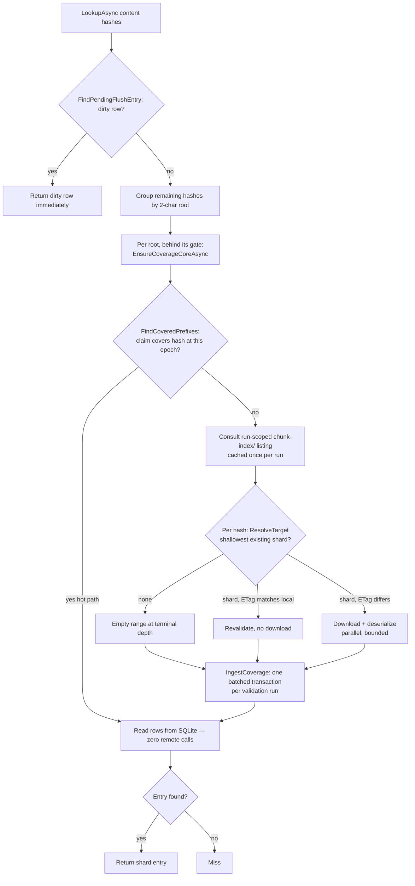
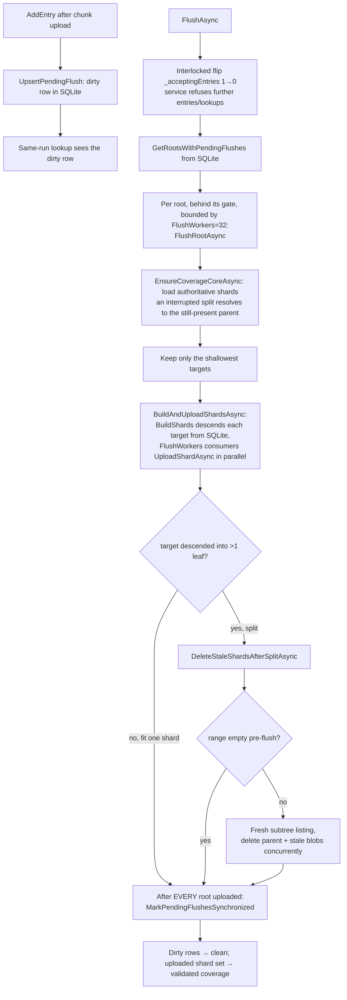

# Chunk index

> **Code:** `src/Arius.Core/Shared/ChunkIndex/` (`ChunkIndexService`, `ChunkIndexRouter`, `ChunkIndexLocalStore`, `Shard`/`ShardEntry`, `ShardSerializer`, `IChunkIndexService`)
> · **Decisions:** [ADR-0015 dynamic-length sharding](../../../decisions/adr-0015-chunk-index-scalability.md) · [ADR-0016 cache coherence](../../../decisions/adr-0016-multi-machine-cache-coherence.md) · [ADR-0017 idempotent recovery](../../../decisions/adr-0017-idempotent-non-distributed-recovery.md)
> · **Terms:** [chunk index](../../../glossary.md#chunk-index) · [shard](../../../glossary.md#shard) · [content hash](../../../glossary.md#content-hash) · [chunk hash](../../../glossary.md#chunk-hash) · [chunk size](../../../glossary.md#chunk-size) · [storage tier hint](../../../glossary.md#storage-tier-hint) · [epoch](../../../glossary.md#epoch)

## Purpose

The [chunk index](../../../glossary.md#chunk-index) is Arius's deduplication index: it maps each file's [content hash](../../../glossary.md#content-hash) to the stored [chunk hash](../../../glossary.md#chunk-hash), original size, stored [chunk size](../../../glossary.md#chunk-size), and [storage tier hint](../../../glossary.md#storage-tier-hint) (`ShardEntry`). `ChunkIndexService` is the single facade for it: it answers dedup/restore/list lookups, records newly uploaded chunks, and persists the index into remote [shard](../../../glossary.md#shard) blobs — sitting between the feature handlers and Azure Blob Storage so the index is consulted without a round-trip per file. The remote layout (`chunk-index/{prefix}` blobs) is authoritative; a local SQLite store is a discardable cache plus a durable holding pen for not-yet-flushed entries.

## How it works

The component has three concerns, each in its own type, all constructed *inside* the facade (none is a separate DI service — callers only see `IChunkIndexService`):

| Concern | Type | Owns |
|---|---|---|
| Orchestration / remote I/O | `ChunkIndexService` | Lookup, flush, split, repair, the run-scoped shard listing, per-root gates |
| Routing | `ChunkIndexRouter` (static) | Mapping a content hash to its authoritative shard given the existing blob set |
| Local state | `ChunkIndexLocalStore` | The only owner of the SQLite schema, connections, and transactions |

`Shard`/`ShardEntry` are the in-memory page and row; `ShardSerializer` is the wire codec (zstd + optional AES-256-GCM).

### Dynamic-length sharding (the remote layout)

Entries are grouped into shards named by a hex prefix of the content hash, with a **dynamic length**. Every hash maps to a fixed 2-char *root* (256 roots, e.g. `chunk-index/aa` — `ChunkIndexService.MinShardPrefixLength = 2`). When a shard's merged entry count exceeds `MaxShardEntryCount` (1024) at flush time, it is split 16-way by the next hex char (`aa` → `aa0`..`aaf`), recursively and unevenly per subtree (`aaf` may later split into `aaf0`.. while `ab` never splits). Only non-empty leaves are written, and **there is no layout manifest** — the layout is self-describing from which shard blobs exist. The model is 256 independently gated recursive subtrees, not one global tree: discovery, gating, and parallelism are all anchored on the fixed 256 roots, while depth grows only where data is dense. See [ADR-0015](../../../decisions/adr-0015-chunk-index-scalability.md) for the decision and the write-amplification model behind 1024.

### Parent-wins routing

`ChunkIndexRouter.ResolveTarget` resolves a hash to a `ShardTarget` (either an existing shard, or the terminal depth where the hash's range is empty and a new shard would be written). It walks down from the hash's 2-char root and returns the **shallowest existing shard blob on the hash's prefix path** — parent wins. If no blob exists on the path, it descends while any *strictly deeper* blob shares the prefix (`BuildDescendantPrefixes` precomputes the proper-prefix set once per subtree so the "does a descendant exist?" test is O(1) instead of O(shards) per hash); the terminal empty depth is where new entries would be written.

Parent-wins is what makes a split crash-safe (see invariants). It also makes an interrupted split self-healing on read: a leftover deeper child can coexist with its still-present parent, and lookups simply resolve to the parent (the shallowest) until a flush re-splits.

### Local store: dirty vs. clean rows, lazy validation

`ChunkIndexLocalStore` keeps everything in one SQLite database (`cache.sqlite`, WAL, `synchronous = normal`, schema_version 1). One row table distinguishes two states by the `pending_flush` column:

- `pending_flush = 1` (**dirty**) — current-run or retryable archive state recorded by `AddEntry` after a chunk was durably uploaded. Must never be discarded silently.
- `pending_flush = 0` (**clean**) — discardable hydrated cache rows downloaded from remote shards; can be cleared and rehydrated.

A second table, `loaded_prefixes`, holds **non-overlapping coverage claims**: per validated prefix it records remote existence, the remote blob ETag, and the snapshot version it was validated under. This is the lazy per-prefix validation state — it lets routine snapshot changes avoid a repository-wide purge: a touched prefix is trusted if its claim was validated at the current latest-snapshot [epoch](../../../glossary.md#epoch); otherwise only that prefix is revalidated against its current remote ETag. The `UpsertLoadedPrefix` write deletes any strict ancestor/descendant claim so claims stay pairwise non-nested.

> **Why SQLite, not a tiered shard cache:** this replaced an earlier in-memory LRU of whole shard pages plus plaintext per-prefix disk-shard files plus a `--dedup-cache-mb` budget. There is no L1/L2 shard cache anymore; SQLite is the single local working store, so `InvalidateCaches` just clears the remote-backed rows and coverage claims (`ClearRemoteBackedCache`) and resets the run-scoped listing.

### Lookup flow

`LookupAsync` returns dirty rows immediately (they win over remote state); for the rest it groups hashes by 2-char root and validates each root's coverage under the latest snapshot epoch, downloading only the shards whose ETag changed. The distinct roots load concurrently (`PrefixLoadWorkers = 8`), each behind its per-root gate (`_rootGates`); within one root's validation the touched shards download in parallel and all results are applied to SQLite in **one** batched `IngestCoverage` transaction (the resolved prefixes are pairwise non-nested by the parent-wins walk, so their coverage-overlap deletes cannot clobber one another, and the fan-out never contends on the write lock).

A shard listed at snapshot time but gone at download time is a **racing split**: `LoadShardAsync` records it as `raced`, the run-scoped listing is `Reset()` once, and the resolution retries from a fresh listing (bounded to a single retry per call). After the retry a still-missing shard is treated as an empty range.

### Write + flush flow

`AddEntry`/`AddEntries` upsert dirty rows after the referenced chunk artifact is uploaded (so a dirty row is always backed by a durable blob and is retryable across restarts). `FlushAsync` is the archive-tail operation:

After flush, `ArchiveCommandHandler` publishes the new snapshot and calls `PromoteToSnapshotVersionAsync`, which rewrites `loaded_prefixes.snapshot_version` from the run-start snapshot to the newly published one — so prefixes validated during the run stay trusted under the new epoch without re-probing remote (a no-op when the names are equal).

### Building shards: one DB-driven descent for flush and repair

Both flush and repair turn a set of base prefixes into balanced leaf shards through the **same** two methods, so there is no second split algorithm to keep in sync:

- `BuildShards(prefix)` is a recursive generator over the local store. `CountRangeEntries(prefix)` — an index-only `COUNT(*)` on the `content_hash` primary-key autoindex — decides whether the range fits `MaxShardEntryCount`: if it fits, it yields one shard built from `ReadRangeEntries` (`BuildShard`); if it overflows, it descends 16-way via `ChunkIndexRouter.ChildPrefixes` and yields each child's shards. The database drives the shape — there is no in-memory whole-shard split (the former `PartitionIntoLeaves` is gone), and only one shard is ever resident regardless of repository size or hash distribution.
- `BuildAndUploadShardsAsync(basePrefixes)` runs that lazy producer against `FlushWorkers` parallel `UploadShardAsync` consumers via `Parallel.ForEachAsync` — which serializes the enumerator (the producer's sequential SQLite reads) and bounds in-flight shards to ~`FlushWorkers`, so peak memory is independent of repository size and there is no hand-rolled bounded channel.

`FlushRootAsync` invokes it with the run's shallowest pending targets — and for any target that descended into more than one leaf (a *split*) removes the now-stale parent afterward via `DeleteStaleShardsAfterSplitAsync`. `RepairAsync` invokes it with every stored root and instead sweeps all non-rebuilt `chunk-index/` blobs wholesale.

### Run-scoped shard listing

Layout discovery (which shards exist, with their ETags) needs a blob listing. Because the service is rebuilt per command and is the sole writer for the run, the remote layout is stable for the run, so the *entire* `chunk-index/` subtree is listed **once** (`ListAllShardsAsync`, Azure auto-pages at 5000 blobs/page) and reused for every root and leaf. It is held in a `ResettableAsyncLazy` (`_shardListing`) grouped by 2-hex root; a faulted fetch is replaced so a transient list error doesn't poison the run. It is `Reset()` by `InvalidateCaches` (epoch mismatch), by `RepairAsync` (layout rewritten), and once on a racing-split 404. The destructive post-split delete scan deliberately reads a **fresh** per-root listing (`ListShardSubtreeAsync`), never the run-scoped cache.

### Repair

`RepairAsync` is the explicit, idempotent rebuild from authoritative chunk blobs (see [ADR-0017](../../../decisions/adr-0017-idempotent-non-distributed-recovery.md)). Both the remote shards *and* the local SQLite cache are a **derived** projection: every field of a `ShardEntry` is independently recoverable from metadata the chunk blobs carry *themselves* — `arius_type` + sizes on a `large`/`tar` blob, `parent_chunk_hash` on a `thin` stub, and, for an Archive-tier chunk migrated from v5 that cannot take its own metadata, a [chunk metadata sidecar](../../../decisions/adr-0018-archive-tier-metadata-sidecar.md). That per-blob metadata is the durable source of truth — which is *why* it is written at all, and why the index can be treated as disposable: if the layout is ever corrupt, over-split, or drifted, repair simply discards it and re-derives every entry from `chunks/`. It writes a repair-in-progress marker (a file outside the purgeable cache), recreates the local SQLite database (moving the `cache.sqlite{,-wal,-shm}` family aside to `.bak`), then rebuilds the entries from a **single** metadata listing of `chunks/`: a `large` chunk yields an entry inline (content-hash == chunk-hash); a `thin` chunk is written through with its parent tar in `chunk_hash` and a placeholder tier/size; a `tar` contributes no entry of its own but its `(tier, chunk size)` is remembered (`arius_type` is the completion sentinel, so a body without it is skipped). Entries stream into SQLite in 1024-row batches (`UpsertRemoteBacked`). Because a thin chunk's real tier/size live on its parent tar — which, ordered by hash, may be listed *after* the thin chunk — `EnrichThinChunks` fills them in once the listing is complete with one `UPDATE` per tar (an index seek on `ix_chunk_index_entries_chunk_hash`, not a table scan); a referenced parent tar missing from the listing fails the repair rather than persisting a guessed tier. It then rebuilds a fresh balanced layout from the staged counts through the same `BuildAndUploadShardsAsync` descent that flush uses, deletes every `chunk-index/` blob not in the rebuilt set, and only then clears the marker. Peak memory scales with the tar count, not the small-file count. Repair never publishes a snapshot — the full recovery slice is documented in [repair-chunk-index](../features/repair-chunk-index.md).

### Wire format

A shard is newline-delimited plaintext, sorted by content hash, then zstd-compressed and optionally AES-256-GCM-encrypted (`ContentTypes.ChunkIndexGcmEncrypted = application/aes256gcm+zstd`, else `application/zstd`). Field count is the discriminator: 4 fields = large file (`content-hash original-size chunk-size tier-hint`, chunk-hash reconstructed as content-hash); 5 fields = tar-bundled small file (explicit `content-hash chunk-hash original-size chunk-size tier-hint`). The tier-hint wire mapping (hot=1, cool=2, cold=3, archive=4) is explicit and independent of the `BlobTier` enum ordering.

## Key invariants

- **Dirty rows are sacrosanct.** `pending_flush = 1` rows are durable archive operational state, never silently discarded. `ClearRemoteBackedCache`/`InvalidateCaches` delete only `pending_flush = 0` rows and all coverage claims; the remote-ingest upsert (`preservePendingFlushRows: true`) refuses to overwrite a dirty row; `IngestCoverage`'s range deletes are `WHERE pending_flush = 0`. A dirty row may be flushed by a *later* run even if the run that recorded it never published a snapshot.
- **Dirty rows are recorded only after a durable upload.** `AddEntry` must run after the referenced large/thin chunk blob is committed — that is what makes a dirty row a valid retry target across process restarts.
- **Split: upload all leaves before any delete.** A split uploads every non-empty leaf (`BuildAndUploadShardsAsync`) *before* `DeleteStaleShardsAfterSplitAsync` deletes the parent or any stale blob in range. A crash mid-split leaves the parent intact; because the run's snapshot was never published, the parent still contains everything any published snapshot references, so parent-wins reads stay correct with no sentinel. The crashed run's rows stay dirty and a retry re-resolves the parent and re-splits. (See [ADR-0015](../../../decisions/adr-0015-chunk-index-scalability.md).)
- **Coverage claims never overlap.** `loaded_prefixes` is kept pairwise non-nested (`UpsertLoadedPrefix` deletes strict ancestors/descendants). This is why a whole validation run's claims can be applied in one transaction, and why leaf claims correctly replace a split parent's claim.
- **Flush marks rows clean only after *every* root uploaded.** `MarkPendingFlushesSynchronized` runs after the full `Parallel.ForEachAsync` over roots completes; a partial flush failure leaves dirty rows dirty and publishes no snapshot.
- **Nothing mutates remote `chunk-index/` blobs between dedup and flush except `FlushAsync` itself.** This sole-writer-per-window assumption is what makes reusing the run-start listing at flush correct. Any future mutation in that window must `Reset()` the listing. (See [ADR-0016](../../../decisions/adr-0016-multi-machine-cache-coherence.md).)
- **Per-root serialization.** A single `_rootGates` semaphore per 2-char root serializes hydrate/ingest/flush/upload for that subtree, so two operations can never download/ingest/upload the same root concurrently; different roots proceed in parallel.
- **Single owner of local SQLite.** Only `ChunkIndexLocalStore` defines the schema, opens connections, and runs transactions; writes serialize on `_localStateGate` plus Microsoft.Data.Sqlite busy-retry. SQLite calls are synchronous (SQLite has no real async I/O); async stays at the remote-I/O boundary.
- **The facade is the boundary.** `LookupAsync`/`AddEntry`/`FlushAsync`/`GetStatistics` are `internal` interface members; callers outside `Shared/ChunkIndex` never compute prefixes or touch the router/store directly. Architecture tests enforce this.
- **Three failure states stay separate.** Dirty rows = valid archive state (retry). Local SQLite failure = `ChunkIndexLocalStoreException` ("delete the local cache dir and retry, or repair"). A remote shard that exists but won't deserialize = `ChunkIndexCorruptException` (repository corruption → explicit repair). An interrupted repair marker = `ChunkIndexRepairIncompleteException`. Normal ops fail while the marker exists; explicit repair is allowed to run with it present so an interrupted repair can be rerun. A valid shard that simply lacks a hash is a trusted miss — never an auto-repair.

## Why this shape

- **Dynamic-length sharding over a single blob or fixed-width prefixes** — bounded shard size keeps incremental write-amplification low while depth adapts to repository size with no manifest and no operator tuning; `MaxShardEntryCount = 1024` deliberately optimizes the daily incremental archive over the once-per-machine cold rebuild. See [ADR-0015](../../../decisions/adr-0015-chunk-index-scalability.md).
- **Lazy per-prefix validation against the snapshot epoch, not a repository-wide purge** — routine snapshot changes revalidate only touched prefixes, and only when their remote ETag actually differs. Mutable shard blobs (unlike content-addressed tree blobs) are *why* validation is needed at all. See [ADR-0016](../../../decisions/adr-0016-multi-machine-cache-coherence.md).
- **Idempotent crash recovery via parent-wins + upload-before-delete + a repair marker, not distributed locks** — an interrupted flush/split/repair is always safely re-runnable. See [ADR-0017](../../../decisions/adr-0017-idempotent-non-distributed-recovery.md).
- **SQLite as the single local store** — replaced the prior three-tier (LRU + plaintext shard files + memory budget) cache, collapsing dirty-state, clean-cache, and validation state into one transactional store with no managed-memory budget to tune.

## Open seams / future

- **Multi-machine last-writer-wins.** Concurrent archives from two machines into the same repository can overwrite each other's shard rewrites; repair recovers. ETag-conditional `chunk-index/` writes are the natural hardening and are explicitly the future seam called out by [ADR-0016](../../../decisions/adr-0016-multi-machine-cache-coherence.md). Any such change must also `Reset()` the run-scoped listing on remote mutation.
- **Split is one-directional in normal flush.** A shard coarsens back only during full `RepairAsync`, never when entries are deleted incrementally — incremental deletes are not modeled.
- **Listing beyond ~1.3M chunks** — the design point fits one 5000-blob Azure page; past it the run-scoped listing simply fetches additional pages (gradual, not a cliff).
- **`MaxCoveragePrefixLength = 8`** caps how deep `FindCoveredPrefixes` probes claims; a (never-produced) deeper claim re-validates harmlessly rather than being matched — correctness-safe, but the bound moves if the layout ever grows past depth 8.
- **`LookupAsync(ContentHash)` single-hash overload** is marked for possible deprecation in `IChunkIndexService` in favor of the batched overload.
- **Single-shot after flush (provider lifetime).** `FlushAsync` flips `_acceptingEntries` 1→0; the instance then refuses further entries and lookups. This is harmless for a short-lived CLI provider, but a long-lived host must not reuse a flushed provider for another mutation — the Api uses fresh per-job providers and evicts after archive. See [service lifetimes](../../cross-cutting/service-lifetimes.md).
