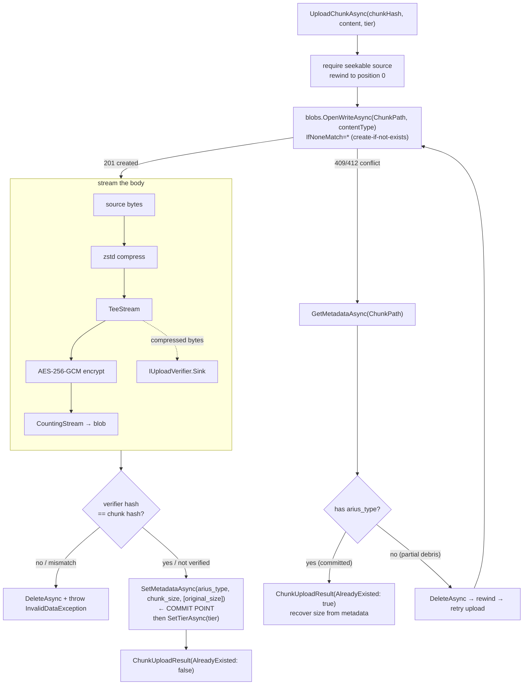
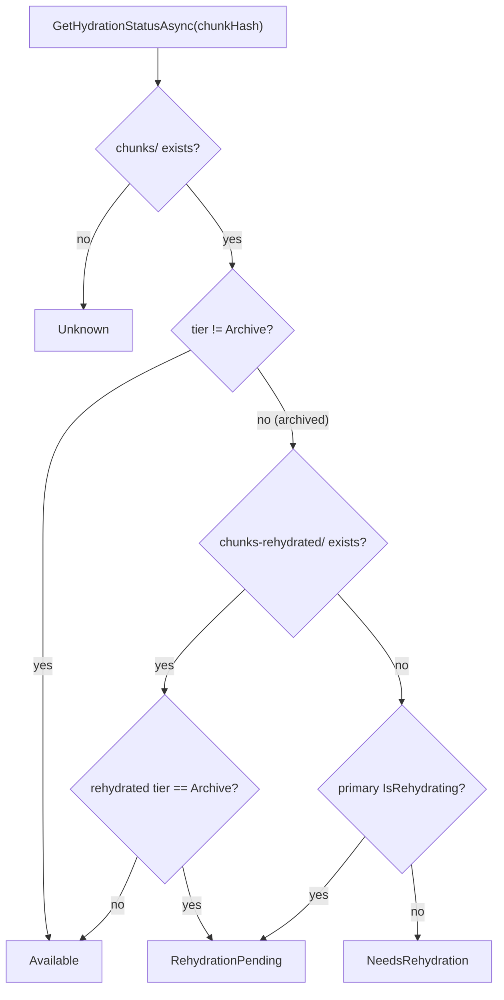

# Chunk storage

> **Code:** `src/Arius.Core/Shared/ChunkStorage/` (`ChunkStorageService.cs`)  ·  **Decisions:** [ADR-0017](../../../decisions/adr-0017-idempotent-non-distributed-recovery.md)  ·  **Terms:** [chunk](../../../glossary.md#chunk) · [large chunk](../../../glossary.md#large-chunk) · [tar chunk](../../../glossary.md#tar-chunk) · [thin chunk](../../../glossary.md#thin-chunk) · [storage tier hint](../../../glossary.md#storage-tier-hint)

## Purpose

`ChunkStorageService` owns the **chunk blob protocol**: how a [chunk](../../../glossary.md#chunk) is encoded onto and decoded off Azure Blob Storage. It is the single place that constructs chunk blob names, drives the compress → encrypt → upload stack, writes the metadata that marks a blob *committed*, and resolves rehydration state for archive-tier blobs. It deliberately knows **nothing about content-hash lookup** — that is the chunk index's job (see [`chunk-index.md`](./chunk-index.md)).

## How it works

Feature handlers hold an `IChunkStorageService` and never touch `BlobPaths.ChunkPath(...)`, content types, or chunk metadata keys themselves. The service collaborates with three lower-level services injected through its primary constructor: `IBlobContainerService` (raw blob I/O), `ICompressionService` (zstd), and `IEncryptionService` (AES-256-GCM).

### The three upload shapes

There is no kind-switching `Upload(kind, …)`; each chunk realization has its own entry point, distinguished only by blob-path convention and the `arius_type` metadata value:

| Method | Body | `arius_type` | Notes |
|---|---|---|---|
| `UploadLargeAsync` | one file, compressed (+encrypted) | `large` | `chunk hash == content hash` |
| `UploadTarAsync` | a tar bundle of small files, compressed (+encrypted) | `tar` | no `original_size` — that lives on the thin chunks |
| `UploadThinAsync` | **empty** | `thin` | a pointer; metadata carries `parent_chunk_hash` |

`UploadLargeAsync` and `UploadTarAsync` both forward to the private `UploadChunkAsync`, differing only by `ariusType` and an `isTar` flag (which selects the content type and suppresses `original_size`). Both return a `ChunkUploadResult(ChunkHash, StoredSize, AlreadyExisted, OriginalSize?)` the caller records in the index.

### Body-first, metadata-sentinel commit

This is the load-bearing invariant of the whole protocol — see [ADR-0017](../../../decisions/adr-0017-idempotent-non-distributed-recovery.md). `UploadChunkAsync` streams the body first and writes the `arius_type` metadata **last**, so metadata presence *is* the commit point. There is no transaction across body + metadata + index; recovery is reconstructed by reading the blob's own metadata.



The conflict path (`catch (BlobAlreadyExistsException)`) is what makes re-runs idempotent: a blob already carrying `arius_type` is reused (size recovered via `TryReadOriginalSize`); a body blob *without* it is debris from an interrupted run and is deleted and retried. `OriginalSize` is omitted on tar blobs (`if (!isTar)`) because a tar's per-file sizes live on its thin chunks.

### Inline round-trip verification

The upload stack tees the compressed bytes into an `IUploadVerifier` (see `UploadVerifier.cs`) so the stored frame is confirmed restorable *before* the commit metadata is written — never by re-downloading the offline archive-tier blob. `RoundTripVerifier` decompresses the tee'd bytes on a background task through a bounded `Pipe` (flat memory) and re-hashes; `NoopVerifier` (`Stream.Null` sink) is used for codecs Arius already trusts (the legacy BCL gzip path). If the restored hash differs from the chunk hash, the blob is deleted and the upload fails loudly rather than recording an unrecoverable chunk. (See [ADR-0017](../../../decisions/adr-0017-idempotent-non-distributed-recovery.md) and the round-trip rationale in [`compression.md`](./compression.md).)

### Thin chunk upload

`UploadThinAsync` uploads an **empty** body to `chunks/<content-hash>` with metadata `arius_type=thin`, `parent_chunk_hash`, `original_size`, `chunk_size`, always at `BlobTier.Cool`. It runs the same conflict recovery as large/tar: an existing blob with `arius_type` is accepted (`return false`); one without is deleted and retried. The return value distinguishes *created* (`true`) from *already-committed* (`false`).

### Download

`DownloadAsync` mirrors the upload stack in reverse and returns **plaintext** the caller can restore or untar directly:

```text
SelectReadableChunkBlobAsync → blobs.DownloadAsync → [progress] → decrypt → decompress → ChunkDownloadStream
```

`SelectReadableChunkBlobAsync` prefers the rehydrated copy (`chunks-rehydrated/<hash>`) when it exists and is **not** archive-tier; otherwise it falls back to `chunks/<hash>`. `ChunkDownloadStream` is a thin wrapper whose only job is to own disposal of the whole decrypt/decompress/download stack as one unit. The read path auto-detects gzip vs zstd from the frame header, so content type is informational only.

### Hydration status & rehydration lifecycle

`GetHydrationStatusAsync` is the single authority for resolving a chunk's hydration state into the shared `ChunkHydrationStatus` enum (`Unknown`, `Available`, `NeedsRehydration`, `RehydrationPending`):



`StartRehydrationAsync` is a server-side copy from `chunks/<hash>` to `chunks-rehydrated/<hash>` targeting `BlobTier.Cold` with a `RehydratePriority` — a temporary readable copy, leaving the archive-tier original untouched.

Cleanup is two-phase so restore can preview before deleting: `PlanRehydratedCleanupAsync` enumerates the `chunks-rehydrated/` prefix **once**, capturing `ChunkCount` and `TotalBytes`, and returns an `IRehydratedChunkCleanupPlan`. The plan's `ExecuteAsync` then deletes those captured names with 16 parallel workers and returns the actual `RehydratedChunkCleanupResult` — no second enumeration. `ListRehydratedChunksAsync` is the bulk counterpart used by listings: a single prefix listing mapping each chunk hash to *ready* (non-archive tier) vs *still rehydrating* (archive tier), avoiding per-chunk metadata calls.

## Key invariants

- **Metadata presence = commit; snapshot last.** The `arius_type` sentinel is written only after the body succeeds and round-trips. A body blob without `arius_type` is partial debris, safe to delete and retry. ([ADR-0017](../../../decisions/adr-0017-idempotent-non-distributed-recovery.md))
- **Storage owns the blob protocol; the index owns lookup.** Feature handlers never construct chunk blob names, pick content types, write chunk metadata keys, or build the compress/encrypt chain — those live only here. Content-hash → chunk-hash resolution lives only in the chunk index. (Mixing them is the failure mode this split prevents.)
- **Upload sources must be seekable.** `UploadChunkAsync` throws if `!content.CanSeek`, because the conflict-recovery retry rewinds and re-streams the body.
- **Round-trip verification gates the commit.** A chunk whose stored frame does not decompress back to its chunk hash is deleted, not recorded — the archive tier is offline and cannot be re-verified later.
- **Download returns plaintext.** The returned stream is already decrypted and decompressed; callers (large-file restore, tar extraction) consume bytes directly.
- **Rehydration never mutates the original.** It copies `chunks/` → `chunks-rehydrated/`; the archive-tier source is left in place, and the rehydrated copy is transient (cleaned up after restore).

## Why this shape

- **No transaction, no coordinator, no pre-flight scan.** Body-first + metadata-sentinel makes the commit a property of the blob itself, so any re-run converges by reading metadata — the alternatives (per-chunk `HEAD`, a distributed lock, a per-tar sidecar manifest) were rejected in [ADR-0017](../../../decisions/adr-0017-idempotent-non-distributed-recovery.md).
- **Verify at write time, not by re-read.** The archive tier is offline; the only cheap moment to confirm a chunk restores is while its bytes still stream past, hence the tee + bounded-pipe verifier rather than a later download.
- **Three explicit upload methods, not a kind switch.** The realizations differ in body shape and metadata, not in a runtime kind flag — separate methods keep callers honest about which one they mean (spec scenarios: *"call `UploadTarAsync` rather than a generic kind-switching upload API"*).
- **Plan/execute cleanup split.** Restore must show the user a confirmation total before deleting rehydrated blobs; capturing it during the single planning enumeration avoids listing `chunks-rehydrated/` twice.

## Open seams / future

- **Legacy read variants.** `ContentTypes` still carries CBC/gzip variants for reading pre-zstd blobs; new writes are always zstd + GCM. When legacy blobs are no longer in the wild these can be dropped.
- **No background reaper for partial debris.** Interrupted-upload bodies are cleaned up *lazily* — only when a later run re-attempts the same chunk hash and hits the conflict path. Orphaned bodies for chunks never re-archived persist until a future sweep mechanism exists.
- **Rehydration target is hardcoded to `BlobTier.Cold` / 16 delete workers.** Tier and parallelism are constants; surfacing them as policy is a future change point if rehydration economics shift.
