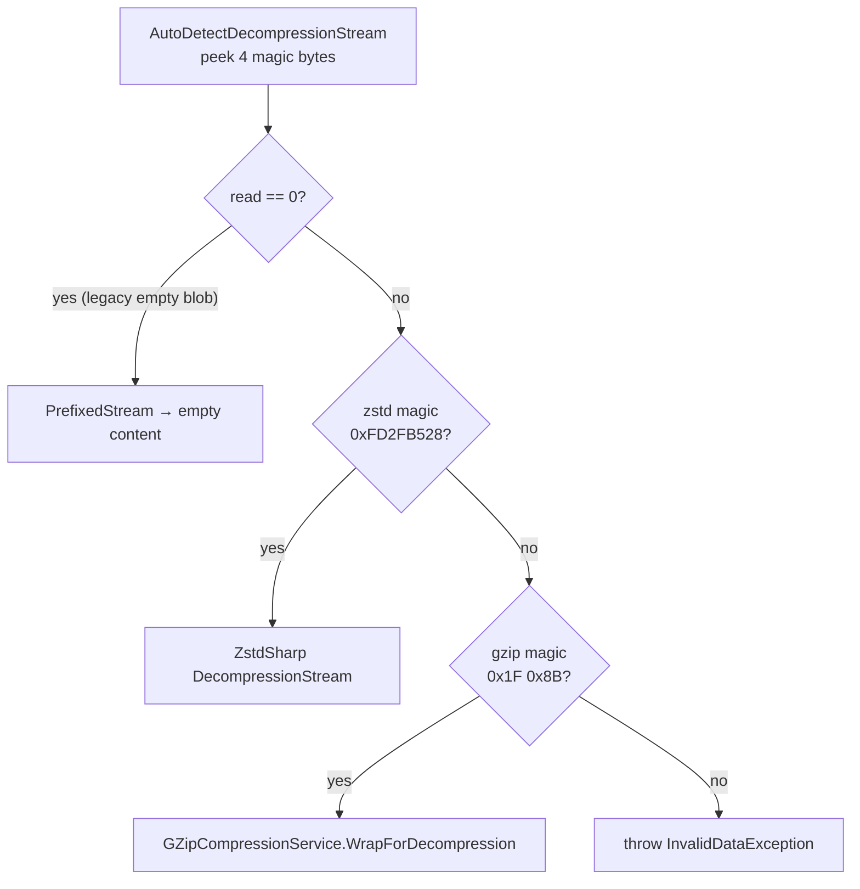

# Compression

> **Code:** `src/Arius.Core/Shared/Compression/*`  ·  **Decisions:** [ADR-0012](../../../decisions/adr-0012-zstd-as-new-compression-algorithm.md)  ·  **Terms:** [chunk](../../../glossary.md#chunk)

## Purpose

The compression boundary that all blob bodies pass through. `ICompressionService` wraps a stream with a codec layer the same way `IEncryptionService` does, so feature handlers and serializers stay codec-agnostic. New blobs are always written as zstd; the read path is self-describing and transparently decodes both new zstd and legacy gzip frames.

## How it works

`ICompressionService` exposes two stream-wrapping methods plus one capability flag:

- `WrapForCompression(destination)` returns a write-only stream that compresses into `destination`; disposing it finalizes the frame.
- `WrapForDecompression(source)` returns a read-only stream that decompresses from `source`.
- `RequireRoundTripVerification` tells [`ChunkStorageService`](./chunk-storage.md) whether uploads of this codec must be verified inline.

`ZstdCompressionService` is the only registered implementation (`ServiceCollectionExtensions` binds it as a singleton). It writes RFC 8878 zstd frames via `ZstdSharp.Port` (pure-managed) and owns a static `GZipCompressionService` instance to which it delegates legacy reads.

The write path uses `CompressionStream` with two parameters set explicitly: `ZSTD_c_checksumFlag = 1` (so decode-time corruption fails loudly, matching gzip's always-on CRC) and `ZSTD_c_nbWorkers = 0` (single-threaded; ZSTDMT is the least-cross-checked part of the port). Compression level — the one ratio/speed knob — comes from the ctor default `ZstdCompressionService.DefaultCompressionLevel` (currently 15).

The read path never consults blob metadata. `WrapForDecompression` returns an `AutoDetectDecompressionStream` that, on first read, peeks 4 bytes, then routes:

The peeked bytes are replayed via a `PrefixedStream` so the chosen decoder sees a complete frame (the magic is "un-peeked"). `read == 0` maps to empty content because the legacy gzip era wrote empty payloads as 0-byte blobs.

**Inline round-trip verify** (zstd only, gated by `RequireRoundTripVerification`): `ChunkStorageService` tees the compressed bytes through a `TeeStream` to both the upload and a `RoundTripVerifier`, which decompresses them on a background task over a bounded pipe and re-hashes. The restored hash is compared to the [chunk hash](../../../glossary.md#chunk-hash) before the chunk is recorded — so an encoder bug fails the archive while the source is still on disk, never on a future restore. Trusted gzip uses a `NoopVerifier`. The verifier reuses the same managed `WrapForDecompression`, so it is an Arius-can-decode-what-it-wrote check, not an independent zstd conformance test.

## Key invariants

- **New blobs are zstd; old gzip blobs stay readable forever.** The read path must remain self-describing (magic-byte detection), never dependent on content-type or external metadata.
- **A frame written today is restorable by a default-configured reader.** Window size and long-distance matching stay at zstd's level-derived defaults, kept under the decompressor's 128 MiB `ZSTD_d_windowLogMax` cap — no large-window/LDM frames.
- **`ZSTD_c_checksumFlag = 1` and `ZSTD_c_nbWorkers = 0`** are set explicitly so the corruption-detection and single-threaded-safety properties survive any change to zstd's defaults.
- **zstd uploads verify inline; the verifier is streaming and bounded-memory** (it does not re-read the source or re-download the blob). Verification failure must block chunk-index recording and snapshot publication.
- **0-byte source ⇒ empty content**, not a format error (legacy empty-payload compatibility).

## Why this shape

The codec choice (zstd, `ZstdSharp.Port`, level, frame checksum, single-threaded, inline verify, gzip kept read-only) and its alternatives are recorded once in [ADR-0012](../../../decisions/adr-0012-zstd-as-new-compression-algorithm.md). The stream-wrapping `ICompressionService` boundary exists to keep codec mechanics out of the storage, filetree, snapshot, and chunk-index serializers — mirroring `IEncryptionService` so the two layers compose as `compress → encrypt` on write and `decrypt → decompress` on read.

> Note: ADR-0012's prose cites level 19; the code default is currently 15. The level is a tunable performance knob — treat the code constant as authoritative and any change as a measured performance decision (per the ADR).

## Open seams / future

- **Codec is a repository-wide singleton** (one per provider). Adding a third codec, or making the write codec configurable per repository, would mean extending the magic-byte detection table and the DI registration — the boundary already supports it.
- **No write path for gzip in production.** `GZipCompressionService.WrapForCompression` exists only to keep the legacy codec a complete, testable unit; if it is ever truly dead, it can be dropped without touching the read path.
