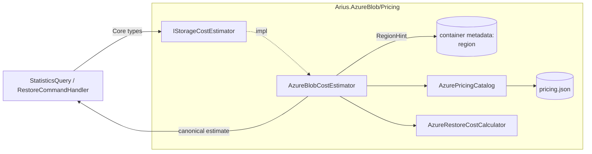

# Storage cost estimation

> **Code:** `src/Arius.Core/Shared/Cost/` (contract) · impl `src/Arius.AzureBlob/Pricing/`  ·  **Decisions:** [ADR-0020](../../../decisions/adr-0020-provider-agnostic-cost-estimation.md) · [ADR-0013](../../../decisions/adr-0013-core-host-separation.md)  ·  **Terms:** [chunk size](../../../glossary.md#chunk-size) · [stored size](../../../glossary.md#stored-size) · [storage tier hint](../../../glossary.md#storage-tier-hint)

## Purpose

Turns repository state into money: a per-tier **monthly storage** estimate (Statistics tab) and a pre-restore **cost** (retrieval/rehydration + operations + egress). The pricing model, rates, and data are **provider-specific**, so Core defines only the contract and the Azure adapter owns the rest — the same port/adapter split as the [storage boundary](storage.md) ([ADR-0020](../../../decisions/adr-0020-provider-agnostic-cost-estimation.md)).

## How it works

### The contract (Core)

`IStorageCostEstimator` (`Shared/Cost/IStorageCostEstimator.cs`) is the whole provider-neutral surface. Inputs are Core domain types ([`ChunkTierStatistic`](chunk-index.md), `BlobTier`); outputs are canonical records (`StorageCostEstimate`, `TierStorageCost`, `RestoreCostRequest`, `RestoreCostEstimate`) declared alongside the interface in `Shared/Cost/IStorageCostEstimator.cs`. All amounts are in **EUR** (the only currency Arius supports). The estimator is **bound to one repository's storage** — there is no region argument, because [region](../../../glossary.md#region) is an implementation detail the adapter resolves from the container (below):

| Member | Returns | Used by |
|---|---|---|
| `EstimateStorageCost(storedByTier)` | `StorageCostEstimate(Region, Tiers[], TotalPerMonth)` | [`StatisticsQuery`](../features/queries.md#statisticsquery) |
| `EstimateRestoreCost(RestoreCostRequest)` | `RestoreCostEstimate` (slim) | [`RestoreCommand`](../features/restore-command.md#stage-3-cost-estimate-confirm) |

`StorageCostEstimate` carries the resolved `Region` (which region's rates were applied), but the statistics path uses it only internally — `RepositoryStatistics` and the web `StatisticsDto` surface the cost figures **without** naming the region. `RestoreCostEstimate` is **slim**: chunk counts/bytes + `TotalStandard` / `TotalHigh`. The per-component breakdown is a provider detail and is deliberately *not* on the contract (a non-archive provider sets `TotalStandard == TotalHigh`). `RestoreCostRequest` is what Arius already knows from classifying the restore: the online chunks to download split by source tier (an already-rehydrated archive copy counts as Hot) plus archive chunks needing/pending rehydration.

### The Azure implementation

`AzureBlobCostEstimator` (`Arius.AzureBlob/Pricing/`) loads `AzurePricingCatalog` once from the embedded **`pricing.json`** and is **constructed per repository**: it reads the container's [region](../../../glossary.md#region) from `IBlobContainerService.RegionHint` and resolves it to a `RegionPricing` once, in its constructor. Two independent fallbacks keep cost always estimable: an **unset** container region (blank/`null` `RegionHint`) is substituted with `AzureBlobContainerService.DefaultRegion` (`northeurope`) and a warning is logged; an **unrecognised** region *name* falls back to the catalog's own default (`AzurePricingCatalog.Resolve` → `westeurope`). Storage cost is a direct map; restore cost is computed by the internal `AzureRestoreCostCalculator` into a rich `AzureRestoreCost`, then collapsed to the slim estimate.

**Storage cost** per tier = `storedBytes / 1024³ × storagePerGBPerMonth(region, tier)`, summed.

**Restore cost** — two groups (rehydration of offline archive chunks, and direct download of online chunks) plus egress:

| Component | Formula | Driver |
|---|---|---|
| Archive retrieval (Std / High) | `rehydGiB × archive.dataRetrieval[High]PerGB` | bytes needing a new rehydration request |
| Archive read ops (Std / High) | `(chunks / 10 000) × archive.readOps[High]Per10000` | chunks needing rehydration |
| Write ops → Hot | `(chunks / 10 000) × hot.writeOpsPer10000` | one Hot write per rehydrated copy |
| Hot storage (`monthsStored`=1) | `rehydGiB × hot.storagePerGBPerMonth × monthsStored` | rehydrated copies held in `chunks-rehydrated/` |
| Download read ops | `Σ_tier (downloadChunks / 10 000) × readOpsPer10000(tier)` | Hot/Cool/Cold chunks read directly (rehydrated = Hot) |
| Download retrieval | `(coolBytes·coolRetr + coldBytes·coldRetr) / 1024³` | Cool/Cold bytes read — **Hot has no retrieval charge** |
| Internet egress | `max(0, (downloadBytes + bytesNeedingRehydration)/1024³ − 100) × egressPerGB` | bytes leaving Azure, beyond the free 100 GiB/month |

`TotalStandard` / `TotalHigh` sum the rows (the two archive rows pick Std or High; download + egress are priced once and identical across priorities).

### The pricing data

`pricing.json` is region-keyed (EUR, Standard GPv2 block blobs, **LRS**, base 0–50 TB volume tier) and is the catalog's single source of truth — regenerate it with **`update-pricing.py`** (queries the public Azure Retail Prices API; products *General Block Blob v2* + *Bandwidth*). It covers all standard public commercial regions (Government / MEC / sovereign clouds excluded). `egressPerGB` is internet data-transfer-out at the default Microsoft-network routing (100 GB–10 TB band).

## Key invariants

- **Core carries no provider pricing.** `Shared/Cost` is contract + canonical DTOs only; rates, the model, and `pricing.json` live in `Arius.AzureBlob` ([ADR-0020](../../../decisions/adr-0020-provider-agnostic-cost-estimation.md)). The Azure estimator is registered by `AddAzureBlobStorage()` (alongside `IBlobServiceFactory`) and is **only resolvable inside a per-repository provider**, because it depends on that repository's `IBlobContainerService` to read the region — the Core handlers resolve it from their provider.
- **Region is the container's, resolved once.** The estimator reads `IBlobContainerService.RegionHint` (the container's `region` metadata) at construction — not a per-call argument and not an app-wide setting. A repository always prices against its own container's region; an unset region prices against `northeurope`.
- **"GB" means binary GiB (2³⁰).** Azure bills storage, retrieval, and egress per GiB; every per-GB formula divides bytes by `1024³`. (Confirmed against Microsoft's billing docs.)
- **A region omits the tiers it doesn't offer.** `pricing.json` has no `archive` for regions without it (e.g. Belgium Central); `RegionPricing.For` returns null → the rate is 0, so a tier the provider can't hold costs nothing.
- **Egress excludes pending bytes and the free allowance.** Only `downloadBytes + bytesNeedingRehydration` egress in a restore (pending-rehydration bytes belong to a future run); the first 100 GiB/month is free account-wide.
- **Hot has no data-retrieval charge.** Only Cool/Cold/Archive incur per-GiB retrieval; Cold > Cool > Archive-standard varies by region.

## Why this shape

- **Port in Core, pricing in the adapter** — [ADR-0020](../../../decisions/adr-0020-provider-agnostic-cost-estimation.md), mirroring the [storage boundary](storage.md). A future S3/B2/GCS backend prices storage by implementing `IStorageCostEstimator`.
- **Slim restore estimate** — the host renders only totals + counts; the per-component breakdown is Azure-shaped, so it stays internal (`AzureRestoreCost`) and is asserted in `Arius.AzureBlob.Tests`, keeping the Core contract provider-neutral.
- **Embedded, regeneratable rates** — a checked-in `pricing.json` keeps estimates offline and deterministic; `update-pricing.py` refreshes them from the authoritative API rather than hand-editing.

## Open seams / future

- **EUR + LRS only.** Arius prices in EUR only — `pricing.json` carries EUR rates and the whole cost stack assumes it (no currency is threaded through; the `€` symbol is hardcoded at the display points). It also assumes Locally-Redundant Storage, so an account on GRS/ZRS is under-/mis-estimated; multi-redundancy would extend the catalog and `update-pricing.py`.
- **Rehydration target is Hot, `monthsStored` is 1.** The write-ops/storage rows assume rehydrated copies land in Hot for one month; restoring into a cheaper online tier or varying the retention would use the already-parsed Cool/Cold rates.
- **Region is read-only to Arius.** The container's `region` metadata is seeded to a `default` sentinel on the first read/write open and is otherwise set **out-of-band** (e.g. in Azure Storage Explorer) — Arius never writes a real region. The resolved region *is* surfaced read-only (the repository list shows it, flagged `(default)` when unset), but there is no in-app editor. An unset/wrong region silently prices against `northeurope`, and a memoized Statistics figure does not notice an out-of-band region change (see [web host](../../hosts/web.md#statistics-cache)).
- **No provider but Azure.** `AzureBlobCostEstimator` is the sole implementation; it is the cost-side sibling of the single `Arius.AzureBlob` storage backend.
