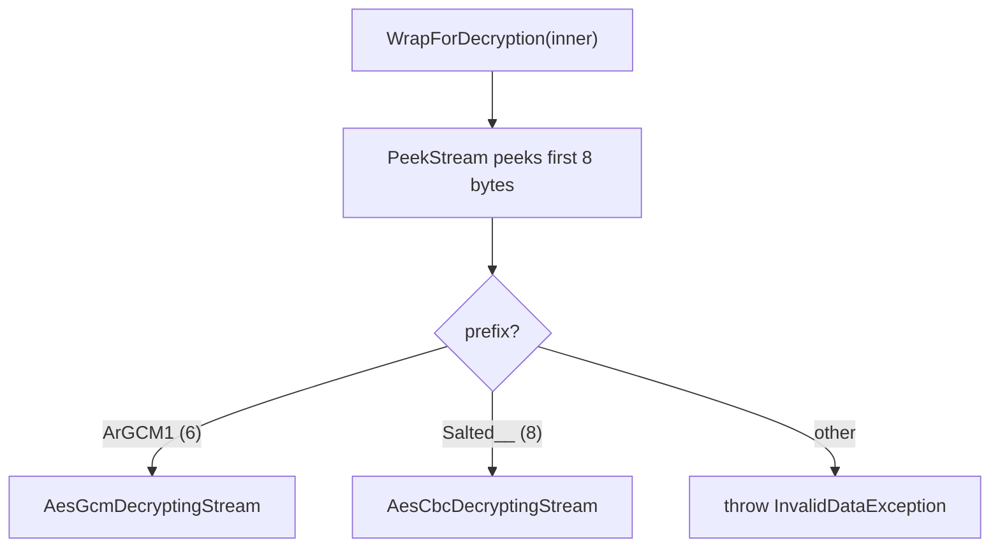

# Encryption

> **Code:** `src/Arius.Core/Shared/Encryption/` (`IEncryptionService.cs`, `PassphraseEncryptionService.cs`, `PlaintextPassthroughService.cs`) + `recover-chunk.py` (repo root)  ·  **Decisions:** [ADR-0014](../../../decisions/adr-0014-encryption-format-and-recoverability.md)  ·  **Terms:** [chunk](../../../glossary.md#chunk) · [content hash](../../../glossary.md#content-hash) · [filetree](../../../glossary.md#filetree)

## Purpose

The single confidentiality + integrity layer for every repository body Arius uploads — [chunks](../../../glossary.md#chunk), tar chunks, [filetrees](../../../glossary.md#filetree), snapshots, and chunk-index shards. It wraps an already-compressed stream in AES-256-GCM (the self-describing `ArGCM1` format) on write, transparently reads back both `ArGCM1` and legacy openssl-compatible AES-256-CBC blobs via magic-byte auto-detection, and also owns the passphrase-seeded content hash. The blob — not the Arius binary — is the system of record, so the byte format is documented and independently recoverable by `recover-chunk.py`.

## How it works

`IEncryptionService` is the seam. Two implementations, selected once at startup in `ServiceCollectionExtensions` by whether `--passphrase` was supplied:

- **`PassphraseEncryptionService`** — writes `ArGCM1`, reads both `ArGCM1` and `Salted__` (CBC). `ComputeHash` = `SHA256(passphrase_bytes ‖ data_bytes)` (literal concat, *not* HMAC — locked for back-compat).
- **`PlaintextPassthroughService`** — `WrapForEncryption`/`WrapForDecryption` return the stream unchanged; `ComputeHash` = plain `SHA256(data)`.

A repository is therefore wholly encrypted or wholly plaintext; the choice is a repository-wide singleton (one cipher per provider), never per-blob. Both implementations expose the same three operations the rest of Core consumes: `WrapForEncryption(inner)`, `WrapForDecryption(inner)`, and `ComputeHash`/`ComputeHashAsync`. Encryption is always the *outermost* wrap — it sees the compressed bytes, never the plaintext file (compression is ADR-0012's concern; see [`compression.md`](./compression.md)).

### The `ArGCM1` write format

`AesGcmEncryptingStream` is a write-only `Stream`. AES-GCM is not a streaming cipher (BCL `AesGcm` tags one buffer in one call), so the payload is split into independently sealed 64 KiB blocks framed inside a documented envelope:

```text
HEADER (38 bytes):  "ArGCM1"(6) │ Salt(16) │ Iterations(4 LE uint32) │ Nonce₀(12)
BLOCK (repeated):   Length(4 LE uint32, ≤ 65536) │ Ciphertext+Tag (Length + 16)
SENTINEL (final):   Length(4)=0x00000000 │ Tag(16)
```

The constructor generates a random 16-byte `Salt` and 12-byte `Nonce₀`, derives the AES-256 key (`DeriveGcmKey` → `Rfc2898DeriveBytes.Pbkdf2`, SHA-256, `GcmPbkdf2Iter = 100_000`, 32 bytes), and emits the header immediately. `Write` accumulates into a `GcmBlockSize` buffer; each full block is sealed by `FlushBlock`/`FlushBlockAsync` under a position-derived nonce and framed as `length ‖ ciphertext ‖ tag`. `Dispose` calls `WriteSentinel`, which flushes any partial trailing block and then emits a zero-length block plus a GCM tag over the empty payload.

```mermaid
sequenceDiagram
    participant Caller
    participant Enc as AesGcmEncryptingStream
    participant Inner as inner Stream (→ blob)
    Caller->>Enc: ctor(passphrase)
    Enc->>Enc: salt, nonce₀ = RNG;  key = PBKDF2(pass, salt, 100k)
    Enc->>Inner: header: ArGCM1 ‖ salt ‖ iter ‖ nonce₀
    loop per 64 KiB block i
        Caller->>Enc: Write(plaintext)
        Enc->>Enc: nonceᵢ = DeriveNonce(nonce₀, i)
        Enc->>Enc: AesGcm.Encrypt(nonceᵢ, plain) → cipher, tag
        Enc->>Inner: len ‖ cipher ‖ tag
    end
    Caller->>Enc: Dispose()
    Enc->>Inner: WriteSentinel — len=0 ‖ tag(empty payload, next nonce)
```

### Per-block nonce derivation

`DeriveNonce(nonce₀, i)` computes `nonceᵢ = nonce₀ XOR little_endian_bytes(i, 12)` — the block index sits in the low 4 bytes, the high 8 stay zero (XOR-identity). This is a *counter* construction, not random per-block nonces, which is what makes nonce reuse impossible inside a single blob, binds each ciphertext to its position (a reordered or swapped block authenticates under the wrong nonce and fails), and gives the sentinel its own unique index after the last data block.

### Truncation sentinel

The zero-length sentinel is the integrity guarantee for *end-of-stream*. `AesGcmDecryptingStream.ReadAndDecryptNextBlock` only sets `_eof` after it reads `length == 0`, reads the 16-byte tag, and successfully `AesGcm.Decrypt`s the empty payload under the next nonce. A blob truncated before its sentinel never reaches that branch — `ReadExactly` throws `EndOfStreamException`/`InvalidDataException` instead of returning a short, silently-incomplete read. A tampered ciphertext, tag, or sentinel throws `AuthenticationTagMismatchException`. The reader also rejects a header iteration count of `0` or `> GcmMaxPbkdf2Iter = 10_000_000` and any block length `> GcmBlockSize`, refusing crafted blobs before doing crypto work.

### Read path: magic-byte auto-detection

`WrapForDecryption` does not trust blob content-type metadata. It wraps `inner` in a small `PeekStream` (buffers up to 8 bytes, the length of `Salted__`, without consuming them), peeks the prefix, and dispatches:



`AesGcmDecryptingStream` reads the 38-byte header, re-derives the key from the header's salt + iteration count, then decrypts blocks on demand, serving bytes out of a decrypted 64 KiB buffer. `AesCbcDecryptingStream` strips the `Salted__`(8) ‖ salt(8) header, derives a 48-byte key+IV via `DeriveCbcKeyIv` (PBKDF2-SHA256, `CbcPbkdf2Iter = 10_000` — the OpenSSL `enc` default that real v5 archives were written with, so it cannot be changed without orphaning every legacy blob), and decrypts through a BCL `CryptoStream` (CBC, PKCS7). New writes are *never* CBC — `WrapForCbcEncryption` exists only as a test helper to manufacture legacy blobs.

### Passphrase mismatch → a typed, actionable error

A passphrase problem surfaces from this read path as a low-level `InvalidDataException` or `AuthenticationTagMismatchException`, in three shapes: a **missing** passphrase (`PlaintextPassthroughService` reads an `ArGCM1` blob, so ciphertext reaches the decompressor), a **wrong** passphrase (GCM tag mismatch), or a passphrase supplied for a **plaintext** repository (`WrapForDecryption` finds no recognised magic). `SnapshotSerializer.DeserializeAsync` — the first decrypt every read command performs — catches these and re-throws the host-agnostic `RepositoryEncryptionException` (carrying `PassphraseProvided`), so hosts render an actionable "passphrase missing/incorrect" message rather than a raw decompression error.

### External recoverability — `recover-chunk.py`

The repo-root `recover-chunk.py` is the canonical worst-case recovery tool and mirrors the read path in pure Python (only stdlib + the `cryptography` package; zstd/gzip backends optional). It auto-detects `ArGCM1` vs `Salted__` from the leading magic, decrypts streaming block-by-block (`_recover_gcm` re-implements `DeriveNonce` and the sentinel check verbatim; `_recover_cbc` mirrors the PKCS7 path), *then* auto-detects zstd vs gzip on the decrypted stream and decompresses — emitting the original file, or with `--no-decompress` the still-compressed bytes for the `zstd`/`gzip` CLI. `openssl enc` is deliberately *not* a fallback for GCM: OpenSSL 3.x refuses AEAD ciphers via `enc`, which is exactly why a small documented script is the recovery tool rather than a shell one-liner. The format and script are exercised end-to-end in `release.yml` and `RecoveryScriptTests`.

## Key invariants

- **Encryption wraps compression; it never touches plaintext.** The stack is always read → compress → encrypt → upload (and the reverse on read). The encrypting stream sees compressed bytes only.
- **Hash construction is frozen: `SHA256(passphrase_bytes ‖ data_bytes)`, literal concat, not HMAC.** Changing it would orphan every existing [content hash](../../../glossary.md#content-hash) and every passphrase-seeded blob name. Plaintext repositories use plain `SHA256(data)`.
- **Nonce is a counter, never random per block.** `nonceᵢ = nonce₀ XOR LE(i,12)` must stay exactly this — it is what prevents nonce reuse, detects reordering, and gives the sentinel a unique nonce. Random per-block nonces would have to be stored and would not bind position.
- **The sentinel is mandatory and authenticated.** EOF is only legitimate after the zero-length block's tag verifies; absence of the sentinel *is* truncation and must throw.
- **`ArGCM1` block size (64 KiB) is fixed in the format, not the header.** Only `Salt`, `Iterations`, and `Nonce₀` are header-encoded. Changing the block size or scheme requires a new magic (`ArGCM2`), not a header flag.
- **Legacy CBC PBKDF2 iterations are frozen at `10_000`.** Unlike GCM's header-encoded, raisable iteration count, the CBC reader has no per-blob count — it must use the same value v5 (OpenSSL `enc` default, 10,000) used to derive the key, so `CbcPbkdf2Iter` is decrypt-only and can never be raised. It is `S5344`-suppressed precisely because it is reading legacy material, not protecting new writes (those are GCM at 100,000).
- **Reads are content-driven, not metadata-driven.** Scheme (GCM vs CBC) is chosen from the blob's own magic bytes via `PeekStream`, so blob content-type is informational and a mixed CBC/GCM repository reads transparently with no caller change.
- **`recover-chunk.py` is byte-compatible with the C# format and stays CI-verified.** The Python nonce derivation, sentinel handling, and bounds checks must track any format change in lockstep — the recoverability guarantee depends on it.
- **Same passphrase + same data ⇒ identical hash; different passphrase ⇒ different hash and different blob names** (opaqueness: encrypted blob names leak no file names or paths).

## Why this shape

The one-time decisions — *why* GCM over CBC, *why* a hand-rolled chunked AEAD instead of a streaming-AEAD library, *why* PBKDF2 at 100k iterations rather than Argon2id, and *why* the blob must be recoverable without Arius — are all recorded in [ADR-0014](../../../decisions/adr-0014-encryption-format-and-recoverability.md) with the alternatives and tradeoffs. In short: GCM adds the authenticated integrity and truncation detection that CBC lacks (critical for blobs sitting untouched on the Azure archive tier for years), the chunked envelope streams in bounded memory using only BCL `AesGcm` with no external crypto dependency, PBKDF2 keeps per-chunk key derivation in the low-millisecond range (Argon2id's ~1 s per chunk is prohibitive), and the documented byte format plus pure-Python recovery script makes the archive outlive the application. Compression codec choice (zstd, gzip legacy) is the separate concern of ADR-0012.

## Open seams / future

- **KDF strengthening without a format bump.** The PBKDF2 iteration count is header-encoded and the reader accepts any value in `1 .. 10_000_000`, so a future write path can raise `GcmPbkdf2Iter` and old blobs still decrypt. Argon2id would still require an `ArGCM2` and a recovery-script update.
- **Block-size / scheme changes need `ArGCM2`.** The 64 KiB block size is baked into both `PassphraseEncryptionService` and `recover-chunk.py`; any change to framing must add a new magic and a parallel read path, never reinterpret `ArGCM1`.
- **Two read paths to maintain indefinitely.** GCM and CBC must stay tested together for as long as any legacy `Salted__` blob may exist; there is no migration.
- **Stale content-type doc-comments.** The XML summaries on `PassphraseEncryptionService` and the GCM streams still say `+gzip`, but `ContentTypes` now writes `application/aes256gcm+zstd` / `application/aes256gcm+tar+zstd` (gzip variants retained for legacy reads). Content types are informational only — the read path auto-detects the codec from the frame header — so this is a comment lag, not a behavior bug, but it should be corrected.
- **`AesGcm` platform dependency.** BCL `AesGcm` can throw `PlatformNotSupportedException` where hardware AES is unavailable; this is a Core-wide assumption, not handled here.
- **The friendly `RepositoryEncryptionException` translation lives at the snapshot-read boundary** (`SnapshotSerializer.DeserializeAsync`), not in the encryption layer itself. Every read command resolves a snapshot before reading filetrees or chunk-index shards, so that boundary catches the passphrase mismatch first; a decrypt failure reached on another blob path first would still surface raw.
