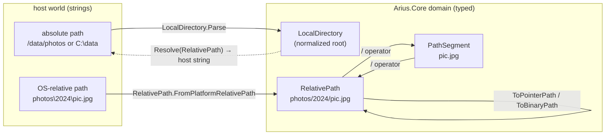
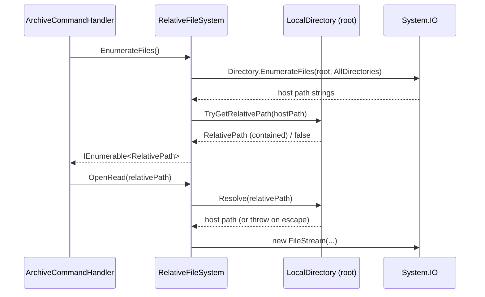

# Filesystem domain types

> **Code:** `src/Arius.Core/Shared/FileSystem/` (`RelativePath`, `PathSegment`, `LocalDirectory`, `RelativeFileSystem`, `PointerFileFormat`, `PathSegmentComparers`)
> · **Decisions:** [ADR-0008 internal filesystem domain types](../../../decisions/adr-0008-introduce-internal-filesystem-domain-types.md)
> · **Terms:** [RelativePath](../../../glossary.md#relativepath) · [PathSegment](../../../glossary.md#pathsegment) · [RelativeFileSystem](../../../glossary.md#relativefilesystem) · [FilePair](../../../glossary.md#filepair) · [binary file](../../../glossary.md#binary-file) · [pointer file](../../../glossary.md#pointer-file)

---

## Purpose

This is Arius.Core's path-and-IO domain model. It turns three different path worlds — the host's `\`-or-`/` absolute paths, the canonical `/`-separated repository-relative path, and a single name component — into typed values that are validated on construction, and it confines every `System.IO` call for Arius path-domain work to one boundary class. The point is portability and safety: an archive made on one OS must list and restore on another, and invalid or root-escaping paths must be unrepresentable rather than caught by discipline.

## How it works

Four types divide the responsibilities cleanly:

| Type | Visibility | Represents | Lifecycle |
|---|---|---|---|
| [`RelativePath`](../../../glossary.md#relativepath) | public | a canonical `/`-separated repository-relative path (`""` = `Root`) | the domain coordinate system — flows through archive/list/restore/blob/cache |
| [`PathSegment`](../../../glossary.md#pathsegment) | public | exactly one validated name component | companion for safe composition |
| `LocalDirectory` | internal | a normalized absolute host root token | the only place host paths live |
| [`RelativeFileSystem`](../../../glossary.md#relativefilesystem) | internal | the IO boundary rooted at one `LocalDirectory` | the only place `System.IO` runs |

`RelativePath` and `PathSegment` are `readonly record struct`s with a **private** `RawValue` and a `Value` accessor that throws on the uninitialized `default`, so a `default(RelativePath)` cannot silently masquerade as a valid path. Construction goes only through `Parse`/`TryParse`, which reject the things that make string paths dangerous: `RelativePath.TryParse` rejects rooted paths (`/x`, `\x`, `C:/x`), trailing separators, backslashes, `//`, control chars, and any segment that fails `PathSegment.TryParse`; `PathSegment.TryParse` rejects empties, `.`, `..`, and embedded separators. `RelativePath.Root` is the empty string and the identity for composition.

Composition is segment-at-a-time and validated. The `/` operator appends exactly one `PathSegment` (there is no string overload that splits, so `Root / "a/b"` is a compile-time-typed single-segment append that throws at parse time). Pointer naming is centralized in `PointerFileFormat` extension methods — `IsPointerPath`, `ToPointerPath`, `ToBinaryPath` — so the `.pointer.arius` suffix is defined once and never hand-spliced in a handler.

`LocalDirectory` is the seam between the two worlds. It normalizes via `Path.GetFullPath` and trims trailing separators, then offers exactly two crossings, both containment-checked:
- **inbound** `TryGetRelativePath(hostPath)` — strips the root with `Path.GetRelativePath`, normalizes separators to `/`, and parses the result into a `RelativePath`; returns `false` when the host path is not contained.
- **outbound** `Resolve(RelativePath)` — re-roots with `Path.Combine` + `Path.GetFullPath`, then **throws** if the result escapes the root (the `..`-can't-appear-in-`RelativePath` guarantee plus `IsContained` make this belt-and-braces).

`IsContained` is case-insensitive on Windows (`\` separator) and ordinal elsewhere, and matches on a root-with-separator prefix so `/data/photos2` is not treated as inside `/data/photos`.

`RelativeFileSystem` is constructed from one `LocalDirectory` and is the **only** type that calls `File.*` / `Directory.*` / `Path.*` for domain work. Every method takes a `RelativePath` (or `PathSegment`/`LocalDirectory`), runs it through `root.Resolve(...)`, and performs the IO — enumeration (`EnumerateFiles`, `EnumerateDirectories`, `EnumerateFileNames`), reads/writes, create/delete, `ReplaceFileAtomically`, and timestamp get/set. Enumeration is the inbound direction in practice: `EnumerateFiles()` walks the host tree and yields `root.TryGetRelativePath(...)` results, so callers receive validated `RelativePath`s, never host strings.

The archive-time file model — [`FilePair`](../../../glossary.md#filepair) with its optional [binary-file](../../../glossary.md#binary-file) and [pointer-file](../../../glossary.md#pointer-file) components — is deliberately **not** here; it lives in the archive slice (`src/Arius.Core/Features/ArchiveCommand/Models.cs`) because it is archive-time state, not shared filesystem infrastructure. This module owns only the path primitives and the IO boundary they flow through. Restore models its own candidate type rather than reusing `FilePair`, but still derives pointer paths through `PointerFileFormat`.

## Key invariants

- **`RelativePath` is canonical, relative, and `/`-separated.** No backslashes, no leading/trailing slash, no `.`/`..`, no drive root, no `//`, no control chars. This is what makes an archive portable across OSes and what lets `Resolve` trust that re-rooting can't escape.
- **`PathSegment` is exactly one component.** `RelativePath.Name`, `Segments`, and `EnumerateFileNames` return `PathSegment`, so callers cannot smuggle a multi-segment string through a "name".
- **`default` is unusable.** Both structs throw via the `Value` accessor when `RawValue` is null, so an unvalidated zero value never travels as a valid path.
- **Prefix checks are segment-aware.** `RelativePath.StartsWith` only matches on a `/` boundary (or exact equality), so `photoshop/x` does not start with `photos`. List/restore subtree filtering depends on this — a raw `string.StartsWith` would be wrong.
- **System.IO is quarantined to this namespace.** Only `RelativeFileSystem`, `LocalDirectory`, and the helpers here call `File.*`/`Directory.*`/`Path.*` for Arius path-domain work; feature handlers must go through the boundary with a `RelativePath`. (Enforced by ArchUnit-style tests per ADR-0008.)
- **Root containment is enforced at the boundary, not by callers.** `Resolve` throws on escape and `TryGetRelativePath` returns false for out-of-root paths, so containment is structural, not a per-caller check.
- **`.pointer.arius` exists in exactly one place.** `PointerFileFormat` is the sole definition of the suffix and the only `ToPointerPath`/`ToBinaryPath`/`IsPointerPath` logic; `ToBinaryPath` rejects non-pointer paths and double-suffixing.

## Why this shape

A small domain model with two public primitives, internal archive/IO types, and a concrete rooted boundary was chosen over keeping raw strings, building a full path taxonomy (`RepositoryPath`/`BlobPath`/`CachePath`/…), or adopting a virtual-filesystem library like Zio — see [ADR-0008](../../../decisions/adr-0008-introduce-internal-filesystem-domain-types.md) for the alternatives and trade-offs. The short version of the rationale, all decided once in that ADR:

- **`RelativePath`/`PathSegment` are public**, not internal, so tests, storage boundaries, and public command/query/result/event contracts use the same validated primitive instead of converting strings at every boundary (and without `InternalsVisibleTo` sprawl).
- **One generic `RelativePath`** rather than a per-world taxonomy — blob virtual names and cache-relative paths share the same `/`-normalized shape, and semantic wrappers can be added later *if* real mixups appear, rather than front-loading ceremony.
- **A concrete `RelativeFileSystem`, not an interface/VFS** — it makes host IO visible and centralized without committing Arius to a replaceable filesystem abstraction larger than the problem.
- **Archive is permissive toward source-platform paths.** Validation rejects structurally unsafe paths, not paths that merely happen to be awkward on another OS; cross-OS restore conflicts are restore-time policy, tracked in [issue #82](https://github.com/woutervanranst/Arius7/issues/82), not a reason to fail archival.

## Open seams / future

- **`RelativePath` still mixes path worlds.** Repository paths, Azure blob virtual paths, and cache-relative paths are all the same type. The ADR's deliberate bet is to add semantic wrappers only when a concrete mixup is observed.
- **Cross-OS restore conflicts are unhandled here.** A name valid on the source OS but unsafe on the target (reserved Windows names, case collisions) is archived faithfully but needs restore-time policy/UX — [issue #82](https://github.com/woutervanranst/Arius7/issues/82). That work lands in the restore slice, not this module.
- **`RelativeFileSystem` grows by demand.** Its surface (atomic replace, symlink validity, timestamp get/set, the WAL-aware `GetTimestamps` fallback) was added as features needed rooted operations; new rooted IO belongs here as a new method rather than a `Path.Combine` in a handler.
- **Pointer-path helpers are internal extension methods.** If a public consumer ever needs Arius pointer conventions, `PointerFileFormat` is where they'd be promoted to public — not duplicated.
