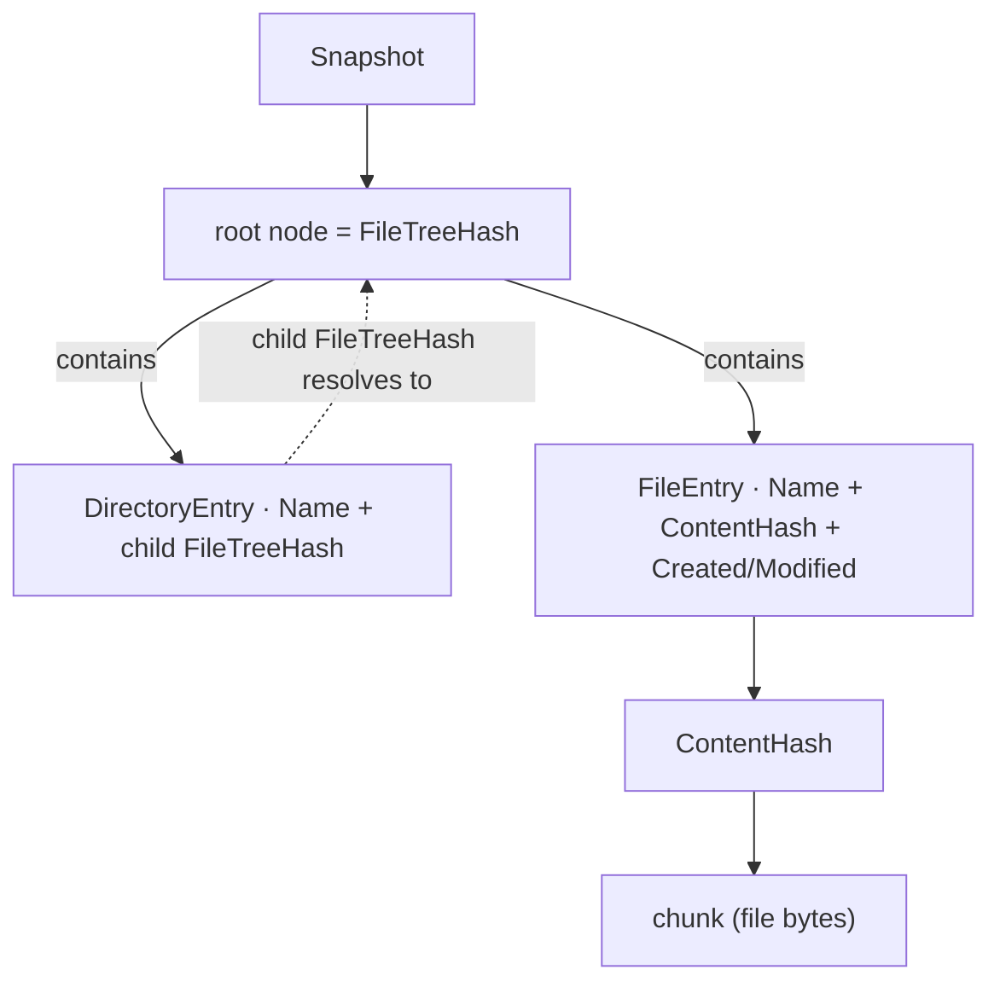
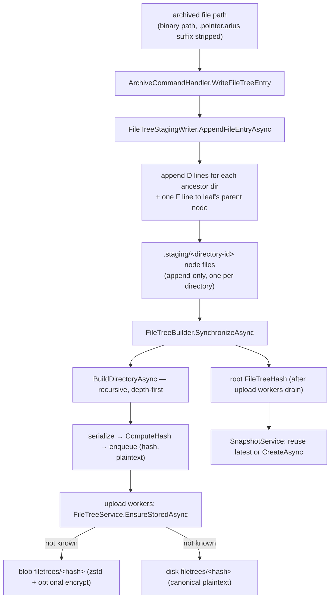
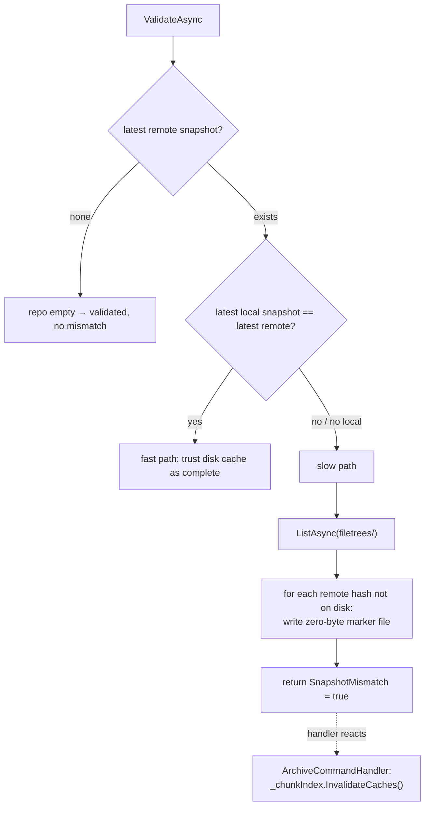
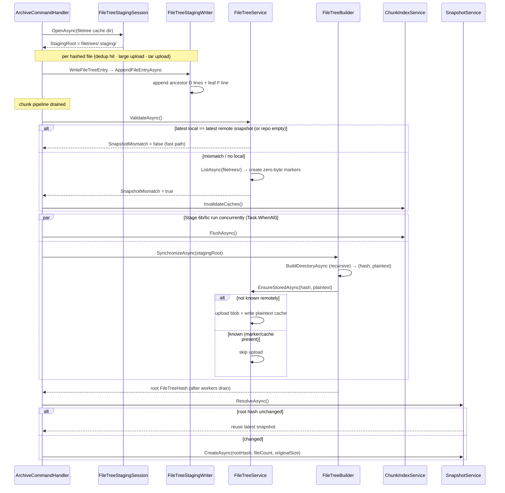

# Filetree (Merkle structure + disk cache)

> **Code:** `src/Arius.Core/Shared/FileTree/*`  ·  **Decisions:** [ADR-0004](../../../decisions/adr-0004-split-filetree-entry-hash-identities.md) · [ADR-0006](../../../decisions/adr-0006-build-filetrees-from-hashed-directory-staging.md) · [ADR-0016](../../../decisions/adr-0016-multi-machine-cache-coherence.md)  ·  **Terms:** [filetree](../../../glossary.md#filetree) · [FileTreeEntry](../../../glossary.md#filetreeentry) · [FileTreeHash](../../../glossary.md#filetreehash) · [snapshot](../../../glossary.md#snapshot) · [epoch](../../../glossary.md#epoch)

## Purpose

A [filetree](../../../glossary.md#filetree) is Arius's immutable, content-addressed Merkle representation of repository structure: one node per directory, leaves carrying a [ContentHash](../../../glossary.md#contenthash), directory edges carrying a child [FileTreeHash](../../../glossary.md#filetreehash). A [snapshot](../../../glossary.md#snapshot) points at one root `FileTreeHash` and nothing else. This component owns three concerns: the immutable node *model* and its canonical serialization, the *bottom-up build* of those nodes from per-run staging files, and a *two-tier disk cache* (`FileTreeService`) that decides — without distributed locks — when the local copy of remote filetree knowledge is trustworthy.

## How it works

### The Merkle structure

A snapshot does not reference files directly. It references a root node; that node expands recursively into directory and file entries. Both leaf and edge are subtypes of `FileTreeEntry` (`FileTreeModels.cs`), distinguished by which hash they carry — see [ADR-0004](../../../decisions/adr-0004-split-filetree-entry-hash-identities.md) for why file and directory entries are separate types rather than one tagged record.



A node's identity is the SHA-256 of its canonical serialized plaintext (`FileTreeBuilder.ComputeHash` → `encryption.ComputeHash(FileTreeSerializer.Serialize(entries))`). Two directories with identical content (same children, same names, same file hashes/timestamps) therefore produce the same `FileTreeHash` and are stored once — de-duplication falls out of content-addressing, not a separate mechanism.

`FileTreeSerializer` defines the canonical text format. `Serialize` sorts entries by `Name` (`PathSegmentOrdinalComparer`) before emitting, so the byte layout — and thus the hash — is deterministic regardless of build order. Each line is terminated with a fixed `'\n'`, **never** `Environment.NewLine`: the bytes are hashed, so a `\r\n` on Windows would give the same tree a different `FileTreeHash` than on Linux/macOS. `FileTreeStagingWriter` uses the same `'\n'` for its staging lines. Lines are one of:

```text
<content-hash>      F <created:O> <modified:O> <name>     # FileEntry (persisted or staged — identical)
<child-filetree-hash> D <name>/                          # DirectoryEntry (persisted)
<child-directory-id>  D <name>/                          # StagedDirectoryEntry (staging only)
```

The file-entry grammar is byte-identical between staged and persisted nodes; the directory line differs only in *what the first field means* — a final child `FileTreeHash` (persisted) vs. a staging directory id (staged). That shared grammar is why one serializer parses both formats, via two named entry points: `ParsePersistedNodeEntryLine` and `ParseStagedNodeEntryLine`.

### Layout and key types

Repository-local roots come from `RepositoryLocalStatePaths`; filetree-specific path helpers from `FileTreePaths`.

| Location | Owner | Purpose |
|---|---|---|
| `~/.arius/{account}-{container}/filetrees/.staging/` | `FileTreeStagingSession` + `FileTreeStagingWriter` | Per-run staging graph; one file per staged directory id. |
| `~/.arius/{account}-{container}/filetrees/.staging.lock` | `FileTreeStagingSession` | Local mutual exclusion — prevents two local archive runs sharing one staging area. |
| `~/.arius/{account}-{container}/filetrees/{fileTreeHash}` | `FileTreeService` | Final plaintext disk cache of one immutable node. Zero-byte files are remote-existence markers. |
| `filetrees/{fileTreeHash}` (blob storage) | `FileTreeService` | Persisted filetree blob: canonical plaintext, zstd-compressed, then optionally encrypted. |
| `~/.arius/{account}-{container}/snapshots/{timestamp}` | `SnapshotService` | Latest local snapshot cache, read by `ValidateAsync` to decide whether local filetree knowledge is trustworthy. |

| Type | Responsibility |
|---|---|
| `FileTreeStagingSession` | Owns `.staging/` lifetime and `.staging.lock`; clears stale staging; one local staging session per repository cache. |
| `FileTreeStagingWriter` | Converts canonical relative file paths into append-only staged node files (ancestor directory lines + leaf file lines). |
| `FileTreeEntry` | Base type for entries inside a filetree node. |
| `FileEntry` | Final file leaf: `Name`, `ContentHash`, `Created`, `Modified`. |
| `DirectoryEntry` | Final persisted child-directory edge: `Name` + child `FileTreeHash`. |
| `StagedDirectoryEntry` | Staging-only child edge: `Name` + child staging directory id (used before child hashes are known). |
| `FileTreeSerializer` | Canonical text (de)serialization for filetree nodes; parses persisted and staged lines into the right subtype. |
| `FileTreeBuilder` | Reads staged nodes, validates duplicates, recursively builds child subtrees, serializes, computes `FileTreeHash`, publishes finished nodes to the upload channel. |
| `FileTreeService` | Validates local knowledge of remote filetrees, answers `ExistsInRemote`, uploads nodes, writes the disk cache, reads persisted nodes back. |
| `SnapshotService` | Publishes the commit point — records the root `FileTreeHash` after all referenced filetrees are stored. |

### Staging → build → upload pipeline

A filetree is **not** built incrementally as files are hashed. During archive, file entries are appended to flat per-directory staging files; only at the end of the run does `FileTreeBuilder` fold those into immutable Merkle nodes and upload them. This decouples build cost from total file count and keeps the durable commit (the snapshot) last. See [ADR-0006](../../../decisions/adr-0006-build-filetrees-from-hashed-directory-staging.md).



**Staging session.** `ArchiveCommandHandler` opens a `FileTreeStagingSession` over the repository's filetree cache root (`RepositoryLocalStatePaths.GetFileTreeCacheRoot`). The session takes `filetrees/.staging.lock` with `FileShare.None` (so a second concurrent local archive on the same cache fails fast), deletes any stale `.staging/` left by a crashed run, and creates a fresh empty `.staging/`. There is no per-run subdirectory under `.staging/`; the lock is what makes a single flat staging area safe. Disposal deletes `.staging/` and releases the lock.

**Staging writer.** `FileTreeStagingWriter.AppendFileEntryAsync` turns one canonical relative path (e.g. `docs/specs/plan.md`) into appends: a `D` line into each ancestor's node file plus one `F` line into the leaf's parent node file. Each ancestor directory's node lives at `.staging/<directory-id>`, where the id is `SHA256(canonical relative path)` — `FileTreePaths.GetStagingDirectoryId`, with the root being `SHA256("")`. Staging ids are **path-derived, not content-derived**: at append time the child's final `FileTreeHash` is not yet known, so the edge is recorded by stable path identity and rewritten to a real hash only during build. Because the pipeline appends every ancestor edge for every file, the same `D` edge is written many times; that is expected and de-duplicated later. Concurrent archive workers append safely via 256 striped `SemaphoreSlim` locks keyed by node path (bounded memory, not one lock per file).

**Build.** `FileTreeBuilder.SynchronizeAsync` starts a bounded upload `Channel<(FileTreeHash, ReadOnlyMemory<byte>)>` (capacity 16) and a pool of upload workers (`MaxDegreeOfParallelism = 32`), then recursively calls `BuildDirectoryAsync` from the root staging id. For each directory node it:

- reads `.staging/<directory-id>` and parses each line with `ParseStagedNodeEntryLine` (`ReadNodeEntriesAsync`);
- collects `FileEntry` by name — a duplicate file name in one node throws `Duplicate staged file entry`;
- collects `StagedDirectoryEntry` by name — repeated identical edges collapse, but the same name pointing at two different staging ids throws `Conflicting staged directory entry`;
- recurses into child subtrees (depth-first, up to 4 sibling workers in parallel), converting each *non-empty* child into a final `DirectoryEntry`;
- returns `null` for an empty subtree, so empty directories never appear in any node (and thus never in the snapshot);
- serializes the combined `FileTreeEntry[]`, computes the `FileTreeHash`, writes `(hash, plaintext)` to the upload channel, and returns the hash **without waiting** for that node's upload.

The build returns the root hash to `ArchiveCommandHandler` only after the upload channel completes and all workers drain — that wait is the durability boundary. Upload failures are captured via `ExceptionDispatchInfo` and cancel the shared `linkedCts`, so a failed store aborts the build rather than silently producing a root that references an unstored node.

### `FileTreeService`: the two-tier disk cache

`FileTreeService` (`IFileTreeService`) backs the cache at `~/.arius/{account}-{container}/filetrees/{fileTreeHash}` in front of blob storage. The disk file holds *canonical plaintext*; the blob holds the zstd-compressed, optionally GCM-encrypted form. The cross-cache coordination model (`epoch`, marker semantics, the cross-machine layout) lives in [service lifetimes](../../cross-cutting/service-lifetimes.md) and [ADR-0016](../../../decisions/adr-0016-multi-machine-cache-coherence.md); this section covers only the filetree-specific behavior.

**Validate before exists.** `ExistsInRemote(hash)` throws if `ValidateAsync` has not run. This guard is load-bearing: `EnsureStoredAsync` (and therefore the whole build) depends on `ExistsInRemote` being a pure local `File.Exists`, which is only correct once validation has reconciled local knowledge with the remote. `ValidateAsync` is idempotent — a second call returns immediately.



The fast path (this machine wrote the last snapshot) performs **no listing**: immutable content-addressed blobs mean a present cache file is correct by definition and an absent one is genuinely absent. On the slow path (another machine advanced the repo, or this is a fresh machine), `ValidateAsync` pays for *one* `ListAsync(filetrees/)` and materializes a zero-byte **marker** file for every remote hash not already on disk. A marker asserts "this `FileTreeHash` exists remotely; its plaintext is not yet downloaded" — safe precisely because filetrees are immutable, so the existence fact and the blob's meaning cannot drift under the marker. After validation, the entire build's existence checks are local `File.Exists` calls instead of one remote probe per node.

`ValidateAsync` returns `FileTreeValidationResult(SnapshotMismatch)`. It deliberately does **not** touch chunk-index state; on mismatch the *handler* calls `_chunkIndex.InvalidateCaches()`. Anchoring coherence on the snapshot epoch and keeping mutable-cache invalidation in the orchestrator is [ADR-0016](../../../decisions/adr-0016-multi-machine-cache-coherence.md).

**Store (write-through, idempotent).** `EnsureStoredAsync` skips the upload when `ExistsInRemote` is already true; otherwise `WriteAsync` does both writes for the same node: upload to `BlobPaths.FileTreePath(hash)` with `overwrite: false` (a tolerated `BlobAlreadyExistsException` makes it idempotent across crash recovery and concurrent runs), then write the canonical plaintext to the disk cache. The plaintext is written even when the blob already existed, so a marker becomes a real cache file.

**Read (disk-first, race-safe).** `ReadAsync(hash)` returns immediately from a non-empty disk file. On a zero-byte marker or miss it downloads, decrypts, decompresses (`DeserializeStorageAsync`), and publishes the plaintext to disk. Cache hits are lock-free; misses coordinate through a per-hash `_inFlightReads` `TaskCompletionSource` plus an atomic temp-file `ReplaceFileAtomically` publish (`WriteCacheAtomicallyAsync`), so a second concurrent reader never observes a partially written file, mis-deletes it as corrupt, and triggers a redundant download.

### End-to-end sequence (archive tail)



## Key invariants

- **Node identity = SHA-256 of canonical plaintext.** `FileTreeSerializer.Serialize` sorts entries by `Name`; build order must never leak into the bytes. De-dup depends entirely on this determinism.
- **Filetree blobs are immutable.** Once `filetrees/{hash}` exists, its existence and meaning are permanent. The fast-path skip, marker files, and `overwrite: false` upload all rely on this.
- **`ValidateAsync` must precede `ExistsInRemote`.** `ExistsInRemote` throws otherwise; the build's correctness rests on it being a local `File.Exists` over a validated cache.
- **Staging ids are path-derived, never `FileTreeHash`.** Child hashes are unknown at append time; `StagedDirectoryEntry.DirectoryNameHash` holds `SHA256(path)`, rewritten to a real `FileTreeHash` only during build.
- **Empty directories are omitted.** `BuildDirectoryAsync` returns `null` for an empty subtree, so they never reach a node or a snapshot.
- **Per-node entry rules:** duplicate file names in one node are invalid; duplicate directory edges are tolerated only when byte-for-byte identical (same name → same staging id).
- **Snapshot is the commit point.** The root hash is published only after every referenced node is durably stored (upload workers drained) — the snapshot is written last.
- **One local staging session per repository cache.** `filetrees/.staging.lock` (`FileShare.None`) enforces it; a single flat `.staging/` is safe only because of the lock.

## Why this shape

- **Separate file vs. directory entry types** rather than one tagged record — distinct hash identities (`ContentHash` vs `FileTreeHash`), file-only timestamps, and traversal that never infers meaning from a discriminator: [ADR-0004](../../../decisions/adr-0004-split-filetree-entry-hash-identities.md).
- **Hashed-directory staging then bottom-up build** rather than building incrementally or holding all entries in memory — scales with current subtree breadth not total file count, keeps Windows-safe local staging paths, reuses the `FileEntry` shape for staged records, and assigns hash computation to `FileTreeBuilder` while storage/cache stay in `FileTreeService`: [ADR-0006](../../../decisions/adr-0006-build-filetrees-from-hashed-directory-staging.md).
- **Snapshot-epoch coherence with marker files** rather than distributed locks or a remote probe per node — fast path costs nothing, slow path costs one listing, and immutable content-addressing makes markers sound: [ADR-0016](../../../decisions/adr-0016-multi-machine-cache-coherence.md).
- **Decoupled build/upload via a bounded channel** so node construction overlaps blob-upload latency without weakening the durability boundary (the build still waits for the drain).

## Open seams / future

- **Restore/list read path is thin.** `ls` and `restore` read through `FileTreeService.ReadAsync`, which on-demand fills markers with real plaintext. The full restore-side traversal (parallelism, prefetch ordering) is not yet documented here; the read path is where that work lands.
- **Build parallelism constants are fixed** (`SiblingSubtreeWorkers = 4`, `SynchronizeWorkers = 32`, `UploadChannelCapacity = 16`). They are not adaptive to repository shape or available bandwidth — a deep-but-narrow tree under-uses the sibling workers.
- **Marker materialization is whole-listing.** The slow path lists *all* `filetrees/` blobs and writes a marker per uncached hash. For very large repositories on a fresh machine this is an up-front cost that scales with total node count, not with what the current run actually touches.
