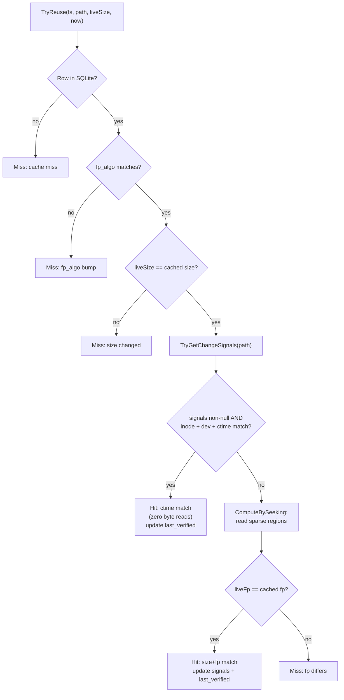

# Hashcache

> **Code:** `src/Arius.Core/Shared/HashCache/` (`HashCacheService`, `HashCacheLocalStore`, `SparseFingerprint`, `FileChangeSignals`, `SignalSets`, `FastHashResult`, `HashCacheEntry`) · `src/Arius.Core/Shared/FileSystem/NativeFileSignals.cs`
> · **Decision:** [ADR-0021](../../../decisions/adr-0021-opt-in-change-detection-hashcache.md)
> · **Terms:** [hashcache](../../../glossary.md#hashcache) · [sparse fingerprint](../../../glossary.md#sparse-fingerprint) · [fast-hash](../../../glossary.md#fast-hash)

## Purpose

The hashcache is a disposable local SQLite database that records the last-known content hash, sparse fingerprint, and platform change-signals for each binary file in a repository. When the operator passes `--fast-hash`, the archive Stage 2 consults the hashcache before opening a file: if the file's size, identity (`inode`/`dev`), and change-time (`ctime`) all match the cached row, the content hash is served directly with no byte reads. If the ctime-based fast-lane misses (different ctime, no signals available, or network FS), a sparse sample of the file bytes is compared against the stored fingerprint — at a small fraction of the full read cost. Only when both checks fail does Stage 2 fall through to a full read and re-hash.

The hashcache is never a source of truth for repository correctness. Losing it costs one slow full-hash run; the remote repository (chunk index + snapshots) is unaffected.

## How it works

### Verdict ladder

`HashCacheService.TryReuse` is the single entry point for Stage 2. It applies checks in order; the first failure returns a `Miss` and the caller performs a full hash:



A `Miss` always returns to the caller with a reason string; the caller logs it and performs a full hash via `FullHashAndRecordAsync`, which records the result back to the cache for future runs. On a ctime-lane hit the rest of the row is unchanged, so only `last_verified` is bumped — via a targeted one-column `UPDATE` (`HashCacheLocalStore.Touch`), not a full-row rewrite of the sparse-fingerprint BLOB — to keep the dominant unchanged-file path cheap.

**The two lanes are independent, not conjunctive.** A file with no available signals (network FS, unsupported platform, or `statx` ENOSYS on non-x64 Linux) skips step F entirely and falls through to the fingerprint floor. The ctime fast-lane achieves zero byte reads; the fingerprint floor reads only the sparse sample regions.

### Cache population on normal runs

`HashCacheService.Record` is called after every full hash — whether `--fast-hash` is active or not. A run without `--fast-hash` therefore warms the cache so the *next* `--fast-hash` run benefits immediately. There is no separate "prime cache" command.

### SQLite schema

Location: `~/.arius/<account>-<container>/hash/cache.sqlite` (WAL mode, `synchronous = normal`).

```sql
CREATE TABLE file_hashes (
    path           TEXT    NOT NULL PRIMARY KEY,  -- repository-relative path
    size           INTEGER NOT NULL CHECK (size >= 0),
    mtime          INTEGER NOT NULL,              -- file's last-write time (UTC ticks); diagnostics only, NOT in the verdict
    ctime          INTEGER,                       -- nullable: null when signals unavailable
    inode          TEXT,                          -- nullable
    dev            TEXT,                          -- nullable; "major:minor" on Linux, int string on macOS/Windows
    signal_set     INTEGER NOT NULL,              -- SignalSets: 0=None, 1=Posix, 2=Windows
    sparse_fp      BLOB    NOT NULL,              -- SHA-256 over size ‖ sampled bytes
    fp_algo        INTEGER NOT NULL,              -- SparseFingerprint.Algo (version guard)
    content_hash   TEXT    NOT NULL,              -- ContentHash hex string
    last_verified  INTEGER NOT NULL               -- UTC ticks of last successful TryReuse or Record
);
CREATE TABLE metadata (
    key   TEXT NOT NULL PRIMARY KEY,
    value TEXT NOT NULL
);
-- metadata row: schema_version = "1"
```

`mtime` is the file's last-write time (UTC ticks), captured at record time and stored for operator diagnostics (log correlation) and the future `mtime`-prefilter seam only — it does not appear in any verdict check. (It is the *file's* timestamp, not the archive run's clock; `last_verified` carries the run clock.) `signal_set` carries the provenance so that a row written on Windows is never used as a POSIX-signal comparison on Linux and vice versa; a mismatch falls to the fingerprint floor.

### Sparse fingerprint

`SparseFingerprint` computes a deterministic spot-hash of a file using evenly-spaced regions derived entirely from the file size, so the same positions are re-sampled on every run without storing the offset list.

| Constant | Value | Purpose |
|---|---|---|
| `BlockSize` (`B`) | 256 KiB | bytes read per region |
| `Stride` (`S`) | 1 GiB | spacing between region start points |
| `MinBlocks` | 4 | minimum region count |
| `MaxBlocks` | 64 | maximum region count |

Region count: `k = clamp(ceil(size / S), MinBlocks, MaxBlocks)`. Small files (size ≤ k × B) are read whole (no seeks, one sequential pass). Large files: k evenly-spaced regions at `offset = floor(i × (size − B) / (k − 1))`.

Digest: `SHA-256(size as 8-byte LE ‖ region-bytes-concatenated)`.

**Two compute paths:**

- `ComputeBySeeking` — opens the file and seeks to each region (cold floor path). Used when the verdict ladder reaches the fingerprint floor (the ctime fast-lane missed). Its read buffer is sized to the largest region, not a fixed `BlockSize`, so the single whole-file region of a small file (up to `k × BlockSize`) is read in one go.
- `SparseFingerprint.Sampler` — captures regions as bytes pass through a sequential full-hash read (`SparseSamplingStream`), warm path. Used inside `FullHashAndRecordAsync` so the fingerprint is captured at zero extra I/O cost during a full re-hash.

The two paths consume the **same** `Regions` and the **same** `size ‖ region-bytes` framing and **must** produce byte-identical digests for identical content — any change to the layout or framing must be mirrored in both (guarded by `SparseFingerprintTests.Sampler_MatchesSeekingFingerprint_ForSameContent`).

### Platform signals

`NativeFileSignals.TryGet` returns `FileChangeSignals?(CtimeTicks, Inode, Dev, SignalSet)` or `null`. It never throws: any exception → `null` → caller falls to the fingerprint floor.

| Platform | API used | Notes |
|---|---|---|
| Linux ≥ 4.11 | `statx` (`[LibraryImport("libc")]`) | Architecture-stable struct layout; preferred |
| Linux 4.4 (e.g. Synology DS918+) | `stat` x86_64 fallback (`[LibraryImport("libc")]`) | `statx` returns `ENOSYS` → fallback; x86_64 struct layout only, guarded by `RuntimeInformation.ProcessArchitecture` |
| Linux (network FS: CIFS/SMB2/NFS) | — | `statfs` detects by `f_type` magic; returns `null` |
| macOS (arm64 only) | `stat` (Darwin 64-bit inode) | Apple Silicon only — guarded by `RuntimeInformation.ProcessArchitecture`; Intel Macs return `null` → floor (the bare `stat` symbol's inode width is ambiguous on x86_64). Local volume assumed; no network detection |
| Windows (local) | `GetFileInformationByHandleEx` (`FileBasicInfo` + `FileIdInfo`) | `ChangeTime` field; `SetFileTime` cannot change it (only `NtSetInformationFile` can) — stronger anti-stomp signal |
| Windows (network, `DRIVE_REMOTE`) | — | `GetDriveType` → returns `null` |
| Any unsupported OS | — | Returns `null` |

The interop is hand-rolled `[LibraryImport]` with explicit `[StructLayout(LayoutKind.Explicit, Size = …)]` byte offsets. Mono.Posix was considered and removed (large dependency; no `statx` support; implicit struct layout risks).

`FileChangeSignals` is a `readonly record struct`; `SignalSets` is an integer-constant class (`None = 0`, `Posix = 1`, `Windows = 2`). A row with `SignalSet = Posix` is never compared against signals captured on Windows and vice versa.

### Logging

Stage 2 logs each decision at `Debug` level:

- `[fast-hash] {Path} -> reused ({Reason})` — hit; `Reason` is `"ctime match"` or `"size+fp match"`.
- `[fast-hash] {Path} -> full-hash ({Reason})` — miss; `Reason` is `"cache miss"`, `"fp_algo bump"`, `"size …→…"`, or `"fp differs"`.

End-of-run summary at `Information` level (only when `--fast-hash` is active):

```
[fast-hash] summary: reused {Reused}, rehashed {Rehashed}
```

## Key invariants

- **Correctness-first default.** Without `--fast-hash`, Stage 2 always performs a full read. `--fast-hash` is an explicit opt-in that accepts the heuristic trade.
- **Disposable-cache invariant.** The hashcache is local and per-machine. Losing it (`rm -rf ~/.arius/<repo>/hash/`) costs one full-hash run. The remote repository is never affected.
- **Corruption fails loud, not silent.** A corrupt or unreadable `cache.sqlite` raises `HashCacheLocalStoreException` (instructing the operator to delete the hashcache directory), faulting the archive run rather than silently skipping files or auto-rebuilding the DB. The Stage 2 per-file catch deliberately lets this exception escape so it is not misread as a single unreadable file. Recovery is one full-hash run after deletion.
- **Archive is local and never concurrently multi-platform.** The hashcache is machine-local. Sequential cross-platform use (archive from Windows, then Linux) is supported: the `signal_set` mismatch causes the row to fall to the fingerprint floor, which re-validates the content. Concurrent archives from two machines into the same remote repository are not supported (signals are meaningless across machines), but correctness is maintained because the remote chunk index and snapshots remain the authoritative dedup check.
- **Signals compared only within the same filesystem.** `dev` encodes the device identity; `signal_set` encodes the OS source. A cross-OS or cross-device comparison is never attempted.
- **`mtime` is not in the verdict.** Stored for diagnostics only. `ctime` is used because it changes on content write even when `mtime` is explicitly set by the application.
- **Cold cache = full hash.** No snapshot or pointer seeding of the cache. A miss always triggers a full read; the cache is only consulted when a prior full-hash run has populated it.
- **`fp_algo` is a version guard.** If `SparseFingerprint.Algo` is bumped (changed sampling algorithm), existing rows are invalidated via `Miss("fp_algo bump")` and repopulated on the next full hash. No schema migration required.
- **Network FS → fingerprint floor.** `TryGetChangeSignals` returns `null` for SMB/CIFS/NFS volumes; the fingerprint floor is used instead of the ctime lane. This is a correctness choice: network redirectors may cache or virtualize inode and ctime, making them unreliable as change signals.

## Why this shape

- **Two independent failure modes (ctime vs fingerprint), not one.** The ctime lane catches the common case (unchanged file) with zero reads. The fingerprint floor catches timestamp-stomping and is the safety net when signals are unavailable. Making them independent (not AND-ed) means each path degrades gracefully: no signals → only floor; signals differ → immediate miss, no extra I/O.
- **Hand-rolled `[LibraryImport]` over Mono.Posix.** Mono.Posix brings a large transitive dependency and does not expose `statx`. Three syscalls (`statx`, `stat`, `statfs`) do not justify a package dependency. Explicit struct offsets make wrong reads detectable in tests (the test seam `TryGetViaStatxForTest`/`TryGetViaStatForTest` cross-validates the two Linux paths on modern kernels).
- **`statx` preferred; `stat` x86_64 fallback for the DS918+ (kernel 4.4).** `statx` has an architecture-stable struct layout (identical on x86_64 and arm64). The DS918+ runs kernel 4.4 (pre-`statx`); the `stat` fallback is x86_64-only to match its J3455 CPU. Any other non-x64 Linux kernel < 4.11 uses only the fingerprint floor. **Validated on the target hardware (Synology DS918+, `uname -r` = `4.4.302+`):** `statx` returns ENOSYS, the bare `stat` libc symbol binds, and a warm `--fast-hash` run reused all files via `ctime match` (zero `size+fp match`) — the cheap ctime fast-lane is the active path on the NAS. See [ADR-0021 → Confirmation](../../../decisions/adr-0021-opt-in-change-detection-hashcache.md#confirmation).
- **Disposable SQLite store.** Mirrors `ChunkIndexLocalStore`. WAL + `synchronous = normal` keeps write latency low without risking undetected corruption (WAL survives a crash; normal sync is sufficient for a cache-only store). It mirrors that store's scaffolding but **diverges on recovery**: a corrupt cache file throws a `HashCacheLocalStoreException` instructing the operator to delete the hashcache directory, rather than silently recreating it (`ChunkIndexLocalStore.RecreateDatabase`). The hashcache has no remote backing and no repair command, so a loud, operator-visible failure — recovered by one full-hash run — is preferred over an automatic in-place rebuild (deferred as a future option).
- **Fingerprint constants are benchmark-pending.** `B = 256 KiB`, `S = 1 GiB`, `MinBlocks = 4`, `MaxBlocks = 64` were chosen analytically. See [ADR-0021](../../../decisions/adr-0021-opt-in-change-detection-hashcache.md) for the benchmark procedure to validate them on the DS918+.

## Open seams

- **Benchmark-pending constants.** `BlockSize`, `Stride`, `MinBlocks`, `MaxBlocks` in `SparseFingerprint.cs` have not been measured on the DS918+ target. The ADR-0021 benchmark procedure documents how to tune them.
- **`last_verified` audit escalation.** The `last_verified` timestamp and file type (not yet stored) are natural inputs for a future "re-validate entries not seen in N days" sweep. The column exists; the sweep does not.
- **`mtime`-based fast-lane.** `mtime` is stored but intentionally excluded from the verdict. A future operator-opt-in (e.g. `--fast-hash=aggressive`) could add `mtime` as a pre-filter before the ctime check for filesystems where `mtime` is more stable than `ctime`. Not implemented.
- **Non-x64 Linux fallback.** On a non-x64 Linux kernel < 4.11, both `statx` (ENOSYS) and `stat` (architecture guard) return `null`; the fingerprint floor is the only lane. An arm64 `stat` fallback could be added if there is demand.
- **Cold-cache seeding from snapshots.** The snapshot already stores `(path, content-hash, size, created, modified)`; it could seed the hashcache on first use, avoiding the cold-cache full-hash run. Not implemented (documented as a future seam in ADR-0021).
