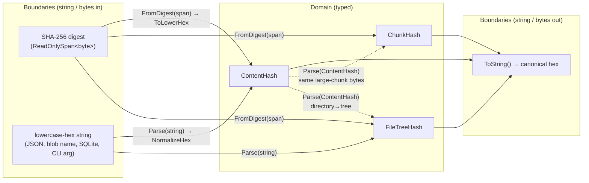

# Typed hashes

> **Code:** `src/Arius.Core/Shared/Hashes/*` (`ContentHash`, `ChunkHash`, `FileTreeHash`, `HashCodec`)  ·  **Decisions:** [ADR-0003](../../../decisions/adr-0003-use-distinct-typed-hashes.md) · [ADR-0004](../../../decisions/adr-0004-split-filetree-entry-hash-identities.md)  ·  **Terms:** [content hash](../../../glossary.md#content-hash) · [chunk hash](../../../glossary.md#chunk-hash) · [ContentHash](../../../glossary.md#contenthash) · [ChunkHash](../../../glossary.md#chunkhash) · [FileTreeHash](../../../glossary.md#filetreehash)

## Purpose

Arius is content-addressed, so the same 64-character SHA-256 hex value can mean three different repository identities depending on where it is used: a [content hash](../../../glossary.md#content-hash) (original file bytes / dedup identity), a [chunk hash](../../../glossary.md#chunk-hash) (the blob the bytes actually live in), or a filetree hash (an immutable directory-tree node). These three value objects make those identities distinct *in the type system* so they cannot be mixed by accident, while keeping every persisted and wire format an identical canonical lowercase-hex string.

## How it works

Three structs — [`ContentHash`](../../../glossary.md#contenthash), [`ChunkHash`](../../../glossary.md#chunkhash), [`FileTreeHash`](../../../glossary.md#filetreehash) — each a `public readonly record struct` with a `private` constructor and a `private string Value`. They are deliberately parallel but **not related**: no shared base, no interface, no generic `Hash<T>`. Structs can't inherit, so the shared formatting/validation logic lives in `internal static class HashCodec`, not a base class.

**Constructing a typed hash** — two entry points, both routing through `HashCodec`:

- `FromDigest(ReadOnlySpan<byte> digest)` — for a freshly computed digest. `HashCodec.ToLowerHex` rejects anything that isn't exactly `Sha256ByteLength` (32) bytes and emits canonical lowercase hex via `Convert.ToHexString(...).ToLowerInvariant()`. This is the path the encryption services take when they hand back a content hash (e.g. `PassphraseEncryptionService` returning `ContentHash.FromDigest(sha.GetHashAndReset())`).
- `Parse(string value)` — for a value crossing a string boundary. `HashCodec.NormalizeHex` enforces exactly `Sha256HexLength` (64) characters, validates each character is `[0-9a-fA-F]`, and lowercases uppercase hex. Wrong length or a non-hex character throws `FormatException`.

`TryParse(string?, out …)` wraps `Parse` for boundaries where invalid input is expected (null/whitespace → `default` + `false`; `FormatException` → `default` + `false`).

**Typed cross-conversion** is permitted *only where a real repository relationship exists*, and only as an explicit overload — never implicit:

- `ChunkHash.Parse(ContentHash)` / `ContentHash.Parse(ChunkHash)` — a [large chunk](../../../glossary.md#chunk) stores the source bytes unchanged, so its chunk hash equals the content hash. The overload beats a stringly `ChunkHash.Parse(contentHash.ToString())` hop (see [ADR-0003](../../../decisions/adr-0003-use-distinct-typed-hashes.md)).
- `FileTreeHash.Parse(ContentHash)` — the boundary where a directory's content digest becomes a tree-node identity.

**Leaving the domain** — `ToString()` returns the canonical hex `Value`. That single accessor feeds every boundary: `FileTreeHashJsonConverter` writes `value.ToString()` into snapshot JSON and reads it back with `FileTreeHash.Parse`; blob naming goes through `BlobPaths.ChunkPath(ChunkHash)` / `BlobPaths.FileTreePath(FileTreeHash)`; the chunk-index SQLite store converts out with `ToString()` then `Convert.FromHexString` to store the raw 32-byte digest as a BLOB, and reconstructs with `FromDigest((byte[])reader.GetValue(...))` on the way back (`ChunkIndexLocalStore`). Display helpers `Prefix4`, `Short8`, and `ContentHash.Prefix(int)` are likewise string outputs for logs/UI.

## Key invariants

- **Three distinct types, no abstraction over them.** No generic hash, no inheritance, no interface, no implicit conversions between the hash types or between a hash type and `string`. Mixing identities is a compile error in almost every call path.
- **Canonical lowercase hex is the one persisted/wire shape.** Everything stored or transmitted (snapshot JSON, blob paths, CLI args) is the lowercase-hex `ToString()` form; `NormalizeHex`/`ToLowerHex` are the only producers and they guarantee it. The chunk-index SQLite cache stores the *digest bytes* of that same value — still the canonical hex on the way in and out, just unpacked for storage.
- **Length and alphabet are enforced at construction.** `Parse` requires exactly 64 hex chars; `FromDigest` requires exactly a 32-byte digest. There is no way to build an out-of-spec hash through a public API.
- **Fail-fast on `default(...)`.** A `default` struct has a null backing field; the private `Value` getter throws `InvalidOperationException("… is uninitialized.")` rather than treating null as a valid empty hash. An uninitialized hash blows up at first use instead of corrupting identity comparisons.
- **Typed only inside the domain; `string` only at boundaries.** Domain code passes `ContentHash`/`ChunkHash`/`FileTreeHash` (including as dictionary/set keys); conversion to/from `string` happens *only* at storage, serialization, logging, CLI, and UI seams.

## Why this shape

- Distinct value objects instead of raw strings or one generic hash — see [ADR-0003](../../../decisions/adr-0003-use-distinct-typed-hashes.md), which also covers why conversions are explicit overloads, why archive upload progress is keyed by `ChunkHash`, and the secondary allocation win from removing stringly hash plumbing from hot paths.
- The split between file-entry identity (`ContentHash`) and directory-entry identity (`FileTreeHash`) — and why filetree entries are modelled as separate `FileEntry`/`DirectoryEntry` types rather than one tagged record with a generic hash field — is [ADR-0004](../../../decisions/adr-0004-split-filetree-entry-hash-identities.md).
- `HashCodec` is `internal` + `[SharedWithinAssembly]` because it's pure plumbing for the three structs (its summary says exactly this: *"structs cannot inherit"*); it deliberately is not part of the public hash surface.

## Open seams / future

- All three types hard-code SHA-256 via `HashCodec.Sha256ByteLength`/`Sha256HexLength`. A different digest algorithm would mean revisiting `HashCodec` (and the persisted format) rather than parameterizing these structs — consistent with Arius's no-back-compat dev posture.
- The cross-`Parse` overloads encode the *current* repository relationships (large-chunk identity, directory→tree). A new structural relationship between identities would add a new explicit overload here; the deliberate absence of implicit conversion means each such relationship stays reviewable at its call site.
- Three near-identical struct bodies are intentional duplication (the no-inheritance/no-generic rule). If the parallel display/parsing surface grows, the pressure should go into `HashCodec` helpers, not into reintroducing a shared base type.
