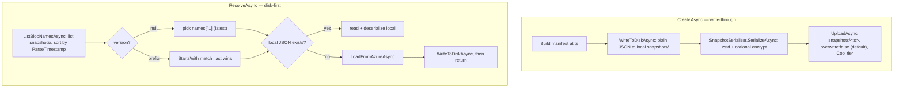
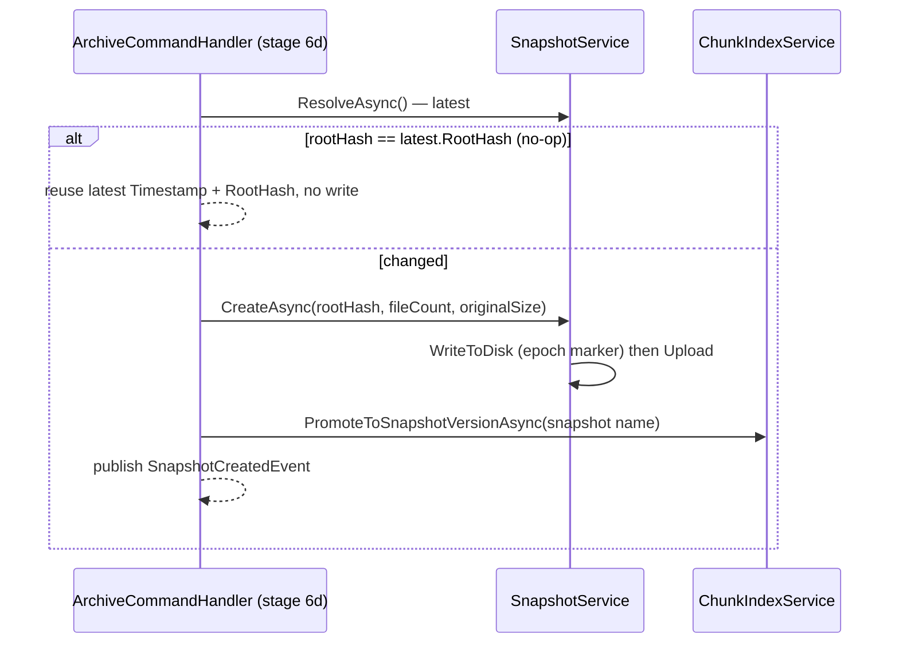

# Snapshots & epoch coordination

> **Code:** `src/Arius.Core/Shared/Snapshot/` (`SnapshotService.cs`, `SnapshotManifest.cs`, `SnapshotSerializer.cs`, `FileTreeHashJsonConverter.cs`)  ·  **Decisions:** [ADR-0002](../../../decisions/adr-0002-skip-snapshots-for-no-op-archives.md) · [ADR-0016](../../../decisions/adr-0016-multi-machine-cache-coherence.md) · [ADR-0017](../../../decisions/adr-0017-idempotent-non-distributed-recovery.md)  ·  **Terms:** [snapshot](../../../glossary.md#snapshot) · [epoch](../../../glossary.md#epoch) · [filetree](../../../glossary.md#filetree)

## Purpose

A [snapshot](../../../glossary.md#snapshot) is the immutable, point-in-time manifest that names one complete repository state: the root [filetree](../../../glossary.md#filetree) hash plus its totals. `SnapshotService` creates, lists, and resolves snapshots against `snapshots/<timestamp>` blobs with a local plain-JSON cache. The latest snapshot is also the repository's commit point and the [epoch](../../../glossary.md#epoch) marker the rest of the cache stack coordinates against.

## How it works

### The manifest

`SnapshotManifest` is a tiny immutable record — it does *not* embed the tree, only its root:

| Field | Meaning |
|---|---|
| `Timestamp` | UTC creation time; doubles as the blob name and version id |
| `RootHash` | root `FileTreeHash` (SHA-256 hex) produced by the tree builder |
| `FileCount` / `OriginalSize` | snapshot totals: file count and the logical size — summed original (uncompressed) bytes of all files, counting duplicates once per file (the size you would restore). Not deduplicated or compressed. |
| `AriusVersion` | tool version that wrote it — shared `AriusVersion.Informational`, [stamped from the git tag at publish](../../../guide/deployment.md#which-version-am-i-running) |

The manifest is the *root* of the Merkle structure: `RootHash` points at the top filetree blob, which references the rest. `FileTreeHashJsonConverter` persists `RootHash` as its canonical lowercase-hex string.

Two storage representations of the same manifest:
- **Disk** (`SnapshotService.SerializerOptions`, indented): plain JSON at `~/.arius/{account}-{container}/snapshots/<timestamp>` via a `RelativeFileSystem` rooted at `RepositoryLocalStatePaths.GetSnapshotCacheRoot`.
- **Azure wire** (`SnapshotSerializer`, compact): `JSON → compress → optional encrypt`, uploaded at `BlobPaths.SnapshotPath(timestamp)` on the Cool tier with content type `ContentTypes.SnapshotPlaintext` (`application/zstd`) or `SnapshotGcmEncrypted` (`application/aes256gcm+zstd`).

### Create (write-through) and resolve (disk-first)

`CreateAsync` writes the disk copy **before** the upload. The local file is the per-machine "I wrote the last snapshot" marker (see invariants); writing it before the upload would be wrong, so the order is disk-then-Azure but both must succeed for the marker to be meaningful — the marker is only authoritative once the matching remote blob also exists.

`ResolveAsync` always lists `snapshots/` first to pick the target name (latest, or the last name whose filename `StartsWith` the requested `version`), then prefers the local JSON cache and only falls back to Azure on a miss — populating the disk cache on the way out. `ListBlobNamesAsync` returns names sorted oldest→newest by `ParseTimestamp`.

### Snapshot as the epoch / commit point

The latest snapshot name is the single coordination point for the whole cache stack. Two consumers read it:

- `FileTreeService.ValidateAsync` compares the latest *local* snapshot name to the latest *remote* one once per archive run. Equal ⇒ fast path (this machine was last writer, local caches fully trusted, no `filetrees/` listing). Different ⇒ slow path (another machine archived; materialize markers and signal a mismatch, which makes `ArchiveCommandHandler` call `ChunkIndexService.InvalidateCaches()` before flush). See [ADR-0016](../../../decisions/adr-0016-multi-machine-cache-coherence.md) and [chunk-index](./chunk-index.md) / [filetree](./filetree.md) for the consuming side.
- `ArchiveCommandHandler` stage 6d is the only place a snapshot is *created*, and it is the **last** durability step — every chunk, thin chunk, filetree blob, and chunk-index shard it references is already durable. After `CreateAsync` it calls `ChunkIndexService.PromoteToSnapshotVersionAsync(<snapshot name>)` so validated coverage claims carry forward to the new epoch.

A re-archive of unchanged data rebuilds the same `rootHash`; stage 6d resolves the latest snapshot, sees `latestSnapshot.RootHash == rootHash`, and **reuses** it instead of publishing a new manifest — no-op archives create no history. See [ADR-0002](../../../decisions/adr-0002-skip-snapshots-for-no-op-archives.md).

## Key invariants

- **Manifests are immutable and content-rooted.** A snapshot is never edited; `RootHash` is the SHA-256 root of the filetree, so two snapshots with the same root describe the same state. `CreateAsync` defaults to `overwrite: false` (each normal run gets a fresh `now` timestamp, so manifests are append-only). The one exception is a caller that creates a snapshot at a *deterministic* `timestamp` and needs re-runs to be idempotent — the [v5→v7 migration](../../migration.md) passes an explicit `timestamp` (the source state's version) with `overwrite: true` so replaying it rewrites the same blob rather than failing on a conflict.
- **Timestamp lexicographic order == chronological order.** `TimestampFormat = "yyyy-MM-ddTHHmmss.fffZ"` (UTC, zero-padded) makes "latest" a plain string sort on both disk filenames and blob names — `ResolveAsync` and `ValidateAsync` rely on this to pick the epoch without parsing every name.
- **Disk-write-before-upload, and "latest local == latest remote" ⇒ this machine wrote last.** The local `snapshots/` marker is written only when *this* machine completes an archive, so name equality is exactly the fast-path proposition in `FileTreeService.ValidateAsync` ([ADR-0016](../../../decisions/adr-0016-multi-machine-cache-coherence.md)).
- **Snapshot last.** The manifest is published only after all data it references is durable; a resolvable snapshot is therefore always fully restorable ([ADR-0017](../../../decisions/adr-0017-idempotent-non-distributed-recovery.md)).
- **No-op archives reuse the latest snapshot.** Equal root hash ⇒ no new manifest ([ADR-0002](../../../decisions/adr-0002-skip-snapshots-for-no-op-archives.md)); callers that need to know whether a new snapshot was published must compare versions, not just archive success.
- **The version id is the timestamp filename.** `GetVersion` / `ParseTimestamp` / `ResolveAsync(version)` all key off the bare `snapshots/<name>` filename; `GetSnapshotFileName` rejects any blob name not directly under root or `SnapshotsPrefix`.

## Why this shape

- **Snapshot as epoch instead of a distributed lock.** The snapshot already exists as the repository's single commit point, so it doubles as a free coherence marker — the same-machine repeat-archive path stays nearly listing-free. Rationale and the accepted last-writer-wins tradeoff: [ADR-0016](../../../decisions/adr-0016-multi-machine-cache-coherence.md).
- **Snapshot-last commit, metadata-presence recovery.** Publishing the manifest only after referenced data is durable makes re-running the command the entire recovery procedure, with no coordinator: [ADR-0017](../../../decisions/adr-0017-idempotent-non-distributed-recovery.md).
- **Skip no-op snapshots.** Snapshot history records state changes, not command invocations: [ADR-0002](../../../decisions/adr-0002-skip-snapshots-for-no-op-archives.md).
- **Two serializers (disk plain, Azure compressed+encrypted).** The local cache is human-readable plain JSON for inspection; the wire format mirrors how every other blob is stored. The `FileTreeHash` converter keeps both byte-identical in their JSON shape.

## Open seams / future

- **Concurrent multi-machine writes** are tolerated but not coordinated. Two machines publishing snapshots interleave by timestamp; the chunk-index shard rewrites underneath them are last-writer-wins, recovered only by `RepairAsync`. ETag-conditional shard writes are the noted future hardening ([ADR-0016](../../../decisions/adr-0016-multi-machine-cache-coherence.md)).
- **Crash between snapshot upload and local marker write** costs a spurious slow path (a re-list + shard revalidation) on the next run — a performance cost, not a correctness bug.
- **`version` resolution is a prefix `StartsWith` over the full listing.** Fine at human snapshot counts; if a single repository ever accumulates very many snapshots, both `ResolveAsync` and `ListBlobNamesAsync` materialize and sort the entire `snapshots/` listing per call.
- **No retention / pruning.** Snapshots accumulate indefinitely; there is no expiry or GC of old manifests today.
