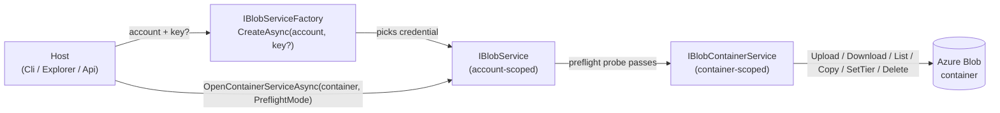
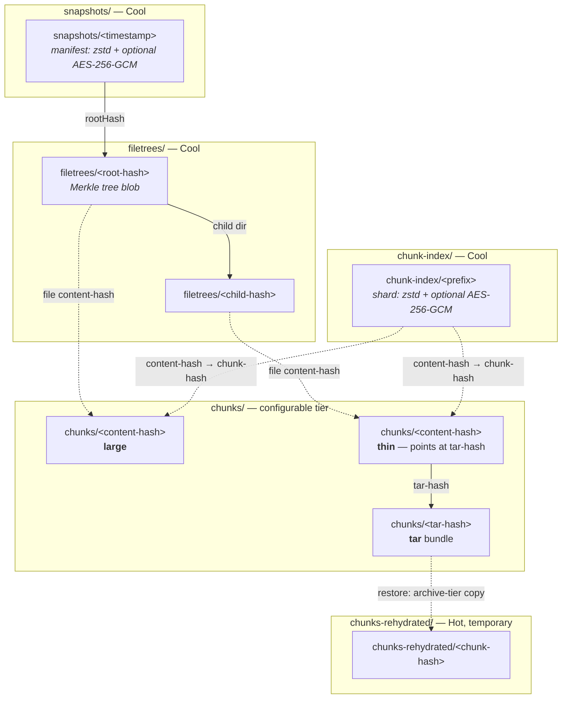
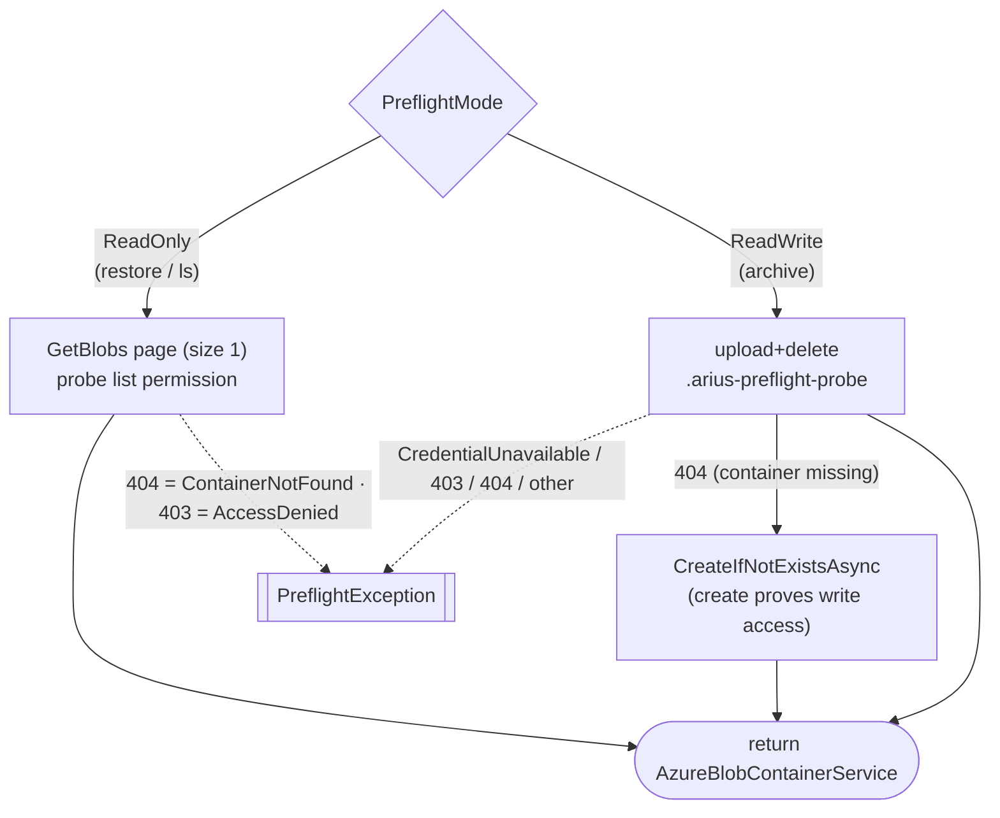

# Storage boundary & container layout

> **Code:** `src/Arius.Core/Shared/Storage/` (`IBlobService`, `IBlobContainerService`, `IBlobServiceFactory`, `BlobConstants.cs`, `Preflight.cs`) · impl `src/Arius.AzureBlob/`  ·  **Decisions:** [ADR-0013](../../../decisions/adr-0013-core-host-separation.md)  ·  **Terms:** [chunk](../../../glossary.md#chunk) · [filetree](../../../glossary.md#filetree) · [snapshot](../../../glossary.md#snapshot) · [storage tier hint](../../../glossary.md#storage-tier-hint)

## Purpose

This is the seam between the archival domain and the blob backend. It defines three interfaces (`IBlobServiceFactory` → `IBlobService` → `IBlobContainerService`) that abstract *all* persistence, the on-blob layout of a repository (the `chunks/` / `chunks-rehydrated/` / `filetrees/` / `snapshots/` / `chunk-index/` prefixes), and the credential-resolution + preflight handshake every host runs before opening a repository. Arius.Core compiles with **no reference to `Azure.Storage.Blobs`**; the only implementation, `Arius.AzureBlob`, lives behind these interfaces. The same adapter also implements the storage **cost** port (`IStorageCostEstimator`, [cost estimation](cost.md)), so all Azure-specifics — connection, tiers, *and* pricing — sit in one place.

## How it works

### The three-interface stack

A host turns an account name + optional key into a validated, container-scoped I/O surface in three steps. The split exists because each layer is a different scope of authority and a different injection point (see [ADR-0013](../../../decisions/adr-0013-core-host-separation.md)).

- **`IBlobServiceFactory.CreateAsync(accountName, accountKey?)`** — builds an account-level client and chooses the credential (below). Returns an `IBlobService`. No network call yet.
- **`IBlobService`** — account scope. `GetContainerNamesAsync` enumerates repository containers (a container counts as an Arius repo iff it has any blob under `snapshots/` — see `AzureBlobService.IsAriusArchive`). `OpenContainerServiceAsync(container, PreflightMode)` runs the preflight probe and, on success, returns the container-scoped service.
- **`IBlobContainerService`** — the workhorse. One container = one repository. Exposes upload (`UploadAsync` + streaming `OpenWriteAsync`), download (`DownloadAsync` / `TryDownloadAsync`), `GetMetadataAsync` (HEAD), prefix `ListAsync`, `SetMetadataAsync`, `SetTierAsync`, server-side `CopyAsync` (rehydration), and `DeleteAsync`.

Feature handlers don't normally hold these directly — they go through the shared services (`SnapshotService`, `FileTreeService`, `ChunkIndexService`, `ChunkStorageService`), which own the blob *protocol* on top of this raw I/O. This file documents the boundary itself; the protocol lives in those services' docs (e.g. [`chunk-storage.md`](./chunk-storage.md), [`chunk-index.md`](./chunk-index.md)).

### Container layout

`BlobPaths` (in `BlobConstants.cs`) is the single source of truth for blob names. Every path is built from strong domain types (`ChunkHash`, `ContentHash`, `FileTreeHash`), never raw strings. One container holds the whole repository under five virtual prefixes:

| Prefix | `BlobPaths` member | Holds | Tier |
|---|---|---|---|
| `chunks/` | `ChunkPath(ChunkHash)`, `ThinChunkPath(ContentHash)` | [chunk](../../../glossary.md#chunk) blobs (large / tar / thin) | configurable (`-t`) |
| `chunks-rehydrated/` | `ChunkRehydratedPath(ChunkHash)` | temporary Hot-tier copies during restore | Hot |
| `filetrees/` | `FileTreePath(FileTreeHash)` | [filetree](../../../glossary.md#filetree) Merkle nodes | Cool |
| `snapshots/` | `SnapshotPath(timestamp)` | [snapshot](../../../glossary.md#snapshot) manifests | Cool |
| `chunk-index/` | `ChunkIndexShardPath(PathSegment)` | dedup index shards | Cool |

### Blob identity is the ETag

The interface exposes a single opaque `ETag` string on `UploadResult`, `DownloadResult`, `BlobMetadata`, and `BlobListItem`. The Azure impl fills it from the blob ETag; **Core treats it as an opaque token and only ever compares it for string equality** — it never parses Azure ETag syntax. This is the change-detection primitive for the chunk-index cache: `ChunkIndexService` records `UploadResult.ETag` after flushing a shard and reads `DownloadResult.ETag` on the validation re-read instead of issuing a separate HEAD (`ChunkIndexService.UploadShardAsync` and the listing-cache path).

### Completion sentinel: metadata written last

There is no transaction across blob body + metadata. Instead, **the presence of the `arius_type` metadata key is the sole "this upload committed" signal** (`BlobMetadataKeys.AriusType`). `ChunkStorageService.UploadChunkAsync` streams the body, then writes `arius_type` (+ `chunk_size`, `original_size`, `parent_chunk_hash`) *last*. A body blob without `arius_type` is partial debris — safe to delete and retry. There is deliberately **no `arius_complete` key**. The recovery-path catch (`BlobAlreadyExistsException` → re-read metadata → check `arius_type`) is the load-bearing consumer; the rationale is [ADR-0017](../../../decisions/adr-0017-idempotent-non-distributed-recovery.md) (documented in [`chunk-storage.md`](./chunk-storage.md)).

### Credential resolution chain

Hosts resolve a credential in priority order before calling the factory: `--key` flag → `ARIUS_KEY` env var → user secrets → fall back to `AzureCliCredential` (`az login`). The factory only sees the *result* of that walk: a non-empty `accountKey` → `StorageSharedKeyCredential` (`authMode = "key"`); otherwise `AzureCliCredential` (`authMode = "token"`). `AzureBlobServiceFactory.CreateAsync` does exactly this branch. Arius deliberately does **not** use `DefaultAzureCredential` — the fallback is the single explicit `AzureCliCredential`.

### Preflight: fail fast with a classified error

`OpenContainerServiceAsync` is not a pure getter; it probes access per `PreflightMode` so a misconfiguration surfaces as one clean message instead of a mid-archive crash:

- **`PreflightMode.ReadWrite`** (archive): upload + delete a `.arius-preflight-probe` blob. If the upload 404s the container doesn't exist yet (first run) — create it instead; a credential that can create a container can write blobs, so the create *is* the write proof, and the common case (container exists) costs no extra round-trip.
- **`PreflightMode.ReadOnly`** (restore, ls): fetch one page of blobs to prove list permission. A missing container surfaces as `ContainerNotFound`, not a confusing empty result.

Failures are caught and re-thrown as a single `PreflightException` carrying `PreflightErrorKind` (`ContainerNotFound` 404 / `AccessDenied` 403 / `CredentialUnavailable` / `Other`) plus `AuthMode`, `AccountName`, `ContainerName`, `StatusCode`. The exception carries **structured fields, not a pre-formatted message** — each host renders its own user-facing text (e.g. the CLI maps `AccessDenied` to a sample `az role assignment create` line).

### Error contract crossing the boundary

The Azure impl maps SDK `RequestFailedException`s to three Core exceptions so callers never catch raw Azure types: `BlobAlreadyExistsException` (412 `ConditionNotMet` from `IfNoneMatch=*`, or 409 `BlobAlreadyExists`/`BlobArchived`), `BlobNotFoundException` (404 `BlobNotFound`), and `BlobArchivedException` (409 `BlobArchived` on read — lets restore re-route the chunk to rehydration). The tier enums (`BlobTier`, `RehydratePriority`) are Core's own; `AzureBlobContainerService` translates them to/from `AccessTier` and reads `IsRehydrating` from `ArchiveStatus`.

## Key invariants

- **Core has zero Azure types.** No `Azure.*` reference crosses into Arius.Core — the interfaces use only Core types (`RelativePath`, `BlobTier`, the `Blob*Exception`s). ([ADR-0013](../../../decisions/adr-0013-core-host-separation.md))
- **Blob names come only from `BlobPaths`.** Names are derived from typed hashes; no caller string-concatenates a blob path. A repository's layout is whatever `BlobPaths` says it is.
- **`arius_type` presence = committed.** Metadata is written after the body succeeds; never write the sentinel before the body round-trips. No `arius_complete` key exists. ([ADR-0017](../../../decisions/adr-0017-idempotent-non-distributed-recovery.md))
- **ETag is opaque.** Compare with string equality only; never parse it. Across `UploadResult`/`DownloadResult`/`BlobMetadata`/`BlobListItem` it is the same change-detection token.
- **`OpenWriteAsync` / `UploadAsync(overwrite:false)` are create-if-not-exists.** They use `IfNoneMatch=*` optimistic concurrency and throw `BlobAlreadyExistsException` *before* any body is written — the basis of crash-safe idempotent retries.
- **A container is an Arius repository iff `snapshots/` is non-empty.** `GetContainerNamesAsync` filters on this; an empty/placeholder `snapshots/` blob alone doesn't count.
- **Preflight fields are structured, not formatted.** `PreflightException` never bakes in a user message; hosts own presentation.

## Why this shape

- **Interface, not SDK.** The whole reason Core depends on `IBlobContainerService` rather than `BlobContainerClient` is to keep the years-recoverable domain free of one storage vendor and to allow S3 / local-filesystem backends by adding an implementation, not editing Core. The full alternatives analysis is [ADR-0013](../../../decisions/adr-0013-core-host-separation.md) — not restated here.
- **Three layers, not one.** Account scope (list repos, pick credential) and container scope (one repo's I/O) are genuinely different authorities and different DI lifetimes; the factory keeps credential construction out of Core entirely.
- **Sentinel over transaction.** Blob stores give no cross-object transaction, so committedness is made a property of the blob itself — see [ADR-0017](../../../decisions/adr-0017-idempotent-non-distributed-recovery.md).
- **Preflight on every run.** A read-only `ls` probing *list* (not just container existence) and an archive probing *write* (folding container-create into the same path) means access problems fail with one actionable error up front rather than partway through a long operation.

## Open seams / future

- **Only one backend exists.** `Arius.AzureBlob` is the sole implementation. S3 / local-filesystem are the intended next backends and are the reason the boundary exists; a new backend implements these three interfaces and touches nothing in Core. Tier semantics (`Hot/Cool/Cold/Archive`, rehydration via server-side `CopyAsync`) are Azure-shaped and a non-tiered backend would map them to no-ops.
- **Credential sources are CLI-centric.** The chain (`--key` → `ARIUS_KEY` → user secrets → `AzureCliCredential`) and the deliberate avoidance of `DefaultAzureCredential` live in the hosts; a managed-identity or workload-identity host would extend the host-side resolution, not this boundary.
- **Content types are informational.** `ContentTypes` records `zstd` (new) vs `+gzip` (legacy) variants, but the read path auto-detects the codec from the frame's magic bytes — content type is a label, not the decode signal.
- **Legacy compatibility is read-only.** Both AES-256-GCM (new) and AES-256-CBC (legacy) and both zstd/gzip blobs are *readable*; new writes are always GCM + zstd.
