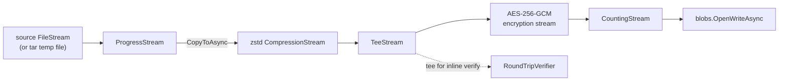

# Streaming

> **Code:** `src/Arius.Core/Shared/Streaming/*` (`ProgressStream`, `CountingStream`)  ·  **Terms:** [chunk](../../../glossary.md#chunk)  ·  **Cross-cutting:** [memory-boundedness](../../cross-cutting/memory-boundedness.md)

## Purpose

Two single-concern `Stream` decorators that let the chunk upload/download path stay fully streaming: `ProgressStream` reports cumulative bytes read, and `CountingStream` records how many bytes were ultimately written to blob storage. Each adds exactly one cross-cutting behavior and buffers nothing beyond the caller's buffer.

## How it works

Both wrappers are thin pass-through decorators that delegate every `Read`/`Write` to the inner stream and throw `NotSupportedException` for the direction they do not serve (`ProgressStream` is read-only, `CountingStream` is write-only). They exist to be slotted into the push-direction upload chain assembled by `ChunkStorageService.UploadChunkAsync`, where data is *pushed* from a seekable source through each layer into the Azure write stream — no pipes, no `MemoryStream`, no intermediate temp file (the tar bundle is the one exception, and it is itself streamed in).

- **`ProgressStream(inner, IProgress<long>)`** wraps the *source* at the top of the chain so progress tracks logical bytes read off disk, not compressed bytes on the wire. `Length` is delegated to the inner `FileStream`, so the consumer knows the total up front and can compute a percentage. It reports after each read; a zero-length read reports nothing. The download path reuses it the same way, wrapping the blob's read stream.
- **`CountingStream(inner)`** sits at the *bottom* of the chain, directly above `OpenWriteAsync`, and increments `BytesWritten` on every write. It is read *after* the chain is disposed to capture the final compressed-and-encrypted blob size, which `UploadChunkAsync` then writes into blob metadata (`chunk-size`).

The note in `UploadChunkAsync` is load-bearing here: the encryption stream is disposed *explicitly* before reading `BytesWritten`, because GCM flushes its final auth tag on dispose — reading the count earlier would undercount by the tag bytes.

## Key invariants

- **No buffering proportional to file size.** Both wrappers hold only a `long` counter; the chain streams a multi-GB file without an O(file-size) allocation. See [memory-boundedness](../../cross-cutting/memory-boundedness.md).
- **`CountingStream.BytesWritten` is valid only after the whole chain is finalized.** Every layer above it (compression frame, GCM tag) must be flushed/disposed first, or the recorded `chunk-size` is short.
- **`ProgressStream` is read-only, `CountingStream` is write-only.** They guard their unsupported direction with `NotSupportedException` rather than silently no-op'ing, so a misuse fails loudly.
- **Counting reflects what was actually persisted.** `CountingStream` wraps the Azure write stream, so its total is the blob's real stored size, not a pre-computed estimate.

## Why this shape

Splitting "report read progress" and "count written bytes" into separate one-line decorators keeps each upload-chain layer responsible for exactly one concern, mirroring how `ICompressionService` and `IEncryptionService` each contribute one stream wrapper. The alternative — threading byte counts and progress callbacks through the codec/encryption stream classes — would couple cross-cutting telemetry into the crypto/compression code. Measuring the count at the bottom of the chain (rather than computing it from the source size) is what lets metadata record the *true* compressed blob size in a single pass.

## Open seams / future

- `ProgressStream` reports raw read counts; smoothing/throttling of the `IProgress<long>` callback is left to the consumer (`UploadChunkAsync` already de-dupes non-increasing reports via a `CallbackProgress`).
- Any future upload layer (e.g. a second integrity tee) slots into the same push chain in `UploadChunkAsync` between source and `OpenWriteAsync`; these two wrappers stay unchanged as the progress/size endpoints.
