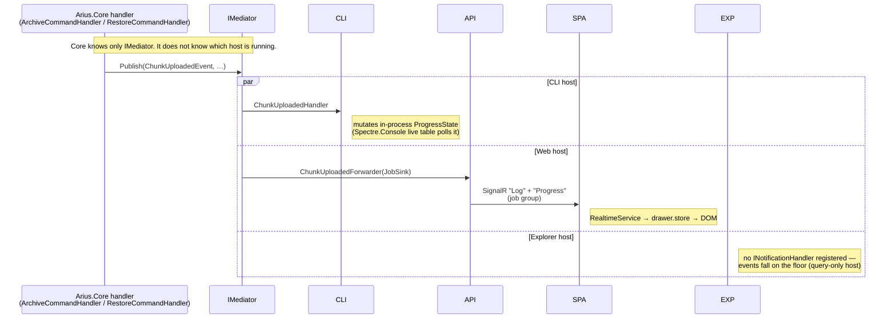

# Events & progress

> **Code:** `src/Arius.Core/Features/ArchiveCommand/Events.cs` · `src/Arius.Core/Features/RestoreCommand/Events.cs` · `Mediator` (`IMediator.Publish`) · **Decisions:** [ADR-0010](../../decisions/adr-0010-use-feature-handlers-for-application-use-cases.md), [ADR-0013](../../decisions/adr-0013-core-host-separation.md) · **Terms:** [chunk](../../glossary.md#chunk) · [snapshot](../../glossary.md#snapshot)

## Purpose

The archive and restore handlers in Arius.Core emit a fixed set of `INotification` progress events while they run. Core has **zero knowledge of any host** — it only `Publish`es. Each host (CLI, Web/API, Explorer) decides independently whether to subscribe, and renders the same events completely differently. This doc is the contract between the emitter and the consumers; per-host *rendering* lives in the host docs.

## How it works

### The published event set

Two slices publish events, both `sealed record … : INotification` declared in their slice's `Events.cs`:

| Archive — `Features/ArchiveCommand/Events.cs` | Meaning |
|---|---|
| `FileScannedEvent` / `ScanCompleteEvent` | per-file enumeration tick / final totals |
| `EntryExcludedEvent` | a file/dir excluded *at enumeration* (excluded, broken symlink, unreadable dir) — never scanned; tallied into `ArchiveResult.EntriesExcluded` |
| `FileHashingEvent` / `FileHashedEvent` / `FileSkippedEvent` | hashing lifecycle of one file; `FileSkippedEvent` drops an already-scanned file mid-pipeline (vs `EntryExcludedEvent` above) |
| `TarBundleStartedEvent` / `TarEntryAddedEvent` / `TarBundleSealingEvent` / `TarBundleUploadedEvent` | [tar-chunk](../../glossary.md#tar-chunk) bundle lifecycle |
| `ChunkUploadingEvent` / `ChunkUploadedEvent` | [chunk](../../glossary.md#chunk) upload start / done (carries `ChunkHash`) |
| `FinalizingSnapshotEvent` | payload-free marker: every streaming stage has drained, the run now finalizes (validate → build tree → create snapshot → write pointers). Fires once per run, including no-new-data runs where `SnapshotCreatedEvent` is skipped |
| `SnapshotCreatedEvent` | the [snapshot](../../glossary.md#snapshot) was written |

| Restore — `Features/RestoreCommand/Events.cs` | Meaning |
|---|---|
| `SnapshotResolvedEvent` | snapshot selected (version → `FileTreeHash`) |
| `TreeTraversalProgressEvent` / `TreeTraversalCompleteEvent` | classification walk of selected files |
| `FileRoutedEvent` | per-file local-conflict decision (`RestoreRoute`) |
| `ChunkResolutionCompleteEvent` / `RehydrationStatusEvent` | distinct chunks needed / hydration status |
| `RehydrationStartedEvent` | archive-tier chunks queued for rehydration |
| `ChunkDownloadStartedEvent` / `ChunkDownloadCompletedEvent` | per-chunk download lifecycle |
| `FileRestoredEvent` / `FileSkippedEvent` | a file written to disk / kept-local |
| `CleanupCompleteEvent` | rehydrated-chunk cleanup finished |

The handlers fire them inline at the matching pipeline stage, e.g. `ArchiveCommandHandler` does `await _mediator.Publish(new ScanCompleteEvent(count, totalBytes), ct)` after enumeration and `new SnapshotCreatedEvent(rootHash.Value, …)` at the end. The payloads are deliberately host-agnostic domain values (`RelativePath`, `ChunkHash`, `FileTreeHash`, byte counts) — never display strings, bundle numbers, or percentages.

### Core emits; hosts consume independently

The `Mediator` notification pattern is the seam. Core depends only on `IMediator`; a consumer is any `INotificationHandler<T>` the source generator finds **in the host assembly**. The handler set is discovered by calling `services.AddMediator()` *in the host*, so the generator scans both Arius.Core and the host:

- **CLI** — `BuildProductionServices` calls `AddMediator()` so it finds the handlers in `Arius.Cli` (`CliBuilder.cs`).
- **API** — `RepositoryProviderRegistry.BuildAsync` calls `AddMediator()` per provider so it finds the `…Forwarder` handlers in `Arius.Api`.

Core never references a host type, never holds a host callback, and is not told who (if anyone) is listening — a publish with no registered handler is simply a no-op.

### Per-host wiring (rendering lives in the host docs)

- **CLI** — thin `INotificationHandler<T>` in `Commands/Archive/ArchiveProgressHandlers.cs` (and the restore equivalents) mutate a singleton `ProgressState`; a Spectre.Console live display polls that state. State transitions only, no business logic. → [hosts/cli.md](../../design/hosts/cli.md)
- **Web** — `ArchiveForwarders` / `RestoreForwarders` translate each event into a `JobSink` call, which pushes a `Log` console line and/or a `Progress` stat-grid update to the job's SignalR group; `RealtimeService` in the SPA fans those into `log$`/`progress$`/`done$`. → [hosts/web.md](../../design/hosts/web.md)
- **Explorer** — registers **no** progress handlers. It uses the same `IMediator` only for `ListQuery`/browse; archive/restore progress events are not subscribed and simply have no consumer. → [hosts/explorer.md](../../design/hosts/explorer.md)

### The other channel: `IProgress<long>` byte streams (not Mediator)

High-frequency *byte-level* progress (bytes hashed, bytes uploaded) does **not** go through Mediator. The command options carry factory closures the host supplies — `ArchiveCommandOptions.CreateHashProgress` / `CreateUploadProgress` (`Func<…, IProgress<long>>`), `OnHashQueueReady` / `OnUploadQueueReady` (queue-depth getters) — and the handler invokes them in the per-file hot loop. This keeps the chatty per-byte updates off the notification bus while the coarse lifecycle ticks ride Mediator. The CLI wires these to the same `ProgressState`; the API/Explorer leave them null.

## Key invariants

- **Core never names a host.** No `INotification` payload, and no Arius.Core type, may reference CLI/Web/Explorer concepts (no display strings, percentages, or bundle numbers — bundle numbering is a CLI-only concern assigned in `TarBundleStartedHandler`).
- **`AddMediator()` runs in the host assembly,** not inside `AddArius`. This is what lets the source generator see host-side handlers; moving it into Core would silently drop every host handler. (See the comments in `CliBuilder.BuildProductionServices` and `RepositoryProviderRegistry.BuildAsync`.)
- **Handlers/forwarders are thin and side-effect-only** — a counter increment, state transition, or one outbound message. No handler decides pipeline behavior; losing or reordering an event must never corrupt Core state, only the display.
- **Per-job event isolation is by provider, not by correlation id.** The API builds a fresh provider per job whose `JobSink` is a singleton; the forwarders resolve *that* job's sink, so two concurrent jobs can't cross streams. Read providers get an inert `JobSink` (null `JobId`) so the forwarders are harmless. (`RepositoryProviderRegistry`, `JobRunner`.)
- **Event payloads are domain values** (`RelativePath`, `ChunkHash`, `FileTreeHash`), so any host can interpret them without Core's help.

## Why this shape

- Feature handlers behind `IMediator` as the Core application boundary ([ADR-0010](../../decisions/adr-0010-use-feature-handlers-for-application-use-cases.md)) and a hard Core↔host separation ([ADR-0013](../../decisions/adr-0013-core-host-separation.md)). Publish/subscribe lets a new host opt into progress by adding handlers, with no change to Core.
- **Two channels on purpose.** Lifecycle milestones (coarse, ordered, host-meaningful) go through Mediator; per-byte progress (chatty, throwaway) goes through `IProgress<long>` closures. One bus carrying both would either spam handlers or couple Core to a display cadence.
- **Provider-scoped sinks** instead of a `jobId` threaded through every event keep the event records clean and make isolation a composition concern, not an event-contract concern.

## Open seams / future

- The archive and restore event sets are **independent and ad hoc** — no shared base type or "stage" enum. A third long-running command would copy the pattern rather than reuse a contract; a future refactor could extract a common progress vocabulary if the rendering code starts duplicating.
- **Explorer is a non-consumer today.** If Explorer ever runs archive/restore in-process, it would add its own `INotificationHandler<T>` set (WPF/MVVM `ObservableObject` updates) exactly as the CLI does — the seam already supports it.
- The CLI bridges some `ChunkHash`-keyed events back to per-file rows via a `ContentHashToPath` reverse map (large-file chunk hash == content hash). That bridge is CLI-internal; if Core ever stops reusing the content hash as the large-chunk hash, the bridge — not the event contract — is what breaks.
