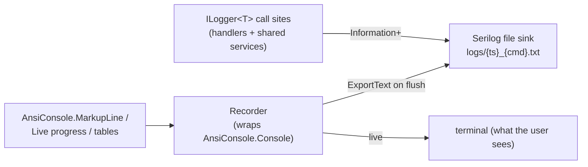

# Logging

> **Code:** `src/Arius.Cli/CliBuilder.cs` (CLI audit setup), `src/Arius.Api/Composition/RepositoryProviderRegistry.cs` (web per-repo rolling log), `src/Arius.Core/Features/*/...Handler.cs` (pipeline logs) · **Decisions:** [ADR-0007](../../decisions/adr-0007-separate-phase-and-detail-logging-in-pipeline-handlers.md) · **Terms:** [content hash](../../glossary.md#content-hash), [chunk index](../../glossary.md#chunk-index), [snapshot](../../glossary.md#snapshot)

## Purpose

Every `archive`, `restore`, `ls`, and `repair-index` invocation writes a complete, self-contained audit trail to disk: the full pipeline log plus a plain-text capture of everything the user saw on screen. The on-screen output stays terse; the file is the forensic record for debugging and benchmark timing.

## How it works

Two output channels, set up per invocation by each verb (`ArchiveVerb.Build`, `RestoreVerb.Build`, `LsVerb.Build`, `RepairVerb.Build`):

- **File sink (the audit log).** `CliBuilder.ConfigureAuditLogging(account, container, command)` sets `Log.Logger` to a single Serilog file sink at `Information` minimum level, writing to `~/.arius/{account}-{container}/logs/{yyyy-MM-dd_HH-mm-ss}_{command}.txt` (path from `RepositoryLocalStatePaths.GetLogsDirectory`, created if missing). The `update` verb skips this — it has no repository context. Every `ILogger<T>` call site across Core and the CLI feeds this one sink.
- **Console (what the user sees).** The CLI does **not** use a Serilog console sink. User-facing output is Spectre.Console (`AnsiConsole.MarkupLine`, the `Live` progress display, summary/cost tables). Each verb swaps `AnsiConsole.Console` for `AnsiConsole.Console.CreateRecorder()` for the duration of the run. The "console shows warnings and errors only" property is structural: only deliberate Spectre writes reach the screen, while informational pipeline detail goes solely to the file via `ILogger`.
- **Capture-on-flush.** In the verb's `finally`, `CliBuilder.FlushAuditLog(recorder)` calls `recorder.ExportText()` and appends it to the log under a `--- Console Output ---` header, then `Log.CloseAndFlush()`. So the file ends with an ASCII rendering of every table, progress summary, and error the user saw.

**Line format.** An `ExpressionTemplate` renders each file line as
`[{HH:mm:ss.fff}] [{u3}] [T:{ThreadId}] [{ShortSourceContext}] {Message}` (thread id from `.Enrich.WithThreadId()`, so concurrent hash/upload workers are distinguishable). `{ShortSourceContext}` is the class name peeled off the namespace-qualified Serilog `SourceContext` (`Coalesce(Substring(..., LastIndexOf '.'), 'Arius')`) — e.g. `ArchiveCommandHandler`, `FileTreeBuilder`, or `Arius` for context-less top-level crash logs.

**Two-level taxonomy in `{Message}` ([ADR-0007](../../decisions/adr-0007-separate-phase-and-detail-logging-in-pipeline-handlers.md)).** Pipeline *handlers* prefix messages with category tags; shared *services* log plain messages (identified by `{ShortSourceContext}` instead). The three levels, all visible in `ArchiveCommandHandler`:

| Level | Tag | Example |
|---|---|---|
| Lifecycle | `[archive]` / `[restore]` / `[repair]` | `[archive] Done: scanned={..} uploaded={..} size={..}` |
| Phase entry | `[phase] <name>` | `[phase] hash`, `[phase] tar-upload`, `[phase] snapshot` |
| Detail | `[hash]` `[dedup]` `[tar]` `[tree]` `[snapshot]` `[upload]` `[chunk-index]` | `[hash] {Path} -> a1b2c3d4 (4.2 MB)` |

`[phase]` markers are **entry-only** (no synthetic "complete"), because pipeline stages overlap — see ADR-0007. Detail logs exist only where they add payload beyond the phase marker.

**Formatting conventions in messages.** Hashes are truncated to 8 hex chars via `ContentHash.Short8` / `ChunkHash.Short8` / `FileTreeHash.Short8` (`Value[..8]`) — full hashes stay in the data structures and storage. Sizes are humanized with Humanizer's `bytes.Bytes().Humanize()` (`4.2 MB`), never raw byte counts.

## Key invariants

- **One log file per invocation; one global `Log.Logger`.** Each verb calls `ConfigureAuditLogging` before doing work and `FlushAuditLog` in `finally`, so the file is closed/flushed even on failure or crash (the top-level `catch` in `Program.cs` also calls `Log.Fatal` + `Log.CloseAndFlush`).
- **The file sink is the only Serilog sink in the CLI** — informational pipeline detail must never reach the terminal. New user-facing messages go through Spectre `AnsiConsole`, not `LogInformation`.
- **Hashes are truncated in logs, never elsewhere.** Truncation is a *formatting* concern (`.Short8`); persisted/in-memory hashes remain full-length.
- **Phase markers are entry points, not spans.** Don't add `[phase] X complete` logs or a detail log that merely restates a phase (ADR-0007). Durations are read by diffing the millisecond timestamps of successive markers.
- **Category tags belong to handlers, plain messages to shared services.** A service log line is attributed by `{ShortSourceContext}`, so don't push handler-style `[tag]` prefixes into shared services like `ChunkIndexService` or `FileTreeBuilder`.

## Why this shape

- The two-level phase/detail taxonomy and the no-end-marker rule are the subject of [ADR-0007](../../decisions/adr-0007-separate-phase-and-detail-logging-in-pipeline-handlers.md) — readable benchmark timing without pretending concurrent stages have sequential boundaries.
- Per-invocation file + Spectre capture means a single artifact reproduces both the trace and the operator's view, which is what you want when diagnosing a one-off archive/restore after the fact.

## Per-host setup

All three hosts emit `ILogger<T>` to a Serilog file, but the *unit* of a file and the surrounding mechanics differ. The shape above (line format, phase/detail taxonomy) is the CLI's; the web host (`RepositoryProviderRegistry.GetOrCreateRepoLoggerFactory`) reuses the **same directory and `ExpressionTemplate`** but logs per **repository** (a long-running server can't open a fresh file per call), and the Explorer keeps its own scheme.

| Aspect | CLI — `Arius.Cli` | Web — `Arius.Api` | Explorer — `Arius.Explorer` |
|---|---|---|---|
| Setup site | `CliBuilder.ConfigureAuditLogging` (per verb) | `RepositoryProviderRegistry.GetOrCreateRepoLoggerFactory` | `Program.Main` |
| Logging unit | per **invocation** (one verb run) | per **repository** (shared across all its operations) | per **app launch** (one file per process) |
| Sinks | file only | rolling file **+** console | file only |
| File directory | `~/.arius/{account}-{container}/logs/` | **same** `~/.arius/{account}-{container}/logs/` | `%LocalAppData%/Arius/logs/` |
| File name | `{yyyy-MM-dd_HH-mm-ss}_{command}.txt` | `arius-{yyyyMMdd}.txt` (+`_NNN` on overflow) | `arius-explorer-{yyyyMMdd_HHmmss}.log` |
| Rolling | none (new file per run) | daily + 100 MB cap (`rollOnFileSizeLimit`), keep 366 | none (new file per launch) |
| Min level | `Information` | `Information` | `Debug` |
| Line format | shared `ExpressionTemplate` (`[ts] [u3] [T:id] [ShortSourceContext] {msg}`) | **identical** `ExpressionTemplate` (copied from CLI) | own `outputTemplate` (full `SourceContext`, date + zone) |
| Lifetime / flush | `FlushAuditLog` + `Log.CloseAndFlush` in verb `finally` | factory disposed in `registry.DisposeAsync` at app shutdown | `Log.CloseAndFlush` at app exit |
| Spectre console capture | yes (`--- Console Output ---` footer) | no — progress via SignalR (see [hosts/web.md](../hosts/web.md)) | no |

In the web host the per-repo logger is **shared across both provider lifetimes** — cached read providers (browse/stats/search) and per-job providers (archive/restore) all resolve the one factory in `BuildAsync` — so every Web-launched operation for a repo lands in the same rolling file, and a single instance funnels concurrent writes through one sink. Its lifetime is **decoupled from providers**: registered as an externally-owned singleton (`AddSingleton(instance)`), so neither `Evict` nor a job disposing its provider closes the log — only `DisposeAsync` does (flushing via `AddSerilog(serilog, dispose: true)`, after the providers, so provider-disposal logging still lands).

## Key invariants (web host)

- **One rolling logger per repository, shared across providers.** Don't build a file sink per provider — a job provider and a read provider for the same repo must write the same file through the same instance, or concurrent writes race and the file is split arbitrarily.
- **Logger lifetime ≠ provider lifetime.** `Evict` / job-provider disposal must never dispose the per-repo logger; only registry shutdown does.

## Open seams / future

- **Hosts still diverge in setup** (see the [per-host table](#per-host-setup)). The `ExpressionTemplate` line format is *duplicated* CLI ↔ Api rather than shared — Core stays Serilog-free, so a shared package would have to live outside Core. Unifying setup would remove the per-host duplication.
- **Phase durations are inferred, not recorded.** No machine-readable span data; tooling that wants exact phase timings must parse timestamps between `[phase]` lines.
- **`RestoreCommandHandler` / `ListQueryHandler` adoption.** ADR-0007 expects these to reuse the same taxonomy; code review is the enforcement mechanism (plus tests asserting the agreed coarse phase names) rather than a type-level contract.
