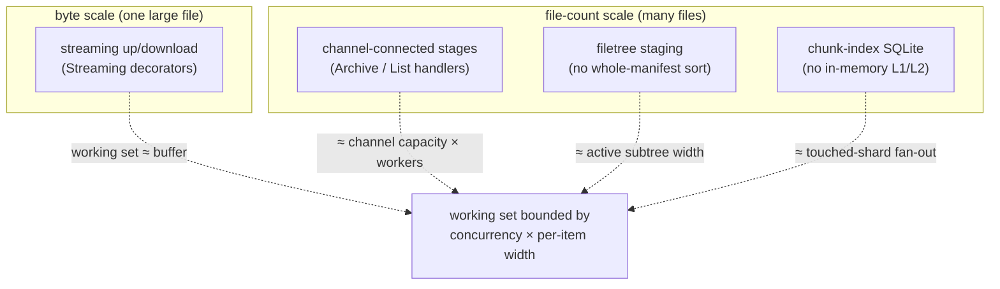

# Memory-boundedness

> **Code:** `src/Arius.Core/Features/ArchiveCommand/ArchiveCommandHandler.cs`, `src/Arius.Core/Features/ListQuery/ListQueryHandler.cs`, `src/Arius.Core/Shared/FileTree/`, `src/Arius.Core/Shared/ChunkIndex/`, `src/Arius.Core/Shared/Streaming/`  ·  **Decisions:** [ADR-0006 filetree staging](../../decisions/adr-0006-build-filetrees-from-hashed-directory-staging.md) · [ADR-0015 chunk-index sharding](../../decisions/adr-0015-chunk-index-scalability.md)  ·  **Terms:** [chunk](../../glossary.md#chunk) · [shard](../../glossary.md#shard) · [filetree](../../glossary.md#filetree)

## Purpose

A repository can be terabytes of binary data spread across many thousands of files. Bounded memory is therefore a first-class durability principle, not a tuning afterthought: **stream, batch, and bound over whole-repository in-memory materialization**, so working-set size is governed by concurrency and per-item width — never by total byte count or total file count. This document collects the rule and the four places it is enforced; each enforcement point also has its own design doc, linked below.

## How it works

The principle shows up as four distinct techniques, one per scaling axis a naïve implementation would blow up on.

### 1. Channel-connected stages with bounded backpressure

The long-running handlers are structured as stages connected by `System.Threading.Channels.Channel<T>`. The class-level XML doc of `ArchiveCommandHandler` is the authoritative stage/channel map — it lists every stage (Enumerate → Hash → Dedup+Router → Upload → local-state consumers → end-of-pipeline) and a channel table with each channel's capacity. The bounding levers:

- **A bounded entry channel applies backpressure on the cheapest-to-throttle axis.** `filePairChannel = Channel.CreateBounded<FilePair>(ChannelCapacity)` (capacity 64) caps how far file *enumeration* can run ahead of *hashing*, so the frontier of discovered-but-unprocessed files never grows with directory size.
- **The one channel that carries bulk bytes is bounded tightly.** `sealedTarChannel = Channel.CreateBounded<SealedTar>(TarUploadWorkers)` carries actual [tar chunk](../../glossary.md#tar-chunk) bytes, so it is bounded to the upload-worker count; the metadata-only channels (`hashedChannel`, `chunkIndexEntryChannel`, `fileTreeEntryChannel`) carry small path/hash records and stay unbounded by design.
- **Completion propagates downstream, faults propagate too.** Each producing stage completes its output writer in a `finally` (`filePairChannel.Writer.Complete()`), so a downstream `ReadAllAsync` loop drains and exits cleanly. A faulting stage propagates the exception through `Channel.Writer.Complete(exception)` (see `RestoreCommandHandler` and `AsyncEnumerableExtensions`), so a downstream reader re-throws rather than hanging.
- **Per-directory / per-batch lookups, never per-file round-trips.** Stage 3 (dedup) and stage 5a (chunk-index consumer) both pull from their channel in batches of 256 via `ChannelReaderExtensions.ReadAllBatchesAsync`, doing one `_chunkIndex.LookupAsync`/`AddEntries` per batch.

`ListQueryHandler` applies the same discipline to the read path, optimized for *interactive responsiveness* rather than throughput. Its walk is a **breadth-first FIFO** (`Queue<DirectoryToWalk>`), so the shallow structure of a huge repository streams out before any deep subtree is descended; entries are `yield return`-ed as soon as their directory is merged. Its own doc header states the invariant directly: *"memory is bounded by directory width plus the traversal frontier, not by repository size."* One `index.LookupAsync` per directory supplies sizes/tiers; the CLI never materializes the full listing into a table or recorder. See [list-query](../core/features/list-query.md).

### 2. Filetree staging — avoid whole-manifest in-memory sort

Building the [filetree](../../glossary.md#filetree) Merkle tree could naïvely require sorting one global manifest of every archived path in memory. Instead, archive stages files into per-directory append-only node files under `filetrees/.staging/{directory-id}`, and `FileTreeBuilder` builds the tree bottom-up, reading and sorting **one directory node at a time**. Build memory is therefore bounded by the active subtrees plus the largest single directory, not by total file count. The chosen "staged directory nodes" design (over a single path-sorted manifest, which would have needed a bounded-memory external sort) is recorded in [ADR-0006](../../decisions/adr-0006-build-filetrees-from-hashed-directory-staging.md); the build/upload pipeline is documented in [filetree](../../design/core/shared/filetree.md).

### 3. Chunk-index SQLite — avoid in-memory L1/L2

Earlier the [chunk index](../../glossary.md#chunk-index) kept an in-memory LRU of whole [shard](../../glossary.md#shard) pages (L1) over plaintext per-prefix disk shard files (L2), gated by a `--dedup-cache-mb` budget — i.e. resident memory scaled with the working set and had to be tuned. It now lives in a single local SQLite store (`ChunkIndexLocalStore`): clean rows, dirty (unflushed) rows, and per-prefix validation claims are columns/tables in one transactional database, with no managed-memory cache to size. Lookups download only the shards whose remote ETag changed and apply them in one batched transaction; flush rewrites only the touched shards. Both flush and repair build those shards by a DB-driven recursive descent (`BuildShards`, counting via the `content_hash` index rather than materializing a range) streamed to bounded parallel uploaders, so exactly one shard is resident at a time — never an in-memory whole-shard split. The remote layout itself stays bounded per shard (`MaxShardEntryCount = 1024`, split 16-way past the threshold) precisely so that incremental flush rewrites a bounded blob, not a monolithic index — see [ADR-0015](../../decisions/adr-0015-chunk-index-scalability.md) and [chunk-index](../core/shared/chunk-index.md).

### 4. Streaming up/download — bound the single-file byte axis

A single multi-GB file must not be buffered. `ChunkStorageService.UploadChunkAsync` assembles a push chain (source → `ProgressStream` → zstd → encryption → `CountingStream` → `OpenWriteAsync`) with no `MemoryStream` and no intermediate temp file (the tar bundle being the one streamed-in exception). The `Streaming` decorators hold only a `long` counter, so the chain moves a file of any size with a working set of roughly one buffer. This is the byte-scale complement to the file-count techniques above — see [streaming](../core/shared/streaming.md).

## Key invariants

- **No working-set term scales with total bytes or total file count.** Every resident structure is bounded by one of: a channel capacity, a worker count, a single directory's width, the touched-shard fan-out of one operation, or a single I/O buffer. A refactor that, e.g., buffers all `RepositoryEntry`s before yielding, sorts a global path manifest in memory, or reintroduces a whole-shard in-memory cache breaks this principle.
- **The bulk-byte channel stays bounded; metadata channels may be unbounded.** Only `sealedTarChannel` (and the source-throttling `filePairChannel`) carry size-proportional payloads and must stay `CreateBounded`. Bounding the metadata channels would only add latency, not safety.
- **Stages complete their writer (success and failure).** A stage must `Complete()` its output writer in a `finally` and propagate faults via `Complete(exception)`, or a downstream reader deadlocks instead of failing fast.
- **Interactive reads stream; they never buffer the full listing.** `ls` yields per-directory and walks breadth-first; no table/recorder materialization in the CLI host.
- **Remote materialization is batched, not per-file.** Dedup and chunk-index consumption operate on 256-entry batches; the chunk-index lists the remote `chunk-index/` subtree once per run rather than per shard.

## Why this shape

The driving rationale is `AGENTS.md` *"Scale And Durability"*: Arius backs up important files, repositories can be terabytes with many thousands of small files, and *"prefer streaming, batching, and bounded-memory or bounded-disk pipelines over whole-repository in-memory materialization when file count can grow."* The two big handlers are explicitly the canonical expression of this — same guidance: long-running handlers are channel-connected stages with bounded channels for backpressure, each stage completing its writer (faults via `Complete(exception)`), documented with a type-level stage/channel table. New or restructured pipelines mirror that structure and that documentation style.

The one-time decisions behind the per-axis techniques live in their ADRs rather than being restated here: filetree staging instead of a sorted manifest in [ADR-0006](../../decisions/adr-0006-build-filetrees-from-hashed-directory-staging.md); bounded-size dynamic shards instead of a single rewritten index in [ADR-0015](../../decisions/adr-0015-chunk-index-scalability.md).

### The 3-stage chunk-index memory-bounding evolution

The chunk index is the clearest illustration of the principle being applied incrementally, and it took three stages to fully unbind resident memory from working-set size (the stage history is recorded in [ADR-0015](../../decisions/adr-0015-chunk-index-scalability.md)):

1. **Fully in-memory index.** The whole hash→chunk mapping was materialized in memory — resident memory scaled directly with the number of distinct chunks.
2. **Split read/write responsibilities** with an in-memory LRU of shard pages (L1) over plaintext per-prefix disk shard files (L2), bounded by a `--dedup-cache-mb` budget. Better, but memory was still a tuned cache whose hit rate degraded as the repository grew, and the operator had to size it.
3. **Disk-backed SQLite cache.** L1/L2 and the memory budget are gone; clean rows, dirty rows, and validation claims all live in one SQLite database. Resident memory is now bounded by the touched-shard fan-out of a single lookup/flush, independent of repository size, with nothing to tune.

The remote-layout half of the same story — dynamic-length prefix sharding so each *blob* stays bounded and incremental flush rewrites a bounded shard — is the byte-on-the-wire counterpart and is covered in [chunk-index](../core/shared/chunk-index.md) and [ADR-0015](../../decisions/adr-0015-chunk-index-scalability.md).

## Open seams / future

- **One pathological directory still produces one large filetree node.** Memory is bounded by the *widest single directory*; a directory with millions of direct children is still read and sorted as one node ([ADR-0006](../../decisions/adr-0006-build-filetrees-from-hashed-directory-staging.md) lists this as a known bad case). Sub-node chunking of a single directory is the seam if that ever becomes real.
- **The `ls` walk frontier is a `Queue`, not a channel.** `ListQueryHandler` carries a `// NOTE: refactor to Channel for consistency` against the BFS queue; converting it would unify it with the archive pipeline's backpressure model. Today the frontier is bounded only by breadth, not by an explicit capacity.
- **Beyond the chunk-index design point (~1.3M chunks)** the run-scoped shard listing simply fetches additional Azure list pages — gradual, not a cliff — but listing memory then grows with shard count. See [chunk-index](../core/shared/chunk-index.md).
