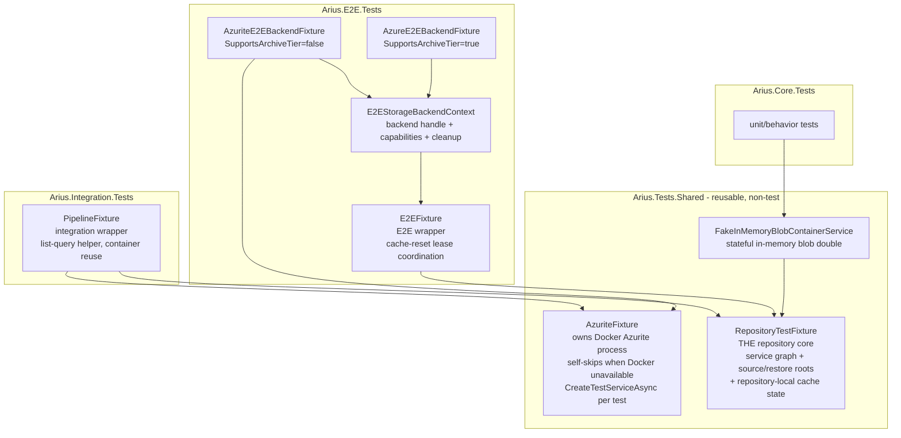
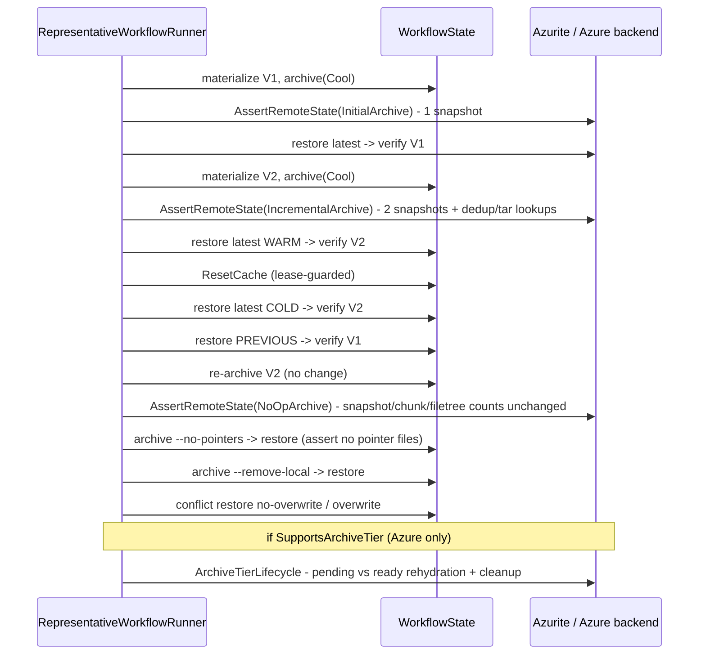

# Testing

> **Code:** `src/Arius.Architecture.Tests`, `src/Arius.Tests.Shared`, `src/Arius.E2E.Tests/Workflows`, `src/Arius.Integration.Tests`, `src/Arius.Core.Tests`, `src/Arius.Cli.Tests`, `src/Arius.Api.Tests`  ·  **Decisions:** [ADR-0001](../../decisions/adr-0001-structure-representative-e2e-coverage.md) · [ADR-0005](../../decisions/adr-0005-adopt-scoped-stryker-mutation-testing.md) · [ADR-0009](../../decisions/adr-0009-clarify-test-fixture-boundaries.md) · [ADR-0011](../../decisions/adr-0011-require-90-percent-production-line-coverage.md)  ·  **Terms:** [snapshot](../../glossary.md#snapshot) · [chunk index](../../glossary.md#chunk-index) · [tar chunk](../../glossary.md#tar-chunk) · [storage tier hint](../../glossary.md#storage-tier-hint)

## Purpose

Arius is a backup tool, so tests are the primary review surface for correctness, durability, and recoverability — not an afterthought. This doc describes how the suite is *shaped*: how fixtures layer Azurite/Azure/in-memory backends under one repository service graph, why there is exactly **one** representative end-to-end workflow rather than a scenario matrix, how architecture tests enforce the Core⊥hosts boundary as an executable contract, and how mutation testing and the coverage floor act as quality gates. It is intentionally not a how-to-run guide (that lives in `AGENTS.md`).

## How it works

### The test projects

| Project | Scope | Backend |
|---|---|---|
| `Arius.Core.Tests` | Fast unit/behavior tests for Core feature handlers and shared services | in-memory (`FakeInMemoryBlobContainerService`) |
| `Arius.Cli.Tests` | CLI parsing, option validation, account/key resolution, DI wiring | none (no Azure, no network) |
| `Arius.Api.Tests` | Web-host logic in isolation — the `AppDatabase` and its statistics cache (hit/miss, fingerprint-based pruning, clear) | host SQLite only (no Azure, no Core) |
| `Arius.Integration.Tests` | Repository pipeline behavior against a real blob backend; crash recovery, faulting, rehydration simulation | Azurite (Docker) |
| `Arius.E2E.Tests` | One representative archive→restore lifecycle; live-Azure-only probes | Azurite **and** real Azure |
| `Arius.Architecture.Tests` | Dependency/boundary rules as executable contracts | reflection only (no I/O) |
| `Arius.Tests.Shared` | **Not a test project** — reusable fixture/backend infrastructure | n/a |
| `Arius.Explorer.Tests` | WPF host (Windows-only) | n/a |

`Arius.Tests.Shared` is deliberately a non-test library. It was extracted so `Arius.E2E.Tests` could stop referencing `Arius.Integration.Tests` just to reuse `AzuriteFixture` — a test project depending on another test project made CI Docker-requirement discovery fragile. Reusable Azurite and repository-fixture wiring belongs here, not inside a test assembly.

### Fixture hierarchy

The load-bearing idea ([ADR-0009](../../decisions/adr-0009-clarify-test-fixture-boundaries.md)) is that *Azurite process lifetime*, *repository service-graph lifetime*, *backend provisioning*, and *workflow-specific behavior* are four different concerns, each owned by exactly one fixture type. `RepositoryTestFixture` is the single owner of the repository service graph and repository-local cache state; everything else is a scenario-specific wrapper around it.

`RepositoryTestFixture` accepts an already-constructed `IBlobContainerService` plus account/container names and constructs the full repository service graph (`SnapshotService`, `ChunkIndexService`, `ChunkStorageService`, `FileTreeService`) and the `ArchiveCommandHandler`/`RestoreCommandHandler`/`ListQueryHandler` factories around it. The three entry points pick the backend and encryption:

- `CreateInMemoryAsync` — `FakeInMemoryBlobContainerService` + `PlaintextInstance` encryption, for fast Core tests that need a complete service graph without Azurite.
- `CreateWithPassphraseAsync` — caller-provided container + production passphrase encryption path, for Azurite/Azure pipeline tests.
- `CreateWithEncryptionAsync` — caller-provided container + explicit encryption service, for legacy-format or seeded-data tests.

Because the same fixture base serves in-memory, Azurite, and live Azure, the *one repository service graph* is identical across all three; only the storage boundary underneath changes.

`E2EFixture` adds one piece of E2E-specific lifecycle: a static **cache-reset lease** keyed by account/container. `ResetLocalCache(...)` refuses to delete the repository-local cache while a fixture is still alive, so the cold-cache transition in the representative workflow is an explicit, guarded step rather than an accidental race. Disposing a fixture releases the lease but does **not** itself reset the cache.

### The one representative E2E workflow

There is exactly one canonical end-to-end story ([ADR-0001](../../decisions/adr-0001-structure-representative-e2e-coverage.md)): one deterministic synthetic repository, archived and restored repeatedly as it evolves `V1 → V2`. It replaced an earlier matrix of isolated one-off scenarios, each of which provisioned a fresh container/temp-root and synthesized its own setup — which validated commands in isolation but never validated the property the suite exists for: *one archive history evolving over time*.

The workflow is data, not a method: `RepresentativeWorkflowCatalog.Canonical` is a `RepresentativeWorkflowDefinition` holding an ordered list of typed `IRepresentativeWorkflowStep` records. `RepresentativeWorkflowRunner.RunAsync` creates one backend context and one fixture for the whole run, then executes each step against a shared mutable `RepresentativeWorkflowState` (current source version, latest/previous [snapshot](../../glossary.md#snapshot) versions, captured pre-no-op blob counts). The step records are small and named — `MaterializeVersionStep`, `ArchiveStep`, `RestoreStep`, `ResetCacheStep`, `AssertRemoteStateStep`, `AssertConflictBehaviorStep`, `ArchiveTierLifecycleStep` — deliberately *not* a general-purpose DSL; each corresponds to one concrete test concern.

Capability gating keeps Azure-only semantics inside the *same* definition. `AzuriteE2EBackendFixture` declares `SupportsArchiveTier: false`; the live Azure backend declares it `true`. `ArchiveTierLifecycleStep` self-skips when the capability is absent, so Azurite and Azure run the identical workflow and only the archive-tier rehydration steps fork — no backend-specific copy of the main story. The archive tier is offline, so faithful rehydration behavior cannot be simulated in Azurite and must run against real Azure.

Assertions favor stable product behavior over storage-layout details. `AssertRemoteStateStep` checks snapshot *count* deltas (one new snapshot per state-changing archive, none for a no-op), latest-snapshot `FileCount`, [chunk-index](../../glossary.md#chunk-index) dedup lookups (two paths sharing one content hash resolve to one chunk), and the [tar-chunk](../../glossary.md#tar-chunk) path (a small file's resolved chunk hash differs from its content hash). It does **not** assert exact total chunk/filetree counts — those are too coupled to bundling internals. The no-op archive case is the explicit exception that validates the product rule (refined by [ADR-0002](../../decisions/adr-0002-skip-snapshots-for-no-op-archives.md)): an unchanged re-archive preserves the existing latest snapshot rather than publishing a redundant one.

Dataset scale is one explicit knob: `SyntheticRepositoryDefinitionFactory.RepresentativeScaleDivisor`. The workflow definition stays independent of scale, so the same canonical story runs against a development-sized (~32 MB / ~254 files) repository now and a larger one later by changing one constant. `E2ETests.cs` keeps the narrow live-Azure credential sanity check plus hot-tier pointer/large-file probes that the representative workflow doesn't cover directly.

### Architecture tests as contract enforcement

`Arius.Architecture.Tests` turns the [design overview's](../../design/README.md) structural rules into executable ArchUnitNET assertions — the mechanical enforcement layer that complements behavior tests and design review. `DependencyTests` loads `Arius.Core`, `Arius.AzureBlob`, and `Arius.Cli` and enforces:

- **No Azure leakage:** neither `Arius.Core` nor `Arius.Cli` may depend on any `Azure.*` namespace type; all Azure access is mediated through `Arius.AzureBlob`. Adding a stray `using Azure.Storage.Blobs` to the CLI fails the build.
- **Core exposed only through Mediator:** `Core_Is_Exposed_Primarily_Through_Mediator` reflects over Core's public surface, builds the transitive contract-type graph (commands, queries, results, notifications, public-interface signatures), and asserts that no non-Core class depends on any *other* Core type — with narrow, named exceptions for the Mediator source-generator and a couple of composition-root entry points.
- **Facade boundaries:** chunk-index internals (`ChunkIndexLocalStore`, `ChunkIndexRouter`) stay behind `IChunkIndexService`; only `ChunkIndexLocalStore` may touch `Microsoft.Data.Sqlite`; the archive-time local file models (`BinaryFile`, `PointerFile`, `FilePair`) are usable only within the archive feature namespace and remain `internal`.

`ModulithTests` enforces a namespace-scoped meaning of `internal`: an internal type in namespace `N` may be referenced only from `N` or a descendant, turning each folder into a module boundary. Intentional cross-namespace sharing must opt in with `[SharedWithinAssembly]`, and that attribute may only decorate non-public types.

### Mutation testing and coverage floor

Two quality gates sit on top of the tests, deliberately at different strengths:

- **Mutation testing (advisory, [ADR-0005](../../decisions/adr-0005-adopt-scoped-stryker-mutation-testing.md)):** `stryker-config.json` scopes Stryker to `Arius.Core` (mutated) driven by `Arius.Core.Tests` via the MTP runner. Runs are local/manual; scores are diagnostic guidance for finding weak assertions, **not** a CI gate, because the preview MTP runner produces fluctuating scores and runtime is high.
- **Coverage floor (enforced, [ADR-0011](../../decisions/adr-0011-require-90-percent-production-line-coverage.md)):** 90% overall *production* line coverage. `codecov.yml` excludes `src/*.Tests/**` and `src/Arius.Tests.Shared/**` from the denominator, so test code and reusable test infrastructure never inflate the number. CI collects coverage with `dotnet-coverage` and uploads to Codecov.

## Key invariants

- **`RepositoryTestFixture` is the single owner of the repository service graph and repository-local cache state.** Wrapper fixtures (`PipelineFixture`, `E2EFixture`) expose it as `Repository` and must not duplicate repository service state. A refactor that gives a wrapper its own parallel service graph would split cache/validation state and break [ADR-0009](../../decisions/adr-0009-clarify-test-fixture-boundaries.md).
- **Reusable backend/fixture infrastructure lives in `Arius.Tests.Shared`, never in a test project.** `Arius.E2E.Tests` must not reference `Arius.Integration.Tests`.
- **Exactly one representative E2E workflow definition.** It runs on Azurite and Azure from the *same* `RepresentativeWorkflowCatalog.Canonical`; backend differences live only inside capability-gated step execution, never as a forked workflow. Don't reintroduce the isolated-scenario matrix.
- **Real archive-tier and rehydration semantics stay in Azure-capability-gated steps.** Azurite must not pretend to support the offline archive tier.
- **The cold-cache transition is lease-guarded.** `E2EFixture.ResetLocalCache` throws if a fixture still holds the cache lease, keeping warm→cold an explicit workflow step.
- **Representative assertions target stable behavior, not storage layout.** Assert snapshot lineage, file counts, dedup/tar lookups, pointer presence/absence, and cleanup — not exact chunk/tar/filetree blob counts.
- **Azurite/E2E suites self-skip at runtime when Docker or Azure credentials are absent**, with a visible reason in the report, rather than being filtered out of the CI matrix (`AzuriteFixture.EnsureAvailable` → `Skip.Test`).
- **Architecture rules are executable.** The Core⊥host boundary, the Azure-isolation rule, the Mediator-only exposure, and the chunk-index/SQLite facades are enforced by `Arius.Architecture.Tests`, not just by convention.
- **The coverage denominator excludes test code.** Test projects and `Arius.Tests.Shared` are ignored in `codecov.yml`; the 90% floor applies to production code only.

## Why this shape

- **One canonical workflow over a scenario matrix** — see [ADR-0001](../../decisions/adr-0001-structure-representative-e2e-coverage.md). It proves Arius can archive a repository, evolve it, re-archive, and restore both latest and previous states as one coherent history, which a disconnected scenario list cannot.
- **Repository-centered fixtures with thin wrappers** — see [ADR-0009](../../decisions/adr-0009-clarify-test-fixture-boundaries.md). Centralizing repository ownership keeps cache/validation state in one place while preserving readable per-suite helpers.
- **Scoped advisory mutation testing** — see [ADR-0005](../../decisions/adr-0005-adopt-scoped-stryker-mutation-testing.md). Mutation pressure goes where it matters most (Core) without making an unstable preview runner a release gate.
- **Enforced overall coverage floor** — see [ADR-0011](../../decisions/adr-0011-require-90-percent-production-line-coverage.md). An overall gate fails loudly on regressions without the noise of per-file thresholds; reviews still judge assertion quality, since the percentage alone is not proof that behavior is tested.
- **Architecture tests as the mechanical layer.** They catch boundary erosion (an Azure `using` in the CLI, a leaked chunk-index internal) deterministically, freeing behavior tests and design review to focus on intent and correctness.

## Open seams / future

- **Mutation testing is local/manual and Core-scoped.** Promoting it to a CI gate, or widening its target beyond `Arius.Core`, is a deliberate future decision once MTP-runner score stability and runtime cost are understood (a later ADR would supersede [ADR-0005](../../decisions/adr-0005-adopt-scoped-stryker-mutation-testing.md)).
- **The representative workflow is benchmark-ready but not yet benchmarked.** The runner exposes stable step names and per-step boundaries so a future benchmark can measure the whole workflow or selected steps (second archive, warm vs cold restore, ready-rehydration restore) without redesigning the suite — no benchmark code exists yet.
- **Dataset scale is one knob.** `RepresentativeScaleDivisor` tunes runtime cost; raising the representative profile toward production scale is a tuning decision, not a redesign.
- **ArchUnitNET cannot see usages inside lambdas / async state machines** (noted in both `DependencyTests` and `ModulithTests`). Boundary violations hidden in closures are not caught by the architecture suite and rely on review.
- **Some wrapper fixtures retain duplicated access paths by design** for ergonomics; keeping new responsibilities from drifting into the wrong fixture layer relies on discipline rather than a hard rule.
