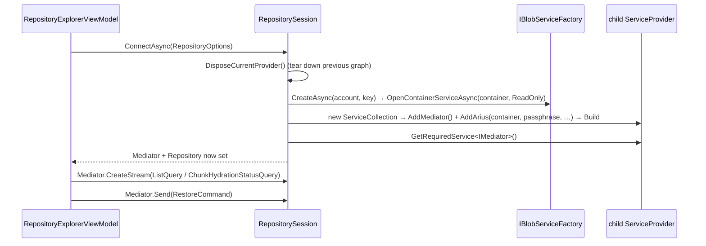
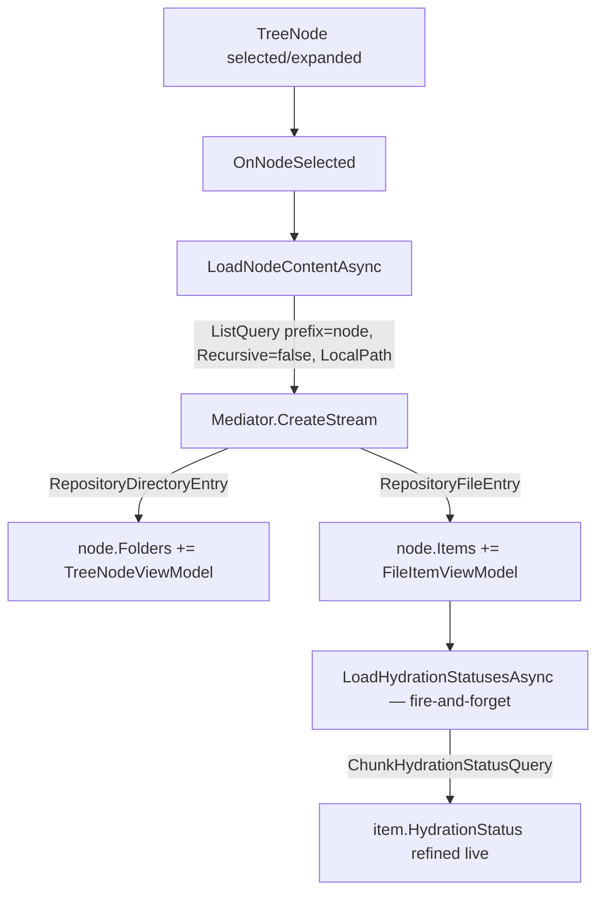

# Arius.Explorer host

> **Code:** `src/Arius.Explorer/` (`Program.cs`, `App.xaml.cs`, `Infrastructure/RepositorySession.cs`, `ChooseRepository/`, `RepositoryExplorer/`, `Settings/`, `Shared/{Services,Converters,Extensions}`)  ·  **Decisions:** [ADR-0010](../../decisions/adr-0010-use-feature-handlers-for-application-use-cases.md) · [ADR-0013](../../decisions/adr-0013-core-host-separation.md)  ·  **Terms:** [snapshot](../../glossary.md#snapshot) · [content hash](../../glossary.md#content-hash) · [chunk index](../../glossary.md#chunk-index) · [storage tier hint](../../glossary.md#storage-tier-hint) · [pointer file](../../glossary.md#pointer-file)

## Purpose

Arius.Explorer is the **Windows-only WPF/MVVM desktop host** for browsing and restoring an Arius repository. It is a thin GUI shell over `Arius.Core`: it never touches Azure or the chunk/filetree mechanics itself, it drives Core entirely through `IMediator` and renders the per-entry repository/disk/hydration state as a file-explorer tree + list. User-facing usage lives in [guide/explorer.md]; this doc is the maintainer view of *how the shell is wired*.

> **Status: thin coverage / GAP.** This host has the least design intent of the three. It is a deliberately conventional CommunityToolkit.Mvvm app; the only non-obvious machinery is the per-repository DI provider (`RepositorySession`) and the way it reuses the same Core feature handlers the CLI and Web hosts use.

## How it works

### Process startup and DI

`Program.Main` is `[STAThread]`. It builds a generic `Host` (`CreateHostBuilder`), starts it, hands the resulting `IServiceProvider` to the static `App.ServiceProvider`, then runs the WPF `App`. Serilog logs to `%LocalAppData%/Arius/logs/arius-explorer-*.log`.

The host container holds only **shell** services — it is *not* a connected repository:

- `IApplicationSettings` / `IRecentRepositoryManager` — persisted recent-repository list (see [Settings](#settings-and-credentials)).
- `IDialogService` — opens the modal `ChooseRepositoryWindow`.
- `IRepositorySession` (singleton) — the per-repository Core provider (below).
- `IBlobServiceFactory` → `AzureBlobServiceFactory` — used by `RepositorySession` to open containers and by the *root* placeholder Core graph to answer `ContainerNamesQuery` before any repository is connected.
- The windows + ViewModels (`AddTransient`).
- `services.AddMediator()` + `RepositorySession.AddRootCorePlaceholders(services)` — registers a **root** Core graph wired to a `NullBlobContainerService`. This exists so the `ChooseRepository` flow has a working `IMediator` (for `ContainerNamesQuery`, which goes through `IBlobServiceFactory`, not the container) *before* a repository is chosen.

`App.OnStartup` resolves and shows `RepositoryExplorerWindow`, after upgrading ClickOnce-era user settings if `ApplicationSettings.Default.UpgradeRequired`. It also installs global handlers for `DispatcherUnhandledException`, `AppDomain.UnhandledException`, and `TaskScheduler.UnobservedTaskException` that log and show a message box rather than crash — important because most Core work runs as fire-and-forget `async void`/`Task` off UI events.

### The per-repository session — `RepositorySession`

This is the load-bearing piece. A connected repository needs its *own* Core service graph (`AddArius(blobContainer, passphrase, account, container)` builds one container-scoped instance of the [shared-service stack](../README.md#4-the-shared-service-stack)). `RepositorySession` builds and owns that graph:

Key points:
- `OpenContainerServiceAsync(..., PreflightMode.ReadOnly, ...)` — Explorer never archives; it opens the container read-only.
- Logging is shared by handing the **root** `ILoggerFactory` into the child collection, so per-repository handlers log into the same Serilog file.
- `ConnectAsync` disposes the previous provider first, so switching repositories tears down the old Core graph (and its caches) deterministically. `Mediator`/`Repository` are `null` between connects.

### Choosing a repository — `ChooseRepositoryViewModel`

The modal dialog collects local path + account/key + container + passphrase. It uses the **root** `IMediator` to live-discover containers:

- `OnAccountNameChanged` / `OnAccountKeyChanged` push into a Rx `Subject`, `.Throttle(500ms)` debounce, `.Switch()` to cancel a prior probe; the resulting `OnStorageAccountCredentialsChanged` runs `mediator.CreateStream<string>(new ContainerNamesQuery(AccountName, AccountKey))` and fills the container dropdown. UI mutation is marshalled back via the captured `SynchronizationContext`.
- `CanOpenRepository` gates the OK command: all fields non-empty and `IsValidAzureContainerName(ContainerName)`.
- On OK it builds a `RepositoryOptions` (credentials DPAPI-protected, below) and returns it via `DialogResult = true`.

`ContainerNamesQuery` is how Explorer detects "which containers on this account are usable" — it is the only repository-external Core query and is served by the root graph (no container open yet).

### Browsing — `RepositoryExplorerViewModel`

On construction it auto-opens the most-recent repository (`IRecentRepositoryManager.GetMostRecent`) and fires `LoadRepositoryAsync`. The window's `Loaded` event triggers `ViewLoadedAsync`, which opens the ChooseRepository dialog if nothing is selected.

The view is a `TreeView` bound to `RootNode` (folders) + a `ListView` bound to `SelectedTreeNode.Items` (files). The data flow per folder:

- **One level at a time.** Each `ListQuery` is `Recursive = false`, scoped to the node's `Prefix`, with `LocalPath = Repository.LocalDirectoryPath` so the listing overlays disk state on repository state (see [list-query](../core/features/list-query.md)). Lazy expansion: a fresh `TreeNodeViewModel` shows a "Loading..." placeholder child until selected.
- **Streaming binding.** Results are bound to `ObservableCollection`s as they arrive — `RepositoryDirectoryEntry` → child `TreeNodeViewModel`, `RepositoryFileEntry` → `FileItemViewModel`. `SelectedItemsText` (count + humanized size) is re-raised as items land.
- **Cancellation.** `nodeLoadCancellation` / `hydrationLoadCancellation` are swapped per load; selecting a new node cancels the in-flight stream (`CancelNodeLoad` / `CancelHydrationLoad`). The `finally` blocks only clear state if they still own the current CTS (`ReferenceEquals`), so a superseded load can't clobber the new one's flags.

**Two-pass hydration state.** `FileItemViewModel` first derives an *initial* `ChunkHydrationStatus` cheaply from the `RepositoryEntryState` flags the `ListQuery` already carries (`RepositoryArchived` → `NeedsRehydration`, `RepositoryHydrated` → `Available`, `RepositoryRehydrating` → `RehydrationPending`, else `Unknown`). Then `LoadHydrationStatusesAsync` runs `ChunkHydrationStatusQuery` to **refine** it with live truth from `IChunkStorageService.GetHydrationStatusAsync` — the [storage tier hint](../../glossary.md#storage-tier-hint) in the index is only a hint; the query is authoritative. The status drives the `StateCircle` colors via `OnHydrationStatusChanged`.

### Restoring — `RestoreAsync`

For the checked `SelectedFiles`: `EnsureHydrationStatusesAsync` resolves any still-`Unknown` statuses, then a confirmation message box spells out the **rehydration cost** (how many items will start hydration / are already pending / will download now, with humanized byte totals — the "this may incur significant cost" warning). On confirm it issues one `RestoreCommand` per file through `Mediator.Send` (`Overwrite = true`, `NoPointers = false`), then reloads the current node. Cost surfacing and idempotent rehydration are Core's contract (see [restore-command](../core/features/restore-command.md)); Explorer only renders and confirms.

### Settings and credentials

- `ApplicationSettings : ApplicationSettingsBase` — Windows user-scoped settings holding `RecentRepositories` (serialized as XML) and `RecentLimit` (default 10). `RecentRepositoryManager.TouchOrAdd` keeps the list most-recent-first, trimmed to the limit, identifying a repo by `(LocalDirectoryPath, ContainerName, AccountName)` — it refreshes the protected secrets and `LastOpened` of an existing entry but never rewrites those key fields.
- `RepositoryOptions` stores `AccountKeyProtected` / `PassphraseProtected`; `DataProtectionExtensions.Protect`/`Unprotect` wrap DPAPI (`ProtectedData`, `DataProtectionScope.CurrentUser`). Plaintext `AccountKey`/`Passphrase` are `[JsonIgnore, XmlIgnore]` computed properties, so the persisted settings file never contains cleartext secrets. DPAPI failures fall back to returning the input unchanged (handles non-Windows / pre-encryption legacy values).

## Key invariants

- **One Core graph per connected repository, owned by the session.** `RepositorySession.ConnectAsync` must dispose the previous child `ServiceProvider` before building the next, and must null out `Mediator`/`Repository` while disconnected. Two live graphs for the same container would split the cache/validation state of the singleton-service stack ([overview §4](../README.md#4-the-shared-service-stack)).
- **Explorer opens containers `ReadOnly`.** It is a browse/restore host; it never archives. Do not introduce write-tier preflight here.
- **Persisted credentials are always DPAPI-protected.** Anything written to `ApplicationSettings` goes through `.Protect()`; the cleartext properties are serialization-excluded. A refactor must not persist `AccountKey`/`Passphrase` directly.
- **Per-load CTS ownership is reference-checked.** The `finally` blocks in `LoadNodeContentAsync` / `LoadHydrationStatusesAsync` only reset shared state when they still own the active CTS — required so a rapidly re-selected node doesn't have its state cleared by a stale, cancelled load.
- **Hydration status is refined, never trusted from flags alone.** The flag-derived initial status is a placeholder; the `ChunkHydrationStatusQuery` result wins. Restore confirmation must `EnsureHydrationStatusesAsync` first so the cost estimate reflects live tier truth, not the [storage tier hint](../../glossary.md#storage-tier-hint).

## Why this shape

- **Drives Core only through `IMediator`, never the handlers/services directly.** Same coupling as every host — requests in, the same `ListQuery` / `ChunkHydrationStatusQuery` / `RestoreCommand` slices the CLI and Web use ([ADR-0010](../../decisions/adr-0010-use-feature-handlers-for-application-use-cases.md), [ADR-0013](../../decisions/adr-0013-core-host-separation.md)). The GUI carries zero repository mechanics, so it stays a thin shell.
- **`RepositorySession` instead of a global Core container.** Core is configured *per container* (`AddArius` binds one `IBlobContainerService` + passphrase). A desktop app switches repositories at runtime, so the host needs a swappable, disposable child provider rather than a process-lifetime singleton graph — hence the root-placeholder graph for pre-connect queries plus a rebuilt child graph per `Connect`.
- **Conventional CommunityToolkit.Mvvm.** `[ObservableProperty]`/`[RelayCommand]`, DI-injected ViewModels, converters for presentation (`BytesToReadableSizeConverter`, the `StateCircle` brush bindings). This is intentional boilerplate, documented in-repo by `src/Arius.Explorer/CLAUDE.md`; there is no hidden design here.

## Open seams / future

- **Windows-only.** WPF + DPAPI + `ApplicationSettingsBase` (the ClickOnce settings model) pin this host to Windows. A cross-platform desktop port would replace all three; the `IMediator`-driven ViewModels would largely survive.
- **Event consumption is minimal.** Unlike the CLI (progress bars) and Web (SignalR relay), Explorer does not subscribe to Core's `INotification` progress events — restore is a per-file `Send` with a coarse `IsLoading` flag and no live progress. Wiring an `INotificationHandler` (or polling the stream) is the obvious next step; the seam is the shared event contract described in [events-and-progress](../cross-cutting/events-and-progress.md).
- **Restore is sequential, per file.** `RestoreAsync` loops `Send` one `RestoreCommand` per selected file; batching the selection into a single command (so tar chunks shared across files download once) is a known efficiency gap.
- **`ArchiveStatistics` is a stub.** The status bar shows "Loading..." / "" with a `// STATISTICS TODO` marker — repository totals are not yet surfaced.
- **No archive workflow.** Explorer is browse + restore only; archiving stays on the CLI.
