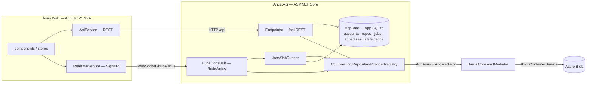
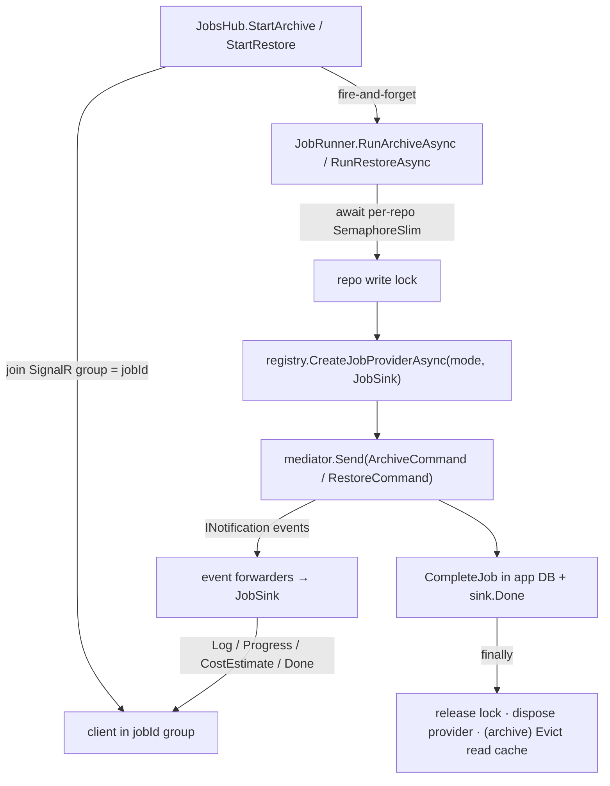

# Web host (Arius.Api + Arius.Web)

> **Code:** `src/Arius.Api/` · `src/Arius.Web/`  ·  **Decisions:** [ADR-0013](../../decisions/adr-0013-core-host-separation.md) · [ADR-0010](../../decisions/adr-0010-use-feature-handlers-for-application-use-cases.md)  ·  **Terms:** [snapshot](../../glossary.md#snapshot) · [chunk index](../../glossary.md#chunk-index) · [chunk](../../glossary.md#chunk) · [storage tier hint](../../glossary.md#storage-tier-hint) · [filetree](../../glossary.md#filetree)

## Purpose

The browser front-end to Arius: a multi-repository manager that runs **archive**, **restore**, **ls/browse**, **statistics**, and **scheduling** against many repositories through one server. `Arius.Api` (ASP.NET Core minimal API) is the host that drives `Arius.Core` via `IMediator` and relays Core's progress events to the browser; `Arius.Web` (Angular SPA) is the client. They are **one deployable web application** — `Arius.Api` serves the built SPA from `wwwroot` and exposes REST under `/api` plus a SignalR hub at `/hubs/arius`, so they ship as a single container. (User-facing usage lives in [guide/web-ui.md](../../guide/web-ui.md); operator/deploy in [guide/deployment.md](../../guide/deployment.md).)

Unlike the CLI and Explorer hosts, this host adds a layer Core has no concept of: it manages a **fleet** of repositories and accounts in its own SQLite database, serializes long-running mutating work into **jobs**, and lets the user confirm the **rehydration cost** before money is spent. Everything below the `IMediator` boundary is the same Core the CLI drives — see [ADR-0013](../../decisions/adr-0013-core-host-separation.md).

## How it works

### Two projects, one application



`Program.cs` wires the whole host: it registers the app database, `SecretProtector`, the per-repo `RepositoryProviderRegistry`, the `JobRunner`, the `SchedulerService`, SignalR (camelCase payloads), CORS for the dev `ng serve` origin (`http://localhost:4200`), then static-file serving for the SPA. Routes split cleanly so client-side SPA routes never collide with the server: REST lives under `/api`, the hub under `/hubs/arius`, and `MapFallbackToFile("index.html")` serves the Angular app for everything else.

The SPA is a standalone-component Angular 21 app (Metronic/KTUI + Tailwind 4 — Metronic ships as **vendored** compiled assets under `public/assets/`, referenced from `angular.json` `styles`/`scripts`, not as an npm dependency; `MetronicInitService` and the `kt-init` directive only re-initialise KTUI's JS for DOM added dynamically) with lazy-loaded feature routes (`app.routes.ts`: `overview`, `repos`, `repos/:repoId/{files,statistics,properties}`, `jobs`, `settings`, the add/create wizards). Two thin core services own all server traffic: `ApiService` (typed `HttpClient` over `/api`) and `RealtimeService` (`@microsoft/signalr` over `/hubs/arius`). `proxy.conf.json` forwards `/api` and `/hubs` to the .NET host during dev.

### Per-repository service provider

Core registers everything as singletons **scoped to one repository** (one account / container / passphrase). The web host therefore cannot use a single global Core container — it manages many repositories at once. `RepositoryProviderRegistry` builds one `IServiceProvider` per repository on demand, each with its own `IMediator` + Core service graph (`BuildAsync` → `services.AddMediator(); services.AddArius(blobContainer, passphrase, account, container)`). Connection material is loaded from the app DB and decrypted via `SecretProtector` just-in-time (`LoadConnection`).

There are **two provider lifetimes**, and this distinction is load-bearing:

- **Read providers** (`GetReadProviderAsync`) — long-lived, cached per repo (`Dictionary<long, Lazy<Task<ServiceProvider>>>` behind a lock), built `PreflightMode.ReadOnly`. They warm Core's [chunk index](../../glossary.md#chunk-index) / [filetree](../../glossary.md#filetree) / [snapshot](../../glossary.md#snapshot) caches across requests, so repeated browse/stats/search calls don't re-hit Azure. They get an **inert** `JobSink` (no `JobId`), so the event forwarders fire harmlessly into nothing.
- **Job providers** (`CreateJobProviderAsync`) — a **fresh** provider per long-running archive/restore, wired to that job's own `JobSink`, owned and disposed by the `JobRunner`. A dedicated provider isolates the job's events (its own `IMediator`) and avoids reusing a chunk index that becomes single-shot after `FlushAsync`.

A read provider is **evicted and disposed** (`Evict`) whenever its repository's connection material or content might have changed: on a properties `PATCH`, a delete, and after every archive job (the snapshot moved, so cached read state is stale). The same three triggers also clear the repository's [statistics cache](#statistics-cache) — the two invalidations are deliberately co-located so a stale snapshot can never survive in either.

Both provider lifetimes route Core's `ILogger<T>` output to a **per-repository rolling log file** — the same `~/.arius/{account}-{container}/logs/` directory the CLI writes to — via a shared logger factory cached in the registry (`GetOrCreateRepoLoggerFactory`). So every Web-launched operation (queries *and* jobs) is captured on disk in the CLI's line format, not just on the API console. The logger's lifetime is deliberately **decoupled** from the providers: it is registered as an externally-owned singleton, so neither `Evict` nor a job disposing its provider closes the repo's log — only `DisposeAsync` at app shutdown does. See [cross-cutting/logging.md](../cross-cutting/logging.md#the-web-host-one-rolling-file-per-repository).

### The job model

Long-running work is modelled as a **job**: a GUID, a row in the app DB (`jobs` table), a SignalR group, and a fresh Core provider. The hub starts a job and returns its id immediately; the actual run is fire-and-forget on `JobRunner`.



**Per-repository serialization.** `JobRunner` holds a `ConcurrentDictionary<long, SemaphoreSlim>` of per-repo locks (`LockFor`). Every archive and restore `await`s its repo's lock before opening a provider and releases it in `finally`. This guarantees **two mutating jobs never share a repository's on-disk Core state** (the chunk-index SQLite cache, the disk filetree cache) — concurrency across *different* repositories is unrestricted. The cron `SchedulerService` enqueues archive jobs through the same `JobRunner`, so a scheduled run and a manual one on the same repo also serialize.

**JobSink** is the per-job channel to the client. It is registered as a singleton **inside the job's own provider**, so when Core publishes a notification the auto-registered forwarder resolves *exactly this job's* sink — events are isolated **by provider, not by correlation id**. The sink sends three SignalR message kinds to the job's group (`Log`, `Progress`, `Done`, plus `CostEstimate` for restore) and holds the interlocked aggregate counters (`SetTotalFiles`, `IncHashed`, `IncUploaded`, `IncRestored`, …) that feed the drawer's stat grid via `ReportArchive` / `ReportRestore`.

### Core → Api → SignalR → SPA event flow

Core knows nothing about SignalR. Long-running handlers publish `INotification` progress events through their `IMediator` ([overview §3](../README.md), [ADR-0013](../../decisions/adr-0013-core-host-separation.md)); the web host subscribes by implementing `INotificationHandler<T>` **forwarders** that the Mediator source generator auto-registers in every provider (`Hubs/ArchiveForwarders.cs`, `Hubs/RestoreForwarders.cs`). Each forwarder maps one Core event to a console log line + a progress update on the sink. The restore **cost handshake** uses a different mechanism: it is not an event but a `Func<…>` callback (`RestoreOptions.ConfirmRehydration`) the handler `await`s, so it can block the restore until the user answers.

```mermaid
sequenceDiagram
    participant SPA as SPA (DrawerStore / RealtimeService)
    participant Hub as JobsHub
    participant Run as JobRunner
    participant Core as Arius.Core (RestoreCommandHandler)
    participant Sink as JobSink

    SPA->>Hub: invoke StartRestore(repoId, …)
    Hub->>Hub: Groups.AddToGroup(connId, jobId)
    Hub-->>SPA: jobId
    Hub->>Run: RunRestoreAsync(…)  (fire-and-forget)
    Run->>Run: await repo lock
    Run->>Core: mediator.Send(RestoreCommand{ ConfirmRehydration })

    Core->>Core: Publish(SnapshotResolvedEvent)
    Note over Core,Sink: forwarder resolves THIS job's sink
    Sink-->>SPA: Log "Resolved snapshot …"  (group=jobId)
    Core->>Core: Publish(TreeTraversalCompleteEvent)
    Sink-->>SPA: Log + Progress(10%)

    rect rgb(255,248,230)
    Note over Core,SPA: cost handshake — archive-tier chunks need rehydration
    Core->>Run: await ConfirmRehydration(estimate)
    Run->>Sink: Cost(estimate)
    Sink-->>SPA: CostEstimate  → cost modal
    SPA->>Hub: invoke Approve(jobId, "standard"|"high"|decline)
    Hub->>Run: approvals.Resolve(jobId, priority)
    Run-->>Core: returns RehydratePriority? (null = cancel)
    end

    Core->>Core: download / rehydrate; Publish(FileRestoredEvent…)
    Sink-->>SPA: Log + Progress(…%)
    Core-->>Run: RestoreResult
    Run->>Sink: Done("completed", summary)
    Sink-->>SPA: Done  → terminal state
    Run->>Run: CompleteJob(app DB); release lock; dispose provider
```

On the client, `RealtimeService` fans the four hub messages into RxJS subjects (`log$`, `progress$`, `cost$`, `done$`); `DrawerStore` subscribes to all four and projects them into signals (`lines`, `progress`, `stats`, `cost`, `streamState`). A `CostEstimate` flips `streamState` to `'cost'`, which renders the approval modal; the user's choice calls back through `RealtimeService.approve(jobId, priority)`.

### The restore cost handshake (server side)

The handshake spans Core, the runner, and the hub:

1. `RestoreCommandHandler` computes a `RestoreCostEstimate` only when archive-tier chunks need rehydration, then `await`s the `ConfirmRehydration` callback the `JobRunner` supplied (`RestoreCommandHandler.cs` Stage 3). A `null` return cancels **before any download or rehydration** — no money spent.
2. The runner's callback sends the estimate to the client (`sink.Cost(...)`) and parks on `RestoreApprovalRegistry.Register(jobId, connectionId)`, which returns a `Task<RehydratePriority?>` backed by a `TaskCompletionSource`.
3. `JobsHub.Approve(jobId, priority)` maps `"standard"|"high"` → `RehydratePriority`, anything else → `null`, and calls `approvals.Resolve` to complete the parked task; Core then proceeds (or returns a zero-restore success).

A never-answered modal cannot pin the restore — and its per-repo write lock — forever: `JobsHub.OnDisconnectedAsync` calls `approvals.CancelForConnection`, declining every approval owned by the dropped connection. The registry only tracks restores that actually reach the modal, so `_ownerByJob` can't accumulate entries for restores that never needed approval.

### App database and secrets

`AppData/AppDatabase` is the host's own SQLite store — **separate from Core's chunk-index cache** — holding `storage_accounts`, `repositories`, `jobs`, `schedules`, and the `statistics_cache` (raw `SqliteConnection`, WAL, parameterized commands, mirroring Core's local-store idiom). It is the only persistent state the SPA reads through REST: account/repo CRUD (`AccountEndpoints`, `RepositoryEndpoints`), job history and cron schedules (`JobEndpoints`), and the snapshot/statistics reads behind `BrowseEndpoints` — `SnapshotsQuery` goes to Core live, while `StatisticsQuery` is **memoized** in `statistics_cache` (below). Secrets — Azure account keys and repository passphrases — are stored as **ASP.NET Data Protection** ciphertext (`SecretProtector`, keyed by a key ring persisted to the mounted volume) and **never** serialized back to the client (the DTOs expose only `HasKey`, never the key/passphrase).

### Statistics cache

A repository's statistics are a **pure function of its snapshot set**, and the honest repository-wide figures are expensive — they require a full chunk-index download ([`StatisticsQuery` with `EnsureFullCoverage`](../core/features/queries.md#statisticsquery)). So `BrowseEndpoints` memoizes the computed `StatisticsDto` in the `statistics_cache` table, keyed by the **request variant** `(repo_id, version, full)` and stamped with a **fingerprint** — the latest snapshot version at compute time (derived cheaply from the last snapshot blob name, not a full `SnapshotsQuery`).

- **A hit is a pure local read** (`GetCachedStatistics`) — the deserialized DTO is returned with **no blob-storage access**. That is what makes a warm Statistics load fast even for the full-coverage variant.
- **A miss** lists the snapshot blobs once to derive the fingerprint, runs the real `StatisticsQuery`, and `UpsertCachedStatistics` stores the row while **pruning** any of the repository's rows stamped with an older fingerprint (a prior snapshot generation).
- **Invalidation is explicit, not by re-verification.** The stored fingerprint is provenance + the prune key; it is *not* re-checked against storage on every read. Freshness is guaranteed instead by clearing the cache (`ClearStatisticsCache`) on every event that can change the snapshot set: after an archive job (`JobRunner`) and on a properties change / delete (`RepositoryEndpoints`) — the same triggers that evict the read provider. Re-verifying the fingerprint against storage on every read was rejected: it would pay a snapshot listing per read for a freshness guarantee that explicit invalidation already gives under the single-host assumption.

## Key invariants

- **One provider per repository; never a shared global Core container.** Core's singletons are repo-scoped; mixing repositories in one provider would cross-contaminate caches and secrets. `RepositoryProviderRegistry` is the single place providers are built.
- **A job provider is single-use and self-disposed.** Reusing a job provider would reuse a chunk index that is single-shot after `FlushAsync`; the `JobRunner` disposes it in `finally`. Read providers, by contrast, are cached and must be **evicted** (`Evict`) on properties change, delete, or after an archive — otherwise the SPA serves a stale snapshot.
- **Mutating jobs serialize per repository.** Two archive/restore jobs on the same repo must not run concurrently (shared on-disk Core state). Enforced by the per-repo `SemaphoreSlim`; cross-repo concurrency is intentionally unrestricted.
- **Events are isolated by provider, not by id.** Each job's `JobSink` lives in that job's provider, so a forwarder always targets the right client group. Read providers get an inert sink — the same forwarders must remain harmless there.
- **No rehydration is requested without confirmation through this host.** When `ConfirmRehydration` is wired (it always is, for web restores), a `null`/declined answer cancels before any archive-tier cost is incurred.
- **A dropped connection declines its pending restore.** `OnDisconnectedAsync` → `CancelForConnection` must release any approval the connection owned, or the restore (and its repo lock) leaks.
- **Secrets never leave the server.** Account keys and passphrases are Data-Protection ciphertext at rest and are dropped from every client DTO.
- **The statistics cache is invalidated on every snapshot-set change, never re-verified per read.** Whatever clears the read provider (archive job, properties change, delete) must also `ClearStatisticsCache`; otherwise the SPA serves figures computed against a superseded snapshot generation.

## Why this shape

- **Core ⊥ host.** The host only sends `IRequest`s and subscribes to `INotification`s; it shares Core verbatim with the CLI and Explorer. Progress and cost are surfaced through Core's host-agnostic event/callback seam, never by reaching into Core internals. See [ADR-0013](../../decisions/adr-0013-core-host-separation.md) and [ADR-0010](../../decisions/adr-0010-use-feature-handlers-for-application-use-cases.md).
- **Provider-scoped event isolation instead of a correlation id.** Because Core registers a per-repo singleton graph and the forwarders are auto-generated `INotificationHandler<T>`s, putting a per-job `JobSink` *in the provider* is the cheapest way to route events to the right client — no plumbing of a job id through every Core event.
- **A `Func` callback for cost, not an event.** Confirmation must *block* the restore until the user answers; an `INotification` is fire-and-forget and can't carry a return value. `ConfirmRehydration` is an awaited callback so Core can pause mid-handler and resume with the chosen priority — or abort.
- **A lightweight `BackgroundService` scheduler, not Quartz.** `SchedulerService` wakes once a minute and computes due cron occurrences with Cronos — sufficient for a handful of per-repo schedules, and it reuses the same `JobRunner` path so scheduled and manual runs share serialization and event plumbing.
- **App SQLite separate from Core's cache.** Fleet/account/job/schedule metadata is host concern, not repository content; keeping it in its own DB keeps Core's per-repo cache pristine and lets the host DB live on the host's mounted volume alongside the Data-Protection key ring.

## Open seams / future

- **GAP — the "one application, one container" packaging is undocumented as a decision.** Today `Arius.Api` serves `Arius.Web`'s build output and they deploy together, but there is no ADR recording it; if the SPA is ever split to a separate origin, the dev-only CORS policy (`http://localhost:4200`) and the `/api` + `/hubs` split would need revisiting. The dev hardcodes that origin.
- **No authn/authz.** Every endpoint and hub method is open; the host assumes a trusted single-user deployment. Multi-user or exposed deployments would need auth in front of `/api` and `/hubs/arius`, and per-user scoping of the app DB.
- **Job state is split** between the app DB (`jobs` rows: terminal status + summary) and in-memory SignalR streams (live log/progress). A reconnecting or late-joining client sees DB history but not the in-flight log — there is no replay of a running job's stream. A persisted/replayable log is the next change here.
- **The forwarder set is hand-maintained.** Every new Core archive/restore `INotification` needs a matching forwarder in `ArchiveForwarders.cs` / `RestoreForwarders.cs`, or its progress silently never reaches the SPA.
- **Container discovery and global search go through read providers per repo** (`StreamContainers`, `SearchAll`); cross-repo search iterates every repository sequentially with per-repo failure isolation — fine for a small fleet, a scaling seam for many repositories.
