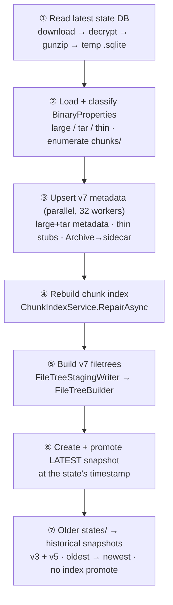

# v5 → v7 migration

> **Code:** [`src/Arius.Migration/`](https://github.com/woutervanranst/Arius7/blob/master/src/Arius.Migration/MigrateV5.cs)  ·  **Decisions:** [ADR-0018](../decisions/adr-0018-archive-tier-metadata-sidecar.md) · [ADR-0017](../decisions/adr-0017-idempotent-non-distributed-recovery.md) · [ADR-0014](../decisions/adr-0014-encryption-format-and-recoverability.md)  ·  **Terms:** [chunk](../glossary.md#chunk) · [thin chunk](../glossary.md#thin-chunk) · [chunk index](../glossary.md#chunk-index) · [snapshot](../glossary.md#snapshot)

## Purpose

`Arius.Migration` is a one-off console tool that upgrades a legacy v5 (and v3) Arius repository to v7 **in place** in Azure Blob Storage. It is **non-destructive** and **idempotent**: chunk bodies and storage tiers are never touched, metadata is *upserted* (merged, so v5 keys survive and the repo stays v5-readable), and re-running it converges rather than corrupting. It exists because v7 was deliberately built v5-back-compatible — same salted SHA-256 chunk hashes, the legacy AES-256-CBC + gzip read path ([ADR-0014](../decisions/adr-0014-encryption-format-and-recoverability.md)), and tar entries named by content hash — so nothing has to be re-hashed, re-encrypted, or re-uploaded; the migration only has to *describe* the existing blobs in v7 terms and build the v7 metadata layer (chunk index, filetrees, snapshots) on top.

Because it is a tool rather than a Core subsystem, this page is its only living doc; the original feasibility plan is frozen in [history](../history/agentic-plans/2026-06-16-migration-tool/PLAN.md).

## How it works

`MigrateV5.RunAsync` runs seven stages (the `// ── Stage N ──` markers in the source). Stages 1–6 migrate the *latest* v5 state into the current repository; Stage 7 replays every *older* state into a historical snapshot, reconstructing the full version timeline.

- **Stage 1 — read the latest state DB** (`DownloadStateDbAsync`). v5/v3 keep one encrypted SQLite state blob per run under `states/`. The tool lists them, sorts with `CompareStateBlobs` (parseable timestamps chronological, unparseable names ordinal and *before* parseable ones, so the latest is always a real timestamp), takes the newest as the latest and queues the rest for Stage 7. `DownloadAndDecryptStateAsync` reverses `encrypt(gzip(sqlite))` into a temp file — the decrypt and decompress read paths are self-describing (`Salted__` prefix, gzip header). The latest state's name becomes the latest snapshot's timestamp (`ResolveSnapshotTimestamp`, parsed via `V5StateTimestampFormats`).
- **Stage 2 — load + classify** (`LoadState`, `Classify`). Reads `BinaryProperties` (hash, original size, optional parent hash) and `PointerFileEntries`, and enumerates `chunks/` once (`EnumerateChunkBlobsAsync`) capturing each blob's length, tier, and existing metadata. A binary with a non-null `ParentHash` is a **thin** (small) file; a binary that is some thin's parent is a **tar**; everything else is a standalone **large** chunk.
- **Stage 3 — upsert v7 metadata** (`UpsertChunkMetadataAsync`). For large and tar chunks it merges the v7 metadata (`arius_type`, sizes) onto the blob's existing metadata; for thin files it (re)creates the zero-byte thin stub via `ChunkStorageService.UploadThinAsync`. The three disjoint groups run concurrently (`Parallel.ForEachAsync`, `UpsertWorkers = 32`). A chunk already in the **Archive** tier cannot take `Set Blob Metadata`, so its metadata is written to a zero-byte Cool chunk metadata sidecar instead — see [ADR-0018](../decisions/adr-0018-archive-tier-metadata-sidecar.md) and the read-side in [repair-chunk-index](core/features/repair-chunk-index.md).
- **Stage 4 — rebuild the chunk index** (`RebuildChunkIndexAsync` → `ChunkIndexService.RepairAsync`). Once every chunk carries its metadata (inline or via sidecar), repair rebuilds the whole index from the authoritative chunk blobs — the migration reuses the recovery path verbatim rather than writing index shards itself. See [repair-chunk-index](core/features/repair-chunk-index.md).
- **Stages 5 & 6 — filetree + latest snapshot** (`BuildAndSnapshotAsync` → `BuildAndSnapshotCoreAsync`). Pointer entries are staged into a filetree (`FileTreeStagingWriter`, `FileTreeBuilder.SynchronizeAsync`) — reusing the archive pipeline's hashed-directory staging ([ADR-0006](../decisions/adr-0006-build-filetrees-from-hashed-directory-staging.md)) — then a [snapshot](core/shared/snapshot.md) is created at the state's own timestamp. Only the latest snapshot calls `PromoteToSnapshotVersionAsync` to tag the rebuilt index to the newest epoch.

### Stage 7 — historical states → snapshots

`MigrateOtherStatesAsync` turns every *older* `states/` blob into its own snapshot, so the migrated repo carries its whole history rather than a single point. It supports **both** schemas: v5 (`BinaryProperties`) and the legacy v3 (`ChunkEntries`), detected per file by `DetectSchema` (querying `sqlite_master`; v5 preferred if both somehow exist).

- **Plan.** For each older state, `LoadStateForSnapshotAsync` downloads/decrypts it and reconstructs the file set *active at that state's own version*:
  - **v5** — the state's full `PointerFileEntries` table, timestamped by the (deterministic) blob name.
  - **v3** — the manifest is append-only with versioned rows, so `ReconstructV3Current` mirrors v3's `GetCurrentPointerFileEntriesAsync(includeDeleted: false)`: per path, the latest entry at or before the state's max `VersionUtc`, dropping the ones whose latest state is deleted. Tie-breaks are deterministic (version desc, live-before-deleted, then hash) so the result never depends on SQLite row order.
  
  Plans are collected into a `SortedDictionary` keyed by timestamp; states that fail to read, have an unrecognized schema, an empty v3 history, or a timestamp equal to the latest snapshot (or another planned one) are warned and skipped — a single bad historical state never aborts the migration.
- **Build.** Snapshots are built **oldest → newest** (`SortedDictionary` order) through the same `BuildAndSnapshotCoreAsync` used by Stage 6, with `overwrite: true`. Crucially Stage 7 does **no chunk blob I/O and never promotes the index**: older states reference a *subset* of the latest state's chunks, so the index rebuilt in Stage 4 already covers them, and re-promoting to an older version would downgrade the cache epoch.

`--dry-run` runs Stage 1, 2 and the Stage 7 *planning* (dumping schema + the snapshots it *would* create) without writing anything.

## Key invariants

- **Chunk bodies and tiers are never mutated.** The migration only writes metadata (in place or to a sidecar), thin stubs, filetrees, index shards, and snapshots — never a chunk body, and never a tier change.
- **Metadata is upserted, not replaced.** `Merge` preserves existing v5 keys, so a migrated repo stays readable by v5 clients.
- **Only the latest snapshot promotes the index.** Historical (Stage 7) snapshots are older than the promoted epoch and must not re-tag the cache ([snapshot epoch](core/shared/snapshot.md), [ADR-0016](../decisions/adr-0016-multi-machine-cache-coherence.md)).
- **Idempotent by construction.** Snapshot timestamps are the deterministic state versions and are written with `overwrite: true`; metadata upserts and thin-stub uploads converge on re-run ([ADR-0017](../decisions/adr-0017-idempotent-non-distributed-recovery.md)).
- **ASCII passphrase required.** v5 derived keys/hashes from the passphrase's ASCII bytes; v7 uses UTF-8. They coincide only for ASCII, so a non-ASCII passphrase is rejected up front rather than silently producing divergent hashes.

## Why this shape

- **In-place + back-compat over re-upload.** Re-downloading and re-encrypting terabytes would be the dominant cost; v7's v5 read compatibility makes "describe, don't rewrite" possible, so the migration is a metadata-and-index exercise.
- **Reuse `RepairAsync` instead of writing shards.** Repair already rebuilds the index from authoritative chunk blobs; the migration's job is just to make every chunk authoritative (carry its metadata), then call repair.
- **Sidecars for archived chunks.** The one thing the in-place path can't do — set metadata on an Archive-tier blob — is handled by a separate-prefix sidecar rather than rehydration or tags ([ADR-0018](../decisions/adr-0018-archive-tier-metadata-sidecar.md)).
- **Best-effort historical migration.** The latest snapshot is the primary artifact and is created before Stage 7; replaying older states is valuable but secondary, so it tolerates individual bad states.

## Open seams / future

- **No GC for sidecars.** If chunk pruning is ever added, deleting a chunk must also delete its `chunks-v5legacy-metadata/` sidecar (also flagged in `BlobConstants.cs`).
- **v3 tie-break only matters on malformed data.** `ReconstructV3Current`'s hash tie-break is reachable only when the v3 primary key `(BinaryHashValue, RelativeName, VersionUtc)` is violated; it exists purely to keep the result deterministic.
- **One-off tool.** `Arius.Migration` is not part of the shipped hosts; it is run manually against a repository and is expected to be retired once the known v5 repositories are migrated.
