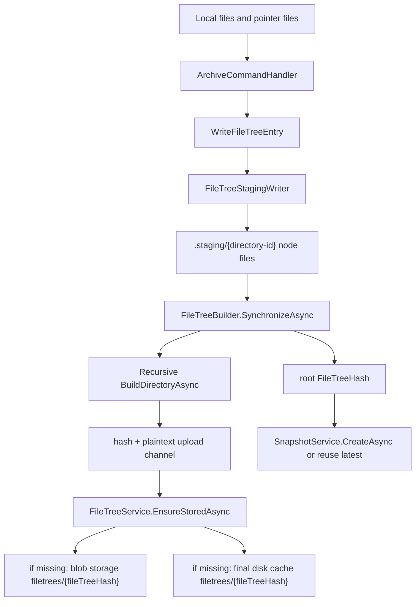
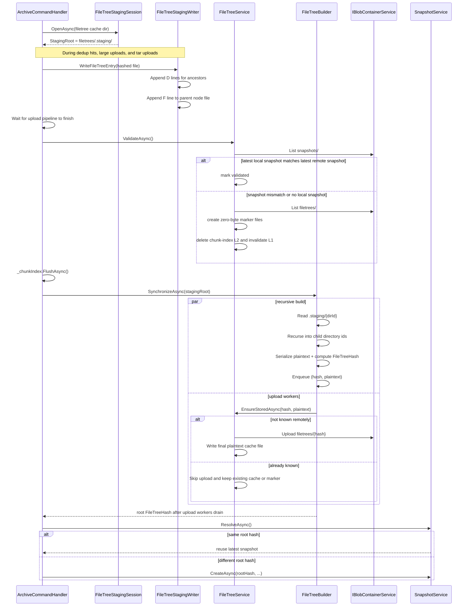

# Filetrees

Filetrees are Arius's immutable Merkle-tree representation of repository structure. A snapshot does not point at individual files directly; it points at one root `FileTreeHash`, and that root expands into directory nodes whose leaves are `FileEntry` records containing `ContentHash` values.

This document explains the current archive-time filetree pipeline in code:

- `ArchiveCommandHandler` decides when file entries are staged and when tree building starts.
- `FileTreeBuilder` turns staged directory-node files into final immutable filetree nodes.
- `FileTreeService` validates local knowledge of remote filetrees, stores finished nodes in blob storage, and maintains the final disk cache.

## At a glance



## Paths and storage layout

| Location | Owner | Purpose |
| --- | --- | --- |
| `~/.arius/{account}-{container}/filetrees/.staging/` | `FileTreeStagingSession` + `FileTreeStagingWriter` | Temporary per-run staging graph. One file per staged directory id. |
| `~/.arius/{account}-{container}/filetrees/.staging.lock` | `FileTreeStagingSession` | Local mutual exclusion. Prevents two local archive runs from sharing the same staging area. |
| `~/.arius/{account}-{container}/filetrees/{fileTreeHash}` | `FileTreeService` | Final non-staging plaintext cache of one immutable filetree node. Zero-byte files are remote-existence markers. |
| `filetrees/{fileTreeHash}` in blob storage | `FileTreeService` | Final persisted filetree blob: canonical plaintext, gzip-compressed, then optionally encrypted. |
| `~/.arius/{account}-{container}/snapshots/{timestamp}` | `SnapshotService` | Latest local snapshot cache, used by `FileTreeService.ValidateAsync()` to decide whether local filetree knowledge is trustworthy. |

The repository-local roots come from `RepositoryPaths`. Filetree-specific path helpers live in `FileTreePaths`.

## End-to-end archive flow

### 1. `ArchiveCommandHandler` opens a staging session

At the start of the archive run, `ArchiveCommandHandler` opens a `FileTreeStagingSession` for the repository's filetree cache directory.

`FileTreeStagingSession` is responsible for:

- acquiring `filetrees/.staging.lock`
- deleting any stale `filetrees/.staging/` directory from an earlier crashed run
- creating a fresh empty `.staging/` directory
- cleaning up `.staging/` again when the archive run ends

There is no per-run subdirectory under `.staging/`. The lock file is what makes that safe.

### 2. `WriteFileTreeEntry` appends staged node records during the archive pipeline

`ArchiveCommandHandler.WriteFileTreeEntry(...)` is the bridge from the chunk-upload pipeline into the filetree pipeline.

It is called from three places:

- dedup hits: the file already exists remotely or is already in-flight for this run
- large-file uploads: after `UploadLargeAsync(...)` succeeds and the chunk index is updated
- tar uploads: after the tar chunk and per-file thin chunks are written and the chunk index is updated

`WriteFileTreeEntry(...)` does three important things before writing:

- picks timestamps from the local binary file when the binary still exists
- falls back to `DateTimeOffset.UtcNow` for pointer-only entries, because no local binary timestamps exist
- normalizes pointer-only paths by removing the `.pointer.arius` suffix so filetrees always describe the binary path, not the pointer-file path

It then calls `FileTreeStagingWriter.AppendFileEntryAsync(...)`.

### 3. `FileTreeStagingWriter` turns paths into append-only staged directory nodes

`FileTreeStagingWriter` owns the on-disk staging format. For each archived file path such as `docs/specs/plan.md`, it:

- computes a deterministic directory id for each ancestor path with `FileTreePaths.GetStagingDirectoryId(...)`
- appends staged `D` lines to the parent node files
- appends one final `F` line to the leaf's parent directory node

The root directory id is `SHA256("")`, represented in code as `FileTreePaths.GetStagingDirectoryId(string.Empty)`.

Each staged node is one flat file:

```text
filetrees/.staging/{directory-id}
```

The staged line format is intentionally very close to the persisted filetree format:

```text
# staged or persisted file entry
<content-hash> F <created:O> <modified:O> <leaf-file-name>

# staged directory entry
<child-directory-id> D <child-directory-name>/

# final persisted directory entry
<child-filetree-hash> D <child-directory-name>/
```

That shared grammar is why `FileTreeSerializer` can parse both staged and persisted node files. The subtle difference is the directory identity:

- staged directory lines parse to `StagedDirectoryEntry`, whose first field is a child staging directory id
- persisted directory lines parse to `DirectoryEntry`, whose first field is a child `FileTreeHash`

Because staging is append-only, the same staged directory edge can be written multiple times while many files under the same subtree are archived. `FileTreeBuilder` later collapses identical duplicates.

`FileTreeStagingWriter` also uses striped semaphores so concurrent archive workers can append safely to the same staged node file.

### 4. After chunk uploads finish, `ArchiveCommandHandler` flushes index state and validates filetree knowledge

At the end of the archive pipeline, `ArchiveCommandHandler` waits for all chunk-related stages to complete and then runs this filetree tail in order:

1. `_fileTreeService.ValidateAsync(...)`
2. `_chunkIndex.FlushAsync(...)`
3. `new FileTreeBuilder(_encryption, _fileTreeService).SynchronizeAsync(stagingSession.StagingRoot, ...)`
4. snapshot reuse or snapshot creation via `SnapshotService`

`ValidateAsync(...)` exists because `FileTreeBuilder` will call `FileTreeService.EnsureStoredAsync(...)`, and that eventually uses `ExistsInRemote(...)`. `ExistsInRemote(...)` is only legal after validation.

### 5. `FileTreeService.ValidateAsync()` validates the local cache and may create zero-byte marker files

`FileTreeService` owns the final filetree cache under:

```text
~/.arius/{account}-{container}/filetrees/{fileTreeHash}
```

Before tree build starts, `ValidateAsync(...)` compares:

- the latest local snapshot filename in `snapshots/`
- the latest remote snapshot blob name in `snapshots/`

It has three outcomes:

- remote repository empty: no remote snapshots, so validation succeeds immediately
- fast path: latest local snapshot name matches latest remote snapshot name, so the current machine trusts its local filetree cache as complete
- slow path: snapshot mismatch or no local snapshot, so remote filetree knowledge must be rebuilt

On the slow path, `ValidateAsync(...)`:

- lists all remote `filetrees/` blobs
- creates an empty local file for each remote filetree not already cached locally
- deletes all chunk-index L2 files
- calls `ChunkIndexService.InvalidateL1()`

Those empty files are marker files. They mean: "this `FileTreeHash` exists remotely, but the plaintext node has not been downloaded to disk yet." This is safe because filetrees are immutable, content-addressed Merkle nodes: once `filetrees/{hash}` exists remotely, that existence fact stays true for that hash and the blob's meaning cannot drift underneath the marker file. After validation, `ExistsInRemote(hash)` is just `File.Exists(...)`, and marker files count as true.

This is also the performance optimization. `FileTreeBuilder` asks `ExistsInRemote(...)` for each completed directory node. Without marker files, that would require a remote existence check per node on snapshot mismatch, which is very slow. Instead, Arius pays for one `ListAsync(filetrees/)` walk up front, materializes local markers for all known remote hashes, and then serves the rest of the run's existence checks from the local filesystem.

## Recursive build and upload

### 6. `FileTreeBuilder.SynchronizeAsync()` starts an independent upload channel

`FileTreeBuilder` owns the bottom-up Merkle construction algorithm.

`SynchronizeAsync(...)` creates a bounded channel with this payload shape:

```csharp
Channel<(FileTreeHash Hash, ReadOnlyMemory<byte> Plaintext)>
```

That payload is important:

- `Hash` is the final `FileTreeHash` for the directory node
- `Plaintext` is the in-memory canonical serialized filetree content for that node

Upload workers run independently from the recursive build and call:

```csharp
await _fileTreeService.EnsureStoredAsync((hash, plaintext), ct);
```

This decouples node construction from blob upload latency. The builder can continue calculating sibling and parent nodes while earlier completed nodes are already being persisted.

### 7. `BuildDirectoryAsync(...)` reads staged nodes from the root recursively

`SynchronizeAsync(...)` starts from the staged root directory id and recursively builds the tree.

For each staged directory id, `BuildDirectoryAsync(...)`:

- reads `.staging/{directory-id}`
- parses each line with `FileTreeSerializer.ParseStagedNodeEntryLine(...)`
- collects `FileEntry` values by leaf name
- collects `StagedDirectoryEntry` values by child directory name
- throws if two staged file entries use the same name in one directory
- collapses identical duplicate staged directory edges
- throws if the same child name points at different staged directory ids
- recursively builds each child directory
- converts each non-empty child subtree into a final `DirectoryEntry`
- combines files and child directories into one `FileTreeEntry[]`
- returns `null` for empty directories so empty directories are not represented in snapshots
- serializes the final directory node to canonical plaintext bytes with `FileTreeSerializer.Serialize(...)`
- computes the final `FileTreeHash` from that plaintext with `_encryption.ComputeHash(...)`
- writes `(hash, plaintext)` to the upload channel
- returns the hash to its caller without waiting for that node's upload to finish

The builder still waits for the upload workers to drain before `SynchronizeAsync(...)` returns. That is the durability boundary: `ArchiveCommandHandler` does not get a root hash until all referenced filetree blobs are durably stored or already known to exist.

### 8. `FileTreeService` writes the finished node to blob storage and to the final cache

`FileTreeService.EnsureStoredAsync(...)` first calls `ExistsInRemote(hash)`.

- if the filetree is already known locally or remotely, nothing is uploaded
- otherwise `WriteAsync(...)` persists it

When `WriteAsync(...)` runs, it does two writes for the same finished node:

1. blob write: it gzip-compresses the canonical plaintext bytes, wraps the stream for encryption when encryption is enabled, and uploads the result to `BlobPaths.FileTree(hash)`
2. disk write: it writes the canonical plaintext bytes to the final non-staging cache file `filetrees/{hash}`

If the blob already exists, `BlobAlreadyExistsException` is tolerated. This makes filetree upload idempotent across crash recovery and concurrent runs.

The important split is:

- `.staging/{directory-id}` contains append-only temporary build input
- `filetrees/{fileTreeHash}` contains the final canonical plaintext filetree node cache
- `filetrees/{fileTreeHash}` in blob storage contains the compressed and optionally encrypted persisted form

### 9. `SnapshotService` publishes the root only after filetree storage is complete

Once `SynchronizeAsync(...)` returns a root hash, `ArchiveCommandHandler` compares it to the latest snapshot via `SnapshotService.ResolveAsync(...)`.

- if the latest snapshot already points at the same root hash, the archive is treated as unchanged and the existing snapshot is reused
- otherwise `SnapshotService.CreateAsync(...)` writes a new snapshot manifest that points at the new root hash

That ordering is deliberate: snapshots are the commit point, so Arius does not publish a snapshot until every referenced filetree node has already been stored.

## Sequence diagram



## Types and responsibilities

| Type | Responsibility |
| --- | --- |
| `FilePair` | Local archive-time view of one path: binary-only, pointer-only, or both. Produced by `LocalFileEnumerator`. |
| `HashedFilePair` | `FilePair` plus resolved `ContentHash`. This is the file-level payload that reaches `WriteFileTreeEntry(...)`. |
| `FileToUpload` | A `HashedFilePair` that still needs upload, plus size for routing into large-file or tar upload paths. |
| `TarEntry` / `SealedTar` | Small-file upload bookkeeping. After tar upload finishes, each entry is written to filetree staging. |
| `FileTreeStagingSession` | Owns `.staging/` lifetime and `.staging.lock`. Clears stale staging and guarantees one local staging session per repository cache. |
| `FileTreeStagingWriter` | Converts canonical relative file paths into append-only staged node files. Writes staged ancestor directory lines and leaf file lines. |
| `FileTreePaths` | Computes staged directory ids, staging node paths, lock paths, and final cache paths. |
| `FileTreeEntry` | Base type for entries inside a filetree node. |
| `FileEntry` | Final file leaf: `Name`, `ContentHash`, `Created`, `Modified`. |
| `DirectoryEntry` | Final persisted child-directory edge: `Name` plus child `FileTreeHash`. |
| `StagedDirectoryEntry` | Staged-only child-directory edge: `Name` plus child staging directory id. Used only before child hashes are known. |
| `FileTreeSerializer` | Canonical text serialization and parsing for filetree nodes. Parses persisted lines and staged lines into the correct subtype. |
| `FileTreeBuilder` | Reads staged node files, validates duplicates, recursively builds child subtrees, serializes canonical plaintext, computes `FileTreeHash`, and publishes completed nodes to the upload channel. |
| `FileTreeService` | Validates local knowledge of remote filetrees, answers `ExistsInRemote(...)`, uploads finished nodes, writes the final disk cache, and reads persisted nodes back later. |
| `ChunkIndexService` | Not part of filetree structure itself, but the filetree tail depends on it. `ValidateAsync(...)` invalidates its caches on snapshot mismatch so stale dedup state is not trusted. |
| `SnapshotService` | Publishes the commit point for the archive by recording the root `FileTreeHash` after all referenced filetrees are stored. |
| `IBlobContainerService` | Low-level storage boundary used by `FileTreeService` for remote listing, download, and upload. |
| `IEncryptionService` | Supplies filetree hashing and storage encryption/decryption streams. The builder uses it for `FileTreeHash` calculation; the service uses it for persisted blob encoding. |

## Important invariants

- `ValidateAsync(...)` must run before `SynchronizeAsync(...)`, because `ExistsInRemote(...)` throws if validation has not happened.
- Staging uses path-derived directory ids, not final `FileTreeHash` values.
- Final filetree blobs are immutable and content-addressed by `FileTreeHash`.
- Empty directories are omitted from the final tree.
- Duplicate file names in one staged node are invalid.
- Duplicate directory edges are allowed only when they are byte-for-byte the same logical edge.
- Snapshot creation happens only after filetree uploads have finished.

## Read path after archive

The same `FileTreeService` is later used by `ls` and `restore`.

- `ReadAsync(hash)` first checks `filetrees/{hash}` on disk.
- non-empty cache file: deserialize and return immediately
- zero-byte marker file or cache miss: download `filetrees/{hash}` from blob storage, decrypt and decompress, write the plaintext node to disk, then return it

That is why `ValidateAsync(...)` can safely pre-create empty marker files during snapshot mismatch: they make existence checks fast now, and later reads fill them with the real plaintext node content on demand.

## See also

- `docs/decisions/adr-0006-build-filetrees-from-hashed-directory-staging.md`
- `docs/cache.md`
