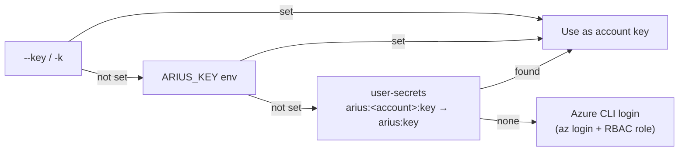

# Arius CLI — command reference

`arius` is the command-line tool for archiving a local directory to Azure Blob Storage and
restoring it later. This page is the complete reference: every command, every option, and a
worked example for each.

- **New here?** Install instructions live in the [root README](https://github.com/woutervanranst/Arius7#installation).
- **Want to know how it works inside?** See the maintainer docs at
  [design/hosts/cli.md](../design/hosts/cli.md) and the [glossary](../glossary.md).
- Terms in *italics* (e.g. *snapshot*, *chunk*) are defined in the glossary.

## At a glance

```
arius archive         <path> -a <account> -c <container> [-k <key>] [-p <passphrase>] [options]
arius restore         <path> -a <account> -c <container> [-k <key>] [-p <passphrase>] [options]
arius ls              [path] -a <account> -c <container> [-k <key>] [-p <passphrase>] [options]
arius snapshot list          -a <account> -c <container> [-k <key>] [-p <passphrase>]
arius snapshot diff <from> <to> -a <account> -c <container> [-k <key>] [-p <passphrase>]
arius repair-index            -a <account> -c <container> [-k <key>] [-p <passphrase>]
arius update
```

Every command exits `0` on success and `1` on failure (the error is printed in red and written
to the audit log — see [Where state lives](#where-state-lives)).

## Global options

These four options apply to `archive`, `restore`, `ls`, `snapshot list`, `snapshot diff`, and `repair-index`. (`update` takes
none of them — it talks only to GitHub.)

| Option | Alias | Type | Required | Meaning |
|--------|-------|------|----------|---------|
| `--account` | `-a` | string | Yes¹ | Azure Storage account name (just the name, not the full URL). |
| `--container` | `-c` | string | **Yes** | Azure Blob container that holds the repository. |
| `--key` | `-k` | string | No | Azure Storage account key. Omit to authenticate via the Azure CLI. |
| `--passphrase` | `-p` | string | No² | Encryption passphrase. Omit for an unencrypted repository. |

¹ `--account` may be omitted on the command line if you set the `ARIUS_ACCOUNT` environment
variable instead. One of the two must be present.
² The passphrase is not stored anywhere. It must be supplied (and identical) on every command
that touches an encrypted repository — there is no way to recover data if it is lost. If it is
missing or wrong, the command stops with a clear error telling you to provide `--passphrase` / `-p`,
rather than a cryptic decompression failure.

**Logging — `ARIUS_LOG_LEVEL`.** A single environment variable controls log verbosity across every
Arius host (CLI, API/Web, Explorer), using Serilog's level names (case-insensitive): `Verbose`,
`Debug`, `Information` (default), `Warning`, `Error`, `Fatal`. The CLI writes to its per-run audit log
file; the API/Web container logs to stdout (`docker logs`). Set `Debug` to see per-file `[fast-hash]`
decisions (`-> reused (ctime match)` vs `(size+fp match)`).

> **One account + container = one repository.** All local state, the deduplication index, and
> the audit logs are keyed on the `account`/`container` pair. See [Where state lives](#where-state-lives).

---

## `archive` — back up a local directory

Walk a local directory, deduplicate and (optionally) encrypt its contents into *chunks*, and
upload everything to Azure Blob Storage as a new immutable *snapshot*. Archiving is idempotent:
if nothing changed since the last run, no blobs are written and no new snapshot is created
(a no-op).

### Synopsis

```
arius archive <path> -a <account> -c <container> [-k <key>] [-p <passphrase>]
                     [-t|--tier <Hot|Cool|Cold|Archive>] [--remove-local] [--write-pointers] [--fast-hash]
```

### Options

| Argument / option | Type | Default | Required | Meaning |
|-------------------|------|---------|----------|---------|
| `path` | path | — | **Yes** | Local directory to archive. |
| `--tier`, `-t` | `Hot` \| `Cool` \| `Cold` \| `Archive` | `Archive` | No | Storage tier the uploaded *chunks* land on. `Archive` is cheapest to store but must be *rehydrated* (slow, paid) before a restore. |
| `--remove-local` | flag | off | No | Delete the local *binary files* after the snapshot is committed, leaving only the `.pointer.arius` sidecars behind. Requires `--write-pointers`. |
| `--write-pointers` | flag | off | No | Write (or update) `.pointer.arius` sidecar files for archived binaries. Off by default — pointers are opt-in. |
| `--fast-hash` | flag | off | No | Skip re-reading files the local [hashcache](../design/core/shared/hashcache.md) verifies as unchanged since the last run. A heuristic that trades a small mis-detection risk for speed on large, stable trees; the default re-reads every file. |
| *(plus the four [global options](#global-options))* | | | | |

`--remove-local` requires `--write-pointers`: removing the binary while writing no pointer would
leave no local trace of the file at all, so the command rejects `--remove-local` on its own with an
error. (Legacy `.pointer.arius` files are still upgraded in place regardless of the flag.)

Fixed pipeline behavior (not configurable from the CLI): files **≥ 1 MB** upload individually as
*large chunks*; files **< 1 MB** are bundled into *tar chunks* with a 64 MB target bundle size.

**Always skipped** (so they never enter a *snapshot*): NAS metadata folders (`@eaDir`, `eaDir`,
`SynoResource`), OS junk files (`autorun.ini`, `thumbs.db`, `.DS_Store`), and entries carrying the
*System* attribute. An excluded folder is skipped whole — its contents are never scanned. This list
is built into Arius (see the [design notes](../design/core/features/archive-command.md#how-it-works)
for how it is sourced).

### Example

Archive a photo library to the Archive tier and reclaim local disk by removing the originals,
keeping only pointer files:

```bash
arius archive ./photos \
  -a mystorageaccount \
  -c photos-backup \
  -t Archive \
  --remove-local --write-pointers
```

On success you get a one-line summary, e.g.:

```
Archive complete. Scanned: 1240, Excluded: 12, Uploaded: 312, Deduped: 928, Uploaded: 2.1 GB stored (3.0 GB uncompressed), Original size: 8.4 GB, Snapshot: 2026-06-17T142233.117Z
```

The summary separates *this run's* upload from the snapshot total: **Excluded** counts entries dropped
during the scan — the always-skipped noise (NAS metadata folders, OS junk, System-attribute entries),
broken symlinks, or unreadable folders, with a pruned folder counting as one; **Uploaded** reports the
bytes newly written to storage (compressed) and, in parentheses, their uncompressed size; **Original
size** is the logical size of the whole snapshot (every file, what you would restore) — not just what
this run uploaded.

---

## `restore` — bring files back

Resolve a *snapshot* and reconstruct its files into a local directory. Files already present and
identical on disk are skipped. If any required *chunks* are on the Archive tier, restore first
shows a **rehydration cost estimate** and asks you to confirm before incurring the (paid, slow)
rehydration.

### Synopsis

```
arius restore <path> -a <account> -c <container> [-k <key>] [-p <passphrase>]
                     [-v|--version <version>] [--overwrite] [--no-pointers]
```

### Options

| Argument / option | Type | Default | Required | Meaning |
|-------------------|------|---------|----------|---------|
| `path` | path | — | **Yes** | Local directory to restore into. |
| `--version`, `-v` | string | latest | No | Which *snapshot* to restore. A **partial timestamp** is accepted (e.g. `2026-06-17` or `2026-06-17T14`); it matches the snapshot whose timestamp starts with that text. Omit to restore the latest. |
| `--overwrite` | flag | off | No | Overwrite existing local files that differ, without prompting. Without it, locally-modified files are kept. |
| `--no-pointers` | flag | off | No | Skip creating `.pointer.arius` sidecar files during the restore. |
| *(plus the four [global options](#global-options))* | | | | |

### Rehydration flow (Archive-tier data)

When a restore needs chunks that live on the Archive tier, Arius prints a cost table and a
priority prompt:

- **Standard** — completes in roughly **15 hours**, lower cost.
- **High** — completes in roughly **1 hour**, higher cost.
- **Cancel** — abort without rehydrating.

Rehydration runs server-side in Azure, so you can exit `arius` after confirming. **Re-run the
exact same `restore` command** once the rehydration window has passed to finish copying the
files down. If chunks are still pending when the command ends, it tells you how many and to
retry in ~15 hours. After a successful download from rehydrated copies, Arius offers to delete
the temporary rehydrated blobs to stop their hot-tier storage charges.

### Example

Restore the latest snapshot, overwriting any locally-changed files:

```bash
arius restore ./photos \
  -a mystorageaccount \
  -c photos-backup \
  --overwrite
```

Restore a specific older snapshot by partial timestamp:

```bash
arius restore ./photos \
  -a mystorageaccount \
  -c photos-backup \
  -v 2026-05
```

---

## `ls` — list files in a snapshot

Stream the file listing of a *snapshot*. Entries are printed as they arrive (no buffering), so
this stays responsive and memory-bounded even for repositories with millions of files. If you
pass a local `path`, each row is overlaid with what is present on your disk. The overlay applies
the same exclusions as `archive` (the `@eaDir`/`thumbs.db`/system-attribute set), so excluded files
are not shown as local-only — the listing reflects what would actually be backed up.

### Synopsis

```
arius ls [path] -a <account> -c <container> [-k <key>] [-p <passphrase>]
                [-v|--version <version>] [--prefix <path>] [-f|--filter <substring>]
```

### Options

| Argument / option | Type | Default | Required | Meaning |
|-------------------|------|---------|----------|---------|
| `path` | path | none | No | Optional local directory to overlay. When given, the state cell reflects whether each file exists locally as a pointer and/or binary. The directory must exist. |
| `--version`, `-v` | string | latest | No | Snapshot to list. Partial-timestamp match, same rule as `restore`. |
| `--prefix` | string | none | No | Only list entries under this path prefix (a trailing slash is optional). |
| `--filter`, `-f` | string | none | No | Case-insensitive filename substring filter. |
| *(plus the four [global options](#global-options))* | | | | |

### Reading the state column

Each row begins with a 4-character state cell. A dot (`.`) means the flag is absent:

| Position | Char | Meaning |
|----------|------|---------|
| 1 | `P` | A local `.pointer.arius` sidecar exists (only when a local `path` is given). |
| 2 | `B` | The local *binary file* exists (only when a local `path` is given). |
| 3 | `R` | The file is present in the repository. |
| 4 | `H` | Chunk is hydrated / readily downloadable. |
| 4 | `A` | Chunk is on the Archive tier (needs rehydration before restore). |
| 4 | `~` | Chunk is currently rehydrating. |
| 4 | `?` | In the repository but its tier is not known from the index. |

For example `PBRH` means "pointer + binary present locally, in repo, downloadable", while
`..RA` means "only in the repo, archived".

### Example

List everything under `2024/` whose name contains "invoice", overlaying the local working copy:

```bash
arius ls ./photos \
  -a mystorageaccount \
  -c photos-backup \
  --prefix 2024/ \
  -f invoice
```

---

## Inspecting snapshots

### `arius snapshot list`

Lists every snapshot, oldest first, with a 1-based index, the version id, creation time, and file count:

    arius snapshot list -a <account> -c <container>

The index is a convenience for `snapshot diff` — index 1 is the oldest snapshot, the highest index the latest.

### `arius snapshot diff <from> <to>`

Shows what changed between two snapshots. Each argument is either an index from `snapshot list` or a version/timestamp prefix:

    arius snapshot diff 5 6                                  -a <account> -c <container>
    arius snapshot diff 2024-04-02T13:09:54 2024-12-30T16:17:32 -a <account> -c <container>

An argument made entirely of digits is always read as a `snapshot list` index, never a version prefix — so to select a whole year, give a prefix that isn't purely numeric (e.g. `2024-`), not a bare `2024`.

Output is git `--name-status`-style — `A` added, `D` removed, `M` modified (content changed), `T` timestamp-only — followed by a summary line. The command is read-only. A warning is logged when the two snapshots were written by different Arius versions, because a cross-platform line-ending change can make identical content appear changed.

---

## `repair-index` — rebuild the deduplication index

Rebuild the *chunk index* (the deduplication shards) by listing the committed *chunks* in the
container. Run this if `archive`, `restore`, or `ls` reports that the chunk index is corrupt,
incomplete, or missing entries. It is safe to re-run if interrupted.

### Synopsis

```
arius repair-index -a <account> -c <container> [-k <key>] [-p <passphrase>]
```

### Options

Only the four [global options](#global-options). There are no command-specific flags.

### Example

```bash
arius repair-index \
  -a mystorageaccount \
  -c photos-backup
```

On success it reports the counts touched, e.g.:

```
Repair complete. Listed 4096 chunk(s), rebuilt 4096 entries across 5 shard(s), uploaded 5, deleted 0 stale shard(s).
```

---

## `update` — self-update the binary

Check GitHub Releases for a newer version and, if one exists, download the asset for your
platform and replace the running executable in place. This command takes **no options** and does
not contact Azure.

### Synopsis

```
arius update
```

### Example

```bash
arius update
```

Typical output when already current:

```
Current version: 1.4.2
Checking for updates...
You are running the latest version.
```

Notes:
- Supported platforms (release identifiers): `win-x64`, `osx-x64`, `osx-arm64`, `linux-x64`.
  Anything else reports "unsupported platform".
- On Windows the running `.exe` cannot overwrite itself, so a small helper script applies the
  swap after `arius` exits — restart `arius` a moment later.
- On macOS/Linux the binary is replaced and made executable immediately; just re-run `arius`.

---

## Authentication / account key

Arius needs two things to reach a repository: the **account name** and a way to **authenticate**.

### Account name

Resolved in this order; the first non-empty value wins:

1. `--account` / `-a` on the command line.
2. The `ARIUS_ACCOUNT` environment variable.

If neither is set, the command stops with
`No account provided. Use --account / -a or set ARIUS_ACCOUNT.`

### Authentication (4 methods, in priority order)

The account **key** is resolved first; if no key is found, Arius falls back to your Azure CLI
login. Concretely, the chain is:

1. **`--key` / `-k` flag** — the account key passed directly on the command line.
2. **`ARIUS_KEY` environment variable** — the account key from the environment.
3. **.NET user secrets** — looked up as `arius:<account>:key` first, then a generic `arius:key`.
   Useful for keeping the key out of your shell history:
   ```bash
   dotnet user-secrets set "arius:mystorageaccount:key" "<key>"
   ```
4. **Azure CLI login** — if none of the above yields a key, Arius authenticates with the
   identity from `az login` (token credential). Your identity needs the right RBAC role on the
   storage account:
   - **Storage Blob Data Contributor** for `archive` / `repair-index` (read + write).
   - **Storage Blob Data Reader** for `restore` / `ls` (read only).

   ```bash
   az login
   az role assignment create --assignee <your-email> \
     --role "Storage Blob Data Contributor" \
     --scope /subscriptions/<sub>/resourceGroups/<rg>/providers/Microsoft.Storage/storageAccounts/mystorageaccount
   ```



Arius validates the connection up front (a *preflight* check). Common failures map to clear
messages: container not found, access denied (wrong key, or missing RBAC role when using
Azure CLI), or "no key found and Azure CLI is not logged in".

### Encryption passphrase

The `--passphrase` / `-p` option is independent of authentication — it encrypts the *contents*
client-side before upload. Omit it for an unencrypted repository. It is never persisted; supply
the same passphrase on every command that touches an encrypted repository. For emergency
recovery of a single chunk without the Arius binary, see
[Disaster recovery in the README](https://github.com/woutervanranst/Arius7#disaster-recovery).

---

## Where state lives

Arius keeps a per-repository cache and audit logs on your machine under your home directory:

```
~/.arius/<account>-<container>/
├── chunk-index/   Local SQLite dedup cache (cache.sqlite)
├── filetrees/     Cached Merkle tree node blobs
├── snapshots/     Cached snapshot manifests
└── logs/          One timestamped audit log per command invocation
```

- The directory name is `<account>-<container>`, so each repository is isolated.
- The cache is **purely a local accelerator** — it is rebuilt from the container on demand and is
  safe to delete if you want to reclaim disk or force a clean re-read.
- Every invocation of `archive`, `restore`, `ls`, and `repair-index` writes a log file named
  `<timestamp>_<command>.txt` (e.g. `2026-06-17_14-22-33_archive.txt`) into `logs/`, capturing
  the structured pipeline events and the console output you saw.

---

## See also

- [Root README](https://github.com/woutervanranst/Arius7) — install, blob layout, disaster recovery.
- [design/hosts/cli.md](../design/hosts/cli.md) — how the CLI host drives Arius.Core and renders progress (internals).
- [glossary](../glossary.md) — definitions for *snapshot*, *chunk*, *chunk index*, *storage tier hint*, and more.
