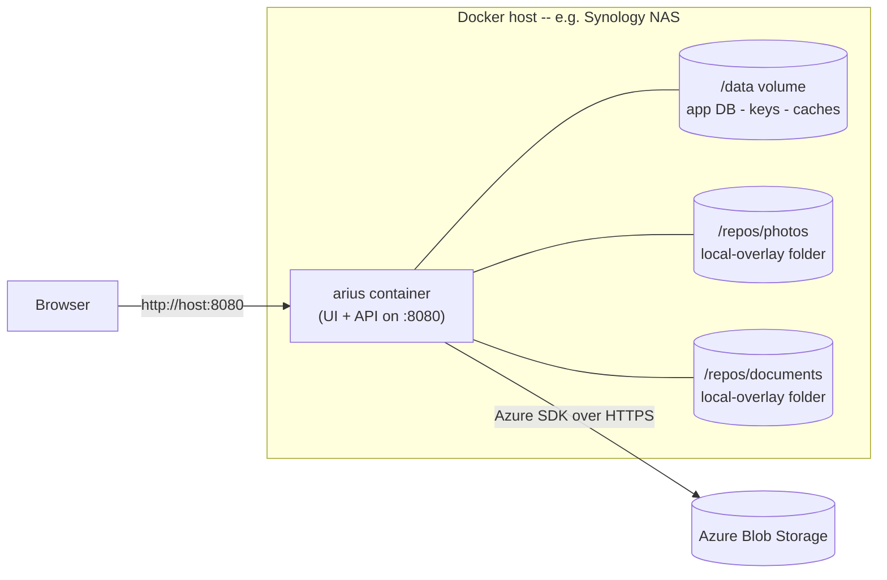

# Deploying Arius

This guide covers how to **run the Arius web app** — the browser UI for managing
many repositories from one place. It also points you at the CLI install methods if
you only want the command-line tool.

The web app ships as a **single Docker container**: one image serves the Angular UI
and the REST/SignalR API together on port `8080`. There is no separate front-end to
deploy, no database server to stand up — just the container plus a couple of volumes.

For *what the container actually runs* (the API host, the job model, the per-repository
service providers, secrets at rest), see the maintainer doc
[design/hosts/web.md](../design/hosts/web.md). This page is the operator view: how to
deploy it.

---

## At a glance

| | |
|---|---|
| What you deploy | One container (Angular UI + REST/SignalR API) |
| Port | `8080` (HTTP) |
| Persistent state | One `/data` volume (app DB, encryption keys, caches) |
| Your backup folders | One mount per repository local-overlay folder |
| Prebuilt image | `woutervanranst/ariusweb:latest` |
| Auth | **None** — assume a trusted, single-user network |

> **Security note:** the web app has **no authentication**. Every endpoint and the
> SignalR hub are open. Run it only on a trusted LAN (e.g. behind your NAS firewall),
> never directly exposed to the internet. See the *No authn/authz* seam in
> [design/hosts/web.md](../design/hosts/web.md#open-seams-future).

---

## Deployment topology



The container talks to Azure Blob Storage for the actual archive data. The `/data`
volume holds everything that must survive a restart or image upgrade; the per-repository
mounts are the local folders you archive from / restore to.

---

## Running with Docker Compose (recommended)

Docker Compose is the easiest way to run and upgrade the app. The repository ships a
[`docker-compose.yml`](https://github.com/woutervanranst/Arius7/blob/master/docker-compose.yml) at its root that **builds the image from
source**. Most operators instead run the **prebuilt image** — see
[Using the prebuilt image](#using-the-prebuilt-image) below.

### Build from source

From the repository root:

```bash
docker compose up -d --build      # build the image and start (detached)
docker compose logs -f            # follow logs
docker compose down               # stop and remove
```

Then open `http://<host>:8080`.

The shipped compose file (edit the volume paths to match your host):

```yaml
services:
  arius:
    build:
      context: .
      dockerfile: Dockerfile
    image: arius-web:latest
    container_name: arius
    restart: unless-stopped
    ports:
      - "8080:8080"
    volumes:
      # App SQLite, Data-Protection keys, and Arius.Core's ~/.arius caches.
      - /volume1/docker/arius/data:/data
      # One mount per repository local-overlay folder (adjust to your shares).
      - /volume1/photo:/repos/photos:rw
      - /volume1/documents:/repos/documents:rw
    environment:
      - ASPNETCORE_URLS=http://+:8080
      - HOME=/data
      - Arius__AppDbPath=/data/arius-app.sqlite
      - Arius__DataProtectionKeysPath=/data/keys
```

The default volume paths target a Synology NAS (`/volume1/...`). Change them to wherever
your data and shares live.

---

## Using the prebuilt image

If you don't want to build from source, deploy `woutervanranst/ariusweb:latest`. This
compose file pulls the published image and adds [Watchtower](#auto-updates-with-watchtower)
for automatic updates — a good fit for a Synology NAS:

```yaml
services:
  ariusweb:
    image: woutervanranst/ariusweb:latest
    container_name: ariusweb
    restart: unless-stopped
    network_mode: bridge
    ports:
      - "8080:8080"
    environment:
      - TZ=Europe/Brussels
    volumes:
      - /volume1/docker/ariusweb/data:/data
      - /volume1/folder1:/my-local-archive1
      - /volume1/folder2:/my-local-archive2
    dns:
      - 1.1.1.1
      - 8.8.8.8
    labels:
      - "com.centurylinklabs.watchtower.enable=true"
  watchtower:
    image: containrrr/watchtower:latest
    container_name: watchtower
    restart: unless-stopped
    volumes:
      - /var/run/docker.sock:/var/run/docker.sock
    command: >
      --schedule "0 0 4 * * *"
      --cleanup
      --label-enable
```

Save it as `docker-compose.yml` somewhere on your host and run `docker compose up -d`.

---

## Running with plain `docker run`

If you'd rather not use Compose, run the image directly:

```bash
docker run -d --name arius -p 8080:8080 \
  -v /host/arius/data:/data \
  -v /host/photos:/repos/photos \
  woutervanranst/ariusweb:latest
# → http://localhost:8080
```

To build that image locally instead of pulling it, from the repository root:

```bash
docker build -t arius-web:latest .
```

The build is multi-stage — it builds the Angular bundle (`node`), publishes the .NET API
(`dotnet/sdk`), then assembles both into a small `dotnet/aspnet` runtime image.

---

## Volumes and paths

There are two kinds of volume to mount.

### 1. The `/data` volume — keep this safe

Everything that must persist lives under `/data` (the container sets `HOME=/data`):

| What | Path in container | Why it matters |
|---|---|---|
| App database (accounts, repositories, jobs, schedules) | `/data/arius-app.sqlite` | Your fleet configuration |
| Data-Protection key ring | `/data/keys` | **Decrypts your stored account keys + passphrases** |
| Arius.Core caches (`~/.arius`) | `/data/.arius` | [chunk index](../glossary.md#chunk-index), [filetree](../glossary.md#filetree), [snapshot](../glossary.md#snapshot) caches — rebuildable, but speeds up browsing |
|| Per-repository logs | `/data/.arius/{account}-{container}/logs/` | One daily-rolling log per repository capturing every archive/restore/browse operation (in the same directory and line format the CLI uses) — your forensic trail |

> **Back up `/data`.** If you lose the **Data-Protection keys** (`/data/keys`), the app
> can no longer decrypt the Azure account keys and repository passphrases it has stored —
> you'd have to re-enter them. Keeping `/data` on a single persistent volume (and backing
> that volume up) is the whole point. The keys are written by ASP.NET Data Protection and
> are tied to this key ring; they are never sent to the browser.

The caches under `/data/.arius` are safe to lose — Arius rebuilds them from the
repository on demand — but keeping them avoids re-downloading index/tree state after a
restart. The per-repository `logs/` subfolders are **not** rebuilt: they are the operation
history, retained ~366 daily files per repository (see [logging](../design/cross-cutting/logging.md#per-host-setup)).

### 2. Per-repository local-overlay folders

Each repository in the app has a **local path** (set in the Add/Create wizard or in
Properties). That path is interpreted **inside the container**, so every folder you
archive from or restore to must be mounted into the container:

```yaml
volumes:
  - /volume1/photo:/repos/photos:rw         # host share : container path
  - /volume1/documents:/repos/documents:rw
```

When you configure a repository's local path in the UI, use the **container-side** path
(e.g. `/repos/photos`), not the host path. If a repository has no local path set, restores
go to a temp directory inside the container instead.

Add one mount per repository folder. You can add more later — just stop the container,
add the volume line, and start it again.

---

## Environment variables

The image sets sensible defaults; you normally only override these if you change the
volume layout.

| Variable | Default (in image) | Purpose |
|---|---|---|
| `ASPNETCORE_URLS` | `http://+:8080` | Address/port Kestrel listens on |
| `HOME` | `/data` | Anchors Arius.Core's `~/.arius` caches onto the volume |
| `Arius__AppDbPath` | `/data/arius-app.sqlite` | App SQLite location |
| `Arius__DataProtectionKeysPath` | `/data/keys` | Data-Protection key ring location |
| `TZ` | (unset) | Time zone — set it so cron schedules fire at your local time |

If you change the port (`ASPNETCORE_URLS=http://+:9000`), update the `ports:` mapping to
match.

---

## Exposing the port

The container listens on `8080`. The `ports:` / `-p` mapping decides what's reachable on
the host:

- `"8080:8080"` — reachable at `http://<host>:8080`.
- `"9000:8080"` — change only the **left** side to serve on a different host port; the
  container still listens on `8080` internally.

Because there is no authentication, do **not** publish this port to the public internet.
If you need remote access, put it behind a VPN or a reverse proxy that adds
authentication. (The app uses a SignalR WebSocket at `/hubs/arius`, so any reverse proxy
in front of it must allow WebSocket upgrades, and HTTP must be allowed inside your trusted
network.)

---

## Synology NAS

The compose examples above are written for Synology (`/volume1/...`):

1. Install **Container Manager** (or Docker) from the Package Center.
2. Create the data folder, e.g. `/volume1/docker/ariusweb/data`.
3. Drop one of the compose files above into a project and adjust the volume paths to your
   own shares (e.g. map `/volume1/photo` to `/repos/photos`).
4. Bring it up; the UI is at `http://<nas-ip>:8080`.
5. Set `TZ` (e.g. `Europe/Brussels`) so scheduled archive runs fire at your local time.

---

## Auto-updates with Watchtower

The prebuilt-image compose file above includes [Watchtower](https://containrrr.dev/watchtower/),
which keeps Arius on the published image track:

- `--schedule "0 0 4 * * *"` — check for a newer image every day at **04:00**.
- `--label-enable` — only update containers explicitly labelled
  `com.centurylinklabs.watchtower.enable=true` (so it touches Arius and nothing else).
- `--cleanup` — remove the old image after a successful update.

When a new `woutervanranst/ariusweb:latest` is published, Watchtower pulls it and
recreates the container with the same volumes and environment — your `/data` and
repository mounts carry over, so configuration survives the upgrade.

---

## Upgrading manually

If you're not using Watchtower:

```bash
# prebuilt image
docker compose pull && docker compose up -d

# built from source
docker compose up -d --build
```

Your `/data` volume and repository mounts persist across the recreate, so accounts,
repositories, jobs, and schedules are preserved.

---

## Just the CLI?

If you only want the command-line tool (no web UI), you don't need Docker at all. Download
the binary for your platform and install it — the
[README](https://github.com/woutervanranst/Arius7#installation) has copy-paste instructions for:

- **Windows** — download `arius-win-x64.exe`, add its folder to `PATH`.
- **Linux & Synology NAS** — `curl` the `arius-linux-x64` binary into `/usr/local/bin`.
- **macOS** — `curl` the `arius-osx-arm64` binary (clear the quarantine flag with
  `xattr -c` if macOS blocks it).

Once installed, `arius update` upgrades it in place. See the
[CLI guide](../design/hosts/cli.md) for what the command-line host does and the
[README Usage section](https://github.com/woutervanranst/Arius7#usage) for the `archive` / `restore` / `ls` /
`repair-index` commands.

---

## See also

- [design/hosts/web.md](../design/hosts/web.md) — what the container runs: the API host,
  the job model, per-repository service providers, secrets at rest.
- [README](https://github.com/woutervanranst/Arius7) — installation, CLI usage, and the blob storage layout.
- [Glossary](../glossary.md) — [snapshot](../glossary.md#snapshot),
  [chunk index](../glossary.md#chunk-index), [filetree](../glossary.md#filetree).
