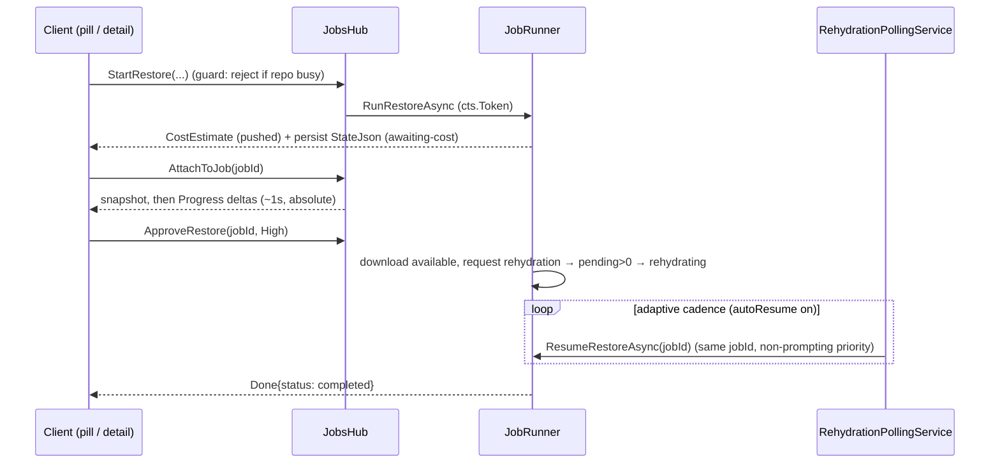

# Design: Archive/Restore & Jobs progress UX

**Date:** 2026-07-04 · **Status:** approved (brainstorm) · **Branch:** `jobs-progress`
**Affected:** `src/Arius.Web` (Angular), `src/Arius.Api`, and two additive events in `src/Arius.Core`.

---

## 1. Context & problem

Arius.Web presents running archive/restore operations with a terminal-style **live console**, a **count-based progress bar** (jumps to ~95% during hashing, then hangs for the entire upload), and raw counters. The design handoff (`Progress UX Options.dc.html`, turns 4a/3a/3b) replaces this with:

- a **byte-weighted layered progress bar** (Scanned ⊇ Hashed & routed ⊇ Uploaded, in original-dataset bytes),
- a **floating repo-scoped pill**, a **job detail page** (`/jobs/:id`), and a **redesigned Jobs overview**,
- **honest ETA** (sliding-window rate), **verbatim warnings**, and **rehydration auto-resume** for archive-tier restores.

The handoff is a high-fidelity *visual* spec. This document resolves the **Api state-model, job-lifecycle, and data questions** the visual spec does not, grounded in the current code.

### What already exists (this is a rework, not greenfield)
Per-job SignalR groups (`JobsHub`), a `JobRunner` with a per-repo write-gate, a `JobSink` that aggregates counters, event forwarders for every Core event, the cost-approval handshake (`RestoreApprovalRegistry`), a cron `SchedulerService`, a SQLite job store, and a per-repository rolling Serilog file. Core events already carry byte sizes.

## 2. Constraints

- The handoff said **"Api/Web-only, no Core changes."** This is **revised** to *Api/Web **+ two small additive Core events*** (§10). Everything else stays out of Core.
- **Hosts talk only to Features via `IMediator`, never to Core `Shared` services directly** — recorded as a boundary rule in `AGENTS.md` this session. Rehydration status is obtained by re-triggering the restore feature, **not** by calling `IChunkStorageService.ListRehydratedChunksAsync` from the Api.
- Correctness/durability over throughput; blob storage is non-transactional; restore is idempotent (ADR-0017).

## 3. Goals / non-goals

**Goals:** kill the console everywhere; byte-honest layered progress; reattachable job detail page; repo-scoped pill; rehydration auto-resume; verbatim per-job warnings; a redesigned Jobs overview; survive Api restart for *waiting* jobs.

**Non-goals:** resuming a *running* archive/restore across an Api restart (in-process work dies — re-run); per-file UI (explicit product decision: aggregate only, no per-file row flashing); Hangfire (a hosted `BackgroundService` suffices); refunding rehydration on cancel.

---

## 4. Job state model & persistence (#1)

Three layers, with a clear authority split:

| Layer | Holds | Lifetime |
|---|---|---|
| **`jobs` row** (durable identity) | id, kind, repo, trigger, status, timestamps | forever (history) |
| **`StateJson` column** (thin bridge) | resume params for a waiting job **+** last-known aggregate snapshot **+** warnings tail | flushed on transitions + a throttled ~5–10 s tick |
| **in-memory `JobState` registry** (per jobId) | live byte aggregates, per-stage counters/timings, ETA window samples, warning buffer, the per-job `CancellationTokenSource`, the ~1 s emit timer | transient — recreated per run; gone on restart |

- SignalR deltas mutate `JobState`; snapshot-on-attach reads it; it is periodically serialized into `StateJson`. **No per-metric columns, no event-log table, no full event sourcing** (we never replay per-file history — the product deliberately discards it).
- **The DB row is the durable anchor; `JobState` is a transient cache.** A resumed job keeps the **same jobId**.
- **Restart reconciliation** (see §11 for the status rule): `running` → `interrupted` unless `StateJson` shows a resumable rehydration context (`chunksPending > 0`) → then `rehydrating`; `awaiting-cost`/`rehydrating` → stay (re-armed).

**Schema changes** (`jobs` table): add `StateJson TEXT NULL` and `Outcome TEXT NULL` (§13); add the partial unique index from §6.

## 5. Reattach protocol & per-job message routing (#2)

Killing the console removes the hard part: every remaining live message (`Progress`, `CostEstimate`, `Done`) is **absolute-state, latest-wins**, so snapshot-vs-delta ordering is a non-issue.

- **`AttachToJob(jobId)`** (hub): joins the SignalR group **and returns the current snapshot** (from `JobState` if live, else `StateJson`). Single round trip, no gap, one client apply-path (snapshot payload == `Progress` delta shape). `DetachFromJob(jobId)` leaves the group.
- **Every message carries `jobId`.** Today `RealtimeService` has *global untagged* subjects assuming one active job; the overview drives live mini-bars for multiple jobs at once, so messages must be tagged and routed (`jobStream(jobId)`).
- **Re-attach on reconnect.** `withAutomaticReconnect()` gets a new connectionId and **silently loses group membership** — `RealtimeService` tracks the attached jobId set and re-issues `AttachToJob` in `onreconnected`.
- **REST vs hub split by liveness:** running job detail / pill / overview-active → `AttachToJob`; finished/history detail → `GET /jobs/{id}` (no socket); discovery → `GET /jobs?repositoryId=…&status=active`; warnings → `GET /jobs/{id}/warnings`.

## 6. Single-operation-per-repository guard (resolves #8's multiplicity)

Core cannot know cross-job state — this is an **Api invariant**:

> A repository may have **at most one job in a non-terminal state** (`running` | `awaiting-cost` | `rehydrating`). A *new* start request (one-off, scheduled, or restore) is **rejected** while one exists; the **resume of the existing job is exempt** (same jobId).

- The old per-repo semaphore **queued**; this **rejects**. Enforcement is a SQLite **partial unique index** `UNIQUE(repository_id) WHERE status IN ('running','awaiting-cost','rehydrating')` (race-proof; resume is an `UPDATE` of the one row), plus a friendly pre-check for the error message.
- Hub start → "repository busy" error the drawer surfaces; scheduler → log + skip + roll `NextRun`.
- **Reads are exempt** (cached read provider, no job row). The guard is per-repo, so the overview's Active section can still list many jobs across different repos.

## 7. Rehydration auto-resume (#3)

The `RestoreCommandHandler` does **not** wait for rehydration: it downloads what's available, requests rehydration for the rest, and returns `ChunksPendingRehydration > 0` (idempotent). **Auto-resume = re-trigger the restore feature on a schedule until pending == 0.** The re-trigger *is* the status check (a cheap status peek would need a `Shared` call — forbidden).

- **Latent bug fixed:** `RunRestoreAsync` today unconditionally marks `completed`, silently dropping pending chunks. It must branch on `ChunksPendingRehydration`: `> 0` → `rehydrating` + persist resume state + arm the poller; `== 0` → `completed`.
- **`RehydrationPollingService : BackgroundService`** (mirrors `SchedulerService`): minute tick, per-job due-check from persisted fields — **no per-job `Timer` objects → restart-safe.** Adaptive cadence (from the handoff): High every 15 min from start; Standard first ~10 h then hourly; tighten to 15 min once a re-run reports the first chunk available.
- **autoResume ON** (default): poller re-triggers full restore runs; status updates as a side-effect of each run. A full tree walk per re-run is the accepted cost of the boundary; cadence keeps re-runs rare.
- **autoResume OFF:** no re-triggering, so status is unknown; show a **heuristic** "≈ hydrated by HH:MM" (`rehydrationStartedAt` + priority window, §18) + a **"Restore now"** button (on-demand run). `SetAutoResume(jobId, bool)`, `ResumeRestore(jobId)`.
- **Same jobId across resumes.** Resume passes a **non-prompting** `ConfirmRehydration` returning the persisted priority — honors the original Standard/High choice, no re-charge, no connection needed.
- `StateJson` (waiting restore): repo · version · targetPaths · destination · priority · autoResume · rehydrationStartedAt · lastRunAt · aggregate snapshot.

## 8. Cost-confirmation lifecycle (#4)

Happy path is **in-run** (no double classify); park-and-re-trigger is the **fallback**.

- **In-run (norm):** the `ConfirmRehydration` callback blocks awaiting the answer and feeds the chosen priority **back into the same run** — exactly as today. Fixed vs today: **keyed by jobId** (any connection answers), a **bounded wait** (15 min) so an abandoned dialog releases the repo gate and parks, and **no disconnect-decline** (remove `OnDisconnectedAsync → CancelForConnection`).
- **Fallback (rare):** on timeout / restart / late answer the original run is gone, so `ApproveRestore(jobId, priority)` re-triggers `ResumeRestoreAsync` (the §7 primitive, one extra classify). `DeclineRestore(jobId)` → `cancelled`.
- `RestoreApprovalRegistry` is **kept but modified** (jobId-keyed, timeout-aware); only `CancelForConnection` is removed.
- Estimate is **pushed** (`CostEstimate`, immediate modal) **and persisted** in `StateJson` ("Review cost ›" / snapshot-on-attach later). Status `awaiting-cost` → the **Needs your attention** section; the cost modal renders inline on `/jobs/:id`.

## 9. Cancellation (#5)

Core is already cancellation-aware; the Api just never supplied a token (`CancellationToken.None`).

- **Per-job `CancellationTokenSource`** in the registry; `JobRunner` passes `cts.Token` into `CreateJobProviderAsync` + `mediator.Send`, disposes in `finally`.
- **`CancelJob(jobId)`**: live → `cts.Cancel()`; parked → mark `cancelled` + disarm poller / clear approval.
- **Distinguish cancel from failure:** `JobRunner`'s `catch (Exception)` currently maps *everything* (incl. OCE) to `failed`; add `catch (OperationCanceledException) → "cancelled"` (mirrors `RepositoryEndpoints.cs:112`).
- **Safe:** archive's snapshot is the last stage (6d) — cancelling mid-upload publishes no snapshot; orphan chunks are reusable by a future run via dedup. Restore keeps files written so far (idempotent). Cancel is cooperative — takes effect at the next checkpoint (≈ after the in-flight chunk); show a "Cancelling…" transitional state.
- **Confirm on paid work:** a confirm ("Rehydration already paid — no refund. Cancel anyway?") when cancelling a `rehydrating` restore; none for archive.
- **Cancel does *not* delete rehydrated chunk copies.** In-flight Azure rehydrations complete regardless (already paid, can't be aborted); already-rehydrated copies are paid-for and **reusable** — a later re-run finds them available and does not re-pay (idempotent restore, ADR-0017). Core's Cleanup stage deletes them only after a *successful* restore (nothing pending), so a cancelled restore leaves them for a future re-run or the eventual successful Cleanup. A user-initiated "discard rehydrated copies" would be a new Core feature — out of scope (follow-up, §19).

## 10. Progress model + ETA (#6)

- **Counts → bytes.** The bar is byte-weighted: `scannedBytes` (`FileScannedEvent`) ⊇ `hashedBytes` ⊇ `uploadedBytes`, denominator `totalBytes` (`ScanCompleteEvent`); headline % = `uploadedBytes / totalNewBytes` (monotonic — fixes the 95%-hang). The **uploaded layer must be in original-dataset bytes** (stored/compressed bytes would top out at ~half the track): tars via `TarBundleSealingEvent.UncompressedSize` keyed by `TarHash`; large chunks via the new `ChunkUploadedEvent.OriginalSize` (§11).
- **Coalesced deltas.** Forwarders only mutate `JobState`; a **per-job ~1 s timer** emits one absolute `Progress` message (+ immediate emit on transitions), replacing the thousands-of-sends firehose. Same timer flushes `StateJson` (slower) and samples ETA.
- **Windowed ETA.** Each tick pushes `(now, uploadedBytes)` into a ring buffer; rate = Δbytes/Δtime over ~60 s (= throughput readout). ETA = `(totalNewBytes − uploadedBytes) / rate`; show **"estimating…"** until `totalNewBytes` is known (after hash+dedup-route, ~90 s). Rehydration "resumes ~HH:MM" is the separate heuristic (§7, §18).
- **Progress payload:** `{ jobId, phase, scannedBytes, totalBytes, hashedBytes, uploadedBytes, dedupedBytes, dedupedFiles, etaSeconds|null, throughputBytesPerSec, perStage[], warningCount }`. Snapshot-on-attach returns the same shape.

## 11. Two additive Core events (#11 audit result)

Everything else in the KPI audit is derivable from existing events + §10. Two values are not, and each needs a small, additive Core event (docstrings to match the `FileSkippedEvent`/`EntryExcludedEvent` house style):

```csharp
/// <summary>A chunk upload completed.</summary>
/// <param name="ChunkHash">Content hash of the uploaded chunk.</param>
/// <param name="StoredSize">Bytes written to storage (compressed + encrypted); the upload denominator.</param>
/// <param name="OriginalSize">
/// Uncompressed size in bytes of the chunk's source content. Lets a byte-progress consumer express the
/// uploaded layer in the same original-dataset units as the scanned/hashed layers (stored size would
/// otherwise understate progress because of compression). For a large chunk this is the file's original
/// size; tar bundles carry their own uncompressed total on <see cref="TarBundleSealingEvent"/>.
/// </param>
public sealed record ChunkUploadedEvent(ChunkHash ChunkHash, long StoredSize, long OriginalSize) : INotification;

/// <summary>
/// A hashed file's content was found already stored — a hit in the chunk index or the in-run in-flight-hashes
/// set at the Dedup + Router stage — so it is <i>not</i> re-uploaded and contributes only a filetree entry.
/// It had a prior <see cref="FileScannedEvent"/> and <see cref="FileHashedEvent"/>; consumers tally it as
/// deduplicated (bytes not re-uploaded). Contrast <see cref="ChunkUploadedEvent"/>, which fires for content
/// that <i>is</i> uploaded. The handler folds these into <c>ArchiveResult.FilesDeduped</c>.
/// </summary>
/// <param name="ContentHash">Content hash of the deduplicated file (already present in the repository).</param>
/// <param name="OriginalSize">Uncompressed size in bytes of the file whose content was not re-uploaded.</param>
public sealed record FileDedupedEvent(ContentHash ContentHash, long OriginalSize) : INotification;
```

- `ChunkUploadedForwarder` populates `IncUploaded(stored, original)`; a new `FileDedupedForwarder` wires the already-present `JobSink.IncDeduped(bytes)`, making the purple "Deduplicated" tile live (today `IncDeduped` is never called — dedup is only in `ArchiveResult` at the very end).

**Dropped KPIs** (product decision): "16 parallel workers" (a Core constant, low value), "took 32 s in the last run" (the pulsing bullet signals "busy"), "+ ~30 s snapshot" (heuristic). Snapshot label is a **timestamp**, not an ordinal ("v12" would need data we don't have).

## 12. Status vocabulary (#10)

| Status | Terminal | Meaning | Jobs-page home |
|---|---|---|---|
| `running` | no | actively executing; live progress | Active |
| `awaiting-cost` | no | parked at cost confirmation | **Needs your attention** — "Review cost ›" |
| `rehydrating` | no | waiting for Azure rehydration | Active (autoResume on) *or* Needs attention (off) |
| `completed` / `failed` / `cancelled` | yes | done / errored / user-cancelled | Scheduled & history |
| `interrupted` | yes | was `running` at Api restart; re-run | Scheduled & history |

- **Removed:** `queued` (the guard rejects, never queues) and `scheduled`-as-a-job-status (a **schedule** is a separate entity; the purple chip counts enabled schedules).
- **Heading chips:** running = count(`running`); waiting = count(`awaiting-cost`)+count(`rehydrating`); scheduled = count(enabled schedules).
- **Needs-attention membership reads the `autoResume` flag,** not status alone: `awaiting-cost` always; `rehydrating` only when `autoResume = off`.
- The partial unique index (§6) enumerates exactly the non-terminal set — keep in lockstep.

## 13. Pill & Jobs overview (#8, #9)

- **Pill** owned by `RepoDetailComponent` (repo-scoped, survives tab switches, unmounts on leaving the repo; not on Jobs/Overview). With the §6 guard there is **0 or 1** active job per repo, so a single pill **adapts to the one job's state** (running ring / `awaiting-cost` amber "Review ›" / `rehydrating` "resumes ~HH:MM — View ›"). Discovery: query the repo's active job on mount + drawer hands the jobId on user start; re-attach on revisit. "Hide pill" = client-side view state, does not cancel.
- **History outcomes (#9):** persist structured stats, format the one-liner client-side. Compact **`Outcome`** JSON (list-friendly, per row) = archive `{fileCount, uploadedBytes, dedupedBytes, snapshotTimestamp, durationSeconds}` / restore `{filesRestored, downloadedBytes, durationSeconds}`; full `StateJson` = detail page. Restore finally gets real stats (from the aggregate, not the bland `"Restore complete."`). Actions: "Report ›" → `GET /jobs/{id}`; "Edit ›" → existing schedules endpoints.

---

## 14. Api surface summary

**Hub (`JobsHub`):** add `AttachToJob(jobId)→snapshot`, `DetachFromJob(jobId)`, `CancelJob(jobId)`, `ApproveRestore(jobId, priority)`, `DeclineRestore(jobId)`, `SetAutoResume(jobId, bool)`, `ResumeRestore(jobId)`. Keep `StartArchive`/`StartRestore` (now guard-gated; client follows with `AttachToJob`). Remove `OnDisconnectedAsync → CancelForConnection` and the console `Log` path.

**REST (`JobEndpoints`):** `GET /jobs` (+`Outcome`, status filter, `repositoryId` filter), `GET /jobs/{id}` (StateJson snapshot), `GET /jobs/{id}/warnings` (`{count, lines[], truncated}`). Schedules endpoints unchanged.

**SignalR msgs:** `Progress` (§10 payload, jobId-tagged), `CostEstimate` (jobId-tagged, includes wait windows), `Done {jobId, status, outcome}`. Remove `Log`.

**Services:** new `JobState` registry (singleton; per-job aggregate + CTS + warning buffer + ETA ring + emit timer); new `RehydrationPollingService`. `JobRunner` branches on `ChunksPendingRehydration`, distinguishes OCE, threads the token; `RestoreApprovalRegistry` jobId-keyed + timeout.

**Persistence:** `jobs` gains `StateJson TEXT NULL`, `Outcome TEXT NULL`, and the partial unique index.

**Logging (#7):** per-job **fan-out logger** = shared per-repo rolling file **+** a bounded in-memory WRN sink (level ≥ Warning) in `JobState`. Api-orchestration warnings log through the same per-job logger. Live count rides `Progress.warningCount`; verbatim lines fetched lazily via REST; persisted (last ~200 + accurate count) in `StateJson` so finished/after-restart jobs are consultable (disk file is the complete backstop).

## 15. Web surface summary

- **Delete** `live-console.component.ts` and all usages.
- **New:** floating pill component; `/jobs/:id` job detail (one component drives archive + restore) with the layered bar, KPI tiles, stage list, warnings panel, cost modal; redesigned Jobs overview (Needs-attention / Active / Scheduled-&-history sections).
- **`RealtimeService`:** jobId-tagged streams + `jobStream(jobId)`; `attachToJob`/`detachFromJob` with reconnect re-attach; `cancelJob`, `approveRestore`/`declineRestore`, `setAutoResume`, `resumeRestore`. Remove `log$`.
- **`DrawerStore`:** drops the stream/console/cost state — the drawer becomes form-only (Start → hand jobId to the pill). Cost approval moves to the detail page / Needs-attention.

## 16. Data flow (attach + resume)



## 17. Testing approach

- **Unit:** the byte-aggregate + ETA-window reducer; status/restart reconciliation; the single-op guard (index + pre-check); the non-prompting resume callback.
- **Integration (Api):** `AttachToJob` snapshot (live + from `StateJson`); guard rejection (start-while-busy); rehydration re-trigger loop; cancel → `cancelled`; warnings capture + retention across a simulated restart.
- **Web:** Playwright coverage for pill appearance/reattach, detail-page layered bar, cost modal approve/decline, cancel.

## 18. Recorded cross-cutting decisions

- `AGENTS.md`: **hosts → features only, never `Shared`** boundary rule (added this session).
- Rehydration wait windows: **single Core const** (Azure estimator; High 1 h / Standard 15 h), surfaced via `RestoreCostEstimate.StandardWait`/`HighWait`; Api persists the chosen window; Web/Api never hardcode.
- Dropped `showFooterNotes` and its notes entirely (footer freed for future use).
- Restore "Verify" stage → **"Cleanup"** (matches Core's cleanup; no new hash-verification pass).
- Snapshot labels are **timestamps**.

## 19. Follow-ups / candidate ADRs

- **ADR:** "At most one in-flight job per repository, enforced in the Api" (§6) — a durable invariant Core cannot own.
- Possible design-doc updates on merge: `docs/design/hosts/web.md`, `docs/design/hosts/api.md` (job lifecycle), `docs/design/cross-cutting/logging.md` (per-job capture).
- If the full-tree-walk cost of rehydration re-runs (§7) ever bites on large repos, the *right* fix is a Core-level "resume restore" feature — deliberately deferred.
- **User-initiated "discard rehydrated copies"** (§9): a new Core cleanup feature to reclaim the online-tier storage of paid-for rehydrated copies after a cancelled restore that is never re-run. Deferred — cancel deliberately keeps them reusable.
