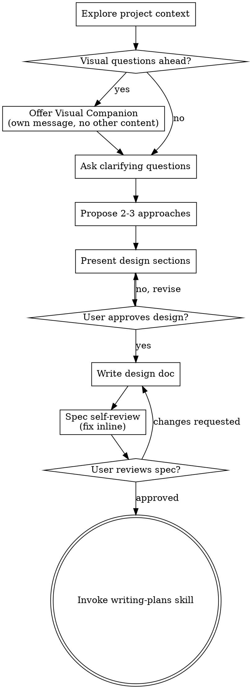
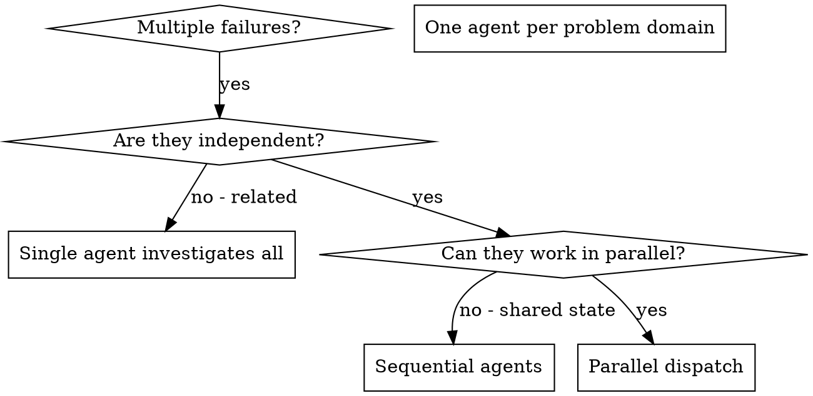

# New session - 2026-05-06T17:04:44.923Z

**Session ID:** ses_201c03c84ffe1MfnriQ81I5a2r
**Created:** 5/6/2026, 7:04:44 PM
**Updated:** 5/6/2026, 9:43:12 PM

---

## User

Enter explore mode. Think deeply. Visualize freely. Follow the conversation wherever it goes.

**IMPORTANT: Explore mode is for thinking, not implementing.** You may read files, search code, and investigate the codebase, but you must NEVER write code or implement features. If the user asks you to implement something, remind them to exit explore mode first and create a change proposal. You MAY create OpenSpec artifacts (proposals, designs, specs) if the user asks—that's capturing thinking, not implementing.

**This is a stance, not a workflow.** There are no fixed steps, no required sequence, no mandatory outputs. You're a thinking partner helping the user explore.

**Input**: The argument after `/opsx-explore` is whatever the user wants to think about. Could be:
- A vague idea: "real-time collaboration"
- A specific problem: "the auth system is getting unwieldy"
- A change name: "add-dark-mode" (to explore in context of that change)
- A comparison: "postgres vs sqlite for this"
- Nothing (just enter explore mode)

---

## The Stance

- **Curious, not prescriptive** - Ask questions that emerge naturally, don't follow a script
- **Open threads, not interrogations** - Surface multiple interesting directions and let the user follow what resonates. Don't funnel them through a single path of questions.
- **Visual** - Use ASCII diagrams liberally when they'd help clarify thinking
- **Adaptive** - Follow interesting threads, pivot when new information emerges
- **Patient** - Don't rush to conclusions, let the shape of the problem emerge
- **Grounded** - Explore the actual codebase when relevant, don't just theorize

---

## What You Might Do

Depending on what the user brings, you might:

**Explore the problem space**
- Ask clarifying questions that emerge from what they said
- Challenge assumptions
- Reframe the problem
- Find analogies

**Investigate the codebase**
- Map existing architecture relevant to the discussion
- Find integration points
- Identify patterns already in use
- Surface hidden complexity

**Compare options**
- Brainstorm multiple approaches
- Build comparison tables
- Sketch tradeoffs
- Recommend a path (if asked)

**Visualize**
```
┌─────────────────────────────────────────┐
│     Use ASCII diagrams liberally        │
├─────────────────────────────────────────┤
│                                         │
│      ┌────────┐         ┌────────┐      │
│      │ State  │────────▶│ State  │      │
│      │   A    │         │   B    │      │
│      └────────┘         └────────┘      │
│                                         │
│   System diagrams, state machines,      │
│   data flows, architecture sketches,    │
│   dependency graphs, comparison tables  │
│                                         │
└─────────────────────────────────────────┘
```

**Surface risks and unknowns**
- Identify what could go wrong
- Find gaps in understanding
- Suggest spikes or investigations

---

## OpenSpec Awareness

You have full context of the OpenSpec system. Use it naturally, don't force it.

### Check for context

At the start, quickly check what exists:
```bash
openspec list --json
```

This tells you:
- If there are active changes
- Their names, schemas, and status
- What the user might be working on

If the user mentioned a specific change name, read its artifacts for context.

### When no change exists

Think freely. When insights crystallize, you might offer:

- "This feels solid enough to start a change. Want me to create a proposal?"
- Or keep exploring - no pressure to formalize

### When a change exists

If the user mentions a change or you detect one is relevant:

1. **Read existing artifacts for context**
   - `openspec/changes/<name>/proposal.md`
   - `openspec/changes/<name>/design.md`
   - `openspec/changes/<name>/tasks.md`
   - etc.

2. **Reference them naturally in conversation**
   - "Your design mentions using Redis, but we just realized SQLite fits better..."
   - "The proposal scopes this to premium users, but we're now thinking everyone..."

3. **Offer to capture when decisions are made**

    | Insight Type               | Where to Capture               |
    |----------------------------|--------------------------------|
    | New requirement discovered | `specs/<capability>/spec.md` |
    | Requirement changed        | `specs/<capability>/spec.md` |
    | Design decision made       | `design.md`                  |
    | Scope changed              | `proposal.md`                |
    | New work identified        | `tasks.md`                   |
    | Assumption invalidated     | Relevant artifact              |

   Example offers:
   - "That's a design decision. Capture it in design.md?"
   - "This is a new requirement. Add it to specs?"
   - "This changes scope. Update the proposal?"

4. **The user decides** - Offer and move on. Don't pressure. Don't auto-capture.

---

## What You Don't Have To Do

- Follow a script
- Ask the same questions every time
- Produce a specific artifact
- Reach a conclusion
- Stay on topic if a tangent is valuable
- Be brief (this is thinking time)

---

## Ending Discovery

There's no required ending. Discovery might:

- **Flow into a proposal**: "Ready to start? I can create a change proposal."
- **Result in artifact updates**: "Updated design.md with these decisions"
- **Just provide clarity**: User has what they need, moves on
- **Continue later**: "We can pick this up anytime"

When things crystallize, you might offer a summary - but it's optional. Sometimes the thinking IS the value.

---

## Guardrails

- **Don't implement** - Never write code or implement features. Creating OpenSpec artifacts is fine, writing application code is not.
- **Don't fake understanding** - If something is unclear, dig deeper
- **Don't rush** - Discovery is thinking time, not task time
- **Don't force structure** - Let patterns emerge naturally
- **Don't auto-capture** - Offer to save insights, don't just do it
- **Do visualize** - A good diagram is worth many paragraphs
- **Do explore the codebase** - Ground discussions in reality
- **Do question assumptions** - Including the user's and your own

Arius.Core is currently riddled with strings everywhere, File.* and Directory.* everywhere.

I want strongly typed types for the arius.core domain

in the branch feat/path-helpers i did a first approach but 1/ i went too far and exposed the types externally and it keeps on rippling through the codebase. i dont want that this time and want to keep them internal with (probably) the existing public strings/contracts and only refactor internally.  See the ADR-0008 for the original intent but it has evolved significantly since. The main types i think i want to introduce are in the Arius.Core.Shared.FileSystem namespace.  2/ i also established the domain model iteratively, but that was not necessarily the best design / best refactor - ideally i want to do a proper design upfront (it can be inspired on the branch as it does make some sense) but i think we can make it better / more pure - perhaps the introduction of a BinaryFile and a PointerFile where a PointerFile is grouping both of them

i may want to see if andrewlock/StronglyTypedId or SteveDunn/Vogen is a fit

in a previous iteration i based it on xoofx/zio but found that to be rather drastic but there were some good designs in it

i want us to explore/design the type system, and with the implementation the goal shoudl be to not stop before every string smell is refactored

---

## Assistant (Build · GPT-5.5 · 2.7s)

**Tool: skill**

**Input:**
```json
{
  "name": "openspec-explore"
}
```

**Output:**
```
<skill_content name="openspec-explore">
# Skill: openspec-explore

Enter explore mode. Think deeply. Visualize freely. Follow the conversation wherever it goes.

**IMPORTANT: Explore mode is for thinking, not implementing.** You may read files, search code, and investigate the codebase, but you must NEVER write code or implement features. If the user asks you to implement something, remind them to exit explore mode first and create a change proposal. You MAY create OpenSpec artifacts (proposals, designs, specs) if the user asks—that's capturing thinking, not implementing.

**This is a stance, not a workflow.** There are no fixed steps, no required sequence, no mandatory outputs. You're a thinking partner helping the user explore.

---

## The Stance

- **Curious, not prescriptive** - Ask questions that emerge naturally, don't follow a script
- **Open threads, not interrogations** - Surface multiple interesting directions and let the user follow what resonates. Don't funnel them through a single path of questions.
- **Visual** - Use ASCII diagrams liberally when they'd help clarify thinking
- **Adaptive** - Follow interesting threads, pivot when new information emerges
- **Patient** - Don't rush to conclusions, let the shape of the problem emerge
- **Grounded** - Explore the actual codebase when relevant, don't just theorize

---

## What You Might Do

Depending on what the user brings, you might:

**Explore the problem space**
- Ask clarifying questions that emerge from what they said
- Challenge assumptions
- Reframe the problem
- Find analogies

**Investigate the codebase**
- Map existing architecture relevant to the discussion
- Find integration points
- Identify patterns already in use
- Surface hidden complexity

**Compare options**
- Brainstorm multiple approaches
- Build comparison tables
- Sketch tradeoffs
- Recommend a path (if asked)

**Visualize**
```
┌─────────────────────────────────────────┐
│     Use ASCII diagrams liberally        │
├─────────────────────────────────────────┤
│                                         │
│      ┌────────┐         ┌────────┐      │
│      │ State  │────────▶│ State  │      │
│      │   A    │         │   B    │      │
│      └────────┘         └────────┘      │
│                                         │
│   System diagrams, state machines,      │
│   data flows, architecture sketches,    │
│   dependency graphs, comparison tables  │
│                                         │
└─────────────────────────────────────────┘
```

**Surface risks and unknowns**
- Identify what could go wrong
- Find gaps in understanding
- Suggest spikes or investigations

---

## OpenSpec Awareness

You have full context of the OpenSpec system. Use it naturally, don't force it.

### Check for context

At the start, quickly check what exists:
```bash
openspec list --json
```

This tells you:
- If there are active changes
- Their names, schemas, and status
- What the user might be working on

### When no change exists

Think freely. When insights crystallize, you might offer:

- "This feels solid enough to start a change. Want me to create a proposal?"
- Or keep exploring - no pressure to formalize

### When a change exists

If the user mentions a change or you detect one is relevant:

1. **Read existing artifacts for context**
   - `openspec/changes/<name>/proposal.md`
   - `openspec/changes/<name>/design.md`
   - `openspec/changes/<name>/tasks.md`
   - etc.

2. **Reference them naturally in conversation**
   - "Your design mentions using Redis, but we just realized SQLite fits better..."
   - "The proposal scopes this to premium users, but we're now thinking everyone..."

3. **Offer to capture when decisions are made**

    | Insight Type               | Where to Capture               |
    |----------------------------|--------------------------------|
    | New requirement discovered | `specs/<capability>/spec.md` |
    | Requirement changed        | `specs/<capability>/spec.md` |
    | Design decision made       | `design.md`                  |
    | Scope changed              | `proposal.md`                |
    | New work identified        | `tasks.md`                   |
    | Assumption invalidated     | Relevant artifact              |

   Example offers:
   - "That's a design decision. Capture it in design.md?"
   - "This is a new requirement. Add it to specs?"
   - "This changes scope. Update the proposal?"

4. **The user decides** - Offer and move on. Don't pressure. Don't auto-capture.

---

## What You Don't Have To Do

- Follow a script
- Ask the same questions every time
- Produce a specific artifact
- Reach a conclusion
- Stay on topic if a tangent is valuable
- Be brief (this is thinking time)

---

## Handling Different Entry Points

**User brings a vague idea:**
```
User: I'm thinking about adding real-time collaboration

You: Real-time collab is a big space. Let me think about this...

      COLLABORATION SPECTRUM
      ════════════════════════════════════════════

      Awareness          Coordination         Sync
          │                   │                 │
          ▼                   ▼                 ▼
      ┌────────┐         ┌────────┐        ┌────────┐
      │Presence│         │Cursors │        │  CRDT  │
      │  "3    │         │ Multi  │        │Conflict│
      │online" │         │ select │        │  free  │
      └────────┘         └────────┘        └────────┘
          │                   │                 │
       trivial            moderate           complex

      Where's your head at?
```

**User brings a specific problem:**
```
User: The auth system is a mess

You: [reads codebase]

     ┌─────────────────────────────────────────────┐
     │              CURRENT AUTH FLOW              │
     └─────────────────────────────────────────────┘
                        │
          ┌─────────────┼─────────────┐
          ▼             ▼             ▼
     ┌─────────┐  ┌─────────┐  ┌─────────┐
     │ Google  │  │  GitHub │  │  Email  │
     │  OAuth  │  │  OAuth  │  │  Magic  │
     └────┬────┘  └────┬────┘  └────┬────┘
          │             │             │
          └─────────────┼─────────────┘
                        ▼
                  ┌───────────┐
                  │  Session  │
                  └─────┬─────┘
                        │
                        ▼
                  ┌───────────┐
                  │   Perms   │
                  └───────────┘

     I see three tangles. Which one's burning?
```

**User is stuck mid-implementation:**
```
User: /opsx-explore add-auth-system
      The OAuth integration is more complex than expected

You: [reads change artifacts]

     You're on task 4: "Implement OAuth flow"

     Let me trace what's involved...

     [draws diagram, explores options, suggests paths]

     Want to update the design to reflect this?
     Or add a spike task to investigate?
```

**User wants to compare options:**
```
User: Should we use Postgres or SQLite?

You: Generic answer is boring. What's the context?

User: A CLI tool that tracks local dev environments

You: That changes everything.

     ┌─────────────────────────────────────────────────┐
     │          CLI TOOL DATA STORAGE                  │
     └─────────────────────────────────────────────────┘

     Key constraints:
     • No daemon running
     • Must work offline
     • Single user

                  SQLite          Postgres
     Deployment   embedded ✓      needs server ✗
     Offline      yes ✓           no ✗
     Single file  yes ✓           no ✗

     SQLite. Not even close.

     Unless... is there a sync component?
```

---

## Ending Discovery

There's no required ending. Discovery might:

- **Flow into a proposal**: "Ready to start? I can create a change proposal."
- **Result in artifact updates**: "Updated design.md with these decisions"
- **Just provide clarity**: User has what they need, moves on
- **Continue later**: "We can pick this up anytime"

When it feels like things are crystallizing, you might summarize:

```
## What We Figured Out

**The problem**: [crystallized understanding]

**The approach**: [if one emerged]

**Open questions**: [if any remain]

**Next steps** (if ready):
- Create a change proposal
- Keep exploring: just keep talking
```

But this summary is optional. Sometimes the thinking IS the value.

---

## Guardrails

- **Don't implement** - Never write code or implement features. Creating OpenSpec artifacts is fine, writing application code is not.
- **Don't fake understanding** - If something is unclear, dig deeper
- **Don't rush** - Discovery is thinking time, not task time
- **Don't force structure** - Let patterns emerge naturally
- **Don't auto-capture** - Offer to save insights, don't just do it
- **Do visualize** - A good diagram is worth many paragraphs
- **Do explore the codebase** - Ground discussions in reality
- **Do question assumptions** - Including the user's and your own

Base directory for this skill: file:///Users/wouter/.superset/worktrees/Arius7/feat/path-helpers2/.opencode/skills/openspec-explore
Relative paths in this skill (e.g., scripts/, reference/) are relative to this base directory.
Note: file list is sampled.

<skill_files>

</skill_files>
</skill_content>
```

---

## Assistant (Build · GPT-5.5 · 5.4s)

Using `openspec-explore` to stay in design/exploration mode only. I’ll first ground this in the current OpenSpec context plus ADR/code shape, without editing application code.

**Tool: bash**

**Input:**
```json
{
  "command": "openspec list --json",
  "workdir": "/Users/wouter/.superset/worktrees/Arius7/feat/path-helpers2",
  "description": "Lists active OpenSpec changes as JSON"
}
```

**Output:**
```
{
  "changes": [
    {
      "name": "parallel-flush-and-tree-upload",
      "completedTasks": 0,
      "totalTasks": 0,
      "lastModified": "2026-05-06T16:53:13.677Z",
      "status": "no-tasks"
    },
    {
      "name": "chunk-index-prefix-strategy",
      "completedTasks": 0,
      "totalTasks": 0,
      "lastModified": "2026-05-06T16:53:13.676Z",
      "status": "no-tasks"
    }
  ]
}

```

**Tool: glob**

**Input:**
```json
{
  "pattern": "**/ADR-0008*",
  "path": "/Users/wouter/.superset/worktrees/Arius7/feat/path-helpers2"
}
```

**Output:**
```
No files found
```

**Tool: glob**

**Input:**
```json
{
  "pattern": "src/Arius.Core/**/*.cs",
  "path": "/Users/wouter/.superset/worktrees/Arius7/feat/path-helpers2"
}
```

**Output:**
```
/Users/wouter/.superset/worktrees/Arius7/feat/path-helpers2/src/Arius.Core/Shared/Streaming/ProgressStream.cs
/Users/wouter/.superset/worktrees/Arius7/feat/path-helpers2/src/Arius.Core/Shared/LocalFile/LocalFileEnumerator.cs
/Users/wouter/.superset/worktrees/Arius7/feat/path-helpers2/src/Arius.Core/Shared/Streaming/CountingStream.cs
/Users/wouter/.superset/worktrees/Arius7/feat/path-helpers2/src/Arius.Core/Shared/Storage/IBlobService.cs
/Users/wouter/.superset/worktrees/Arius7/feat/path-helpers2/src/Arius.Core/Shared/Storage/Preflight.cs
/Users/wouter/.superset/worktrees/Arius7/feat/path-helpers2/src/Arius.Core/Shared/Storage/BlobConstants.cs
/Users/wouter/.superset/worktrees/Arius7/feat/path-helpers2/src/Arius.Core/Shared/Storage/IBlobServiceFactory.cs
/Users/wouter/.superset/worktrees/Arius7/feat/path-helpers2/src/Arius.Core/Shared/Storage/IBlobContainerService.cs
/Users/wouter/.superset/worktrees/Arius7/feat/path-helpers2/src/Arius.Core/Shared/RepositoryPaths.cs
/Users/wouter/.superset/worktrees/Arius7/feat/path-helpers2/src/Arius.Core/Shared/Snapshot/SnapshotService.cs
/Users/wouter/.superset/worktrees/Arius7/feat/path-helpers2/src/Arius.Core/Shared/IEnumerableExtensions.cs
/Users/wouter/.superset/worktrees/Arius7/feat/path-helpers2/src/Arius.Core/Shared/Hashes/ContentHash.cs
/Users/wouter/.superset/worktrees/Arius7/feat/path-helpers2/src/Arius.Core/Shared/Hashes/HashCodec.cs
/Users/wouter/.superset/worktrees/Arius7/feat/path-helpers2/src/Arius.Core/Shared/Hashes/FileTreeHash.cs
/Users/wouter/.superset/worktrees/Arius7/feat/path-helpers2/src/Arius.Core/Shared/Hashes/ChunkHash.cs
/Users/wouter/.superset/worktrees/Arius7/feat/path-helpers2/src/Arius.Core/Shared/FileTree/FileTreeStagingWriter.cs
/Users/wouter/.superset/worktrees/Arius7/feat/path-helpers2/src/Arius.Core/Shared/FileTree/FileTreeStagingSession.cs
/Users/wouter/.superset/worktrees/Arius7/feat/path-helpers2/src/Arius.Core/Shared/FileTree/FileTreeBuilder.cs
/Users/wouter/.superset/worktrees/Arius7/feat/path-helpers2/src/Arius.Core/Shared/FileTree/FileTreePaths.cs
/Users/wouter/.superset/worktrees/Arius7/feat/path-helpers2/src/Arius.Core/Shared/FileTree/FileTreeSerializer.cs
/Users/wouter/.superset/worktrees/Arius7/feat/path-helpers2/src/Arius.Core/Shared/FileTree/FileTreeModels.cs
/Users/wouter/.superset/worktrees/Arius7/feat/path-helpers2/src/Arius.Core/Shared/FileTree/FileTreeService.cs
/Users/wouter/.superset/worktrees/Arius7/feat/path-helpers2/src/Arius.Core/Shared/ChunkStorage/IRehydratedChunkCleanupPlan.cs
/Users/wouter/.superset/worktrees/Arius7/feat/path-helpers2/src/Arius.Core/Shared/ChunkStorage/IChunkStorageService.cs
/Users/wouter/.superset/worktrees/Arius7/feat/path-helpers2/src/Arius.Core/Shared/ChunkStorage/ChunkUploadResult.cs
/Users/wouter/.superset/worktrees/Arius7/feat/path-helpers2/src/Arius.Core/Shared/ChunkStorage/RehydratedChunkCleanupResult.cs
/Users/wouter/.superset/worktrees/Arius7/feat/path-helpers2/src/Arius.Core/Shared/ChunkStorage/ChunkStorageService.cs
/Users/wouter/.superset/worktrees/Arius7/feat/path-helpers2/src/Arius.Core/Shared/Encryption/PlaintextPassthroughService.cs
/Users/wouter/.superset/worktrees/Arius7/feat/path-helpers2/src/Arius.Core/Shared/Encryption/PassphraseEncryptionService.cs
/Users/wouter/.superset/worktrees/Arius7/feat/path-helpers2/src/Arius.Core/Shared/Encryption/IEncryptionService.cs
/Users/wouter/.superset/worktrees/Arius7/feat/path-helpers2/src/Arius.Core/ServiceCollectionExtensions.cs
/Users/wouter/.superset/worktrees/Arius7/feat/path-helpers2/src/Arius.Core/Shared/ChunkIndex/ChunkIndexService.cs
/Users/wouter/.superset/worktrees/Arius7/feat/path-helpers2/src/Arius.Core/Shared/ChunkIndex/Shard.cs
/Users/wouter/.superset/worktrees/Arius7/feat/path-helpers2/src/Arius.Core/Shared/ChunkIndex/ShardSerializer.cs
/Users/wouter/.superset/worktrees/Arius7/feat/path-helpers2/src/Arius.Core/Shared/ChunkStorage/ChunkHydrationStatus.cs
/Users/wouter/.superset/worktrees/Arius7/feat/path-helpers2/src/Arius.Core/Features/ListQuery/ListQueryHandler.cs
/Users/wouter/.superset/worktrees/Arius7/feat/path-helpers2/src/Arius.Core/Features/RestoreCommand/RestoreCommandHandler.cs
/Users/wouter/.superset/worktrees/Arius7/feat/path-helpers2/src/Arius.Core/Features/RestoreCommand/RestoreCostCalculator.cs
/Users/wouter/.superset/worktrees/Arius7/feat/path-helpers2/src/Arius.Core/Features/RestoreCommand/Models.cs
/Users/wouter/.superset/worktrees/Arius7/feat/path-helpers2/src/Arius.Core/Features/RestoreCommand/RestoreCommand.cs
/Users/wouter/.superset/worktrees/Arius7/feat/path-helpers2/src/Arius.Core/Features/RestoreCommand/PricingConfig.cs
/Users/wouter/.superset/worktrees/Arius7/feat/path-helpers2/src/Arius.Core/Features/RestoreCommand/Events.cs
/Users/wouter/.superset/worktrees/Arius7/feat/path-helpers2/src/Arius.Core/AssemblyMarker.cs
/Users/wouter/.superset/worktrees/Arius7/feat/path-helpers2/src/Arius.Core/Features/ListQuery/ListQuery.cs
/Users/wouter/.superset/worktrees/Arius7/feat/path-helpers2/src/Arius.Core/Features/ContainerNamesQuery/ContainerNamesQuery.cs
/Users/wouter/.superset/worktrees/Arius7/feat/path-helpers2/src/Arius.Core/Features/ArchiveCommand/ArchiveCommandHandler.cs
/Users/wouter/.superset/worktrees/Arius7/feat/path-helpers2/src/Arius.Core/Features/ArchiveCommand/Models.cs
/Users/wouter/.superset/worktrees/Arius7/feat/path-helpers2/src/Arius.Core/Features/ArchiveCommand/ArchiveCommand.cs
/Users/wouter/.superset/worktrees/Arius7/feat/path-helpers2/src/Arius.Core/Features/ArchiveCommand/Events.cs
/Users/wouter/.superset/worktrees/Arius7/feat/path-helpers2/src/Arius.Core/Features/ChunkHydrationStatusQuery/ChunkHydrationStatusQuery.cs
```

**Tool: grep**

**Input:**
```json
{
  "pattern": "\\b(File|Directory)\\.",
  "path": "/Users/wouter/.superset/worktrees/Arius7/feat/path-helpers2/src/Arius.Core",
  "include": "*.cs"
}
```

**Output:**
```
Found 82 matches
/Users/wouter/.superset/worktrees/Arius7/feat/path-helpers2/src/Arius.Core/Shared/LocalFile/LocalFileEnumerator.cs:
  Line 78:     /// When a binary file is encountered, <see cref="File.Exists"/> is used to check for
  Line 96:                 if (File.Exists(binaryFileFullPath))
  Line 114:                 // Binary file: check for pointer via File.Exists
  Line 117:                 var hasPointer  = File.Exists(pointerPath);
  Line 144:             var content = File.ReadAllText(fullPath).Trim();

/Users/wouter/.superset/worktrees/Arius7/feat/path-helpers2/src/Arius.Core/Shared/Snapshot/SnapshotService.cs:
  Line 139:         Directory.CreateDirectory(_diskCacheDir);
  Line 256:         if (File.Exists(localPath))
  Line 258:             var json = await File.ReadAllBytesAsync(localPath, cancellationToken);
  Line 276:         await File.WriteAllBytesAsync(path, json, cancellationToken);

/Users/wouter/.superset/worktrees/Arius7/feat/path-helpers2/src/Arius.Core/Shared/FileTree/FileTreeBuilder.cs:
  Line 138:             if (!File.Exists(path))
  Line 141:             await foreach (var line in File.ReadLinesAsync(path, ct))

/Users/wouter/.superset/worktrees/Arius7/feat/path-helpers2/src/Arius.Core/Shared/FileTree/FileTreeStagingWriter.cs:
  Line 109:             Directory.CreateDirectory(_stagingRoot);
  Line 111:             await File.AppendAllLinesAsync(path, [line], cancellationToken);

/Users/wouter/.superset/worktrees/Arius7/feat/path-helpers2/src/Arius.Core/Shared/FileTree/FileTreeStagingSession.cs:
  Line 25:         Directory.CreateDirectory(fileTreeCacheDirectory);
  Line 42:             if (Directory.Exists(stagingRoot))
  Line 43:                 Directory.Delete(stagingRoot, recursive: true);
  Line 45:             Directory.CreateDirectory(stagingRoot);
  Line 59:             if (Directory.Exists(StagingRoot))
  Line 60:                 Directory.Delete(StagingRoot, recursive: true);

/Users/wouter/.superset/worktrees/Arius7/feat/path-helpers2/src/Arius.Core/Shared/FileTree/FileTreeService.cs:
  Line 23: ///     always a <c>File.Exists</c> check on both fast and slow paths.</item>
  Line 63:         Directory.CreateDirectory(_diskCacheDir);
  Line 118:             if (!File.Exists(diskPath))
  Line 123:                 var cached = File.ReadAllBytes(diskPath);
  Line 135:                     try { File.Delete(diskPath); } catch { /* best-effort */ }
  Line 225:         Directory.CreateDirectory(Path.GetDirectoryName(diskPath)!);
  Line 230:             await File.WriteAllBytesAsync(tempPath, plaintext.ToArray(), cancellationToken);
  Line 234:             if (OperatingSystem.IsWindows() && File.Exists(diskPath))
  Line 235:                 File.Replace(tempPath, diskPath, destinationBackupFileName: null, ignoreMetadataErrors: true);
  Line 237:                 File.Move(tempPath, diskPath, overwrite: true);
  Line 243:                 if (File.Exists(tempPath))
  Line 244:                     File.Delete(tempPath);
  Line 276:         var latestLocal = Directory.Exists(_snapshotsDir)
  Line 277:             ? Directory.EnumerateFiles(_snapshotsDir)
  Line 316:         //   any uncached remote trees now so ExistsInRemote() can stay a cheap local File.Exists()
  Line 323:             if (!File.Exists(diskPath))
  Line 326:                 await File.WriteAllBytesAsync(diskPath, [], cancellationToken);
  Line 331:         if (Directory.Exists(_chunkIndexL2Dir))
  Line 333:             foreach (var file in Directory.EnumerateFiles(_chunkIndexL2Dir))
  Line 335:                 try { File.Delete(file); } catch { /* ignore individual failures */ }
  Line 350:     /// is always a plain <see cref="File.Exists"/> check — empty marker files represent remote
  Line 359:         return File.Exists(FileTreePaths.GetCachePath(_diskCacheDir, hash));

/Users/wouter/.superset/worktrees/Arius7/feat/path-helpers2/src/Arius.Core/Shared/Encryption/PlaintextPassthroughService.cs:
  Line 54:         await using var file = File.OpenRead(filePath);

/Users/wouter/.superset/worktrees/Arius7/feat/path-helpers2/src/Arius.Core/Shared/Encryption/PassphraseEncryptionService.cs:
  Line 133:         await using var file = File.OpenRead(filePath);

/Users/wouter/.superset/worktrees/Arius7/feat/path-helpers2/src/Arius.Core/Shared/ChunkIndex/ChunkIndexService.cs:
  Line 75:         Directory.CreateDirectory(_l2Dir);
  Line 201:         if (File.Exists(l2Path))
  Line 205:                 var bytes = await File.ReadAllBytesAsync(l2Path, cancellationToken);
  Line 213:                 File.Delete(l2Path);
  Line 275:         File.WriteAllBytes(path, bytes);

/Users/wouter/.superset/worktrees/Arius7/feat/path-helpers2/src/Arius.Core/Features/ListQuery/ListQueryHandler.cs:
  Line 271:             localDirectory = Directory.Exists(candidate) ? candidate : null;
  Line 279:         if (localDir is null || !Directory.Exists(localDir))
  Line 315:                 if (File.Exists(binaryPath))
  Line 332:                 var hasPointer = File.Exists(pointerPath);
  Line 351:             var content = File.ReadAllText(fullPath).Trim();

/Users/wouter/.superset/worktrees/Arius7/feat/path-helpers2/src/Arius.Core/Features/RestoreCommand/PricingConfig.cs:
  Line 82:         var cwdPath = Path.Combine(Directory.GetCurrentDirectory(), "pricing.json");
  Line 83:         if (File.Exists(cwdPath))
  Line 89:         if (File.Exists(ariusPath))
  Line 100:             using var fs     = File.OpenRead(path);

/Users/wouter/.superset/worktrees/Arius7/feat/path-helpers2/src/Arius.Core/Features/RestoreCommand/RestoreCommandHandler.cs:
  Line 133:                 if (File.Exists(localPath))
  Line 138:                         await using var fs = File.OpenRead(localPath);
  Line 577:         Directory.CreateDirectory(Path.GetDirectoryName(localPath)!);
  Line 588:         File.SetCreationTimeUtc(localPath,  file.Created.UtcDateTime);
  Line 589:         File.SetLastWriteTimeUtc(localPath, file.Modified.UtcDateTime);
  Line 595:             await File.WriteAllTextAsync(pointerPath, file.ContentHash.ToString(), cancellationToken);
  Line 596:             File.SetCreationTimeUtc(pointerPath,  file.Created.UtcDateTime);
  Line 597:             File.SetLastWriteTimeUtc(pointerPath, file.Modified.UtcDateTime);
  Line 644:                 Directory.CreateDirectory(Path.GetDirectoryName(localPath)!);
  Line 649:                     await using var _ = File.Create(localPath);
  Line 660:                     File.Copy(sourcePath!, localPath, overwrite: true);
  Line 664:                 File.SetCreationTimeUtc(localPath,  file.Created.UtcDateTime);
  Line 665:                 File.SetLastWriteTimeUtc(localPath, file.Modified.UtcDateTime);
  Line 671:                     await File.WriteAllTextAsync(pointerPath, contentHash.ToString(), cancellationToken);
  Line 672:                     File.SetCreationTimeUtc(pointerPath,  file.Created.UtcDateTime);
  Line 673:                     File.SetLastWriteTimeUtc(pointerPath, file.Modified.UtcDateTime);

/Users/wouter/.superset/worktrees/Arius7/feat/path-helpers2/src/Arius.Core/Features/ArchiveCommand/ArchiveCommandHandler.cs:
  Line 221:                         var fileSize = fullPath is not null && File.Exists(fullPath) ? new FileInfo(fullPath).Length : 0L;
  Line 259:                             await using var fs           = File.OpenRead(fullBinaryPath!);
  Line 354:                     await using var fs             = File.OpenRead(fullPath);
  Line 399:                         await using (var fs = File.OpenRead(currentTarPath!))
  Line 434:                         await using (var fs = File.OpenRead(fullPath))
  Line 472:                         await using var fs             = File.OpenRead(sealed_.TarFilePath);
  Line 505:                         try { File.Delete(sealed_.TarFilePath); } catch { /* ignore */ }
  Line 562:                     await File.WriteAllTextAsync(pointerPath, hash.ToString(), ct);
  Line 574:                         File.Delete(path);
```

**Tool: grep**

**Input:**
```json
{
  "pattern": "class .*Path|record .*Path|struct .*Path|namespace .*FileSystem|ContentHash|FilePair|PointerFile|BinaryFile",
  "path": "/Users/wouter/.superset/worktrees/Arius7/feat/path-helpers2/src/Arius.Core",
  "include": "*.cs"
}
```

**Output:**
```
Found 176 matches (showing first 100)
/Users/wouter/.superset/worktrees/Arius7/feat/path-helpers2/src/Arius.Core/Shared/LocalFile/LocalFileEnumerator.cs:
  Line 6: // ── Task 7.1: FilePair model ───────────────────────────────────────────────────
  Line 11: /// Each <see cref="FilePair"/> has exactly one of:
  Line 18: public sealed record FilePair
  Line 36:     public          ContentHash? PointerHash { get; init; }
  Line 51: /// Enumerates local files and assembles <see cref="FilePair"/> objects.
  Line 75:     /// Enumerates all <see cref="FilePair"/> objects under <paramref name="rootDirectory"/>
  Line 84:     public IEnumerable<FilePair> Enumerate(string rootDirectory)
  Line 93:                 var binaryFileRelativeName  = relativeName[..^PointerSuffix.Length]; // infer the BinaryFile relative name from the pointer file name
  Line 97:                     continue; // binary was/will be emitted as part of the binary's FilePair
  Line 101:                 yield return new FilePair
  Line 118:                 ContentHash? pointerHash = null;
  Line 123:                 yield return new FilePair
  Line 125:                     RelativePath  = relativeName, // this will be the relative name of the BinaryFile
  Line 140:     private ContentHash? ReadPointerHash(string fullPath, string relPath)
  Line 145:             if (!ContentHash.TryParse(content, out var hash))

/Users/wouter/.superset/worktrees/Arius7/feat/path-helpers2/src/Arius.Core/Shared/RepositoryPaths.cs:
  Line 12: public static class RepositoryPaths

/Users/wouter/.superset/worktrees/Arius7/feat/path-helpers2/src/Arius.Core/Shared/Storage/BlobConstants.cs:
  Line 70: public static class BlobPaths
  Line 88:     public static string ThinChunk(ContentHash hash)     => $"{Chunks}{hash}";

/Users/wouter/.superset/worktrees/Arius7/feat/path-helpers2/src/Arius.Core/Shared/Hashes/ContentHash.cs:
  Line 3: public readonly record struct ContentHash
  Line 5:     private ContentHash(string value)
  Line 15:     private string Value => field ?? throw new InvalidOperationException("ContentHash is uninitialized.");
  Line 17:     public static ContentHash Parse(string value) => new(HashCodec.NormalizeHex(value));
  Line 19:     public static ContentHash Parse(ChunkHash value) => new(value.ToString());
  Line 21:     public static bool TryParse(string? value, out ContentHash hash)
  Line 41:     public static ContentHash FromDigest(ReadOnlySpan<byte> digest) => new(HashCodec.ToLowerHex(digest));

/Users/wouter/.superset/worktrees/Arius7/feat/path-helpers2/src/Arius.Core/Shared/Hashes/FileTreeHash.cs:
  Line 19:     public static FileTreeHash Parse(ContentHash value) => new(value.ToString());

/Users/wouter/.superset/worktrees/Arius7/feat/path-helpers2/src/Arius.Core/Shared/Hashes/ChunkHash.cs:
  Line 19:     public static ChunkHash Parse(ContentHash value) => new(value.ToString());

/Users/wouter/.superset/worktrees/Arius7/feat/path-helpers2/src/Arius.Core/Shared/FileTree/FileTreeStagingWriter.cs:
  Line 24:         ContentHash contentHash,
  Line 48:             ContentHash = contentHash,

/Users/wouter/.superset/worktrees/Arius7/feat/path-helpers2/src/Arius.Core/Shared/FileTree/FileTreePaths.cs:
  Line 10: internal static class FileTreePaths

/Users/wouter/.superset/worktrees/Arius7/feat/path-helpers2/src/Arius.Core/Shared/FileTree/FileTreeSerializer.cs:
  Line 45:     public static string SerializePersistedFileEntryLine(FileEntry entry) => $"{entry.ContentHash} F {entry.Created:O} {entry.Modified:O} {entry.Name}";
  Line 222:         if (!ContentHash.TryParse(hash, out var contentHash))
  Line 227:             ContentHash = contentHash,

/Users/wouter/.superset/worktrees/Arius7/feat/path-helpers2/src/Arius.Core/Shared/FileTree/FileTreeModels.cs:
  Line 19:     public required ContentHash ContentHash { get; init; }

/Users/wouter/.superset/worktrees/Arius7/feat/path-helpers2/src/Arius.Core/Shared/ChunkStorage/IChunkStorageService.cs:
  Line 38:         ContentHash contentHash,

/Users/wouter/.superset/worktrees/Arius7/feat/path-helpers2/src/Arius.Core/Shared/ChunkStorage/ChunkStorageService.cs:
  Line 55:         ContentHash contentHash,
  Line 169:         ContentHash contentHash,

/Users/wouter/.superset/worktrees/Arius7/feat/path-helpers2/src/Arius.Core/Shared/Encryption/PlaintextPassthroughService.cs:
  Line 34:     public ContentHash ComputeHash(ReadOnlySpan<byte> data)
  Line 36:         return ContentHash.FromDigest(SHA256.HashData(data));
  Line 40:     public async Task<ContentHash> ComputeHashAsync(Stream data, CancellationToken cancellationToken = default)
  Line 43:         return ContentHash.FromDigest(await SHA256.HashDataAsync(data, cancellationToken));
  Line 47:     public async Task<ContentHash> ComputeHashAsync(

/Users/wouter/.superset/worktrees/Arius7/feat/path-helpers2/src/Arius.Core/Shared/Encryption/PassphraseEncryptionService.cs:
  Line 94:     public ContentHash ComputeHash(ReadOnlySpan<byte> data)
  Line 100:         return ContentHash.FromDigest(sha.GetHashAndReset());
  Line 104:     public async Task<ContentHash> ComputeHashAsync(Stream data, CancellationToken cancellationToken = default)
  Line 122:         return ContentHash.FromDigest(sha.GetHashAndReset());
  Line 126:     public async Task<ContentHash> ComputeHashAsync(

/Users/wouter/.superset/worktrees/Arius7/feat/path-helpers2/src/Arius.Core/Shared/Encryption/IEncryptionService.cs:
  Line 37:     ContentHash ComputeHash(ReadOnlySpan<byte> data);
  Line 43:     Task<ContentHash> ComputeHashAsync(Stream data, CancellationToken cancellationToken = default);
  Line 49:     Task<ContentHash> ComputeHashAsync(

/Users/wouter/.superset/worktrees/Arius7/feat/path-helpers2/src/Arius.Core/Shared/ChunkIndex/ChunkIndexService.cs:
  Line 46:     private readonly ConcurrentDictionary<ContentHash, ShardEntry> _inFlight = [];
  Line 85:     public async Task<IReadOnlyDictionary<ContentHash, ShardEntry>> LookupAsync(IEnumerable<ContentHash> contentHashes, CancellationToken cancellationToken = default)
  Line 87:         var result = new Dictionary<ContentHash, ShardEntry>();
  Line 90:         var remaining = new List<ContentHash>();
  Line 117:     public async Task<ShardEntry?> LookupAsync(ContentHash contentHash, CancellationToken cancellationToken = default)
  Line 131:         _inFlight[entry.ContentHash] = entry;
  Line 147:         var byPrefix = _pendingEntries.GroupBy(e => Shard.PrefixOf(e.ContentHash));

/Users/wouter/.superset/worktrees/Arius7/feat/path-helpers2/src/Arius.Core/Shared/ChunkIndex/Shard.cs:
  Line 12: public sealed record ShardEntry(ContentHash ContentHash, ChunkHash ChunkHash, long OriginalSize, long CompressedSize)
  Line 14:     public bool IsLargeChunk => ChunkHash.Parse(ContentHash) == ChunkHash;
  Line 20:     /// Emits 3 fields when <see cref="ContentHash"/> == <see cref="ChunkHash"/> (large file),
  Line 25:             ? $"{ContentHash} {OriginalSize} {CompressedSize}"
  Line 26:             : $"{ContentHash} {ChunkHash} {OriginalSize} {CompressedSize}";
  Line 42:                 ContentHash:    ContentHash.Parse(parts[0]),
  Line 47:                 ContentHash:    ContentHash.Parse(parts[0]),
  Line 61:     private readonly Dictionary<ContentHash, ShardEntry> _entries;
  Line 65:     private Shard(Dictionary<ContentHash, ShardEntry> entries) => _entries = entries;
  Line 71:     public bool TryLookup(ContentHash contentHash, out ShardEntry? entry) => _entries.TryGetValue(contentHash, out entry);
  Line 82:         var combined = new Dictionary<ContentHash, ShardEntry>(_entries);
  Line 85:             combined[e.ContentHash] = e;
  Line 95:         foreach (var entry in _entries.Values.OrderBy(e => e.ContentHash.ToString(), StringComparer.Ordinal))
  Line 104:         var entries = new Dictionary<ContentHash, ShardEntry>();
  Line 109:                 entries[entry.ContentHash] = entry;
  Line 121:     public static string PrefixOf(ContentHash contentHash) => contentHash.Prefix4;

/Users/wouter/.superset/worktrees/Arius7/feat/path-helpers2/src/Arius.Core/Features/ListQuery/ListQueryHandler.cs:
  Line 158:             .Select(candidate => candidate.Entry.ContentHash)
  Line 162:             ? new Dictionary<ContentHash, ShardEntry>()
  Line 163:             : new Dictionary<ContentHash, ShardEntry>(await _index.LookupAsync(hashes, cancellationToken));
  Line 175:             if (sizeLookup.TryGetValue(candidate.Entry.ContentHash, out var shardEntry))
  Line 180:                 ContentHash: candidate.Entry.ContentHash,
  Line 186:                 HasPointerFile: localFile?.PointerExists,
  Line 201:                 ContentHash: null,
  Line 207:                 HasPointerFile: localFile.PointerExists,
  Line 347:     private ContentHash? ReadPointerHash(string fullPath, string relPath)
  Line 352:             if (!ContentHash.TryParse(content, out var hash))
  Line 395:     private sealed record LocalDirectoryState(string Name, string FullPath);
  Line 401:         ContentHash? PointerHash,

/Users/wouter/.superset/worktrees/Arius7/feat/path-helpers2/src/Arius.Core/Features/RestoreCommand/RestoreCommandHandler.cs:
  Line 141:                         if (localHash == file.ContentHash)
  Line 183:                 .Select(file => file.ContentHash)
  Line 194:                 if (!indexEntries.TryGetValue(file.ContentHash, out var entry))
  Line 196:                     _logger.LogWarning("Content hash not found in index, skipping: {Hash} ({Path})", file.ContentHash, file.RelativePath);
  Line 206:             var largeChunks = filesByChunkHash.Keys.Count(k => indexEntries.TryGetValue(filesByChunkHash[k][0].ContentHash, out var entry) && entry.IsLargeChunk);
  Line 218:                 if (indexEntries.TryGetValue(firstFile.ContentHash, out var ie2))
  Line 230:                             if (indexEntries.TryGetValue(file.ContentHash, out var fileEntry))
  Line 285:                 if (!indexEntries.TryGetValue(firstFile.ContentHash, out var ie))
  Line 296:                     if (indexEntries.TryGetValue(file.ContentHash, out var fileEntry))
  Line 350:                     if (!indexEntries.TryGetValue(firstFile.ContentHash, out var indexEntry))
  Line 360:                         : filesForChunk.Sum(f => indexEntries.TryGetValue(f.ContentHash, out var e) ? e.CompressedSize : 0);
  Line 363:                         : filesForChunk.Sum(f => indexEntries.TryGetValue(f.ContentHash, out var e) ? e.OriginalSize : 0);
  Line 381:                         var filesByContentHash = filesForChunk
  Line 382:                             .GroupBy(f => f.ContentHash)
  Line 385:                             chunkHash, filesByContentHash, opts, compressedSize, ct);

(Results truncated: showing 100 of 176 matches (76 hidden). Consider using a more specific path or pattern.)
```

---

## Assistant (Build · GPT-5.5 · 13.6s)

_Thinking:_

**Considering creative workflow**

I need to think about how to balance the brainstorming phase with the explicit explore mode the user mentioned. Since we loaded openspec-explore, we’re clearly in exploration territory, but it seems like brainstorming might also be important before diving into creative work. I wonder if I should load that skill now, along with others like modern-csharp or type-design-performance. That could help us move forward effectively while respecting the user’s request. Let’s see if we can integrate these skills smoothly!

_Thinking:_

**Reading skill content**

I realize I need to access and read the content of the modern C# skill to better understand how it fits into our current tasks. This could help me integrate it effectively within our workflow. By grasping the key concepts and guidelines from this skill, I'll be able to utilize it properly when designing or exploring systems. Let's ensure I'm fully prepared before moving forward with the user’s requests. Okay, time to dive into that content!

**Tool: skill**

**Input:**
```json
{
  "name": "brainstorming"
}
```

**Output:**
```
<skill_content name="brainstorming">
# Skill: brainstorming

# Brainstorming Ideas Into Designs

Help turn ideas into fully formed designs and specs through natural collaborative dialogue.

Start by understanding the current project context, then ask questions one at a time to refine the idea. Once you understand what you're building, present the design and get user approval.

<HARD-GATE>
Do NOT invoke any implementation skill, write any code, scaffold any project, or take any implementation action until you have presented a design and the user has approved it. This applies to EVERY project regardless of perceived simplicity.
</HARD-GATE>

## Anti-Pattern: "This Is Too Simple To Need A Design"

Every project goes through this process. A todo list, a single-function utility, a config change — all of them. "Simple" projects are where unexamined assumptions cause the most wasted work. The design can be short (a few sentences for truly simple projects), but you MUST present it and get approval.

## Checklist

You MUST create a task for each of these items and complete them in order:

1. **Explore project context** — check files, docs, recent commits
2. **Offer visual companion** (if topic will involve visual questions) — this is its own message, not combined with a clarifying question. See the Visual Companion section below.
3. **Ask clarifying questions** — one at a time, understand purpose/constraints/success criteria
4. **Propose 2-3 approaches** — with trade-offs and your recommendation
5. **Present design** — in sections scaled to their complexity, get user approval after each section
6. **Write design doc** — save to `docs/superpowers/specs/YYYY-MM-DD-<topic>-design.md` and commit
7. **Spec self-review** — quick inline check for placeholders, contradictions, ambiguity, scope (see below)
8. **User reviews written spec** — ask user to review the spec file before proceeding
9. **Transition to implementation** — invoke writing-plans skill to create implementation plan

## Process Flow



**The terminal state is invoking writing-plans.** Do NOT invoke frontend-design, mcp-builder, or any other implementation skill. The ONLY skill you invoke after brainstorming is writing-plans.

## The Process

**Understanding the idea:**

- Check out the current project state first (files, docs, recent commits)
- Before asking detailed questions, assess scope: if the request describes multiple independent subsystems (e.g., "build a platform with chat, file storage, billing, and analytics"), flag this immediately. Don't spend questions refining details of a project that needs to be decomposed first.
- If the project is too large for a single spec, help the user decompose into sub-projects: what are the independent pieces, how do they relate, what order should they be built? Then brainstorm the first sub-project through the normal design flow. Each sub-project gets its own spec → plan → implementation cycle.
- For appropriately-scoped projects, ask questions one at a time to refine the idea
- Prefer multiple choice questions when possible, but open-ended is fine too
- Only one question per message - if a topic needs more exploration, break it into multiple questions
- Focus on understanding: purpose, constraints, success criteria

**Exploring approaches:**

- Propose 2-3 different approaches with trade-offs
- Present options conversationally with your recommendation and reasoning
- Lead with your recommended option and explain why

**Presenting the design:**

- Once you believe you understand what you're building, present the design
- Scale each section to its complexity: a few sentences if straightforward, up to 200-300 words if nuanced
- Ask after each section whether it looks right so far
- Cover: architecture, components, data flow, error handling, testing
- Be ready to go back and clarify if something doesn't make sense

**Design for isolation and clarity:**

- Break the system into smaller units that each have one clear purpose, communicate through well-defined interfaces, and can be understood and tested independently
- For each unit, you should be able to answer: what does it do, how do you use it, and what does it depend on?
- Can someone understand what a unit does without reading its internals? Can you change the internals without breaking consumers? If not, the boundaries need work.
- Smaller, well-bounded units are also easier for you to work with - you reason better about code you can hold in context at once, and your edits are more reliable when files are focused. When a file grows large, that's often a signal that it's doing too much.

**Working in existing codebases:**

- Explore the current structure before proposing changes. Follow existing patterns.
- Where existing code has problems that affect the work (e.g., a file that's grown too large, unclear boundaries, tangled responsibilities), include targeted improvements as part of the design - the way a good developer improves code they're working in.
- Don't propose unrelated refactoring. Stay focused on what serves the current goal.

## After the Design

**Documentation:**

- Write the validated design (spec) to `docs/superpowers/specs/YYYY-MM-DD-<topic>-design.md`
  - (User preferences for spec location override this default)
- Use elements-of-style:writing-clearly-and-concisely skill if available
- Commit the design document to git

**Spec Self-Review:**
After writing the spec document, look at it with fresh eyes:

1. **Placeholder scan:** Any "TBD", "TODO", incomplete sections, or vague requirements? Fix them.
2. **Internal consistency:** Do any sections contradict each other? Does the architecture match the feature descriptions?
3. **Scope check:** Is this focused enough for a single implementation plan, or does it need decomposition?
4. **Ambiguity check:** Could any requirement be interpreted two different ways? If so, pick one and make it explicit.

Fix any issues inline. No need to re-review — just fix and move on.

**User Review Gate:**
After the spec review loop passes, ask the user to review the written spec before proceeding:

> "Spec written and committed to `<path>`. Please review it and let me know if you want to make any changes before we start writing out the implementation plan."

Wait for the user's response. If they request changes, make them and re-run the spec review loop. Only proceed once the user approves.

**Implementation:**

- Invoke the writing-plans skill to create a detailed implementation plan
- Do NOT invoke any other skill. writing-plans is the next step.

## Key Principles

- **One question at a time** - Don't overwhelm with multiple questions
- **Multiple choice preferred** - Easier to answer than open-ended when possible
- **YAGNI ruthlessly** - Remove unnecessary features from all designs
- **Explore alternatives** - Always propose 2-3 approaches before settling
- **Incremental validation** - Present design, get approval before moving on
- **Be flexible** - Go back and clarify when something doesn't make sense

## Visual Companion

A browser-based companion for showing mockups, diagrams, and visual options during brainstorming. Available as a tool — not a mode. Accepting the companion means it's available for questions that benefit from visual treatment; it does NOT mean every question goes through the browser.

**Offering the companion:** When you anticipate that upcoming questions will involve visual content (mockups, layouts, diagrams), offer it once for consent:
> "Some of what we're working on might be easier to explain if I can show it to you in a web browser. I can put together mockups, diagrams, comparisons, and other visuals as we go. This feature is still new and can be token-intensive. Want to try it? (Requires opening a local URL)"

**This offer MUST be its own message.** Do not combine it with clarifying questions, context summaries, or any other content. The message should contain ONLY the offer above and nothing else. Wait for the user's response before continuing. If they decline, proceed with text-only brainstorming.

**Per-question decision:** Even after the user accepts, decide FOR EACH QUESTION whether to use the browser or the terminal. The test: **would the user understand this better by seeing it than reading it?**

- **Use the browser** for content that IS visual — mockups, wireframes, layout comparisons, architecture diagrams, side-by-side visual designs
- **Use the terminal** for content that is text — requirements questions, conceptual choices, tradeoff lists, A/B/C/D text options, scope decisions

A question about a UI topic is not automatically a visual question. "What does personality mean in this context?" is a conceptual question — use the terminal. "Which wizard layout works better?" is a visual question — use the browser.

If they agree to the companion, read the detailed guide before proceeding:
`skills/brainstorming/visual-companion.md`

Base directory for this skill: file:///Users/wouter/.cache/opencode/packages/superpowers@git+https:/github.com/obra/superpowers.git/node_modules/superpowers/skills/brainstorming
Relative paths in this skill (e.g., scripts/, reference/) are relative to this base directory.
Note: file list is sampled.

<skill_files>
<file>/Users/wouter/.cache/opencode/packages/superpowers@git+https:/github.com/obra/superpowers.git/node_modules/superpowers/skills/brainstorming/spec-document-reviewer-prompt.md</file>
<file>/Users/wouter/.cache/opencode/packages/superpowers@git+https:/github.com/obra/superpowers.git/node_modules/superpowers/skills/brainstorming/scripts/helper.js</file>
<file>/Users/wouter/.cache/opencode/packages/superpowers@git+https:/github.com/obra/superpowers.git/node_modules/superpowers/skills/brainstorming/scripts/server.cjs</file>
<file>/Users/wouter/.cache/opencode/packages/superpowers@git+https:/github.com/obra/superpowers.git/node_modules/superpowers/skills/brainstorming/scripts/start-server.sh</file>
<file>/Users/wouter/.cache/opencode/packages/superpowers@git+https:/github.com/obra/superpowers.git/node_modules/superpowers/skills/brainstorming/scripts/frame-template.html</file>
<file>/Users/wouter/.cache/opencode/packages/superpowers@git+https:/github.com/obra/superpowers.git/node_modules/superpowers/skills/brainstorming/scripts/stop-server.sh</file>
<file>/Users/wouter/.cache/opencode/packages/superpowers@git+https:/github.com/obra/superpowers.git/node_modules/superpowers/skills/brainstorming/visual-companion.md</file>
</skill_files>
</skill_content>
```

**Tool: skill**

**Input:**
```json
{
  "name": "modern-csharp-coding-standards"
}
```

**Output:**
```
<skill_content name="modern-csharp-coding-standards">
# Skill: modern-csharp-coding-standards

# Modern C# Coding Standards

## When to Use This Skill

Use this skill when:
- Writing new C# code or refactoring existing code
- Designing public APIs for libraries or services
- Optimizing performance-critical code paths
- Implementing domain models with strong typing
- Building async/await-heavy applications
- Working with binary data, buffers, or high-throughput scenarios

## Reference Files

- [value-objects-and-patterns.md](value-objects-and-patterns.md): Full value object examples and pattern matching code
- [performance-and-api-design.md](performance-and-api-design.md): Span<T>/Memory<T> examples and API design principles
- [composition-and-error-handling.md](composition-and-error-handling.md): Composition over inheritance, Result type, testing patterns
- [anti-patterns-and-reflection.md](anti-patterns-and-reflection.md): Reflection avoidance and common anti-patterns

## Core Principles

1. **Immutability by Default** - Use `record` types and `init`-only properties
2. **Type Safety** - Leverage nullable reference types and value objects
3. **Modern Pattern Matching** - Use `switch` expressions and patterns extensively
4. **Async Everywhere** - Prefer async APIs with proper cancellation support
5. **Zero-Allocation Patterns** - Use `Span<T>` and `Memory<T>` for performance-critical code
6. **API Design** - Accept abstractions, return appropriately specific types
7. **Composition Over Inheritance** - Avoid abstract base classes, prefer composition
8. **Value Objects as Structs** - Use `readonly record struct` for value objects

---

## Language Patterns

### Records for Immutable Data (C# 9+)

Use `record` types for DTOs, messages, events, and domain entities.

```csharp
// Simple immutable DTO
public record CustomerDto(string Id, string Name, string Email);

// Record with validation in constructor
public record EmailAddress
{
    public string Value { get; init; }

    public EmailAddress(string value)
    {
        if (string.IsNullOrWhiteSpace(value) || !value.Contains('@'))
            throw new ArgumentException("Invalid email address", nameof(value));

        Value = value;
    }
}

// Records with collections - use IReadOnlyList
public record ShoppingCart(
    string CartId,
    string CustomerId,
    IReadOnlyList<CartItem> Items
)
{
    public decimal Total => Items.Sum(item => item.Price * item.Quantity);
}
```

**When to use `record class` vs `record struct`:**
- `record class` (default): Reference types, use for entities, aggregates, DTOs with multiple properties
- `record struct`: Value types, use for value objects (see next section)

### Value Objects as readonly record struct

Value objects should **always be `readonly record struct`** for performance and value semantics. Use explicit conversions, never implicit operators.

```csharp
public readonly record struct OrderId(string Value)
{
    public OrderId(string value) : this(
        !string.IsNullOrWhiteSpace(value)
            ? value
            : throw new ArgumentException("OrderId cannot be empty", nameof(value)))
    { }
    public override string ToString() => Value;
}

public readonly record struct Money(decimal Amount, string Currency);
public readonly record struct CustomerId(Guid Value)
{
    public static CustomerId New() => new(Guid.NewGuid());
}
```

See [value-objects-and-patterns.md](value-objects-and-patterns.md) for complete examples including multi-value objects, factory patterns, and the no-implicit-conversion rule.

### Pattern Matching (C# 8-12)

Use switch expressions, property patterns, relational patterns, and list patterns for cleaner code.

```csharp
public decimal CalculateDiscount(Order order) => order switch
{
    { Total: > 1000m } => order.Total * 0.15m,
    { Total: > 500m } => order.Total * 0.10m,
    { Total: > 100m } => order.Total * 0.05m,
    _ => 0m
};
```

See [value-objects-and-patterns.md](value-objects-and-patterns.md) for full pattern matching examples.

---

### Nullable Reference Types (C# 8+)

Enable nullable reference types in your project and handle nulls explicitly.

```csharp
// In .csproj
<PropertyGroup>
    <Nullable>enable</Nullable>
</PropertyGroup>

// Explicit nullability
public string? FindUserName(string userId)
{
    var user = _repository.Find(userId);
    return user?.Name;
}

// Pattern matching with null checks
public decimal GetDiscount(Customer? customer) => customer switch
{
    null => 0m,
    { IsVip: true } => 0.20m,
    { OrderCount: > 10 } => 0.10m,
    _ => 0.05m
};

// Guard clauses with ArgumentNullException.ThrowIfNull (C# 11+)
public void ProcessOrder(Order? order)
{
    ArgumentNullException.ThrowIfNull(order);
    // order is now non-nullable in this scope
    Console.WriteLine(order.Id);
}
```

---

## Composition Over Inheritance

**Avoid abstract base classes.** Use interfaces + composition. Use static helpers for shared logic. Use records with factory methods for variants.

See [composition-and-error-handling.md](composition-and-error-handling.md) for full examples.

---

## Performance Patterns

### Async/Await Best Practices

```csharp
// Async all the way - always accept CancellationToken
public async Task<Order> GetOrderAsync(string orderId, CancellationToken cancellationToken)
{
    var order = await _repository.GetAsync(orderId, cancellationToken);
    return order;
}

// ValueTask for frequently-called, often-synchronous methods
public ValueTask<Order?> GetCachedOrderAsync(string orderId, CancellationToken cancellationToken)
{
    if (_cache.TryGetValue(orderId, out var order))
        return ValueTask.FromResult<Order?>(order);
    return GetFromDatabaseAsync(orderId, cancellationToken);
}

// IAsyncEnumerable for streaming
public async IAsyncEnumerable<Order> StreamOrdersAsync(
    string customerId,
    [EnumeratorCancellation] CancellationToken cancellationToken = default)
{
    await foreach (var order in _repository.StreamAllAsync(cancellationToken))
    {
        if (order.CustomerId == customerId)
            yield return order;
    }
}
```

**Key rules:**
- Always accept `CancellationToken` with `= default`
- Use `ConfigureAwait(false)` in library code
- Never block on async code (no `.Result` or `.Wait()`)
- Use linked CancellationTokenSource for timeouts

### Span<T> and Memory<T>

Use `Span<T>` for synchronous zero-allocation operations, `Memory<T>` for async, and `ArrayPool<T>` for large temporary buffers.

See [performance-and-api-design.md](performance-and-api-design.md) for complete Span/Memory examples and the API design section.

---

## Error Handling: Result Type

For expected errors, use `Result<T, TError>` instead of exceptions. Use exceptions only for unexpected/system errors.

See [composition-and-error-handling.md](composition-and-error-handling.md) for the full Result type implementation and usage examples.

---

## Avoid Reflection-Based Metaprogramming

**Banned:** AutoMapper, Mapster, ExpressMapper. Use explicit mapping extension methods instead. Use `UnsafeAccessorAttribute` (.NET 8+) when you genuinely need private member access.

See [anti-patterns-and-reflection.md](anti-patterns-and-reflection.md) for full guidance.

---

## Code Organization

```csharp
// File: Domain/Orders/Order.cs

namespace MyApp.Domain.Orders;

// 1. Primary domain type
public record Order(
    OrderId Id,
    CustomerId CustomerId,
    Money Total,
    OrderStatus Status,
    IReadOnlyList<OrderItem> Items
)
{
    public bool IsCompleted => Status is OrderStatus.Completed;

    public Result<Order, OrderError> AddItem(OrderItem item)
    {
        if (Status is not OrderStatus.Draft)
            return Result<Order, OrderError>.Failure(
                new OrderError("ORDER_NOT_DRAFT", "Can only add items to draft orders"));

        var newItems = Items.Append(item).ToList();
        var newTotal = new Money(
            Items.Sum(i => i.Total.Amount) + item.Total.Amount,
            Total.Currency);

        return Result<Order, OrderError>.Success(
            this with { Items = newItems, Total = newTotal });
    }
}

// 2. Enums for state
public enum OrderStatus { Draft, Submitted, Processing, Completed, Cancelled }

// 3. Related types
public record OrderItem(ProductId ProductId, Quantity Quantity, Money UnitPrice)
{
    public Money Total => new(UnitPrice.Amount * Quantity.Value, UnitPrice.Currency);
}

// 4. Value objects
public readonly record struct OrderId(Guid Value)
{
    public static OrderId New() => new(Guid.NewGuid());
}

// 5. Errors
public readonly record struct OrderError(string Code, string Message);
```

---

## Best Practices Summary

### DO's
- Use `record` for DTOs, messages, and domain entities
- Use `readonly record struct` for value objects
- Leverage pattern matching with `switch` expressions
- Enable and respect nullable reference types
- Use async/await for all I/O operations
- Accept `CancellationToken` in all async methods
- Use `Span<T>` and `Memory<T>` for high-performance scenarios
- Accept abstractions (`IEnumerable<T>`, `IReadOnlyList<T>`)
- Use `Result<T, TError>` for expected errors
- Pool buffers with `ArrayPool<T>` for large allocations
- Prefer composition over inheritance

### DON'Ts
- Don't use mutable classes when records work
- Don't use classes for value objects (use `readonly record struct`)
- Don't create deep inheritance hierarchies
- Don't ignore nullable reference type warnings
- Don't block on async code (`.Result`, `.Wait()`)
- Don't use `byte[]` when `Span<byte>` suffices
- Don't forget `CancellationToken` parameters
- Don't return mutable collections from APIs
- Don't throw exceptions for expected business errors
- Don't allocate large arrays repeatedly (use `ArrayPool`)

See [anti-patterns-and-reflection.md](anti-patterns-and-reflection.md) for detailed anti-pattern examples.

---

## Additional Resources

- **C# Language Specification**: https://learn.microsoft.com/en-us/dotnet/csharp/
- **Pattern Matching**: https://learn.microsoft.com/en-us/dotnet/csharp/fundamentals/functional/pattern-matching
- **Span<T> and Memory<T>**: https://learn.microsoft.com/en-us/dotnet/standard/memory-and-spans/
- **Async Best Practices**: https://learn.microsoft.com/en-us/archive/msdn-magazine/2013/march/async-await-best-practices-in-asynchronous-programming
- **.NET Performance Tips**: https://learn.microsoft.com/en-us/dotnet/framework/performance/

Base directory for this skill: file:///Users/wouter/.superset/worktrees/Arius7/feat/path-helpers2/.agents/skills/csharp-coding-standards
Relative paths in this skill (e.g., scripts/, reference/) are relative to this base directory.
Note: file list is sampled.

<skill_files>
<file>/Users/wouter/.superset/worktrees/Arius7/feat/path-helpers2/.agents/skills/csharp-coding-standards/value-objects-and-patterns.md</file>
<file>/Users/wouter/.superset/worktrees/Arius7/feat/path-helpers2/.agents/skills/csharp-coding-standards/composition-and-error-handling.md</file>
<file>/Users/wouter/.superset/worktrees/Arius7/feat/path-helpers2/.agents/skills/csharp-coding-standards/performance-and-api-design.md</file>
<file>/Users/wouter/.superset/worktrees/Arius7/feat/path-helpers2/.agents/skills/csharp-coding-standards/anti-patterns-and-reflection.md</file>
</skill_files>
</skill_content>
```

**Tool: skill**

**Input:**
```json
{
  "name": "type-design-performance"
}
```

**Output:**
```
<skill_content name="type-design-performance">
# Skill: type-design-performance

# Type Design for Performance

## When to Use This Skill

Use this skill when:
- Designing new types and APIs
- Reviewing code for performance issues
- Choosing between class, struct, and record
- Working with collections and enumerables

---

## Core Principles

1. **Seal your types** - Unless explicitly designed for inheritance
2. **Prefer readonly structs** - For small, immutable value types
3. **Prefer static pure functions** - Better performance and testability
4. **Defer enumeration** - Don't materialize until you need to
5. **Return immutable collections** - From API boundaries

---

## Seal Classes by Default

Sealing classes enables JIT devirtualization and communicates API intent.

```csharp
// DO: Seal classes not designed for inheritance
public sealed class OrderProcessor
{
    public void Process(Order order) { }
}

// DO: Seal records (they're classes)
public sealed record OrderCreated(OrderId Id, CustomerId CustomerId);

// DON'T: Leave unsealed without reason
public class OrderProcessor  // Can be subclassed - intentional?
{
    public virtual void Process(Order order) { }  // Virtual = slower
}
```

**Benefits:**
- JIT can devirtualize method calls
- Communicates "this is not an extension point"
- Prevents accidental breaking changes

---

## Readonly Structs for Value Types

Structs should be `readonly` when immutable. This prevents defensive copies.

```csharp
// DO: Readonly struct for immutable value types
public readonly record struct OrderId(Guid Value)
{
    public static OrderId New() => new(Guid.NewGuid());
    public override string ToString() => Value.ToString();
}

// DO: Readonly struct for small, short-lived data
public readonly struct Money
{
    public decimal Amount { get; }
    public string Currency { get; }

    public Money(decimal amount, string currency)
    {
        Amount = amount;
        Currency = currency;
    }
}

// DON'T: Mutable struct (causes defensive copies)
public struct Point  // Not readonly!
{
    public int X { get; set; }  // Mutable!
    public int Y { get; set; }
}
```

### When to Use Structs

| Use Struct When | Use Class When |
|-----------------|----------------|
| Small (≤16 bytes typically) | Larger objects |
| Short-lived | Long-lived |
| Frequently allocated | Shared references needed |
| Value semantics required | Identity semantics required |
| Immutable | Mutable state |

---

## Prefer Static Pure Functions

Static methods with no side effects are faster and more testable.

```csharp
// DO: Static pure function
public static class OrderCalculator
{
    public static Money CalculateTotal(IReadOnlyList<OrderItem> items)
    {
        var total = items.Sum(i => i.Price * i.Quantity);
        return new Money(total, "USD");
    }
}

// Usage - predictable, testable
var total = OrderCalculator.CalculateTotal(items);
```

**Benefits:**
- No vtable lookup (faster)
- No hidden state
- Easier to test (pure input → output)
- Thread-safe by design
- Forces explicit dependencies

```csharp
// DON'T: Instance method hiding dependencies
public class OrderCalculator
{
    private readonly ITaxService _taxService;  // Hidden dependency
    private readonly IDiscountService _discountService;  // Hidden dependency

    public Money CalculateTotal(IReadOnlyList<OrderItem> items)
    {
        // What does this actually depend on?
    }
}

// BETTER: Explicit dependencies via parameters
public static class OrderCalculator
{
    public static Money CalculateTotal(
        IReadOnlyList<OrderItem> items,
        decimal taxRate,
        decimal discountPercent)
    {
        // All inputs visible
    }
}
```

**Don't go overboard** - Use instance methods when you genuinely need state or polymorphism.

---

## Defer Enumeration

Don't materialize enumerables until necessary. Avoid excessive LINQ chains.

```csharp
// BAD: Premature materialization
public IReadOnlyList<Order> GetActiveOrders()
{
    return _orders
        .Where(o => o.IsActive)
        .ToList()  // Materialized!
        .OrderBy(o => o.CreatedAt)  // Another iteration
        .ToList();  // Materialized again!
}

// GOOD: Defer until the end
public IReadOnlyList<Order> GetActiveOrders()
{
    return _orders
        .Where(o => o.IsActive)
        .OrderBy(o => o.CreatedAt)
        .ToList();  // Single materialization
}

// GOOD: Return IEnumerable if caller might not need all items
public IEnumerable<Order> GetActiveOrders()
{
    return _orders
        .Where(o => o.IsActive)
        .OrderBy(o => o.CreatedAt);
    // Caller decides when to materialize
}
```

### Async Enumeration

Be careful with async and IEnumerable:

```csharp
// BAD: Async in LINQ - hidden allocations
var results = orders
    .Select(async o => await ProcessOrderAsync(o))  // Task per item!
    .ToList();
await Task.WhenAll(results);

// GOOD: Use IAsyncEnumerable for streaming
public async IAsyncEnumerable<OrderResult> ProcessOrdersAsync(
    IEnumerable<Order> orders,
    [EnumeratorCancellation] CancellationToken ct = default)
{
    foreach (var order in orders)
    {
        ct.ThrowIfCancellationRequested();
        yield return await ProcessOrderAsync(order, ct);
    }
}

// GOOD: Batch processing for parallelism
var results = await Task.WhenAll(
    orders.Select(o => ProcessOrderAsync(o)));
```

---

## ValueTask vs Task

Use `ValueTask` for hot paths that often complete synchronously. For real I/O, just use `Task`.

```csharp
// DO: ValueTask for cached/synchronous paths
public ValueTask<User?> GetUserAsync(UserId id)
{
    if (_cache.TryGetValue(id, out var user))
    {
        return ValueTask.FromResult<User?>(user);  // No allocation
    }

    return new ValueTask<User?>(FetchUserAsync(id));
}

// DO: Task for real I/O (simpler, no footguns)
public Task<Order> CreateOrderAsync(CreateOrderCommand cmd)
{
    // This always hits the database
    return _repository.CreateAsync(cmd);
}
```

**ValueTask rules:**
- Never await a ValueTask more than once
- Never use `.Result` or `.GetAwaiter().GetResult()` before completion
- If in doubt, use Task

---

## Span and Memory for Bytes

Use `Span<T>` and `Memory<T>` instead of `byte[]` for low-level operations.

```csharp
// DO: Accept Span for synchronous operations
public static int ParseInt(ReadOnlySpan<char> text)
{
    return int.Parse(text);
}

// DO: Accept Memory for async operations
public async Task WriteAsync(ReadOnlyMemory<byte> data)
{
    await _stream.WriteAsync(data);
}

// DON'T: Force array allocation
public static int ParseInt(string text)  // String allocated
{
    return int.Parse(text);
}
```

### Common Span Patterns

```csharp
// Slice without allocation
ReadOnlySpan<char> span = "Hello, World!".AsSpan();
var hello = span[..5];  // No allocation

// Stack allocation for small buffers
Span<byte> buffer = stackalloc byte[256];

// Use ArrayPool for larger buffers
var buffer = ArrayPool<byte>.Shared.Rent(4096);
try
{
    // Use buffer...
}
finally
{
    ArrayPool<byte>.Shared.Return(buffer);
}
```

---

## Collection Return Types

### Return Immutable Collections from APIs

```csharp
// DO: Return immutable collection
public IReadOnlyList<Order> GetOrders()
{
    return _orders.ToList();  // Caller can't modify internal state
}

// DO: Use frozen collections for static data (.NET 8+)
private static readonly FrozenDictionary<string, Handler> _handlers =
    new Dictionary<string, Handler>
    {
        ["create"] = new CreateHandler(),
        ["update"] = new UpdateHandler(),
    }.ToFrozenDictionary();

// DON'T: Return mutable collection
public List<Order> GetOrders()
{
    return _orders;  // Caller can modify!
}
```

### Internal Mutation is Fine

```csharp
public IReadOnlyList<OrderItem> BuildOrderItems(Cart cart)
{
    var items = new List<OrderItem>();  // Mutable internally

    foreach (var cartItem in cart.Items)
    {
        items.Add(CreateOrderItem(cartItem));
    }

    return items;  // Return as IReadOnlyList
}
```

### Collection Guidelines

| Scenario | Return Type |
|----------|-------------|
| API boundary | `IReadOnlyList<T>`, `IReadOnlyCollection<T>` |
| Static lookup data | `FrozenDictionary<K,V>`, `FrozenSet<T>` |
| Internal building | `List<T>`, then return as readonly |
| Single item or none | `T?` (nullable) |
| Zero or more, lazy | `IEnumerable<T>` |

---

## Quick Reference

| Pattern | Benefit |
|---------|---------|
| `sealed class` | Devirtualization, clear API |
| `readonly record struct` | No defensive copies, value semantics |
| Static pure functions | No vtable, testable, thread-safe |
| Defer `.ToList()` | Single materialization |
| `ValueTask` for hot paths | Avoid Task allocation |
| `Span<T>` for bytes | Stack allocation, no copying |
| `IReadOnlyList<T>` return | Immutable API contract |
| `FrozenDictionary` | Fastest lookup for static data |

---

## Anti-Patterns

```csharp
// DON'T: Unsealed class without reason
public class OrderService { }  // Seal it!

// DON'T: Mutable struct
public struct Point { public int X; public int Y; }  // Make readonly

// DON'T: Instance method that could be static
public int Add(int a, int b) => a + b;  // Make static

// DON'T: Multiple ToList() calls
items.Where(...).ToList().OrderBy(...).ToList();  // One ToList at end

// DON'T: Return List<T> from public API
public List<Order> GetOrders();  // Return IReadOnlyList<T>

// DON'T: ValueTask for always-async operations
public ValueTask<Order> CreateOrderAsync();  // Just use Task
```

---

## Resources

- **Performance Best Practices**: https://learn.microsoft.com/en-us/dotnet/standard/performance/
- **Span<T> Guidance**: https://learn.microsoft.com/en-us/dotnet/standard/memory-and-spans/
- **Frozen Collections**: https://learn.microsoft.com/en-us/dotnet/api/system.collections.frozen

Base directory for this skill: file:///Users/wouter/.superset/worktrees/Arius7/feat/path-helpers2/.agents/skills/csharp-type-design-performance
Relative paths in this skill (e.g., scripts/, reference/) are relative to this base directory.
Note: file list is sampled.

<skill_files>

</skill_files>
</skill_content>
```

---

## Assistant (Build · GPT-5.5 · 6.1s)

Initial scan shows no `ADR-0008` file in this worktree by that exact glob, two unrelated active OpenSpec changes, and the string/file-system smell concentrated around local file enumeration, list, restore, archive, and shared cache/path services. I’m going to inspect those hotspots and the current branch history next, still read-only.

**Tool: todowrite**

**Input:**
```json
{
  "todos": [
    {
      "content": "Explore project context",
      "status": "in_progress",
      "priority": "high"
    },
    {
      "content": "Offer visual companion if useful",
      "status": "pending",
      "priority": "low"
    },
    {
      "content": "Ask clarifying questions",
      "status": "pending",
      "priority": "high"
    },
    {
      "content": "Propose 2-3 approaches",
      "status": "pending",
      "priority": "high"
    },
    {
      "content": "Present design for approval",
      "status": "pending",
      "priority": "high"
    },
    {
      "content": "Write design doc after approval",
      "status": "pending",
      "priority": "medium"
    },
    {
      "content": "Spec self-review",
      "status": "pending",
      "priority": "medium"
    },
    {
      "content": "User reviews written spec",
      "status": "pending",
      "priority": "medium"
    },
    {
      "content": "Transition to implementation plan",
      "status": "pending",
      "priority": "medium"
    }
  ]
}
```

**Output:**
```
[
  {
    "content": "Explore project context",
    "status": "in_progress",
    "priority": "high"
  },
  {
    "content": "Offer visual companion if useful",
    "status": "pending",
    "priority": "low"
  },
  {
    "content": "Ask clarifying questions",
    "status": "pending",
    "priority": "high"
  },
  {
    "content": "Propose 2-3 approaches",
    "status": "pending",
    "priority": "high"
  },
  {
    "content": "Present design for approval",
    "status": "pending",
    "priority": "high"
  },
  {
    "content": "Write design doc after approval",
    "status": "pending",
    "priority": "medium"
  },
  {
    "content": "Spec self-review",
    "status": "pending",
    "priority": "medium"
  },
  {
    "content": "User reviews written spec",
    "status": "pending",
    "priority": "medium"
  },
  {
    "content": "Transition to implementation plan",
    "status": "pending",
    "priority": "medium"
  }
]
```

---

## Assistant (Build · GPT-5.5 · 16.3s)

_Thinking:_

**Planning development tasks**

I’m considering using independent tasks, but I think I need to master the necessary skills first. Maybe I’ll load the relevant tools later. I realize I haven’t managed packages yet, especially for NuGet libraries, and I'm not sure if I need to focus on that right now. I could consider csharp-tunit, but only if I decide to design tests later. My next step is to check out the dispatching-parallel-agents.

**Tool: skill**

**Input:**
```json
{
  "name": "dispatching-parallel-agents"
}
```

**Output:**
```
<skill_content name="dispatching-parallel-agents">
# Skill: dispatching-parallel-agents

# Dispatching Parallel Agents

## Overview

You delegate tasks to specialized agents with isolated context. By precisely crafting their instructions and context, you ensure they stay focused and succeed at their task. They should never inherit your session's context or history — you construct exactly what they need. This also preserves your own context for coordination work.

When you have multiple unrelated failures (different test files, different subsystems, different bugs), investigating them sequentially wastes time. Each investigation is independent and can happen in parallel.

**Core principle:** Dispatch one agent per independent problem domain. Let them work concurrently.

## When to Use



**Use when:**
- 3+ test files failing with different root causes
- Multiple subsystems broken independently
- Each problem can be understood without context from others
- No shared state between investigations

**Don't use when:**
- Failures are related (fix one might fix others)
- Need to understand full system state
- Agents would interfere with each other

## The Pattern

### 1. Identify Independent Domains

Group failures by what's broken:
- File A tests: Tool approval flow
- File B tests: Batch completion behavior
- File C tests: Abort functionality

Each domain is independent - fixing tool approval doesn't affect abort tests.

### 2. Create Focused Agent Tasks

Each agent gets:
- **Specific scope:** One test file or subsystem
- **Clear goal:** Make these tests pass
- **Constraints:** Don't change other code
- **Expected output:** Summary of what you found and fixed

### 3. Dispatch in Parallel

```typescript
// In Claude Code / AI environment
Task("Fix agent-tool-abort.test.ts failures")
Task("Fix batch-completion-behavior.test.ts failures")
Task("Fix tool-approval-race-conditions.test.ts failures")
// All three run concurrently
```

### 4. Review and Integrate

When agents return:
- Read each summary
- Verify fixes don't conflict
- Run full test suite
- Integrate all changes

## Agent Prompt Structure

Good agent prompts are:
1. **Focused** - One clear problem domain
2. **Self-contained** - All context needed to understand the problem
3. **Specific about output** - What should the agent return?

```markdown
Fix the 3 failing tests in src/agents/agent-tool-abort.test.ts:

1. "should abort tool with partial output capture" - expects 'interrupted at' in message
2. "should handle mixed completed and aborted tools" - fast tool aborted instead of completed
3. "should properly track pendingToolCount" - expects 3 results but gets 0

These are timing/race condition issues. Your task:

1. Read the test file and understand what each test verifies
2. Identify root cause - timing issues or actual bugs?
3. Fix by:
   - Replacing arbitrary timeouts with event-based waiting
   - Fixing bugs in abort implementation if found
   - Adjusting test expectations if testing changed behavior

Do NOT just increase timeouts - find the real issue.

Return: Summary of what you found and what you fixed.
```

## Common Mistakes

**❌ Too broad:** "Fix all the tests" - agent gets lost
**✅ Specific:** "Fix agent-tool-abort.test.ts" - focused scope

**❌ No context:** "Fix the race condition" - agent doesn't know where
**✅ Context:** Paste the error messages and test names

**❌ No constraints:** Agent might refactor everything
**✅ Constraints:** "Do NOT change production code" or "Fix tests only"

**❌ Vague output:** "Fix it" - you don't know what changed
**✅ Specific:** "Return summary of root cause and changes"

## When NOT to Use

**Related failures:** Fixing one might fix others - investigate together first
**Need full context:** Understanding requires seeing entire system
**Exploratory debugging:** You don't know what's broken yet
**Shared state:** Agents would interfere (editing same files, using same resources)

## Real Example from Session

**Scenario:** 6 test failures across 3 files after major refactoring

**Failures:**
- agent-tool-abort.test.ts: 3 failures (timing issues)
- batch-completion-behavior.test.ts: 2 failures (tools not executing)
- tool-approval-race-conditions.test.ts: 1 failure (execution count = 0)

**Decision:** Independent domains - abort logic separate from batch completion separate from race conditions

**Dispatch:**
```
Agent 1 → Fix agent-tool-abort.test.ts
Agent 2 → Fix batch-completion-behavior.test.ts
Agent 3 → Fix tool-approval-race-conditions.test.ts
```

**Results:**
- Agent 1: Replaced timeouts with event-based waiting
- Agent 2: Fixed event structure bug (threadId in wrong place)
- Agent 3: Added wait for async tool execution to complete

**Integration:** All fixes independent, no conflicts, full suite green

**Time saved:** 3 problems solved in parallel vs sequentially

## Key Benefits

1. **Parallelization** - Multiple investigations happen simultaneously
2. **Focus** - Each agent has narrow scope, less context to track
3. **Independence** - Agents don't interfere with each other
4. **Speed** - 3 problems solved in time of 1

## Verification

After agents return:
1. **Review each summary** - Understand what changed
2. **Check for conflicts** - Did agents edit same code?
3. **Run full suite** - Verify all fixes work together
4. **Spot check** - Agents can make systematic errors

## Real-World Impact

From debugging session (2025-10-03):
- 6 failures across 3 files
- 3 agents dispatched in parallel
- All investigations completed concurrently
- All fixes integrated successfully
- Zero conflicts between agent changes

Base directory for this skill: file:///Users/wouter/.cache/opencode/packages/superpowers@git+https:/github.com/obra/superpowers.git/node_modules/superpowers/skills/dispatching-parallel-agents
Relative paths in this skill (e.g., scripts/, reference/) are relative to this base directory.
Note: file list is sampled.

<skill_files>

</skill_files>
</skill_content>
```

---

## Assistant (Build · GPT-5.5 · 8.3s)

**Tool: read**

**Input:**
```json
{
  "filePath": "/Users/wouter/.superset/worktrees/Arius7/feat/path-helpers2/src/Arius.Core/Shared/LocalFile/LocalFileEnumerator.cs"
}
```

**Output:**
```
<path>/Users/wouter/.superset/worktrees/Arius7/feat/path-helpers2/src/Arius.Core/Shared/LocalFile/LocalFileEnumerator.cs</path>
<type>file</type>
<content>
1: using Arius.Core.Shared.Hashes;
2: using Microsoft.Extensions.Logging;
3: 
4: namespace Arius.Core.Shared.LocalFile;
5: 
6: // ── Task 7.1: FilePair model ───────────────────────────────────────────────────
7: 
8: /// <summary>
9: /// Represents a local file (binary and/or pointer) to be processed by the archive pipeline.
10: ///
11: /// Each <see cref="FilePair"/> has exactly one of:
12: /// - Both binary and pointer: normal archived file with up-to-date pointer
13: /// - Binary only: not yet archived (needs upload and pointer creation)
14: /// - Pointer only (thin archive): binary was removed, pointer has the content hash
15: ///
16: /// Paths are always forward-slash-normalized and relative to the archive root.
17: /// </summary>
18: public sealed record FilePair
19: {
20:     /// <summary>
21:     /// Forward-slash-normalized path relative to the archive root (no leading slash).
22:     /// e.g. <c>photos/2024/june/a.jpg</c>
23:     /// </summary>
24:     public required string RelativePath { get; init; }
25: 
26:     /// <summary><c>true</c> if the binary file is present on disk.</summary>
27:     public required bool BinaryExists { get; init; }
28: 
29:     /// <summary><c>true</c> if a <c>.pointer.arius</c> file is present alongside the binary.</summary>
30:     public required bool PointerExists { get; init; }
31: 
32:     /// <summary>
33:     /// The hash stored in the pointer file, if the pointer exists and contains a valid hex hash.
34:     /// <c>null</c> when no pointer or when pointer content is invalid.
35:     /// </summary>
36:     public          ContentHash? PointerHash { get; init; }
37: 
38:     /// <summary>File size in bytes of the binary. <c>null</c> for pointer-only entries.</summary>
39:     public          long?   FileSize { get; init; }
40: 
41:     /// <summary>Creation timestamp of the binary (UTC). <c>null</c> for pointer-only entries.</summary>
42:     public          DateTimeOffset? Created  { get; init; }
43: 
44:     /// <summary>Last-modified timestamp of the binary (UTC). <c>null</c> for pointer-only entries.</summary>
45:     public          DateTimeOffset? Modified { get; init; }
46: }
47: 
48: // ── Task 7.2, 7.3, 7.4, 7.5: File enumeration service ────────────────────────
49: 
50: /// <summary>
51: /// Enumerates local files and assembles <see cref="FilePair"/> objects.
52: ///
53: /// Rules:
54: /// - Files ending in <c>.pointer.arius</c> are always treated as pointer files.
55: /// - All other files are treated as binaries.
56: /// - Depth-first enumeration (for directory affinity with the tar builder).
57: /// - Inaccessible files are skipped with a warning logged.
58: /// - Pointer file content must be a valid hex string; invalid content is warned and ignored.
59: /// - Paths are normalized to forward slashes (task 7.5).
60: /// </summary>
61: public sealed class LocalFileEnumerator
62: {
63:     private const string PointerSuffix = ".pointer.arius";
64: 
65:     private readonly ILogger<LocalFileEnumerator>? _logger;
66: 
67:     public LocalFileEnumerator(ILogger<LocalFileEnumerator>? logger = null)
68:     {
69:         _logger = logger;
70:     }
71: 
72:     // ── Task 7.2: Depth-first enumeration ────────────────────────────────────
73: 
74:     /// <summary>
75:     /// Enumerates all <see cref="FilePair"/> objects under <paramref name="rootDirectory"/>
76:     /// using a single-pass depth-first walk.
77:     ///
78:     /// When a binary file is encountered, <see cref="File.Exists"/> is used to check for
79:     /// its pointer counterpart; the pair is yielded immediately without buffering.
80:     /// When a pointer file is encountered, if its binary exists it is skipped (already
81:     /// emitted as part of the binary's pair); otherwise it is yielded as pointer-only.
82:     /// No dictionaries or state-tracking collections are used.
83:     /// </summary>
84:     public IEnumerable<FilePair> Enumerate(string rootDirectory)
85:     {
86:         foreach (var file in EnumerateFilesDepthFirst(rootDirectory))
87:         {
88:             var relativeName = NormalizePath(Path.GetRelativePath(rootDirectory, file.FullName));
89: 
90:             if (relativeName.EndsWith(PointerSuffix, StringComparison.OrdinalIgnoreCase))
91:             {
92:                 // Pointer file: skip if binary exists (already emitted with binary's pair)
93:                 var binaryFileRelativeName  = relativeName[..^PointerSuffix.Length]; // infer the BinaryFile relative name from the pointer file name
94:                 var binaryFileFullPath = Path.Combine(rootDirectory, binaryFileRelativeName.Replace('/', Path.DirectorySeparatorChar));
95: 
96:                 if (File.Exists(binaryFileFullPath))
97:                     continue; // binary was/will be emitted as part of the binary's FilePair
98: 
99:                 // Pointer-only (thin archive)
100:                 var pointerHash = ReadPointerHash(file.FullName, relativeName);
101:                 yield return new FilePair
102:                 {
103:                     RelativePath  = binaryFileRelativeName,
104:                     BinaryExists  = false,
105:                     PointerExists = true,
106:                     PointerHash   = pointerHash,
107:                     FileSize      = null,
108:                     Created       = null,
109:                     Modified      = null
110:                 };
111:             }
112:             else
113:             {
114:                 // Binary file: check for pointer via File.Exists
115:                 var pointerRel  = relativeName + PointerSuffix;
116:                 var pointerPath = Path.Combine(rootDirectory, pointerRel.Replace('/', Path.DirectorySeparatorChar));
117:                 var hasPointer  = File.Exists(pointerPath);
118:                 ContentHash? pointerHash = null;
119: 
120:                 if (hasPointer)
121:                     pointerHash = ReadPointerHash(pointerPath, pointerRel);
122: 
123:                 yield return new FilePair
124:                 {
125:                     RelativePath  = relativeName, // this will be the relative name of the BinaryFile
126:                     BinaryExists  = true,
127:                     PointerExists = hasPointer,
128:                     PointerHash   = pointerHash,
129:                     FileSize      = file.Length,
130:                     Created       = new DateTimeOffset(file.CreationTimeUtc,  TimeSpan.Zero),
131:                     Modified      = new DateTimeOffset(file.LastWriteTimeUtc, TimeSpan.Zero)
132:                 };
133:             }
134:         }
135:     }
136: 
137:     // ── Task 7.3: Pointer detection ───────────────────────────────────────────
138: 
139:     /// <summary>Reads and validates the hash from a pointer file. Returns <c>null</c> on invalid content.</summary>
140:     private ContentHash? ReadPointerHash(string fullPath, string relPath)
141:     {
142:         try
143:         {
144:             var content = File.ReadAllText(fullPath).Trim();
145:             if (!ContentHash.TryParse(content, out var hash))
146:             {
147:                 _logger?.LogWarning("Pointer file has invalid hex content, ignoring: {RelPath}", relPath);
148:                 return null;
149:             }
150: 
151:             return hash;
152:         }
153:         catch (Exception ex)
154:         {
155:             _logger?.LogWarning(ex, "Could not read pointer file: {RelPath}", relPath);
156:             return null;
157:         }
158:     }
159: 
160:     // ── Task 7.5: Path normalization ──────────────────────────────────────────
161: 
162:     /// <summary>Normalizes a path to forward slashes, no leading slash.</summary>
163:     public static string NormalizePath(string path) =>
164:         path.Replace('\\', '/').TrimStart('/');
165: 
166:     // ── Depth-first file walk ─────────────────────────────────────────────────
167: 
168:     private IEnumerable<FileInfo> EnumerateFilesDepthFirst(string directory)
169:     {
170:         DirectoryInfo dirInfo;
171:         try
172:         {
173:             dirInfo = new DirectoryInfo(directory);
174:         }
175:         catch (Exception ex)
176:         {
177:             _logger?.LogWarning(ex, "Could not access directory: {Directory}", directory);
178:             yield break;
179:         }
180: 
181:         // Files in this directory first
182:         IEnumerable<FileInfo> files;
183:         try
184:         {
185:             files = dirInfo.EnumerateFiles();
186:         }
187:         catch (Exception ex)
188:         {
189:             _logger?.LogWarning(ex, "Could not enumerate files in: {Directory}", directory);
190:             files = [];
191:         }
192: 
193:         foreach (var file in files)
194:             yield return file;
195: 
196:         // Then recurse into subdirectories (depth-first)
197:         IEnumerable<DirectoryInfo> subdirs;
198:         try
199:         {
200:             subdirs = dirInfo.EnumerateDirectories();
201:         }
202:         catch (Exception ex)
203:         {
204:             _logger?.LogWarning(ex, "Could not enumerate subdirectories of: {Directory}", directory);
205:             subdirs = [];
206:         }
207: 
208:         foreach (var sub in subdirs)
209:         {
210:             foreach (var file in EnumerateFilesDepthFirst(sub.FullName))
211:                 yield return file;
212:         }
213:     }
214: }

(End of file - total 214 lines)
</content>
```

**Tool: read**

**Input:**
```json
{
  "filePath": "/Users/wouter/.superset/worktrees/Arius7/feat/path-helpers2/src/Arius.Core/Features/ArchiveCommand/ArchiveCommandHandler.cs",
  "limit": 700
}
```

**Output:**
```
<path>/Users/wouter/.superset/worktrees/Arius7/feat/path-helpers2/src/Arius.Core/Features/ArchiveCommand/ArchiveCommandHandler.cs</path>
<type>file</type>
<content>
1: using System.Collections.Concurrent;
2: using System.Formats.Tar;
3: using System.Threading.Channels;
4: using Arius.Core.Shared;
5: using Arius.Core.Shared.ChunkIndex;
6: using Arius.Core.Shared.ChunkStorage;
7: using Arius.Core.Shared.Encryption;
8: using Arius.Core.Shared.FileTree;
9: using Arius.Core.Shared.Hashes;
10: using Arius.Core.Shared.LocalFile;
11: using Arius.Core.Shared.Snapshot;
12: using Arius.Core.Shared.Storage;
13: using Arius.Core.Shared.Streaming;
14: using Humanizer;
15: using Mediator;
16: using Microsoft.Extensions.Logging;
17: 
18: namespace Arius.Core.Features.ArchiveCommand;
19: 
20: /// <summary>
21: /// Implements the full archive pipeline as a Mediator command handler.
22: ///
23: /// Pipeline stages (tasks 8.2 – 8.14):
24: /// <code>
25: /// Enumerate (×1) → Hash (×N) → Dedup (×1) → Router → Large Upload (×N)
26: ///                                                     → Tar Builder (×1) → Tar Upload (×N)
27: ///                                → Filetree staging writer (disk)
28: /// End-of-pipeline: Index Flush → Tree Build → Snapshot → Pointer Write → Remove Local
29: /// </code>
30: /// </summary>
31: public sealed class ArchiveCommandHandler : ICommandHandler<ArchiveCommand, ArchiveResult>
32: {
33:     // ── Concurrency knobs ─────────────────────────────────────────────────────
34: 
35:     private const int HashWorkers     = 4;
36:     private const int UploadWorkers   = 4;
37:     private const int ChannelCapacity = 64;
38: 
39:     // ── Dependencies ──────────────────────────────────────────────────────────
40: 
41:     private readonly IBlobContainerService          _blobs;
42:     private readonly IEncryptionService             _encryption;
43:     private readonly ChunkIndexService              _chunkIndex;
44:     private readonly IChunkStorageService           _chunkStorage;
45:     private readonly FileTreeService               _fileTreeService;
46:     private readonly SnapshotService                _snapshotSvc;
47:     private readonly IMediator                      _mediator;
48:     private readonly ILogger<ArchiveCommandHandler> _logger;
49:     private readonly string                         _accountName;
50:     private readonly string                         _containerName;
51:     private readonly Func<string, CancellationToken, Task<IFileTreeStagingSession>> _openStagingSession;
52: 
53:     public ArchiveCommandHandler(
54:         IBlobContainerService           blobs,
55:         IEncryptionService              encryption,
56:         ChunkIndexService               index,
57:         IChunkStorageService            chunkStorage,
58:         FileTreeService                 fileTreeService,
59:         SnapshotService                 snapshotSvc,
60:         IMediator                       mediator,
61:         ILogger<ArchiveCommandHandler>  logger,
62:         string                          accountName,
63:         string                          containerName)
64:         : this(blobs, encryption, index, chunkStorage, fileTreeService, snapshotSvc, mediator, logger, accountName, containerName, OpenStagingSessionAsync)
65:     {
66:     }
67: 
68:     internal ArchiveCommandHandler(
69:         IBlobContainerService           blobs,
70:         IEncryptionService              encryption,
71:         ChunkIndexService               index,
72:         IChunkStorageService            chunkStorage,
73:         FileTreeService                 fileTreeService,
74:         SnapshotService                 snapshotSvc,
75:         IMediator                       mediator,
76:         ILogger<ArchiveCommandHandler>  logger,
77:         string                          accountName,
78:         string                          containerName,
79:         Func<string, CancellationToken, Task<IFileTreeStagingSession>> openStagingSession)
80:     {
81:         _blobs           = blobs;
82:         _encryption      = encryption;
83:         _chunkIndex      = index;
84:         _chunkStorage    = chunkStorage;
85:         _fileTreeService = fileTreeService;
86:         _snapshotSvc     = snapshotSvc;
87:         _mediator        = mediator;
88:         _logger          = logger;
89:         _accountName     = accountName;
90:         _containerName   = containerName;
91:         _openStagingSession = openStagingSession;
92:     }
93: 
94:     private static async Task<IFileTreeStagingSession> OpenStagingSessionAsync(string fileTreeCacheDirectory, CancellationToken cancellationToken)
95:         => await FileTreeStagingSession.OpenAsync(fileTreeCacheDirectory, cancellationToken);
96: 
97:     /// <summary>
98:     /// Executes the end-to-end archive pipeline for the provided command.
99:     /// </summary>
100:     /// <remarks>
101:     /// The pipeline enumerates files under the command's root directory, computes content hashes (or reuses pointer hashes),
102:     /// deduplicates against the persistent index and in-run uploads, uploads new chunks (large files directly, small files in tar bundles),
103:     /// writes staged filetree entries, builds a tree and creates a snapshot, and optionally writes pointer files and removes local binaries.
104:     /// Progress and events are published via the mediator and operational details are recorded in the index and staged filetree.
105:     /// </remarks>
106:     /// <param name="command">The archive command containing options (root directory, thresholds, flags) and parameters for the run.</param>
107:     /// <param name="cancellationToken">Cancellation token to observe while performing pipeline operations.</param>
108:     /// <returns>
109:     /// An ArchiveResult containing success status, counts for scanned/uploaded/deduped files, total size processed,
110:     /// snapshot root hash and timestamp when created, and an error message when the operation failed.
111:     /// <summary>
112:     /// Runs the archive pipeline for the given command, processing files under the command's root directory into blob storage and producing an archive snapshot.
113:     /// </summary>
114:     /// <param name="command">The archive command containing options that control enumeration, hashing, deduplication, upload behavior, pointer writing, and local deletion.</param>
115:     /// <param name="cancellationToken">Token to observe while waiting for pipeline operations to complete.</param>
116:     /// <returns>An <see cref="ArchiveResult"/> with operation outcome and metrics: on success contains scanned/uploaded/deduped counts, total size, optional snapshot root hash and snapshot time; on failure contains collected counters so far and an error message.</returns>
117:     public async ValueTask<ArchiveResult> Handle(ArchiveCommand command, CancellationToken cancellationToken)
118:     {
119:         var opts = command.CommandOptions;
120: 
121:         // ── Operation start marker (task 3.10) ───────────────────────────────
122:         _logger.LogInformation("[archive] Start: src={RootDir} account={Account} container={Container} tier={Tier} removeLocal={RemoveLocal} noPointers={NoPointers}", opts.RootDirectory, _accountName, _containerName, opts.UploadTier, opts.RemoveLocal, opts.NoPointers);
123: 
124:         // ── Ensure container exists ───────────────────────────────────────────
125:         _logger.LogInformation("[phase] ensure-container");
126:         await _blobs.CreateContainerIfNotExistsAsync(cancellationToken);
127: 
128:         // Validate options (task 8.13)
129:         if (opts is { RemoveLocal: true, NoPointers: true })
130:             return new ArchiveResult
131:             {
132:                 Success       = false,
133:                 FilesScanned  = 0,
134:                 FilesUploaded = 0,
135:                 FilesDeduped  = 0,
136:                 TotalSize     = 0,
137:                 RootHash      = null,
138:                 SnapshotTime  = DateTimeOffset.UtcNow,
139:                 ErrorMessage  = "--remove-local cannot be combined with --no-pointers"
140:             };
141: 
142:         // ── Shared state ──────────────────────────────────────────────────────
143: 
144:         long filesScanned  = 0;
145:         long filesUploaded = 0;
146:         long filesDeduped  = 0;
147:         long totalSize     = 0;
148: 
149:         var stagingCacheDirectory = RepositoryPaths.GetFileTreeCacheDirectory(_accountName, _containerName);
150:         IFileTreeStagingSession stagingSession;
151: 
152:         FileTreeHash? snapshotRootHash = null;
153:         var snapshotTime = DateTimeOffset.UtcNow;
154: 
155:         try
156:         {
157:             _logger.LogInformation("[phase] open-staging");
158:             stagingSession = await _openStagingSession(stagingCacheDirectory, cancellationToken);
159:         }
160:         catch (OperationCanceledException)
161:         {
162:             throw;
163:         }
164:         catch (Exception ex)
165:         {
166:             _logger.LogError(ex, "Archive pipeline failed");
167:             return new ArchiveResult
168:             {
169:                 Success       = false,
170:                 FilesScanned  = filesScanned,
171:                 FilesUploaded = filesUploaded,
172:                 FilesDeduped  = filesDeduped,
173:                 TotalSize     = totalSize,
174:                 RootHash      = snapshotRootHash,
175:                 SnapshotTime  = snapshotRootHash is null ? DateTimeOffset.UtcNow : snapshotTime,
176:                 ErrorMessage  = ex.Message
177:             };
178:         }
179: 
180:         try
181:         {
182:             await using var session         = stagingSession;
183:             using var       stagingWriter   = new FileTreeStagingWriter(stagingSession.StagingRoot);
184:             var             pendingPointers = new ConcurrentBag<(string FullPath, ContentHash Hash)>();
185:             var             pendingDeletes  = new ConcurrentBag<string>();
186: 
187:             // In-flight set: content hashes already queued/uploaded in this run (task 4.8)
188:             // Used by the dedup stage to detect duplicates within the same run before the
189:             // index is updated.
190:             var inFlightHashes = new ConcurrentDictionary<ContentHash, bool>();
191: 
192:             // Channels between stages (task 8.2)
193:             var filePairChannel   = Channel.CreateBounded<FilePair>(ChannelCapacity);
194:             var hashedChannel     = Channel.CreateBounded<HashedFilePair>(ChannelCapacity);
195:             var largeChannel      = Channel.CreateBounded<FileToUpload>(ChannelCapacity);
196:             var smallChannel      = Channel.CreateBounded<FileToUpload>(ChannelCapacity);
197:             var sealedTarChannel  = Channel.CreateBounded<SealedTar>(ChannelCapacity / 2);
198:             var indexEntryChannel = Channel.CreateUnbounded<IndexEntry>();
199: 
200:             // ── Register queue-depth getters (task 2.3) ──────────────────────
201:             opts.OnHashQueueReady?.Invoke(() => filePairChannel.Reader.Count);
202:             opts.OnUploadQueueReady?.Invoke(() => largeChannel.Reader.Count + sealedTarChannel.Reader.Count);
203: 
204:             // ── Stage 1: Enumerate (task 8.3) ─────────────────────────────────
205:             _logger.LogInformation("[phase] enumerate");
206:             var enumTask = Task.Run(async () =>
207:             {
208:                 try
209:                 {
210:                     var  enumerator = new LocalFileEnumerator(_logger as ILogger<LocalFileEnumerator>);
211:                     var  pairs      = enumerator.Enumerate(opts.RootDirectory);
212:                     long count      = 0;
213:                     long totalBytes = 0;
214: 
215:                     foreach (var pair in pairs)
216:                     {
217:                         count++;
218:                         var fullPath = pair.BinaryExists
219:                             ? Path.Combine(opts.RootDirectory, pair.RelativePath.Replace('/', Path.DirectorySeparatorChar))
220:                             : null;
221:                         var fileSize = fullPath is not null && File.Exists(fullPath) ? new FileInfo(fullPath).Length : 0L;
222:                         totalBytes += fileSize;
223:                         await _mediator.Publish(new FileScannedEvent(pair.RelativePath, fileSize), cancellationToken);
224:                         await filePairChannel.Writer.WriteAsync(pair, cancellationToken);
225:                     }
226: 
227:                     Interlocked.Add(ref filesScanned, count);
228:                     await _mediator.Publish(new ScanCompleteEvent(count, totalBytes), cancellationToken);
229:                     _logger.LogInformation("[scan] Enumeration complete: {Count} file(s) found", count);
230:                 }
231:                 finally
232:                 {
233:                     filePairChannel.Writer.Complete();
234:                 }
235:             }, cancellationToken);
236: 
237:             // ── Stage 2: Hash ×N (task 8.4) ───────────────────────────────────
238:             _logger.LogInformation("[phase] hash");
239:             var hashTask = Parallel.ForEachAsync(
240:                     filePairChannel.Reader.ReadAllAsync(cancellationToken),
241:                     new ParallelOptions { MaxDegreeOfParallelism = HashWorkers, CancellationToken = cancellationToken },
242:                     async (pair, ct) =>
243:                     {
244:                         var fullBinaryPath = pair.BinaryExists
245:                             ? Path.Combine(opts.RootDirectory, pair.RelativePath.Replace('/', Path.DirectorySeparatorChar))
246:                             : null;
247:                         var fileSize = fullBinaryPath is not null ? new FileInfo(fullBinaryPath).Length : 0L;
248: 
249:                         await _mediator.Publish(new FileHashingEvent(pair.RelativePath, fileSize), ct);
250: 
251:                         ContentHash contentHash;
252:                         if (pair is { BinaryExists: false, PointerHash: not null })
253:                         {
254:                             // Pointer-only: use pointer hash directly (no re-hash)
255:                             contentHash = pair.PointerHash.Value;
256:                         }
257:                         else if (pair.BinaryExists)
258:                         {
259:                             await using var fs           = File.OpenRead(fullBinaryPath!);
260:                             var             hashProgress = opts.CreateHashProgress?.Invoke(pair.RelativePath, fileSize) ?? new Progress<long>();
261:                             await using var ps           = new ProgressStream(fs, hashProgress);
262:                             contentHash = await _encryption.ComputeHashAsync(ps, ct);
263:                         }
264:                         else
265:                         {
266:                             // No binary and no pointer hash → skip
267:                             _logger.LogWarning("Skipping FilePair with neither binary nor pointer hash: {Path}", pair.RelativePath);
268:                             return;
269:                         }
270: 
271:                         await _mediator.Publish(new FileHashedEvent(pair.RelativePath, contentHash), ct);
272: 
273:                         _logger.LogInformation("[hash] {Path} -> {Hash} ({Size})", pair.RelativePath, contentHash.Short8, fileSize.Bytes().Humanize());
274: 
275:                         await hashedChannel.Writer.WriteAsync(new HashedFilePair(pair, contentHash, opts.RootDirectory), ct);
276:                     })
277:                 .ContinueWith(_ => hashedChannel.Writer.Complete(), CancellationToken.None);
278: 
279:             // ── Stage 3: Dedup (×1) + Router (task 8.5, 8.6) ─────────────────
280:             _logger.LogInformation("[phase] dedup-route");
281:             var dedupTask = Task.Run(async () =>
282:             {
283:                 try
284:                 {
285:                     await foreach (var hashed in hashedChannel.Reader.ReadAllAsync(cancellationToken))
286:                     {
287:                         var isKnown = await _chunkIndex.LookupAsync(hashed.ContentHash, cancellationToken) is not null;
288: 
289:                         // Check for pointer-only with missing chunk (task 8.5)
290:                         if (!hashed.FilePair.BinaryExists)
291:                         {
292:                             if (!isKnown && !inFlightHashes.ContainsKey(hashed.ContentHash))
293:                             {
294:                                 _logger.LogWarning("Pointer-only file references missing chunk, skipping: {Path}", hashed.FilePair.RelativePath);
295:                                 continue;
296:                             }
297: 
298:                             // Known dedup: add to manifest only
299:                             _logger.LogInformation("[dedup] {Path} -> hit (pointer-only)", hashed.FilePair.RelativePath);
300:                             await WriteFileTreeEntry(hashed, opts.RootDirectory, stagingWriter, cancellationToken);
301:                             Interlocked.Increment(ref filesDeduped);
302:                             continue;
303:                         }
304: 
305:                         if (isKnown || inFlightHashes.ContainsKey(hashed.ContentHash))
306:                         {
307:                             // Already in index OR already queued in this run → dedup hit
308:                             _logger.LogInformation("[dedup] {Path} -> hit ({Hash})", hashed.FilePair.RelativePath, hashed.ContentHash.Short8);
309:                             await WriteFileTreeEntry(hashed, opts.RootDirectory, stagingWriter, cancellationToken);
310:                             Interlocked.Increment(ref filesDeduped);
311:                             if (!opts.NoPointers)
312:                                 pendingPointers.Add((Path.Combine(opts.RootDirectory, hashed.FilePair.RelativePath.Replace('/', Path.DirectorySeparatorChar)), hashed.ContentHash));
313:                         }
314:                         else
315:                         {
316:                             // Needs upload → mark in-flight, route by size
317:                             inFlightHashes.TryAdd(hashed.ContentHash, true);
318:                             var fileSize = hashed.FilePair.FileSize ?? 0;
319:                             Interlocked.Add(ref totalSize, fileSize);
320:                             var upload = new FileToUpload(hashed, fileSize);
321:                             var route  = fileSize >= opts.SmallFileThreshold ? "large" : "small";
322:                             _logger.LogInformation("[dedup] {Path} -> new/{Route} ({Hash}, {Size})",
323:                                 hashed.FilePair.RelativePath, route, hashed.ContentHash.Short8,
324:                                 fileSize.Bytes().Humanize());
325: 
326:                             if (fileSize >= opts.SmallFileThreshold)
327:                                 await largeChannel.Writer.WriteAsync(upload, cancellationToken);
328:                             else
329:                                 await smallChannel.Writer.WriteAsync(upload, cancellationToken);
330:                         }
331:                     }
332:                 }
333:                 finally
334:                 {
335:                     largeChannel.Writer.Complete();
336:                     smallChannel.Writer.Complete();
337:                 }
338:             }, cancellationToken);
339: 
340:             // ── Stage 4a: Large file upload ×N (task 8.7) ─────────────────────
341:             _logger.LogInformation("[phase] large-upload");
342:             var largeUploadTask = Parallel.ForEachAsync(
343:                 largeChannel.Reader.ReadAllAsync(cancellationToken),
344:                 new ParallelOptions { MaxDegreeOfParallelism = UploadWorkers, CancellationToken = cancellationToken },
345:                 async (upload, ct) =>
346:                 {
347:                     _logger.LogInformation("[upload] Start: {Path} ({Hash}, {Size})", upload.HashedPair.FilePair.RelativePath, upload.HashedPair.ContentHash.Short8, upload.FileSize.Bytes().Humanize());
348: 
349:                     var largeChunkHash = ChunkHash.Parse(upload.HashedPair.ContentHash);
350:                     await _mediator.Publish(new ChunkUploadingEvent(largeChunkHash, upload.FileSize), ct);
351: 
352:                     var fullPath = Path.Combine(opts.RootDirectory, upload.HashedPair.FilePair.RelativePath.Replace('/', Path.DirectorySeparatorChar));
353: 
354:                     await using var fs             = File.OpenRead(fullPath);
355:                     var             uploadProgress = opts.CreateUploadProgress?.Invoke(largeChunkHash, upload.FileSize);
356:                     var             uploadResult   = await _chunkStorage.UploadLargeAsync(largeChunkHash, fs, upload.FileSize, opts.UploadTier, uploadProgress, ct);
357:                     var             compressedSize = uploadResult.StoredSize;
358: 
359:                     var entry = new IndexEntry(upload.HashedPair.ContentHash, largeChunkHash, upload.FileSize, compressedSize);
360:                     _chunkIndex.AddEntry(new ShardEntry(entry.ContentHash, entry.ChunkHash, entry.OriginalSize, entry.CompressedSize));
361:                     await indexEntryChannel.Writer.WriteAsync(entry, ct);
362: 
363:                     await WriteFileTreeEntry(upload.HashedPair, opts.RootDirectory, stagingWriter, ct);
364:                     Interlocked.Increment(ref filesUploaded);
365: 
366:                     if (!opts.NoPointers)
367:                         pendingPointers.Add((Path.Combine(opts.RootDirectory, upload.HashedPair.FilePair.RelativePath.Replace('/', Path.DirectorySeparatorChar)), upload.HashedPair.ContentHash));
368: 
369:                     if (opts.RemoveLocal)
370:                         pendingDeletes.Add(Path.Combine(opts.RootDirectory, upload.HashedPair.FilePair.RelativePath.Replace('/', Path.DirectorySeparatorChar)));
371: 
372:                     await _mediator.Publish(new ChunkUploadedEvent(largeChunkHash, compressedSize), ct);
373: 
374:                     _logger.LogInformation("[upload] Done: {Path} ({Hash}, orig={Orig}, compressed={Compressed})", upload.HashedPair.FilePair.RelativePath, upload.HashedPair.ContentHash.Short8, upload.FileSize.Bytes().Humanize(), compressedSize.Bytes().Humanize());
375:                 });
376: 
377:             // ── Stage 4b: Tar builder ×1 (task 8.8) ───────────────────────────
378:             _logger.LogInformation("[phase] tar-build");
379:             var tarBuilderTask = Task.Run(async () =>
380:             {
381:                 try
382:                 {
383:                     var         tarEntries     = new List<TarEntry>();
384:                     string?     currentTarPath = null;
385:                     TarWriter?  tarWriter      = null;
386:                     FileStream? tarStream      = null;
387:                     long        currentSize    = 0;
388: 
389:                     async Task SealCurrentTar()
390:                     {
391:                         if (tarWriter is null) 
392:                             return;
393: 
394:                         await tarWriter.DisposeAsync();
395:                         tarStream!.Dispose();
396: 
397:                         // Compute tar hash
398:                         ChunkHash tarHash;
399:                         await using (var fs = File.OpenRead(currentTarPath!))
400:                         {
401:                             tarHash = ChunkHash.Parse(await _encryption.ComputeHashAsync(fs, cancellationToken));
402:                         }
403: 
404:                         await _mediator.Publish(new TarBundleSealingEvent(tarEntries.Count, currentSize, tarHash, tarEntries.Select(e => e.ContentHash).ToList()), cancellationToken);
405: 
406:                         _logger.LogInformation("[tar] Sealed: {TarHash} {Count} file(s), {Size}", tarHash.Short8, tarEntries.Count, currentSize.Bytes().Humanize());
407:                         foreach (var te in tarEntries)
408:                             _logger.LogInformation("[tar] Entry: {Path} ({Hash}, {Size})", te.HashedPair.FilePair.RelativePath, te.ContentHash.Short8, te.OriginalSize.Bytes().Humanize());
409: 
410:                         await sealedTarChannel.Writer.WriteAsync(new SealedTar(currentTarPath!, tarHash, currentSize, tarEntries.ToList()), cancellationToken);
411: 
412:                         tarEntries.Clear();
413:                         currentTarPath = null;
414:                         tarWriter      = null;
415:                         tarStream      = null;
416:                         currentSize    = 0;
417:                     }
418: 
419:                     await foreach (var upload in smallChannel.Reader.ReadAllAsync(cancellationToken))
420:                     {
421:                         // Initialize new tar if needed
422:                         if (tarWriter is null)
423:                         {
424:                             currentTarPath = Path.GetTempFileName();
425:                             tarStream      = new FileStream(currentTarPath, FileMode.Create, FileAccess.Write, FileShare.None, 65536, useAsync: true);
426:                             tarWriter      = new TarWriter(tarStream, leaveOpen: false);
427:                             await _mediator.Publish(new TarBundleStartedEvent(), cancellationToken);
428:                         }
429: 
430:                         var fullPath = Path.Combine(opts.RootDirectory, upload.HashedPair.FilePair.RelativePath.Replace('/', Path.DirectorySeparatorChar));
431: 
432:                         // Write entry named by content-hash (not original path)
433:                         var tarEntry = new PaxTarEntry(TarEntryType.RegularFile, upload.HashedPair.ContentHash.ToString());
434:                         await using (var fs = File.OpenRead(fullPath))
435:                         {
436:                             tarEntry.DataStream = fs;
437:                             await tarWriter.WriteEntryAsync(tarEntry, cancellationToken);
438:                         }
439: 
440:                         tarEntry.DataStream = null;
441: 
442:                         tarEntries.Add(new TarEntry(upload.HashedPair.ContentHash, upload.FileSize, upload.HashedPair));
443:                         currentSize += upload.FileSize;
444: 
445:                         await _mediator.Publish(new TarEntryAddedEvent(upload.HashedPair.ContentHash, tarEntries.Count, currentSize), cancellationToken);
446:                         _logger.LogDebug("[tar] Entry added: {Hash}, count={Count}, size={Size}", upload.HashedPair.ContentHash.Short8, tarEntries.Count, currentSize.Bytes().Humanize());
447: 
448:                         if (currentSize >= opts.TarTargetSize)
449:                             await SealCurrentTar();
450:                     }
451: 
452:                     // Seal final partial tar
453:                     await SealCurrentTar();
454:                 }
455:                 finally
456:                 {
457:                     sealedTarChannel.Writer.Complete();
458:                 }
459:             }, cancellationToken);
460: 
461:             // ── Stage 4c: Tar upload ×N (task 8.9) ────────────────────────────
462:             _logger.LogInformation("[phase] tar-upload");
463:             var tarUploadTask = Parallel.ForEachAsync(
464:                 sealedTarChannel.Reader.ReadAllAsync(cancellationToken),
465:                 new ParallelOptions { MaxDegreeOfParallelism = UploadWorkers, CancellationToken = cancellationToken },
466:                 async (sealed_, ct) =>
467:                 {
468:                     try
469:                     {
470:                         await _mediator.Publish(new ChunkUploadingEvent(sealed_.TarHash, sealed_.UncompressedSize), ct);
471: 
472:                         await using var fs             = File.OpenRead(sealed_.TarFilePath);
473:                         var             tarProgress    = opts.CreateUploadProgress?.Invoke(sealed_.TarHash, sealed_.UncompressedSize);
474:                         var             uploadResult   = await _chunkStorage.UploadTarAsync(sealed_.TarHash, fs, sealed_.UncompressedSize, opts.UploadTier, tarProgress, ct);
475:                         var             compressedSize = uploadResult.StoredSize;
476: 
477:                         var proportionalFactor = sealed_.UncompressedSize > 0
478:                             ? (double)compressedSize / sealed_.UncompressedSize
479:                             : 1.0;
480: 
481:                         // Create thin chunks for each entry
482:                         foreach (var entry in sealed_.Entries)
483:                         {
484:                             var proportional = (long)(entry.OriginalSize * proportionalFactor);
485:                             await _chunkStorage.UploadThinAsync(entry.ContentHash, sealed_.TarHash, entry.OriginalSize, proportional, ct);
486: 
487:                             _chunkIndex.AddEntry(new ShardEntry(entry.ContentHash, sealed_.TarHash, entry.OriginalSize, proportional));
488:                             await indexEntryChannel.Writer.WriteAsync(new IndexEntry(entry.ContentHash, sealed_.TarHash, entry.OriginalSize, proportional), ct);
489: 
490:                             await WriteFileTreeEntry(entry.HashedPair, opts.RootDirectory, stagingWriter, ct);
491: 
492:                             if (!opts.NoPointers)
493:                                 pendingPointers.Add((Path.Combine(opts.RootDirectory, entry.HashedPair.FilePair.RelativePath.Replace('/', Path.DirectorySeparatorChar)), entry.ContentHash));
494: 
495:                             if (opts.RemoveLocal)
496:                                 pendingDeletes.Add(Path.Combine(opts.RootDirectory, entry.HashedPair.FilePair.RelativePath.Replace('/', Path.DirectorySeparatorChar)));
497:                         }
498: 
499:                         await _mediator.Publish(new TarBundleUploadedEvent(sealed_.TarHash, compressedSize, sealed_.Entries.Count), ct);
500:                         _logger.LogInformation("[tar] Uploaded: {TarHash} {Count} thin chunks, compressed={Compressed}", sealed_.TarHash.Short8, sealed_.Entries.Count, compressedSize.Bytes().Humanize());
501:                         Interlocked.Add(ref filesUploaded, sealed_.Entries.Count);
502:                     }
503:                     finally
504:                     {
505:                         try { File.Delete(sealed_.TarFilePath); } catch { /* ignore */ }
506:                     }
507:                 });
508: 
509:             // Wait for all upload stages to complete
510:             _logger.LogInformation("[phase] await-workers");
511:             await largeUploadTask;
512:             await tarBuilderTask;
513:             await tarUploadTask;
514:             indexEntryChannel.Writer.Complete();
515:             await dedupTask;
516:             await enumTask;
517: 
518:             // ── End-of-pipeline ───────────────────────────────────────────────
519: 
520:             _logger.LogInformation("[phase] validate-filetrees");
521:             await _fileTreeService.ValidateAsync(cancellationToken);
522: 
523:             // Task 8.10: Index flush
524:             _logger.LogInformation("[phase] flush-index");
525:             await _chunkIndex.FlushAsync(cancellationToken);
526: 
527:             // Task 8.11: Build tree from staged entries → create snapshot
528:             _logger.LogInformation("[phase] build-filetree");
529:             var treeBuilder = new FileTreeBuilder(_encryption, _fileTreeService);
530:             var rootHash    = await treeBuilder.SynchronizeAsync(stagingSession.StagingRoot, cancellationToken);
531:             _logger.LogInformation("[tree] Build complete: rootHash={RootHash}", rootHash?.Short8 ?? "(none)");
532: 
533:             _logger.LogInformation("[phase] snapshot");
534:             if (rootHash is not null)
535:             {
536:                 var latestSnapshot = await _snapshotSvc.ResolveAsync(cancellationToken: cancellationToken);
537:                 if (latestSnapshot?.RootHash == rootHash)
538:                 {
539:                     snapshotRootHash = latestSnapshot.RootHash;
540:                     snapshotTime     = latestSnapshot.Timestamp;
541:                     _logger.LogInformation("[snapshot] Unchanged: {Timestamp} rootHash={RootHash}", latestSnapshot.Timestamp.ToString("o"), latestSnapshot.RootHash.Short8);
542:                 }
543:                 else
544:                 {
545:                     var snapshot = await _snapshotSvc.CreateAsync(rootHash.Value, filesScanned, totalSize, cancellationToken: cancellationToken);
546:                     snapshotRootHash = snapshot.RootHash;
547:                     snapshotTime     = snapshot.Timestamp;
548:                     _logger.LogInformation("[snapshot] Created: {Timestamp} rootHash={RootHash}", snapshot.Timestamp.ToString("o"), snapshot.RootHash.Short8);
549: 
550:                     await _mediator.Publish(new SnapshotCreatedEvent(rootHash.Value, snapshot.Timestamp, snapshot.FileCount), cancellationToken);
551:                 }
552:             }
553: 
554:             // Task 8.12: Write pointer files ×N in parallel
555:             _logger.LogInformation("[phase] write-pointers");
556:             if (!opts.NoPointers)
557:             {
558:                 await Parallel.ForEachAsync(pendingPointers, cancellationToken, async (item, ct) =>
559:                 {
560:                     var (fullPath, hash) = item;
561:                     var pointerPath = fullPath + ".pointer.arius";
562:                     await File.WriteAllTextAsync(pointerPath, hash.ToString(), ct);
563:                 });
564:             }
565: 
566:             // Task 8.13: Remove local binary files
567:             _logger.LogInformation("[phase] delete-local");
568:             if (opts.RemoveLocal)
569:             {
570:                 foreach (var path in pendingDeletes)
571:                 {
572:                     try
573:                     {
574:                         File.Delete(path);
575:                     }
576:                     catch (Exception ex)
577:                     {
578:                         _logger.LogWarning(ex, "Failed to delete local file: {Path}", path);
579:                     }
580:                 }
581:             }
582: 
583:             _logger.LogInformation("[phase] complete");
584: 
585:             _logger.LogInformation("[archive] Done: scanned={Scanned} uploaded={Uploaded} deduped={Deduped} size={Size} snapshot={Snapshot}", filesScanned, filesUploaded, filesDeduped, totalSize.Bytes().Humanize(), snapshotTime.ToString("o"));
586: 
587:             return new ArchiveResult
588:             {
589:                 Success       = true,
590:                 FilesScanned  = filesScanned,
591:                 FilesUploaded = filesUploaded,
592:                 FilesDeduped  = filesDeduped,
593:                 TotalSize     = totalSize,
594:                 RootHash      = snapshotRootHash,
595:                 SnapshotTime  = snapshotTime
596:             };
597:         }
598:         catch (Exception ex)
599:         {
600:             _logger.LogError(ex, "Archive pipeline failed");
601:             return new ArchiveResult
602:             {
603:                 Success       = false,
604:                 FilesScanned  = filesScanned,
605:                 FilesUploaded = filesUploaded,
606:                 FilesDeduped  = filesDeduped,
607:                 TotalSize     = totalSize,
608:                 RootHash      = snapshotRootHash,
609:                 SnapshotTime  = snapshotRootHash is not null ? snapshotTime : DateTimeOffset.UtcNow,
610:                 ErrorMessage  = ex.Message
611:             };
612:         }
613:     }
614: 
615:     // ── Helpers ───────────────────────────────────────────────────────────────
616: 
617:     private static async Task WriteFileTreeEntry(HashedFilePair hashed, string rootDir, FileTreeStagingWriter writer, CancellationToken ct)
618:     {
619:         var pair = hashed.FilePair;
620: 
621:         // Use binary metadata if available, otherwise pointer metadata
622:         DateTimeOffset created, modified;
623:         if (pair.BinaryExists)
624:         {
625:             var fullPath = Path.Combine(rootDir, pair.RelativePath.Replace('/', Path.DirectorySeparatorChar));
626:             var fi       = new FileInfo(fullPath);
627:             created  = new DateTimeOffset(fi.CreationTimeUtc,  TimeSpan.Zero);
628:             modified = new DateTimeOffset(fi.LastWriteTimeUtc, TimeSpan.Zero);
629:         }
630:         else
631:         {
632:             created  = DateTimeOffset.UtcNow;
633:             modified = DateTimeOffset.UtcNow;
634:         }
635: 
636:         // Normalize the path (remove pointer suffix for pointer-only entries mapped to binary path)
637:         var fileTreePath = pair.RelativePath;
638:         if (!pair.BinaryExists && fileTreePath.EndsWith(".pointer.arius", StringComparison.OrdinalIgnoreCase))
639:             fileTreePath = fileTreePath[..^".pointer.arius".Length];
640: 
641:         await writer.AppendFileEntryAsync(fileTreePath, hashed.ContentHash, created, modified, ct);
642:     }
643: 
644: }

(End of file - total 644 lines)
</content>
```

**Tool: read**

**Input:**
```json
{
  "filePath": "/Users/wouter/.superset/worktrees/Arius7/feat/path-helpers2/src/Arius.Core/Features/RestoreCommand/RestoreCommandHandler.cs",
  "limit": 760
}
```

**Output:**
```
<path>/Users/wouter/.superset/worktrees/Arius7/feat/path-helpers2/src/Arius.Core/Features/RestoreCommand/RestoreCommandHandler.cs</path>
<type>file</type>
<content>
1: using System.Formats.Tar;
2: using Arius.Core.Shared.ChunkIndex;
3: using Arius.Core.Shared.ChunkStorage;
4: using Arius.Core.Shared.Encryption;
5: using Arius.Core.Shared.FileTree;
6: using Arius.Core.Shared.Hashes;
7: using Arius.Core.Shared.Snapshot;
8: using Arius.Core.Shared.Storage;
9: using Humanizer;
10: using Mediator;
11: using Microsoft.Extensions.Logging;
12: using ChunkHydrationStatus = Arius.Core.Shared.ChunkStorage.ChunkHydrationStatus;
13: 
14: namespace Arius.Core.Features.RestoreCommand;
15: 
16: /// <summary>
17: /// Implements the full restore pipeline as a Mediator command handler.
18: ///
19: /// Flow:
20: /// 1. Resolve snapshot (tasks 10.1, 10.2)
21: /// 2. Traverse tree to collect file entries matching target path
22: /// 3. Conflict check: skip identical local files; honour --overwrite (task 10.3)
23: /// 4. Chunk resolution via chunk index (task 10.4)
24: /// 5. Rehydration status check (task 10.5)
25: /// 6. Cost estimation — delegated to CLI via events (task 10.6)
26: /// 7. Phase 1: download available chunks (task 10.7)
27: /// 8. Phase 2: kick off rehydration for archive-tier chunks (task 10.8)
28: /// 9. Pointer file creation (task 10.11)
29: /// 10. Progress event emission (task 10.12)
30: /// </summary>
31: public sealed class RestoreCommandHandler
32:     : ICommandHandler<RestoreCommand, RestoreResult>
33: {
34:     private readonly IEncryptionService             _encryption;
35:     private readonly ChunkIndexService              _index;
36:     private readonly IChunkStorageService           _chunkStorage;
37:     private readonly FileTreeService                _fileTreeService;
38:     private readonly SnapshotService                _snapshotSvc;
39:     private readonly IMediator                      _mediator;
40:     private readonly ILogger<RestoreCommandHandler> _logger;
41:     private readonly string                         _accountName;
42:     private readonly string                         _containerName;
43: 
44:     public RestoreCommandHandler(
45:         IEncryptionService             encryption,
46:         ChunkIndexService              index,
47:         IChunkStorageService           chunkStorage,
48:         FileTreeService                fileTreeService,
49:         SnapshotService                snapshotSvc,
50:         IMediator                      mediator,
51:         ILogger<RestoreCommandHandler> logger,
52:         string                         accountName,
53:         string                         containerName)
54:     {
55:         _encryption      = encryption;
56:         _index           = index;
57:         _chunkStorage    = chunkStorage;
58:         _fileTreeService = fileTreeService;
59:         _snapshotSvc     = snapshotSvc;
60:         _mediator        = mediator;
61:         _logger          = logger;
62:         _accountName     = accountName;
63:         _containerName   = containerName;
64:     }
65: 
66:     /// <summary>
67:     /// Executes the end-to-end restore pipeline for the provided RestoreCommand.
68:     /// </summary>
69:     /// <remarks>
70:     /// Orchestrates snapshot resolution, tree traversal, local conflict handling, chunk index lookup and grouping, downloading or extracting chunk data, optional archive rehydration requests and cleanup, pointer-file creation, and publishes progress/reconciliation events.
71:     /// </remarks>
72:     /// <param name="command">The restore command containing options such as RootDirectory, Version, TargetPath, Overwrite, and confirmation callbacks.</param>
73:     /// <param name="cancellationToken">Token to observe while performing asynchronous operations.</param>
74:     /// <returns>
75:     /// A RestoreResult indicating whether the operation succeeded, how many files were restored, how many were skipped, the number of chunks pending rehydration, and an error message when unsuccessful.
76:     /// <summary>
77:     /// Orchestrates the complete restore pipeline for the provided <see cref="RestoreCommand"/>, including snapshot resolution, file selection and conflict handling, chunk lookup and grouping, downloading and extracting chunks, optional archive rehydration requests, and progress/event publishing.
78:     /// </summary>
79:     /// <param name="command">The command containing <see cref="RestoreOptions"/> that control root directory, target path, overwrite behavior, and optional confirmation callbacks for rehydration and cleanup.</param>
80:     /// <param name="cancellationToken">A token to observe while waiting for the operation to complete.</param>
81:     /// <returns>
82:     /// A <see cref="RestoreResult"/> describing whether the restore succeeded, how many files were restored or skipped, how many chunks remain pending rehydration, and an error message when the operation fails.
83:     /// </returns>
84:     public async ValueTask<RestoreResult> Handle(RestoreCommand command, CancellationToken cancellationToken)
85:     {
86:         var opts = command.Options;
87: 
88:         // ── Operation start marker (task 4.7) ────────────────────────────────
89:         _logger.LogInformation("[restore] Start: target={RootDir} account={Account} container={Container} version={Version} overwrite={Overwrite}", opts.RootDirectory, _accountName, _containerName, opts.Version ?? "latest", opts.Overwrite);
90: 
91:         try
92:         {
93:             // ── Step 1: Resolve snapshot ──────────────────────────────────────
94: 
95:             var snapshot    = await _snapshotSvc.ResolveAsync(opts.Version, cancellationToken);
96: 
97:             if (snapshot is null)
98:             {
99:                 return new RestoreResult
100:                 {
101:                     Success             = false,
102:                     FilesRestored       = 0,
103:                     FilesSkipped        = 0,
104:                     ChunksPendingRehydration = 0,
105:                     ErrorMessage        = opts.Version is null
106:                         ? "No snapshots found in this repository."
107:                         : $"Snapshot '{opts.Version}' not found."
108:                 };
109:             }
110: 
111:             _logger.LogInformation("[snapshot] Resolved: {Timestamp} rootHash={RootHash}", snapshot.Timestamp.ToString("o"), snapshot.RootHash.Short8);
112: 
113:             // ── Step 2: Tree traversal ────────────────────────────────────────
114: 
115:             var files     = await CollectFilesAsync(snapshot.RootHash, opts.TargetPath, cancellationToken);
116: 
117:             _logger.LogInformation("[tree] Traversal complete: {Count} file(s) collected", files.Count);
118: 
119:             // Publish snapshot resolved after tree traversal so we include file count (from tree)
120:             await _mediator.Publish(new SnapshotResolvedEvent(snapshot.Timestamp, snapshot.RootHash, files.Count), cancellationToken);
121:             await _mediator.Publish(new TreeTraversalCompleteEvent(files.Count, TotalOriginalSize: 0), cancellationToken);
122:             await _mediator.Publish(new RestoreStartedEvent(files.Count), cancellationToken);
123: 
124:             // ── Step 3: Conflict check ────────────────────────────────────────
125: 
126:             var toRestore = new List<FileToRestore>();
127:             var skipped   = 0;
128: 
129:             foreach (var file in files)
130:             {
131:                 var localPath = Path.Combine(opts.RootDirectory, file.RelativePath.Replace('/', Path.DirectorySeparatorChar));
132: 
133:                 if (File.Exists(localPath))
134:                 {
135:                     if (!opts.Overwrite)
136:                     {
137:                         // Hash local file to check if already correct
138:                         await using var fs = File.OpenRead(localPath);
139:                         var localHash = await _encryption.ComputeHashAsync(fs, cancellationToken);
140: 
141:                         if (localHash == file.ContentHash)
142:                         {
143:                             _logger.LogInformation("[disposition] {Path} -> skip (identical)", file.RelativePath);
144:                             skipped++;
145:                             await _mediator.Publish(new FileSkippedEvent(file.RelativePath, fs.Length), cancellationToken);
146:                             await _mediator.Publish(new FileDispositionEvent(file.RelativePath, RestoreDisposition.SkipIdentical, fs.Length), cancellationToken);
147:                             continue;
148:                         }
149: 
150:                         // File exists with different hash, no --overwrite → keep local
151:                         _logger.LogInformation("[disposition] {Path} -> keep (local differs, no --overwrite)", file.RelativePath);
152:                         skipped++;
153:                         await _mediator.Publish(new FileSkippedEvent(file.RelativePath, fs.Length), cancellationToken);
154:                         await _mediator.Publish(new FileDispositionEvent(file.RelativePath, RestoreDisposition.KeepLocalDiffers, fs.Length), cancellationToken);
155:                         continue;
156:                     }
157:                     else
158:                     {
159:                         _logger.LogInformation("[disposition] {Path} -> overwrite", file.RelativePath);
160:                         var fi = new FileInfo(localPath);
161:                         await _mediator.Publish(new FileDispositionEvent(file.RelativePath, RestoreDisposition.Overwrite, fi.Length), cancellationToken);
162:                     }
163:                 }
164:                 else
165:                 {
166:                     _logger.LogInformation("[disposition] {Path} -> new", file.RelativePath);
167:                     await _mediator.Publish(new FileDispositionEvent(file.RelativePath, RestoreDisposition.New, 0), cancellationToken);
168:                 }
169: 
170:                 toRestore.Add(file);
171:             }
172: 
173:             var filesRestored    = 0;
174:             long filesRestoredLong = 0;
175:             var totalPending     = 0;
176: 
177:             if (toRestore.Count > 0)
178:             {
179: 
180:             // ── Step 4: Chunk resolution ──────────────────────────────────────
181: 
182:             var contentHashes = toRestore
183:                 .Select(file => file.ContentHash)
184:                 .Distinct()
185:                 .ToList();
186:             var indexEntries  = await _index.LookupAsync(contentHashes, cancellationToken);
187: 
188:             // Group files by chunk hash
189:             var filesByChunkHash = new Dictionary<ChunkHash, List<FileToRestore>>();
190:             var unresolved = new List<FileToRestore>();
191: 
192:             foreach (var file in toRestore)
193:             {
194:                 if (!indexEntries.TryGetValue(file.ContentHash, out var entry))
195:                 {
196:                     _logger.LogWarning("Content hash not found in index, skipping: {Hash} ({Path})", file.ContentHash, file.RelativePath);
197:                     unresolved.Add(file);
198:                     continue;
199:                 }
200: 
201:                 if (!filesByChunkHash.TryGetValue(entry.ChunkHash, out var list))
202:                     filesByChunkHash[entry.ChunkHash] = list = new List<FileToRestore>();
203:                 list.Add(file);
204:             }
205: 
206:             var largeChunks = filesByChunkHash.Keys.Count(k => indexEntries.TryGetValue(filesByChunkHash[k][0].ContentHash, out var entry) && entry.IsLargeChunk);
207:             var tarChunks   = filesByChunkHash.Count - largeChunks;
208: 
209:             // Sum original and compressed sizes from index entries for the aggregate counters.
210:             // For large files, sizes come from the single index entry.
211:             // For tar bundles, ShardEntry.CompressedSize is a proportional per-file share;
212:             // sum across all files to reconstruct the total tar.gz blob size.
213:             long totalOriginalBytes   = 0;
214:             long totalCompressedBytes = 0;
215:             foreach (var chunkHash in filesByChunkHash.Keys)
216:             {
217:                 var firstFile = filesByChunkHash[chunkHash][0];
218:                 if (indexEntries.TryGetValue(firstFile.ContentHash, out var ie2))
219:                 {
220:                     if (ie2.IsLargeChunk)
221:                     {
222:                         totalOriginalBytes   += ie2.OriginalSize;
223:                         totalCompressedBytes += ie2.CompressedSize;
224:                     }
225:                     else
226:                     {
227:                         // Tar bundle: sum across all files that map to this chunk
228:                         foreach (var file in filesByChunkHash[chunkHash])
229:                         {
230:                             if (indexEntries.TryGetValue(file.ContentHash, out var fileEntry))
231:                             {
232:                                 totalOriginalBytes   += fileEntry.OriginalSize;
233:                                 totalCompressedBytes += fileEntry.CompressedSize;
234:                             }
235:                         }
236:                     }
237:                 }
238:             }
239: 
240:             _logger.LogInformation("[chunk] Resolution: {Groups} chunk group(s), large={Large}, tar={Tar}", filesByChunkHash.Count, largeChunks, tarChunks);
241:             await _mediator.Publish(new ChunkResolutionCompleteEvent(filesByChunkHash.Count, largeChunks, tarChunks, totalOriginalBytes, totalCompressedBytes), cancellationToken);
242: 
243:             // ── Step 5: Rehydration status check ──────────────────────────────
244: 
245:             var available          = new List<ChunkHash>();   // chunk hashes ready to download
246:             var needsRehydration   = new List<ChunkHash>();   // archive-tier, not yet rehydrated
247:             var rehydrationPending = new List<ChunkHash>();   // copy already in progress
248: 
249:             foreach (var chunkHash in filesByChunkHash.Keys)
250:             {
251:                 var hydrationStatus = await _chunkStorage.GetHydrationStatusAsync(chunkHash, cancellationToken);
252:                 switch (hydrationStatus)
253:                 {
254:                     case ChunkHydrationStatus.Unknown:
255:                         _logger.LogWarning("Chunk blob not found: {ChunkHash}", chunkHash);
256:                         break;
257:                     case ChunkHydrationStatus.RehydrationPending:
258:                         rehydrationPending.Add(chunkHash);
259:                         break;
260:                     case ChunkHydrationStatus.NeedsRehydration:
261:                         needsRehydration.Add(chunkHash);
262:                         break;
263:                     case ChunkHydrationStatus.Available:
264:                         available.Add(chunkHash);
265:                         break;
266:                 }
267:             }
268: 
269:             _logger.LogInformation("[rehydration] Status: available={Available} rehydrated={Rehydrated} needsRehydration={NeedsRehydration} pending={Pending}", available.Count, 0, needsRehydration.Count, rehydrationPending.Count);
270:             await _mediator.Publish(new RehydrationStatusEvent(available.Count, 0, needsRehydration.Count, rehydrationPending.Count), cancellationToken);
271: 
272:             // ── Step 6 (task 10.6): Cost estimation and confirmation ──────────────
273: 
274:             long rehydrationBytes = 0;
275:             long downloadBytes    = 0;
276: 
277:             foreach (var chunkHash in available)
278:                 downloadBytes += SumCompressedBytes(chunkHash);
279:             foreach (var chunkHash in needsRehydration.Concat(rehydrationPending))
280:                 rehydrationBytes += SumCompressedBytes(chunkHash);
281: 
282:             long SumCompressedBytes(ChunkHash chunkHash)
283:             {
284:                 var firstFile = filesByChunkHash[chunkHash][0];
285:                 if (!indexEntries.TryGetValue(firstFile.ContentHash, out var ie))
286:                     return 0;
287: 
288:                 var isLargeChunk = ie.IsLargeChunk;
289:                 if (isLargeChunk)
290:                     return ie.CompressedSize;
291: 
292:                 // Tar bundle: sum proportional shares across all files in the chunk
293:                 long sum = 0;
294:                 foreach (var file in filesByChunkHash[chunkHash])
295:                 {
296:                     if (indexEntries.TryGetValue(file.ContentHash, out var fileEntry))
297:                         sum += fileEntry.CompressedSize;
298:                 }
299:                 return sum;
300:             }
301: 
302:             // Build cost estimate via the calculator (pricing config loaded from override or embedded default)
303:             var costEstimate = RestoreCostCalculator.Compute(
304:                 chunksAvailable:          available.Count,
305:                 chunksAlreadyRehydrated:  0,
306:                 chunksNeedingRehydration: needsRehydration.Count,
307:                 chunksPendingRehydration: rehydrationPending.Count,
308:                 rehydrationBytes:         rehydrationBytes,
309:                 downloadBytes:            downloadBytes);
310: 
311:             // If there are archive-tier chunks, invoke confirmation callback (task 10.6)
312:             var rehydratePriority = RehydratePriority.Standard;
313: 
314:             if (needsRehydration.Count > 0 || rehydrationPending.Count > 0)
315:             {
316:                 if (opts.ConfirmRehydration is not null)
317:                 {
318:                     var chosenPriority = await opts.ConfirmRehydration(costEstimate, cancellationToken);
319:                     if (chosenPriority is null)
320:                     {
321:                         // User cancelled rehydration — exit without downloading or rehydrating
322:                         return new RestoreResult
323:                         {
324:                             Success                  = true,
325:                             FilesRestored            = 0,
326:                             FilesSkipped             = skipped,
327:                             ChunksPendingRehydration = needsRehydration.Count + rehydrationPending.Count,
328:                         };
329:                     }
330:                     rehydratePriority = chosenPriority.Value;
331:                 }
332:             }
333: 
334:             // ── Step 7: Phase 1 — download available chunks ───────────────────
335: 
336:             const int DownloadWorkers = 4;
337: 
338:             // Download available chunks in parallel
339:             await Parallel.ForEachAsync(
340:                 available,
341:                 new ParallelOptions { MaxDegreeOfParallelism = DownloadWorkers, CancellationToken = cancellationToken },
342:                 async (chunkHash, ct) =>
343:                 {
344:                     var filesForChunk = filesByChunkHash[chunkHash];
345: 
346:                     // Determine chunk type from index entry
347:                     // If content-hash == chunk-hash → large file
348:                     // otherwise → thin/tar bundle
349:                     var firstFile   = filesForChunk[0];
350:                     if (!indexEntries.TryGetValue(firstFile.ContentHash, out var indexEntry))
351:                         return;
352: 
353:                     var isLargeChunk = indexEntry.IsLargeChunk;
354: 
355:                     // For large files, sizes come from the single index entry.
356:                     // For tar bundles, ShardEntry.CompressedSize is a proportional per-file share;
357:                     // sum across all files to reconstruct the total tar.gz blob size.
358:                     var compressedSize = isLargeChunk
359:                         ? indexEntry.CompressedSize
360:                         : filesForChunk.Sum(f => indexEntries.TryGetValue(f.ContentHash, out var e) ? e.CompressedSize : 0);
361:                     var originalSize = isLargeChunk
362:                         ? indexEntry.OriginalSize
363:                         : filesForChunk.Sum(f => indexEntries.TryGetValue(f.ContentHash, out var e) ? e.OriginalSize : 0);
364: 
365:                     _logger.LogInformation("[download] Chunk {ChunkHash} ({Type}, {FileCount} file(s), compressed={Compressed})", chunkHash.Short8, isLargeChunk ? "large" : "tar", filesForChunk.Count, compressedSize.Bytes().Humanize());
366:                     await _mediator.Publish(new ChunkDownloadStartedEvent(chunkHash, isLargeChunk ? "large" : "tar", filesForChunk.Count, compressedSize, originalSize), ct);
367: 
368:                     if (isLargeChunk)
369:                     {
370:                         foreach (var file in filesForChunk)
371:                         {
372:                             await RestoreLargeFileAsync(chunkHash, file, opts, compressedSize, ct);
373:                             Interlocked.Increment(ref filesRestoredLong);
374:                             await _mediator.Publish(new FileRestoredEvent(file.RelativePath, indexEntry.OriginalSize), ct);
375:                         }
376:                     }
377:                     else
378:                     {
379:                         // Tar bundle: stream through tar, extract matching entries.
380:                         // Multiple files may share the same content hash (duplicates), so use a lookup.
381:                         var filesByContentHash = filesForChunk
382:                             .GroupBy(f => f.ContentHash)
383:                             .ToDictionary(g => g.Key, g => g.ToList());
384:                         var restored = await RestoreTarBundleAsync(
385:                             chunkHash, filesByContentHash, opts, compressedSize, ct);
386:                         Interlocked.Add(ref filesRestoredLong, restored);
387:                     }
388:                 });
389: 
390:             filesRestored = (int)Interlocked.Read(ref filesRestoredLong);
391: 
392:             // ── Step 8: Phase 2 — kick off rehydration (task 10.8) ───────────────
393: 
394:             // Only request rehydration for chunks that have NOT yet been requested.
395:             // Chunks in rehydrationPending already have a copy in progress; re-requesting
396:             // would throw BlobArchived 409 from Azure because StartCopyFromUri is not
397:             // permitted on an archived blob that already has a pending copy.
398:             var chunksToRequest = needsRehydration.ToList();
399:             var chunksToRehydrate = chunksToRequest.Count + rehydrationPending.Count;
400: 
401:             if (chunksToRehydrate > 0)
402:             {
403:                 long totalRehydrateBytes = 0;
404:                 foreach (var chunkHash in chunksToRequest)
405:                 {
406:                     try
407:                     {
408:                         await _chunkStorage.StartRehydrationAsync(chunkHash, rehydratePriority, cancellationToken);
409: 
410:                         if (indexEntries.TryGetValue(filesByChunkHash[chunkHash][0].ContentHash, out var ie))
411:                             totalRehydrateBytes += ie.CompressedSize;
412:                     }
413:                     catch (Exception ex)
414:                     {
415:                         _logger.LogWarning(ex, "Failed to start rehydration for chunk {ChunkHash}", chunkHash);
416:                     }
417:                 }
418: 
419:                 await _mediator.Publish(new RehydrationStartedEvent(chunksToRehydrate, totalRehydrateBytes), cancellationToken);
420:             }
421: 
422:             totalPending = chunksToRehydrate;
423: 
424:             } // end if (toRestore.Count > 0)
425: 
426:             // ── Step 9 (task 10.10): Cleanup ALL rehydrated blobs in the container ─
427: 
428:             if (totalPending == 0)
429:             {
430:                 await using var cleanupPlan = await _chunkStorage.PlanRehydratedCleanupAsync(cancellationToken);
431:                 if (cleanupPlan.ChunkCount > 0)
432:                 {
433:                     if (opts.ConfirmCleanup is not null && await opts.ConfirmCleanup(cleanupPlan.ChunkCount, cleanupPlan.TotalBytes, cancellationToken))
434:                     {
435:                         var cleanupResult = await cleanupPlan.ExecuteAsync(cancellationToken);
436:                         _logger.LogInformation("[cleanup] Deleted {ChunksDeleted} rehydrated blob(s), freed {BytesFreed} bytes", cleanupResult.DeletedChunkCount, cleanupResult.FreedBytes);
437:                         await _mediator.Publish(new CleanupCompleteEvent(cleanupResult.DeletedChunkCount, cleanupResult.FreedBytes), cancellationToken);
438:                     }
439:                 }
440:             }
441: 
442:             _logger.LogInformation("[restore] Done: restored={Restored} skipped={Skipped} pendingRehydration={Pending}", filesRestored, skipped, totalPending);
443: 
444:             return new RestoreResult
445:             {
446:                 Success                  = true,
447:                 FilesRestored            = filesRestored,
448:                 FilesSkipped             = skipped,
449:                 ChunksPendingRehydration = totalPending,
450:             };
451:         }
452:         catch (Exception ex)
453:         {
454:             _logger.LogError(ex, "Restore pipeline failed");
455:             return new RestoreResult
456:             {
457:                 Success             = false,
458:                 FilesRestored       = 0,
459:                 FilesSkipped        = 0,
460:                 ChunksPendingRehydration = 0,
461:                 ErrorMessage        = ex.Message
462:             };
463:         }
464:     }
465: 
466:     // ── Tree traversal (task 10.2) ────────────────────────────────────────────
467: 
468:     /// <summary>
469:     /// Walks the Merkle tree from <paramref name="rootHash"/> and collects all file entries
470:     /// that match <paramref name="targetPath"/> (or all files if <c>null</c>).
471:     /// Emits batched <see cref="TreeTraversalProgressEvent"/> during traversal.
472:     /// </summary>
473:     private async Task<List<FileToRestore>> CollectFilesAsync(FileTreeHash rootHash, string? targetPath, CancellationToken cancellationToken)
474:     {
475:         var result = new List<FileToRestore>();
476:         var prefix = NormalizePath(targetPath);
477: 
478:         var lastEmit = DateTimeOffset.UtcNow;
479:         var lastEmitCount = 0;
480: 
481:         await WalkTreeAsync(rootHash, string.Empty, prefix, result, cancellationToken, async () =>
482:         {
483:             // Emit progress event every 10 files or every 100ms
484:             var now = DateTimeOffset.UtcNow;
485:             if (result.Count - lastEmitCount >= 10 || (now - lastEmit).TotalMilliseconds >= 100)
486:             {
487:                 lastEmitCount = result.Count;
488:                 lastEmit = now;
489:                 _logger.LogDebug("[tree] Traversal progress: {FilesFound} files discovered", result.Count);
490:                 await _mediator.Publish(new TreeTraversalProgressEvent(result.Count), cancellationToken);
491:             }
492:         });
493: 
494:         // Emit final progress event to ensure the last count is reported
495:         if (result.Count > lastEmitCount)
496:         {
497:             _logger.LogDebug("[tree] Traversal progress: {FilesFound} files discovered", result.Count);
498:             await _mediator.Publish(new TreeTraversalProgressEvent(result.Count), cancellationToken);
499:         }
500: 
501:         return result;
502:     }
503: 
504:     private async Task WalkTreeAsync(
505:         FileTreeHash       treeHash,
506:         string             currentPath,     // forward-slash relative, no trailing slash
507:         string?            targetPrefix,
508:         List<FileToRestore> result,
509:         CancellationToken  cancellationToken,
510:         Func<Task>?        onFileDiscovered = null)
511:     {
512:         // Skip entire subtrees that cannot match the prefix filter
513:         if (targetPrefix is not null && !IsPathRelevant(currentPath, targetPrefix))
514:             return;
515: 
516:         // Load tree entries via cache
517:         var treeEntries = await _fileTreeService.ReadAsync(treeHash, cancellationToken);
518: 
519:         foreach (var entry in treeEntries)
520:         {
521:             var entryPath = currentPath.Length == 0
522:                 ? entry.Name
523:                 : $"{currentPath}/{entry.Name}";
524: 
525:             if (entry is DirectoryEntry directoryEntry)
526:             {
527:                 // Strip trailing slash from directory name used in path assembly
528:                 var dirPath = entryPath.TrimEnd('/');
529:                 await WalkTreeAsync(directoryEntry.FileTreeHash, dirPath, targetPrefix, result, cancellationToken, onFileDiscovered);
530:             }
531:             else if (entry is FileEntry fileEntry)
532:             {
533:                 // File entry
534:                 if (targetPrefix is null || entryPath.StartsWith(targetPrefix, StringComparison.OrdinalIgnoreCase))
535:                 {
536:                     result.Add(new FileToRestore(
537:                         RelativePath : entryPath,
538:                         ContentHash  : fileEntry.ContentHash,
539:                         Created      : fileEntry.Created,
540:                         Modified     : fileEntry.Modified));
541: 
542:                     if (onFileDiscovered is not null)
543:                         await onFileDiscovered();
544:                 }
545:             }
546:         }
547:     }
548: 
549:     private static bool IsPathRelevant(string currentPath, string targetPrefix)
550:     {
551:         if (currentPath.Length == 0) return true; // root always relevant
552: 
553:         // currentPath is a directory; it's relevant if either:
554:         //   (a) it's a prefix of targetPrefix (we need to descend into it)
555:         //   (b) targetPrefix is a prefix of it (it's inside the target dir)
556:         return targetPrefix.StartsWith(currentPath, StringComparison.OrdinalIgnoreCase)
557:             || currentPath.StartsWith(targetPrefix, StringComparison.OrdinalIgnoreCase);
558:     }
559: 
560:     private static string? NormalizePath(string? path)
561:     {
562:         if (string.IsNullOrWhiteSpace(path)) return null;
563:         return path.Replace('\\', '/').TrimEnd('/');
564:     }
565: 
566:     // ── Large file restore (task 10.7) ────────────────────────────────────────
567: 
568:     private async Task RestoreLargeFileAsync(
569:         ChunkHash      chunkHash,
570:         FileToRestore  file,
571:         RestoreOptions opts,
572:         long           compressedSize,
573:         CancellationToken cancellationToken)
574:     {
575:         var localPath = Path.Combine(opts.RootDirectory, file.RelativePath.Replace('/', Path.DirectorySeparatorChar));
576: 
577:         Directory.CreateDirectory(Path.GetDirectoryName(localPath)!);
578: 
579:         {
580:             var progress = opts.CreateDownloadProgress?.Invoke(file.RelativePath, compressedSize, DownloadKind.LargeFile);
581:             await using var payloadStream = await _chunkStorage.DownloadAsync(chunkHash, progress, cancellationToken);
582:             await using var fileStream   = new FileStream(localPath, FileMode.Create, FileAccess.Write, FileShare.None, 65536, useAsync: true);
583: 
584:             await payloadStream.CopyToAsync(fileStream, cancellationToken);
585:         }
586: 
587:         // Set file timestamps from tree metadata (after stream is closed)
588:         File.SetCreationTimeUtc(localPath,  file.Created.UtcDateTime);
589:         File.SetLastWriteTimeUtc(localPath, file.Modified.UtcDateTime);
590: 
591:         // Create pointer file (task 10.11)
592:         if (!opts.NoPointers)
593:         {
594:             var pointerPath = localPath + ".pointer.arius";
595:             await File.WriteAllTextAsync(pointerPath, file.ContentHash.ToString(), cancellationToken);
596:             File.SetCreationTimeUtc(pointerPath,  file.Created.UtcDateTime);
597:             File.SetLastWriteTimeUtc(pointerPath, file.Modified.UtcDateTime);
598:         }
599:     }
600: 
601:     // ── Tar bundle restore (task 10.7) ────────────────────────────────────────
602: 
603:     /// <summary>
604:     /// Downloads a tar bundle and extracts only the files whose content-hash matches
605:     /// an entry in <paramref name="filesNeeded"/>.
606:     /// <summary>
607:     /// Extracts files from a gzip-compressed tar bundle blob and restores only entries whose tar entry names (content hashes) are present in <paramref name="filesNeeded"/>.
608:     /// </summary>
609:     /// <param name="blobName">The blob path of the tar.gz bundle to download and extract.</param>
610:     /// <param name="chunkHash">The chunk hash of the tar bundle (used for progress tracking and events).</param>
611:     /// <param name="filesNeeded">Mapping from content-hash (tar entry name) to the list of files that should be restored from that content.</param>
612:     /// <param name="opts">Restore options that provide the target root directory and pointer-file behavior.</param>
613:     /// <param name="compressedSize">The compressed size of the tar bundle.</param>
614:     /// <param name="cancellationToken">Token to observe for cancellation.</param>
615:     /// <returns>The number of files written to disk.</returns>
616:     private async Task<int> RestoreTarBundleAsync(
617:         ChunkHash                                 chunkHash,
618:         Dictionary<ContentHash, List<FileToRestore>> filesNeeded,
619:         RestoreOptions                            opts,
620:         long                                      compressedSize,
621:         CancellationToken                         cancellationToken)
622:     {
623:         var restored = 0;
624: 
625:         var progress = opts.CreateDownloadProgress?.Invoke(chunkHash.ToString(), compressedSize, DownloadKind.TarBundle);
626:         await using var payloadStream = await _chunkStorage.DownloadAsync(chunkHash, progress, cancellationToken);
627:         var tarReader = new TarReader(payloadStream, leaveOpen: false);
628: 
629:         while (await tarReader.GetNextEntryAsync(copyData: false, cancellationToken) is { } tarEntry)
630:         {
631:             if (!ContentHash.TryParse(tarEntry.Name, out var contentHash))
632:                 throw new FormatException($"Invalid tar entry name '{tarEntry.Name}' in chunk '{chunkHash}'.");
633: 
634:             if (!filesNeeded.TryGetValue(contentHash, out var filesForHash))
635:                 continue; // not needed for this restore — skip
636: 
637:             string? sourcePath = null;
638: 
639:             for (var i = 0; i < filesForHash.Count; i++)
640:             {
641:                 var file = filesForHash[i];
642:                 var localPath = Path.Combine(opts.RootDirectory, file.RelativePath.Replace('/', Path.DirectorySeparatorChar));
643: 
644:                 Directory.CreateDirectory(Path.GetDirectoryName(localPath)!);
645: 
646:                 if (tarEntry.DataStream is null)
647:                 {
648:                     // create an empty file
649:                     await using var _ = File.Create(localPath);
650:                 }
651:                 else if (i == 0)
652:                 {
653:                     await using var output = new FileStream(localPath, FileMode.Create, FileAccess.Write, FileShare.None, 65536, useAsync: true);
654:                     await tarEntry.DataStream.CopyToAsync(output, cancellationToken);
655:                     sourcePath = localPath;
656:                 }
657:                 else
658:                 {
659:                     // TODO: investigate Async copy? Ref https://github.com/dotnet/runtime/issues/20697, https://github.com/dotnet/runtime/issues/20695
660:                     File.Copy(sourcePath!, localPath, overwrite: true);
661:                 }
662: 
663:                 // Set timestamps
664:                 File.SetCreationTimeUtc(localPath,  file.Created.UtcDateTime);
665:                 File.SetLastWriteTimeUtc(localPath, file.Modified.UtcDateTime);
666: 
667:                 // Create pointer file
668:                 if (!opts.NoPointers)
669:                 {
670:                     var pointerPath = localPath + ".pointer.arius";
671:                     await File.WriteAllTextAsync(pointerPath, contentHash.ToString(), cancellationToken);
672:                     File.SetCreationTimeUtc(pointerPath,  file.Created.UtcDateTime);
673:                     File.SetLastWriteTimeUtc(pointerPath, file.Modified.UtcDateTime);
674:                 }
675: 
676:                 await _mediator.Publish(new FileRestoredEvent(file.RelativePath, new FileInfo(localPath).Length), cancellationToken);
677:                 restored++;
678:             }
679:         }
680: 
681:         // Emit completion event for tar bundles so CLI can remove TrackedDownload
682:         await _mediator.Publish(new ChunkDownloadCompletedEvent(chunkHash, restored, compressedSize), cancellationToken);
683: 
684:         return restored;
685:     }
686: }

(End of file - total 686 lines)
</content>
```

**Tool: read**

**Input:**
```json
{
  "filePath": "/Users/wouter/.superset/worktrees/Arius7/feat/path-helpers2/src/Arius.Core/Features/ListQuery/ListQueryHandler.cs",
  "limit": 460
}
```

**Output:**
```
<path>/Users/wouter/.superset/worktrees/Arius7/feat/path-helpers2/src/Arius.Core/Features/ListQuery/ListQueryHandler.cs</path>
<type>file</type>
<content>
1: using System.Runtime.CompilerServices;
2: using Arius.Core.Shared.ChunkIndex;
3: using Arius.Core.Shared.FileTree;
4: using Arius.Core.Shared.Hashes;
5: using Arius.Core.Shared.Snapshot;
6: using Mediator;
7: using Microsoft.Extensions.Logging;
8: 
9: namespace Arius.Core.Features.ListQuery;
10: 
11: /// <summary>
12: /// Streams repository entries from a snapshot with optional local filesystem merge.
13: /// </summary>
14: public sealed class ListQueryHandler : IStreamQueryHandler<ListQuery, RepositoryEntry>
15: {
16:     private const string PointerSuffix = ".pointer.arius";
17: 
18:     private readonly ChunkIndexService _index;
19:     private readonly FileTreeService _fileTreeService;
20:     private readonly SnapshotService _snapshotSvc;
21:     private readonly ILogger<ListQueryHandler> _logger;
22:     private readonly string _accountName;
23:     private readonly string _containerName;
24: 
25:     public ListQueryHandler(
26:         ChunkIndexService index,
27:         FileTreeService fileTreeService,
28:         SnapshotService snapshotSvc,
29:         ILogger<ListQueryHandler> logger,
30:         string accountName,
31:         string containerName)
32:     {
33:         _index = index;
34:         _fileTreeService = fileTreeService;
35:         _snapshotSvc = snapshotSvc;
36:         _logger = logger;
37:         _accountName = accountName;
38:         _containerName = containerName;
39:     }
40: 
41:     public async IAsyncEnumerable<RepositoryEntry> Handle(
42:         ListQuery command,
43:         [EnumeratorCancellation] CancellationToken cancellationToken)
44:     {
45:         var opts = command.Options;
46: 
47:         _logger.LogInformation(
48:             "[ls] Start: account={Account} container={Container} version={Version} prefix={Prefix} filter={Filter} recursive={Recursive} localPath={LocalPath}",
49:             _accountName,
50:             _containerName,
51:             opts.Version ?? "latest",
52:             opts.Prefix ?? "(none)",
53:             opts.Filter ?? "(none)",
54:             opts.Recursive,
55:             opts.LocalPath ?? "(none)");
56: 
57:         var snapshot = await _snapshotSvc.ResolveAsync(opts.Version, cancellationToken);
58:         if (snapshot is null)
59:         {
60:             throw new InvalidOperationException(
61:                 opts.Version is null
62:                     ? "No snapshots found in this repository."
63:                     : $"Snapshot '{opts.Version}' not found.");
64:         }
65: 
66:         var prefix = NormalizePath(opts.Prefix);
67:         var localRoot = NormalizeLocalRoot(opts.LocalPath);
68:         var (treeHash, localDir, relativeDirectory) = await ResolveStartingPointAsync(
69:             snapshot.RootHash,
70:             localRoot,
71:             prefix,
72:             cancellationToken);
73: 
74:         await foreach (var entry in WalkDirectoryAsync(
75:                            treeHash,
76:                            localDir,
77:                            relativeDirectory,
78:                            opts.Filter,
79:                            opts.Recursive,
80:                            cancellationToken))
81:         {
82:             yield return entry;
83:         }
84:     }
85: 
86:     private async IAsyncEnumerable<RepositoryEntry> WalkDirectoryAsync(
87:         FileTreeHash? treeHash,
88:         string? localDir,
89:         string currentRelativeDirectory,
90:         string? filter,
91:         bool recursive,
92:         [EnumeratorCancellation] CancellationToken cancellationToken)
93:     {
94:         cancellationToken.ThrowIfCancellationRequested();
95: 
96:         IReadOnlyList<FileTreeEntry>? treeEntries = null;
97:         if (treeHash is { } currentTreeHash)
98:         {
99:             treeEntries = await _fileTreeService.ReadAsync(currentTreeHash, cancellationToken);
100:         }
101: 
102:         var localSnapshot = BuildLocalDirectorySnapshot(localDir, currentRelativeDirectory);
103:         var cloudEntries = treeEntries ?? [];
104: 
105:         var yieldedDirectoryNames = new HashSet<string>(StringComparer.OrdinalIgnoreCase);
106:         var yieldedFileNames = new HashSet<string>(StringComparer.OrdinalIgnoreCase);
107:         var recursionTargets = new List<RecursionTarget>();
108: 
109:         foreach (var entry in cloudEntries.OfType<DirectoryEntry>())
110:         {
111:             var directoryName = NormalizeDirectoryEntryName(entry.Name);
112:             var relativePath = BuildDirectoryRelativePath(currentRelativeDirectory, directoryName);
113:             var existsLocally = localSnapshot.Directories.TryGetValue(directoryName, out var localDirectory);
114: 
115:             yieldedDirectoryNames.Add(directoryName);
116:             yield return new RepositoryDirectoryEntry(relativePath, entry.FileTreeHash, ExistsInCloud: true, ExistsLocally: existsLocally);
117: 
118:             if (recursive)
119:             {
120:                 recursionTargets.Add(new RecursionTarget(
121:                     RelativeDirectory: CombineRelativePath(currentRelativeDirectory, directoryName),
122:                     TreeHash: entry.FileTreeHash,
123:                     LocalDirectory: existsLocally ? localDirectory!.FullPath : null));
124:             }
125:         }
126: 
127:         foreach (var localDirectory in localSnapshot.Directories.Values)
128:         {
129:             if (!yieldedDirectoryNames.Add(localDirectory.Name))
130:             {
131:                 continue;
132:             }
133: 
134:             var relativePath = BuildDirectoryRelativePath(currentRelativeDirectory, localDirectory.Name);
135:             yield return new RepositoryDirectoryEntry(relativePath, TreeHash: null, ExistsInCloud: false, ExistsLocally: true);
136: 
137:             if (recursive)
138:             {
139:                 recursionTargets.Add(new RecursionTarget(
140:                     RelativeDirectory: CombineRelativePath(currentRelativeDirectory, localDirectory.Name),
141:                     TreeHash: null,
142:                     LocalDirectory: localDirectory.FullPath));
143:             }
144:         }
145: 
146:         var visibleCloudFiles = cloudEntries
147:             .OfType<FileEntry>()
148:             .Select(e => new CloudFileCandidate(e, localSnapshot.Files.GetValueOrDefault(e.Name)))
149:             .ToList();
150: 
151:         foreach (var candidate in visibleCloudFiles)
152:         {
153:             yieldedFileNames.Add(candidate.Entry.Name);
154:         }
155: 
156:         var hashes = visibleCloudFiles
157:             .Where(candidate => MatchesFilter(candidate.Entry.Name, filter))
158:             .Select(candidate => candidate.Entry.ContentHash)
159:             .Distinct()
160:             .ToList();
161:         var sizeLookup = hashes.Count == 0
162:             ? new Dictionary<ContentHash, ShardEntry>()
163:             : new Dictionary<ContentHash, ShardEntry>(await _index.LookupAsync(hashes, cancellationToken));
164: 
165:         foreach (var candidate in visibleCloudFiles)
166:         {
167:             if (!MatchesFilter(candidate.Entry.Name, filter))
168:             {
169:                 continue;
170:             }
171: 
172:             var relativePath = CombineRelativePath(currentRelativeDirectory, candidate.Entry.Name);
173:             var localFile = candidate.LocalFile;
174:             long? originalSize = localFile?.FileSize;
175:             if (sizeLookup.TryGetValue(candidate.Entry.ContentHash, out var shardEntry))
176:                 originalSize = shardEntry.OriginalSize;
177: 
178:             yield return new RepositoryFileEntry(
179:                 RelativePath: relativePath,
180:                 ContentHash: candidate.Entry.ContentHash,
181:                 OriginalSize: originalSize,
182:                 Created: candidate.Entry.Created,
183:                 Modified: candidate.Entry.Modified,
184:                 ExistsInCloud: true,
185:                 ExistsLocally: localFile is not null,
186:                 HasPointerFile: localFile?.PointerExists,
187:                 BinaryExists: localFile?.BinaryExists,
188:                 Hydrated: null);
189:         }
190: 
191:         foreach (var localFile in localSnapshot.Files.Values)
192:         {
193:             if (yieldedFileNames.Contains(localFile.Name) || !MatchesFilter(localFile.Name, filter))
194:             {
195:                 continue;
196:             }
197: 
198:             var relativePath = CombineRelativePath(currentRelativeDirectory, localFile.Name);
199:             yield return new RepositoryFileEntry(
200:                 RelativePath: relativePath,
201:                 ContentHash: null,
202:                 OriginalSize: localFile.FileSize,
203:                 Created: localFile.Created,
204:                 Modified: localFile.Modified,
205:                 ExistsInCloud: false,
206:                 ExistsLocally: true,
207:                 HasPointerFile: localFile.PointerExists,
208:                 BinaryExists: localFile.BinaryExists,
209:                 Hydrated: null);
210:         }
211: 
212:         if (!recursive)
213:         {
214:             yield break;
215:         }
216: 
217:         foreach (var target in recursionTargets)
218:         {
219:             await foreach (var child in WalkDirectoryAsync(
220:                                target.TreeHash,
221:                                target.LocalDirectory,
222:                                target.RelativeDirectory,
223:                                filter,
224:                                recursive,
225:                                cancellationToken))
226:             {
227:                 yield return child;
228:             }
229:         }
230:     }
231: 
232:     private async Task<(FileTreeHash? TreeHash, string? LocalDirectory, string RelativeDirectory)> ResolveStartingPointAsync(
233:         FileTreeHash rootHash,
234:         string? localRoot,
235:         string? prefix,
236:         CancellationToken cancellationToken)
237:     {
238:         if (prefix is null)
239:         {
240:             return (rootHash, localRoot, string.Empty);
241:         }
242: 
243:         var segments = prefix.Split('/', StringSplitOptions.RemoveEmptyEntries | StringSplitOptions.TrimEntries);
244:         FileTreeHash? currentHash = rootHash;
245: 
246:         foreach (var segment in segments)
247:         {
248:             if (currentHash is null)
249:             {
250:                 break;
251:             }
252: 
253:             var treeEntries = await _fileTreeService.ReadAsync(currentHash.Value, cancellationToken);
254: 
255:             var nextDirectory = treeEntries
256:                 .OfType<DirectoryEntry>()
257:                 .FirstOrDefault(e => string.Equals(NormalizeDirectoryEntryName(e.Name), segment, StringComparison.OrdinalIgnoreCase));
258: 
259:             currentHash = nextDirectory?.FileTreeHash;
260:         }
261: 
262:         var localDirectory = localRoot;
263:         foreach (var segment in segments)
264:         {
265:             if (localDirectory is null)
266:             {
267:                 break;
268:             }
269: 
270:             var candidate = Path.Combine(localDirectory, segment);
271:             localDirectory = Directory.Exists(candidate) ? candidate : null;
272:         }
273: 
274:         return (currentHash, localDirectory, prefix);
275:     }
276: 
277:     private LocalDirectorySnapshot BuildLocalDirectorySnapshot(string? localDir, string currentRelativeDirectory)
278:     {
279:         if (localDir is null || !Directory.Exists(localDir))
280:         {
281:             return LocalDirectorySnapshot.Empty;
282:         }
283: 
284:         var directories = new Dictionary<string, LocalDirectoryState>(StringComparer.OrdinalIgnoreCase);
285:         try
286:         {
287:             foreach (var directory in new DirectoryInfo(localDir).EnumerateDirectories().OrderBy(d => d.Name, StringComparer.OrdinalIgnoreCase))
288:             {
289:                 directories[directory.Name] = new LocalDirectoryState(directory.Name, directory.FullName);
290:             }
291:         }
292:         catch (Exception ex)
293:         {
294:             _logger.LogWarning(ex, "Could not enumerate subdirectories of: {Directory}", localDir);
295:         }
296: 
297:         var files = new Dictionary<string, LocalFileState>(StringComparer.OrdinalIgnoreCase);
298:         IEnumerable<FileInfo> fileInfos;
299:         try
300:         {
301:             fileInfos = new DirectoryInfo(localDir).EnumerateFiles().OrderBy(f => f.Name, StringComparer.OrdinalIgnoreCase).ToList();
302:         }
303:         catch (Exception ex)
304:         {
305:             _logger.LogWarning(ex, "Could not enumerate files in: {Directory}", localDir);
306:             fileInfos = [];
307:         }
308: 
309:         foreach (var file in fileInfos)
310:         {
311:             if (file.Name.EndsWith(PointerSuffix, StringComparison.OrdinalIgnoreCase))
312:             {
313:                 var binaryName = file.Name[..^PointerSuffix.Length];
314:                 var binaryPath = Path.Combine(localDir, binaryName);
315:                 if (File.Exists(binaryPath))
316:                 {
317:                     continue;
318:                 }
319: 
320:                 files[binaryName] = new LocalFileState(
321:                     Name: binaryName,
322:                     BinaryExists: false,
323:                     PointerExists: true,
324:                     PointerHash: ReadPointerHash(file.FullName, CombineRelativePath(currentRelativeDirectory, file.Name)),
325:                     FileSize: null,
326:                     Created: null,
327:                     Modified: null);
328:             }
329:             else
330:             {
331:                 var pointerPath = file.FullName + PointerSuffix;
332:                 var hasPointer = File.Exists(pointerPath);
333:                 files[file.Name] = new LocalFileState(
334:                     Name: file.Name,
335:                     BinaryExists: true,
336:                     PointerExists: hasPointer,
337:                     PointerHash: hasPointer ? ReadPointerHash(pointerPath, CombineRelativePath(currentRelativeDirectory, file.Name + PointerSuffix)) : null,
338:                     FileSize: file.Length,
339:                     Created: new DateTimeOffset(file.CreationTimeUtc, TimeSpan.Zero),
340:                     Modified: new DateTimeOffset(file.LastWriteTimeUtc, TimeSpan.Zero));
341:             }
342:         }
343: 
344:         return new LocalDirectorySnapshot(directories, files);
345:     }
346: 
347:     private ContentHash? ReadPointerHash(string fullPath, string relPath)
348:     {
349:         try
350:         {
351:             var content = File.ReadAllText(fullPath).Trim();
352:             if (!ContentHash.TryParse(content, out var hash))
353:             {
354:                 _logger.LogWarning("Pointer file has invalid hex content, ignoring: {RelPath}", relPath);
355:                 return null;
356:             }
357: 
358:             return hash;
359:         }
360:         catch (Exception ex)
361:         {
362:             _logger.LogWarning(ex, "Could not read pointer file: {RelPath}", relPath);
363:             return null;
364:         }
365:     }
366: 
367:     private static string? NormalizePath(string? path)
368:     {
369:         if (string.IsNullOrWhiteSpace(path))
370:         {
371:             return null;
372:         }
373: 
374:         return path.Replace('\\', '/').Trim('/');
375:     }
376: 
377:     private static string? NormalizeLocalRoot(string? path) =>
378:         string.IsNullOrWhiteSpace(path) ? null : Path.GetFullPath(path);
379: 
380:     private static string NormalizeDirectoryEntryName(string name) => name.TrimEnd('/');
381: 
382:     private static string CombineRelativePath(string currentRelativeDirectory, string name) =>
383:         string.IsNullOrEmpty(currentRelativeDirectory) ? name : $"{currentRelativeDirectory}/{name}";
384: 
385:     private static string BuildDirectoryRelativePath(string currentRelativeDirectory, string directoryName) =>
386:         $"{CombineRelativePath(currentRelativeDirectory, directoryName)}/";
387: 
388:     private static bool MatchesFilter(string fileName, string? filter) =>
389:         filter is null || fileName.Contains(filter, StringComparison.OrdinalIgnoreCase);
390: 
391:     private sealed record CloudFileCandidate(FileEntry Entry, LocalFileState? LocalFile);
392: 
393:     private sealed record RecursionTarget(string RelativeDirectory, FileTreeHash? TreeHash, string? LocalDirectory);
394: 
395:     private sealed record LocalDirectoryState(string Name, string FullPath);
396: 
397:     private sealed record LocalFileState(
398:         string Name,
399:         bool BinaryExists,
400:         bool PointerExists,
401:         ContentHash? PointerHash,
402:         long? FileSize,
403:         DateTimeOffset? Created,
404:         DateTimeOffset? Modified);
405: 
406:     private sealed record LocalDirectorySnapshot(
407:         IReadOnlyDictionary<string, LocalDirectoryState> Directories,
408:         IReadOnlyDictionary<string, LocalFileState> Files)
409:     {
410:         public static LocalDirectorySnapshot Empty { get; } =
411:             new LocalDirectorySnapshot(
412:                 new Dictionary<string, LocalDirectoryState>(StringComparer.OrdinalIgnoreCase),
413:                 new Dictionary<string, LocalFileState>(StringComparer.OrdinalIgnoreCase));
414:     }
415: }

(End of file - total 415 lines)
</content>
```

**Tool: read**

**Input:**
```json
{
  "filePath": "/Users/wouter/.superset/worktrees/Arius7/feat/path-helpers2/src/Arius.Core/Shared/RepositoryPaths.cs"
}
```

**Output:**
```
<path>/Users/wouter/.superset/worktrees/Arius7/feat/path-helpers2/src/Arius.Core/Shared/RepositoryPaths.cs</path>
<type>file</type>
<content>
1: namespace Arius.Core.Shared;
2: 
3: /// <summary>
4: /// Builds repository-level cache roots under the user's <c>.arius</c> home.
5: ///
6: /// This helper owns the top-level on-disk layout for one repository identity
7: /// (<c>accountName</c> + <c>containerName</c>).
8: ///
9: /// Example repository root:
10: /// <c>~/.arius/<container>/</c>
11: /// </summary>
12: public static class RepositoryPaths
13: {
14:     /// <summary>
15:     /// Returns the stable repository directory name for one archive/container pair.
16:     /// Example: <c>archive-container</c>
17:     /// </summary>
18:     public static string GetRepoDirectoryName(string accountName, string containerName) => $"{accountName}-{containerName}";
19: 
20:     /// <summary>
21:     /// Returns the repository root directory under the user's <c>.arius</c> home.
22:     /// Example: <c>~/.arius/<container>/</c>
23:     /// </summary>
24:     public static string GetRepositoryDirectory(string accountName, string containerName)
25:     {
26:         var home = Environment.GetFolderPath(Environment.SpecialFolder.UserProfile);
27:         return Path.Combine(home, ".arius", GetRepoDirectoryName(accountName, containerName));
28:     }
29: 
30:     /// <summary>
31:     /// Returns the chunk-index cache directory for one repository.
32:     /// Example: <c>~/.arius/<container>/chunk-index/</c>
33:     /// </summary>
34:     public static string GetChunkIndexCacheDirectory(string accountName, string containerName) =>
35:         Path.Combine(GetRepositoryDirectory(accountName, containerName), "chunk-index");
36: 
37:     /// <summary>
38:     /// Returns the filetree cache directory for one repository.
39:     /// Example: <c>~/.arius/<container>/filetrees/</c>
40:     /// </summary>
41:     public static string GetFileTreeCacheDirectory(string accountName, string containerName) =>
42:         Path.Combine(GetRepositoryDirectory(accountName, containerName), "filetrees");
43: 
44:     /// <summary>
45:     /// Returns the snapshot cache directory for one repository.
46:     /// Example: <c>~/.arius/<container>/snapshots/</c>
47:     /// </summary>
48:     public static string GetSnapshotCacheDirectory(string accountName, string containerName) =>
49:         Path.Combine(GetRepositoryDirectory(accountName, containerName), "snapshots");
50: 
51:     /// <summary>
52:     /// Returns the logs directory for one repository.
53:     /// Example: <c>~/.arius/<container>/logs/</c>
54:     /// </summary>
55:     public static string GetLogsDirectory(string accountName, string containerName) =>
56:         Path.Combine(GetRepositoryDirectory(accountName, containerName), "logs");
57: }

(End of file - total 57 lines)
</content>
```

**Tool: read**

**Input:**
```json
{
  "filePath": "/Users/wouter/.superset/worktrees/Arius7/feat/path-helpers2/src/Arius.Core/Shared/FileTree/FileTreeModels.cs"
}
```

**Output:**
```
<path>/Users/wouter/.superset/worktrees/Arius7/feat/path-helpers2/src/Arius.Core/Shared/FileTree/FileTreeModels.cs</path>
<type>file</type>
<content>
1: using Arius.Core.Shared.Hashes;
2: 
3: namespace Arius.Core.Shared.FileTree;
4: 
5: /// <summary>
6: /// One entry in a persisted filetree node.
7: /// Files carry a content-hash; directories carry a tree-hash.
8: /// Timestamps are present for file entries (UTC, ISO-8601). Directory entries omit timestamps.
9: /// </summary>
10: public abstract record FileTreeEntry
11: {
12:     /// <summary>File or directory name (not a full path).</summary>
13:     public required string         Name     { get; init; }
14: }
15: 
16: public sealed record FileEntry : FileTreeEntry
17: {
18:     /// <summary>Content-hash for file entries. Lowercase hex SHA-256 (64 chars).</summary>
19:     public required ContentHash ContentHash { get; init; }
20: 
21:     /// <summary>UTC creation timestamp.</summary>
22:     public required DateTimeOffset Created { get; init; }
23: 
24:     /// <summary>UTC last-modified timestamp.</summary>
25:     public required DateTimeOffset Modified { get; init; }
26: }
27: 
28: public sealed record DirectoryEntry : FileTreeEntry
29: {
30:     /// <summary>Tree-hash for directory entries. Lowercase hex SHA-256 (64 chars).</summary>
31:     public required FileTreeHash FileTreeHash { get; init; }
32: }
33: 
34: internal sealed record StagedDirectoryEntry : FileTreeEntry
35: {
36:     public required string DirectoryNameHash { get; init; }
37: }

(End of file - total 37 lines)
</content>
```

**Tool: bash**

**Input:**
```json
{
  "command": "git branch --list \"*path-helpers*\"",
  "workdir": "/Users/wouter/.superset/worktrees/Arius7/feat/path-helpers2",
  "description": "Lists local branches matching path helpers"
}
```

**Output:**
```
  feat/path-helpers
* feat/path-helpers2

```

**Tool: bash**

**Input:**
```json
{
  "command": "git status --short",
  "workdir": "/Users/wouter/.superset/worktrees/Arius7/feat/path-helpers2",
  "description": "Shows concise working tree status"
}
```

**Tool: bash**

**Input:**
```json
{
  "command": "git log --oneline --decorate -12",
  "workdir": "/Users/wouter/.superset/worktrees/Arius7/feat/path-helpers2",
  "description": "Shows recent decorated commit history"
}
```

**Output:**
```
ba66d31 (HEAD -> feat/path-helpers2, origin/master, origin/HEAD, master) feat: openspec update
b07df6b chore: cleanup usings
35efd2a Merge branch 'master' of https://github.com/woutervanranst/Arius7
9c0c560 chore: bump nuget
abe0743 chore: cleanup using
b742422 Merge pull request #79 from woutervanranst/speedup-filetree-upload
51a5328 test: clean up EnsureStoredAsync filetree cache state
3b970c2 Update src/Arius.Core/Shared/FileTree/FileTreeStagingWriter.cs
c3172bb Update src/Arius.Core/Shared/FileTree/FileTreeStagingWriter.cs
d52836b chore: remove stupid tests
a6a490e chore: delete low value tests
b706d28 Revert "chore: inline"

```

---

## Assistant (Build · GPT-5.5 · 18.8s)

_Thinking:_

**Exploring git commands**

I'm considering using `git diff --name-only master...feat/path-helpers` for checking changes. I want to inspect the ADR as well; perhaps glob didn't find the files because the path is lowercase, like `docs/adr`? I might try using glob patterns like `**/*0008*` to see if that helps. Additionally, I could utilize `git ls-tree` for more information. There’s a bit of exploration to do here!

Some of what we're working on might be easier to explain if I can show it to you in a web browser. I can put together mockups, diagrams, comparisons, and other visuals as we go. This feature is still new and can be token-intensive. Want to try it? (Requires opening a local URL)

_Thinking:_


Some of what we're working on might be easier to explain if I can show it to you in a web browser. I can put together mockups, diagrams, comparisons, and other visuals as we go. This feature is still new and can be token-intensive. Want to try it? (Requires opening a local URL)

---

## User

yes

---

## Assistant (Build · GPT-5.5 · 23.5s)

_Thinking:_

**Considering research domains**

I recognize there are several independent research domains involved, including code hotspots, path-helpers branch, and library comparisons. I think using task agents in a read-only capacity is a good idea, and I might want to start by reviewing the visual companion. After that, sending progress updates could be helpful, even if they're not final. I should work through a checklist, mark the visual companion as completed, and then ask clarifying questions one at a time for more context.

**Tool: read**

**Input:**
```json
{
  "filePath": "/Users/wouter/.cache/opencode/packages/superpowers@git+https:/github.com/obra/superpowers.git/node_modules/superpowers/skills/brainstorming/visual-companion.md",
  "limit": 2000
}
```

**Output:**
```
<path>/Users/wouter/.cache/opencode/packages/superpowers@git+https:/github.com/obra/superpowers.git/node_modules/superpowers/skills/brainstorming/visual-companion.md</path>
<type>file</type>
<content>
1: # Visual Companion Guide
2: 
3: Browser-based visual brainstorming companion for showing mockups, diagrams, and options.
4: 
5: ## When to Use
6: 
7: Decide per-question, not per-session. The test: **would the user understand this better by seeing it than reading it?**
8: 
9: **Use the browser** when the content itself is visual:
10: 
11: - **UI mockups** — wireframes, layouts, navigation structures, component designs
12: - **Architecture diagrams** — system components, data flow, relationship maps
13: - **Side-by-side visual comparisons** — comparing two layouts, two color schemes, two design directions
14: - **Design polish** — when the question is about look and feel, spacing, visual hierarchy
15: - **Spatial relationships** — state machines, flowcharts, entity relationships rendered as diagrams
16: 
17: **Use the terminal** when the content is text or tabular:
18: 
19: - **Requirements and scope questions** — "what does X mean?", "which features are in scope?"
20: - **Conceptual A/B/C choices** — picking between approaches described in words
21: - **Tradeoff lists** — pros/cons, comparison tables
22: - **Technical decisions** — API design, data modeling, architectural approach selection
23: - **Clarifying questions** — anything where the answer is words, not a visual preference
24: 
25: A question *about* a UI topic is not automatically a visual question. "What kind of wizard do you want?" is conceptual — use the terminal. "Which of these wizard layouts feels right?" is visual — use the browser.
26: 
27: ## How It Works
28: 
29: The server watches a directory for HTML files and serves the newest one to the browser. You write HTML content to `screen_dir`, the user sees it in their browser and can click to select options. Selections are recorded to `state_dir/events` that you read on your next turn.
30: 
31: **Content fragments vs full documents:** If your HTML file starts with `<!DOCTYPE` or `<html`, the server serves it as-is (just injects the helper script). Otherwise, the server automatically wraps your content in the frame template — adding the header, CSS theme, selection indicator, and all interactive infrastructure. **Write content fragments by default.** Only write full documents when you need complete control over the page.
32: 
33: ## Starting a Session
34: 
35: ```bash
36: # Start server with persistence (mockups saved to project)
37: scripts/start-server.sh --project-dir /path/to/project
38: 
39: # Returns: {"type":"server-started","port":52341,"url":"http://localhost:52341",
40: #           "screen_dir":"/path/to/project/.superpowers/brainstorm/12345-1706000000/content",
41: #           "state_dir":"/path/to/project/.superpowers/brainstorm/12345-1706000000/state"}
42: ```
43: 
44: Save `screen_dir` and `state_dir` from the response. Tell user to open the URL.
45: 
46: **Finding connection info:** The server writes its startup JSON to `$STATE_DIR/server-info`. If you launched the server in the background and didn't capture stdout, read that file to get the URL and port. When using `--project-dir`, check `<project>/.superpowers/brainstorm/` for the session directory.
47: 
48: **Note:** Pass the project root as `--project-dir` so mockups persist in `.superpowers/brainstorm/` and survive server restarts. Without it, files go to `/tmp` and get cleaned up. Remind the user to add `.superpowers/` to `.gitignore` if it's not already there.
49: 
50: **Launching the server by platform:**
51: 
52: **Claude Code (macOS / Linux):**
53: ```bash
54: # Default mode works — the script backgrounds the server itself
55: scripts/start-server.sh --project-dir /path/to/project
56: ```
57: 
58: **Claude Code (Windows):**
59: ```bash
60: # Windows auto-detects and uses foreground mode, which blocks the tool call.
61: # Use run_in_background: true on the Bash tool call so the server survives
62: # across conversation turns.
63: scripts/start-server.sh --project-dir /path/to/project
64: ```
65: When calling this via the Bash tool, set `run_in_background: true`. Then read `$STATE_DIR/server-info` on the next turn to get the URL and port.
66: 
67: **Codex:**
68: ```bash
69: # Codex reaps background processes. The script auto-detects CODEX_CI and
70: # switches to foreground mode. Run it normally — no extra flags needed.
71: scripts/start-server.sh --project-dir /path/to/project
72: ```
73: 
74: **Gemini CLI:**
75: ```bash
76: # Use --foreground and set is_background: true on your shell tool call
77: # so the process survives across turns
78: scripts/start-server.sh --project-dir /path/to/project --foreground
79: ```
80: 
81: **Other environments:** The server must keep running in the background across conversation turns. If your environment reaps detached processes, use `--foreground` and launch the command with your platform's background execution mechanism.
82: 
83: If the URL is unreachable from your browser (common in remote/containerized setups), bind a non-loopback host:
84: 
85: ```bash
86: scripts/start-server.sh \
87:   --project-dir /path/to/project \
88:   --host 0.0.0.0 \
89:   --url-host localhost
90: ```
91: 
92: Use `--url-host` to control what hostname is printed in the returned URL JSON.
93: 
94: ## The Loop
95: 
96: 1. **Check server is alive**, then **write HTML** to a new file in `screen_dir`:
97:    - Before each write, check that `$STATE_DIR/server-info` exists. If it doesn't (or `$STATE_DIR/server-stopped` exists), the server has shut down — restart it with `start-server.sh` before continuing. The server auto-exits after 30 minutes of inactivity.
98:    - Use semantic filenames: `platform.html`, `visual-style.html`, `layout.html`
99:    - **Never reuse filenames** — each screen gets a fresh file
100:    - Use Write tool — **never use cat/heredoc** (dumps noise into terminal)
101:    - Server automatically serves the newest file
102: 
103: 2. **Tell user what to expect and end your turn:**
104:    - Remind them of the URL (every step, not just first)
105:    - Give a brief text summary of what's on screen (e.g., "Showing 3 layout options for the homepage")
106:    - Ask them to respond in the terminal: "Take a look and let me know what you think. Click to select an option if you'd like."
107: 
108: 3. **On your next turn** — after the user responds in the terminal:
109:    - Read `$STATE_DIR/events` if it exists — this contains the user's browser interactions (clicks, selections) as JSON lines
110:    - Merge with the user's terminal text to get the full picture
111:    - The terminal message is the primary feedback; `state_dir/events` provides structured interaction data
112: 
113: 4. **Iterate or advance** — if feedback changes current screen, write a new file (e.g., `layout-v2.html`). Only move to the next question when the current step is validated.
114: 
115: 5. **Unload when returning to terminal** — when the next step doesn't need the browser (e.g., a clarifying question, a tradeoff discussion), push a waiting screen to clear the stale content:
116: 
117:    ```html
118:    <!-- filename: waiting.html (or waiting-2.html, etc.) -->
119:    <div style="display:flex;align-items:center;justify-content:center;min-height:60vh">
120:      <p class="subtitle">Continuing in terminal...</p>
121:    </div>
122:    ```
123: 
124:    This prevents the user from staring at a resolved choice while the conversation has moved on. When the next visual question comes up, push a new content file as usual.
125: 
126: 6. Repeat until done.
127: 
128: ## Writing Content Fragments
129: 
130: Write just the content that goes inside the page. The server wraps it in the frame template automatically (header, theme CSS, selection indicator, and all interactive infrastructure).
131: 
132: **Minimal example:**
133: 
134: ```html
135: <h2>Which layout works better?</h2>
136: <p class="subtitle">Consider readability and visual hierarchy</p>
137: 
138: <div class="options">
139:   <div class="option" data-choice="a" onclick="toggleSelect(this)">
140:     <div class="letter">A</div>
141:     <div class="content">
142:       <h3>Single Column</h3>
143:       <p>Clean, focused reading experience</p>
144:     </div>
145:   </div>
146:   <div class="option" data-choice="b" onclick="toggleSelect(this)">
147:     <div class="letter">B</div>
148:     <div class="content">
149:       <h3>Two Column</h3>
150:       <p>Sidebar navigation with main content</p>
151:     </div>
152:   </div>
153: </div>
154: ```
155: 
156: That's it. No `<html>`, no CSS, no `<script>` tags needed. The server provides all of that.
157: 
158: ## CSS Classes Available
159: 
160: The frame template provides these CSS classes for your content:
161: 
162: ### Options (A/B/C choices)
163: 
164: ```html
165: <div class="options">
166:   <div class="option" data-choice="a" onclick="toggleSelect(this)">
167:     <div class="letter">A</div>
168:     <div class="content">
169:       <h3>Title</h3>
170:       <p>Description</p>
171:     </div>
172:   </div>
173: </div>
174: ```
175: 
176: **Multi-select:** Add `data-multiselect` to the container to let users select multiple options. Each click toggles the item. The indicator bar shows the count.
177: 
178: ```html
179: <div class="options" data-multiselect>
180:   <!-- same option markup — users can select/deselect multiple -->
181: </div>
182: ```
183: 
184: ### Cards (visual designs)
185: 
186: ```html
187: <div class="cards">
188:   <div class="card" data-choice="design1" onclick="toggleSelect(this)">
189:     <div class="card-image"><!-- mockup content --></div>
190:     <div class="card-body">
191:       <h3>Name</h3>
192:       <p>Description</p>
193:     </div>
194:   </div>
195: </div>
196: ```
197: 
198: ### Mockup container
199: 
200: ```html
201: <div class="mockup">
202:   <div class="mockup-header">Preview: Dashboard Layout</div>
203:   <div class="mockup-body"><!-- your mockup HTML --></div>
204: </div>
205: ```
206: 
207: ### Split view (side-by-side)
208: 
209: ```html
210: <div class="split">
211:   <div class="mockup"><!-- left --></div>
212:   <div class="mockup"><!-- right --></div>
213: </div>
214: ```
215: 
216: ### Pros/Cons
217: 
218: ```html
219: <div class="pros-cons">
220:   <div class="pros"><h4>Pros</h4><ul><li>Benefit</li></ul></div>
221:   <div class="cons"><h4>Cons</h4><ul><li>Drawback</li></ul></div>
222: </div>
223: ```
224: 
225: ### Mock elements (wireframe building blocks)
226: 
227: ```html
228: <div class="mock-nav">Logo | Home | About | Contact</div>
229: <div style="display: flex;">
230:   <div class="mock-sidebar">Navigation</div>
231:   <div class="mock-content">Main content area</div>
232: </div>
233: <button class="mock-button">Action Button</button>
234: <input class="mock-input" placeholder="Input field">
235: <div class="placeholder">Placeholder area</div>
236: ```
237: 
238: ### Typography and sections
239: 
240: - `h2` — page title
241: - `h3` — section heading
242: - `.subtitle` — secondary text below title
243: - `.section` — content block with bottom margin
244: - `.label` — small uppercase label text
245: 
246: ## Browser Events Format
247: 
248: When the user clicks options in the browser, their interactions are recorded to `$STATE_DIR/events` (one JSON object per line). The file is cleared automatically when you push a new screen.
249: 
250: ```jsonl
251: {"type":"click","choice":"a","text":"Option A - Simple Layout","timestamp":1706000101}
252: {"type":"click","choice":"c","text":"Option C - Complex Grid","timestamp":1706000108}
253: {"type":"click","choice":"b","text":"Option B - Hybrid","timestamp":1706000115}
254: ```
255: 
256: The full event stream shows the user's exploration path — they may click multiple options before settling. The last `choice` event is typically the final selection, but the pattern of clicks can reveal hesitation or preferences worth asking about.
257: 
258: If `$STATE_DIR/events` doesn't exist, the user didn't interact with the browser — use only their terminal text.
259: 
260: ## Design Tips
261: 
262: - **Scale fidelity to the question** — wireframes for layout, polish for polish questions
263: - **Explain the question on each page** — "Which layout feels more professional?" not just "Pick one"
264: - **Iterate before advancing** — if feedback changes current screen, write a new version
265: - **2-4 options max** per screen
266: - **Use real content when it matters** — for a photography portfolio, use actual images (Unsplash). Placeholder content obscures design issues.
267: - **Keep mockups simple** — focus on layout and structure, not pixel-perfect design
268: 
269: ## File Naming
270: 
271: - Use semantic names: `platform.html`, `visual-style.html`, `layout.html`
272: - Never reuse filenames — each screen must be a new file
273: - For iterations: append version suffix like `layout-v2.html`, `layout-v3.html`
274: - Server serves newest file by modification time
275: 
276: ## Cleaning Up
277: 
278: ```bash
279: scripts/stop-server.sh $SESSION_DIR
280: ```
281: 
282: If the session used `--project-dir`, mockup files persist in `.superpowers/brainstorm/` for later reference. Only `/tmp` sessions get deleted on stop.
283: 
284: ## Reference
285: 
286: - Frame template (CSS reference): `scripts/frame-template.html`
287: - Helper script (client-side): `scripts/helper.js`

(End of file - total 287 lines)
</content>
```

---

## Assistant (Build · GPT-5.5 · 17.9s)

_Thinking:_

**Assessing server setup steps**

I need to continue with our task. The user confirmed we should proceed, so it's time to start the visual server. But first, I should check the skills since we’re already using openspec for brainstorming. We’ve already loaded the visual guide, so maybe there’s no more needed there. I’ll need to ensure the current directory exists before running commands that create new files or directories. I could verify the parent directory with an ls command, or just read the directory directly instead.

_Thinking:_

**Clarifying command execution**

The command will create a directory under the project since the parent project exists. I’m thinking to use Bash's "ls -d ...", but I wonder if I should avoid using ls altogether because it says to use it first. So, I’ll run the Bash command "ls -d root" initially. After that, I can start the server. It’s important that I don’t chain commands with separators; they need to be independent and executed sequentially. Let's stick with that plan!

**Tool: bash**

**Input:**
```json
{
  "command": "ls -d \"/Users/wouter/.superset/worktrees/Arius7/feat/path-helpers2\"",
  "workdir": "/Users/wouter/.superset/worktrees/Arius7/feat/path-helpers2",
  "description": "Verifies project directory exists"
}
```

**Output:**
```
/Users/wouter/.superset/worktrees/Arius7/feat/path-helpers2

```

---

## Assistant (Build · GPT-5.5 · 6.9s)

**Tool: bash**

**Input:**
```json
{
  "command": "\"/Users/wouter/.cache/opencode/packages/superpowers@git+https:/github.com/obra/superpowers.git/node_modules/superpowers/skills/brainstorming/scripts/start-server.sh\" --project-dir \"/Users/wouter/.superset/worktrees/Arius7/feat/path-helpers2\"",
  "workdir": "/Users/wouter/.superset/worktrees/Arius7/feat/path-helpers2",
  "description": "Starts visual brainstorming companion server",
  "timeout": 120000
}
```

**Output:**
```
{"type":"server-started","port":52262,"host":"127.0.0.1","url_host":"localhost","url":"http://localhost:52262","screen_dir":"/Users/wouter/.superset/worktrees/Arius7/feat/path-helpers2/.superpowers/brainstorm/65613-1778087228/content","state_dir":"/Users/wouter/.superset/worktrees/Arius7/feat/path-helpers2/.superpowers/brainstorm/65613-1778087228/state"}

```

---

## Assistant (Build · GPT-5.5 · 100.8s)

Visual companion is running at `http://localhost:52262`. I’ll use it only when a diagram or relationship map is clearer than text; the next bit is still codebase exploration.

**Tool: task**

**Input:**
```json
{
  "description": "Inspect path branch",
  "subagent_type": "explore",
  "prompt": "Thoroughness: medium. Read-only exploration only. Compare the current worktree branch feat/path-helpers2 with the local branch feat/path-helpers for Arius.Core path/file-system domain types. Identify files/types introduced or modified on feat/path-helpers that are relevant to strongly typed path helpers, especially Arius.Core.Shared.FileSystem. Do not edit files. Return a concise summary of the branch's type model, what likely caused public API ripple, and any ideas worth preserving."
}
```

**Output:**
```
task_id: ses_201bde182ffeowHQ2I4di5BY9A (for resuming to continue this task if needed)

<task_result>
Read-only comparison completed: `feat/path-helpers2..feat/path-helpers`.

## Arius.Core path/file-system type model introduced on `feat/path-helpers`

Main new namespace: `Arius.Core.Shared.FileSystem`

Introduced files/types:

- `/Users/wouter/.superset/worktrees/Arius7/feat/path-helpers2/src/Arius.Core/Shared/FileSystem/PathSegment.cs`
  - `PathSegment`: canonical single path component.
  - Rejects empty/whitespace, `.`, `..`, `/`, `\`, CR/LF/NUL.
  - Has ordinal equality plus `OrdinalIgnoreCaseComparer`.

- `/Users/wouter/.superset/worktrees/Arius7/feat/path-helpers2/src/Arius.Core/Shared/FileSystem/RelativePath.cs`
  - `RelativePath`: canonical repository-relative path using `/`.
  - Has `Root`, `Segments`, `Name`, `Parent`, `StartsWith`, `/` append operator.
  - Parses platform-relative paths by normalizing `\` to `/`.

- `/Users/wouter/.superset/worktrees/Arius7/feat/path-helpers2/src/Arius.Core/Shared/FileSystem/LocalRootPath.cs`
  - `LocalRootPath`: absolute local filesystem root.
  - Centralizes absolute-path parsing, canonicalization, containment-safe `GetRelativePath`, host filesystem equality.

- `/Users/wouter/.superset/worktrees/Arius7/feat/path-helpers2/src/Arius.Core/Shared/FileSystem/RootedPath.cs`
  - `RootedPath`: bridge of `LocalRootPath + RelativePath`.
  - Exposes `FullPath`, `Name`, host-aware equality.

- `/Users/wouter/.superset/worktrees/Arius7/feat/path-helpers2/src/Arius.Core/Shared/FileSystem/RelativePathExtensions.cs`
  - Pointer-file helpers: `ToPointerFilePath`, `IsPointerFilePath`, `ToBinaryFilePath`.

- `/Users/wouter/.superset/worktrees/Arius7/feat/path-helpers2/src/Arius.Core/Shared/FileSystem/RootedPathExtensions.cs`
  - File IO helpers on `RootedPath`: existence, open/read/write/delete, timestamps, copy, directory create/delete, typed enumeration.

- `/Users/wouter/.superset/worktrees/Arius7/feat/path-helpers2/src/Arius.Core/Shared/FileSystem/LocalRootPathExtensions.cs`
  - Directory IO helpers on `LocalRootPath`.

- `/Users/wouter/.superset/worktrees/Arius7/feat/path-helpers2/src/Arius.Core/Shared/FileSystem/PathSegmentExtensions.cs`
  - `Extension` helper.

- `/Users/wouter/.superset/worktrees/Arius7/feat/path-helpers2/src/Arius.Core/Shared/FileSystem/FilePair.cs`
  - Moved/typed archive-time binary + pointer view.
  - `RelativePath` replaces raw string paths.

- `/Users/wouter/.superset/worktrees/Arius7/feat/path-helpers2/src/Arius.Core/Shared/FileSystem/FilePairEnumerator.cs`
  - Rename/refactor from `LocalFileEnumerator`.
  - Enumerates `FilePair` using typed rooted/relative paths.

## Important modified Arius.Core APIs

Strong typing propagated into public feature contracts:

- `/Users/wouter/.superset/worktrees/Arius7/feat/path-helpers2/src/Arius.Core/Features/ArchiveCommand/ArchiveCommand.cs`
  - `ArchiveCommandOptions.RootDirectory: string -> LocalRootPath`

- `/Users/wouter/.superset/worktrees/Arius7/feat/path-helpers2/src/Arius.Core/Features/RestoreCommand/RestoreCommand.cs`
  - `RestoreOptions.RootDirectory: string -> LocalRootPath`
  - `RestoreOptions.TargetPath: string? -> RelativePath?`

- `/Users/wouter/.superset/worktrees/Arius7/feat/path-helpers2/src/Arius.Core/Features/ListQuery/ListQuery.cs`
  - `ListQueryOptions.Prefix: string? -> RelativePath?`
  - `ListQueryOptions.LocalPath: string? -> LocalRootPath?`
  - `RepositoryEntry.RelativePath: string -> RelativePath`
  - file/directory listing records now expose `RelativePath`.

- `/Users/wouter/.superset/worktrees/Arius7/feat/path-helpers2/src/Arius.Core/Features/ArchiveCommand/Events.cs`
- `/Users/wouter/.superset/worktrees/Arius7/feat/path-helpers2/src/Arius.Core/Features/RestoreCommand/Events.cs`
  - Progress events changed path payloads from `string` to `RelativePath`.

- `/Users/wouter/.superset/worktrees/Arius7/feat/path-helpers2/src/Arius.Core/Shared/Encryption/IEncryptionService.cs`
  - File hashing overload changed `string filePath -> RootedPath filePath`.

Shared/internal storage/cache APIs also changed:

- `/Users/wouter/.superset/worktrees/Arius7/feat/path-helpers2/src/Arius.Core/Shared/RepositoryPaths.cs`
  - Repository/cache path factories now return `LocalRootPath`.

- `/Users/wouter/.superset/worktrees/Arius7/feat/path-helpers2/src/Arius.Core/Shared/FileTree/FileTreeModels.cs`
  - `FileTreeEntry.Name: string -> PathSegment`.

- `/Users/wouter/.superset/worktrees/Arius7/feat/path-helpers2/src/Arius.Core/Shared/FileTree/FileTreeStagingWriter.cs`
  - `AppendFileEntryAsync(string filePath, ...) -> AppendFileEntryAsync(RelativePath filePath, ...)`.

- `/Users/wouter/.superset/worktrees/Arius7/feat/path-helpers2/src/Arius.Core/Shared/FileTree/FileTreeBuilder.cs`
  - `SynchronizeAsync(string stagingRoot, ...) -> SynchronizeAsync(LocalRootPath stagingRoot, ...)`.

- `/Users/wouter/.superset/worktrees/Arius7/feat/path-helpers2/src/Arius.Core/Shared/FileTree/FileTreeStagingSession.cs`
  - staging root is now `LocalRootPath`.

## What likely caused the public API ripple

The largest ripple was changing path values at domain boundaries rather than only internally:

1. Public command/query options now require `LocalRootPath`/`RelativePath`.
2. Public result/event records expose `RelativePath` instead of strings.
3. Filetree entries expose `PathSegment`.
4. `RepositoryPaths` returns typed local roots, affecting cache consumers.
5. `IEncryptionService.ComputeHashAsync` accepts `RootedPath`.

That forced updates across CLI, integration tests, E2E tests, progress handlers, fake services, and test helpers.

A second ripple source: filetree serialization semantics changed because directory names became `PathSegment`, which forbids `/`. The old model appears to use directory names with trailing slash in at least staged/persisted paths; the new model serializes directory names without trailing slash. That likely changes filetree plaintext and therefore filetree hashes.

## Ideas worth preserving

- Keep `RelativePath`, `LocalRootPath`, `RootedPath`, and `PathSegment` as distinct domain types; the separation is useful and matches Arius’ correctness/recoverability bias.
- Preserve containment logic in `LocalRootPath.GetRelativePath`; it centralizes an important safety boundary.
- Preserve pointer-file derivation on `RelativePath`; avoids scattered `.pointer.arius` string manipulation.
- Preserve typed filetree names as `PathSegment`; it prevents invalid persisted tree entries earlier.
- Consider limiting public API exposure: parse strings at CLI/API boundary, but keep feature contracts string-compatible if minimizing downstream ripple matters.
- Be careful with `RootedPathExtensions`: convenient, but it effectively wraps most `System.IO`; keeping only high-value operations may reduce abstraction surface.
- Verify filetree serialization compatibility deliberately before preserving the no-trailing-slash directory-name change, since it can alter hashes/snapshots.
</task_result>
```

**Tool: task**

**Input:**
```json
{
  "description": "Inspect ADR context",
  "subagent_type": "explore",
  "prompt": "Thoroughness: medium. Read-only exploration only. Find ADR-0008 or any architecture decision records mentioning path helpers, typed paths, file system, pointer files, binary files, LocalFileEnumerator, or Arius.Core strings. Search the repository including docs/openspec. Do not edit. Return file paths and a concise summary of relevant intent/evolution."
}
```

**Output:**
```
task_id: ses_201bde169ffeh1zs8gqIORrde4 (for resuming to continue this task if needed)

<task_result>
No `ADR-0008` found in the repository. ADR files currently stop at `adr-0007`.

Relevant records/specs found:

- `/Users/wouter/.superset/worktrees/Arius7/feat/path-helpers2/docs/decisions/adr-0003-use-distinct-typed-hashes.md`
  - Establishes the move away from raw strings for repository identities: `ContentHash`, `ChunkHash`, and `FileTreeHash`.
  - Keeps persisted formats, storage names, pointer files, snapshots, and filetree blobs as canonical lowercase hex strings.
  - Intent: type safety inside Arius.Core, string conversion only at boundaries.

- `/Users/wouter/.superset/worktrees/Arius7/feat/path-helpers2/docs/decisions/adr-0004-split-filetree-entry-hash-identities.md`
  - Splits filetree entries so file entries carry `ContentHash` and directory entries carry `FileTreeHash`.
  - Intent: avoid ambiguous hash meaning in filetree traversal/list/restore code.

- `/Users/wouter/.superset/worktrees/Arius7/feat/path-helpers2/docs/decisions/adr-0006-build-filetrees-from-hashed-directory-staging.md`
  - Discusses filesystem/path concerns for scalable filetree building.
  - Rejects a second filesystem walk because it can double I/O or depend on pointer files that may not exist with `--no-pointers`.
  - Defines canonical relative paths with `/` separators and hash-derived staging paths.

- `/Users/wouter/.superset/worktrees/Arius7/feat/path-helpers2/docs/filetrees.md`
  - Current documentation of filetree architecture.
  - Notes repository-local roots come from `RepositoryPaths`; filetree-specific helpers live in `FileTreePaths`.
  - Describes pointer-only normalization: remove `.pointer.arius` so filetrees describe binary paths, not pointer-file paths.

- `/Users/wouter/.superset/worktrees/Arius7/feat/path-helpers2/openspec/specs/chunk-storage-service/spec.md`
  - Contains the active requirement that repository-local path helpers live outside `ChunkIndexService`.
  - Intent: shared `RepositoryPaths` owns repo root, chunk-index cache, filetree cache, snapshot cache, and logs paths.

- `/Users/wouter/.superset/worktrees/Arius7/feat/path-helpers2/openspec/changes/archive/2026-04-10-split-chunk-storage-from-index/design.md`
  - Evolution record for introducing `RepositoryPaths`.
  - Motivation: path helpers were not chunk-index responsibilities and were used by services, CLI, and tests.

- `/Users/wouter/.superset/worktrees/Arius7/feat/path-helpers2/openspec/specs/archive-pipeline/spec.md`
  - Defines `LocalFileEnumerator` behavior indirectly through file enumeration requirements.
  - Pointer files are `.pointer.arius`; all other files are binary files.
  - Uses single-pass streaming enumeration with `File.Exists` pairing; avoids materializing the full file list.

- `/Users/wouter/.superset/worktrees/Arius7/feat/path-helpers2/openspec/changes/archive/2026-03-25-pipeline-streaming/design.md`
  - Evolution record for replacing two-pass `LocalFileEnumerator` collection with single-pass streaming.
  - Rationale: binary and pointer files live together; cheap `File.Exists` checks avoid buffering/state tracking.

- `/Users/wouter/.superset/worktrees/Arius7/feat/path-helpers2/openspec/specs/list-query/spec.md`
  - Specifies local filesystem merge for `ListQuery`.
  - Uses a two-phase cloud/local merge modeled after `LocalFileEnumerator`.
  - Includes local `FilePair` state: pointer file presence and binary existence.

- `/Users/wouter/.superset/worktrees/Arius7/feat/path-helpers2/openspec/changes/archive/2026-04-01-wire-explorer-to-core/design.md`
  - Evolution record for streaming `ls`/Explorer listing.
  - Reuses the old Arius two-phase merge pattern and explicitly compares it to `LocalFileEnumerator`.

Concise evolution summary: Arius moved from stringly repository identities toward typed hashes first, then separated filetree file/directory identities. Path-helper ownership later moved out of `ChunkIndexService` into `RepositoryPaths`, with `FileTreePaths` for filetree-specific details. Local file handling evolved toward streaming, bounded-memory filesystem traversal: `LocalFileEnumerator` pairs binary and pointer files via cheap existence checks, and listing reuses that pattern for merged cloud/local views.
</task_result>
```

**Tool: task**

**Input:**
```json
{
  "description": "Map string smells",
  "subagent_type": "explore",
  "prompt": "Thoroughness: medium. Read-only exploration only. Map Arius.Core string and System.IO File/Directory/Path usage that is domain path-related versus generic storage/cache path-related. Focus on ArchiveCommandHandler, RestoreCommandHandler, ListQueryHandler, LocalFileEnumerator, FileTree models/services, RepositoryPaths, and storage blob path helpers. Do not edit. Return a categorized smell map with likely internal value object candidates and boundaries where public strings should remain."
}
```

**Output:**
```
task_id: ses_201bdddd8ffem9xs2gvfQkZGey (for resuming to continue this task if needed)

<task_result>
Read-only exploration complete. Smell map below uses absolute paths.

## 1. Domain repository paths: highest value-object pressure

These are forward-slash, root-relative Arius paths. They represent archived binary-file identity, not OS paths.

### Files / spots

- `/Users/wouter/.superset/worktrees/Arius7/feat/path-helpers2/src/Arius.Core/Shared/LocalFile/LocalFileEnumerator.cs`
  - `FilePair.RelativePath` lines 21-24
  - `NormalizePath(Path.GetRelativePath(...))` line 88
  - pointer/binary conversion via string suffix and slash replacement lines 90-121, 163-164

- `/Users/wouter/.superset/worktrees/Arius7/feat/path-helpers2/src/Arius.Core/Features/ArchiveCommand/ArchiveCommandHandler.cs`
  - repeated `pair.RelativePath.Replace('/', Path.DirectorySeparatorChar)` and `Path.Combine(opts.RootDirectory, ...)` lines 219, 245, 312, 352, 367, 370, 430, 493, 496, 625
  - staged filetree path passed as raw `string` lines 637-641

- `/Users/wouter/.superset/worktrees/Arius7/feat/path-helpers2/src/Arius.Core/Features/RestoreCommand/RestoreCommandHandler.cs`
  - `FileToRestore.RelativePath` consumed as repository path and converted to local path lines 131, 575, 642
  - traversal builds paths with `$"{currentPath}/{entry.Name}"` lines 504-523
  - target prefix normalization as plain `string` lines 473-481, 549-564

- `/Users/wouter/.superset/worktrees/Arius7/feat/path-helpers2/src/Arius.Core/Features/ListQuery/ListQueryHandler.cs`
  - prefix normalization / traversal / output relative paths lines 66-72, 86-145, 172-200, 232-275, 367-386
  - local and cloud path concepts mix in `ResolveStartingPointAsync` and `BuildLocalDirectorySnapshot`

- `/Users/wouter/.superset/worktrees/Arius7/feat/path-helpers2/src/Arius.Core/Features/ListQuery/ListQuery.cs`
  - public `RepositoryEntry.RelativePath` and DTO records lines 46-73

### Smells

- Same invariant repeated informally: “forward-slash-normalized, relative, no leading slash”.
- Normalization differs:
  - archive enumerator trims only leading slash.
  - restore target trims trailing slash.
  - list prefix trims both ends.
  - staging writer performs stronger canonical validation.
- Path matching is string-prefix based, e.g. restore/list prefix logic can blur segment boundaries (`foo` vs `foobar`) unless callers normalize carefully.
- Pointer suffix logic is repeated as raw string in multiple places.

### Likely internal value object candidates

- `RepositoryRelativePath`
  - canonical forward-slash relative binary-file path.
  - rejects rooted paths, `.`/`..`, empty segments, backslashes after normalization, control chars.
  - owns `ToLocalPath(LocalRootDirectory root)`.
- `RepositoryDirectoryPath` or `RepositoryPathPrefix`
  - for traversal prefixes / target directories.
  - segment-aware `Contains`, `IsAncestorOf`, `StartsWithSegment`.
- `PointerFileName` / `PointerPath` helper or small service
  - centralizes `.pointer.arius`, binary-to-pointer, pointer-to-binary rules.

## 2. Filetree model paths: strong candidate, but boundary-sensitive

### Files / spots

- `/Users/wouter/.superset/worktrees/Arius7/feat/path-helpers2/src/Arius.Core/Shared/FileTree/FileTreeModels.cs`
  - `FileTreeEntry.Name` line 13
  - directories encode trailing slash in `Name` in practice

- `/Users/wouter/.superset/worktrees/Arius7/feat/path-helpers2/src/Arius.Core/Shared/FileTree/FileTreeStagingWriter.cs`
  - accepts `string filePath` line 23
  - validates canonical relative path lines 53-78
  - splits into segments, stores file name and directory names lines 34-50, 88-99

- `/Users/wouter/.superset/worktrees/Arius7/feat/path-helpers2/src/Arius.Core/Shared/FileTree/FileTreeBuilder.cs`
  - dictionaries keyed by raw entry names lines 169-195

- `/Users/wouter/.superset/worktrees/Arius7/feat/path-helpers2/src/Arius.Core/Shared/FileTree/FileTreeSerializer.cs` was not deeply read, but is an important persisted-format boundary for any path/name object.

### Smells

- `FileTreeEntry.Name` is “name only”, but directory entries appear to include a trailing `/`.
- Staging writer has the best validation in the codebase; other callers do not share it.
- Directory path, directory name, file name, and repository path are all plain `string`.

### Likely internal value object candidates

- `FileTreeEntryName`
  - one validated segment, no slash.
- `FileTreeDirectoryName`
  - either no trailing slash internally, with serializer adding/removing persisted `/`, or explicit persisted representation.
- `RepositoryRelativePath`
  - staging writer should probably accept this instead of raw `string`.

## 3. Local filesystem paths: useful wrappers around roots/full paths, but don’t overdo

These are real OS paths and must ultimately go through `System.IO`.

### Files / spots

- `/Users/wouter/.superset/worktrees/Arius7/feat/path-helpers2/src/Arius.Core/Features/ArchiveCommand/ArchiveCommand.cs`
  - public `ArchiveCommandOptions.RootDirectory` line 18

- `/Users/wouter/.superset/worktrees/Arius7/feat/path-helpers2/src/Arius.Core/Features/RestoreCommand/RestoreCommandHandler.cs`
  - local restore target assembly and file writes lines 131-139, 575-598, 642-676

- `/Users/wouter/.superset/worktrees/Arius7/feat/path-helpers2/src/Arius.Core/Features/ListQuery/ListQuery.cs`
  - public `ListQueryOptions.LocalPath` line 39

- `/Users/wouter/.superset/worktrees/Arius7/feat/path-helpers2/src/Arius.Core/Shared/LocalFile/LocalFileEnumerator.cs`
  - public `Enumerate(string rootDirectory)` line 84

### Smells

- Root directory and derived full path are both raw strings.
- Conversion from repository path to local path is repeated in archive/restore/list.
- `Path.GetFullPath` appears only in list local root normalization; archive/restore root handling appears less explicit.

### Likely internal value object candidates

- `LocalRootDirectory`
  - absolute normalized local root.
  - owns containment-safe `Resolve(RepositoryRelativePath)`.
- `LocalFilePath`
  - optional; likely only useful if it prevents passing repository paths into `File.*`.
- `PointerFilePath`
  - optional helper around suffix creation.

## 4. Repository cache/storage disk paths: generic infrastructure, lower domain value

These are local cache layout paths, not archived domain paths.

### Files / spots

- `/Users/wouter/.superset/worktrees/Arius7/feat/path-helpers2/src/Arius.Core/Shared/RepositoryPaths.cs`
  - top-level cache directory helpers lines 18-56

- `/Users/wouter/.superset/worktrees/Arius7/feat/path-helpers2/src/Arius.Core/Shared/FileTree/FileTreePaths.cs`
  - filetree cache/staging paths lines 21-72

- `/Users/wouter/.superset/worktrees/Arius7/feat/path-helpers2/src/Arius.Core/Shared/FileTree/FileTreeService.cs`
  - cache file IO lines 76-160, 223-250, 270-360

- `/Users/wouter/.superset/worktrees/Arius7/feat/path-helpers2/src/Arius.Core/Shared/ChunkIndex/ChunkIndexService.cs`
  - chunk-index L2 paths lines 73-75, 200-214, 271-275

### Smells

- `RepositoryPaths` uses account/container raw strings to build filesystem names without visible sanitization.
- `FileTreePaths.GetCachePath(..., string hashText)` permits arbitrary filename text, though most callers pass typed hashes.
- Cache path strings are mixed with domain-ish names like `directoryPath` in filetree staging.

### Likely internal candidates

- `RepositoryCacheRoot`
- `FileTreeCacheDirectory`
- `ChunkIndexCacheDirectory`
- `FileTreeStagingRoot`
- `ShardPrefix` for chunk-index file/blob naming

These are infrastructure wrappers. They should stay internal and mostly serve correctness/readability.

## 5. Blob virtual paths: storage-boundary path strings, not filesystem paths

### Files / spots

- `/Users/wouter/.superset/worktrees/Arius7/feat/path-helpers2/src/Arius.Core/Shared/Storage/BlobConstants.cs`
  - `BlobPaths` constants and builders lines 70-92

- `/Users/wouter/.superset/worktrees/Arius7/feat/path-helpers2/src/Arius.Core/Shared/Storage/IBlobContainerService.cs`
  - public storage interface uses `string blobName`, `string prefix`

- `/Users/wouter/.superset/worktrees/Arius7/feat/path-helpers2/src/Arius.Core/Shared/ChunkStorage/ChunkStorageService.cs`
  - chunk blob names via `BlobPaths` lines 77, 93, 175, 211, 221, 228, 239-245, 253-260

- `/Users/wouter/.superset/worktrees/Arius7/feat/path-helpers2/src/Arius.Core/Shared/Snapshot/SnapshotService.cs`
  - snapshot blob names and parsing lines 151-159, 194-264

### Smells

- Blob names are raw strings once past `BlobPaths`.
- `BlobPaths.Snapshot(string name)` and `ChunkIndexShard(string prefix)` accept unconstrained strings.
- Filetree service strips blob prefix using `Path.GetFileName(blobName)` even though blob names are virtual `/` paths; works today but conceptually leaks filesystem semantics into blob naming.

### Likely internal candidates

- `BlobName`
- `BlobPrefix`
- `SnapshotBlobName`
- `ChunkIndexShardPrefix`

However, keep `IBlobContainerService` public interface string-based unless the whole storage abstraction is internalized; external adapters naturally speak strings.

## Boundaries where public strings should remain

- Public command/query DTOs:
  - `ArchiveCommandOptions.RootDirectory`
  - restore/list options such as root, target, prefix, local path, version
  - CLI/API boundaries should accept strings and convert early.
- Public result/list DTOs:
  - `RepositoryEntry.RelativePath` should likely remain string for display/API compatibility, populated from internal `RepositoryRelativePath`.
- Storage provider boundary:
  - `IBlobContainerService` `blobName`/`prefix` strings can remain because Azure SDK and storage adapters speak strings.
- Serialization/persistence boundaries:
  - filetree JSON/line format, snapshot names, blob names, metadata values.
  - Convert value objects to canonical strings only at serializer/blob/file IO boundaries.
- `System.IO` calls:
  - `File`, `Directory`, `Path`, `FileInfo`, `DirectoryInfo` require strings; wrappers should expose explicit conversion methods, not replace every local variable.

## Best first internal value objects

1. `RepositoryRelativePath`
2. `RepositoryPathPrefix` / `RepositoryDirectoryPath`
3. `LocalRootDirectory`
4. `FileTreeEntryName`
5. `BlobName` / `BlobPrefix` only if storage misuse is a recurring problem
6. Cache path wrappers only after domain path cleanup, unless account/container sanitization is the immediate concern.
</task_result>
```

---

## Assistant (Build · GPT-5.5 · 16.1s)

_Thinking:_

**Considering NuGet package design**

I'm thinking about how to approach the design for NuGet packages. Package management seems relevant here, but I may need to clarify a few things first. It feels like the user wants to explore and design rather than jump straight into questions. Maybe I should use a visual companion to sketch out the type system and possible approaches. My brainstorming instinct suggests offering context, then asking clarifying questions before proposing any design options.

**Tool: todowrite**

**Input:**
```json
{
  "todos": [
    {
      "content": "Explore project context",
      "status": "completed",
      "priority": "high"
    },
    {
      "content": "Offer visual companion if useful",
      "status": "completed",
      "priority": "low"
    },
    {
      "content": "Ask clarifying questions",
      "status": "in_progress",
      "priority": "high"
    },
    {
      "content": "Propose 2-3 approaches",
      "status": "pending",
      "priority": "high"
    },
    {
      "content": "Present design for approval",
      "status": "pending",
      "priority": "high"
    },
    {
      "content": "Write design doc after approval",
      "status": "pending",
      "priority": "medium"
    },
    {
      "content": "Spec self-review",
      "status": "pending",
      "priority": "medium"
    },
    {
      "content": "User reviews written spec",
      "status": "pending",
      "priority": "medium"
    },
    {
      "content": "Transition to implementation plan",
      "status": "pending",
      "priority": "medium"
    }
  ]
}
```

**Output:**
```
[
  {
    "content": "Explore project context",
    "status": "completed",
    "priority": "high"
  },
  {
    "content": "Offer visual companion if useful",
    "status": "completed",
    "priority": "low"
  },
  {
    "content": "Ask clarifying questions",
    "status": "in_progress",
    "priority": "high"
  },
  {
    "content": "Propose 2-3 approaches",
    "status": "pending",
    "priority": "high"
  },
  {
    "content": "Present design for approval",
    "status": "pending",
    "priority": "high"
  },
  {
    "content": "Write design doc after approval",
    "status": "pending",
    "priority": "medium"
  },
  {
    "content": "Spec self-review",
    "status": "pending",
    "priority": "medium"
  },
  {
    "content": "User reviews written spec",
    "status": "pending",
    "priority": "medium"
  },
  {
    "content": "Transition to implementation plan",
    "status": "pending",
    "priority": "medium"
  }
]
```

---

## Assistant (Build · GPT-5.5 · 16.8s)

_Thinking:_

**Exploring visual content creation**

I think I need to include a diagram of the proposed type map and decide where the boundary should be set. I should display this diagram in a browser because it's visual content architecture. I’ll write some HTML for it using the apply_patch commentary. I might also mention a URL for the user to check out. While we’re continuously exploring, I’m not sure if we need a final answer just yet. But I could use a questioning tool to clarify some choices during this process.

_Thinking:_

**Managing files and .gitignore**

It looks like I need to add an HTML file while being cautious about the .superpowers files not being in Git. Should I check the .gitignore to see if they are included? I think it's worth a look to ensure they aren’t ignored. I might use a grep command to check, but I’m not focusing on writing a design doc right now. It seems adding untracked .superpowers is okay, as it creates a file in the repo, but I should confirm how it interacts with the .gitignore.

**Tool: read**

**Input:**
```json
{
  "filePath": "/Users/wouter/.superset/worktrees/Arius7/feat/path-helpers2/.gitignore",
  "limit": 200
}
```

**Output:**
```
<path>/Users/wouter/.superset/worktrees/Arius7/feat/path-helpers2/.gitignore</path>
<type>file</type>
<content>
1: ## Ignore Visual Studio temporary files, build results, and
2: ## files generated by popular Visual Studio add-ons.
3: ##
4: ## Get latest from https://github.com/github/gitignore/blob/main/VisualStudio.gitignore
5: 
6: # User-specific files
7: *.rsuser
8: *.suo
9: *.user
10: *.userosscache
11: *.sln.docstates
12: 
13: # User-specific files (MonoDevelop/Xamarin Studio)
14: *.userprefs
15: 
16: # Mono auto generated files
17: mono_crash.*
18: 
19: # Build results
20: [Dd]ebug/
21: [Dd]ebugPublic/
22: [Rr]elease/
23: [Rr]eleases/
24: x64/
25: x86/
26: [Ww][Ii][Nn]32/
27: [Aa][Rr][Mm]/
28: [Aa][Rr][Mm]64/
29: bld/
30: [Bb]in/
31: [Oo]bj/
32: [Ll]og/
33: [Ll]ogs/
34: 
35: # Visual Studio 2015/2017 cache/options directory
36: .vs/
37: # Uncomment if you have tasks that create the project's static files in wwwroot
38: #wwwroot/
39: # Arius.Api wwwroot — generated by Vue build (Vite outputs here)
40: src/Arius.Api/wwwroot/
41: 
42: # Visual Studio 2017 auto generated files
43: Generated\ Files/
44: 
45: # MSTest test Results
46: [Tt]est[Rr]esult*/
47: [Bb]uild[Ll]og.*
48: 
49: # NUnit
50: *.VisualState.xml
51: TestResult.xml
52: nunit-*.xml
53: 
54: # Build Results of an ATL Project
55: [Dd]ebugPS/
56: [Rr]eleasePS/
57: dlldata.c
58: 
59: # Benchmark Results
60: BenchmarkDotNet.Artifacts/
61: 
62: # .NET Core
63: project.lock.json
64: project.fragment.lock.json
65: artifacts/
66: 
67: # ASP.NET Scaffolding
68: ScaffoldingReadMe.txt
69: 
70: # StyleCop
71: StyleCopReport.xml
72: 
73: # Files built by Visual Studio
74: *_i.c
75: *_p.c
76: *_h.h
77: *.ilk
78: *.meta
79: *.obj
80: *.iobj
81: *.pch
82: *.pdb
83: *.ipdb
84: *.pgc
85: *.pgd
86: *.rsp
87: *.sbr
88: *.tlb
89: *.tli
90: *.tlh
91: *.tmp
92: *.tmp_proj
93: *_wpftmp.csproj
94: *.log
95: !src/Arius.Benchmarks/benchmark-tail.log
96: !src/Arius.Benchmarks/raw/
97: !src/Arius.Benchmarks/raw/**
98: *.tlog
99: *.vspscc
100: *.vssscc
101: .builds
102: *.pidb
103: *.svclog
104: *.scc
105: 
106: # Chutzpah Test files
107: _Chutzpah*
108: 
109: # Visual C++ cache files
110: ipch/
111: *.aps
112: *.ncb
113: *.opendb
114: *.opensdf
115: *.sdf
116: *.cachefile
117: *.VC.db
118: *.VC.VC.opendb
119: 
120: # Visual Studio profiler
121: *.psess
122: *.vsp
123: *.vspx
124: *.sap
125: 
126: # Visual Studio Trace Files
127: *.e2e
128: 
129: # TFS 2012 Local Workspace
130: $tf/
131: 
132: # Guidance Automation Toolkit
133: *.gpState
134: 
135: # ReSharper is a .NET coding add-in
136: _ReSharper*/
137: *.[Rr]e[Ss]harper
138: *.DotSettings.user
139: 
140: # TeamCity is a build add-in
141: _TeamCity*
142: 
143: # DotCover is a Code Coverage Tool
144: *.dotCover
145: 
146: # AxoCover is a Code Coverage Tool
147: .axoCover/*
148: !.axoCover/settings.json
149: 
150: # Coverlet is a free, cross platform Code Coverage Tool
151: coverage*.json
152: coverage*.xml
153: coverage*.info
154: 
155: # Visual Studio code coverage results
156: *.coverage
157: *.coveragexml
158: 
159: # NCrunch
160: _NCrunch_*
161: .*crunch*.local.xml
162: nCrunchTemp_*
163: 
164: # MightyMoose
165: *.mm.*
166: AutoTest.Net/
167: 
168: # Web workbench (sass)
169: .sass-cache/
170: 
171: # Installshield output folder
172: [Ee]xpress/
173: 
174: # DocProject is a documentation generator add-in
175: DocProject/buildhelp/
176: DocProject/Help/*.HxT
177: DocProject/Help/*.HxC
178: DocProject/Help/*.hhc
179: DocProject/Help/*.hhk
180: DocProject/Help/*.hhp
181: DocProject/Help/Html2
182: DocProject/Help/html
183: 
184: # Click-Once directory
185: publish/
186: 
187: # Publish Web Output
188: *.[Pp]ublish.xml
189: *.azurePubxml
190: # Note: Comment the next line if you want to checkin your web deploy settings,
191: # but database connection strings (with potential passwords) will be unencrypted
192: *.pubxml
193: !src/Arius.Explorer/Properties/PublishProfiles/ClickOnceProfile.pubxml
194: *.publishproj
195: 
196: # Microsoft Azure Web App publish settings. Comment the next line if you want to
197: # checkin your Azure Web App publish settings, but sensitive information contained
198: # in these scripts will be unencrypted
199: PublishScripts/
200: 

(Showing lines 1-200 of 405. Use offset=201 to continue.)
</content>
```

**Tool: read**

**Input:**
```json
{
  "filePath": "/Users/wouter/.superset/worktrees/Arius7/feat/path-helpers2/.superpowers/brainstorm/65613-1778087228/content",
  "limit": 50
}
```

**Output:**
```
<path>/Users/wouter/.superset/worktrees/Arius7/feat/path-helpers2/.superpowers/brainstorm/65613-1778087228/content</path>
<type>directory</type>
<entries>


(0 entries)
</entries>
```

---

## Assistant (Build · GPT-5.5 · 3.3s)

**Tool: grep**

**Input:**
```json
{
  "pattern": "\\.superpowers",
  "path": "/Users/wouter/.superset/worktrees/Arius7/feat/path-helpers2/.gitignore"
}
```

**Output:**
```
No files found
```

---

## Assistant (Build · GPT-5.5 · 16.6s)

_Thinking:_

**Creating a visual map**

I think we need to create a visual map with current smells and proposed boundaries. Before I start writing, I should comment, saying something like: "I'll put up a type boundary map.” 

I need to ensure the directory exists and that I might use `apply_patch` and include an HTML fragment in my process. It might be helpful to check the state directory and the server-info file before each write to confirm everything is in order.

I’m going to put a boundary map in the browser: public string contracts on the outside, internal Arius.Core typed path/domain model inside, and persistence/System.IO/storage as string boundaries. Then I’ll ask one design-shaping question.

**Tool: read**

**Input:**
```json
{
  "filePath": "/Users/wouter/.superset/worktrees/Arius7/feat/path-helpers2/.superpowers/brainstorm/65613-1778087228/state/server-info",
  "limit": 100
}
```

**Output:**
```
<path>/Users/wouter/.superset/worktrees/Arius7/feat/path-helpers2/.superpowers/brainstorm/65613-1778087228/state/server-info</path>
<type>file</type>
<content>
1: {"type":"server-started","port":52262,"host":"127.0.0.1","url_host":"localhost","url":"http://localhost:52262","screen_dir":"/Users/wouter/.superset/worktrees/Arius7/feat/path-helpers2/.superpowers/brainstorm/65613-1778087228/content","state_dir":"/Users/wouter/.superset/worktrees/Arius7/feat/path-helpers2/.superpowers/brainstorm/65613-1778087228/state"}

(End of file - total 1 lines)
</content>
```

---

## Assistant (Build · GPT-5.5 · 19.4s)

**Tool: apply_patch**

**Input:**
```json
{
  "patchText": "*** Begin Patch\n*** Add File: .superpowers/brainstorm/65613-1778087228/content/path-domain-boundary-map.html\n+<h2>Arius.Core Path Type Boundary Map</h2>\n+<p class=\"subtitle\">The design target: keep strings at public and persistence boundaries, but make internal domain paths explicit.</p>\n+\n+<div class=\"mockup\">\n+  <div class=\"mockup-header\">Proposed Flow</div>\n+  <div class=\"mockup-body\">\n+    <div style=\"display:grid;grid-template-columns:1fr auto 1.4fr auto 1fr;gap:14px;align-items:stretch;font-family:ui-monospace, SFMono-Regular, Menlo, monospace;font-size:13px\">\n+      <div style=\"border:1px solid #d7dce5;border-radius:10px;padding:14px;background:#fbfcfe\">\n+        <div class=\"label\">Public Contracts</div>\n+        <div style=\"margin-top:10px;line-height:1.7\">\n+          ArchiveOptions.RootDirectory: string<br>\n+          RestoreOptions.TargetPath: string?<br>\n+          ListQueryOptions.Prefix: string?<br>\n+          RepositoryEntry.RelativePath: string<br>\n+          Events: string paths\n+        </div>\n+      </div>\n+      <div style=\"display:flex;align-items:center;font-size:24px;color:#6b7280\">→</div>\n+      <div style=\"border:2px solid #3b82f6;border-radius:12px;padding:14px;background:#eff6ff\">\n+        <div class=\"label\">Internal Arius.Core Domain</div>\n+        <div style=\"display:grid;grid-template-columns:1fr 1fr;gap:10px;margin-top:10px\">\n+          <div style=\"background:white;border-radius:8px;padding:10px;border:1px solid #bfdbfe\"><b>RepositoryRelativePath</b><br><span style=\"color:#4b5563\">binary-file identity, slash-normalized</span></div>\n+          <div style=\"background:white;border-radius:8px;padding:10px;border:1px solid #bfdbfe\"><b>RepositoryPathPrefix</b><br><span style=\"color:#4b5563\">segment-aware traversal filter</span></div>\n+          <div style=\"background:white;border-radius:8px;padding:10px;border:1px solid #bfdbfe\"><b>LocalRootDirectory</b><br><span style=\"color:#4b5563\">absolute root and containment</span></div>\n+          <div style=\"background:white;border-radius:8px;padding:10px;border:1px solid #bfdbfe\"><b>LocalFilePath</b><br><span style=\"color:#4b5563\">resolved path for File.*</span></div>\n+          <div style=\"background:white;border-radius:8px;padding:10px;border:1px solid #bfdbfe\"><b>BinaryFile</b><br><span style=\"color:#4b5563\">binary path + metadata</span></div>\n+          <div style=\"background:white;border-radius:8px;padding:10px;border:1px solid #bfdbfe\"><b>PointerFile</b><br><span style=\"color:#4b5563\">pointer path + optional hash</span></div>\n+          <div style=\"grid-column:1 / span 2;background:white;border-radius:8px;padding:10px;border:1px solid #bfdbfe\"><b>FilePair</b><br><span style=\"color:#4b5563\">archive-time view: binary-only, pointer-only, or both</span></div>\n+        </div>\n+      </div>\n+      <div style=\"display:flex;align-items:center;font-size:24px;color:#6b7280\">→</div>\n+      <div style=\"border:1px solid #d7dce5;border-radius:10px;padding:14px;background:#fbfcfe\">\n+        <div class=\"label\">String Boundaries</div>\n+        <div style=\"margin-top:10px;line-height:1.7\">\n+          System.IO File / Directory / Path<br>\n+          Filetree serializer lines<br>\n+          Snapshot/blob names<br>\n+          Azure storage interfaces<br>\n+          Logs / UI output\n+        </div>\n+      </div>\n+    </div>\n+  </div>\n+</div>\n+\n+<div class=\"section\">\n+  <h3>Main Design Tension</h3>\n+  <p>How domain-rich should the archive-time file model become before it starts hiding too much simple filesystem behavior?</p>\n+</div>\n+\n+<div class=\"options\">\n+  <div class=\"option\" data-choice=\"minimal\" onclick=\"toggleSelect(this)\">\n+    <div class=\"letter\">A</div>\n+    <div class=\"content\"><h3>Minimal Path-Only Core</h3><p>Type paths and prefixes first. Keep FilePair mostly as today, only replacing string path fields internally.</p></div>\n+  </div>\n+  <div class=\"option\" data-choice=\"file-model\" onclick=\"toggleSelect(this)\">\n+    <div class=\"letter\">B</div>\n+    <div class=\"content\"><h3>File Model Core</h3><p>Introduce BinaryFile and PointerFile as first-class internal records, then FilePair composes them.</p></div>\n+  </div>\n+  <div class=\"option\" data-choice=\"zio-like\" onclick=\"toggleSelect(this)\">\n+    <div class=\"letter\">C</div>\n+    <div class=\"content\"><h3>Filesystem Abstraction</h3><p>Go closer to Zio: typed filesystem nodes plus IO methods. Strongest boundary, largest refactor surface.</p></div>\n+  </div>\n+</div>\n*** End Patch"
}
```

**Output:**
```
Success. Updated the following files:
A .superpowers/brainstorm/65613-1778087228/content/path-domain-boundary-map.html
```

---

## Assistant (Build · GPT-5.5 · 5.9s)

Open `http://localhost:52262`.

I’m showing a boundary map plus three possible levels of ambition for the internal type model. My current bias is **B: File Model Core**, but not Zio-style full filesystem abstraction.

First design-shaping question: when you say “not stop before every string smell is refactored,” should that include **all Arius.Core path-like strings** or only **archive-domain local/repository paths**?

Choices:

A. **Domain paths only**: binary paths, pointer paths, filetree entry names, traversal prefixes, local archive/restore/list roots.

B. **All path-like strings**: also cache directories, blob virtual names/prefixes, snapshot blob names, chunk-index shard paths.

C. **Phased**: design the full taxonomy now, but implementation first eliminates domain path smells; storage/cache wrappers come only if they prove necessary.

---

## User

B

---

## Assistant (Build · GPT-5.5 · 19.6s)

_Thinking:_

**Exploring design options**

I need to delve into the design aspect by inspecting the FileTreeSerializer. Reading the codebase can help me understand the context better. I'll also consider examining the branch differences. I should explore related components like FileTreeStagingWriter and FileTreeBuilder as well, along with Storage BlobConstants, interfaces, and event commands. Before I ask any questions, I'll continue my exploration, possibly using a visual companion to show the full taxonomy. The next question will focus on conceptual persistence compatibility. Oh, and I should keep in mind to indicate when I’m waiting for the terminal response.

**Tool: read**

**Input:**
```json
{
  "filePath": "/Users/wouter/.superset/worktrees/Arius7/feat/path-helpers2/.superpowers/brainstorm/65613-1778087228/state/events",
  "limit": 200
}
```

**Output:**
```
<path>/Users/wouter/.superset/worktrees/Arius7/feat/path-helpers2/.superpowers/brainstorm/65613-1778087228/state/events</path>
<type>file</type>
<content>
1: {"type":"click","text":"B\n    File Model CoreIntroduce BinaryFile and PointerFile as first-class internal records, then FilePair composes them.","choice":"file-model","id":null,"timestamp":1778087497288}

(End of file - total 1 lines)
</content>
```

**Tool: read**

**Input:**
```json
{
  "filePath": "/Users/wouter/.superset/worktrees/Arius7/feat/path-helpers2/src/Arius.Core/Shared/FileTree/FileTreeSerializer.cs",
  "limit": 320
}
```

**Output:**
```
<path>/Users/wouter/.superset/worktrees/Arius7/feat/path-helpers2/src/Arius.Core/Shared/FileTree/FileTreeSerializer.cs</path>
<type>file</type>
<content>
1: using System.Globalization;
2: using System.Text;
3: using Arius.Core.Shared.Hashes;
4: 
5: namespace Arius.Core.Shared.FileTree;
6: 
7: /// <summary>
8: /// Serializes and deserializes canonical filetree node content.
9: /// Persisted nodes and staged nodes use different line formats, so parsing APIs are named by format.
10: /// </summary>
11: public static class FileTreeSerializer
12: {
13:     private static readonly Encoding s_utf8 = new UTF8Encoding(encoderShouldEmitUTF8Identifier: false);
14: 
15:     public static IReadOnlyList<FileTreeEntry> Deserialize(byte[] bytes)
16:     {
17:         ArgumentNullException.ThrowIfNull(bytes);
18: 
19:         var text = s_utf8.GetString(bytes);
20:         return ParsePersistedLines(text.Split('\n'));
21:     }
22: 
23:     public static byte[] Serialize(IReadOnlyList<FileTreeEntry> entries)
24:     {
25:         ArgumentNullException.ThrowIfNull(entries);
26: 
27:         var sb = new StringBuilder();
28: 
29:         foreach (var entry in entries.OrderBy(e => e.Name, StringComparer.Ordinal))
30:         {
31:             if (entry is FileEntry fileEntry)
32:                 sb.AppendLine(SerializePersistedFileEntryLine(fileEntry));
33:             else if (entry is DirectoryEntry directoryEntry)
34:                 sb.AppendLine(SerializePersistedDirectoryEntryLine(directoryEntry));
35:             else
36:                 throw new InvalidOperationException($"Unsupported file tree entry type: {entry.GetType().Name}");
37:         }
38: 
39:         return s_utf8.GetBytes(sb.ToString());
40:     }
41: 
42:     /// <summary>
43:     /// Serializes one file entry in the persisted filetree node format.
44:     /// </summary>
45:     public static string SerializePersistedFileEntryLine(FileEntry entry) => $"{entry.ContentHash} F {entry.Created:O} {entry.Modified:O} {entry.Name}";
46: 
47:     /// <summary>
48:     /// Serializes one directory entry in the persisted filetree node format.
49:     /// </summary>
50:     public static string SerializePersistedDirectoryEntryLine(DirectoryEntry entry) => SerializePersistedDirectoryEntryLine(entry.FileTreeHash, entry.Name);
51:     public static string SerializePersistedDirectoryEntryLine(FileTreeHash hash, string name) => $"{hash} D {name}";
52:     public static string SerializePersistedDirectoryEntryLine(string hash, string name)       => $"{hash} D {name}";
53: 
54:     /// <summary>
55:     /// Parses a persisted file entry line of the form '{content-hash} F {created} {modified} {name}'.
56:     /// </summary>
57:     public static FileEntry ParsePersistedFileEntryLine(string line)
58:     {
59:         ArgumentException.ThrowIfNullOrEmpty(line);
60: 
61:         line = line.TrimEnd('\r');
62: 
63:         var firstSpace = line.IndexOf(' ');
64:         if (firstSpace < 0)
65:             throw new FormatException($"Invalid tree entry (no spaces): '{line}'");
66: 
67:         var hash = line[..firstSpace];
68:         var afterHash = line[(firstSpace + 1)..];
69: 
70:         if (afterHash.Length < 2 || afterHash[0] != 'F' || afterHash[1] != ' ')
71:             throw new FormatException($"Invalid file entry (missing type marker): '{line}'");
72: 
73:         return ParseFileEntry(hash, afterHash[2..], line);
74:     }
75: 
76:     /// <summary>
77:     /// Parses one persisted filetree node line into either a <see cref="FileEntry"/> or <see cref="DirectoryEntry"/>.
78:     /// </summary>
79:     public static FileTreeEntry ParsePersistedNodeEntryLine(string line)
80:     {
81:         ArgumentException.ThrowIfNullOrEmpty(line);
82: 
83:         line = line.TrimEnd('\r');
84: 
85:         var firstSpace = line.IndexOf(' ');
86:         if (firstSpace < 0)
87:             throw new FormatException($"Invalid tree entry (no spaces): '{line}'");
88: 
89:         var hash = line[..firstSpace];
90:         var afterHash = line[(firstSpace + 1)..];
91: 
92:         if (afterHash.Length < 2 || afterHash[1] != ' ')
93:             throw new FormatException($"Invalid tree entry (missing type marker): '{line}'");
94: 
95:         var typeMarker = afterHash[0];
96:         var afterType = afterHash[2..];
97: 
98:         if (typeMarker == 'F')
99:             return ParseFileEntry(hash, afterType, line);
100: 
101:         if (typeMarker == 'D')
102:         {
103:             if (string.IsNullOrWhiteSpace(afterType))
104:                 throw new FormatException($"Invalid directory entry (empty name): '{line}'");
105: 
106:             if (!FileTreeHash.TryParse(hash, out var fileTreeHash))
107:                 throw new FormatException($"Invalid directory entry (invalid tree hash): '{line}'");
108: 
109:             return new DirectoryEntry
110:             {
111:                 FileTreeHash = fileTreeHash,
112:                 Name         = afterType
113:             };
114:         }
115: 
116:         throw new FormatException($"Invalid tree entry type marker '{typeMarker}': '{line}'");
117:     }
118: 
119:     /// <summary>
120:     /// Parses one staged node line into either a <see cref="FileEntry"/> or <see cref="StagedDirectoryEntry"/>.
121:     /// Staged directory lines use a directory id instead of a child filetree hash.
122:     /// </summary>
123:     public static FileTreeEntry ParseStagedNodeEntryLine(string line)
124:     {
125:         ArgumentException.ThrowIfNullOrEmpty(line);
126: 
127:         line = line.TrimEnd('\r');
128: 
129:         var firstSpace = line.IndexOf(' ');
130:         if (firstSpace < 0)
131:             throw new FormatException($"Invalid tree entry (no spaces): '{line}'");
132: 
133:         var afterHash = line[(firstSpace + 1)..];
134: 
135:         if (afterHash.Length < 2 || afterHash[1] != ' ')
136:             throw new FormatException($"Invalid tree entry (missing type marker): '{line}'");
137: 
138:         return afterHash[0] switch
139:         {
140:             'F' => ParsePersistedFileEntryLine(line),
141:             'D' => ParseStagedDirectoryEntryLine(line),
142:             _   => throw new FormatException($"Invalid tree entry type marker '{afterHash[0]}': '{line}'")
143:         };
144:     }
145: 
146:     private static IReadOnlyList<FileTreeEntry> ParsePersistedLines(IEnumerable<string> lines)
147:     {
148:         var entries = new List<FileTreeEntry>();
149: 
150:         foreach (var rawLine in lines)
151:         {
152:             var line = rawLine.TrimEnd('\r');
153:             if (string.IsNullOrEmpty(line))
154:                 continue;
155: 
156:             entries.Add(ParsePersistedNodeEntryLine(line));
157:         }
158: 
159:         return entries;
160:     }
161: 
162:     private static StagedDirectoryEntry ParseStagedDirectoryEntryLine(string line)
163:     {
164:         var firstSpace = line.IndexOf(' ');
165:         if (firstSpace < 0)
166:             throw new FormatException($"Invalid staged directory entry (no spaces): '{line}'");
167: 
168:         var normalizedDirectoryNameHash = line[..firstSpace];
169:         try
170:         {
171:             normalizedDirectoryNameHash = HashCodec.NormalizeHex(normalizedDirectoryNameHash);
172:         }
173:         catch (FormatException ex)
174:         {
175:             throw new FormatException($"Invalid staged directory entry (invalid directory id): '{line}'", ex);
176:         }
177: 
178:         var afterId = line[(firstSpace + 1)..];
179:         if (afterId.Length < 2 || afterId[0] != 'D' || afterId[1] != ' ')
180:             throw new FormatException($"Invalid staged directory entry (missing type marker): '{line}'");
181: 
182:         var name = afterId[2..];
183:         if (string.IsNullOrWhiteSpace(name))
184:             throw new FormatException($"Invalid staged directory entry (empty name): '{line}'");
185: 
186:         if (!name.EndsWith("/", StringComparison.Ordinal)
187:             || name.Length == 1
188:             || name.Contains('\\')
189:             || name[..^1].Contains('/')
190:             || name is "./" or "../"
191:             || string.IsNullOrWhiteSpace(name[..^1]))
192:         {
193:             throw new FormatException($"Invalid staged directory entry (non-canonical name): '{line}'");
194:         }
195: 
196:         return new StagedDirectoryEntry
197:         {
198:             DirectoryNameHash = normalizedDirectoryNameHash,
199:             Name              = name
200:         };
201:     }
202: 
203:     private static FileEntry ParseFileEntry(string hash, string afterType, string line)
204:     {
205:         var s1 = afterType.IndexOf(' ');
206:         if (s1 < 0)
207:             throw new FormatException($"Invalid file entry (missing created): '{line}'");
208: 
209:         var created = DateTimeOffset.Parse(afterType[..s1], null, DateTimeStyles.RoundtripKind);
210: 
211:         var afterCreated = afterType[(s1 + 1)..];
212:         var s2           = afterCreated.IndexOf(' ');
213:         if (s2 < 0)
214:             throw new FormatException($"Invalid file entry (missing modified): '{line}'");
215: 
216:         var modified = DateTimeOffset.Parse(afterCreated[..s2], null, DateTimeStyles.RoundtripKind);
217:         var name     = afterCreated[(s2 + 1)..];
218: 
219:         if (string.IsNullOrWhiteSpace(name))
220:             throw new FormatException($"Invalid file entry (empty name): '{line}'");
221: 
222:         if (!ContentHash.TryParse(hash, out var contentHash))
223:             throw new FormatException($"Invalid file entry (invalid content hash): '{line}'");
224: 
225:         return new FileEntry
226:         {
227:             ContentHash = contentHash,
228:             Created     = created,
229:             Modified    = modified,
230:             Name        = name
231:         };
232:     }
233: }

(End of file - total 233 lines)
</content>
```

**Tool: read**

**Input:**
```json
{
  "filePath": "/Users/wouter/.superset/worktrees/Arius7/feat/path-helpers2/src/Arius.Core/Shared/FileTree/FileTreeStagingWriter.cs",
  "limit": 180
}
```

**Output:**
```
<path>/Users/wouter/.superset/worktrees/Arius7/feat/path-helpers2/src/Arius.Core/Shared/FileTree/FileTreeStagingWriter.cs</path>
<type>file</type>
<content>
1: using Arius.Core.Shared.Hashes;
2: 
3: namespace Arius.Core.Shared.FileTree;
4: 
5: internal sealed class FileTreeStagingWriter : IDisposable
6: {
7:     private const int StripeCount = 256; // Note: we used to have a lock for every staging file, but that was unbounded. Now we have bounded memory by striping the locks
8: 
9:     private readonly SemaphoreSlim[] _lockStripes;
10:     private readonly string          _stagingRoot;
11:     private          bool            _disposed;
12: 
13:     public FileTreeStagingWriter(string stagingRoot)
14:     {
15:         ArgumentException.ThrowIfNullOrWhiteSpace(stagingRoot);
16:         _stagingRoot = stagingRoot;
17:         _lockStripes = Enumerable.Range(0, StripeCount)
18:             .Select(_ => new SemaphoreSlim(1, 1))
19:             .ToArray();
20:     }
21: 
22:     public async Task AppendFileEntryAsync(
23:         string filePath,
24:         ContentHash contentHash,
25:         DateTimeOffset created,
26:         DateTimeOffset modified,
27:         CancellationToken cancellationToken = default)
28:     {
29:         ArgumentException.ThrowIfNullOrEmpty(filePath);
30:         cancellationToken.ThrowIfCancellationRequested();
31: 
32:         ValidateCanonicalRelativePath(filePath);
33: 
34:         var segments = filePath.Split('/');
35:         if (segments.Length == 0)
36:             throw new ArgumentException("File path must include a file name.", nameof(filePath));
37: 
38:         var fileName = segments[^1];
39:         if (string.IsNullOrWhiteSpace(fileName))
40:             throw new ArgumentException("File path must include a non-empty file name.", nameof(filePath));
41: 
42:         var parentPath = segments.Length == 1 ? string.Empty : string.Join('/', segments, 0, segments.Length - 1);
43: 
44:         await AppendDirectoryEntriesAsync(segments, cancellationToken);
45:         await AppendFileEntryAsync(parentPath, new FileEntry
46:         {
47:             Name        = fileName,
48:             ContentHash = contentHash,
49:             Created     = created,
50:             Modified    = modified
51:         }, cancellationToken);
52: 
53:         static void ValidateCanonicalRelativePath(string path)
54:         {
55:             if (path.StartsWith('/')
56:                 || Path.IsPathRooted(path)
57:                 || (path.Length >= 3 && char.IsAsciiLetter(path[0]) && path[1] == ':' && path[2] == '/'))
58:                 throw new ArgumentException("File path must be a canonical relative path.", nameof(filePath));
59: 
60:             var segments = path.Split('/');
61:             if (segments.Length == 0)
62:                 throw new ArgumentException("File path must include a file name.", nameof(filePath));
63: 
64:             foreach (var segment in segments)
65:             {
66:                 if (segment.Length == 0 || string.IsNullOrWhiteSpace(segment))
67:                     throw new ArgumentException("File path must be a canonical relative path.", nameof(filePath));
68: 
69:                 if (segment is "." or "..")
70:                     throw new ArgumentException("File path must be a canonical relative path.", nameof(filePath));
71: 
72:                 if (segment.Contains('\\'))
73:                     throw new ArgumentException("File path must be a canonical relative path.", nameof(filePath));
74: 
75:                 if (segment.IndexOfAny(['\r', '\n', '\0']) >= 0)
76:                     throw new ArgumentException("File path must be a canonical relative path.", nameof(filePath));
77:             }
78:         }
79:     }
80: 
81:     private async Task AppendFileEntryAsync(string directoryPath, FileEntry entry, CancellationToken cancellationToken)
82:     {
83:         var directoryId = FileTreePaths.GetStagingDirectoryId(directoryPath);
84:         var nodePath = FileTreePaths.GetStagingNodePath(_stagingRoot, directoryId);
85:         await AppendLineAsync(nodePath, FileTreeSerializer.SerializePersistedFileEntryLine(entry), cancellationToken);
86:     }
87: 
88:     private async Task AppendDirectoryEntriesAsync(string[] segments, CancellationToken cancellationToken)
89:     {
90:         for (var depth = 0; depth < segments.Length - 1; depth++)
91:         {
92:             var parentPath    = depth == 0 ? string.Empty : string.Join('/', segments, 0, depth);
93:             var directoryPath = string.Join('/', segments, 0, depth + 1);
94:             var directoryName = segments[depth] + "/";
95:             var directoryId   = FileTreePaths.GetStagingDirectoryId(directoryPath);
96:             var nodePath      = FileTreePaths.GetStagingNodePath(_stagingRoot, FileTreePaths.GetStagingDirectoryId(parentPath));
97: 
98:             await AppendLineAsync(nodePath, FileTreeSerializer.SerializePersistedDirectoryEntryLine(directoryId, directoryName), cancellationToken);
99:         }
100:     }
101: 
102:     private async Task AppendLineAsync(string path, string line, CancellationToken cancellationToken)
103:     {
104:         var nodeLock = _lockStripes[(uint)StringComparer.Ordinal.GetHashCode(path) % (uint)_lockStripes.Length];
105:         await nodeLock.WaitAsync(cancellationToken);
106: 
107:         try
108:         {
109:             Directory.CreateDirectory(_stagingRoot);
110: 
111:             await File.AppendAllLinesAsync(path, [line], cancellationToken);
112:         }
113:         finally
114:         {
115:             nodeLock.Release();
116:         }
117:     }
118: 
119:     public void Dispose()
120:     {
121:         if (_disposed)
122:             return;
123: 
124:         _disposed = true;
125: 
126:         foreach (var nodeLock in _lockStripes)
127:             nodeLock.Dispose();
128:     }
129: }

(End of file - total 129 lines)
</content>
```

**Tool: read**

**Input:**
```json
{
  "filePath": "/Users/wouter/.superset/worktrees/Arius7/feat/path-helpers2/src/Arius.Core/Shared/Storage/BlobConstants.cs",
  "limit": 140
}
```

**Output:**
```
<path>/Users/wouter/.superset/worktrees/Arius7/feat/path-helpers2/src/Arius.Core/Shared/Storage/BlobConstants.cs</path>
<type>file</type>
<content>
1: using Arius.Core.Shared.Hashes;
2: 
3: namespace Arius.Core.Shared.Storage;
4: 
5: /// <summary>
6: /// Well-known blob metadata key names used across the system.
7: /// These are stored as Azure Blob metadata (lowercase, no special chars).
8: /// </summary>
9: public static class BlobMetadataKeys
10: {
11:     /// <summary>Chunk type: "large", "tar", or "thin".</summary>
12:     public const string AriusType          = "arius_type";
13: 
14:     /// <summary>Original uncompressed file size in bytes (for large and thin chunks).</summary>
15:     public const string OriginalSize       = "original_size";
16: 
17:     /// <summary>Compressed (encrypted+gzipped) blob body size in bytes (for large and tar chunks).</summary>
18:     public const string ChunkSize         = "chunk_size";
19: 
20:     /// <summary>Proportional compressed size estimate for this file within a tar bundle (for thin chunks).</summary>
21:     public const string CompressedSize    = "compressed_size";
22: 
23:     // ── Chunk type values ──────────────────────────────────────────────────────
24: 
25:     public const string TypeLarge = "large";
26:     public const string TypeTar   = "tar";
27:     public const string TypeThin  = "thin";
28: }
29: 
30: /// <summary>
31: /// Well-known content types for blobs uploaded by Arius.
32: /// Allows quick identification of blob content without inspecting metadata.
33: /// </summary>
34: public static class ContentTypes
35: {
36:     // ── Chunk content types (GCM encrypted — new default) ──────────────────────
37:     public const string LargeGcmEncrypted = "application/aes256gcm+gzip";
38:     public const string TarGcmEncrypted   = "application/aes256gcm+tar+gzip";
39: 
40:     // ── Chunk content types (CBC encrypted — legacy) ────────────────────────────
41:     public const string LargeCbcEncrypted = "application/aes256cbc+gzip";
42:     public const string TarCbcEncrypted   = "application/aes256cbc+tar+gzip";
43: 
44:     // ── Chunk content types (plaintext) ────────────────────────────────────────
45:     public const string LargePlaintext = "application/gzip";
46:     public const string TarPlaintext   = "application/tar+gzip";
47: 
48:     // ── Thin pointer ───────────────────────────────────────────────────────────
49:     public const string Thin           = "text/plain; charset=utf-8";
50: 
51:     // ── File tree ──────────────────────────────────────────────────────────────
52:     public const string FileTreeGcmEncrypted = "application/aes256gcm+gzip";
53:     public const string FileTreeCbcEncrypted = "application/aes256cbc+gzip";
54:     public const string FileTreePlaintext    = "application/gzip";
55: 
56:     // ── Snapshot manifest ──────────────────────────────────────────────────────
57:     public const string SnapshotGcmEncrypted = "application/aes256gcm+gzip";
58:     public const string SnapshotCbcEncrypted = "application/aes256cbc+gzip";
59:     public const string SnapshotPlaintext    = "application/gzip";
60: 
61:     // ── Chunk index shard ──────────────────────────────────────────────────────
62:     public const string ChunkIndexGcmEncrypted = "application/aes256gcm+gzip";
63:     public const string ChunkIndexCbcEncrypted = "application/aes256cbc+gzip";
64:     public const string ChunkIndexPlaintext    = "application/gzip";
65: }
66: 
67: /// <summary>
68: /// Virtual directory prefixes within the blob container.
69: /// </summary>
70: public static class BlobPaths
71: {
72:     /// <summary>Content-addressable chunks: large files and thin pointers.</summary>
73:     public const string Chunks            = "chunks/";
74: 
75:     /// <summary>Temporary Hot-tier copies for in-progress rehydration.</summary>
76:     public const string ChunksRehydrated  = "chunks-rehydrated/";
77: 
78:     /// <summary>Merkle tree blobs (one per directory).</summary>
79:     public const string FileTrees         = "filetrees/";
80: 
81:     /// <summary>Snapshot manifests.</summary>
82:     public const string Snapshots         = "snapshots/";
83: 
84:     /// <summary>Chunk index shards (65536 shards by 2-byte prefix).</summary>
85:     public const string ChunkIndex        = "chunk-index/";
86: 
87:     public static string Chunk(ChunkHash hash)           => $"{Chunks}{hash}";
88:     public static string ThinChunk(ContentHash hash)     => $"{Chunks}{hash}";
89:     public static string ChunkRehydrated(ChunkHash hash) => $"{ChunksRehydrated}{hash}";
90:     public static string FileTree(FileTreeHash hash)     => $"{FileTrees}{hash}";
91:     public static string Snapshot(string name)           => $"{Snapshots}{name}";
92:     public static string ChunkIndexShard(string prefix)  => $"{ChunkIndex}{prefix}";
93: }

(End of file - total 93 lines)
</content>
```

**Tool: read**

**Input:**
```json
{
  "filePath": "/Users/wouter/.superset/worktrees/Arius7/feat/path-helpers2/src/Arius.Core/Features/ArchiveCommand/ArchiveCommand.cs",
  "limit": 220
}
```

**Output:**
```
<path>/Users/wouter/.superset/worktrees/Arius7/feat/path-helpers2/src/Arius.Core/Features/ArchiveCommand/ArchiveCommand.cs</path>
<type>file</type>
<content>
1: using Arius.Core.Shared.Hashes;
2: using Arius.Core.Shared.Storage;
3: using Mediator;
4: 
5: namespace Arius.Core.Features.ArchiveCommand;
6: 
7: /// <summary>
8: /// Mediator command: archive a local directory to blob storage.
9: /// </summary>
10: public sealed record ArchiveCommand(ArchiveCommandOptions CommandOptions) : ICommand<ArchiveResult>;
11: 
12: /// <summary>
13: /// Options controlling the archive pipeline.
14: /// </summary>
15: public sealed record ArchiveCommandOptions
16: {
17:     /// <summary>Root directory to archive.</summary>
18:     public required string RootDirectory { get; init; }
19: 
20:     /// <summary>
21:     /// Files smaller than this threshold are bundled into tar archives.
22:     /// Default: 1 MB.
23:     /// </summary>
24:     public long SmallFileThreshold { get; init; } = 1024 * 1024; // 1 MB
25: 
26:     /// <summary>
27:     /// Target uncompressed size of a tar bundle before sealing.
28:     /// Default: 64 MB.
29:     /// </summary>
30:     public long TarTargetSize { get; init; } = 64L * 1024 * 1024; // 64 MB
31: 
32:     /// <summary>Upload tier for chunk blobs. Default: Archive.</summary>
33:     public BlobTier UploadTier { get; init; } = BlobTier.Archive;
34: 
35:     /// <summary>If <c>true</c>, delete local binary files after a successful snapshot.</summary>
36:     public bool RemoveLocal { get; init; } = false;
37: 
38:     /// <summary>If <c>true</c>, do not create or update <c>.pointer.arius</c> files.</summary>
39:     public bool NoPointers { get; init; } = false;
40: 
41:     /// <summary>
42:     /// Optional factory invoked when a file begins hashing.
43:     /// Parameters: relative path, file size in bytes.
44:     /// Returns an <see cref="IProgress{T}"/> that receives cumulative bytes hashed.
45:     /// When <c>null</c>, no byte-level progress is reported for hashing.
46:     /// </summary>
47:     public Func<string, long, IProgress<long>>? CreateHashProgress { get; init; }
48: 
49:     /// <summary>
50:     /// Optional factory invoked when a chunk begins uploading.
51:     /// Parameters: chunk hash, uncompressed size in bytes.
52:     /// Returns an <see cref="IProgress{T}"/> that receives cumulative bytes read from the source stream.
53:     /// When <c>null</c>, no byte-level progress is reported for uploads.
54:     /// </summary>
55:     public Func<ChunkHash, long, IProgress<long>>? CreateUploadProgress { get; init; }
56: 
57:     /// <summary>
58:     /// Optional callback invoked after the hash-stage input channel is created.
59:     /// The argument is a getter that returns the current number of pending items in the hash queue.
60:     /// The CLI stores this getter and polls it during display updates.
61:     /// </summary>
62:     public Action<Func<int>>? OnHashQueueReady { get; init; }
63: 
64:     /// <summary>
65:     /// Optional callback invoked after the upload-stage input channels are created.
66:     /// The argument is a getter that returns the combined depth of the large-file and sealed-tar queues.
67:     /// The CLI stores this getter and polls it during display updates.
68:     /// </summary>
69:     public Action<Func<int>>? OnUploadQueueReady { get; init; }
70: }
71: 
72: /// <summary>
73: /// Result returned by <see cref="ArchiveCommand"/>.
74: /// </summary>
75: public sealed record ArchiveResult
76: {
77:     public required bool Success { get; init; }
78:     public required long FilesScanned { get; init; }
79:     public required long FilesUploaded { get; init; }
80:     public required long FilesDeduped { get; init; }
81:     public required long TotalSize { get; init; }
82:     public required FileTreeHash? RootHash { get; init; }
83:     public required DateTimeOffset SnapshotTime { get; init; }
84:     public string? ErrorMessage { get; init; }
85: }

(End of file - total 85 lines)
</content>
```

**Tool: read**

**Input:**
```json
{
  "filePath": "/Users/wouter/.superset/worktrees/Arius7/feat/path-helpers2/src/Arius.Core/Features/ListQuery/ListQuery.cs",
  "limit": 140
}
```

**Output:**
```
<path>/Users/wouter/.superset/worktrees/Arius7/feat/path-helpers2/src/Arius.Core/Features/ListQuery/ListQuery.cs</path>
<type>file</type>
<content>
1: using Arius.Core.Shared.Hashes;
2: using Mediator;
3: 
4: namespace Arius.Core.Features.ListQuery;
5: 
6: /// <summary>
7: /// Mediator stream query: list repository entries in a snapshot.
8: /// </summary>
9: public sealed record ListQuery(ListQueryOptions Options) : IStreamQuery<RepositoryEntry>;
10: 
11: /// <summary>
12: /// Options for the list query.
13: /// </summary>
14: public sealed record ListQueryOptions
15: {
16:     /// <summary>Snapshot version (partial match). <c>null</c> = latest.</summary>
17:     public string? Version { get; init; }
18: 
19:     /// <summary>
20:     /// Path prefix filter: only return files whose relative path starts with this value.
21:     /// <c>null</c> = no prefix filter.
22:     /// </summary>
23:     public string? Prefix { get; init; }
24: 
25:     /// <summary>
26:     /// Filename substring filter (case-insensitive).
27:     /// <c>null</c> = no substring filter.
28:     /// </summary>
29:     public string? Filter { get; init; }
30: 
31:     /// <summary>
32:     /// Whether to recurse into child directories.
33:     /// </summary>
34:     public bool Recursive { get; init; } = true;
35: 
36:     /// <summary>
37:     /// Optional local directory used to merge local filesystem state with cloud state.
38:     /// </summary>
39:     public string? LocalPath { get; init; }
40: }
41: 
42: 
43: /// <summary>
44: /// Base type for entries emitted by the streaming repository listing.
45: /// </summary>
46: public abstract record RepositoryEntry(string RelativePath);
47: 
48: /// <summary>
49: /// A file entry emitted by the repository listing.
50: /// </summary>
51: public sealed record RepositoryFileEntry(
52:     string RelativePath,
53:     ContentHash? ContentHash,
54:     long? OriginalSize,
55:     DateTimeOffset? Created,
56:     DateTimeOffset? Modified,
57:     bool ExistsInCloud,
58:     bool ExistsLocally,
59:     bool? HasPointerFile,
60:     bool? BinaryExists,
61:     bool? Hydrated = null)
62:     : RepositoryEntry(RelativePath);
63: 
64: /// <summary>
65: /// A directory entry emitted by the repository listing.
66: /// Directory paths always end with a trailing slash.
67: /// </summary>
68: public sealed record RepositoryDirectoryEntry(
69:     string RelativePath,
70:     FileTreeHash? TreeHash,
71:     bool ExistsInCloud,
72:     bool ExistsLocally)
73:     : RepositoryEntry(RelativePath);

(End of file - total 73 lines)
</content>
```

**Tool: read**

**Input:**
```json
{
  "filePath": "/Users/wouter/.superset/worktrees/Arius7/feat/path-helpers2/src/Arius.Core/Features/RestoreCommand/RestoreCommand.cs",
  "limit": 160
}
```

**Output:**
```
<path>/Users/wouter/.superset/worktrees/Arius7/feat/path-helpers2/src/Arius.Core/Features/RestoreCommand/RestoreCommand.cs</path>
<type>file</type>
<content>
1: using Arius.Core.Shared.Storage;
2: using Mediator;
3: 
4: namespace Arius.Core.Features.RestoreCommand;
5: 
6: // ── Task 10.1: Mediator RestoreCommand ────────────────────────────────────────
7: 
8: /// <summary>
9: /// Options controlling the restore pipeline.
10: /// </summary>
11: public sealed record RestoreOptions
12: {
13:     /// <summary>Local directory to restore files into.</summary>
14:     public required string RootDirectory { get; init; }
15: 
16:     /// <summary>
17:     /// Snapshot version string (partial match). <c>null</c> = latest snapshot.
18:     /// </summary>
19:     public string? Version { get; init; }
20: 
21:     /// <summary>
22:     /// Optional path within the snapshot to restore.
23:     /// <c>null</c> or empty = full snapshot restore.
24:     /// </summary>
25:     public string? TargetPath { get; init; }
26: 
27:     /// <summary>If <c>true</c>, overwrite local files without prompting.</summary>
28:     public bool Overwrite { get; init; } = false;
29: 
30:     /// <summary>If <c>true</c>, do not create <c>.pointer.arius</c> files.</summary>
31:     public bool NoPointers { get; init; } = false;
32: 
33:     /// <summary>
34:     /// Task 10.6: Optional callback invoked with the cost estimate before rehydration begins.
35:     /// Return the desired <see cref="RehydratePriority"/> to proceed, or <c>null</c> to cancel.
36:     /// When this callback is <c>null</c>, all archive-tier chunks are rehydrated using Standard priority without confirmation.
37:     /// </summary>
38:     public Func<RestoreCostEstimate, CancellationToken, Task<RehydratePriority?>>? ConfirmRehydration { get; init; }
39: 
40:     /// <summary>
41:     /// Task 10.10: Optional callback invoked after a full restore when there are blobs to clean up.
42:     /// Return <c>true</c> to delete the rehydrated chunks, <c>false</c> to keep them.
43:     /// When <c>null</c>, blobs are retained.
44:     /// </summary>
45:     public Func<int, long, CancellationToken, Task<bool>>? ConfirmCleanup { get; init; }
46: 
47:     /// <summary>
48:     /// Optional factory that creates an <see cref="IProgress{T}"/> for tracking download bytes.
49:     /// Parameters: (identifier, compressedSize, kind). For large files, identifier is the file's RelativePath.
50:     /// For tar bundles, identifier is the chunk hash. When <c>null</c>, no download progress is reported.
51:     /// </summary>
52:     public Func<string, long, DownloadKind, IProgress<long>>? CreateDownloadProgress { get; init; }
53: 
54: }
55: 
56: /// <summary>
57: /// Mediator command: restore files from blob storage to a local directory.
58: /// </summary>
59: public sealed record RestoreCommand(RestoreOptions Options)
60:     : ICommand<RestoreResult>;
61: 
62: /// <summary>
63: /// Result returned by <see cref="RestoreCommand"/>.
64: /// </summary>
65: public sealed record RestoreResult
66: {
67:     public required bool    Success                  { get; init; }
68:     public required int     FilesRestored            { get; init; }
69:     public required int     FilesSkipped             { get; init; }
70:     public required int     ChunksPendingRehydration { get; init; }
71:     public          string? ErrorMessage             { get; init; }
72: }

(End of file - total 72 lines)
</content>
```

---

## Assistant (Build · GPT-5.5 · 15.6s)

_Thinking:_


B means this becomes a full internal taxonomy, not just archive-file paths. The key constraint now is durability: some “path strings” are persisted blob names, filetree lines, snapshot names, and cache filenames, so the design has to separate type safety from format changes.

**Tool: apply_patch**

**Input:**
```json
{
  "patchText": "*** Begin Patch\n*** Add File: .superpowers/brainstorm/65613-1778087228/content/waiting-after-scope.html\n+<div style=\"display:flex;align-items:center;justify-content:center;min-height:60vh\">\n+  <p class=\"subtitle\">Continuing in terminal...</p>\n+</div>\n*** End Patch"
}
```

**Output:**
```
Success. Updated the following files:
A .superpowers/brainstorm/65613-1778087228/content/waiting-after-scope.html
```

---

## Assistant (Build · GPT-5.5 · 9.2s)

Scope noted: **B, all path-like strings**.

That suggests three nested “path worlds” rather than one universal path type:

```text
Arius.Core
├─ Local filesystem paths
│  ├─ LocalRootDirectory
│  ├─ LocalFilePath
│  └─ LocalDirectoryPath
├─ Repository/domain paths
│  ├─ RepositoryRelativePath
│  ├─ RepositoryDirectoryPath / RepositoryPathPrefix
│  ├─ FileTreeEntryName
│  ├─ BinaryFile
│  ├─ PointerFile
│  └─ FilePair
├─ Storage/cache paths
│  ├─ BlobName / BlobPrefix
│  ├─ SnapshotBlobName
│  ├─ ChunkIndexShardPath
│  ├─ RepositoryCacheRoot
│  └─ FileTreeCachePath
└─ Boundary strings
   ├─ public command/query/result contracts
   ├─ serializers/persisted formats
   ├─ Azure SDK/storage interfaces
   └─ System.IO calls
```

The design hazard is **format compatibility**. If we type everything but preserve `ToString()`/serializer output exactly, we get safer internals without invalidating existing repositories. If we “purify” things like filetree directory names by removing persisted trailing `/`, we may change filetree hashes and snapshot identity.

Next question: for persisted formats, should this refactor be **strictly format-preserving**?

A. **Strictly preserve formats**: existing filetree serialization, blob names, snapshot names, cache paths, pointer-file contents, and public strings remain byte-for-byte compatible where current inputs are valid.

B. **Allow internal persisted cleanup**: accept snapshot/filetree/cache incompatibilities if the resulting type model is cleaner.

C. **Hybrid**: preserve remote repository formats, but allow local cache layout changes because caches can be rebuilt.

---

## User

i did like the relativepath construct in the branch with the / operator - that made for a good developer experience. is that somewhere in there?

backwards compatibility is not an issue so assume you can start from scratch

---

## Assistant (Build · GPT-5.5 · 10.2s)

_Thinking:_


The `/` operator is present in the earlier branch’s `RelativePath`; I’ll pull that exact shape from `feat/path-helpers` so we can judge what to preserve without guessing.

**Tool: bash**

**Input:**
```json
{
  "command": "git show \"feat/path-helpers:src/Arius.Core/Shared/FileSystem/RelativePath.cs\"",
  "workdir": "/Users/wouter/.superset/worktrees/Arius7/feat/path-helpers2",
  "description": "Shows RelativePath from previous branch"
}
```

**Output:**
```
namespace Arius.Core.Shared.FileSystem;

/// <summary>
/// Represents a canonical repository-relative path.
///
/// This type gives Arius one stable, separator-normalized representation for
/// repository-internal paths before they are rooted at a local filesystem location.
/// </summary>
public readonly record struct RelativePath
{
    private RelativePath(string value)
    {
        Value = value;
    }

    /// <summary>Represents the repository root.</summary>
    public static RelativePath Root { get; } = new(string.Empty);

    private string Value => field ?? throw new InvalidOperationException("RelativePath is uninitialized.");

    /// <summary>Returns <c>true</c> when this path refers to the repository root.</summary>
    public bool IsRoot => Value.Length == 0;

    /// <summary>Returns the number of canonical path segments in this path.</summary>
    public int SegmentCount => IsRoot ? 0 : Value.Count(static c => c == '/') + 1;

    /// <summary>Returns this path split into canonical repository path segments.</summary>
    public IReadOnlyList<PathSegment> Segments => IsRoot
        ? []
        : Value.Split('/').Select(PathSegment.Parse).ToArray();

    /// <summary>Returns the final path segment, or <c>null</c> for the repository root.</summary>
    public PathSegment? Name => IsRoot ? null : PathSegment.Parse(Value[(Value.LastIndexOf('/') + 1)..]);

    /// <summary>Returns the parent repository-relative path, or <c>null</c> for the repository root.</summary>
    public RelativePath? Parent
    {
        get
        {
            if (IsRoot)
                return null;

            var lastSeparator = Value.LastIndexOf('/');
            return lastSeparator < 0 ? Root : new RelativePath(Value[..lastSeparator]);
        }
    }

    /// <summary>Parses a canonical repository-relative path.</summary>
    public static RelativePath Parse(string value, bool allowEmpty = false)
    {
        ArgumentNullException.ThrowIfNull(value);

        if (value.Length == 0)
        {
            if (allowEmpty)
                return Root;

            throw new ArgumentException("Path must not be empty.", nameof(value));
        }

        if (string.IsNullOrWhiteSpace(value)
            || Path.IsPathRooted(value)
            || (value.Length >= 3 && char.IsAsciiLetter(value[0]) && value[1] == ':' && value[2] == '/'))
        {
            throw new ArgumentException("Path must be repository-relative.", nameof(value));
        }

        if (value.Contains('\\', StringComparison.Ordinal)
            || value.Contains("//", StringComparison.Ordinal)
            || value.Contains('\r', StringComparison.Ordinal)
            || value.Contains('\n', StringComparison.Ordinal)
            || value.Contains('\0', StringComparison.Ordinal))
        {
            throw new ArgumentException("Path must be canonical.", nameof(value));
        }

        foreach (var segment in value.Split('/'))
            _ = PathSegment.Parse(segment);

        return new RelativePath(value);
    }

    /// <summary>Attempts to parse a canonical repository-relative path.</summary>
    public static bool TryParse(string? value, out RelativePath path, bool allowEmpty = false)
    {
        if (value is null)
        {
            path = default;
            return false;
        }

        try
        {
            path = Parse(value, allowEmpty);
            return true;
        }
        catch (ArgumentException)
        {
            path = default;
            return false;
        }
    }

    /// <summary>Parses a host-platform relative path and normalizes it into canonical repository form.</summary>
    public static RelativePath FromPlatformRelativePath(string value, bool allowEmpty = false)
    {
        ArgumentNullException.ThrowIfNull(value);
        return Parse(value.Replace('\\', '/'), allowEmpty);
    }

    /// <summary>Combines this repository-relative path with a local root to produce a rooted local path.</summary>
    public RootedPath RootedAt(LocalRootPath root) => new(root, this);

    /// <summary>Returns <c>true</c> when this path is equal to or contained under <paramref name="other"/>.</summary>
    public bool StartsWith(RelativePath other)
    {
        if (other.IsRoot)
            return true;

        if (IsRoot || other.Value.Length > Value.Length)
            return false;

        return Value.Length == other.Value.Length
            ? string.Equals(Value, other.Value, StringComparison.Ordinal)
            : Value.StartsWith(other.Value, StringComparison.Ordinal) && Value[other.Value.Length] == '/';
    }

    private RelativePath Append(PathSegment segment)
    {
        return IsRoot
            ? new RelativePath(segment.ToString())
            : new RelativePath($"{Value}/{segment}");
    }

    /// <summary>Appends one canonical segment to a repository-relative path.</summary>
    public static RelativePath operator /(RelativePath left, PathSegment right) => left.Append(right);

    public override string ToString() => Value;
}

```

**Tool: bash**

**Input:**
```json
{
  "command": "git show \"feat/path-helpers:src/Arius.Core/Shared/FileSystem/PathSegment.cs\"",
  "workdir": "/Users/wouter/.superset/worktrees/Arius7/feat/path-helpers2",
  "description": "Shows PathSegment from previous branch"
}
```

**Output:**
```
namespace Arius.Core.Shared.FileSystem;

/// <summary>
/// Represents one canonical repository path segment.
///
/// This type keeps repository-internal path composition out of raw strings so
/// Arius can enforce separator-free, dot-segment-free path identities.
/// </summary>
public readonly record struct PathSegment
{
    /// <summary>
    /// Compares path segments using ordinal case-insensitive semantics for host-facing scenarios
    /// where repository casing should be matched using the local filesystem rules.
    /// </summary>
    public static IEqualityComparer<PathSegment> OrdinalIgnoreCaseComparer { get; } = new OrdinalIgnoreCasePathSegmentComparer();

    private PathSegment(string value)
    {
        ArgumentNullException.ThrowIfNull(value);

        if (value.Length == 0 || string.IsNullOrWhiteSpace(value))
            throw new ArgumentException("Path segment must not be empty or whitespace.", nameof(value));

        if (value is "." or ".."
            || value.Contains('/', StringComparison.Ordinal)
            || value.Contains('\\', StringComparison.Ordinal)
            || value.Contains('\r', StringComparison.Ordinal)
            || value.Contains('\n', StringComparison.Ordinal)
            || value.Contains('\0', StringComparison.Ordinal))
        {
            throw new ArgumentException("Path segment must be canonical.", nameof(value));
        }

        Value = value;
    }

    private string Value => field ?? throw new InvalidOperationException("PathSegment is uninitialized.");

    /// <summary>Parses a canonical repository path segment.</summary>
    public static PathSegment Parse(string value) => new(value);

    /// <summary>Attempts to parse a canonical repository path segment.</summary>
    public static bool TryParse(string? value, out PathSegment segment)
    {
        if (value is null)
        {
            segment = default;
            return false;
        }

        try
        {
            segment = Parse(value);
            return true;
        }
        catch (ArgumentException)
        {
            segment = default;
            return false;
        }
    }

    /// <summary>Compares two segments using the requested string comparison rules.</summary>
    public bool Equals(PathSegment other, StringComparison comparison) =>
        string.Equals(Value, other.Value, comparison);

    public override string ToString() => Value;

    private sealed class OrdinalIgnoreCasePathSegmentComparer : IEqualityComparer<PathSegment>
    {
        public bool Equals(PathSegment x, PathSegment y) => x.Equals(y, StringComparison.OrdinalIgnoreCase);

        public int GetHashCode(PathSegment obj) => StringComparer.OrdinalIgnoreCase.GetHashCode(obj.Value);
    }
}

```

**Tool: bash**

**Input:**
```json
{
  "command": "git show \"feat/path-helpers:src/Arius.Core/Shared/FileSystem/RelativePathExtensions.cs\"",
  "workdir": "/Users/wouter/.superset/worktrees/Arius7/feat/path-helpers2",
  "description": "Shows RelativePath extension helpers"
}
```

**Output:**
```
namespace Arius.Core.Shared.FileSystem;

/// <summary>
/// Provides repository-path helpers for Arius pointer-file conventions.
///
/// These helpers keep pointer/binary path derivation attached to the typed path model
/// instead of scattering suffix manipulation across callers.
/// </summary>
public static class RelativePathExtensions
{
    /// <summary>The suffix used for pointer files stored alongside binary files.</summary>
    public const string PointerSuffix = ".pointer.arius";

    extension(RelativePath path)
    {
        /// <summary>Returns the pointer-file path for this repository-relative binary path.</summary>
        public RelativePath ToPointerFilePath() => RelativePath.Parse($"{path}{PointerSuffix}");

        /// <summary>Returns <c>true</c> when this repository-relative path points at a pointer file.</summary>
        public bool IsPointerFilePath() => path.ToString().EndsWith(PointerSuffix, StringComparison.Ordinal);

        /// <summary>Returns the binary-file path represented by a pointer-file path.</summary>
        public RelativePath ToBinaryFilePath()
        {
            var text = path.ToString();
            if (!text.EndsWith(PointerSuffix, StringComparison.Ordinal))
                throw new ArgumentException("Path must be a pointer file path.", nameof(path));

            return RelativePath.Parse(text[..^PointerSuffix.Length]);
        }
    }
}

```

---

## Assistant (Build · GPT-5.5 · 20.4s)

_Thinking:_

**Exploring user needs**

I need to continue exploring this topic to provide an answer for the user and possibly ask a follow-up question. Since they mentioned no backward compatibility, I might need to consider using modern C#. I wonder if utilizing a browser could help clarify things. I should also think about creating a visual representation. The user asked about package management regarding specific libraries, but I’m not sure if I should fetch that info yet.

_Thinking:_

**Updating tools and questions**

I need to consider whether to load the csharp-tunit. For now, I can say that in the branch RelativePath, the '/' operator is used for appending PathSegment. I can preserve and extend this pattern across path worlds. It’s important to clarify how I present changes like "from scratch" and maintain file structure with no trailing slashes. I should ask the user if they prefer a general RelativePath type or semantic types, and it might be helpful to create a diagram for better understanding.

_Thinking:_

**Technical decision on paths**

I’m considering how to best present this decision, and I think including a code snippet might be the way to go instead of using a browser. The snippet I’d include is: "public static RelativePath operator /(RelativePath left, PathSegment right) => left.Append(right);". I’m thinking I’d keep it internal rather than exposing it publicly. I might also suggest adding a ParseSegment, while considering the balance between convenience and validation. Finally, I need to decide whether to use a single `RelativePath` or create semantic wrappers.

Yes. In `feat/path-helpers`, `RelativePath` has exactly that construct:

```csharp
public static RelativePath operator /(RelativePath left, PathSegment right)
    => left.Append(right);
```

Usage shape:

```csharp
var path = RelativePath.Root
    / PathSegment.Parse("photos")
    / PathSegment.Parse("2024")
    / PathSegment.Parse("image.jpg");
```

I agree that’s worth preserving. It gives a clean developer experience while keeping segment validation centralized.

Given “start from scratch,” I’d lean more strongly toward a pure model:

```text
RelativePath.Root / PathSegment.Parse("a") / PathSegment.Parse("b.txt")
```

Then domain-specific types compose around it:

```text
BinaryFile
  Path: RelativePath

PointerFile
  Path: RelativePath
  BinaryPath: RelativePath
  Hash: ContentHash?

FilePair
  Binary: BinaryFile?
  Pointer: PointerFile?
```

For storage/cache paths, we can reuse the same *shape* but probably not the same type:

```text
Repository relative path     RelativePath
Blob virtual path            BlobPath / BlobName
Local filesystem path        LocalPath / LocalRootPath
Cache path                   LocalPath-rooted infrastructure wrapper
```

The big design question this raises:

Should `RelativePath` be the **generic internal slash-normalized path primitive** used by repository paths, blob paths, and maybe cache-internal logical paths, or should we use **separate semantic path types** that all share the same ergonomics?

My recommendation is separate semantic types with similar operators:

```csharp
RepositoryPath.Root / PathSegment.Parse("photos")
BlobPath.Root / BlobSegment.Parse("filetrees") / hashSegment
```

That avoids accidentally passing a repository path where a blob name belongs, while preserving the `/` composition feel.

---

## User

did you actually inspect Arius.Core/Shared/FileSystem for inspiration?

also consider developer experience - PathSegment.Parse("a") becomes verbose rather quickly. i dont think i want implicit conversions but maybe a short helper method could do the trick?

consider indeed that arius should work on windows / mac and that archives should be cross-os compatible. a side effect is that on linux photos/pic.jpg and Photos/pic.jpg is a diffent file whereas on windows it is not. the resolution here is that it is ok to throw an exception in this rare case.
given that, i think relativepath should indeed be the generic internal slash normalized path
i now read your recommendation - is that treading into overengineering area or you think the benefit is real

---

## Assistant (Build · GPT-5.5 · 12.8s)

_Thinking:_

**Inspecting tool usage**

I might need to consider using commentary before making a call to the tool. I’ll inspect the full branch FileSystem now. Okay, I’m thinking about using git show in bash to get all the files. There’s an option for skill level; do I really need a 1% implementation? Maybe not. Also, I'm wondering if creating a visual representation is necessary for this inspection. Let’s just focus on inspecting for now!

I inspected the previous branch via `git show` and the subagent comparison, not a current `src/Arius.Core/Shared/FileSystem` directory, because that namespace does not exist in this worktree. I’ll pull the full previous FileSystem set now so the design judgment is based on the actual iteration, not memory.

**Tool: bash**

**Input:**
```json
{
  "command": "git show \"feat/path-helpers:src/Arius.Core/Shared/FileSystem/LocalRootPath.cs\"",
  "workdir": "/Users/wouter/.superset/worktrees/Arius7/feat/path-helpers2",
  "description": "Shows previous LocalRootPath type"
}
```

**Output:**
```
namespace Arius.Core.Shared.FileSystem;

/// <summary>
/// Represents an absolute local root directory.
///
/// Arius uses this type to keep local archive and restore roots distinct from
/// repository-relative paths and to centralize containment checks at the root boundary.
/// </summary>
public readonly record struct LocalRootPath
{
    private LocalRootPath(string value)
    {
        Value = value;
    }

    private string Value => field ?? throw new InvalidOperationException("LocalRootPath is uninitialized.");

    /// <summary>Parses an absolute local root path and normalizes it to a full path without a trailing separator.</summary>
    public static LocalRootPath Parse(string value)
    {
        ArgumentException.ThrowIfNullOrWhiteSpace(value);

        if (!Path.IsPathFullyQualified(value))
        {
            throw new ArgumentException("Local root path must be absolute.", nameof(value));
        }

        var fullPath = Path.GetFullPath(value);

        return new LocalRootPath(Path.TrimEndingDirectorySeparator(fullPath));
    }

    /// <summary>Attempts to parse an absolute local root path.</summary>
    public static bool TryParse(string? value, out LocalRootPath root)
    {
        if (string.IsNullOrWhiteSpace(value))
        {
            root = default;
            return false;
        }

        try
        {
            root = Parse(value);
            return true;
        }
        catch (ArgumentException)
        {
            root = default;
            return false;
        }
    }

    /// <summary>Converts an absolute local path under this root into a canonical repository-relative path.</summary>
    public RelativePath GetRelativePath(string fullPath)
    {
        ArgumentException.ThrowIfNullOrWhiteSpace(fullPath);

        if (!Path.IsPathFullyQualified(fullPath))
        {
            throw new ArgumentException("Full path must be absolute.", nameof(fullPath));
        }

        var absolute = Path.GetFullPath(fullPath);
        var relative = Path.GetRelativePath(Value, absolute);
        if (relative == ".")
        {
            return RelativePath.Root;
        }

        if (relative.StartsWith("..", StringComparison.Ordinal) || Path.IsPathRooted(relative))
        {
            throw new ArgumentOutOfRangeException(nameof(fullPath), "Path must stay within the local root.");
        }

        return RelativePath.FromPlatformRelativePath(relative, allowEmpty: true);
    }

    /// <summary>Attempts to convert an absolute local path under this root into a repository-relative path.</summary>
    public bool TryGetRelativePath(string fullPath, out RelativePath path)
    {
        try
        {
            path = GetRelativePath(fullPath);
            return true;
        }
        catch (ArgumentException)
        {
            path = default;
            return false;
        }
    }

    /// <summary>Returns the parent local root, or <c>null</c> when this root has no parent.</summary>
    public LocalRootPath? Parent
    {
        get
        {
            var parent = Path.GetDirectoryName(Value);
            return string.IsNullOrEmpty(parent) ? null : Parse(parent);
        }
    }

    /// <summary>Returns a child local root formed by appending one canonical directory segment.</summary>
    public LocalRootPath GetSubdirectoryRoot(PathSegment child) => Parse(Path.Combine(Value, child.ToString()));

    /// <summary>Compares local roots using host-filesystem path comparison rules.</summary>
    public bool Equals(LocalRootPath other) => Comparer.Equals(Value, other.Value);

    public override int GetHashCode() => Comparer.GetHashCode(Value);

    /// <summary>Combines a local root with a repository-relative path.</summary>
    public static RootedPath operator /(LocalRootPath left, RelativePath right) => new(left, right);

    public override string ToString() => Value;

    private static StringComparer Comparer => OperatingSystem.IsWindows() ? StringComparer.OrdinalIgnoreCase : StringComparer.Ordinal;
}

```

**Tool: bash**

**Input:**
```json
{
  "command": "git show \"feat/path-helpers:src/Arius.Core/Shared/FileSystem/RootedPath.cs\"",
  "workdir": "/Users/wouter/.superset/worktrees/Arius7/feat/path-helpers2",
  "description": "Shows previous RootedPath type"
}
```

**Output:**
```
namespace Arius.Core.Shared.FileSystem;

/// <summary>
/// Represents a canonical repository-relative path rooted at a concrete local filesystem root.
///
/// This is Arius' typed bridge between repository path identity and an actual host path on disk.
/// </summary>
public readonly record struct RootedPath
{
    /// <summary>Creates a rooted local path from a local root and a canonical repository-relative path.</summary>
    public RootedPath(LocalRootPath root, RelativePath relativePath)
    {
        Root = root;
        RelativePath = relativePath;
    }

    /// <summary>The absolute local root directory.</summary>
    public LocalRootPath Root { get; }

    /// <summary>The canonical repository-relative path under <see cref="Root"/>.</summary>
    public RelativePath RelativePath { get; }

    /// <summary>The final repository path segment, or <c>null</c> when this rooted path points at the root itself.</summary>
    public PathSegment? Name => RelativePath.Name;

    /// <summary>Returns the host-platform full path for this rooted local path.</summary>
    public string FullPath => RelativePath.IsRoot
        ? Root.ToString()
        : Path.Combine(Root.ToString(), RelativePath.ToString().Replace('/', Path.DirectorySeparatorChar));

    /// <summary>Compares rooted paths using host-filesystem path comparison rules.</summary>
    public bool Equals(RootedPath other) => Comparer.Equals(FullPath, other.FullPath);

    public override int GetHashCode() => Comparer.GetHashCode(FullPath);

    public override string ToString() => FullPath;

    private static StringComparer Comparer =>
        OperatingSystem.IsWindows() ? StringComparer.OrdinalIgnoreCase : StringComparer.Ordinal;
}

```

**Tool: bash**

**Input:**
```json
{
  "command": "git show \"feat/path-helpers:src/Arius.Core/Shared/FileSystem/FilePair.cs\"",
  "workdir": "/Users/wouter/.superset/worktrees/Arius7/feat/path-helpers2",
  "description": "Shows previous typed FilePair"
}
```

**Output:**
```
using Arius.Core.Shared.Hashes;

namespace Arius.Core.Shared.FileSystem;

/// <summary>
/// Represents the archive-time view of one repository path, combining the binary file and its optional pointer file.
///
/// Each <see cref="FilePair"/> has exactly one of:
/// - Both binary and pointer: normal archived file with up-to-date pointer
/// - Binary only: not yet archived (needs upload and pointer creation)
/// - Pointer only (thin archive): binary was removed, pointer has the content hash
///
/// Paths are always forward-slash-normalized and relative to the archive root.
/// </summary>
public sealed record FilePair
{
    /// <summary>
    /// Forward-slash-normalized path relative to the archive root (no leading slash).
    /// e.g. <c>photos/2024/june/a.jpg</c>
    /// </summary>
    public required RelativePath RelativePath { get; init; }

    /// <summary><c>true</c> if the binary file is present on disk.</summary>
    public required bool BinaryExists { get; init; }

    /// <summary><c>true</c> if a <c>.pointer.arius</c> file is present alongside the binary.</summary>
    public required bool PointerExists { get; init; }

    /// <summary>
    /// The hash stored in the pointer file, if the pointer exists and contains a valid hex hash.
    /// <c>null</c> when no pointer or when pointer content is invalid.
    /// </summary>
    public          ContentHash? PointerHash { get; init; }

    /// <summary>File size in bytes of the binary. <c>null</c> for pointer-only entries.</summary>
    public          long?   FileSize { get; init; }

    /// <summary>Creation timestamp of the binary (UTC). <c>null</c> for pointer-only entries.</summary>
    public          DateTimeOffset? Created  { get; init; }

    /// <summary>Last-modified timestamp of the binary (UTC). <c>null</c> for pointer-only entries.</summary>
    public          DateTimeOffset? Modified { get; init; }
}

```

**Tool: bash**

**Input:**
```json
{
  "command": "git show \"feat/path-helpers:src/Arius.Core/Shared/FileSystem/FilePairEnumerator.cs\"",
  "workdir": "/Users/wouter/.superset/worktrees/Arius7/feat/path-helpers2",
  "description": "Shows previous FilePairEnumerator"
}
```

**Output:**
```
using Arius.Core.Shared.Hashes;
using Microsoft.Extensions.Logging;

namespace Arius.Core.Shared.FileSystem;

/// <summary>
/// Enumerates local files and assembles <see cref="FilePair"/> objects.
///
/// Rules:
/// - Files ending in <c>.pointer.arius</c> are always treated as pointer files.
/// - All other files are treated as binaries.
/// - Depth-first enumeration (for directory affinity with the tar builder).
/// - Inaccessible files are skipped with a warning logged.
/// - Pointer file content must be a valid hex string; invalid content is warned and ignored.
/// - Paths are normalized to forward slashes (task 7.5).
/// </summary>
public sealed class FilePairEnumerator
{

    private readonly ILogger<FilePairEnumerator>? _logger;

    /// <summary>Creates a file-pair enumerator for one local archive walk.</summary>
    public FilePairEnumerator(ILogger<FilePairEnumerator>? logger = null)
    {
        _logger = logger;
    }

    // ── Task 7.2: Depth-first enumeration ────────────────────────────────────

    /// <summary>
    /// Enumerates all <see cref="FilePair"/> objects under <paramref name="rootDirectory"/>
    /// using a single-pass depth-first walk.
    ///
    /// When a binary file is encountered, <see cref="File.Exists"/> is used to check for
    /// its pointer counterpart; the pair is yielded immediately without buffering.
    /// When a pointer file is encountered, if its binary exists it is skipped (already
    /// emitted as part of the binary's pair); otherwise it is yielded as pointer-only.
    /// No dictionaries or state-tracking collections are used.
    /// </summary>
    public IEnumerable<FilePair> Enumerate(LocalRootPath rootDirectory)
    {
        foreach (var (file, filePath) in EnumerateFilesDepthFirst(RelativePath.Root.RootedAt(rootDirectory)))
        {
            var relativePath = filePath.RelativePath;
            if (relativePath.IsPointerFilePath())
            {
                // Pointer file: skip if binary exists (already emitted with binary's pair)
                var binaryFileRelativePath = relativePath.ToBinaryFilePath();
                var binaryFilePath = binaryFileRelativePath.RootedAt(rootDirectory);

                if (binaryFilePath.ExistsFile)
                    continue; // binary was/will be emitted as part of the binary's FilePair

                // Pointer-only (thin archive)
                var pointerHash = ReadPointerHash(filePath, relativePath);
                yield return new FilePair
                {
                    RelativePath  = binaryFileRelativePath,
                    BinaryExists  = false,
                    PointerExists = true,
                    PointerHash   = pointerHash,
                    FileSize      = null,
                    Created       = null,
                    Modified      = null
                };
            }
            else
            {
                // Binary file: check for pointer via File.Exists
                var pointerRel  = relativePath.ToPointerFilePath();
                var pointerPath = pointerRel.RootedAt(rootDirectory);
                var hasPointer  = pointerPath.ExistsFile;
                ContentHash? pointerHash = null;

                if (hasPointer)
                    pointerHash = ReadPointerHash(pointerPath, pointerRel);

                yield return new FilePair
                {
                    RelativePath  = relativePath,
                    BinaryExists  = true,
                    PointerExists = hasPointer,
                    PointerHash   = pointerHash,
                    FileSize      = file.Length,
                    Created       = new DateTimeOffset(file.CreationTimeUtc,  TimeSpan.Zero),
                    Modified      = new DateTimeOffset(file.LastWriteTimeUtc, TimeSpan.Zero)
                };
            }
        }
    }

    // ── Task 7.3: Pointer detection ───────────────────────────────────────────

    /// <summary>Reads and validates the hash from a pointer file. Returns <c>null</c> on invalid content.</summary>
    private ContentHash? ReadPointerHash(RootedPath fullPath, RelativePath relPath)
    {
        try
        {
            var content = fullPath.ReadAllText().Trim();
            if (!ContentHash.TryParse(content, out var hash))
            {
                _logger?.LogWarning("Pointer file has invalid hex content, ignoring: {RelPath}", relPath);
                return null;
            }

            return hash;
        }
        catch (Exception ex)
        {
            _logger?.LogWarning(ex, "Could not read pointer file: {RelPath}", relPath);
            return null;
        }
    }

    // ── Task 7.5: Path normalization ──────────────────────────────────────────

    /// <summary>Normalizes a local path string into Arius' forward-slash repository path form.</summary>
    public static string NormalizePath(string path) =>
        path.Replace('\\', '/').TrimStart('/');

    // ── Depth-first file walk ─────────────────────────────────────────────────

    private IEnumerable<(FileInfo File, RootedPath Path)> EnumerateFilesDepthFirst(RootedPath directory)
    {
        DirectoryInfo dirInfo;
        try
        {
            dirInfo = new DirectoryInfo(directory.FullPath);
        }
        catch (Exception ex)
        {
            _logger?.LogWarning(ex, "Could not access directory: {Directory}", directory.FullPath);
            yield break;
        }

        // Files in this directory first
        IEnumerable<FileInfo> files;
        try
        {
            files = dirInfo.EnumerateFiles();
        }
        catch (Exception ex)
        {
            _logger?.LogWarning(ex, "Could not enumerate files in: {Directory}", directory.FullPath);
            files = [];
        }

        foreach (var file in files)
        {
            var filePath = (directory.RelativePath / PathSegment.Parse(file.Name)).RootedAt(directory.Root);
            yield return (file, filePath);
        }

        // Then recurse into subdirectories (depth-first)
        IEnumerable<DirectoryInfo> subdirs;
        try
        {
            subdirs = dirInfo.EnumerateDirectories();
        }
        catch (Exception ex)
        {
            _logger?.LogWarning(ex, "Could not enumerate subdirectories of: {Directory}", directory.FullPath);
            subdirs = [];
        }

        foreach (var sub in subdirs)
        {
            var subdirectory = (directory.RelativePath / PathSegment.Parse(sub.Name)).RootedAt(directory.Root);
            foreach (var file in EnumerateFilesDepthFirst(subdirectory))
                yield return file;
        }
    }
}

```

**Tool: bash**

**Input:**
```json
{
  "command": "git show \"feat/path-helpers:src/Arius.Core/Shared/FileSystem/RootedPathExtensions.cs\"",
  "workdir": "/Users/wouter/.superset/worktrees/Arius7/feat/path-helpers2",
  "description": "Shows previous RootedPath extensions"
}
```

**Output:**
```
namespace Arius.Core.Shared.FileSystem;

/// <summary>
/// Provides typed file and directory operations for rooted local paths.
///
/// This is the main bridge from Arius' typed path model to host filesystem IO.
/// </summary>
public static class RootedPathExtensions
{
    extension(RootedPath path)
    {
        /// <summary>Returns <c>true</c> when this rooted path currently points at an existing file.</summary>
        public bool ExistsFile => File.Exists(path.FullPath);

        /// <summary>Returns <c>true</c> when this rooted path currently points at an existing directory.</summary>
        public bool ExistsDirectory => Directory.Exists(path.FullPath);

        /// <summary>Returns the file extension portion of this rooted path.</summary>
        public string Extension => Path.GetExtension(path.FullPath);

        /// <summary>Returns the file length when this rooted path points at an existing file.</summary>
        public long Length => path.ExistsFile
            ? new FileInfo(path.FullPath).Length
            : throw new FileNotFoundException($"File does not exist: {path.FullPath}", path.FullPath);

        /// <summary>Gets or sets the creation timestamp of the existing filesystem entry at this rooted path.</summary>
        public DateTime CreationTimeUtc
        {
            get => path.ResolveExistingEntry(
                static fullPath => File.GetCreationTimeUtc(fullPath),
                static fullPath => Directory.GetCreationTimeUtc(fullPath));
            set => path.ResolveExistingEntry(
                fullPath =>
                {
                    File.SetCreationTimeUtc(fullPath, value);
                    return 0;
                },
                fullPath =>
                {
                    Directory.SetCreationTimeUtc(fullPath, value);
                    return 0;
                });
        }

        /// <summary>Gets or sets the last-write timestamp of the existing filesystem entry at this rooted path.</summary>
        public DateTime LastWriteTimeUtc
        {
            get => path.ResolveExistingEntry(
                static fullPath => File.GetLastWriteTimeUtc(fullPath),
                static fullPath => Directory.GetLastWriteTimeUtc(fullPath));
            set => path.ResolveExistingEntry(
                fullPath =>
                {
                    File.SetLastWriteTimeUtc(fullPath, value);
                    return 0;
                },
                fullPath =>
                {
                    Directory.SetLastWriteTimeUtc(fullPath, value);
                    return 0;
                });
        }

        /// <summary>Opens the file at this rooted path for reading.</summary>
        public FileStream OpenRead() => File.OpenRead(path.FullPath);

        /// <summary>Opens the file at this rooted path with explicit file-stream options.</summary>
        public FileStream Open(
            FileMode mode,
            FileAccess access,
            FileShare share = FileShare.None,
            int bufferSize = 4096,
            bool useAsync = false)
            => new(path.FullPath, mode, access, share, bufferSize, useAsync);

        /// <summary>Opens the file at this rooted path for writing, creating or overwriting it.</summary>
        public FileStream OpenWrite() => path.Open(FileMode.Create, FileAccess.Write);

        /// <summary>Reads the entire file at this rooted path as text.</summary>
        public string ReadAllText() => File.ReadAllText(path.FullPath);

        /// <summary>Reads the entire file at this rooted path as bytes.</summary>
        public byte[] ReadAllBytes() => File.ReadAllBytes(path.FullPath);

        /// <summary>Reads the entire file at this rooted path as text asynchronously.</summary>
        public Task<string> ReadAllTextAsync(CancellationToken cancellationToken = default) => File.ReadAllTextAsync(path.FullPath, cancellationToken);

        /// <summary>Reads the entire file at this rooted path as bytes asynchronously.</summary>
        public Task<byte[]> ReadAllBytesAsync(CancellationToken cancellationToken = default) => File.ReadAllBytesAsync(path.FullPath, cancellationToken);

        /// <summary>Streams all lines from the file at this rooted path asynchronously.</summary>
        public IAsyncEnumerable<string> ReadLinesAsync(CancellationToken cancellationToken = default) => File.ReadLinesAsync(path.FullPath, cancellationToken);

        /// <summary>Writes the provided bytes to the file at this rooted path.</summary>
        public void WriteAllBytes(ReadOnlySpan<byte> bytes) => File.WriteAllBytes(path.FullPath, bytes);

        /// <summary>Writes the provided bytes to the file at this rooted path asynchronously.</summary>
        public Task WriteAllBytesAsync(byte[] bytes, CancellationToken cancellationToken = default) => File.WriteAllBytesAsync(path.FullPath, bytes, cancellationToken);

        /// <summary>Writes text to the file at this rooted path asynchronously.</summary>
        public Task WriteAllTextAsync(string content, CancellationToken cancellationToken = default) => File.WriteAllTextAsync(path.FullPath, content, cancellationToken);

        /// <summary>Writes lines to the file at this rooted path asynchronously.</summary>
        public Task WriteAllLinesAsync(IEnumerable<string> lines, CancellationToken cancellationToken = default) => File.WriteAllLinesAsync(path.FullPath, lines, cancellationToken);

        /// <summary>Appends lines to the file at this rooted path asynchronously.</summary>
        public Task AppendAllLinesAsync(IEnumerable<string> lines, CancellationToken cancellationToken = default) => File.AppendAllLinesAsync(path.FullPath, lines, cancellationToken);

        /// <summary>Enumerates files beneath the directory at this rooted path as typed rooted paths.</summary>
        public IEnumerable<RootedPath> EnumerateFiles(string searchPattern = "*", SearchOption searchOption = SearchOption.TopDirectoryOnly)
        {
            foreach (var fullPath in Directory.EnumerateFiles(path.FullPath, searchPattern, searchOption))
            {
                yield return path.Root.GetRelativePath(fullPath).RootedAt(path.Root);
            }
        }

        /// <summary>Copies this file to another rooted path and preserves timestamps on the destination file.</summary>
        public async ValueTask CopyToAsync(RootedPath destination, bool overwrite = false, CancellationToken cancellationToken = default)
        {
            if (!overwrite && destination.ExistsFile)
                throw new IOException($"Destination file already exists: {destination.FullPath}");

            var destinationParent = destination.RelativePath.Parent;
            if (destinationParent is not null)
                (destination.Root / destinationParent.Value).CreateDirectory();

            await using (var source = path.OpenRead())
            await using (var target = destination.Open(overwrite ? FileMode.Create : FileMode.CreateNew, FileAccess.Write, FileShare.None))
            {
                await source.CopyToAsync(target, cancellationToken);
            }

            destination.CreationTimeUtc = path.CreationTimeUtc;
            destination.LastWriteTimeUtc = path.LastWriteTimeUtc;
        }

        /// <summary>Deletes the file at this rooted path.</summary>
        public void DeleteFile() => File.Delete(path.FullPath);

        /// <summary>Creates the directory at this rooted path if it does not already exist.</summary>
        public void CreateDirectory() => Directory.CreateDirectory(path.FullPath);

        /// <summary>Deletes the directory at this rooted path.</summary>
        public void DeleteDirectory(bool recursive = false) => Directory.Delete(path.FullPath, recursive);

        private TResult ResolveExistingEntry<TResult>(Func<string, TResult> forFile, Func<string, TResult> forDirectory)
        {
            if (path.ExistsFile)
                return forFile(path.FullPath);

            if (path.ExistsDirectory)
                return forDirectory(path.FullPath);

            throw new FileNotFoundException($"Filesystem entry does not exist: {path.FullPath}", path.FullPath);
        }
    }
}

```

**Tool: bash**

**Input:**
```json
{
  "command": "git show \"feat/path-helpers:src/Arius.Core/Shared/FileSystem/LocalRootPathExtensions.cs\"",
  "workdir": "/Users/wouter/.superset/worktrees/Arius7/feat/path-helpers2",
  "description": "Shows previous LocalRootPath extensions"
}
```

**Output:**
```
namespace Arius.Core.Shared.FileSystem;

/// <summary>
/// Provides typed directory operations for local root paths.
///
/// This keeps root-directory filesystem access behind Arius' typed local-root boundary.
/// </summary>
public static class LocalRootPathExtensions
{
    extension(LocalRootPath root)
    {
        /// <summary>Returns <c>true</c> when the local root directory currently exists on disk.</summary>
        public bool ExistsDirectory => Directory.Exists(root.ToString());

        /// <summary>Creates the local root directory if it does not already exist.</summary>
        public void CreateDirectory() => Directory.CreateDirectory(root.ToString());

        /// <summary>Deletes the local root directory.</summary>
        public void DeleteDirectory(bool recursive = false) => Directory.Delete(root.ToString(), recursive);
    }
}

```

**Tool: bash**

**Input:**
```json
{
  "command": "git show \"feat/path-helpers:src/Arius.Core/Shared/FileSystem/PathSegmentExtensions.cs\"",
  "workdir": "/Users/wouter/.superset/worktrees/Arius7/feat/path-helpers2",
  "description": "Shows previous PathSegment extensions"
}
```

**Output:**
```
namespace Arius.Core.Shared.FileSystem;

/// <summary>
/// Provides derived metadata helpers for canonical repository path segments.
///
/// These helpers keep string-derived path facts attached to the typed path model.
/// </summary>
public static class PathSegmentExtensions
{
    extension(PathSegment segment)
    {
        /// <summary>Returns the file extension portion of this path segment.</summary>
        public string Extension => Path.GetExtension(segment.ToString());
    }
}

```

---

## Assistant (Build · GPT-5.5 · 67.0s)

_Thinking:_

**Considering design distinction**

I'm thinking about a distinction in design regarding a core primitive called `RelativePath.` This concept represents generic, slash-normalized path segments. I also see that it has a `/` operator and doesn’t involve OS semantics. It seems to be part of the `Arius.Core.Shared.FileSystem.` There’s a lot of technicality here, but I want to make sure I'm grasping these distinctions correctly for clarity!

_Thinking:_

**Analyzing storage APIs**

I'm considering that storage APIs require a string boundary, but maybe using `RelativePath` is enough. If I create separate paths for each namespace, it might lead to overengineering. This would be especially true if there are few cases of mixing `BlobPath` and `RepositoryPath`. Since `BlobPaths` derive strongly from hash types, I think using `RelativePath` with helper factories makes sense. I need to mention the potential issue of the "FileSystem current worktree doesn't exist" and ask if the user prefers the `/ string` operator or allowing `path / "segment"`. Should I update my to-do list?

_Thinking:_

**Considering final response design**

I’m thinking about whether to use a final response or commentary since I'm responding to the user. I should include that starting from scratch means no backward compatibility, which allows us to change persisted formats. We could potentially remove trailing slashes in the file tree EntryName. 

For `RelativePath`, it could serve as a generic, normalized path while rejecting specific formats and normalizing slashes. However, I need to be careful about how we handle case sensitivity for cross-OS compatibility—should equality be Ordinal or OrdinalIgnoreCase? This could affect how paths are treated across different systems.

_Thinking:_

**Refining `RelativePath` handling**

I’m considering that the canonical identity of `RelativePath` should use `Ordinal` to preserve exact casing, while providing an `OrdinalIgnoreCaseComparer` for collision checks. When it comes to using it as a dictionary for file tree entries, maybe I should use `Ordinal` for output, but the collision detector could utilize `OrdinalIgnoreCase`. 

For archiving, I need to check for case-insensitive duplicates by directory with `StringComparer.OrdinalIgnoreCase` before staging or during staging. I’m also aware that I need to handle streaming without buffering the entire tree.

_Thinking:_

**Evaluating filetree staging**

I’m checking the design for tracking currently staged files. I wonder if a `FileTreeStagingWriter` could manage duplicates while streaming concurrently. There's a concern about using an in-memory set for large repositories, but it could be acceptable if I think about scalability. It might be simpler to group entries per directory with the filetree builder, which deduplicates as it reads staged entries. I should also propose collision checks during the filetree build stage to catch any issues later.

_Thinking:_

**Clarifying file structures**

It seems there was a misunderstanding around "BinaryFile and a PointerFile," which likely refers to `FilePair` grouping both types. So, a `BinaryFile` contains properties like `RelativePath Path`, while a `PointerFile` has additional paths and possibly a hash. The `FilePair` will have optional `BinaryFile` and `PointerFile`, ensuring at least one of them is present.

As for the `RootedPath` and `File.*` wrappers, I should maintain the `FullPath` boundary without wrapping every file method. I’m considering reducing the `File.*` interactions to streamline operations for domain types without overreaching into full file system abstraction.

_Thinking:_

**Considering file method interactions**

I’m thinking about how methods like `BinaryFile.OpenRead`, `PointerFile.WriteHash`, and `RootedPath.ExistsFile` operate. If all path-like strings include `File.*`, maybe it makes sense for a typed wrapper to handle those `File.*` calls. That could streamline interactions and reduce redundancy. I want to ensure that the system remains efficient while minimizing the clutter of direct file method calls. Finding a balance here seems critical for maintaining clean code.

_Thinking:_

**Evaluating path implementation**

I'm contemplating whether libraries can sometimes complicate things more than they help. The StronglyTypedId seems appropriate for IDs, not paths. While Vogen can generate value objects, the need for custom features like parsing and validation suggests more complexity. I wonder if creating separate semantic types is overengineering or genuinely beneficial. 

Using `RelativePath` as a primitive seems essential, but having separate wrappers like `BlobPath` might be overkill. Some domain models, like `LocalRootPath`, do provide tangible advantages.

_Thinking:_

**Refining path handling**

I think we can clarify that handling all smells doesn't necessarily need unique types for each smell; it can rely on centralized raw string manipulation. Generic `RelativePath` could effectively serve virtual slash paths, though I might need to consider using `final` for the code.

Now, I wonder about framing the next question: should the developer experience prefer `RelativePath.Root / "photos" / "pic.jpg"` or `RelativePath.Root / Segment("photos")`? It's all about usability, and I know how much the user dislikes `PathSegment.Parse`. 

I’ll make a recommendation while ensuring clarity in my answer.

_Thinking:_

**Considering path operator design**

I’m thinking about how to improve the developer experience (DX) with path handling. It seems like I should include a public type and broad I/O extensions with typed API outputs. 

For the operator overload, I actually prefer to use `/ "a"` instead of `Segment("a")` because it feels cleaner and avoids implicit conversions. That could make the code more intuitive for developers while keeping the API straightforward. It's all about making it easier to use!

Yes. I inspected the previous branch’s `Arius.Core/Shared/FileSystem` now. It had the good core pieces:

- `RelativePath` with `Root`, `Segments`, `Name`, `Parent`, `StartsWith`, and `/`.
- `PathSegment` with canonical segment validation.
- `LocalRootPath` and `RootedPath` for host filesystem bridging.
- `RelativePathExtensions` for `.pointer.arius`.
- `FilePair` and `FilePairEnumerator`.
- Broad `RootedPathExtensions` wrapping many `File.*`/`Directory.*` calls.

My take: the **path model was good**, but the **API exposure and broad filesystem wrapper surface went too far**.

On developer experience, I agree `PathSegment.Parse("a")` is too noisy. I’d strongly consider this:

```csharp
public static RelativePath operator /(RelativePath left, string right)
    => left / PathSegment.Parse(right);
```

Then internal code reads well without implicit conversions:

```csharp
var path = RelativePath.Root / "photos" / "2024" / "pic.jpg";
```

That is not an implicit conversion operator. It is just a validating composition operator. If `"photos/2024"` is passed as a segment, it throws.

For cross-OS compatibility, I think the model should be:

```text
RelativePath equality: Ordinal, preserves exact archive casing
Collision policy: OrdinalIgnoreCase checks before publishing snapshot
```

So Linux can enumerate both:

```text
photos/pic.jpg
Photos/pic.jpg
```

But archive/filetree build throws a clear error because that repository would not restore safely on Windows.

On overengineering: after your clarification, yes, I think my earlier “separate semantic path types for every path world” is probably too much.

Revised recommendation:

```text
Use RelativePath as the generic internal slash-normalized path primitive.

Use domain records only where they add real invariants/behavior:
- LocalRootPath
- RootedPath
- BinaryFile
- PointerFile
- FilePair
- maybe BlobName later, but not upfront
```

So blob virtual names, repository paths, and logical cache paths can all use `RelativePath` internally when they are just slash-normalized relative paths. The safety benefit of separate `BlobPath`/`RepositoryPath`/`CachePath` is real in theory, but likely not worth the extra ceremony unless we find actual mixups.

Next design choice: should the main DX be `RelativePath.Root / "photos" / "pic.jpg"`? My recommendation is yes.

---

## User

i like binaryfile / pointerfile / filepair / relativepath but i find localrootpath and rootedpath somewhat confusing

re DX - if you dont see accidentally wrong-typing with the / "photos" / "pic.jpg" (which is exactly what we re trying to avoid) then fine. i guess that would be nice in the test suite (where we have a lot of string literals) but not really used intensively in the Core codebase?

---

## Assistant (Build · GPT-5.5 · 27.2s)

_Thinking:_


I’d drop `LocalRootPath` and `RootedPath` as named domain concepts. They are mechanically useful, but the names make you think too hard.

Cleaner model:

```text
RelativePath
  slash-normalized logical path, cross-OS archive identity

BinaryFile
  archive-time binary file view
  - RelativePath Path
  - long Size
  - timestamps

PointerFile
  archive-time pointer file view
  - RelativePath Path
  - RelativePath BinaryPath
  - ContentHash? Hash

FilePair
  one repository path
  - RelativePath Path
  - BinaryFile? Binary
  - PointerFile? Pointer
```

For local OS bridging, I’d use boring names and keep it boundary-focused:

```csharp
internal readonly record struct LocalDirectory(string FullPath)
{
    public LocalFile File(RelativePath path) => ...
}

internal readonly record struct LocalFile(string FullPath)
{
    public bool Exists => File.Exists(FullPath);
}
```

Or even avoid `LocalFile` initially:

```csharp
var fullPath = root.GetFullPath(relativePath);
```

That’s much less abstract than `root / relativePath -> RootedPath`.

On the `/ "photos" / "pic.jpg"` DX: I don’t see it weakening the type safety goal if the operator means “append one segment” and validates aggressively.

This should throw:

```csharp
RelativePath.Root / "photos/pic.jpg"
```

This should work:

```csharp
RelativePath.Root / "photos" / "pic.jpg"
```

So we still avoid accidentally smuggling unvalidated path strings into the model. The string is accepted only at the small composition boundary and must be one canonical segment.

I agree it will be most valuable in tests and focused path-building code, not everywhere in Core. In production code, many paths come from enumeration, serializers, command strings, or filetree traversal, so they’ll mostly use parse/normalize methods:

```csharp
RelativePath.Parse(input)
RelativePath.FromPlatformRelativePath(pathFromDisk)
path / childName
```

The test suite should explicitly cover this DX:

```csharp
(RelativePath.Root / "photos" / "pic.jpg").ToString()
    == "photos/pic.jpg";

Assert.Throws<ArgumentException>(() => RelativePath.Root / "photos/pic.jpg");
Assert.Throws<ArgumentException>(() => RelativePath.Root / "..");
```

So revised direction:

```text
Keep:
- RelativePath
- BinaryFile
- PointerFile
- FilePair
- maybe PathSegment internally, but make it mostly invisible through `/ string`

Rename/simplify:
- LocalRootPath -> LocalDirectory or LocalArchiveRoot if needed
- RootedPath -> likely remove; use root.GetFullPath(path) or LocalFile only at IO boundary
```

I think this avoids both extremes: not stringly, not Zio-like.

---

## User

ok what s next

---

## Assistant (Build · GPT-5.5 · 13.5s)

_Thinking:_

**Exploring proposals and approaches**

I’m considering whether to focus on type taxonomy exploration or capture the current direction in an OpenSpec proposal/design. I might use a question tool to clarify, but it seems asking one question at a time is key. There’s a chance I don't need any implementation just yet. I think it makes sense to propose 2-3 approaches before showing the design, so I’ll update my to-do list accordingly. Also, I'll mention that we're still exploring!

**Tool: todowrite**

**Input:**
```json
{
  "todos": [
    {
      "content": "Explore project context",
      "status": "completed",
      "priority": "high"
    },
    {
      "content": "Offer visual companion if useful",
      "status": "completed",
      "priority": "low"
    },
    {
      "content": "Ask clarifying questions",
      "status": "completed",
      "priority": "high"
    },
    {
      "content": "Propose 2-3 approaches",
      "status": "in_progress",
      "priority": "high"
    },
    {
      "content": "Present design for approval",
      "status": "pending",
      "priority": "high"
    },
    {
      "content": "Write design doc after approval",
      "status": "pending",
      "priority": "medium"
    },
    {
      "content": "Spec self-review",
      "status": "pending",
      "priority": "medium"
    },
    {
      "content": "User reviews written spec",
      "status": "pending",
      "priority": "medium"
    },
    {
      "content": "Transition to implementation plan",
      "status": "pending",
      "priority": "medium"
    }
  ]
}
```

**Output:**
```
[
  {
    "content": "Explore project context",
    "status": "completed",
    "priority": "high"
  },
  {
    "content": "Offer visual companion if useful",
    "status": "completed",
    "priority": "low"
  },
  {
    "content": "Ask clarifying questions",
    "status": "completed",
    "priority": "high"
  },
  {
    "content": "Propose 2-3 approaches",
    "status": "in_progress",
    "priority": "high"
  },
  {
    "content": "Present design for approval",
    "status": "pending",
    "priority": "high"
  },
  {
    "content": "Write design doc after approval",
    "status": "pending",
    "priority": "medium"
  },
  {
    "content": "Spec self-review",
    "status": "pending",
    "priority": "medium"
  },
  {
    "content": "User reviews written spec",
    "status": "pending",
    "priority": "medium"
  },
  {
    "content": "Transition to implementation plan",
    "status": "pending",
    "priority": "medium"
  }
]
```

---

## Assistant (Build · GPT-5.5 · 9.6s)

Next is to crystallize this into a design, then an OpenSpec change/implementation plan.

I’d propose 3 approaches:

1. **Recommended: RelativePath Core + File Model**
   - `RelativePath` is the generic internal slash-normalized path primitive.
   - `/ string` appends one validated segment.
   - `BinaryFile`, `PointerFile`, `FilePair` model archive-time local state.
   - Public command/query/results stay string-based.
   - Local IO uses small boundary helpers, not `RootedPath`.

2. **Minimal Path Cleanup**
   - Only introduce `RelativePath` and replace obvious string smells.
   - Keep `FilePair` mostly as-is.
   - Less design risk, but leaves binary/pointer behavior scattered.

3. **Full Semantic Taxonomy**
   - Separate `RepositoryPath`, `BlobPath`, `CachePath`, etc.
   - Strongest type separation.
   - I now think this is overengineering for Arius.Core unless mixups prove common.

Recommended next step: I present a concrete design section-by-section for option 1, including type APIs, collision policy, refactor boundaries, and tests. If you approve it, I can capture it as an OpenSpec change/proposal and then we can leave explore mode for implementation.

First design section:

**Core Type Shape**
```csharp
internal readonly record struct RelativePath
{
    public static RelativePath Root { get; }

    public bool IsRoot { get; }
    public PathSegment? Name { get; }
    public RelativePath? Parent { get; }
    public IReadOnlyList<PathSegment> Segments { get; }

    public static RelativePath Parse(string value, bool allowRoot = false);
    public static RelativePath FromPlatformRelativePath(string value, bool allowRoot = false);

    public bool StartsWith(RelativePath prefix);
    public RelativePath AppendSegment(string segment);

    public static RelativePath operator /(RelativePath left, string right);
    public static RelativePath operator /(RelativePath left, PathSegment right);

    public override string ToString();
}

internal readonly record struct PathSegment
{
    public static PathSegment Parse(string value);
    public override string ToString();
}
```

`PathSegment` exists, but most callers don’t touch it directly.

Looks right so far?

---

## User

ok

---

## Assistant (Build · GPT-5.5 · 6.5s)

**Tool: todowrite**

**Input:**
```json
{
  "todos": [
    {
      "content": "Explore project context",
      "status": "completed",
      "priority": "high"
    },
    {
      "content": "Offer visual companion if useful",
      "status": "completed",
      "priority": "low"
    },
    {
      "content": "Ask clarifying questions",
      "status": "completed",
      "priority": "high"
    },
    {
      "content": "Propose 2-3 approaches",
      "status": "completed",
      "priority": "high"
    },
    {
      "content": "Present design for approval",
      "status": "in_progress",
      "priority": "high"
    },
    {
      "content": "Write design doc after approval",
      "status": "pending",
      "priority": "medium"
    },
    {
      "content": "Spec self-review",
      "status": "pending",
      "priority": "medium"
    },
    {
      "content": "User reviews written spec",
      "status": "pending",
      "priority": "medium"
    },
    {
      "content": "Transition to implementation plan",
      "status": "pending",
      "priority": "medium"
    }
  ]
}
```

**Output:**
```
[
  {
    "content": "Explore project context",
    "status": "completed",
    "priority": "high"
  },
  {
    "content": "Offer visual companion if useful",
    "status": "completed",
    "priority": "low"
  },
  {
    "content": "Ask clarifying questions",
    "status": "completed",
    "priority": "high"
  },
  {
    "content": "Propose 2-3 approaches",
    "status": "completed",
    "priority": "high"
  },
  {
    "content": "Present design for approval",
    "status": "in_progress",
    "priority": "high"
  },
  {
    "content": "Write design doc after approval",
    "status": "pending",
    "priority": "medium"
  },
  {
    "content": "Spec self-review",
    "status": "pending",
    "priority": "medium"
  },
  {
    "content": "User reviews written spec",
    "status": "pending",
    "priority": "medium"
  },
  {
    "content": "Transition to implementation plan",
    "status": "pending",
    "priority": "medium"
  }
]
```

---

## Assistant (Build · GPT-5.5 · 7.7s)

**File Model Section**
```csharp
internal sealed record BinaryFile
{
    public required RelativePath Path { get; init; }
    public required string FullPath { get; init; } // OS boundary only
    public required long Size { get; init; }
    public required DateTimeOffset Created { get; init; }
    public required DateTimeOffset Modified { get; init; }

    public RelativePath PointerPath => Path.ToPointerPath();
}

internal sealed record PointerFile
{
    public required RelativePath Path { get; init; }
    public required string FullPath { get; init; } // OS boundary only
    public required RelativePath BinaryPath { get; init; }
    public ContentHash? Hash { get; init; }
}

internal sealed record FilePair
{
    public required RelativePath Path { get; init; }
    public BinaryFile? Binary { get; init; }
    public PointerFile? Pointer { get; init; }

    public bool BinaryExists => Binary is not null;
    public bool PointerExists => Pointer is not null;
}
```

Important bit: `FilePair.Path` is always the **binary path**, even for pointer-only files.

Pointer helpers stay attached to `RelativePath`:

```csharp
internal static class PointerPaths
{
    public const string Suffix = ".pointer.arius";

    public static bool IsPointerPath(this RelativePath path);
    public static RelativePath ToPointerPath(this RelativePath binaryPath);
    public static RelativePath ToBinaryPath(this RelativePath pointerPath);
}
```

This keeps pointer suffix rules centralized without making `PointerFile` responsible for parsing every raw path.

Looks right so far?

---

## User

ok. if you need extension properties - c#14 introduced extension members it allows for getters/setters static class DomainEntityExtensions
{
    extension(DomainEntity value)
    {
        string FullName => $"{value.FirstName} {value.LastName}";
    }
} 

---

## Assistant (Build · GPT-5.5 · 8.4s)

Noted. We can use C# 14 extension members where they improve readability, especially for lightweight derived facts on value types.

Good candidates:

```csharp
internal static class RelativePathExtensions
{
    extension(RelativePath path)
    {
        public bool IsPointerPath =>
            path.ToString().EndsWith(PointerPaths.Suffix, StringComparison.Ordinal);

        public RelativePath ToPointerPath() =>
            RelativePath.Parse($"{path}{PointerPaths.Suffix}");

        public RelativePath ToBinaryPath()
        {
            var value = path.ToString();
            if (!value.EndsWith(PointerPaths.Suffix, StringComparison.Ordinal))
                throw new ArgumentException("Path is not a pointer file path.", nameof(path));

            return RelativePath.Parse(value[..^PointerPaths.Suffix.Length]);
        }
    }
}
```

I’d avoid extension members for behavior that performs IO or hides important costs. So yes for:

```text
RelativePath.IsPointerPath
PathSegment.Extension
BinaryFile.PointerPath
```

Probably no for:

```text
path.Exists
path.ReadAllText()
path.Delete()
```

Those made the previous branch drift toward a filesystem abstraction.

**Local Filesystem Boundary**
Keep this boring and explicit:

```csharp
internal readonly record struct LocalDirectory
{
    public string FullPath { get; }

    public static LocalDirectory Parse(string value);
    public string GetFullPath(RelativePath path);
    public RelativePath GetRelativePath(string fullPath);
}
```

Usage:

```csharp
var root = LocalDirectory.Parse(options.RootDirectory);
var fullPath = root.GetFullPath(relativePath);

await using var stream = File.OpenRead(fullPath);
```

This gives us containment/canonicalization in one place, but keeps `File.*` visible at IO boundaries.

Looks right?

---

## User

in the domain, there is a valid case for a relativepath - archive strips away the root and then the filetree is built based on relativepaths. list works for relativepaths, restore adds the root back but in essence the whole domain works on relative paths. is that covered in yor relativepath design?

i dont really like the await using var stream = File.OpenRead(fullPath); you are showing, ideally i d see all File.* and Directory.* stuff disappear because they leak/incentivize string usage

---

## Assistant (Build · GPT-5.5 · 26.7s)

_Thinking:_

**Considering filesystem abstraction**

I think the user might prefer a filesystem abstraction where all File.* and Directory.* components are simplified—or perhaps even disappear entirely. This shifts the focus away from a Zio-style arbitrary filesystem graph to more of a unified infrastructure adapter centered around System.IO. It might be useful to explore how this could streamline processes; clarity in management could really benefit the user’s overall experience!

Yes, that’s the right correction: **RelativePath is the domain path**, not just a helper.

Revised mental model:

```text
Archive
  local OS tree
      ↓ strip configured root
  RelativePath + BinaryFile/PointerFile/FilePair
      ↓
  filetree / chunks / snapshot

List
  snapshot/filetree
      ↓
  RelativePath entries
      ↓
  public string output

Restore
  snapshot/filetree
      ↓
  RelativePath
      ↓ add restore root only at filesystem boundary
  local OS files
```

So the domain should not carry full OS paths in `BinaryFile` / `PointerFile`. My previous sketch with `FullPath` on those records is wrong.

Better:

```csharp
internal sealed record BinaryFile
{
    public required RelativePath Path { get; init; }
    public required long Size { get; init; }
    public required DateTimeOffset Created { get; init; }
    public required DateTimeOffset Modified { get; init; }
}

internal sealed record PointerFile
{
    public required RelativePath Path { get; init; }       // photos/a.jpg.pointer.arius
    public required RelativePath BinaryPath { get; init; } // photos/a.jpg
    public ContentHash? Hash { get; init; }
}

internal sealed record FilePair
{
    public required RelativePath Path { get; init; } // always binary path
    public BinaryFile? Binary { get; init; }
    public PointerFile? Pointer { get; init; }
}
```

For eliminating `File.*` / `Directory.*`, I agree. The design should not expose `string fullPath` everywhere as an escape hatch.

But I’d avoid resurrecting confusing `RootedPath`. Instead, introduce a small filesystem boundary:

```csharp
internal interface ILocalFileSystem
{
    IEnumerable<LocalFileEntry> EnumerateFilesDepthFirst(LocalDirectory root);

    bool FileExists(LocalDirectory root, RelativePath path);
    bool DirectoryExists(LocalDirectory root, RelativePath path);

    Stream OpenRead(LocalDirectory root, RelativePath path);
    Stream CreateFile(LocalDirectory root, RelativePath path);

    Task<string> ReadAllTextAsync(LocalDirectory root, RelativePath path, CancellationToken cancellationToken);
    Task WriteAllTextAsync(LocalDirectory root, RelativePath path, string content, CancellationToken cancellationToken);

    void CreateDirectory(LocalDirectory root, RelativePath path);
    void DeleteFile(LocalDirectory root, RelativePath path);
}
```

`SystemLocalFileSystem` is then the only place in `Arius.Core` that uses `File.*`, `Directory.*`, `Path.Combine`, `FileInfo`, etc.

```text
Feature handlers / services
  use RelativePath + ILocalFileSystem

SystemLocalFileSystem
  converts LocalDirectory + RelativePath to OS path
  performs containment checks
  calls File.* / Directory.*
```

That gives the desired outcome:

```text
No raw System.IO calls spread through archive/list/restore/filetree code.
No full-path strings in the domain.
RelativePath remains the core domain coordinate system.
```

I’d keep `LocalDirectory` only as a typed root token, not a domain object:

```csharp
internal readonly record struct LocalDirectory
{
    public static LocalDirectory Parse(string value);
    public override string ToString(); // boundary/logging only
}
```

So the design becomes:

```text
Arius.Core.Shared.FileSystem
├─ RelativePath
├─ PathSegment
├─ BinaryFile
├─ PointerFile
├─ FilePair
├─ LocalDirectory
├─ LocalFileEntry
├─ ILocalFileSystem
└─ SystemLocalFileSystem
```

This is not Zio-level abstraction. It’s just a quarantine for OS string paths.

---

## User

interface ILocalFileSystem goes into the direction of Zio - not necessarily wrong, but it may be heavier than needed? can/should these methods be placed on the domain object? on the other hand, if you make a RelativeFileSystem with the localdirectory root in the ctor the methods simplify a lot

---

## Assistant (Build · GPT-5.5 · 25.5s)

_Thinking:_

**Exploring design options**

I need to respond in explore mode and consider what skills might be relevant. I’m loaded with brainstorming tools and ready to help with design questions without coding. I can recommend options and maybe use visuals too. It seems we’re focusing on the design aspect, discussing methods on domain objects versus services while avoiding implementation details. I think focusing on "RelativeFileSystem" is key. There’s some complexity with handling input/output within the domain model, which I’ll keep in mind as I shape the design.

_Thinking:_

**Defining RelativeFileSystem methods**

I'm thinking about methods that take a RelativePath, like ExistsFile and EnumerateFilesDepthFirst, which returns LocalFileEntry. I’m unsure about some methods, like ReadPointerHash, since the file system should handle text reading, and the enumerator can interpret it. I need to decide whether to use static functions without an interface unless for testing. It seems there's no need for abstraction if I'm using real temporary directories. I want to keep the "RelativeFileSystem" focused on being an infrastructure adapter rather than letting domain objects perform IO. The class should maintain visibility of root and IO operations.

_Thinking:_

**Responding to method placement**

I need to address whether methods should be placed on domain objects. I think the answer is no for BinaryFile and RelativePath, but maybe on LocalDirectory since it starts to resemble a filesystem service. Instead, using a relative filesystem sounds better. I might want to explore the Zio spectrum here:  
A: Having methods on domain objects, like relativePath.Exists(root), is tempting but it obscures the root and IO concerns.  
B: A static SystemLocalFileSystem with a root parameter can feel repetitive.

Yes: `RelativeFileSystem` with the root in the constructor is the sweet spot.

I would **not** put IO methods on `RelativePath`, `BinaryFile`, or `PointerFile`. Those are domain values. If `BinaryFile.OpenRead()` exists, the domain object secretly needs a root, filesystem rules, and IO behavior. That turns it into an active-record-ish object.

But I also agree a broad `ILocalFileSystem` interface is probably heavier than needed and starts feeling Zio-like.

Recommended shape:

```csharp
internal sealed class RelativeFileSystem
{
    private readonly LocalDirectory _root;

    public RelativeFileSystem(LocalDirectory root)
    {
        _root = root;
    }

    public IEnumerable<LocalFileEntry> EnumerateFilesDepthFirst();

    public bool FileExists(RelativePath path);
    public bool DirectoryExists(RelativePath path);

    public Stream OpenRead(RelativePath path);
    public Stream CreateFile(RelativePath path);

    public string ReadAllText(RelativePath path);
    public Task<string> ReadAllTextAsync(RelativePath path, CancellationToken cancellationToken);

    public Task WriteAllTextAsync(RelativePath path, string content, CancellationToken cancellationToken);

    public void CreateDirectory(RelativePath path);
    public void DeleteFile(RelativePath path);
}
```

Then call sites become clean:

```csharp
var fs = new RelativeFileSystem(LocalDirectory.Parse(options.RootDirectory));

foreach (var file in fs.EnumerateFilesDepthFirst())
{
    var pointerPath = file.Path.ToPointerPath();

    if (fs.FileExists(pointerPath))
    {
        var pointerText = fs.ReadAllText(pointerPath);
    }
}
```

This gives us:

```text
Domain:
  RelativePath, BinaryFile, PointerFile, FilePair

Filesystem boundary:
  LocalDirectory, RelativeFileSystem, LocalFileEntry

Only RelativeFileSystem uses:
  File.*, Directory.*, Path.*, FileInfo, DirectoryInfo
```

So the split becomes:

```text
┌──────────────────────────┐
│ Archive/List/Restore     │
│                          │
│ RelativePath             │
│ BinaryFile               │
│ PointerFile              │
│ FilePair                 │
└────────────┬─────────────┘
             │ RelativePath
             ▼
┌──────────────────────────┐
│ RelativeFileSystem       │
│ root = LocalDirectory    │
│                          │
│ FileExists(path)         │
│ OpenRead(path)           │
│ CreateFile(path)         │
│ EnumerateFilesDepthFirst │
└────────────┬─────────────┘
             │ string full paths
             ▼
┌──────────────────────────┐
│ System.IO quarantine     │
└──────────────────────────┘
```

I’d avoid an interface initially. Make it concrete and internal. If tests later need a fake, extract an interface then. Most Arius tests can probably use temp directories and exercise the real boundary, which is valuable for cross-OS path behavior.

So:

```text
No IO on domain objects.
No broad interface upfront.
Concrete RelativeFileSystem rooted at LocalDirectory.
```

That feels like the right middle ground.

---

## User

ok that looks good indeed. just name it EnumerateFiles - drop the DepthFirst.

what s next

---

## Assistant (Build · GPT-5.5 · 5.5s)

**Tool: todowrite**

**Input:**
```json
{
  "todos": [
    {
      "content": "Explore project context",
      "status": "completed",
      "priority": "high"
    },
    {
      "content": "Offer visual companion if useful",
      "status": "completed",
      "priority": "low"
    },
    {
      "content": "Ask clarifying questions",
      "status": "completed",
      "priority": "high"
    },
    {
      "content": "Propose 2-3 approaches",
      "status": "completed",
      "priority": "high"
    },
    {
      "content": "Present design for approval",
      "status": "completed",
      "priority": "high"
    },
    {
      "content": "Write design doc after approval",
      "status": "in_progress",
      "priority": "medium"
    },
    {
      "content": "Spec self-review",
      "status": "pending",
      "priority": "medium"
    },
    {
      "content": "User reviews written spec",
      "status": "pending",
      "priority": "medium"
    },
    {
      "content": "Transition to implementation plan",
      "status": "pending",
      "priority": "medium"
    }
  ]
}
```

**Output:**
```
[
  {
    "content": "Explore project context",
    "status": "completed",
    "priority": "high"
  },
  {
    "content": "Offer visual companion if useful",
    "status": "completed",
    "priority": "low"
  },
  {
    "content": "Ask clarifying questions",
    "status": "completed",
    "priority": "high"
  },
  {
    "content": "Propose 2-3 approaches",
    "status": "completed",
    "priority": "high"
  },
  {
    "content": "Present design for approval",
    "status": "completed",
    "priority": "high"
  },
  {
    "content": "Write design doc after approval",
    "status": "in_progress",
    "priority": "medium"
  },
  {
    "content": "Spec self-review",
    "status": "pending",
    "priority": "medium"
  },
  {
    "content": "User reviews written spec",
    "status": "pending",
    "priority": "medium"
  },
  {
    "content": "Transition to implementation plan",
    "status": "pending",
    "priority": "medium"
  }
]
```

---

## Assistant (Build · GPT-5.5 · 17.5s)

_Thinking:_

**Determining next steps**

The user is asking what's next, but I'm not sure they explicitly asked for that. We're in explore mode right now without any code. I think once the design is approved, I should write a design doc in the specified location and commit it. The user might want to create OpenSpec artifacts or continue with the design sections. Since they've approved some sections, we can present the remaining design items like the API and tests before finalizing the doc.

_Thinking:_

**Clarifying design and next steps**

I need to think about how to present the design and get approval for each section, as we've already completed several. I should cover architecture components, data flow, error handling, and testing. Creating a visual diagram might help, but it’s not strictly necessary. Next, I should finalize the design in the OpenSpec proposal. However, I can’t commit anything unless the user explicitly requests it, so I’ll make sure to clarify the next steps and maybe ask for permission.

_Thinking:_

**Discussing next design steps**

I think I should ask if I can capture this as an OpenSpec change or design and then transition from explore mode to develop an implementation plan. I haven't taken any action yet, but I could propose a name like "add-core-filesystem-types" for the change. Since the user has asked about what's next, I should probably focus on producing the next design sections without making nested bullets. I might mention a method called EnumerateFiles and use OpenSpec artifacts for my thought process, but I need the user’s approval to proceed.

Next is to capture this into a concrete OpenSpec change/design, then implementation can proceed from that.

I’d create a change like:

`introduce-core-filesystem-domain-types`

Design contents:

1. `RelativePath` as the internal slash-normalized domain path.
2. `BinaryFile`, `PointerFile`, `FilePair` as archive-time file model.
3. `LocalDirectory` + `RelativeFileSystem` as the System.IO quarantine.
4. `RelativeFileSystem.EnumerateFiles()` as the local file enumeration API.
5. Public contracts stay string-based unless explicitly changed later.
6. Tests cover path validation, `/ "segment"` DX, pointer mapping, OS case-collision detection, and replacement of scattered `File.*` / `Directory.*`.

Implementation plan afterward would be phased:

1. Add types and tests.
2. Refactor local file enumeration to return `FilePair`.
3. Refactor archive internals.
4. Refactor filetree/list/restore internals.
5. Refactor cache/blob path helpers where useful.
6. Sweep Arius.Core for remaining path-string and `System.IO` smells.

If you want, I can now write the OpenSpec proposal/design/tasks for this.

---

## User

should we also use binaryfile / pointerfile / filepair in restore-time?
ok to proceed with the openspec proposal

---

## Assistant (Build · GPT-5.5 · 5.8s)

_Thinking:_


**Tool: skill**

**Input:**
```json
{
  "name": "openspec-propose"
}
```

**Output:**
```
<skill_content name="openspec-propose">
# Skill: openspec-propose

Propose a new change - create the change and generate all artifacts in one step.

I'll create a change with artifacts:
- proposal.md (what & why)
- design.md (how)
- tasks.md (implementation steps)

When ready to implement, run /opsx-apply

---

**Input**: The user's request should include a change name (kebab-case) OR a description of what they want to build.

**Steps**

1. **If no clear input provided, ask what they want to build**

   Use the **AskUserQuestion tool** (open-ended, no preset options) to ask:
   > "What change do you want to work on? Describe what you want to build or fix."

   From their description, derive a kebab-case name (e.g., "add user authentication" → `add-user-auth`).

   **IMPORTANT**: Do NOT proceed without understanding what the user wants to build.

2. **Create the change directory**
   ```bash
   openspec new change "<name>"
   ```
   This creates a scaffolded change at `openspec/changes/<name>/` with `.openspec.yaml`.

3. **Get the artifact build order**
   ```bash
   openspec status --change "<name>" --json
   ```
   Parse the JSON to get:
   - `applyRequires`: array of artifact IDs needed before implementation (e.g., `["tasks"]`)
   - `artifacts`: list of all artifacts with their status and dependencies

4. **Create artifacts in sequence until apply-ready**

   Use the **TodoWrite tool** to track progress through the artifacts.

   Loop through artifacts in dependency order (artifacts with no pending dependencies first):

   a. **For each artifact that is `ready` (dependencies satisfied)**:
      - Get instructions:
        ```bash
        openspec instructions <artifact-id> --change "<name>" --json
        ```
      - The instructions JSON includes:
        - `context`: Project background (constraints for you - do NOT include in output)
        - `rules`: Artifact-specific rules (constraints for you - do NOT include in output)
        - `template`: The structure to use for your output file
        - `instruction`: Schema-specific guidance for this artifact type
        - `outputPath`: Where to write the artifact
        - `dependencies`: Completed artifacts to read for context
      - Read any completed dependency files for context
      - Create the artifact file using `template` as the structure
      - Apply `context` and `rules` as constraints - but do NOT copy them into the file
      - Show brief progress: "Created <artifact-id>"

   b. **Continue until all `applyRequires` artifacts are complete**
      - After creating each artifact, re-run `openspec status --change "<name>" --json`
      - Check if every artifact ID in `applyRequires` has `status: "done"` in the artifacts array
      - Stop when all `applyRequires` artifacts are done

   c. **If an artifact requires user input** (unclear context):
      - Use **AskUserQuestion tool** to clarify
      - Then continue with creation

5. **Show final status**
   ```bash
   openspec status --change "<name>"
   ```

**Output**

After completing all artifacts, summarize:
- Change name and location
- List of artifacts created with brief descriptions
- What's ready: "All artifacts created! Ready for implementation."
- Prompt: "Run `/opsx-apply` or ask me to implement to start working on the tasks."

**Artifact Creation Guidelines**

- Follow the `instruction` field from `openspec instructions` for each artifact type
- The schema defines what each artifact should contain - follow it
- Read dependency artifacts for context before creating new ones
- Use `template` as the structure for your output file - fill in its sections
- **IMPORTANT**: `context` and `rules` are constraints for YOU, not content for the file
  - Do NOT copy `<context>`, `<rules>`, `<project_context>` blocks into the artifact
  - These guide what you write, but should never appear in the output

**Guardrails**
- Create ALL artifacts needed for implementation (as defined by schema's `apply.requires`)
- Always read dependency artifacts before creating a new one
- If context is critically unclear, ask the user - but prefer making reasonable decisions to keep momentum
- If a change with that name already exists, ask if user wants to continue it or create a new one
- Verify each artifact file exists after writing before proceeding to next

Base directory for this skill: file:///Users/wouter/.superset/worktrees/Arius7/feat/path-helpers2/.opencode/skills/openspec-propose
Relative paths in this skill (e.g., scripts/, reference/) are relative to this base directory.
Note: file list is sampled.

<skill_files>

</skill_files>
</skill_content>
```

---

## Assistant (Build · GPT-5.5 · 11.3s)

_Thinking:_

**Considering changes in OpenSpec files**

I'm thinking we probably shouldn't edit the .gitignore. The visual guide suggests reminding the user to add .superpowers, but we wrote .superpowers using apply_patch instead, so it could be left untracked. I might mention this later. Now I need to create OpenSpec files and start with the response answer, maybe in commentary. Should I check the current status first? There's already a to-do noted, but should incorporate the todowrite artifact for progress updates.

Restore-time should use `RelativePath` heavily, but probably not `BinaryFile`/`PointerFile`/`FilePair` as archive-time objects. I’d model restore with a `RestoreFile` or `FileToRestore` that carries `RelativePath`, `ContentHash`, timestamps, and chunk metadata; pointer-file creation can use the same pointer path helpers without pretending there is a local `FilePair` yet.

**Tool: read**

**Input:**
```json
{
  "filePath": "/Users/wouter/.superset/worktrees/Arius7/feat/path-helpers2/openspec/changes",
  "limit": 200
}
```

**Output:**
```
<path>/Users/wouter/.superset/worktrees/Arius7/feat/path-helpers2/openspec/changes</path>
<type>directory</type>
<entries>
archive/
chunk-index-prefix-strategy/
parallel-flush-and-tree-upload/

(3 entries)
</entries>
```

---

## Assistant (Build · GPT-5.5 · 3.7s)

**Tool: bash**

**Input:**
```json
{
  "command": "openspec new change \"introduce-core-filesystem-domain-types\"",
  "workdir": "/Users/wouter/.superset/worktrees/Arius7/feat/path-helpers2",
  "description": "Creates OpenSpec filesystem domain change"
}
```

**Output:**
```
- Creating change 'introduce-core-filesystem-domain-types'...
✔ Created change 'introduce-core-filesystem-domain-types' at openspec/changes/introduce-core-filesystem-domain-types/ (schema: spec-driven)

```

---

## Assistant (Build · GPT-5.5 · 15.1s)

**Tool: bash**

**Input:**
```json
{
  "command": "openspec status --change \"introduce-core-filesystem-domain-types\" --json",
  "workdir": "/Users/wouter/.superset/worktrees/Arius7/feat/path-helpers2",
  "description": "Gets OpenSpec change artifact status"
}
```

**Output:**
```
{
  "changeName": "introduce-core-filesystem-domain-types",
  "schemaName": "spec-driven",
  "isComplete": false,
  "applyRequires": [
    "tasks"
  ],
  "artifacts": [
    {
      "id": "proposal",
      "outputPath": "proposal.md",
      "status": "ready"
    },
    {
      "id": "design",
      "outputPath": "design.md",
      "status": "blocked",
      "missingDeps": [
        "proposal"
      ]
    },
    {
      "id": "specs",
      "outputPath": "specs/**/*.md",
      "status": "blocked",
      "missingDeps": [
        "proposal"
      ]
    },
    {
      "id": "tasks",
      "outputPath": "tasks.md",
      "status": "blocked",
      "missingDeps": [
        "design",
        "specs"
      ]
    }
  ]
}

```

---

## Assistant (Build · GPT-5.5 · 4.9s)

**Tool: todowrite**

**Input:**
```json
{
  "todos": [
    {
      "content": "Create OpenSpec proposal artifact",
      "status": "in_progress",
      "priority": "high"
    },
    {
      "content": "Create OpenSpec design artifact",
      "status": "pending",
      "priority": "high"
    },
    {
      "content": "Create OpenSpec specs artifact",
      "status": "pending",
      "priority": "high"
    },
    {
      "content": "Create OpenSpec tasks artifact",
      "status": "pending",
      "priority": "high"
    },
    {
      "content": "Validate OpenSpec change status",
      "status": "pending",
      "priority": "medium"
    },
    {
      "content": "Summarize proposal and next steps",
      "status": "pending",
      "priority": "medium"
    }
  ]
}
```

**Output:**
```
[
  {
    "content": "Create OpenSpec proposal artifact",
    "status": "in_progress",
    "priority": "high"
  },
  {
    "content": "Create OpenSpec design artifact",
    "status": "pending",
    "priority": "high"
  },
  {
    "content": "Create OpenSpec specs artifact",
    "status": "pending",
    "priority": "high"
  },
  {
    "content": "Create OpenSpec tasks artifact",
    "status": "pending",
    "priority": "high"
  },
  {
    "content": "Validate OpenSpec change status",
    "status": "pending",
    "priority": "medium"
  },
  {
    "content": "Summarize proposal and next steps",
    "status": "pending",
    "priority": "medium"
  }
]
```

---

## Assistant (Build · GPT-5.5 · 5.5s)

**Tool: bash**

**Input:**
```json
{
  "command": "openspec instructions proposal --change \"introduce-core-filesystem-domain-types\" --json",
  "workdir": "/Users/wouter/.superset/worktrees/Arius7/feat/path-helpers2",
  "description": "Gets instructions for proposal artifact",
  "timeout": 120000
}
```

**Output:**
```
{
  "changeName": "introduce-core-filesystem-domain-types",
  "artifactId": "proposal",
  "schemaName": "spec-driven",
  "changeDir": "/Users/wouter/.superset/worktrees/Arius7/feat/path-helpers2/openspec/changes/introduce-core-filesystem-domain-types",
  "outputPath": "proposal.md",
  "description": "Initial proposal document outlining the change",
  "instruction": "Create the proposal document that establishes WHY this change is needed.\n\nSections:\n- **Why**: 1-2 sentences on the problem or opportunity. What problem does this solve? Why now?\n- **What Changes**: Bullet list of changes. Be specific about new capabilities, modifications, or removals. Mark breaking changes with **BREAKING**.\n- **Capabilities**: Identify which specs will be created or modified:\n  - **New Capabilities**: List capabilities being introduced. Each becomes a new `specs/<name>/spec.md`. Use kebab-case names (e.g., `user-auth`, `data-export`).\n  - **Modified Capabilities**: List existing capabilities whose REQUIREMENTS are changing. Only include if spec-level behavior changes (not just implementation details). Each needs a delta spec file. Check `openspec/specs/` for existing spec names. Leave empty if no requirement changes.\n- **Impact**: Affected code, APIs, dependencies, or systems.\n\nIMPORTANT: The Capabilities section is critical. It creates the contract between\nproposal and specs phases. Research existing specs before filling this in.\nEach capability listed here will need a corresponding spec file.\n\nKeep it concise (1-2 pages). Focus on the \"why\" not the \"how\" -\nimplementation details belong in design.md.\n\nThis is the foundation - specs, design, and tasks all build on this.\n",
  "context": "Tech stack: C#\nWe use conventional commits (feat:, fix:, refactor:, test:, chore:, docs:)\nDomain: archival tool for Azure Blob Archive tier",
  "template": "## Why\n\n<!-- Explain the motivation for this change. What problem does this solve? Why now? -->\n\n## What Changes\n\n<!-- Describe what will change. Be specific about new capabilities, modifications, or removals. -->\n\n## Capabilities\n\n### New Capabilities\n<!-- Capabilities being introduced. Replace <name> with kebab-case identifier (e.g., user-auth, data-export, api-rate-limiting). Each creates specs/<name>/spec.md -->\n- `<name>`: <brief description of what this capability covers>\n\n### Modified Capabilities\n<!-- Existing capabilities whose REQUIREMENTS are changing (not just implementation).\n     Only list here if spec-level behavior changes. Each needs a delta spec file.\n     Use existing spec names from openspec/specs/. Leave empty if no requirement changes. -->\n- `<existing-name>`: <what requirement is changing>\n\n## Impact\n\n<!-- Affected code, APIs, dependencies, systems -->\n",
  "dependencies": [],
  "unlocks": [
    "design",
    "specs"
  ]
}

```

---

## Assistant (Build · GPT-5.5 · 4.6s)

**Tool: read**

**Input:**
```json
{
  "filePath": "/Users/wouter/.superset/worktrees/Arius7/feat/path-helpers2/openspec/specs",
  "limit": 200
}
```

**Output:**
```
<path>/Users/wouter/.superset/worktrees/Arius7/feat/path-helpers2/openspec/specs</path>
<type>directory</type>
<entries>
architecture-tests/
archive-pipeline/
audit-logging/
azure-cli-auth/
blob-service-factory/
blob-storage/
chunk-storage-service/
cli-testing/
cli/
container-names/
encryption/
file-tree-service/
gcm-encryption/
list-query/
progress-display/
restore-pipeline/
streaming-upload/

(17 entries)
</entries>
```

---

## Assistant (Build · GPT-5.5 · 15.6s)

I’m creating the proposal as a spec-driven change with a new `filesystem-domain-types` capability and requirement deltas for archive/list/restore/file-tree behavior, because this affects domain contracts inside Core rather than just implementation names.

**Tool: apply_patch**

**Input:**
```json
{
  "patchText": "*** Begin Patch\n*** Update File: openspec/changes/introduce-core-filesystem-domain-types/proposal.md\n@@\n ## Why\n \n-<!-- Explain the motivation for this change. What problem does this solve? Why now? -->\n+Arius.Core currently represents archive-relative paths, pointer paths, local filesystem paths, blob names, and cache paths with raw strings, which spreads normalization and `System.IO` usage across feature handlers and shared services. This makes cross-OS archive behavior harder to reason about and lets invalid or ambiguously-cased paths travel too far before failing.\n \n ## What Changes\n \n-<!-- Describe what will change. Be specific about new capabilities, modifications, or removals. -->\n+- Introduce internal filesystem domain types under `Arius.Core.Shared.FileSystem`, centered on a generic slash-normalized `RelativePath` value object.\n+- Add archive-time file model types: `BinaryFile`, `PointerFile`, and `FilePair`.\n+- Add a small `RelativeFileSystem` boundary rooted at a local directory so feature code no longer calls `File.*`, `Directory.*`, or `Path.*` directly.\n+- Refactor archive, list, restore, filetree, blob-name, and cache-path internals away from path-like raw strings while keeping public command/query/result contracts string-based.\n+- Detect case-insensitive `RelativePath` collisions before publishing repository state so archives remain restorable on Windows, macOS, and Linux.\n+- Treat restore-time files as `RelativePath`-based restore candidates rather than reusing archive-time `BinaryFile`/`PointerFile`/`FilePair` objects.\n \n ## Capabilities\n \n ### New Capabilities\n-<!-- Capabilities being introduced. Replace <name> with kebab-case identifier (e.g., user-auth, data-export, api-rate-limiting). Each creates specs/<name>/spec.md -->\n-- `<name>`: <brief description of what this capability covers>\n+- `filesystem-domain-types`: Internal path and file-domain type system for Arius.Core, including `RelativePath`, pointer path derivation, archive-time file pairs, local filesystem quarantine, and cross-OS path collision handling.\n \n ### Modified Capabilities\n-<!-- Existing capabilities whose REQUIREMENTS are changing (not just implementation).\n-     Only list here if spec-level behavior changes. Each needs a delta spec file.\n-     Use existing spec names from openspec/specs/. Leave empty if no requirement changes. -->\n-- `<existing-name>`: <what requirement is changing>\n+- `archive-pipeline`: Archive enumeration and filetree staging operate on validated relative domain paths and reject case-insensitive path collisions before snapshot publication.\n+- `restore-pipeline`: Restore resolves snapshot entries through relative domain paths and uses the filesystem boundary to materialize files and pointer files under the requested root.\n+- `list-query`: Listing traversal and local/cloud merge use relative domain paths internally while preserving string output contracts.\n+- `file-tree-service`: Filetree staging and traversal consume validated relative paths and filetree entry names rather than ad hoc string path manipulation.\n \n ## Impact\n \n-<!-- Affected code, APIs, dependencies, systems -->\n+- Affected code: `src/Arius.Core/Shared/FileSystem/`, `Features/ArchiveCommand`, `Features/RestoreCommand`, `Features/ListQuery`, `Shared/FileTree`, `Shared/ChunkStorage`, `Shared/ChunkIndex`, `Shared/Snapshot`, `Shared/Storage`, and related tests.\n+- Public contracts in Arius.Core remain string-based unless a later explicit change says otherwise.\n+- Remote and local repository formats do not need backward compatibility for this change; the implementation may simplify persisted representations when that improves the domain model.\n+- No third-party strong-id/codegen dependency is required unless the design later identifies a clear advantage over small hand-written value objects.\n*** End Patch"
}
```

**Error:**
```
apply_patch verification failed: Failed to read file to update: /Users/wouter/.superset/worktrees/Arius7/feat/path-helpers2/openspec/changes/introduce-core-filesystem-domain-types/proposal.md
```

---

## Assistant (Build · GPT-5.5 · 5.4s)

_Thinking:_

**Figuring out the patch issue**

I’m trying to figure out why the apply_patch failed. It seems like maybe the file is absent? I need to read the directory to check that. I think using commentary might help clarify things as I go along. And since the code editing artifacts are okay, I can focus on getting this sorted out without worrying too much. Alright, let’s keep pressing forward!

The scaffold did not create `proposal.md` yet, so I’ll add the artifact file instead of updating it.

**Tool: read**

**Input:**
```json
{
  "filePath": "/Users/wouter/.superset/worktrees/Arius7/feat/path-helpers2/openspec/changes/introduce-core-filesystem-domain-types",
  "limit": 200
}
```

**Output:**
```
<path>/Users/wouter/.superset/worktrees/Arius7/feat/path-helpers2/openspec/changes/introduce-core-filesystem-domain-types</path>
<type>directory</type>
<entries>
.openspec.yaml

(1 entries)
</entries>
```

---

## Assistant (Build · GPT-5.5 · 8.2s)

**Tool: apply_patch**

**Input:**
```json
{
  "patchText": "*** Begin Patch\n*** Add File: openspec/changes/introduce-core-filesystem-domain-types/proposal.md\n+## Why\n+\n+Arius.Core currently represents archive-relative paths, pointer paths, local filesystem paths, blob names, and cache paths with raw strings, which spreads normalization and `System.IO` usage across feature handlers and shared services. This makes cross-OS archive behavior harder to reason about and lets invalid or ambiguously-cased paths travel too far before failing.\n+\n+## What Changes\n+\n+- Introduce internal filesystem domain types under `Arius.Core.Shared.FileSystem`, centered on a generic slash-normalized `RelativePath` value object.\n+- Add archive-time file model types: `BinaryFile`, `PointerFile`, and `FilePair`.\n+- Add a small `RelativeFileSystem` boundary rooted at a local directory so feature code no longer calls `File.*`, `Directory.*`, or `Path.*` directly.\n+- Refactor archive, list, restore, filetree, blob-name, and cache-path internals away from path-like raw strings while keeping public command/query/result contracts string-based.\n+- Detect case-insensitive `RelativePath` collisions before publishing repository state so archives remain restorable on Windows, macOS, and Linux.\n+- Treat restore-time files as `RelativePath`-based restore candidates rather than reusing archive-time `BinaryFile`/`PointerFile`/`FilePair` objects.\n+\n+## Capabilities\n+\n+### New Capabilities\n+\n+- `filesystem-domain-types`: Internal path and file-domain type system for Arius.Core, including `RelativePath`, pointer path derivation, archive-time file pairs, local filesystem quarantine, and cross-OS path collision handling.\n+\n+### Modified Capabilities\n+\n+- `archive-pipeline`: Archive enumeration and filetree staging operate on validated relative domain paths and reject case-insensitive path collisions before snapshot publication.\n+- `restore-pipeline`: Restore resolves snapshot entries through relative domain paths and uses the filesystem boundary to materialize files and pointer files under the requested root.\n+- `list-query`: Listing traversal and local/cloud merge use relative domain paths internally while preserving string output contracts.\n+- `file-tree-service`: Filetree staging and traversal consume validated relative paths and filetree entry names rather than ad hoc string path manipulation.\n+\n+## Impact\n+\n+- Affected code: `src/Arius.Core/Shared/FileSystem/`, `Features/ArchiveCommand`, `Features/RestoreCommand`, `Features/ListQuery`, `Shared/FileTree`, `Shared/ChunkStorage`, `Shared/ChunkIndex`, `Shared/Snapshot`, `Shared/Storage`, and related tests.\n+- Public contracts in Arius.Core remain string-based unless a later explicit change says otherwise.\n+- Remote and local repository formats do not need backward compatibility for this change; the implementation may simplify persisted representations when that improves the domain model.\n+- No third-party strong-id/codegen dependency is required unless the design later identifies a clear advantage over small hand-written value objects.\n*** End Patch"
}
```

**Output:**
```
Success. Updated the following files:
A openspec/changes/introduce-core-filesystem-domain-types/proposal.md
```

---

## Assistant (Build · GPT-5.5 · 4.0s)

**Tool: todowrite**

**Input:**
```json
{
  "todos": [
    {
      "content": "Create OpenSpec proposal artifact",
      "status": "completed",
      "priority": "high"
    },
    {
      "content": "Create OpenSpec design artifact",
      "status": "in_progress",
      "priority": "high"
    },
    {
      "content": "Create OpenSpec specs artifact",
      "status": "pending",
      "priority": "high"
    },
    {
      "content": "Create OpenSpec tasks artifact",
      "status": "pending",
      "priority": "high"
    },
    {
      "content": "Validate OpenSpec change status",
      "status": "pending",
      "priority": "medium"
    },
    {
      "content": "Summarize proposal and next steps",
      "status": "pending",
      "priority": "medium"
    }
  ]
}
```

**Output:**
```
[
  {
    "content": "Create OpenSpec proposal artifact",
    "status": "completed",
    "priority": "high"
  },
  {
    "content": "Create OpenSpec design artifact",
    "status": "in_progress",
    "priority": "high"
  },
  {
    "content": "Create OpenSpec specs artifact",
    "status": "pending",
    "priority": "high"
  },
  {
    "content": "Create OpenSpec tasks artifact",
    "status": "pending",
    "priority": "high"
  },
  {
    "content": "Validate OpenSpec change status",
    "status": "pending",
    "priority": "medium"
  },
  {
    "content": "Summarize proposal and next steps",
    "status": "pending",
    "priority": "medium"
  }
]
```

---

## Assistant (Build · GPT-5.5 · 5.6s)

**Tool: bash**

**Input:**
```json
{
  "command": "openspec status --change \"introduce-core-filesystem-domain-types\" --json",
  "workdir": "/Users/wouter/.superset/worktrees/Arius7/feat/path-helpers2",
  "description": "Checks status after proposal artifact"
}
```

**Output:**
```
{
  "changeName": "introduce-core-filesystem-domain-types",
  "schemaName": "spec-driven",
  "isComplete": false,
  "applyRequires": [
    "tasks"
  ],
  "artifacts": [
    {
      "id": "proposal",
      "outputPath": "proposal.md",
      "status": "done"
    },
    {
      "id": "design",
      "outputPath": "design.md",
      "status": "ready"
    },
    {
      "id": "specs",
      "outputPath": "specs/**/*.md",
      "status": "ready"
    },
    {
      "id": "tasks",
      "outputPath": "tasks.md",
      "status": "blocked",
      "missingDeps": [
        "design",
        "specs"
      ]
    }
  ]
}

```

---

## Assistant (Build · GPT-5.5 · 5.1s)

**Tool: bash**

**Input:**
```json
{
  "command": "openspec instructions design --change \"introduce-core-filesystem-domain-types\" --json",
  "workdir": "/Users/wouter/.superset/worktrees/Arius7/feat/path-helpers2",
  "description": "Gets instructions for design artifact",
  "timeout": 120000
}
```

**Output:**
```
{
  "changeName": "introduce-core-filesystem-domain-types",
  "artifactId": "design",
  "schemaName": "spec-driven",
  "changeDir": "/Users/wouter/.superset/worktrees/Arius7/feat/path-helpers2/openspec/changes/introduce-core-filesystem-domain-types",
  "outputPath": "design.md",
  "description": "Technical design document with implementation details",
  "instruction": "Create the design document that explains HOW to implement the change.\n\nWhen to include design.md (create only if any apply):\n- Cross-cutting change (multiple services/modules) or new architectural pattern\n- New external dependency or significant data model changes\n- Security, performance, or migration complexity\n- Ambiguity that benefits from technical decisions before coding\n\nSections:\n- **Context**: Background, current state, constraints, stakeholders\n- **Goals / Non-Goals**: What this design achieves and explicitly excludes\n- **Decisions**: Key technical choices with rationale (why X over Y?). Include alternatives considered for each decision.\n- **Risks / Trade-offs**: Known limitations, things that could go wrong. Format: [Risk] → Mitigation\n- **Migration Plan**: Steps to deploy, rollback strategy (if applicable)\n- **Open Questions**: Outstanding decisions or unknowns to resolve\n\nFocus on architecture and approach, not line-by-line implementation.\nReference the proposal for motivation and specs for requirements.\n\nGood design docs explain the \"why\" behind technical decisions.\n",
  "context": "Tech stack: C#\nWe use conventional commits (feat:, fix:, refactor:, test:, chore:, docs:)\nDomain: archival tool for Azure Blob Archive tier",
  "template": "## Context\n\n<!-- Background and current state -->\n\n## Goals / Non-Goals\n\n**Goals:**\n<!-- What this design aims to achieve -->\n\n**Non-Goals:**\n<!-- What is explicitly out of scope -->\n\n## Decisions\n\n<!-- Key design decisions and rationale -->\n\n## Risks / Trade-offs\n\n<!-- Known risks and trade-offs -->\n",
  "dependencies": [
    {
      "id": "proposal",
      "done": true,
      "path": "proposal.md",
      "description": "Initial proposal document outlining the change"
    }
  ],
  "unlocks": [
    "tasks"
  ]
}

```

**Tool: bash**

**Input:**
```json
{
  "command": "openspec instructions specs --change \"introduce-core-filesystem-domain-types\" --json",
  "workdir": "/Users/wouter/.superset/worktrees/Arius7/feat/path-helpers2",
  "description": "Gets instructions for specs artifact",
  "timeout": 120000
}
```

**Output:**
```
{
  "changeName": "introduce-core-filesystem-domain-types",
  "artifactId": "specs",
  "schemaName": "spec-driven",
  "changeDir": "/Users/wouter/.superset/worktrees/Arius7/feat/path-helpers2/openspec/changes/introduce-core-filesystem-domain-types",
  "outputPath": "specs/**/*.md",
  "description": "Detailed specifications for the change",
  "instruction": "Create specification files that define WHAT the system should do.\n\nCreate one spec file per capability listed in the proposal's Capabilities section.\n- New capabilities: use the exact kebab-case name from the proposal (specs/<capability>/spec.md).\n- Modified capabilities: use the existing spec folder name from openspec/specs/<capability>/ when creating the delta spec at specs/<capability>/spec.md.\n\nDelta operations (use ## headers):\n- **ADDED Requirements**: New capabilities\n- **MODIFIED Requirements**: Changed behavior - MUST include full updated content\n- **REMOVED Requirements**: Deprecated features - MUST include **Reason** and **Migration**\n- **RENAMED Requirements**: Name changes only - use FROM:/TO: format\n\nFormat requirements:\n- Each requirement: `### Requirement: <name>` followed by description\n- Use SHALL/MUST for normative requirements (avoid should/may)\n- Each scenario: `#### Scenario: <name>` with WHEN/THEN format\n- **CRITICAL**: Scenarios MUST use exactly 4 hashtags (`####`). Using 3 hashtags or bullets will fail silently.\n- Every requirement MUST have at least one scenario.\n\nMODIFIED requirements workflow:\n1. Locate the existing requirement in openspec/specs/<capability>/spec.md\n2. Copy the ENTIRE requirement block (from `### Requirement:` through all scenarios)\n3. Paste under `## MODIFIED Requirements` and edit to reflect new behavior\n4. Ensure header text matches exactly (whitespace-insensitive)\n\nCommon pitfall: Using MODIFIED with partial content loses detail at archive time.\nIf adding new concerns without changing existing behavior, use ADDED instead.\n\nExample:\n```\n## ADDED Requirements\n\n### Requirement: User can export data\nThe system SHALL allow users to export their data in CSV format.\n\n#### Scenario: Successful export\n- **WHEN** user clicks \"Export\" button\n- **THEN** system downloads a CSV file with all user data\n\n## REMOVED Requirements\n\n### Requirement: Legacy export\n**Reason**: Replaced by new export system\n**Migration**: Use new export endpoint at /api/v2/export\n```\n\nSpecs should be testable - each scenario is a potential test case.\n",
  "context": "Tech stack: C#\nWe use conventional commits (feat:, fix:, refactor:, test:, chore:, docs:)\nDomain: archival tool for Azure Blob Archive tier",
  "template": "## ADDED Requirements\n\n### Requirement: <!-- requirement name -->\n<!-- requirement text -->\n\n#### Scenario: <!-- scenario name -->\n- **WHEN** <!-- condition -->\n- **THEN** <!-- expected outcome -->\n",
  "dependencies": [
    {
      "id": "proposal",
      "done": true,
      "path": "proposal.md",
      "description": "Initial proposal document outlining the change"
    }
  ],
  "unlocks": [
    "tasks"
  ]
}

```

**Tool: read**

**Input:**
```json
{
  "filePath": "/Users/wouter/.superset/worktrees/Arius7/feat/path-helpers2/openspec/changes/introduce-core-filesystem-domain-types/proposal.md",
  "limit": 300
}
```

**Output:**
```
<path>/Users/wouter/.superset/worktrees/Arius7/feat/path-helpers2/openspec/changes/introduce-core-filesystem-domain-types/proposal.md</path>
<type>file</type>
<content>
1: ## Why
2: 
3: Arius.Core currently represents archive-relative paths, pointer paths, local filesystem paths, blob names, and cache paths with raw strings, which spreads normalization and `System.IO` usage across feature handlers and shared services. This makes cross-OS archive behavior harder to reason about and lets invalid or ambiguously-cased paths travel too far before failing.
4: 
5: ## What Changes
6: 
7: - Introduce internal filesystem domain types under `Arius.Core.Shared.FileSystem`, centered on a generic slash-normalized `RelativePath` value object.
8: - Add archive-time file model types: `BinaryFile`, `PointerFile`, and `FilePair`.
9: - Add a small `RelativeFileSystem` boundary rooted at a local directory so feature code no longer calls `File.*`, `Directory.*`, or `Path.*` directly.
10: - Refactor archive, list, restore, filetree, blob-name, and cache-path internals away from path-like raw strings while keeping public command/query/result contracts string-based.
11: - Detect case-insensitive `RelativePath` collisions before publishing repository state so archives remain restorable on Windows, macOS, and Linux.
12: - Treat restore-time files as `RelativePath`-based restore candidates rather than reusing archive-time `BinaryFile`/`PointerFile`/`FilePair` objects.
13: 
14: ## Capabilities
15: 
16: ### New Capabilities
17: 
18: - `filesystem-domain-types`: Internal path and file-domain type system for Arius.Core, including `RelativePath`, pointer path derivation, archive-time file pairs, local filesystem quarantine, and cross-OS path collision handling.
19: 
20: ### Modified Capabilities
21: 
22: - `archive-pipeline`: Archive enumeration and filetree staging operate on validated relative domain paths and reject case-insensitive path collisions before snapshot publication.
23: - `restore-pipeline`: Restore resolves snapshot entries through relative domain paths and uses the filesystem boundary to materialize files and pointer files under the requested root.
24: - `list-query`: Listing traversal and local/cloud merge use relative domain paths internally while preserving string output contracts.
25: - `file-tree-service`: Filetree staging and traversal consume validated relative paths and filetree entry names rather than ad hoc string path manipulation.
26: 
27: ## Impact
28: 
29: - Affected code: `src/Arius.Core/Shared/FileSystem/`, `Features/ArchiveCommand`, `Features/RestoreCommand`, `Features/ListQuery`, `Shared/FileTree`, `Shared/ChunkStorage`, `Shared/ChunkIndex`, `Shared/Snapshot`, `Shared/Storage`, and related tests.
30: - Public contracts in Arius.Core remain string-based unless a later explicit change says otherwise.
31: - Remote and local repository formats do not need backward compatibility for this change; the implementation may simplify persisted representations when that improves the domain model.
32: - No third-party strong-id/codegen dependency is required unless the design later identifies a clear advantage over small hand-written value objects.

(End of file - total 32 lines)
</content>
```

---

## Assistant (Build · GPT-5.5 · 5.3s)

I’m going to add the design and spec deltas now. The spec deltas will phrase behavior, not implementation details, while the design captures the concrete type model and the restore-time decision.

**Tool: read**

**Input:**
```json
{
  "filePath": "/Users/wouter/.superset/worktrees/Arius7/feat/path-helpers2/openspec/specs/archive-pipeline/spec.md",
  "limit": 260
}
```

**Output:**
```
<path>/Users/wouter/.superset/worktrees/Arius7/feat/path-helpers2/openspec/specs/archive-pipeline/spec.md</path>
<type>file</type>
<content>
1: # Archive Pipeline Spec
2: 
3: ## Purpose
4: 
5: Defines the archive pipeline for Arius: file enumeration, hashing, deduplication, size-based routing, large file upload, tar bundling, thin chunk creation, index shard management, Merkle tree construction, snapshot creation, pointer files, and crash recovery.
6: 
7: ## Requirements
8: 
9: ### Requirement: File enumeration
10: The system SHALL recursively enumerate all files in the local root directory, producing FilePair units for archiving using a single-pass streaming approach. Files with the `.pointer.arius` suffix SHALL always be treated as pointer files. All other files SHALL be treated as binary files. If a file cannot be read (e.g., system-protected), the system SHALL log a warning and continue with the remaining files. Enumeration SHALL be depth-first to provide directory affinity for the tar builder. Enumeration SHALL yield FilePair objects immediately as files are discovered without materializing the full file list into memory. When encountering a binary file, the system SHALL check `File.Exists(binaryPath + ".pointer.arius")` to pair it. When encountering a pointer file, the system SHALL check `File.Exists(pointerPath[..^".pointer.arius".Length])` -- if the binary exists, skip (already emitted with the binary); if not, yield as pointer-only. No dictionaries or state tracking SHALL be used.
11: 
12: During enumeration, the system SHALL publish a `FileScannedEvent(string RelativePath, long FileSize)` for each file discovered. The `RelativePath` and `FileSize` SHALL be taken from the `FilePair` at the enumeration site. After enumeration completes, the system SHALL publish a `ScanCompleteEvent(long TotalFiles, long TotalBytes)` with the final counts.
13: 
14: #### Scenario: Binary file with matching pointer
15: - **WHEN** a binary file `photos/vacation.jpg` exists alongside `photos/vacation.jpg.pointer.arius`
16: - **THEN** the system SHALL produce a FilePair with both binary and pointer present, discovered via `File.Exists` check on the binary
17: 
18: #### Scenario: Binary file without pointer
19: - **WHEN** a binary file `documents/report.pdf` exists with no corresponding `.pointer.arius` file
20: - **THEN** the system SHALL produce a FilePair with binary present and pointer absent
21: 
22: #### Scenario: Pointer file without binary (thin archive)
23: - **WHEN** a pointer file `music/song.mp3.pointer.arius` exists with no corresponding binary
24: - **THEN** the system SHALL produce a FilePair with pointer present and binary absent, using the hash from the pointer file
25: 
26: #### Scenario: Pointer file with binary already emitted
27: - **WHEN** a pointer file `photos/vacation.jpg.pointer.arius` is encountered and `photos/vacation.jpg` exists
28: - **THEN** the system SHALL skip the pointer file (it was already emitted as part of the binary's FilePair)
29: 
30: #### Scenario: Inaccessible file
31: - **WHEN** a file cannot be read due to permissions or system protection
32: - **THEN** the system SHALL log a warning with the file path and reason, skip the file, and continue enumeration
33: 
34: #### Scenario: Pointer file with invalid content
35: - **WHEN** a `.pointer.arius` file contains content that is not a valid hex hash
36: - **THEN** the system SHALL log a warning and treat the file as having no valid pointer
37: 
38: #### Scenario: No materialization of file list
39: - **WHEN** enumerating a directory with 1 million files
40: - **THEN** the pipeline SHALL begin processing the first FilePair before enumeration completes, with no `.ToList()` or equivalent materialization
41: 
42: #### Scenario: Per-file scanning event published
43: - **WHEN** a FilePair is discovered during enumeration
44: - **THEN** the system SHALL publish `FileScannedEvent` with the file's `RelativePath` and `FileSize` before writing the FilePair to the channel
45: 
46: #### Scenario: Scan complete event published
47: - **WHEN** all files have been enumerated and the channel is about to be completed
48: - **THEN** the system SHALL publish `ScanCompleteEvent` with the total file count and total bytes
49: 
50: ### Requirement: Streaming hash computation
51: The system SHALL compute content hashes by streaming file data through the hash function without loading the entire file into memory. The hash function SHALL be SHA256(data) in plaintext mode or SHA256(passphrase + data) in encrypted mode (literal byte concatenation). Pointer file hashes SHALL NEVER be trusted as a cache — every binary file SHALL be re-hashed on every archive run. During hashing, the system SHALL publish `FileHashingEvent` with the file's relative path and file size (in bytes) to enable per-file progress display. When `ArchiveOptions.CreateHashProgress` is provided, the file stream SHALL be wrapped in `ProgressStream` before being passed to `ComputeHashAsync`.
52: 
53: #### Scenario: Large file hashing
54: - **WHEN** a 10 GB binary file is hashed
55: - **THEN** the system SHALL compute the hash using streaming with bounded memory (stream buffer only, no full file load)
56: 
57: #### Scenario: Binary exists with stale pointer
58: - **WHEN** a binary file has a pointer file whose hash does not match the computed binary hash
59: - **THEN** the system SHALL use the computed binary hash (not the pointer hash) and mark the pointer as stale for overwriting
60: 
61: #### Scenario: Pointer-only file (thin archive)
62: - **WHEN** only a pointer file exists (no binary)
63: - **THEN** the system SHALL use the hash from the pointer file without re-hashing
64: 
65: #### Scenario: FileHashingEvent emitted with size
66: - **WHEN** a file begins hashing
67: - **THEN** the system SHALL publish `FileHashingEvent` with `RelativePath` and `FileSize`
68: 
69: ### Requirement: Dedup check against chunk index
70: The system SHALL check each content hash against the chunk index before uploading. Each hashed file SHALL be looked up immediately via `_index.LookupAsync([hash])` without batching. The L1 LRU cache SHALL amortize repeated shard loads for the same prefix. An in-flight set SHALL prevent duplicate uploads of the same content hash within a single archive run. The dedup stage SHALL be single-threaded to manage the in-flight set without locking.
71: 
72: #### Scenario: Content hash already in index
73: - **WHEN** a file's content hash already exists in the chunk index
74: - **THEN** the system SHALL skip the upload and include the file in the snapshot tree
75: 
76: #### Scenario: Content hash not in index
77: - **WHEN** a file's content hash is not in the chunk index
78: - **THEN** the system SHALL route the file to the upload pipeline (large or tar based on size)
79: 
80: #### Scenario: Duplicate content hash in same run
81: - **WHEN** two files with identical content (same hash) are processed in the same archive run
82: - **THEN** the system SHALL upload the content only once (the second file hits the in-flight set) and both files SHALL appear in the snapshot tree
83: 
84: #### Scenario: Pointer-only file with missing chunk
85: - **WHEN** a pointer-only file references a content hash that is not in the chunk index
86: - **THEN** the system SHALL log a warning and exclude the file from the snapshot
87: 
88: #### Scenario: Immediate lookup without batching
89: - **WHEN** a file is hashed and enters the dedup stage
90: - **THEN** the system SHALL look it up immediately without waiting for a batch to accumulate
91: 
92: ### Requirement: Size-based routing
93: The system SHALL route files to the large file pipeline if their size is >= `--small-file-threshold` (default 1 MB) and to the tar builder if their size is < the threshold.
94: 
95: #### Scenario: File at threshold boundary
96: - **WHEN** a file is exactly 1,048,576 bytes (1 MB, the default threshold)
97: - **THEN** the system SHALL route it to the large file pipeline
98: 
99: #### Scenario: Small file routing
100: - **WHEN** a file is 500 bytes
101: - **THEN** the system SHALL route it to the tar builder
102: 
103: ### Requirement: Large file upload
104: The system SHALL upload large files individually as chunks using streaming upload. The upload pipeline SHALL use the streaming chain: `ProgressStream(FileStream) -> GZipStream -> EncryptingStream -> CountingStream -> OpenWriteAsync` to stream data to `chunks/<content-hash>`. The blob metadata SHALL include `arius-type: large`, `original-size`, and `chunk-size` (from `CountingStream.BytesWritten`), written via `SetMetadataAsync` after the upload stream closes. Content type SHALL be set to `application/aes256cbc+gzip` (encrypted) or `application/gzip` (plaintext). Multiple large files SHALL upload concurrently using `Parallel.ForEachAsync`.
105: 
106: #### Scenario: Large file upload with encryption
107: - **WHEN** a 50 MB file is uploaded with a passphrase
108: - **THEN** the system SHALL stream the file through ProgressStream -> GZipStream -> EncryptingStream -> CountingStream -> OpenWriteAsync to `chunks/<content-hash>` with content type `application/aes256cbc+gzip`
109: 
110: #### Scenario: Large file upload without encryption
111: - **WHEN** a 50 MB file is uploaded without a passphrase
112: - **THEN** the system SHALL stream the file through the chain with content type `application/gzip`
113: 
114: #### Scenario: Metadata written after upload
115: - **WHEN** a chunk upload finishes
116: - **THEN** the blob metadata SHALL have `arius-type: large`, `original-size`, and `chunk-size` set via `SetMetadataAsync`
117: 
118: #### Scenario: Concurrent uploads
119: - **WHEN** 10 large files need uploading with 4 upload workers
120: - **THEN** the system SHALL process them via `Parallel.ForEachAsync` with `MaxDegreeOfParallelism = 4`
121: 
122: ### Requirement: Tar builder
123: The system SHALL bundle small files into tar archives using a single tar builder. Files inside the tar SHALL be named by their content-hash (not original path). The tar builder SHALL seal and hand off the tar to the upload channel when the accumulated uncompressed size reaches `--tar-target-size` (default 64 MB). After sealing, the builder SHALL immediately start a new tar. The tar builder SHALL stream to a temp file on disk (not memory). Depth-first enumeration provides natural directory affinity. The tar hash SHALL be computed using `_encryption.ComputeHashAsync(fs)` (passphrase-seeded when a passphrase is provided) for consistency with content hash computation.
124: 
125: The tar builder SHALL publish `TarBundleStartedEvent()` when initializing a new tar (before writing the first entry).
126: 
127: #### Scenario: Tar sealing at target size
128: - **WHEN** accumulated small files in the current tar reach 64 MB uncompressed
129: - **THEN** the system SHALL seal the tar, compute its tar-hash via `_encryption.ComputeHashAsync`, and hand it off for upload
130: 
131: #### Scenario: Partial tar at end of archive
132: - **WHEN** the archive run completes with a partially filled tar (< 64 MB)
133: - **THEN** the system SHALL seal and upload the partial tar
134: 
135: #### Scenario: Tar with single file
136: - **WHEN** only one small file needs archiving
137: - **THEN** the system SHALL create a tar with that single file entry
138: 
139: #### Scenario: Tar upload format
140: - **WHEN** a sealed tar is uploaded
141: - **THEN** the blob SHALL be stored at `chunks/<tar-hash>` with `arius-type: tar` and content type `application/aes256cbc+tar+gzip` (or `application/tar+gzip` without passphrase)
142: 
143: #### Scenario: Tar hash uses passphrase-seeded hash
144: - **WHEN** a tar is sealed with a passphrase configured
145: - **THEN** the tar-hash SHALL be `SHA256(passphrase + tarBytes)` via `_encryption.ComputeHashAsync`
146: 
147: #### Scenario: TarBundleStartedEvent published on new tar
148: - **WHEN** the tar builder initializes a new tar archive (before writing the first entry)
149: - **THEN** the system SHALL publish `TarBundleStartedEvent()` with no parameters
150: 
151: #### Scenario: TarBundleStartedEvent on first tar
152: - **WHEN** the first small file arrives at the tar builder
153: - **THEN** `TarBundleStartedEvent()` SHALL be published before the first `TarEntryAddedEvent`
154: 
155: #### Scenario: TarBundleStartedEvent on subsequent tars
156: - **WHEN** a tar is sealed and the next small file arrives
157: - **THEN** a new `TarBundleStartedEvent()` SHALL be published before the new tar's first `TarEntryAddedEvent`
158: 
159: ### Requirement: TarEntryAddedEvent
160: A notification record `TarEntryAddedEvent(string ContentHash, int CurrentEntryCount, long CurrentTarSize)` SHALL be published after each file is written to the tar archive (after `tarWriter.WriteEntryAsync`). A corresponding `ILogger` debug-level log line SHALL be emitted for consistency with existing event logging patterns.
161: 
162: #### Scenario: File added to tar
163: - **WHEN** a small file is added to the current tar bundle
164: - **THEN** the pipeline SHALL publish `TarEntryAddedEvent` with the file's content hash, the updated entry count, and the updated cumulative uncompressed size
165: 
166: ### Requirement: FileScannedEvent per-file notification
167: The `FileScannedEvent` record SHALL be defined as `FileScannedEvent(string RelativePath, long FileSize) : INotification`. This replaces the previous `FileScannedEvent(long TotalFiles)` batch event. The event SHALL be published once per file discovered during enumeration, providing the file's relative path and size in bytes.
168: 
169: #### Scenario: Per-file event during enumeration
170: - **WHEN** a file `photos/vacation.jpg` (1.2 MB) is discovered during enumeration
171: - **THEN** the system SHALL publish `FileScannedEvent("photos/vacation.jpg", 1200000)`
172: 
173: #### Scenario: Events published before channel write
174: - **WHEN** a FilePair is discovered
175: - **THEN** `FileScannedEvent` SHALL be published before the FilePair is written to `filePairChannel`
176: 
177: ### Requirement: ScanCompleteEvent notification
178: A new notification record `ScanCompleteEvent(long TotalFiles, long TotalBytes) : INotification` SHALL be published once when file enumeration completes. It SHALL carry the final total file count and total byte count. A corresponding `ILogger` debug-level log line SHALL be emitted.
179: 
180: #### Scenario: Scan complete after enumeration
181: - **WHEN** enumeration finishes having discovered 1523 files totaling 5 GB
182: - **THEN** the system SHALL publish `ScanCompleteEvent(1523, 5000000000)`
183: 
184: #### Scenario: ScanCompleteEvent published before channel completion
185: - **WHEN** all files have been enumerated
186: - **THEN** `ScanCompleteEvent` SHALL be published before `filePairChannel.Writer.Complete()` is called
187: 
188: ### Requirement: TarBundleStartedEvent notification
189: A new notification record `TarBundleStartedEvent() : INotification` SHALL be published by the tar builder when it initializes a new tar archive. The event SHALL have no parameters — bundle numbering is a CLI display concern, not a Core concern. A corresponding `ILogger` debug-level log line SHALL be emitted.
190: 
191: #### Scenario: Event published before first entry
192: - **WHEN** the tar builder creates a new tar archive
193: - **THEN** `TarBundleStartedEvent()` SHALL be published before the first `TarEntryAddedEvent` for that tar
194: 
195: #### Scenario: Event published on each new tar
196: - **WHEN** a tar is sealed at 64 MB and a new tar begins
197: - **THEN** a new `TarBundleStartedEvent()` SHALL be published for the new tar
198: 
199: ### Requirement: TAR upload ProgressStream wiring
200: The tar upload stage SHALL wrap the sealed tar's `FileStream` in a `ProgressStream` when `CreateUploadProgress` is provided. The `ProgressStream` SHALL report cumulative bytes read to the `IProgress<long>` returned by `CreateUploadProgress(tarHash, uncompressedSize)`. This enables byte-level upload progress for TAR bundles in the display.
201: 
202: #### Scenario: TAR upload with progress
203: - **WHEN** a sealed tar with hash `"tarhash1"` and uncompressed size 52 MB is uploaded and `CreateUploadProgress` is not null
204: - **THEN** the pipeline SHALL call `CreateUploadProgress("tarhash1", 52MB)` and wrap the tar `FileStream` in `ProgressStream` using the returned `IProgress<long>`
205: 
206: #### Scenario: TAR upload without progress callback
207: - **WHEN** a sealed tar is uploaded and `CreateUploadProgress` is null
208: - **THEN** the pipeline SHALL upload using a no-op `IProgress<long>` (no ProgressStream overhead)
209: 
210: #### Scenario: Progress bytes match source stream
211: - **WHEN** the tar upload streams through `ProgressStream -> GZipStream -> EncryptingStream -> OpenWriteAsync`
212: - **THEN** the `IProgress<long>` SHALL receive cumulative bytes of the uncompressed tar data read from the source `FileStream`
213: 
214: ### Requirement: Progress callbacks on ArchiveOptions
215: `ArchiveOptions` SHALL expose two optional callback properties for injecting byte-level progress reporting:
216: 
217: - `Func<string, long, IProgress<long>>? CreateHashProgress` — called by the pipeline when a file begins hashing. Parameters: relative path, file size in bytes. Returns an `IProgress<long>` that receives cumulative bytes hashed. Default: `null` (no-op).
218: - `Func<string, long, IProgress<long>>? CreateUploadProgress` — called by the pipeline when a chunk begins uploading. Parameters: content hash, uncompressed size in bytes. Returns an `IProgress<long>` that receives cumulative bytes read from the source stream. Default: `null` (no-op).
219: - `Action<Func<int>>? OnHashQueueReady` — called by the pipeline when the hash input channel is created. The pipeline passes a `Func<int>` that returns `filePairChannel.Reader.Count`. Default: `null`.
220: - `Action<Func<int>>? OnUploadQueueReady` — called by the pipeline when the upload channels are created. The pipeline passes a `Func<int>` that returns `largeChannel.Reader.Count + sealedTarChannel.Reader.Count`. Default: `null`.
221: 
222: This follows the same pattern as `RestoreOptions.ConfirmRehydration` — Core exposes observable hooks, the UI injects callbacks. Core SHALL NOT take any dependency on Spectre.Console or any display library.
223: 
224: #### Scenario: CLI injects hash progress callback
225: - **WHEN** the CLI creates `ArchiveOptions`
226: - **THEN** it SHALL set `CreateHashProgress` to a factory that creates an `IProgress<long>` updating `TrackedFile.BytesProcessed` in `ProgressState`
227: 
228: #### Scenario: Core uses hash progress callback
229: - **WHEN** a file begins hashing and `CreateHashProgress` is not null
230: - **THEN** the pipeline SHALL call `CreateHashProgress(relativePath, fileSize)` and wrap the `FileStream` in a `ProgressStream` using the returned `IProgress<long>`
231: - **WHEN** `CreateHashProgress` is null
232: - **THEN** the pipeline SHALL hash the file stream directly without wrapping
233: 
234: #### Scenario: Core uses upload progress callback
235: - **WHEN** a chunk begins uploading and `CreateUploadProgress` is not null
236: - **THEN** the pipeline SHALL call `CreateUploadProgress(contentHash, size)` and use the returned `IProgress<long>` with `ProgressStream`
237: - **WHEN** `CreateUploadProgress` is null
238: - **THEN** the pipeline SHALL use a no-op `IProgress<long>` (current behavior)
239: 
240: #### Scenario: Pipeline registers hash queue depth
241: - **WHEN** the pipeline creates `filePairChannel` and `OnHashQueueReady` is not null
242: - **THEN** the pipeline SHALL call `OnHashQueueReady(() => filePairChannel.Reader.Count)`
243: 
244: #### Scenario: Pipeline registers upload queue depth
245: - **WHEN** the pipeline creates `largeChannel` and `sealedTarChannel` and `OnUploadQueueReady` is not null
246: - **THEN** the pipeline SHALL call `OnUploadQueueReady(() => largeChannel.Reader.Count + sealedTarChannel.Reader.Count)`
247: 
248: ### Requirement: ProgressStream wiring for hash path
249: The archive pipeline SHALL wrap the file `FileStream` in a `ProgressStream` during hash computation when `CreateHashProgress` is provided. The `ProgressStream` SHALL report cumulative source bytes read to the `IProgress<long>` returned by the factory. The hash computation (`ComputeHashAsync`) SHALL read from the `ProgressStream` instead of the raw `FileStream`.
250: 
251: #### Scenario: Large file hashing with progress
252: - **WHEN** a 5 GB file is hashed with `CreateHashProgress` set
253: - **THEN** the `IProgress<long>` callback SHALL receive incremental byte counts as the hash function reads through the stream
254: - **AND** the hash result SHALL be identical to hashing the raw stream (ProgressStream is transparent)
255: 
256: #### Scenario: Hashing without progress callback
257: - **WHEN** a file is hashed with `CreateHashProgress` set to null
258: - **THEN** the pipeline SHALL hash the raw `FileStream` directly (no ProgressStream overhead)
259: 
260: ### Requirement: Thin chunk creation

(Showing lines 1-260 of 475. Use offset=261 to continue.)
</content>
```

---

## Assistant (Build · GPT-5.5 · 4.7s)

**Tool: read**

**Input:**
```json
{
  "filePath": "/Users/wouter/.superset/worktrees/Arius7/feat/path-helpers2/openspec/specs/restore-pipeline/spec.md",
  "limit": 220
}
```

**Output:**
```
<path>/Users/wouter/.superset/worktrees/Arius7/feat/path-helpers2/openspec/specs/restore-pipeline/spec.md</path>
<type>file</type>
<content>
1: # Restore Pipeline Spec
2: 
3: ## Purpose
4: 
5: Defines the restore pipeline for Arius: snapshot resolution, tree traversal, conflict checking, chunk resolution, rehydration, cost estimation, streaming restore, and pointer file creation.
6: 
7: ## Requirements
8: 
9: ### Requirement: Snapshot resolution
10: The system SHALL resolve the target snapshot for restore operations. When `-v` is specified, the system SHALL locate the exact snapshot. When `-v` is omitted, the system SHALL use the latest snapshot. The system SHALL download and parse the snapshot manifest to obtain the root tree hash.
11: 
12: #### Scenario: Restore latest snapshot
13: - **WHEN** `arius restore /photos/` is run without `-v`
14: - **THEN** the system SHALL list all snapshots and select the most recent one
15: 
16: #### Scenario: Restore specific version
17: - **WHEN** `arius restore /photos/ -v 2026-03-21T140000.000Z` is run
18: - **THEN** the system SHALL locate and use the specified snapshot
19: 
20: #### Scenario: Snapshot not found
21: - **WHEN** a specified snapshot version does not exist
22: - **THEN** the system SHALL report an error and exit
23: 
24: ### Requirement: Tree traversal to target path
25: The system SHALL walk the merkle tree from the root to the requested path, reading tree blobs through `FileTreeService.ReadAsync` (cache-first with disk write-through), replacing direct `_blobs.DownloadAsync` calls. Tree blobs SHALL be parsed as text format: each line is either `<hash> F <created> <modified> <name>` (file entry) or `<hash> D <name>` (directory entry). For `F` lines, the system SHALL split on the first 4 spaces to extract hash, type, created, modified, and name (remainder). For `D` lines, the system SHALL split on the first 2 spaces to extract hash, type, and name (remainder). For a file restore, traversal stops at the file's directory. For a directory restore, the system SHALL enumerate the full subtree. For a full restore, the entire tree SHALL be traversed.
26: 
27: #### Scenario: Restore single file
28: - **WHEN** restoring `photos/2024/june/vacation.jpg`
29: - **THEN** the system SHALL read tree blobs for `/`, `photos/`, `photos/2024/`, `photos/2024/june/` via `FileTreeService.ReadAsync` and locate the file entry
30: 
31: #### Scenario: Restore directory
32: - **WHEN** restoring `photos/2024/`
33: - **THEN** the system SHALL traverse the full subtree under `photos/2024/` reading tree blobs via `FileTreeService.ReadAsync` and collect all file entries
34: 
35: #### Scenario: Restore full snapshot
36: - **WHEN** restoring with `--full`
37: - **THEN** the system SHALL traverse the entire tree reading all tree blobs via `FileTreeService.ReadAsync` and collect all file entries
38: 
39: #### Scenario: Parse file entry from tree blob
40: - **WHEN** a tree blob line is `abc123... F 2026-03-25T10:00:00.0000000+00:00 2026-03-25T12:30:00.0000000+00:00 my vacation photo.jpg`
41: - **THEN** the system SHALL parse hash as `abc123...`, type as file, created and modified as the ISO-8601 timestamps, and name as `my vacation photo.jpg`
42: 
43: #### Scenario: Parse directory entry from tree blob
44: - **WHEN** a tree blob line is `def456... D 2024 trip/`
45: - **THEN** the system SHALL parse hash as `def456...`, type as directory, and name as `2024 trip/`
46: 
47: #### Scenario: Cached tree blob reuse during restore
48: - **WHEN** a tree blob was downloaded during a previous `ls` or `restore` invocation
49: - **THEN** `FileTreeService.ReadAsync` SHALL return the cached version from disk without contacting Azure
50: 
51: ### Requirement: Restore conflict check
52: The system SHALL check each target file against the local filesystem before restoring, using a `[disposition]` log scope (renamed from `[conflict]`). Four dispositions SHALL be recognized:
53: 
54: 1. **New** — file does not exist locally. The system SHALL proceed with restore and log `[disposition] {RelativePath} -> new`.
55: 2. **SkipIdentical** — file exists and its hash matches the snapshot entry. The system SHALL skip the file and log `[disposition] {RelativePath} -> skip (identical)`.
56: 3. **Overwrite** — file exists with a different hash AND `--overwrite` is set. The system SHALL proceed with restore and log `[disposition] {RelativePath} -> overwrite`.
57: 4. **KeepLocalDiffers** — file exists with a different hash AND `--overwrite` is NOT set. The system SHALL NOT restore the file, SHALL log `[disposition] {RelativePath} -> keep (local differs, no --overwrite)`, and SHALL `continue` to the next file (not add it to `toRestore`).
58: 
59: Every disposition SHALL publish a `FileDispositionEvent(RelativePath, Disposition, FileSize)` via the mediator AND log the decision at Information level with the `[disposition]` scope.
60: 
61: #### Scenario: Local file matches snapshot
62: - **WHEN** local file `photos/vacation.jpg` exists and its hash matches the snapshot entry
63: - **THEN** the system SHALL skip the file, log `[disposition] photos/vacation.jpg -> skip (identical)`, and publish `FileDispositionEvent` with `Disposition = SkipIdentical`
64: 
65: #### Scenario: Local file differs, no overwrite
66: - **WHEN** local file `photos/vacation.jpg` exists with a different hash and `--overwrite` is NOT set
67: - **THEN** the system SHALL NOT restore the file, SHALL log `[disposition] photos/vacation.jpg -> keep (local differs, no --overwrite)`, SHALL publish `FileDispositionEvent` with `Disposition = KeepLocalDiffers`, and SHALL NOT add the file to `toRestore`
68: 
69: #### Scenario: Local file differs, overwrite set
70: - **WHEN** local file `photos/vacation.jpg` exists with a different hash and `--overwrite` IS set
71: - **THEN** the system SHALL proceed with restore, log `[disposition] photos/vacation.jpg -> overwrite`, and publish `FileDispositionEvent` with `Disposition = Overwrite`
72: 
73: #### Scenario: Local file does not exist
74: - **WHEN** the target path has no local file
75: - **THEN** the system SHALL proceed with restore, log `[disposition] photos/vacation.jpg -> new`, and publish `FileDispositionEvent` with `Disposition = New`
76: 
77: ### Requirement: Chunk resolution from index
78: The system SHALL look up each content hash in the chunk index to determine the chunk hash and chunk type. For large files, the content-hash equals the chunk-hash (reconstructed on parse from 3-field entries). For tar-bundled files, the content-hash maps to a different chunk-hash (the tar, from 4-field entries). The system SHALL group all file entries by chunk hash to minimize downloads (multiple files from the same tar → one download).
79: 
80: #### Scenario: Large file chunk resolution
81: - **WHEN** content hash `abc123` is looked up and the in-memory entry has content-hash equal to chunk-hash
82: - **THEN** the system SHALL identify this as a large file chunk for direct streaming restore
83: 
84: #### Scenario: Tar-bundled file chunk resolution
85: - **WHEN** content hash `def456` is looked up and the in-memory entry has a different chunk-hash `tar789`
86: - **THEN** the system SHALL identify this as a tar-bundled file and group it with other files from `tar789`
87: 
88: #### Scenario: Multiple files from same tar
89: - **WHEN** 5 files all map to the same tar chunk hash
90: - **THEN** the system SHALL download the tar once and extract all 5 files in a single pass
91: 
92: ### Requirement: Rehydration status check
93: The system SHALL check the availability of each needed chunk before downloading. It SHALL check: (1) `chunks-rehydrated/<chunk-hash>` exists → already rehydrated, (2) `chunks/<chunk-hash>` blob tier is Hot/Cool → directly downloadable, (3) blob tier is Archive → needs rehydration. The result SHALL categorize chunks into: ready (direct download), rehydrated (download from rehydrated copy), and needs-rehydration.
94: 
95: #### Scenario: Chunk already rehydrated from previous run
96: - **WHEN** `chunks-rehydrated/<chunk-hash>` exists from a previous restore attempt
97: - **THEN** the system SHALL download from `chunks-rehydrated/` without starting a new rehydration
98: 
99: #### Scenario: Chunk in Hot tier
100: - **WHEN** a chunk was uploaded with `--tier Hot`
101: - **THEN** the system SHALL download directly from `chunks/` without rehydration
102: 
103: #### Scenario: Chunk in Archive tier
104: - **WHEN** a chunk is in Archive tier with no rehydrated copy
105: - **THEN** the system SHALL mark it as needing rehydration
106: 
107: ### Requirement: Cost estimation and user confirmation
108: The system SHALL display a detailed cost breakdown before restoring and require user confirmation. The cost model SHALL include four components: data retrieval cost, read operation cost, write operation cost, and storage cost for rehydrated copies. Rates SHALL be loaded from a pricing configuration file (JSON) with override capability. The breakdown SHALL show both Standard and High Priority costs per component. The chunk index entry's `compressed-size` field SHALL be used for size calculations. The default assumption for storage duration SHALL be 1 month.
109: 
110: The cost algorithm SHALL be:
111: - `retrievalCost = totalGB * archive.retrievalPerGB` (or `retrievalHighPerGB` for High Priority)
112: - `readOpsCost = ceil(numberOfBlobs / 10000) * archive.readOpsPer10000` (or `readOpsHighPer10000`)
113: - `writeOpsCost = ceil(numberOfBlobs / 10000) * targetTier.writeOpsPer10000`
114: - `storageCost = totalGB * targetTier.storagePerGBPerMonth * monthsStored`
115: - `totalCost = retrievalCost + readOpsCost + writeOpsCost + storageCost`
116: 
117: Where `targetTier` is Hot (matching `chunks-rehydrated/` convention) and `monthsStored` defaults to 1.
118: 
119: #### Scenario: Cost estimation with full breakdown
120: - **WHEN** a restore requires 200 archive-tier chunks totaling 20 GB compressed
121: - **THEN** the system SHALL compute retrieval cost, read ops cost, write ops cost, and storage cost using config-driven rates and display all four components
122: 
123: #### Scenario: User declines
124: - **WHEN** the user responds "N" to the confirmation prompt
125: - **THEN** the system SHALL exit without restoring or rehydrating
126: 
127: #### Scenario: Rehydration priority selection
128: - **WHEN** archive-tier chunks need rehydration
129: - **THEN** the system SHALL prompt the user to choose Standard or High Priority and display the cost difference per component
130: 
131: #### Scenario: Pricing config loaded from file
132: - **WHEN** a `pricing.json` exists in the working directory or `~/.arius/`
133: - **THEN** the system SHALL load rates from that file instead of the embedded defaults
134: 
135: #### Scenario: Default pricing used when no override
136: - **WHEN** no `pricing.json` override file exists
137: - **THEN** the system SHALL use the embedded EUR West Europe rates
138: 
139: ### Requirement: Restore cost estimate model
140: The system SHALL use a `RestoreCostEstimate` record (renamed from `RehydrationCostEstimate`) with per-component cost fields: `RetrievalCostStandard`, `RetrievalCostHigh`, `ReadOpsCostStandard`, `ReadOpsCostHigh`, `WriteOpsCost`, `StorageCost`, plus computed `TotalStandard` and `TotalHigh` properties. The model SHALL also include chunk availability counts: `ChunksAvailable`, `ChunksAlreadyRehydrated`, `ChunksNeedingRehydration`, `ChunksPendingRehydration`, `RehydrationBytes`, and `DownloadBytes`.
141: 
142: #### Scenario: RestoreCostEstimate computed properties
143: - **WHEN** a `RestoreCostEstimate` is constructed with per-component costs
144: - **THEN** `TotalStandard` SHALL equal `RetrievalCostStandard + ReadOpsCostStandard + WriteOpsCost + StorageCost` and `TotalHigh` SHALL equal `RetrievalCostHigh + ReadOpsCostHigh + WriteOpsCost + StorageCost`
145: 
146: #### Scenario: Zero chunks needing rehydration
147: - **WHEN** all chunks are already available (Hot/Cool tier or already rehydrated)
148: - **THEN** `RestoreCostEstimate` SHALL have zero costs for all rehydration components and the system SHALL skip the rehydration confirmation prompt
149: 
150: ### Requirement: Pricing configuration
151: The system SHALL load Azure pricing rates from a JSON configuration file. The file SHALL contain rate structures for: `archive` (retrievalPerGB, retrievalHighPerGB, readOpsPer10000, readOpsHighPer10000), `hot` (writeOpsPer10000, storagePerGBPerMonth), `cool` (writeOpsPer10000, storagePerGBPerMonth), `cold` (writeOpsPer10000, storagePerGBPerMonth). The embedded default SHALL use EUR West Europe rates. The pricing file SHALL be overridable by placing a file in the working directory or `~/.arius/` config path.
152: 
153: #### Scenario: Pricing file structure
154: - **WHEN** the pricing configuration is loaded
155: - **THEN** it SHALL contain archive retrieval rates, archive read operation rates, and target tier write/storage rates
156: 
157: #### Scenario: Override pricing file
158: - **WHEN** a `pricing.json` file is placed in the working directory
159: - **THEN** the system SHALL use those rates instead of the embedded defaults
160: 
161: #### Scenario: Malformed pricing file
162: - **WHEN** a pricing override file cannot be parsed as valid JSON
163: - **THEN** the system SHALL report an error and exit
164: 
165: ### Requirement: Streaming restore (no local cache)
166: The system SHALL restore files by streaming chunks directly to their final path without intermediate local caching. For large files: download → decrypt → gunzip → write to final path. For tar bundles: download → decrypt → gunzip → iterate tar entries → extract needed files by content-hash name → write to final paths. Peak temp disk usage SHALL be zero (fully streaming). All files needing a given chunk SHALL be grouped and extracted in a single streaming pass.
167: 
168: Downloads SHALL execute in parallel with up to 4 concurrent workers. When `RestoreOptions.CreateDownloadProgress` is provided, the download stream SHALL be wrapped with `ProgressStream` to report byte-level progress via `IProgress<long>`.
169: 
170: #### Scenario: Large file streaming restore
171: - **WHEN** restoring a 2 GB large file
172: - **THEN** the system SHALL stream download → decrypt → gunzip → write directly to the target path with no intermediate temp file
173: 
174: #### Scenario: Large file streaming restore with progress
175: - **WHEN** restoring a 2 GB large file with `CreateDownloadProgress` set
176: - **THEN** the system SHALL wrap the download stream with `ProgressStream`
177: - **AND** the `IProgress<long>` callback SHALL receive cumulative byte counts as data is read
178: 
179: #### Scenario: Tar bundle streaming extract
180: - **WHEN** restoring 3 files that are bundled in the same tar
181: - **THEN** the system SHALL download the tar once, stream through the tar entries, and extract the 3 matching content-hash entries to their final paths
182: 
183: #### Scenario: Tar entry not needed
184: - **WHEN** a tar contains 300 files but only 2 are needed for this restore
185: - **THEN** the system SHALL skip the 298 unneeded entries during streaming tar iteration
186: 
187: #### Scenario: Parallel downloads saturate bandwidth
188: - **WHEN** 4 chunks are being downloaded concurrently
189: - **THEN** each SHALL independently stream download → decrypt → gunzip → write without contention
190: 
191: ### Requirement: Rehydration kick-off
192: The system SHALL start rehydration for all archive-tier chunks that are not yet rehydrated, using the user-selected priority (Standard or High). Rehydration SHALL copy blobs to `chunks-rehydrated/` (Hot tier). If Azure throttles the request, the system SHALL retry with exponential backoff. After starting rehydration, the system SHALL exit with a message indicating how many chunks are pending and suggesting the user re-run later.
193: 
194: #### Scenario: Start rehydration
195: - **WHEN** 62 chunks need rehydration with Standard priority
196: - **THEN** the system SHALL issue copy-to-rehydrate requests for all 62 and report "Re-run this command in ~15 hours to complete the restore"
197: 
198: #### Scenario: Azure throttling during rehydration
199: - **WHEN** Azure returns a throttling error during rehydration requests
200: - **THEN** the system SHALL retry with exponential backoff
201: 
202: #### Scenario: Rehydration already pending
203: - **WHEN** a chunk already has a pending rehydration request from a previous run
204: - **THEN** the system SHALL recognize the pending state and not issue a duplicate request
205: 
206: ### Requirement: Idempotent restore
207: Restore SHALL be fully idempotent. Re-running the same restore command SHALL: skip files already restored correctly (hash match), download newly rehydrated chunks, skip still-pending rehydrations (must not issue duplicate requests), and report remaining files. Each run is a self-contained scan-and-act cycle with no persistent local state. The restore pipeline SHALL publish notification events throughout:
208: 
209: - `RestoreStartedEvent(TotalFiles)` before beginning downloads
210: - `FileRestoredEvent(RelativePath, FileSize)` after each file is written to disk
211: - `FileSkippedEvent(RelativePath, FileSize)` for each file skipped due to hash match
212: - `RehydrationStartedEvent(ChunkCount, TotalBytes)` when rehydration is kicked off
213: - `SnapshotResolvedEvent(Timestamp, RootHash, FileCount)` after snapshot resolution
214: - `TreeTraversalCompleteEvent(FileCount, TotalOriginalSize)` after tree walk
215: - `FileDispositionEvent(RelativePath, Disposition, FileSize)` for each file's disposition decision
216: - `ChunkResolutionCompleteEvent(ChunkGroups, LargeCount, TarCount, TotalOriginalBytes, TotalCompressedBytes)` after chunk index lookup
217: - `RehydrationStatusEvent(Available, Rehydrated, NeedsRehydration, Pending)` after rehydration check
218: - `ChunkDownloadStartedEvent(ChunkHash, Type, FileCount, CompressedSize, OriginalSize)` when chunk download begins
219: - `CleanupCompleteEvent(ChunksDeleted, BytesFreed)` after cleanup
220: - `TreeTraversalProgressEvent(FilesFound)` periodically during tree traversal

(Showing lines 1-220 of 440. Use offset=221 to continue.)
</content>
```

**Tool: read**

**Input:**
```json
{
  "filePath": "/Users/wouter/.superset/worktrees/Arius7/feat/path-helpers2/openspec/specs/list-query/spec.md",
  "limit": 220
}
```

**Output:**
```
<path>/Users/wouter/.superset/worktrees/Arius7/feat/path-helpers2/openspec/specs/list-query/spec.md</path>
<type>file</type>
<content>
1: # List Query Spec
2: 
3: ## Purpose
4: 
5: Defines the `ls` command for listing and searching repository entries within snapshots, including streaming `RepositoryEntry` output, prefix and recursion semantics, optional local filesystem merge behavior, per-directory size lookup, and error handling.
6: 
7: ## Requirements
8: 
9: ### Requirement: List files in snapshot
10: The system SHALL list entries in a snapshot by traversing the Merkle tree as a streaming `IAsyncEnumerable<RepositoryEntry>` via Mediator's `IStreamQuery<RepositoryEntry>` / `IStreamQueryHandler`. The stream SHALL emit both directory entries (`RepositoryDirectoryEntry`) and file entries (`RepositoryFileEntry`) as a discriminated union (abstract base record `RepositoryEntry`). Tree blobs SHALL be read through `FileTreeService.ReadAsync` (cache-first with disk write-through), replacing direct `_blobs.DownloadAsync` calls. File entries SHALL include relative path, content hash, file metadata (created date, modified date), and file size from the chunk index. Directory entries SHALL include relative path and tree hash. The default snapshot SHALL be the latest; `-v` SHALL select a specific version.
11: 
12: #### Scenario: List all entries in latest snapshot
13: - **WHEN** `arius ls` is run without filters or `-v`
14: - **THEN** the system SHALL traverse the latest snapshot's tree, reading tree blobs via `FileTreeService.ReadAsync`, and stream all entries (files and directories) with path, size, and dates
15: 
16: #### Scenario: List files in specific snapshot
17: - **WHEN** `arius ls -v 2026-03-21T140000.000Z` is run
18: - **THEN** the system SHALL stream entries from the specified snapshot
19: 
20: #### Scenario: Parse file entry during ls
21: - **WHEN** a tree blob line is `abc123... F 2026-03-25T10:00:00.0000000+00:00 2026-03-25T12:30:00.0000000+00:00 vacation.jpg`
22: - **THEN** the system SHALL yield a `RepositoryFileEntry` with name `vacation.jpg`, hash `abc123...`, and timestamps
23: 
24: #### Scenario: Parse directory entry during ls
25: - **WHEN** a tree blob line is `def456... D photos`
26: - **THEN** the system SHALL yield a `RepositoryDirectoryEntry` with name `photos` and tree hash `def456...`
27: 
28: #### Scenario: Cached tree blob reuse during ls
29: - **WHEN** a tree blob was downloaded during a previous `ls` or `restore` invocation
30: - **THEN** `FileTreeService.ReadAsync` SHALL return the cached version from disk without contacting Azure
31: 
32: ### Requirement: Path prefix filter
33: The system SHALL support filtering by path prefix to list entries within a specific subdirectory. The filter SHALL navigate to the target subtree by descending through the Merkle tree, reading tree blobs via `FileTreeService.ReadAsync` (only downloading tree blobs on the path to the target prefix on cache miss). Once at the target directory, entries are streamed from that point. Prefix and Recursive are orthogonal: `Prefix` navigates to a starting directory, `Recursive` controls whether to descend further.
34: 
35: #### Scenario: Filter by directory prefix
36: - **WHEN** `arius ls --prefix photos/2024/` is run
37: - **THEN** the system SHALL only stream entries rooted at `photos/2024/`
38: 
39: #### Scenario: Efficient subtree traversal
40: - **WHEN** filtering by `photos/2024/`
41: - **THEN** the system SHALL only read tree blobs for `/`, `photos/`, `photos/2024/`, and (if recursive) its children — not unrelated directories
42: 
43: #### Scenario: Prefix with non-recursive
44: - **WHEN** `ListQuery` is executed with `Prefix=photos/2024/` and `Recursive=false`
45: - **THEN** the system SHALL stream only the immediate children of `photos/2024/`
46: 
47: ### Requirement: Filename substring filter
48: The system SHALL support filtering by filename substring to search for files across the full snapshot. This requires traversing the entire tree (all directories).
49: 
50: #### Scenario: Search by filename part
51: - **WHEN** `arius ls --filter vacation` is run
52: - **THEN** the system SHALL stream all files whose filename contains "vacation" (case-insensitive)
53: 
54: #### Scenario: Combined prefix and filter
55: - **WHEN** `arius ls --prefix photos/ --filter .jpg` is run
56: - **THEN** the system SHALL stream files under `photos/` whose filename contains `.jpg`
57: 
58: ### Requirement: Snapshot not found handling
59: The system SHALL report a clear error when a requested snapshot version does not exist, and list available snapshots.
60: 
61: #### Scenario: Invalid snapshot version
62: - **WHEN** `arius ls -v nonexistent` is run
63: - **THEN** the system SHALL report the snapshot was not found and list available snapshot timestamps
64: 
65: ### Requirement: Size lookup from chunk index
66: The system SHALL retrieve file sizes from the chunk index `original-size` field when streaming file entries. Sizes SHALL be looked up in per-directory batches (all file hashes in a single directory are batched into one `LookupAsync` call). If the chunk index lookup fails (e.g., shard not available), the size SHALL be `null`.
67: 
68: #### Scenario: Size displayed from index
69: - **WHEN** streaming file entries
70: - **THEN** each file's size SHALL be retrieved from the chunk index entry's `original-size` field via a per-directory batch lookup
71: 
72: #### Scenario: Size unavailable
73: - **WHEN** a content hash is not found in the chunk index during ls
74: - **THEN** the system SHALL set `OriginalSize` to `null` for that entry
75: 
76: ### Requirement: Recursive flag
77: The `ListQuery` SHALL accept a `Recursive` property (default `true`). When `Recursive=true`, the system SHALL perform a full depth-first tree walk, streaming all entries in all subdirectories. When `Recursive=false`, the system SHALL stream only the immediate children of the target directory (one level deep). `Recursive` and `Prefix` are orthogonal: `Prefix` navigates to the starting directory, `Recursive` controls depth.
78: 
79: #### Scenario: Recursive listing (default)
80: - **WHEN** `ListQuery` is executed with `Recursive=true` (or default)
81: - **THEN** the system SHALL stream entries from all directories recursively
82: 
83: #### Scenario: Single-directory listing
84: - **WHEN** `ListQuery` is executed with `Recursive=false`
85: - **THEN** the system SHALL stream only the immediate children of the root directory
86: 
87: #### Scenario: Single-directory listing with prefix
88: - **WHEN** `ListQuery` is executed with `Recursive=false` and `Prefix=photos/2024/`
89: - **THEN** the system SHALL stream only the immediate children of the `photos/2024/` directory
90: 
91: ### Requirement: Local filesystem merge
92: The `ListQuery` SHALL accept an optional `LocalPath` parameter. When provided, the handler SHALL merge Merkle tree (cloud) state with local filesystem state using a two-phase algorithm per directory, modeled after the `LocalFileEnumerator` pattern.
93: 
94: **Phase 1 - Cloud iteration**: Iterate over the Merkle tree entries for the current directory. For each entry, check whether it exists locally (via `File.Exists` / `Directory.Exists`). If the local counterpart exists, yield a combined cloud+local entry. If not, yield a cloud-only entry. Track which names have been yielded.
95: 
96: **Phase 2 - Local iteration**: Iterate over the local filesystem entries for the current directory. For each entry, if it was already yielded in Phase 1 (present in the Merkle tree), skip it. Otherwise, yield a local-only entry.
97: 
98: For files that exist locally, the entry SHALL include `FilePair` information (pointer file presence, binary existence). The merge SHALL handle three directory recursion cases: cloud+local (recurse with both tree hash and local path), cloud-only (recurse with tree hash only, null local path), local-only (recurse with local path only, null tree hash).
99: 
100: #### Scenario: File exists in both cloud and local
101: - **WHEN** `ListQuery` is executed with `LocalPath` set and a file `photo.jpg` exists in both the Merkle tree and the local directory
102: - **THEN** the system SHALL yield a single `RepositoryFileEntry` for `photo.jpg` with both cloud metadata (hash, dates, size) and local state (pointer file presence) during Phase 1
103: 
104: #### Scenario: File exists only in cloud
105: - **WHEN** `ListQuery` is executed with `LocalPath` set and a file `old.jpg` exists only in the Merkle tree
106: - **THEN** the system SHALL yield a `RepositoryFileEntry` for `old.jpg` with cloud metadata and no local state during Phase 1
107: 
108: #### Scenario: File exists only locally
109: - **WHEN** `ListQuery` is executed with `LocalPath` set and a file `new.jpg` exists only in the local directory
110: - **THEN** the system SHALL yield a `RepositoryFileEntry` for `new.jpg` with local state and no cloud metadata during Phase 2
111: 
112: #### Scenario: Directory exists only in cloud
113: - **WHEN** a subdirectory `archive/` exists in the Merkle tree but not locally
114: - **THEN** the system SHALL yield a `RepositoryDirectoryEntry` for `archive/` (cloud-only) and recurse with tree hash only
115: 
116: #### Scenario: Directory exists only locally
117: - **WHEN** a subdirectory `drafts/` exists locally but not in the Merkle tree
118: - **THEN** the system SHALL yield a `RepositoryDirectoryEntry` for `drafts/` (local-only) and recurse with local path only
119: 
120: #### Scenario: No local path provided
121: - **WHEN** `ListQuery` is executed without `LocalPath`
122: - **THEN** the system SHALL list only cloud (Merkle tree) entries, with no local filesystem scanning
123: 
124: ### Requirement: Streaming output via Mediator
125: The `ListQuery` SHALL implement `IStreamQuery<RepositoryEntry>`. The handler SHALL implement `IStreamQueryHandler<ListQuery, RepositoryEntry>` and return `IAsyncEnumerable<RepositoryEntry>`. Consumers SHALL use `mediator.CreateStream(command)` to consume results. The handler SHALL NOT buffer all results before returning; each entry SHALL be yielded as soon as its directory is processed.
126: 
127: #### Scenario: Progressive streaming
128: - **WHEN** the `ListQuery` is consumed via `mediator.CreateStream(command)`
129: - **THEN** entries SHALL appear progressively as directories are processed, not after the full tree walk completes
130: 
131: #### Scenario: Cancellation support
132: - **WHEN** the consumer cancels enumeration (e.g., `CancellationToken` is triggered)
133: - **THEN** the system SHALL stop traversing and release resources without completing the full tree walk

(End of file - total 133 lines)
</content>
```

**Tool: read**

**Input:**
```json
{
  "filePath": "/Users/wouter/.superset/worktrees/Arius7/feat/path-helpers2/openspec/specs/file-tree-service/spec.md",
  "limit": 260
}
```

**Output:**
```
<path>/Users/wouter/.superset/worktrees/Arius7/feat/path-helpers2/openspec/specs/file-tree-service/spec.md</path>
<type>file</type>
<content>
1: # File Tree Service Spec
2: 
3: ## Purpose
4: 
5: Defines `FileTreeService`: a singleton service that centralizes all filetree blob reads and writes through a local disk cache, eliminating redundant Azure downloads for tree blobs during archive, restore, and list operations. It also owns fast-path / slow-path validation logic to determine whether the local disk cache is complete or needs to be pre-populated from the remote.
6: 
7: ## Requirements
8: 
9: ### Requirement: FileTreeService shared filetree blob cache
10: The system SHALL provide a `FileTreeService` in `Arius.Core/Shared/FileTree/` that centralizes all filetree blob reads and writes through a local disk cache at `~/.arius/{accountName}-{containerName}/filetrees/`. The service SHALL be registered in DI as a singleton (one per `AddArius` call). The constructor SHALL accept `IBlobContainerService`, `IEncryptionService`, `string accountName`, and `string containerName` — the same dependency pattern as `ChunkIndexService`.
11: 
12: #### Scenario: Service instantiation
13: - **WHEN** `FileTreeService` is constructed with account `myacct` and container `photos`
14: - **THEN** the disk cache directory SHALL be `~/.arius/myacct-photos/filetrees/` and SHALL be created if it does not exist
15: 
16: #### Scenario: Service follows naming convention
17: - **WHEN** examining the service registration
18: - **THEN** `FileTreeService` SHALL follow the same `{Thing}Service` pattern as `ChunkIndexService`, located in `Shared/FileTree/`
19: 
20: ### Requirement: FileTreeService.ReadAsync
21: `FileTreeService.ReadAsync(string hash, CancellationToken)` SHALL return a deserialized `FileTreeBlob` by checking the local disk cache first, then falling back to Azure download. On cache miss, the downloaded blob SHALL be deserialized, then written to the disk cache using the canonical serialized text produced by `FileTreeBlobSerializer.Serialize` before returning. On cache hit, the cached file SHALL be read from disk and deserialized via `FileTreeBlobSerializer.Deserialize` without any remote call. The method SHALL handle storage-format deserialization and decryption internally via `FileTreeBlobSerializer`.
22: 
23: #### Scenario: Cache hit
24: - **WHEN** `ReadAsync("abc123")` is called and `~/.arius/{repo}/filetrees/abc123` exists on disk
25: - **THEN** the service SHALL read from disk, deserialize, and return the `FileTreeBlob` without any Azure call
26: 
27: #### Scenario: Cache miss
28: - **WHEN** `ReadAsync("abc123")` is called and no local file exists
29: - **THEN** the service SHALL download from `filetrees/abc123` in Azure, deserialize, write the canonical serialized text from `FileTreeBlobSerializer.Serialize` to `~/.arius/{repo}/filetrees/abc123`, and return the `FileTreeBlob`
30: 
31: #### Scenario: Concurrent reads for same hash
32: - **WHEN** multiple concurrent calls to `ReadAsync` request the same hash
33: - **THEN** the service SHALL not corrupt the disk cache file (writes SHALL be atomic or serialized per hash)
34: 
35: ### Requirement: FileTreeService.WriteAsync
36: `FileTreeService.WriteAsync(string hash, FileTreeBlob, CancellationToken)` SHALL serialize the tree blob for storage upload, upload to Azure at `filetrees/{hash}`, and write the canonical serialized text produced by `FileTreeBlobSerializer.Serialize` to the local disk cache. This is a write-through operation. The upload SHALL use `overwrite: false` semantics (content-addressed blobs are immutable). If the blob already exists in Azure (`BlobAlreadyExistsException`), the upload SHALL be silently skipped but the disk cache SHALL still be written in the same on-disk format.
37: 
38: #### Scenario: Write new tree blob
39: - **WHEN** `WriteAsync("def456", treeBlob)` is called for a new blob
40: - **THEN** the service SHALL serialize, upload to Azure at `filetrees/def456`, and write the canonical serialized text from `FileTreeBlobSerializer.Serialize` to `~/.arius/{repo}/filetrees/def456`
41: 
42: #### Scenario: Write existing tree blob
43: - **WHEN** `WriteAsync("def456", treeBlob)` is called and the blob already exists in Azure
44: - **THEN** the upload SHALL be silently skipped (catch `BlobAlreadyExistsException`) and the disk cache SHALL still be written
45: 
46: ### Requirement: FileTreeService.ExistsInRemote
47: `FileTreeService.ExistsInRemote(string hash)` SHALL return a `bool` indicating whether the tree blob exists in remote storage by checking the disk cache via `File.Exists`. This works on both paths:
48: - **Fast path** (snapshot match): The disk cache is already complete — this machine uploaded all blobs and they are immutable.
49: - **Slow path** (snapshot mismatch): `ValidateAsync` has materialized empty marker files on disk for all remote blobs, so `File.Exists` is reliable.
50: 
51: `ExistsInRemote` SHALL only be called after `ValidateAsync` has completed. Calling it before `ValidateAsync` SHALL throw `InvalidOperationException`.
52: 
53: #### Scenario: Blob exists on disk (any path)
54: - **WHEN** `~/.arius/{repo}/filetrees/abc123` exists (either as a full cache file or an empty marker)
55: - **THEN** `ExistsInRemote("abc123")` SHALL return `true` without any remote call
56: 
57: #### Scenario: Blob not on disk (any path)
58: - **WHEN** no file exists at `~/.arius/{repo}/filetrees/abc123`
59: - **THEN** `ExistsInRemote("abc123")` SHALL return `false`
60: 
61: #### Scenario: Called before ValidateAsync
62: - **WHEN** `ExistsInRemote` is called before `ValidateAsync` has completed
63: - **THEN** the service SHALL throw `InvalidOperationException`
64: 
65: ### Requirement: FileTreeService.ValidateAsync
66: `FileTreeService.ValidateAsync(CancellationToken)` SHALL compare the latest local snapshot marker against the latest remote snapshot to determine the fast/slow path. The method SHALL:
67: 1. Enumerate `~/.arius/{repo}/snapshots/` to find timestamp-named marker files, sort lexicographically, and take the latest. If no markers exist, treat as mismatch.
68: 2. Call `ListAsync("snapshots/")` to enumerate remote snapshots and find the latest timestamp.
69: 3. Compare local latest vs remote latest: match = fast path, mismatch = slow path.
70: 4. On slow path: call `ListAsync("filetrees/")` and for each remote blob name, create an empty file at `~/.arius/{repo}/filetrees/{hash}` if not already present. Also delete all files in `~/.arius/{repo}/chunk-index/` and call `ChunkIndexService.InvalidateL1()` to invalidate stale shard data both on disk and in memory.
71: 
72: #### Scenario: Snapshot match — fast path
73: - **WHEN** the latest local marker is `2026-03-22T150000.000Z` and the latest remote snapshot is also `2026-03-22T150000.000Z`
74: - **THEN** `ValidateAsync` SHALL NOT call `ListAsync("filetrees/")`
75: 
76: #### Scenario: Snapshot mismatch — slow path
77: - **WHEN** the latest local marker is `2026-03-21T100000.000Z` but the latest remote snapshot is `2026-03-22T150000.000Z`
78: - **THEN** `ValidateAsync` SHALL call `ListAsync("filetrees/")`, create empty marker files on disk for each remote blob, delete all files in `~/.arius/{repo}/chunk-index/`, and call `ChunkIndexService.InvalidateL1()` to invalidate stale shard data both on disk and in memory
79: 
80: #### Scenario: Slow path does not overwrite existing cache files
81: - **WHEN** a snapshot mismatch triggers the slow path and `~/.arius/{repo}/filetrees/abc123` already exists with content
82: - **THEN** `ValidateAsync` SHALL NOT overwrite the existing file (it already satisfies the existence check)
83: 
84: #### Scenario: No local markers — slow path
85: - **WHEN** no marker files exist in `~/.arius/{repo}/snapshots/` (first archive on this machine, or directory is empty)
86: - **THEN** `ValidateAsync` SHALL treat this as a mismatch and take the slow path
87: 
88: #### Scenario: No remote snapshots — fast path
89: - **WHEN** `ListAsync("snapshots/")` returns no results (brand new repository)
90: - **THEN** `ValidateAsync` SHALL set fast-path mode (nothing to invalidate, no remote blobs to prefetch)
91: 
92: #### Scenario: Chunk-index L2 invalidation on mismatch
93: - **WHEN** a snapshot mismatch is detected
94: - **THEN** all files in `~/.arius/{repo}/chunk-index/` SHALL be deleted to force `ChunkIndexService` to re-download from Azure on next access
95: 
96: ### Requirement: Snapshot disk cache update
97: After the archive pipeline successfully creates a new snapshot, `SnapshotService.CreateAsync` SHALL write the full JSON manifest to `~/.arius/{repo}/snapshots/` named by the snapshot timestamp (e.g., `2026-03-22T150000.000Z`), using the same `SnapshotService.TimestampFormat`. This is a write-through operation - the same content is uploaded to Azure and persisted locally. The directory `~/.arius/{repo}/snapshots/` SHALL be created if it does not exist.
98: 
99: `SnapshotService.ResolveAsync` SHALL remain disk-first: read from local JSON if present, fall back to Azure download and cache locally on miss. `SnapshotService` SHALL accept `accountName` and `containerName` as constructor parameters alongside its existing dependencies, and it SHALL be registered in the DI container as a singleton, consistent with `ChunkIndexService` and `FileTreeService`, with its constructor accepting `IBlobContainerService`, `IEncryptionService`, `string accountName`, and `string containerName`.
100: 
101: #### Scenario: Snapshot JSON written after archive
102: - **WHEN** the archive pipeline creates snapshot `2026-03-22T150000.000Z`
103: - **THEN** `SnapshotService.CreateAsync` SHALL write the full JSON manifest to `~/.arius/{repo}/snapshots/2026-03-22T150000.000Z`
104: 
105: #### Scenario: Snapshot disk file written on subsequent archive
106: - **WHEN** a second archive creates snapshot `2026-03-23T080000.000Z`
107: - **THEN** an additional JSON file `~/.arius/{repo}/snapshots/2026-03-23T080000.000Z` SHALL be created (previous files remain)
108: 
109: #### Scenario: Snapshots directory created if missing
110: - **WHEN** the `~/.arius/{repo}/snapshots/` directory does not exist
111: - **THEN** `SnapshotService.CreateAsync` SHALL create it before writing the manifest file
112: 
113: #### Scenario: ResolveAsync reads from disk on cache hit
114: - **WHEN** `ResolveAsync` is called and the snapshot JSON file exists on disk
115: - **THEN** the snapshot SHALL be deserialized from local JSON without any Azure call
116: 
117: #### Scenario: ResolveAsync falls back to Azure on cache miss
118: - **WHEN** `ResolveAsync` is called and no local file exists
119: - **THEN** the snapshot SHALL be downloaded from Azure, cached locally as JSON, and returned

(End of file - total 119 lines)
</content>
```

---

## Assistant (Build · GPT-5.5 · 38.9s)

**Tool: apply_patch**

**Input:**
```json
{
  "patchText": "*** Begin Patch\n*** Add File: openspec/changes/introduce-core-filesystem-domain-types/design.md\n+## Context\n+\n+Arius.Core uses raw strings for several different path concepts: archive-relative file paths, pointer-file paths, filetree entry names, local filesystem paths, blob virtual names, and local cache paths. The most visible pain is in archive/list/restore flows, where `File.*`, `Directory.*`, `Path.*`, separator normalization, pointer suffix handling, and root stripping/re-rooting are repeated in feature handlers and shared services.\n+\n+The earlier `feat/path-helpers` branch proved that `RelativePath`, `PathSegment`, `LocalRootPath`, `RootedPath`, and typed `FilePair` concepts improve correctness and developer experience, especially the `/` path composition operator. It also exposed too many typed path objects through public contracts and introduced a broad filesystem wrapper surface. This design keeps the useful domain model, makes it internal, and avoids a Zio-style filesystem abstraction.\n+\n+## Goals / Non-Goals\n+\n+**Goals:**\n+\n+- Make `RelativePath` the internal domain coordinate system for Arius archive paths, list traversal, restore candidates, filetree staging, blob virtual names, and logical cache paths.\n+- Keep public Arius.Core command/query/result/event contracts string-based unless a future change explicitly changes them.\n+- Introduce `BinaryFile`, `PointerFile`, and `FilePair` for archive-time local file state only.\n+- Use a concrete `RelativeFileSystem` rooted at a `LocalDirectory` to quarantine host filesystem string paths and direct `System.IO` usage.\n+- Preserve the pleasant path composition developer experience with `RelativePath.Root / \"photos\" / \"pic.jpg\"` while validating each appended segment.\n+- Reject archive paths that collide under case-insensitive comparison before publishing repository state, so archives remain cross-OS restorable.\n+- Refactor path-like strings broadly across Arius.Core, including blob names and cache paths, when those strings represent slash-normalized logical paths.\n+\n+**Non-Goals:**\n+\n+- Do not introduce `RootedPath` or `LocalRootPath` as central domain types.\n+- Do not expose filesystem domain types from public command/query/result contracts.\n+- Do not add a third-party strongly-typed-id/codegen dependency unless implementation proves hand-written value objects are insufficient.\n+- Do not build a replaceable virtual filesystem or broad `ILocalFileSystem` abstraction up front.\n+- Do not reuse archive-time `BinaryFile`/`PointerFile`/`FilePair` as restore-time models.\n+\n+## Decisions\n+\n+### `RelativePath` is the generic internal slash-normalized path primitive\n+\n+`RelativePath` represents a canonical relative path using `/` separators. It rejects rooted paths, empty non-root paths, empty segments, `.` and `..`, backslashes, control characters, and malformed separators. `RelativePath.Root` represents the empty root path.\n+\n+It has `Name`, `Parent`, `Segments`, `StartsWith`, `Parse`, `TryParse`, and `FromPlatformRelativePath`. Segment-aware prefix checks must be implemented on `RelativePath` rather than raw string prefixes so `photos` does not accidentally match `photoshop`.\n+\n+Path composition supports both typed and string segment appends:\n+\n+```csharp\n+var path = RelativePath.Root / \"photos\" / \"2024\" / \"pic.jpg\";\n+```\n+\n+The `/ string` operator validates the string as exactly one `PathSegment`; it does not parse multi-segment strings. `RelativePath.Root / \"photos/pic.jpg\"` throws.\n+\n+Alternatives considered:\n+\n+- Separate `RepositoryPath`, `BlobPath`, and `CachePath` types. This gives stronger semantic separation, but it adds ceremony across the whole codebase and risks overengineering. Start with one slash-normalized primitive and add semantic wrappers only where actual mixups are found.\n+- Keep using strings with helper methods. This is simpler initially but does not stop invalid paths from flowing through Core.\n+\n+### `PathSegment` stays internal and mostly invisible\n+\n+`PathSegment` owns single-segment validation and string rendering. Production code can use it when a filetree entry name or directory name is explicitly a segment, but most call sites should use `RelativePath / \"segment\"` for readability.\n+\n+C# 14 extension members can be used for cheap derived facts such as pointer-path helpers or segment extension lookup. They must not hide IO or expensive operations.\n+\n+### Pointer path behavior belongs near `RelativePath`\n+\n+Pointer-file naming is a path convention, not a responsibility of every feature handler. The suffix `.pointer.arius` should live in one helper, exposed as extension members or explicit static helpers:\n+\n+```csharp\n+path.IsPointerPath\n+path.ToPointerPath()\n+path.ToBinaryPath()\n+```\n+\n+`ToPointerPath` appends the pointer suffix to the final binary path. `ToBinaryPath` requires that the current path is a pointer path and returns the corresponding binary path.\n+\n+### Archive-time file state uses `BinaryFile`, `PointerFile`, and `FilePair`\n+\n+`BinaryFile`, `PointerFile`, and `FilePair` are internal archive-time models. They do not carry full OS paths.\n+\n+```csharp\n+internal sealed record BinaryFile\n+{\n+    public required RelativePath Path { get; init; }\n+    public required long Size { get; init; }\n+    public required DateTimeOffset Created { get; init; }\n+    public required DateTimeOffset Modified { get; init; }\n+}\n+\n+internal sealed record PointerFile\n+{\n+    public required RelativePath Path { get; init; }\n+    public required RelativePath BinaryPath { get; init; }\n+    public ContentHash? Hash { get; init; }\n+}\n+\n+internal sealed record FilePair\n+{\n+    public required RelativePath Path { get; init; }\n+    public BinaryFile? Binary { get; init; }\n+    public PointerFile? Pointer { get; init; }\n+}\n+```\n+\n+`FilePair.Path` is always the binary path, including pointer-only files. A `FilePair` may be binary-only, pointer-only, or contain both.\n+\n+Restore-time should use a separate restore candidate model, such as `FileToRestore`, based on `RelativePath`, `ContentHash`, timestamps, and chunk metadata. Restore can use pointer path helpers when it writes pointer files, but a file being restored is not an archive-time `FilePair`.\n+\n+### Local filesystem access is quarantined in `RelativeFileSystem`\n+\n+Feature handlers and domain services should not call `File.*`, `Directory.*`, or `Path.*` directly for local archive/restore/list filesystem work. A concrete internal `RelativeFileSystem` rooted at a `LocalDirectory` provides the needed operations using `RelativePath` arguments:\n+\n+```csharp\n+internal sealed class RelativeFileSystem\n+{\n+    public RelativeFileSystem(LocalDirectory root);\n+\n+    public IEnumerable<LocalFileEntry> EnumerateFiles();\n+    public bool FileExists(RelativePath path);\n+    public bool DirectoryExists(RelativePath path);\n+    public Stream OpenRead(RelativePath path);\n+    public Stream CreateFile(RelativePath path);\n+    public string ReadAllText(RelativePath path);\n+    public Task<string> ReadAllTextAsync(RelativePath path, CancellationToken cancellationToken);\n+    public Task WriteAllTextAsync(RelativePath path, string content, CancellationToken cancellationToken);\n+    public void CreateDirectory(RelativePath path);\n+    public void DeleteFile(RelativePath path);\n+}\n+```\n+\n+`LocalDirectory` is a typed root token, not a domain path. It parses and normalizes an absolute local directory root. `RelativeFileSystem` converts `LocalDirectory + RelativePath` to host paths, enforces root containment, and is the only place that should use direct `System.IO` for local filesystem work.\n+\n+No interface is introduced initially. If tests or alternate filesystem implementations later require substitution, extract an interface from the concrete class at that point.\n+\n+### Cross-OS path collisions fail before snapshot publication\n+\n+`RelativePath` equality remains ordinal and case-preserving. Linux can enumerate both `photos/pic.jpg` and `Photos/pic.jpg`, but Arius must reject such input before publishing a snapshot because it cannot restore both paths safely on Windows or common macOS configurations.\n+\n+Collision checks should use ordinal case-insensitive comparison over complete `RelativePath` values and over sibling filetree entry names where appropriate. The failure should identify the colliding paths and stop the archive before snapshot creation.\n+\n+### Public contracts convert at the boundary\n+\n+Public command/query/result contracts remain strings. Handlers parse incoming strings into `LocalDirectory` and `RelativePath` near the start of the operation and convert internal paths back to strings when publishing public events or returning public result DTOs.\n+\n+This avoids the previous branch's public API ripple while still removing internal stringly path behavior.\n+\n+### Blob and cache path strings use `RelativePath` where they are slash-normalized logical paths\n+\n+Blob names and prefixes such as `chunks/<hash>`, `filetrees/<hash>`, `snapshots/<name>`, and `chunk-index/<prefix>` are slash-normalized logical paths. Internal helper methods should return `RelativePath` or consume it where useful, converting to strings at `IBlobContainerService` and Azure SDK boundaries.\n+\n+Local cache directories use `LocalDirectory` and `RelativeFileSystem` where they interact with disk. Hash-derived cache filenames can be represented as `RelativePath` segments when built under a known cache root.\n+\n+## Risks / Trade-offs\n+\n+- Refactor scope is broad → Implement in phases with tests at each boundary and keep public contracts string-based to contain ripple.\n+- `RelativePath / string` could look like unchecked string usage → The operator only accepts one validated segment and tests must prove multi-segment strings throw.\n+- One generic `RelativePath` can still mix repository and blob concepts → Start simple, then add semantic wrappers only if real mistakes appear.\n+- Removing direct `System.IO` calls from feature code may centralize too much in `RelativeFileSystem` → Keep it concrete and limited to operations Arius already needs; do not add broad virtual filesystem APIs speculatively.\n+- Case-collision detection can reject valid Linux-only file trees → This is deliberate because Arius archives are intended to be cross-OS compatible and restorable.\n+- Existing repository/cache format compatibility is not preserved → Accepted for this change; tests should assert the new canonical behavior instead of preserving old hashes or layout.\n+\n+## Migration Plan\n+\n+1. Add `Arius.Core.Shared.FileSystem` types and focused unit tests.\n+2. Refactor local file enumeration to use `RelativeFileSystem` and archive-time file models.\n+3. Refactor archive internals and filetree staging to consume `RelativePath`.\n+4. Refactor list and restore traversal/merge/materialization internals to use `RelativePath` and `RelativeFileSystem`.\n+5. Refactor blob-name and cache-path helpers where they represent slash-normalized logical paths.\n+6. Sweep Arius.Core for remaining path-like raw strings and direct `File.*` / `Directory.*` / `Path.*` usage outside the filesystem boundary.\n+\n+## Open Questions\n+\n+- Whether every blob/cache helper should return `RelativePath` immediately, or whether some storage-boundary helpers should remain string-based until their callers are refactored.\n+- The exact restore candidate type name and shape (`FileToRestore`, `RestoreFile`, or similar) should be chosen during implementation based on current restore code.\n*** End Patch"
}
```

**Output:**
```
Success. Updated the following files:
A openspec/changes/introduce-core-filesystem-domain-types/design.md
```

---

## Assistant (Build · GPT-5.5 · 4.5s)

**Tool: todowrite**

**Input:**
```json
{
  "todos": [
    {
      "content": "Create OpenSpec proposal artifact",
      "status": "completed",
      "priority": "high"
    },
    {
      "content": "Create OpenSpec design artifact",
      "status": "completed",
      "priority": "high"
    },
    {
      "content": "Create OpenSpec specs artifact",
      "status": "in_progress",
      "priority": "high"
    },
    {
      "content": "Create OpenSpec tasks artifact",
      "status": "pending",
      "priority": "high"
    },
    {
      "content": "Validate OpenSpec change status",
      "status": "pending",
      "priority": "medium"
    },
    {
      "content": "Summarize proposal and next steps",
      "status": "pending",
      "priority": "medium"
    }
  ]
}
```

**Output:**
```
[
  {
    "content": "Create OpenSpec proposal artifact",
    "status": "completed",
    "priority": "high"
  },
  {
    "content": "Create OpenSpec design artifact",
    "status": "completed",
    "priority": "high"
  },
  {
    "content": "Create OpenSpec specs artifact",
    "status": "in_progress",
    "priority": "high"
  },
  {
    "content": "Create OpenSpec tasks artifact",
    "status": "pending",
    "priority": "high"
  },
  {
    "content": "Validate OpenSpec change status",
    "status": "pending",
    "priority": "medium"
  },
  {
    "content": "Summarize proposal and next steps",
    "status": "pending",
    "priority": "medium"
  }
]
```

---

## Assistant (Build · GPT-5.5 · 28.9s)

**Tool: apply_patch**

**Input:**
```json
{
  "patchText": "*** Begin Patch\n*** Add File: openspec/changes/introduce-core-filesystem-domain-types/specs/filesystem-domain-types/spec.md\n+## ADDED Requirements\n+\n+### Requirement: Slash-normalized relative paths\n+Arius.Core SHALL use an internal `RelativePath` value object to represent canonical slash-normalized relative paths for archive domain paths and other logical paths that are relative and use `/` separators.\n+\n+#### Scenario: Valid relative path\n+- **WHEN** Arius.Core parses `photos/2024/pic.jpg` as a relative path\n+- **THEN** the parsed path SHALL render as `photos/2024/pic.jpg`\n+\n+#### Scenario: Root relative path\n+- **WHEN** Arius.Core needs to represent the root of a relative path space\n+- **THEN** it SHALL use `RelativePath.Root`\n+\n+#### Scenario: Invalid rooted path\n+- **WHEN** Arius.Core parses `/photos/pic.jpg` as a relative path\n+- **THEN** parsing SHALL fail before the value is used by archive, list, restore, filetree, blob, or cache logic\n+\n+#### Scenario: Invalid dot segment\n+- **WHEN** Arius.Core parses `photos/../pic.jpg` as a relative path\n+- **THEN** parsing SHALL fail before the value is used by archive, list, restore, filetree, blob, or cache logic\n+\n+### Requirement: Segment composition developer experience\n+`RelativePath` SHALL support appending a single validated path segment with the `/` operator using either a path segment value or a string segment.\n+\n+#### Scenario: Compose path from string segments\n+- **WHEN** Core code evaluates `RelativePath.Root / \"photos\" / \"pic.jpg\"`\n+- **THEN** the resulting relative path SHALL render as `photos/pic.jpg`\n+\n+#### Scenario: Reject multi-segment string append\n+- **WHEN** Core code evaluates `RelativePath.Root / \"photos/pic.jpg\"`\n+- **THEN** the append operation SHALL fail because the right side is not one path segment\n+\n+#### Scenario: Reject unsafe string append\n+- **WHEN** Core code evaluates `RelativePath.Root / \"..\"`\n+- **THEN** the append operation SHALL fail because the right side is not a canonical path segment\n+\n+### Requirement: Segment-aware relative path operations\n+`RelativePath` SHALL provide segment-aware name, parent, segment enumeration, and prefix operations so Core code does not perform path traversal by raw string prefix checks.\n+\n+#### Scenario: Prefix matches complete segment\n+- **WHEN** Arius.Core checks whether `photos/2024/pic.jpg` starts with prefix `photos`\n+- **THEN** the check SHALL return true\n+\n+#### Scenario: Prefix does not match partial segment\n+- **WHEN** Arius.Core checks whether `photoshop/pic.jpg` starts with prefix `photos`\n+- **THEN** the check SHALL return false\n+\n+### Requirement: Pointer path derivation\n+Arius.Core SHALL centralize pointer-file path behavior so `.pointer.arius` suffix handling is not repeated in feature handlers or shared services.\n+\n+#### Scenario: Derive pointer path\n+- **WHEN** Arius.Core derives the pointer path for `photos/pic.jpg`\n+- **THEN** the result SHALL be `photos/pic.jpg.pointer.arius`\n+\n+#### Scenario: Derive binary path from pointer path\n+- **WHEN** Arius.Core derives the binary path for `photos/pic.jpg.pointer.arius`\n+- **THEN** the result SHALL be `photos/pic.jpg`\n+\n+#### Scenario: Reject binary derivation from non-pointer path\n+- **WHEN** Arius.Core derives a binary path from `photos/pic.jpg`\n+- **THEN** the operation SHALL fail because the path is not a pointer-file path\n+\n+### Requirement: Archive-time file model\n+Arius.Core SHALL model local archive-time file state with internal `BinaryFile`, `PointerFile`, and `FilePair` types. These types SHALL carry relative domain paths and file metadata, and SHALL NOT carry host full-path strings.\n+\n+#### Scenario: Binary-only file pair\n+- **WHEN** a binary file exists with no corresponding pointer file\n+- **THEN** enumeration SHALL produce a file pair whose path is the binary relative path, whose binary value is present, and whose pointer value is absent\n+\n+#### Scenario: Pointer-only file pair\n+- **WHEN** a pointer file exists with no corresponding binary file\n+- **THEN** enumeration SHALL produce a file pair whose path is the binary relative path, whose pointer value is present, and whose binary value is absent\n+\n+#### Scenario: Binary and pointer file pair\n+- **WHEN** a binary file exists alongside its corresponding pointer file\n+- **THEN** enumeration SHALL produce one file pair whose path is the binary relative path and whose binary and pointer values are both present\n+\n+### Requirement: Relative filesystem boundary\n+Arius.Core SHALL centralize local filesystem access for archive, list, restore, and cache operations behind a concrete internal `RelativeFileSystem` rooted at a local directory.\n+\n+#### Scenario: Enumerate local files by relative path\n+- **WHEN** Core code enumerates a rooted local directory through `RelativeFileSystem.EnumerateFiles()`\n+- **THEN** every returned file entry SHALL include a validated `RelativePath` produced by stripping the configured root\n+\n+#### Scenario: Open local file by relative path\n+- **WHEN** Core code opens a file through `RelativeFileSystem` using a `RelativePath`\n+- **THEN** the filesystem boundary SHALL resolve the host path under the configured root and perform the `System.IO` call internally\n+\n+#### Scenario: Prevent root escape\n+- **WHEN** a relative path would resolve outside the configured local root\n+- **THEN** the filesystem boundary SHALL reject the operation before touching the filesystem\n+\n+### Requirement: System IO quarantine\n+Archive, list, restore, filetree, blob-name, and cache-path feature code SHALL NOT call local filesystem `File.*`, `Directory.*`, or `Path.*` APIs directly when handling Arius path-domain work. Such calls SHALL be limited to the filesystem boundary or clearly non-domain infrastructure that cannot be represented by `RelativePath`.\n+\n+#### Scenario: Feature code reads pointer file\n+- **WHEN** archive or list logic needs to read pointer-file text\n+- **THEN** it SHALL call the filesystem boundary with a `RelativePath` instead of calling `File.ReadAllText` directly\n+\n+#### Scenario: Restore writes file\n+- **WHEN** restore logic materializes a file under the restore root\n+- **THEN** it SHALL call the filesystem boundary with a `RelativePath` instead of constructing a full path string in the feature handler\n+\n+### Requirement: Cross-OS case collision rejection\n+Arius.Core SHALL preserve ordinal relative path identity internally, but SHALL reject a repository state with two relative paths that collide under ordinal case-insensitive comparison before publishing a snapshot.\n+\n+#### Scenario: Linux-only casing conflict\n+- **WHEN** an archive input contains both `photos/pic.jpg` and `Photos/pic.jpg`\n+- **THEN** the archive SHALL fail before snapshot publication with an error that identifies the colliding paths\n+\n+#### Scenario: Distinct non-colliding paths\n+- **WHEN** an archive input contains `photos/pic.jpg` and `photos/pic2.jpg`\n+- **THEN** the archive SHALL proceed past case-collision validation\n+\n+### Requirement: Boundary string contracts\n+Public Arius.Core command, query, result, and event contracts SHALL remain string-based for path values unless a separate change explicitly modifies those contracts.\n+\n+#### Scenario: Parse command path at boundary\n+- **WHEN** a public command option supplies a root, prefix, or target path string\n+- **THEN** the handler SHALL parse it into filesystem domain types near the start of the operation\n+\n+#### Scenario: Return public listing path\n+- **WHEN** list query returns a repository entry\n+- **THEN** the public result SHALL expose the path as the existing string contract produced from the internal relative path\n+\n+### Requirement: Restore-time relative path model\n+Restore-time file candidates SHALL be modeled separately from archive-time `BinaryFile`, `PointerFile`, and `FilePair` objects, while still using `RelativePath` for repository location and pointer path derivation.\n+\n+#### Scenario: Restore candidate from filetree entry\n+- **WHEN** restore traversal finds a filetree file entry\n+- **THEN** it SHALL create a restore candidate with a relative path, content hash, timestamps, and restore metadata rather than an archive-time file pair\n+\n+#### Scenario: Restore pointer file creation\n+- **WHEN** restore writes a pointer file for a restored binary file\n+- **THEN** it SHALL derive the pointer-file relative path from the restore candidate's relative path using the centralized pointer path behavior\n*** End Patch"
}
```

**Output:**
```
Success. Updated the following files:
A openspec/changes/introduce-core-filesystem-domain-types/specs/filesystem-domain-types/spec.md
```

---

## Assistant (Build · GPT-5.5 · 11.6s)

**Tool: apply_patch**

**Input:**
```json
{
  "patchText": "*** Begin Patch\n*** Add File: openspec/changes/introduce-core-filesystem-domain-types/specs/archive-pipeline/spec.md\n+## MODIFIED Requirements\n+\n+### Requirement: File enumeration\n+The system SHALL recursively enumerate all files in the local root directory through the Arius.Core filesystem domain boundary, producing FilePair units for archiving using a single-pass streaming approach. Files with the `.pointer.arius` suffix SHALL always be treated as pointer files. All other files SHALL be treated as binary files. If a file cannot be read (e.g., system-protected), the system SHALL log a warning and continue with the remaining files. Enumeration SHALL yield FilePair objects immediately as files are discovered without materializing the full file list into memory. When encountering a binary file, the system SHALL check for its pointer counterpart through relative path pointer derivation. When encountering a pointer file, the system SHALL check for its binary counterpart through relative path pointer derivation -- if the binary exists, skip (already emitted with the binary); if not, yield as pointer-only. No dictionaries or state tracking SHALL be used for pairing.\n+\n+During enumeration, the system SHALL publish a `FileScannedEvent(string RelativePath, long FileSize)` for each file discovered. The `RelativePath` and `FileSize` SHALL be taken from the `FilePair` at the enumeration site. After enumeration completes, the system SHALL publish a `ScanCompleteEvent(long TotalFiles, long TotalBytes)` with the final counts.\n+\n+#### Scenario: Binary file with matching pointer\n+- **WHEN** a binary file `photos/vacation.jpg` exists alongside `photos/vacation.jpg.pointer.arius`\n+- **THEN** the system SHALL produce a FilePair with both binary and pointer present, discovered through relative pointer path derivation\n+\n+#### Scenario: Binary file without pointer\n+- **WHEN** a binary file `documents/report.pdf` exists with no corresponding `.pointer.arius` file\n+- **THEN** the system SHALL produce a FilePair with binary present and pointer absent\n+\n+#### Scenario: Pointer file without binary (thin archive)\n+- **WHEN** a pointer file `music/song.mp3.pointer.arius` exists with no corresponding binary\n+- **THEN** the system SHALL produce a FilePair with pointer present and binary absent, using the hash from the pointer file\n+\n+#### Scenario: Pointer file with binary already emitted\n+- **WHEN** a pointer file `photos/vacation.jpg.pointer.arius` is encountered and `photos/vacation.jpg` exists\n+- **THEN** the system SHALL skip the pointer file (it was already emitted as part of the binary's FilePair)\n+\n+#### Scenario: Inaccessible file\n+- **WHEN** a file cannot be read due to permissions or system protection\n+- **THEN** the system SHALL log a warning with the file path and reason, skip the file, and continue enumeration\n+\n+#### Scenario: Pointer file with invalid content\n+- **WHEN** a `.pointer.arius` file contains content that is not a valid hex hash\n+- **THEN** the system SHALL log a warning and treat the file as having no valid pointer\n+\n+#### Scenario: No materialization of file list\n+- **WHEN** enumerating a directory with 1 million files\n+- **THEN** the pipeline SHALL begin processing the first FilePair before enumeration completes, with no `.ToList()` or equivalent materialization\n+\n+#### Scenario: Per-file scanning event published\n+- **WHEN** a FilePair is discovered during enumeration\n+- **THEN** the system SHALL publish `FileScannedEvent` with the file's `RelativePath` and `FileSize` before writing the FilePair to the channel\n+\n+#### Scenario: Scan complete event published\n+- **WHEN** all files have been enumerated and the channel is about to be completed\n+- **THEN** the system SHALL publish `ScanCompleteEvent` with the total file count and total bytes\n+\n+## ADDED Requirements\n+\n+### Requirement: Archive path collision validation\n+The archive pipeline SHALL validate discovered relative paths for ordinal case-insensitive collisions before publishing a snapshot.\n+\n+#### Scenario: Case-insensitive collision discovered\n+- **WHEN** enumeration discovers `photos/pic.jpg` and `Photos/pic.jpg` in the same archive input\n+- **THEN** the archive SHALL fail before snapshot publication and report the colliding paths\n+\n+#### Scenario: No case-insensitive collision\n+- **WHEN** enumeration discovers `photos/pic.jpg` and `photos/pic2.jpg`\n+- **THEN** the archive SHALL proceed past path collision validation\n*** End Patch"
}
```

**Output:**
```
Success. Updated the following files:
A openspec/changes/introduce-core-filesystem-domain-types/specs/archive-pipeline/spec.md
```

---

## Assistant (Build · GPT-5.5 · 13.3s)

**Tool: apply_patch**

**Input:**
```json
{
  "patchText": "*** Begin Patch\n*** Add File: openspec/changes/introduce-core-filesystem-domain-types/specs/list-query/spec.md\n+## MODIFIED Requirements\n+\n+### Requirement: Path prefix filter\n+The system SHALL support filtering by path prefix to list entries within a specific subdirectory. The handler SHALL parse the public prefix string into a validated relative domain path before traversal. The filter SHALL navigate to the target subtree by descending through the Merkle tree, reading tree blobs via `FileTreeService.ReadAsync` (only downloading tree blobs on the path to the target prefix on cache miss). Once at the target directory, entries are streamed from that point. Prefix and Recursive are orthogonal: `Prefix` navigates to a starting directory, `Recursive` controls whether to descend further. Prefix matching and traversal SHALL be segment-aware and SHALL NOT rely on raw string prefix matching.\n+\n+#### Scenario: Filter by directory prefix\n+- **WHEN** `arius ls --prefix photos/2024/` is run\n+- **THEN** the system SHALL only stream entries rooted at `photos/2024/`\n+\n+#### Scenario: Efficient subtree traversal\n+- **WHEN** filtering by `photos/2024/`\n+- **THEN** the system SHALL only read tree blobs for `/`, `photos/`, `photos/2024/`, and (if recursive) its children — not unrelated directories\n+\n+#### Scenario: Prefix with non-recursive\n+- **WHEN** `ListQuery` is executed with `Prefix=photos/2024/` and `Recursive=false`\n+- **THEN** the system SHALL stream only the immediate children of `photos/2024/`\n+\n+#### Scenario: Prefix does not match partial path segment\n+- **WHEN** `ListQuery` is executed with `Prefix=photos/`\n+- **THEN** an entry under `photoshop/` SHALL NOT match the prefix\n+\n+### Requirement: Local filesystem merge\n+The `ListQuery` SHALL accept an optional `LocalPath` parameter. When provided, the handler SHALL merge Merkle tree (cloud) state with local filesystem state using a two-phase algorithm per directory, modeled after the archive file-pair enumeration pattern and using relative domain paths internally.\n+\n+**Phase 1 - Cloud iteration**: Iterate over the Merkle tree entries for the current directory. For each entry, check whether it exists locally through the filesystem domain boundary. If the local counterpart exists, yield a combined cloud+local entry. If not, yield a cloud-only entry. Track which relative path names have been yielded.\n+\n+**Phase 2 - Local iteration**: Iterate over the local filesystem entries for the current directory through the filesystem domain boundary. For each entry, if it was already yielded in Phase 1 (present in the Merkle tree), skip it. Otherwise, yield a local-only entry.\n+\n+For files that exist locally, the entry SHALL include FilePair information (pointer file presence, binary existence). The merge SHALL handle three directory recursion cases: cloud+local (recurse with both tree hash and local relative path), cloud-only (recurse with tree hash only, no local path), local-only (recurse with local relative path only, no tree hash).\n+\n+#### Scenario: File exists in both cloud and local\n+- **WHEN** `ListQuery` is executed with `LocalPath` set and a file `photo.jpg` exists in both the Merkle tree and the local directory\n+- **THEN** the system SHALL yield a single `RepositoryFileEntry` for `photo.jpg` with both cloud metadata (hash, dates, size) and local state (pointer file presence) during Phase 1\n+\n+#### Scenario: File exists only in cloud\n+- **WHEN** `ListQuery` is executed with `LocalPath` set and a file `old.jpg` exists only in the Merkle tree\n+- **THEN** the system SHALL yield a `RepositoryFileEntry` for `old.jpg` with cloud metadata and no local state during Phase 1\n+\n+#### Scenario: File exists only locally\n+- **WHEN** `ListQuery` is executed with `LocalPath` set and a file `new.jpg` exists only in the local directory\n+- **THEN** the system SHALL yield a `RepositoryFileEntry` for `new.jpg` with local state and no cloud metadata during Phase 2\n+\n+#### Scenario: Directory exists only in cloud\n+- **WHEN** a subdirectory `archive/` exists in the Merkle tree but not locally\n+- **THEN** the system SHALL yield a `RepositoryDirectoryEntry` for `archive/` (cloud-only) and recurse with tree hash only\n+\n+#### Scenario: Directory exists only locally\n+- **WHEN** a subdirectory `drafts/` exists locally but not in the Merkle tree\n+- **THEN** the system SHALL yield a `RepositoryDirectoryEntry` for `drafts/` (local-only) and recurse with local path only\n+\n+#### Scenario: No local path provided\n+- **WHEN** `ListQuery` is executed without `LocalPath`\n+- **THEN** the system SHALL list only cloud (Merkle tree) entries, with no local filesystem scanning\n*** End Patch"
}
```

**Output:**
```
Success. Updated the following files:
A openspec/changes/introduce-core-filesystem-domain-types/specs/list-query/spec.md
```

---

## Assistant (Build · GPT-5.5 · 13.9s)

**Tool: apply_patch**

**Input:**
```json
{
  "patchText": "*** Begin Patch\n*** Add File: openspec/changes/introduce-core-filesystem-domain-types/specs/restore-pipeline/spec.md\n+## MODIFIED Requirements\n+\n+### Requirement: Tree traversal to target path\n+The system SHALL walk the merkle tree from the root to the requested path using validated relative domain paths, reading tree blobs through `FileTreeService.ReadAsync` (cache-first with disk write-through), replacing direct `_blobs.DownloadAsync` calls. Tree blobs SHALL be parsed as text format: each line is either `<hash> F <created> <modified> <name>` (file entry) or `<hash> D <name>` (directory entry). For `F` lines, the system SHALL split on the first 4 spaces to extract hash, type, created, modified, and name (remainder). For `D` lines, the system SHALL split on the first 2 spaces to extract hash, type, and name (remainder). For a file restore, traversal stops at the file's directory. For a directory restore, the system SHALL enumerate the full subtree. For a full restore, the entire tree SHALL be traversed. Restore traversal SHALL produce restore-time file candidates based on relative paths, content hashes, timestamps, and chunk metadata rather than archive-time FilePair objects.\n+\n+#### Scenario: Restore single file\n+- **WHEN** restoring `photos/2024/june/vacation.jpg`\n+- **THEN** the system SHALL read tree blobs for `/`, `photos/`, `photos/2024/`, `photos/2024/june/` via `FileTreeService.ReadAsync` and locate the file entry\n+\n+#### Scenario: Restore directory\n+- **WHEN** restoring `photos/2024/`\n+- **THEN** the system SHALL traverse the full subtree under `photos/2024/` reading tree blobs via `FileTreeService.ReadAsync` and collect all file entries\n+\n+#### Scenario: Restore full snapshot\n+- **WHEN** restoring with `--full`\n+- **THEN** the system SHALL traverse the entire tree reading all tree blobs via `FileTreeService.ReadAsync` and collect all file entries\n+\n+#### Scenario: Parse file entry from tree blob\n+- **WHEN** a tree blob line is `abc123... F 2026-03-25T10:00:00.0000000+00:00 2026-03-25T12:30:00.0000000+00:00 my vacation photo.jpg`\n+- **THEN** the system SHALL parse hash as `abc123...`, type as file, created and modified as the ISO-8601 timestamps, and name as `my vacation photo.jpg`\n+\n+#### Scenario: Parse directory entry from tree blob\n+- **WHEN** a tree blob line is `def456... D 2024 trip/`\n+- **THEN** the system SHALL parse hash as `def456...`, type as directory, and name as `2024 trip/`\n+\n+#### Scenario: Cached tree blob reuse during restore\n+- **WHEN** a tree blob was downloaded during a previous `ls` or `restore` invocation\n+- **THEN** `FileTreeService.ReadAsync` SHALL return the cached version from disk without contacting Azure\n+\n+### Requirement: Streaming restore (no local cache)\n+The system SHALL restore files by streaming chunks directly to their final relative path under the requested restore root without intermediate local caching. For large files: download → decrypt → gunzip → write to final path through the filesystem domain boundary. For tar bundles: download → decrypt → gunzip → iterate tar entries → extract needed files by content-hash name → write to final relative paths through the filesystem domain boundary. Peak temp disk usage SHALL be zero (fully streaming). All files needing a given chunk SHALL be grouped and extracted in a single streaming pass.\n+\n+Downloads SHALL execute in parallel with up to 4 concurrent workers. When `RestoreOptions.CreateDownloadProgress` is provided, the download stream SHALL be wrapped with `ProgressStream` to report byte-level progress via `IProgress<long>`.\n+\n+#### Scenario: Large file streaming restore\n+- **WHEN** restoring a 2 GB large file\n+- **THEN** the system SHALL stream download → decrypt → gunzip → write directly to the target relative path with no intermediate temp file\n+\n+#### Scenario: Large file streaming restore with progress\n+- **WHEN** restoring a 2 GB large file with `CreateDownloadProgress` set\n+- **THEN** the system SHALL wrap the download stream with `ProgressStream`\n+- **AND** the `IProgress<long>` callback SHALL receive cumulative byte counts as data is read\n+\n+#### Scenario: Tar bundle streaming extract\n+- **WHEN** restoring 3 files that are bundled in the same tar\n+- **THEN** the system SHALL download the tar once, stream through the tar entries, and extract the 3 matching content-hash entries to their final relative paths\n+\n+#### Scenario: Tar entry not needed\n+- **WHEN** a tar contains 300 files but only 2 are needed for this restore\n+- **THEN** the system SHALL skip the 298 unneeded entries during streaming tar iteration\n+\n+#### Scenario: Parallel downloads saturate bandwidth\n+- **WHEN** 4 chunks are being downloaded concurrently\n+- **THEN** each SHALL independently stream download → decrypt → gunzip → write without contention\n+\n+## ADDED Requirements\n+\n+### Requirement: Restore pointer path derivation\n+When restore creates pointer files, it SHALL derive pointer-file relative paths from the restored file's relative path using centralized pointer path behavior.\n+\n+#### Scenario: Pointer path for restored file\n+- **WHEN** restore materializes `photos/pic.jpg` and pointer creation is enabled\n+- **THEN** it SHALL write pointer content to `photos/pic.jpg.pointer.arius` under the restore root\n+\n+#### Scenario: Restore without pointers\n+- **WHEN** restore materializes `photos/pic.jpg` with pointer creation disabled\n+- **THEN** it SHALL NOT write `photos/pic.jpg.pointer.arius`\n*** End Patch"
}
```

**Output:**
```
Success. Updated the following files:
A openspec/changes/introduce-core-filesystem-domain-types/specs/restore-pipeline/spec.md
```

---

## Assistant (Build · GPT-5.5 · 10.0s)

**Tool: apply_patch**

**Input:**
```json
{
  "patchText": "*** Begin Patch\n*** Add File: openspec/changes/introduce-core-filesystem-domain-types/specs/file-tree-service/spec.md\n+## ADDED Requirements\n+\n+### Requirement: Relative path filetree staging\n+Filetree staging SHALL consume validated relative domain paths when adding file entries and SHALL derive filetree entry names and parent directories from those paths.\n+\n+#### Scenario: Stage file entry from relative path\n+- **WHEN** filetree staging appends a file entry for `photos/2024/pic.jpg`\n+- **THEN** it SHALL stage the file entry named `pic.jpg` under the relative directory `photos/2024`\n+\n+#### Scenario: Reject invalid staged path\n+- **WHEN** filetree staging is asked to append a file entry for `photos/../pic.jpg`\n+- **THEN** it SHALL reject the path before writing staging data\n+\n+### Requirement: Canonical filetree entry names\n+Filetree entries SHALL use validated path-segment names internally. Directory formatting for persisted filetree lines MAY differ from previous formats when the new representation is clearer, because backward compatibility is not required for this change.\n+\n+#### Scenario: File entry name is one segment\n+- **WHEN** a filetree file entry is created for `photos/pic.jpg`\n+- **THEN** the entry name SHALL be `pic.jpg` and SHALL NOT include `/`\n+\n+#### Scenario: Directory entry name is one segment\n+- **WHEN** a filetree directory entry is created for `photos`\n+- **THEN** the entry name SHALL represent one validated segment and SHALL NOT contain path traversal segments\n+\n+### Requirement: Filetree traversal uses relative paths\n+Filetree traversal for archive, list, and restore SHALL build child paths through relative path composition rather than string interpolation.\n+\n+#### Scenario: Traverse child directory\n+- **WHEN** traversal descends from `photos` into child segment `2024`\n+- **THEN** the child relative path SHALL be composed as `photos/2024` through the relative path model\n+\n+#### Scenario: Traverse child file\n+- **WHEN** traversal visits file segment `pic.jpg` under directory `photos/2024`\n+- **THEN** the file relative path SHALL be composed as `photos/2024/pic.jpg` through the relative path model\n*** End Patch"
}
```

**Output:**
```
Success. Updated the following files:
A openspec/changes/introduce-core-filesystem-domain-types/specs/file-tree-service/spec.md
```

---

## Assistant (Build · GPT-5.5 · 6.1s)

**Tool: bash**

**Input:**
```json
{
  "command": "openspec status --change \"introduce-core-filesystem-domain-types\" --json",
  "workdir": "/Users/wouter/.superset/worktrees/Arius7/feat/path-helpers2",
  "description": "Checks status after specs artifacts"
}
```

**Output:**
```
{
  "changeName": "introduce-core-filesystem-domain-types",
  "schemaName": "spec-driven",
  "isComplete": false,
  "applyRequires": [
    "tasks"
  ],
  "artifacts": [
    {
      "id": "proposal",
      "outputPath": "proposal.md",
      "status": "done"
    },
    {
      "id": "design",
      "outputPath": "design.md",
      "status": "done"
    },
    {
      "id": "specs",
      "outputPath": "specs/**/*.md",
      "status": "done"
    },
    {
      "id": "tasks",
      "outputPath": "tasks.md",
      "status": "ready"
    }
  ]
}

```

---

## Assistant (Build · GPT-5.5 · 4.4s)

**Tool: todowrite**

**Input:**
```json
{
  "todos": [
    {
      "content": "Create OpenSpec proposal artifact",
      "status": "completed",
      "priority": "high"
    },
    {
      "content": "Create OpenSpec design artifact",
      "status": "completed",
      "priority": "high"
    },
    {
      "content": "Create OpenSpec specs artifact",
      "status": "completed",
      "priority": "high"
    },
    {
      "content": "Create OpenSpec tasks artifact",
      "status": "in_progress",
      "priority": "high"
    },
    {
      "content": "Validate OpenSpec change status",
      "status": "pending",
      "priority": "medium"
    },
    {
      "content": "Summarize proposal and next steps",
      "status": "pending",
      "priority": "medium"
    }
  ]
}
```

**Output:**
```
[
  {
    "content": "Create OpenSpec proposal artifact",
    "status": "completed",
    "priority": "high"
  },
  {
    "content": "Create OpenSpec design artifact",
    "status": "completed",
    "priority": "high"
  },
  {
    "content": "Create OpenSpec specs artifact",
    "status": "completed",
    "priority": "high"
  },
  {
    "content": "Create OpenSpec tasks artifact",
    "status": "in_progress",
    "priority": "high"
  },
  {
    "content": "Validate OpenSpec change status",
    "status": "pending",
    "priority": "medium"
  },
  {
    "content": "Summarize proposal and next steps",
    "status": "pending",
    "priority": "medium"
  }
]
```

---

## Assistant (Build · GPT-5.5 · 4.5s)

**Tool: bash**

**Input:**
```json
{
  "command": "openspec instructions tasks --change \"introduce-core-filesystem-domain-types\" --json",
  "workdir": "/Users/wouter/.superset/worktrees/Arius7/feat/path-helpers2",
  "description": "Gets instructions for tasks artifact",
  "timeout": 120000
}
```

**Output:**
```
{
  "changeName": "introduce-core-filesystem-domain-types",
  "artifactId": "tasks",
  "schemaName": "spec-driven",
  "changeDir": "/Users/wouter/.superset/worktrees/Arius7/feat/path-helpers2/openspec/changes/introduce-core-filesystem-domain-types",
  "outputPath": "tasks.md",
  "description": "Implementation checklist with trackable tasks",
  "instruction": "Create the task list that breaks down the implementation work.\n\n**IMPORTANT: Follow the template below exactly.** The apply phase parses\ncheckbox format to track progress. Tasks not using `- [ ]` won't be tracked.\n\nGuidelines:\n- Group related tasks under ## numbered headings\n- Each task MUST be a checkbox: `- [ ] X.Y Task description`\n- Tasks should be small enough to complete in one session\n- Order tasks by dependency (what must be done first?)\n\nExample:\n```\n## 1. Setup\n\n- [ ] 1.1 Create new module structure\n- [ ] 1.2 Add dependencies to package.json\n\n## 2. Core Implementation\n\n- [ ] 2.1 Implement data export function\n- [ ] 2.2 Add CSV formatting utilities\n```\n\nReference specs for what needs to be built, design for how to build it.\nEach task should be verifiable - you know when it's done.\n",
  "context": "Tech stack: C#\nWe use conventional commits (feat:, fix:, refactor:, test:, chore:, docs:)\nDomain: archival tool for Azure Blob Archive tier",
  "template": "## 1. <!-- Task Group Name -->\n\n- [ ] 1.1 <!-- Task description -->\n- [ ] 1.2 <!-- Task description -->\n\n## 2. <!-- Task Group Name -->\n\n- [ ] 2.1 <!-- Task description -->\n- [ ] 2.2 <!-- Task description -->\n",
  "dependencies": [
    {
      "id": "specs",
      "done": true,
      "path": "specs/**/*.md",
      "description": "Detailed specifications for the change"
    },
    {
      "id": "design",
      "done": true,
      "path": "design.md",
      "description": "Technical design document with implementation details"
    }
  ],
  "unlocks": []
}

```

---

## Assistant (Build · GPT-5.5 · 5.7s)

**Tool: read**

**Input:**
```json
{
  "filePath": "/Users/wouter/.superset/worktrees/Arius7/feat/path-helpers2/openspec/changes/introduce-core-filesystem-domain-types/design.md",
  "limit": 2000
}
```

**Output:**
```
<path>/Users/wouter/.superset/worktrees/Arius7/feat/path-helpers2/openspec/changes/introduce-core-filesystem-domain-types/design.md</path>
<type>file</type>
<content>
1: ## Context
2: 
3: Arius.Core uses raw strings for several different path concepts: archive-relative file paths, pointer-file paths, filetree entry names, local filesystem paths, blob virtual names, and local cache paths. The most visible pain is in archive/list/restore flows, where `File.*`, `Directory.*`, `Path.*`, separator normalization, pointer suffix handling, and root stripping/re-rooting are repeated in feature handlers and shared services.
4: 
5: The earlier `feat/path-helpers` branch proved that `RelativePath`, `PathSegment`, `LocalRootPath`, `RootedPath`, and typed `FilePair` concepts improve correctness and developer experience, especially the `/` path composition operator. It also exposed too many typed path objects through public contracts and introduced a broad filesystem wrapper surface. This design keeps the useful domain model, makes it internal, and avoids a Zio-style filesystem abstraction.
6: 
7: ## Goals / Non-Goals
8: 
9: **Goals:**
10: 
11: - Make `RelativePath` the internal domain coordinate system for Arius archive paths, list traversal, restore candidates, filetree staging, blob virtual names, and logical cache paths.
12: - Keep public Arius.Core command/query/result/event contracts string-based unless a future change explicitly changes them.
13: - Introduce `BinaryFile`, `PointerFile`, and `FilePair` for archive-time local file state only.
14: - Use a concrete `RelativeFileSystem` rooted at a `LocalDirectory` to quarantine host filesystem string paths and direct `System.IO` usage.
15: - Preserve the pleasant path composition developer experience with `RelativePath.Root / "photos" / "pic.jpg"` while validating each appended segment.
16: - Reject archive paths that collide under case-insensitive comparison before publishing repository state, so archives remain cross-OS restorable.
17: - Refactor path-like strings broadly across Arius.Core, including blob names and cache paths, when those strings represent slash-normalized logical paths.
18: 
19: **Non-Goals:**
20: 
21: - Do not introduce `RootedPath` or `LocalRootPath` as central domain types.
22: - Do not expose filesystem domain types from public command/query/result contracts.
23: - Do not add a third-party strongly-typed-id/codegen dependency unless implementation proves hand-written value objects are insufficient.
24: - Do not build a replaceable virtual filesystem or broad `ILocalFileSystem` abstraction up front.
25: - Do not reuse archive-time `BinaryFile`/`PointerFile`/`FilePair` as restore-time models.
26: 
27: ## Decisions
28: 
29: ### `RelativePath` is the generic internal slash-normalized path primitive
30: 
31: `RelativePath` represents a canonical relative path using `/` separators. It rejects rooted paths, empty non-root paths, empty segments, `.` and `..`, backslashes, control characters, and malformed separators. `RelativePath.Root` represents the empty root path.
32: 
33: It has `Name`, `Parent`, `Segments`, `StartsWith`, `Parse`, `TryParse`, and `FromPlatformRelativePath`. Segment-aware prefix checks must be implemented on `RelativePath` rather than raw string prefixes so `photos` does not accidentally match `photoshop`.
34: 
35: Path composition supports both typed and string segment appends:
36: 
37: ```csharp
38: var path = RelativePath.Root / "photos" / "2024" / "pic.jpg";
39: ```
40: 
41: The `/ string` operator validates the string as exactly one `PathSegment`; it does not parse multi-segment strings. `RelativePath.Root / "photos/pic.jpg"` throws.
42: 
43: Alternatives considered:
44: 
45: - Separate `RepositoryPath`, `BlobPath`, and `CachePath` types. This gives stronger semantic separation, but it adds ceremony across the whole codebase and risks overengineering. Start with one slash-normalized primitive and add semantic wrappers only where actual mixups are found.
46: - Keep using strings with helper methods. This is simpler initially but does not stop invalid paths from flowing through Core.
47: 
48: ### `PathSegment` stays internal and mostly invisible
49: 
50: `PathSegment` owns single-segment validation and string rendering. Production code can use it when a filetree entry name or directory name is explicitly a segment, but most call sites should use `RelativePath / "segment"` for readability.
51: 
52: C# 14 extension members can be used for cheap derived facts such as pointer-path helpers or segment extension lookup. They must not hide IO or expensive operations.
53: 
54: ### Pointer path behavior belongs near `RelativePath`
55: 
56: Pointer-file naming is a path convention, not a responsibility of every feature handler. The suffix `.pointer.arius` should live in one helper, exposed as extension members or explicit static helpers:
57: 
58: ```csharp
59: path.IsPointerPath
60: path.ToPointerPath()
61: path.ToBinaryPath()
62: ```
63: 
64: `ToPointerPath` appends the pointer suffix to the final binary path. `ToBinaryPath` requires that the current path is a pointer path and returns the corresponding binary path.
65: 
66: ### Archive-time file state uses `BinaryFile`, `PointerFile`, and `FilePair`
67: 
68: `BinaryFile`, `PointerFile`, and `FilePair` are internal archive-time models. They do not carry full OS paths.
69: 
70: ```csharp
71: internal sealed record BinaryFile
72: {
73:     public required RelativePath Path { get; init; }
74:     public required long Size { get; init; }
75:     public required DateTimeOffset Created { get; init; }
76:     public required DateTimeOffset Modified { get; init; }
77: }
78: 
79: internal sealed record PointerFile
80: {
81:     public required RelativePath Path { get; init; }
82:     public required RelativePath BinaryPath { get; init; }
83:     public ContentHash? Hash { get; init; }
84: }
85: 
86: internal sealed record FilePair
87: {
88:     public required RelativePath Path { get; init; }
89:     public BinaryFile? Binary { get; init; }
90:     public PointerFile? Pointer { get; init; }
91: }
92: ```
93: 
94: `FilePair.Path` is always the binary path, including pointer-only files. A `FilePair` may be binary-only, pointer-only, or contain both.
95: 
96: Restore-time should use a separate restore candidate model, such as `FileToRestore`, based on `RelativePath`, `ContentHash`, timestamps, and chunk metadata. Restore can use pointer path helpers when it writes pointer files, but a file being restored is not an archive-time `FilePair`.
97: 
98: ### Local filesystem access is quarantined in `RelativeFileSystem`
99: 
100: Feature handlers and domain services should not call `File.*`, `Directory.*`, or `Path.*` directly for local archive/restore/list filesystem work. A concrete internal `RelativeFileSystem` rooted at a `LocalDirectory` provides the needed operations using `RelativePath` arguments:
101: 
102: ```csharp
103: internal sealed class RelativeFileSystem
104: {
105:     public RelativeFileSystem(LocalDirectory root);
106: 
107:     public IEnumerable<LocalFileEntry> EnumerateFiles();
108:     public bool FileExists(RelativePath path);
109:     public bool DirectoryExists(RelativePath path);
110:     public Stream OpenRead(RelativePath path);
111:     public Stream CreateFile(RelativePath path);
112:     public string ReadAllText(RelativePath path);
113:     public Task<string> ReadAllTextAsync(RelativePath path, CancellationToken cancellationToken);
114:     public Task WriteAllTextAsync(RelativePath path, string content, CancellationToken cancellationToken);
115:     public void CreateDirectory(RelativePath path);
116:     public void DeleteFile(RelativePath path);
117: }
118: ```
119: 
120: `LocalDirectory` is a typed root token, not a domain path. It parses and normalizes an absolute local directory root. `RelativeFileSystem` converts `LocalDirectory + RelativePath` to host paths, enforces root containment, and is the only place that should use direct `System.IO` for local filesystem work.
121: 
122: No interface is introduced initially. If tests or alternate filesystem implementations later require substitution, extract an interface from the concrete class at that point.
123: 
124: ### Cross-OS path collisions fail before snapshot publication
125: 
126: `RelativePath` equality remains ordinal and case-preserving. Linux can enumerate both `photos/pic.jpg` and `Photos/pic.jpg`, but Arius must reject such input before publishing a snapshot because it cannot restore both paths safely on Windows or common macOS configurations.
127: 
128: Collision checks should use ordinal case-insensitive comparison over complete `RelativePath` values and over sibling filetree entry names where appropriate. The failure should identify the colliding paths and stop the archive before snapshot creation.
129: 
130: ### Public contracts convert at the boundary
131: 
132: Public command/query/result contracts remain strings. Handlers parse incoming strings into `LocalDirectory` and `RelativePath` near the start of the operation and convert internal paths back to strings when publishing public events or returning public result DTOs.
133: 
134: This avoids the previous branch's public API ripple while still removing internal stringly path behavior.
135: 
136: ### Blob and cache path strings use `RelativePath` where they are slash-normalized logical paths
137: 
138: Blob names and prefixes such as `chunks/<hash>`, `filetrees/<hash>`, `snapshots/<name>`, and `chunk-index/<prefix>` are slash-normalized logical paths. Internal helper methods should return `RelativePath` or consume it where useful, converting to strings at `IBlobContainerService` and Azure SDK boundaries.
139: 
140: Local cache directories use `LocalDirectory` and `RelativeFileSystem` where they interact with disk. Hash-derived cache filenames can be represented as `RelativePath` segments when built under a known cache root.
141: 
142: ## Risks / Trade-offs
143: 
144: - Refactor scope is broad → Implement in phases with tests at each boundary and keep public contracts string-based to contain ripple.
145: - `RelativePath / string` could look like unchecked string usage → The operator only accepts one validated segment and tests must prove multi-segment strings throw.
146: - One generic `RelativePath` can still mix repository and blob concepts → Start simple, then add semantic wrappers only if real mistakes appear.
147: - Removing direct `System.IO` calls from feature code may centralize too much in `RelativeFileSystem` → Keep it concrete and limited to operations Arius already needs; do not add broad virtual filesystem APIs speculatively.
148: - Case-collision detection can reject valid Linux-only file trees → This is deliberate because Arius archives are intended to be cross-OS compatible and restorable.
149: - Existing repository/cache format compatibility is not preserved → Accepted for this change; tests should assert the new canonical behavior instead of preserving old hashes or layout.
150: 
151: ## Migration Plan
152: 
153: 1. Add `Arius.Core.Shared.FileSystem` types and focused unit tests.
154: 2. Refactor local file enumeration to use `RelativeFileSystem` and archive-time file models.
155: 3. Refactor archive internals and filetree staging to consume `RelativePath`.
156: 4. Refactor list and restore traversal/merge/materialization internals to use `RelativePath` and `RelativeFileSystem`.
157: 5. Refactor blob-name and cache-path helpers where they represent slash-normalized logical paths.
158: 6. Sweep Arius.Core for remaining path-like raw strings and direct `File.*` / `Directory.*` / `Path.*` usage outside the filesystem boundary.
159: 
160: ## Open Questions
161: 
162: - Whether every blob/cache helper should return `RelativePath` immediately, or whether some storage-boundary helpers should remain string-based until their callers are refactored.
163: - The exact restore candidate type name and shape (`FileToRestore`, `RestoreFile`, or similar) should be chosen during implementation based on current restore code.

(End of file - total 163 lines)
</content>
```

**Tool: glob**

**Input:**
```json
{
  "pattern": "openspec/changes/introduce-core-filesystem-domain-types/specs/**/*.md",
  "path": "/Users/wouter/.superset/worktrees/Arius7/feat/path-helpers2"
}
```

**Output:**
```
/Users/wouter/.superset/worktrees/Arius7/feat/path-helpers2/openspec/changes/introduce-core-filesystem-domain-types/specs/file-tree-service/spec.md
/Users/wouter/.superset/worktrees/Arius7/feat/path-helpers2/openspec/changes/introduce-core-filesystem-domain-types/specs/restore-pipeline/spec.md
/Users/wouter/.superset/worktrees/Arius7/feat/path-helpers2/openspec/changes/introduce-core-filesystem-domain-types/specs/list-query/spec.md
/Users/wouter/.superset/worktrees/Arius7/feat/path-helpers2/openspec/changes/introduce-core-filesystem-domain-types/specs/archive-pipeline/spec.md
/Users/wouter/.superset/worktrees/Arius7/feat/path-helpers2/openspec/changes/introduce-core-filesystem-domain-types/specs/filesystem-domain-types/spec.md
```

---

## Assistant (Build · GPT-5.5 · 18.9s)

**Tool: apply_patch**

**Input:**
```json
{
  "patchText": "*** Begin Patch\n*** Add File: openspec/changes/introduce-core-filesystem-domain-types/tasks.md\n+## 1. Core Filesystem Domain Types\n+\n+- [ ] 1.1 Add `Arius.Core.Shared.FileSystem.RelativePath` with root, parse/try-parse, platform normalization, segment enumeration, name, parent, and segment-aware prefix operations.\n+- [ ] 1.2 Add `PathSegment` and `/` operators so `RelativePath.Root / \"photos\" / \"pic.jpg\"` works while multi-segment or unsafe string appends throw.\n+- [ ] 1.3 Add centralized pointer path helpers for `.pointer.arius` detection, binary-to-pointer derivation, and pointer-to-binary derivation.\n+- [ ] 1.4 Add unit tests for relative path validation, root handling, segment-aware prefix behavior, `/ string` developer experience, and pointer path derivation.\n+\n+## 2. Local Filesystem Boundary\n+\n+- [ ] 2.1 Add `LocalDirectory` as an internal absolute local root token with normalization and root-containment support.\n+- [ ] 2.2 Add concrete internal `RelativeFileSystem` rooted at `LocalDirectory`, including `EnumerateFiles()`, existence checks, stream open/create, pointer text read/write, directory creation, and file deletion operations needed by Arius.Core.\n+- [ ] 2.3 Add tests proving `RelativeFileSystem` strips the root into `RelativePath`, prevents root escape, and performs filesystem operations without exposing full-path strings to callers.\n+- [ ] 2.4 Update Arius.Core local filesystem code paths to route direct `File.*`, `Directory.*`, and `Path.*` domain operations through `RelativeFileSystem`.\n+\n+## 3. Archive-Time File Model\n+\n+- [ ] 3.1 Add internal `BinaryFile`, `PointerFile`, and `FilePair` records with relative paths only and no host full-path fields.\n+- [ ] 3.2 Refactor local file enumeration to produce archive-time `FilePair` values using `RelativeFileSystem.EnumerateFiles()` and pointer path helpers.\n+- [ ] 3.3 Add tests for binary-only, pointer-only, binary+pointer, invalid pointer content, inaccessible file handling, and streaming/no-materialization enumeration behavior.\n+- [ ] 3.4 Add archive path collision validation that rejects ordinal case-insensitive relative path collisions before snapshot publication, with tests for Linux-only casing conflicts.\n+\n+## 4. Archive And Filetree Refactor\n+\n+- [ ] 4.1 Refactor `ArchiveCommandHandler` internals to consume `RelativePath`, `BinaryFile`, `PointerFile`, `FilePair`, and `RelativeFileSystem` while preserving public string contracts and event payload shapes.\n+- [ ] 4.2 Refactor file hashing, upload, pointer writing, local binary removal, and progress callbacks to use relative paths internally and convert to strings only at public/logging boundaries.\n+- [ ] 4.3 Refactor `FileTreeStagingWriter`, filetree entry construction, and traversal helpers to accept validated `RelativePath` and `PathSegment` values instead of ad hoc path strings.\n+- [ ] 4.4 Add/update archive and filetree tests for canonical path staging, invalid staged path rejection, case-collision failure, and filetree traversal by relative path composition.\n+\n+## 5. List And Restore Refactor\n+\n+- [ ] 5.1 Refactor `ListQueryHandler` to parse prefix/local path strings at the boundary, traverse with `RelativePath`, and perform local/cloud merge through `RelativeFileSystem` while returning existing string DTOs.\n+- [ ] 5.2 Add/update list tests for segment-aware prefix matching, local/cloud merge with relative paths, pointer presence reporting, and no-local-path behavior.\n+- [ ] 5.3 Refactor `RestoreCommandHandler` to parse target/root strings at the boundary and represent restore candidates with relative paths, content hashes, timestamps, and chunk metadata rather than archive-time file-pair objects.\n+- [ ] 5.4 Refactor restore conflict checks, streaming writes, directory creation, local hashing, pointer-file creation, and progress identifiers to use `RelativePath` and `RelativeFileSystem` internally.\n+- [ ] 5.5 Add/update restore tests for file restore, directory restore, segment-aware target traversal, pointer path creation, no-pointer restore, and streaming writes through the filesystem boundary.\n+\n+## 6. Blob, Cache, And Storage Path Cleanup\n+\n+- [ ] 6.1 Refactor blob path helper internals for chunks, rehydrated chunks, filetrees, snapshots, and chunk-index shards to use `RelativePath` where they represent slash-normalized logical paths, converting to strings at storage-interface boundaries.\n+- [ ] 6.2 Refactor repository cache path helpers to use `LocalDirectory`, `RelativePath`, and `RelativeFileSystem` where they interact with disk cache layout.\n+- [ ] 6.3 Add/update tests for blob-name rendering, cache path rendering, snapshot path rendering, and chunk-index shard path rendering.\n+\n+## 7. Sweep And Verification\n+\n+- [ ] 7.1 Sweep `src/Arius.Core` for remaining path-like raw strings and direct `File.*`, `Directory.*`, and `Path.*` usage outside the filesystem boundary; refactor or document intentional exceptions.\n+- [ ] 7.2 Run Arius.Core-focused unit tests and update any affected tests to assert behavior through public string contracts and internal relative path behavior where appropriate.\n+- [ ] 7.3 Run broader relevant test projects after the refactor (`Arius.Core.Tests`, `Arius.Cli.Tests`, `Arius.Architecture.Tests`, and integration tests if affected).\n+- [ ] 7.4 Run the .NET slopwatch quality gate after code changes and address any shortcuts or suppressed failures it reports.\n*** End Patch"
}
```

**Output:**
```
Success. Updated the following files:
A openspec/changes/introduce-core-filesystem-domain-types/tasks.md
```

---

## Assistant (Build · GPT-5.5 · 5.3s)

**Tool: todowrite**

**Input:**
```json
{
  "todos": [
    {
      "content": "Create OpenSpec proposal artifact",
      "status": "completed",
      "priority": "high"
    },
    {
      "content": "Create OpenSpec design artifact",
      "status": "completed",
      "priority": "high"
    },
    {
      "content": "Create OpenSpec specs artifact",
      "status": "completed",
      "priority": "high"
    },
    {
      "content": "Create OpenSpec tasks artifact",
      "status": "completed",
      "priority": "high"
    },
    {
      "content": "Validate OpenSpec change status",
      "status": "in_progress",
      "priority": "medium"
    },
    {
      "content": "Summarize proposal and next steps",
      "status": "pending",
      "priority": "medium"
    }
  ]
}
```

**Output:**
```
[
  {
    "content": "Create OpenSpec proposal artifact",
    "status": "completed",
    "priority": "high"
  },
  {
    "content": "Create OpenSpec design artifact",
    "status": "completed",
    "priority": "high"
  },
  {
    "content": "Create OpenSpec specs artifact",
    "status": "completed",
    "priority": "high"
  },
  {
    "content": "Create OpenSpec tasks artifact",
    "status": "completed",
    "priority": "high"
  },
  {
    "content": "Validate OpenSpec change status",
    "status": "in_progress",
    "priority": "medium"
  },
  {
    "content": "Summarize proposal and next steps",
    "status": "pending",
    "priority": "medium"
  }
]
```

---

## Assistant (Build · GPT-5.5 · 4.9s)

**Tool: bash**

**Input:**
```json
{
  "command": "openspec status --change \"introduce-core-filesystem-domain-types\"",
  "workdir": "/Users/wouter/.superset/worktrees/Arius7/feat/path-helpers2",
  "description": "Validates OpenSpec change status",
  "timeout": 120000
}
```

**Output:**
```
- Loading change status...
Change: introduce-core-filesystem-domain-types
Schema: spec-driven
Progress: 4/4 artifacts complete

[x] proposal
[x] design
[x] specs
[x] tasks

All artifacts complete!

```

---

## Assistant (Build · GPT-5.5 · 6.5s)

**Tool: todowrite**

**Input:**
```json
{
  "todos": [
    {
      "content": "Create OpenSpec proposal artifact",
      "status": "completed",
      "priority": "high"
    },
    {
      "content": "Create OpenSpec design artifact",
      "status": "completed",
      "priority": "high"
    },
    {
      "content": "Create OpenSpec specs artifact",
      "status": "completed",
      "priority": "high"
    },
    {
      "content": "Create OpenSpec tasks artifact",
      "status": "completed",
      "priority": "high"
    },
    {
      "content": "Validate OpenSpec change status",
      "status": "completed",
      "priority": "medium"
    },
    {
      "content": "Summarize proposal and next steps",
      "status": "in_progress",
      "priority": "medium"
    }
  ]
}
```

**Output:**
```
[
  {
    "content": "Create OpenSpec proposal artifact",
    "status": "completed",
    "priority": "high"
  },
  {
    "content": "Create OpenSpec design artifact",
    "status": "completed",
    "priority": "high"
  },
  {
    "content": "Create OpenSpec specs artifact",
    "status": "completed",
    "priority": "high"
  },
  {
    "content": "Create OpenSpec tasks artifact",
    "status": "completed",
    "priority": "high"
  },
  {
    "content": "Validate OpenSpec change status",
    "status": "completed",
    "priority": "medium"
  },
  {
    "content": "Summarize proposal and next steps",
    "status": "in_progress",
    "priority": "medium"
  }
]
```

---

## Assistant (Build · GPT-5.5 · 6.0s)

Created OpenSpec change `introduce-core-filesystem-domain-types`.

Files created:

- `openspec/changes/introduce-core-filesystem-domain-types/proposal.md`
- `openspec/changes/introduce-core-filesystem-domain-types/design.md`
- `openspec/changes/introduce-core-filesystem-domain-types/tasks.md`
- `openspec/changes/introduce-core-filesystem-domain-types/specs/filesystem-domain-types/spec.md`
- `openspec/changes/introduce-core-filesystem-domain-types/specs/archive-pipeline/spec.md`
- `openspec/changes/introduce-core-filesystem-domain-types/specs/list-query/spec.md`
- `openspec/changes/introduce-core-filesystem-domain-types/specs/restore-pipeline/spec.md`
- `openspec/changes/introduce-core-filesystem-domain-types/specs/file-tree-service/spec.md`

Status: `4/4 artifacts complete`.

On restore-time: captured the decision that restore should use `RelativePath` heavily, but **not** reuse `BinaryFile` / `PointerFile` / `FilePair`. Those remain archive-time local state. Restore gets its own restore candidate model based on relative path, content hash, timestamps, and chunk metadata, while reusing pointer path derivation when writing pointer files.

Ready for implementation when you want to leave explore mode.

---

## User

write an ADR in the /Users/wouter/.superset/worktrees/Arius7/feat/path-helpers2/docs/decisions/adr-template.md template about this dicussion. it can refer to the spec but it should be self-supporting

---

## Assistant (Build · GPT-5.5 · 11.6s)

_Thinking:_


I’ll add a self-contained ADR from the completed OpenSpec design, using the repository’s ADR template and next ADR number.

**Tool: read**

**Input:**
```json
{
  "filePath": "/Users/wouter/.superset/worktrees/Arius7/feat/path-helpers2/docs/decisions/adr-template.md",
  "limit": 400
}
```

**Output:**
```
<path>/Users/wouter/.superset/worktrees/Arius7/feat/path-helpers2/docs/decisions/adr-template.md</path>
<type>file</type>
<content>
1: ---
2: # These are optional metadata elements. Feel free to remove any of them.
3: status: "{proposed | rejected | accepted | deprecated | … | superseded by ADR-0123}"
4: date: {YYYY-MM-DD when the decision was last updated}
5: decision-makers: {list everyone involved in the decision}
6: consulted: {list everyone whose opinions are sought (typically subject-matter experts); and with whom there is a two-way communication}
7: informed: {list everyone who is kept up-to-date on progress; and with whom there is a one-way communication}
8: ---
9: 
10: # {short title, representative of solved problem and found solution}
11: 
12: ## Context and Problem Statement
13: 
14: {Describe the context and problem statement, e.g., in free form using two to three sentences or in the form of an illustrative story. You may want to articulate the problem in form of a question. Consider adding links to collaboration boards or issue management systems. Make the scope of the decision explicit, for instance, by calling out or pointing at structural architecture elements (components, connectors, ...).}
15: 
16: <!-- This is an optional element. Feel free to remove. -->
17: ## Decision Drivers
18: 
19: * {decision driver 1, for instance, a desired software quality, faced concern, constraint or force}
20: * {decision driver 2}
21: * … <!-- numbers of drivers can vary -->
22: 
23: ## Considered Options
24: 
25: * {title of option 1}
26: * {title of option 2}
27: * {title of option 3}
28: * … <!-- numbers of options can vary -->
29: 
30: ## Decision Outcome
31: 
32: Chosen option: "{title of option 1}", because {justification. e.g., only option, which meets k.o. criterion decision driver | which resolves force {force} | … | comes out best (see below)}.
33: 
34: <!-- This is an optional element. Feel free to remove. -->
35: ### Consequences
36: 
37: * Good, because {positive consequence, e.g., improvement of one or more desired qualities, …}
38: * Bad, because {negative consequence, e.g., compromising one or more desired qualities, …}
39: * … <!-- numbers of consequences can vary -->
40: 
41: <!-- This is an optional element. Feel free to remove. -->
42: ### Confirmation
43: 
44: {Describe how the implementation / compliance of the ADR can/will be confirmed. Is there any automated or manual fitness function? If so, list it and explain how it is applied. Is the chosen design and its implementation in line with the decision? E.g., a design/code review or a test with a library such as ArchUnit can help validate this. Note that although we classify this element as optional, it is included in many ADRs.}
45: 
46: <!-- This is an optional element. Feel free to remove. -->
47: ## Pros and Cons of the Options
48: 
49: ### {title of option 1}
50: 
51: <!-- This is an optional element. Feel free to remove. -->
52: {example | description | pointer to more information | …}
53: 
54: * Good, because {argument a}
55: * Good, because {argument b}
56: <!-- use "neutral" if the given argument weights neither for good nor bad -->
57: * Neutral, because {argument c}
58: * Bad, because {argument d}
59: * … <!-- numbers of pros and cons can vary -->
60: 
61: ### {title of other option}
62: 
63: {example | description | pointer to more information | …}
64: 
65: * Good, because {argument a}
66: * Neutral, because {argument b}
67: * Bad, because {argument c}
68: * …
69: 
70: <!-- This is an optional element. Feel free to remove. -->
71: ## More Information
72: 
73: {You might want to provide additional evidence/confidence for the decision outcome here and/or document the team agreement on the decision and/or define when/how this decision the decision should be realized and if/when it should be re-visited. Links to other decisions and resources might appear here as well.}

(End of file - total 73 lines)
</content>
```

**Tool: glob**

**Input:**
```json
{
  "pattern": "docs/decisions/adr-*.md",
  "path": "/Users/wouter/.superset/worktrees/Arius7/feat/path-helpers2"
}
```

**Output:**
```
/Users/wouter/.superset/worktrees/Arius7/feat/path-helpers2/docs/decisions/adr-template.md
/Users/wouter/.superset/worktrees/Arius7/feat/path-helpers2/docs/decisions/adr-0006-build-filetrees-from-hashed-directory-staging.md
/Users/wouter/.superset/worktrees/Arius7/feat/path-helpers2/docs/decisions/adr-0007-separate-phase-and-detail-logging-in-pipeline-handlers.md
/Users/wouter/.superset/worktrees/Arius7/feat/path-helpers2/docs/decisions/adr-0003-use-distinct-typed-hashes.md
/Users/wouter/.superset/worktrees/Arius7/feat/path-helpers2/docs/decisions/adr-0001-structure-representative-e2e-coverage.md
/Users/wouter/.superset/worktrees/Arius7/feat/path-helpers2/docs/decisions/adr-0005-adopt-scoped-stryker-mutation-testing.md
/Users/wouter/.superset/worktrees/Arius7/feat/path-helpers2/docs/decisions/adr-0002-skip-snapshots-for-no-op-archives.md
/Users/wouter/.superset/worktrees/Arius7/feat/path-helpers2/docs/decisions/adr-0004-split-filetree-entry-hash-identities.md
```

**Tool: read**

**Input:**
```json
{
  "filePath": "/Users/wouter/.superset/worktrees/Arius7/feat/path-helpers2/openspec/changes/introduce-core-filesystem-domain-types/design.md",
  "limit": 1000
}
```

**Output:**
```
<path>/Users/wouter/.superset/worktrees/Arius7/feat/path-helpers2/openspec/changes/introduce-core-filesystem-domain-types/design.md</path>
<type>file</type>
<content>
1: ## Context
2: 
3: Arius.Core uses raw strings for several different path concepts: archive-relative file paths, pointer-file paths, filetree entry names, local filesystem paths, blob virtual names, and local cache paths. The most visible pain is in archive/list/restore flows, where `File.*`, `Directory.*`, `Path.*`, separator normalization, pointer suffix handling, and root stripping/re-rooting are repeated in feature handlers and shared services.
4: 
5: The earlier `feat/path-helpers` branch proved that `RelativePath`, `PathSegment`, `LocalRootPath`, `RootedPath`, and typed `FilePair` concepts improve correctness and developer experience, especially the `/` path composition operator. It also exposed too many typed path objects through public contracts and introduced a broad filesystem wrapper surface. This design keeps the useful domain model, makes it internal, and avoids a Zio-style filesystem abstraction.
6: 
7: ## Goals / Non-Goals
8: 
9: **Goals:**
10: 
11: - Make `RelativePath` the internal domain coordinate system for Arius archive paths, list traversal, restore candidates, filetree staging, blob virtual names, and logical cache paths.
12: - Keep public Arius.Core command/query/result/event contracts string-based unless a future change explicitly changes them.
13: - Introduce `BinaryFile`, `PointerFile`, and `FilePair` for archive-time local file state only.
14: - Use a concrete `RelativeFileSystem` rooted at a `LocalDirectory` to quarantine host filesystem string paths and direct `System.IO` usage.
15: - Preserve the pleasant path composition developer experience with `RelativePath.Root / "photos" / "pic.jpg"` while validating each appended segment.
16: - Reject archive paths that collide under case-insensitive comparison before publishing repository state, so archives remain cross-OS restorable.
17: - Refactor path-like strings broadly across Arius.Core, including blob names and cache paths, when those strings represent slash-normalized logical paths.
18: 
19: **Non-Goals:**
20: 
21: - Do not introduce `RootedPath` or `LocalRootPath` as central domain types.
22: - Do not expose filesystem domain types from public command/query/result contracts.
23: - Do not add a third-party strongly-typed-id/codegen dependency unless implementation proves hand-written value objects are insufficient.
24: - Do not build a replaceable virtual filesystem or broad `ILocalFileSystem` abstraction up front.
25: - Do not reuse archive-time `BinaryFile`/`PointerFile`/`FilePair` as restore-time models.
26: 
27: ## Decisions
28: 
29: ### `RelativePath` is the generic internal slash-normalized path primitive
30: 
31: `RelativePath` represents a canonical relative path using `/` separators. It rejects rooted paths, empty non-root paths, empty segments, `.` and `..`, backslashes, control characters, and malformed separators. `RelativePath.Root` represents the empty root path.
32: 
33: It has `Name`, `Parent`, `Segments`, `StartsWith`, `Parse`, `TryParse`, and `FromPlatformRelativePath`. Segment-aware prefix checks must be implemented on `RelativePath` rather than raw string prefixes so `photos` does not accidentally match `photoshop`.
34: 
35: Path composition supports both typed and string segment appends:
36: 
37: ```csharp
38: var path = RelativePath.Root / "photos" / "2024" / "pic.jpg";
39: ```
40: 
41: The `/ string` operator validates the string as exactly one `PathSegment`; it does not parse multi-segment strings. `RelativePath.Root / "photos/pic.jpg"` throws.
42: 
43: Alternatives considered:
44: 
45: - Separate `RepositoryPath`, `BlobPath`, and `CachePath` types. This gives stronger semantic separation, but it adds ceremony across the whole codebase and risks overengineering. Start with one slash-normalized primitive and add semantic wrappers only where actual mixups are found.
46: - Keep using strings with helper methods. This is simpler initially but does not stop invalid paths from flowing through Core.
47: 
48: ### `PathSegment` stays internal and mostly invisible
49: 
50: `PathSegment` owns single-segment validation and string rendering. Production code can use it when a filetree entry name or directory name is explicitly a segment, but most call sites should use `RelativePath / "segment"` for readability.
51: 
52: C# 14 extension members can be used for cheap derived facts such as pointer-path helpers or segment extension lookup. They must not hide IO or expensive operations.
53: 
54: ### Pointer path behavior belongs near `RelativePath`
55: 
56: Pointer-file naming is a path convention, not a responsibility of every feature handler. The suffix `.pointer.arius` should live in one helper, exposed as extension members or explicit static helpers:
57: 
58: ```csharp
59: path.IsPointerPath
60: path.ToPointerPath()
61: path.ToBinaryPath()
62: ```
63: 
64: `ToPointerPath` appends the pointer suffix to the final binary path. `ToBinaryPath` requires that the current path is a pointer path and returns the corresponding binary path.
65: 
66: ### Archive-time file state uses `BinaryFile`, `PointerFile`, and `FilePair`
67: 
68: `BinaryFile`, `PointerFile`, and `FilePair` are internal archive-time models. They do not carry full OS paths.
69: 
70: ```csharp
71: internal sealed record BinaryFile
72: {
73:     public required RelativePath Path { get; init; }
74:     public required long Size { get; init; }
75:     public required DateTimeOffset Created { get; init; }
76:     public required DateTimeOffset Modified { get; init; }
77: }
78: 
79: internal sealed record PointerFile
80: {
81:     public required RelativePath Path { get; init; }
82:     public required RelativePath BinaryPath { get; init; }
83:     public ContentHash? Hash { get; init; }
84: }
85: 
86: internal sealed record FilePair
87: {
88:     public required RelativePath Path { get; init; }
89:     public BinaryFile? Binary { get; init; }
90:     public PointerFile? Pointer { get; init; }
91: }
92: ```
93: 
94: `FilePair.Path` is always the binary path, including pointer-only files. A `FilePair` may be binary-only, pointer-only, or contain both.
95: 
96: Restore-time should use a separate restore candidate model, such as `FileToRestore`, based on `RelativePath`, `ContentHash`, timestamps, and chunk metadata. Restore can use pointer path helpers when it writes pointer files, but a file being restored is not an archive-time `FilePair`.
97: 
98: ### Local filesystem access is quarantined in `RelativeFileSystem`
99: 
100: Feature handlers and domain services should not call `File.*`, `Directory.*`, or `Path.*` directly for local archive/restore/list filesystem work. A concrete internal `RelativeFileSystem` rooted at a `LocalDirectory` provides the needed operations using `RelativePath` arguments:
101: 
102: ```csharp
103: internal sealed class RelativeFileSystem
104: {
105:     public RelativeFileSystem(LocalDirectory root);
106: 
107:     public IEnumerable<LocalFileEntry> EnumerateFiles();
108:     public bool FileExists(RelativePath path);
109:     public bool DirectoryExists(RelativePath path);
110:     public Stream OpenRead(RelativePath path);
111:     public Stream CreateFile(RelativePath path);
112:     public string ReadAllText(RelativePath path);
113:     public Task<string> ReadAllTextAsync(RelativePath path, CancellationToken cancellationToken);
114:     public Task WriteAllTextAsync(RelativePath path, string content, CancellationToken cancellationToken);
115:     public void CreateDirectory(RelativePath path);
116:     public void DeleteFile(RelativePath path);
117: }
118: ```
119: 
120: `LocalDirectory` is a typed root token, not a domain path. It parses and normalizes an absolute local directory root. `RelativeFileSystem` converts `LocalDirectory + RelativePath` to host paths, enforces root containment, and is the only place that should use direct `System.IO` for local filesystem work.
121: 
122: No interface is introduced initially. If tests or alternate filesystem implementations later require substitution, extract an interface from the concrete class at that point.
123: 
124: ### Cross-OS path collisions fail before snapshot publication
125: 
126: `RelativePath` equality remains ordinal and case-preserving. Linux can enumerate both `photos/pic.jpg` and `Photos/pic.jpg`, but Arius must reject such input before publishing a snapshot because it cannot restore both paths safely on Windows or common macOS configurations.
127: 
128: Collision checks should use ordinal case-insensitive comparison over complete `RelativePath` values and over sibling filetree entry names where appropriate. The failure should identify the colliding paths and stop the archive before snapshot creation.
129: 
130: ### Public contracts convert at the boundary
131: 
132: Public command/query/result contracts remain strings. Handlers parse incoming strings into `LocalDirectory` and `RelativePath` near the start of the operation and convert internal paths back to strings when publishing public events or returning public result DTOs.
133: 
134: This avoids the previous branch's public API ripple while still removing internal stringly path behavior.
135: 
136: ### Blob and cache path strings use `RelativePath` where they are slash-normalized logical paths
137: 
138: Blob names and prefixes such as `chunks/<hash>`, `filetrees/<hash>`, `snapshots/<name>`, and `chunk-index/<prefix>` are slash-normalized logical paths. Internal helper methods should return `RelativePath` or consume it where useful, converting to strings at `IBlobContainerService` and Azure SDK boundaries.
139: 
140: Local cache directories use `LocalDirectory` and `RelativeFileSystem` where they interact with disk. Hash-derived cache filenames can be represented as `RelativePath` segments when built under a known cache root.
141: 
142: ## Risks / Trade-offs
143: 
144: - Refactor scope is broad → Implement in phases with tests at each boundary and keep public contracts string-based to contain ripple.
145: - `RelativePath / string` could look like unchecked string usage → The operator only accepts one validated segment and tests must prove multi-segment strings throw.
146: - One generic `RelativePath` can still mix repository and blob concepts → Start simple, then add semantic wrappers only if real mistakes appear.
147: - Removing direct `System.IO` calls from feature code may centralize too much in `RelativeFileSystem` → Keep it concrete and limited to operations Arius already needs; do not add broad virtual filesystem APIs speculatively.
148: - Case-collision detection can reject valid Linux-only file trees → This is deliberate because Arius archives are intended to be cross-OS compatible and restorable.
149: - Existing repository/cache format compatibility is not preserved → Accepted for this change; tests should assert the new canonical behavior instead of preserving old hashes or layout.
150: 
151: ## Migration Plan
152: 
153: 1. Add `Arius.Core.Shared.FileSystem` types and focused unit tests.
154: 2. Refactor local file enumeration to use `RelativeFileSystem` and archive-time file models.
155: 3. Refactor archive internals and filetree staging to consume `RelativePath`.
156: 4. Refactor list and restore traversal/merge/materialization internals to use `RelativePath` and `RelativeFileSystem`.
157: 5. Refactor blob-name and cache-path helpers where they represent slash-normalized logical paths.
158: 6. Sweep Arius.Core for remaining path-like raw strings and direct `File.*` / `Directory.*` / `Path.*` usage outside the filesystem boundary.
159: 
160: ## Open Questions
161: 
162: - Whether every blob/cache helper should return `RelativePath` immediately, or whether some storage-boundary helpers should remain string-based until their callers are refactored.
163: - The exact restore candidate type name and shape (`FileToRestore`, `RestoreFile`, or similar) should be chosen during implementation based on current restore code.

(End of file - total 163 lines)
</content>
```

**Tool: read**

**Input:**
```json
{
  "filePath": "/Users/wouter/.superset/worktrees/Arius7/feat/path-helpers2/openspec/changes/introduce-core-filesystem-domain-types/proposal.md",
  "limit": 500
}
```

**Output:**
```
<path>/Users/wouter/.superset/worktrees/Arius7/feat/path-helpers2/openspec/changes/introduce-core-filesystem-domain-types/proposal.md</path>
<type>file</type>
<content>
1: ## Why
2: 
3: Arius.Core currently represents archive-relative paths, pointer paths, local filesystem paths, blob names, and cache paths with raw strings, which spreads normalization and `System.IO` usage across feature handlers and shared services. This makes cross-OS archive behavior harder to reason about and lets invalid or ambiguously-cased paths travel too far before failing.
4: 
5: ## What Changes
6: 
7: - Introduce internal filesystem domain types under `Arius.Core.Shared.FileSystem`, centered on a generic slash-normalized `RelativePath` value object.
8: - Add archive-time file model types: `BinaryFile`, `PointerFile`, and `FilePair`.
9: - Add a small `RelativeFileSystem` boundary rooted at a local directory so feature code no longer calls `File.*`, `Directory.*`, or `Path.*` directly.
10: - Refactor archive, list, restore, filetree, blob-name, and cache-path internals away from path-like raw strings while keeping public command/query/result contracts string-based.
11: - Detect case-insensitive `RelativePath` collisions before publishing repository state so archives remain restorable on Windows, macOS, and Linux.
12: - Treat restore-time files as `RelativePath`-based restore candidates rather than reusing archive-time `BinaryFile`/`PointerFile`/`FilePair` objects.
13: 
14: ## Capabilities
15: 
16: ### New Capabilities
17: 
18: - `filesystem-domain-types`: Internal path and file-domain type system for Arius.Core, including `RelativePath`, pointer path derivation, archive-time file pairs, local filesystem quarantine, and cross-OS path collision handling.
19: 
20: ### Modified Capabilities
21: 
22: - `archive-pipeline`: Archive enumeration and filetree staging operate on validated relative domain paths and reject case-insensitive path collisions before snapshot publication.
23: - `restore-pipeline`: Restore resolves snapshot entries through relative domain paths and uses the filesystem boundary to materialize files and pointer files under the requested root.
24: - `list-query`: Listing traversal and local/cloud merge use relative domain paths internally while preserving string output contracts.
25: - `file-tree-service`: Filetree staging and traversal consume validated relative paths and filetree entry names rather than ad hoc string path manipulation.
26: 
27: ## Impact
28: 
29: - Affected code: `src/Arius.Core/Shared/FileSystem/`, `Features/ArchiveCommand`, `Features/RestoreCommand`, `Features/ListQuery`, `Shared/FileTree`, `Shared/ChunkStorage`, `Shared/ChunkIndex`, `Shared/Snapshot`, `Shared/Storage`, and related tests.
30: - Public contracts in Arius.Core remain string-based unless a later explicit change says otherwise.
31: - Remote and local repository formats do not need backward compatibility for this change; the implementation may simplify persisted representations when that improves the domain model.
32: - No third-party strong-id/codegen dependency is required unless the design later identifies a clear advantage over small hand-written value objects.

(End of file - total 32 lines)
</content>
```

---

## Assistant (Build · GPT-5.5 · 43.3s)

Next ADR is `adr-0008`, matching the missing ADR number from earlier. I’ll create it as accepted and self-supporting, with the OpenSpec change as supporting detail rather than required context.

**Tool: apply_patch**

**Input:**
```json
{
  "patchText": "*** Begin Patch\n*** Add File: docs/decisions/adr-0008-introduce-internal-filesystem-domain-types.md\n+---\n+status: \"accepted\"\n+date: 2026-05-06\n+decision-makers: \"Wouter Van Ranst\"\n+consulted: \"OpenCode\"\n+---\n+\n+# Introduce internal filesystem domain types in Arius.Core\n+\n+## Context and Problem Statement\n+\n+Arius.Core currently uses raw strings for several different path concepts: archive-relative binary file paths, pointer file paths, filetree entry names, local filesystem paths, blob virtual names, and local cache paths. The result is repeated separator normalization, pointer suffix manipulation, root stripping/re-rooting, and direct `File.*`, `Directory.*`, and `Path.*` usage spread through archive, list, restore, filetree, storage, and cache code.\n+\n+Arius archives should be portable across Windows, macOS, and Linux. That makes path handling part of the domain model, not just implementation plumbing: archive paths need one canonical representation, path prefix checks need to be segment-aware, and case-only collisions that are valid on Linux but unsafe on Windows must be rejected before publishing repository state.\n+\n+The earlier `feat/path-helpers` branch showed that a typed path model improves correctness and developer experience, especially with a `RelativePath` type and `/` path composition operator. It also exposed the wrong boundary: typed path values leaked into public contracts and a broad filesystem wrapper started to look like a Zio-style filesystem abstraction. This decision keeps the useful internal domain model while avoiding public API ripple and over-broad abstraction.\n+\n+## Decision Drivers\n+\n+* Arius.Core should make invalid archive paths unrepresentable or fail-fast close to the boundary.\n+* Archive/list/restore/filetree code should operate on domain-relative paths, not host full-path strings.\n+* Public command/query/result/event contracts should remain string-based unless explicitly changed later.\n+* Developer experience should stay lightweight; path construction in tests and focused Core code should not require verbose `PathSegment.Parse(\"...\")` chains.\n+* Arius archives should remain cross-OS restorable, even when a source filesystem allows names another target OS cannot represent safely.\n+* Direct local filesystem APIs should be quarantined so they do not incentivize new stringly path code.\n+* The solution should be smaller than a virtual filesystem library and should not require StronglyTypedId, Vogen, Zio, or code generation unless a later implementation need proves otherwise.\n+\n+## Considered Options\n+\n+* Keep raw strings with shared helper methods.\n+* Introduce a full semantic path taxonomy, such as separate repository, blob, cache, and local rooted path types.\n+* Adopt or emulate a virtual filesystem abstraction such as Zio.\n+* Introduce a small internal filesystem domain model centered on `RelativePath`, archive-time file records, and a concrete rooted filesystem boundary.\n+\n+## Decision Outcome\n+\n+Chosen option: \"Introduce a small internal filesystem domain model centered on `RelativePath`, archive-time file records, and a concrete rooted filesystem boundary\", because it captures Arius path semantics inside Core without exposing new types externally or building a broad filesystem abstraction.\n+\n+The core domain path type will be an internal `RelativePath` in `Arius.Core.Shared.FileSystem`. It represents a canonical relative path using `/` separators. It rejects rooted paths, empty non-root paths, empty segments, `.` and `..`, backslashes, control characters, and malformed separators. `RelativePath.Root` represents the empty root path. Prefix operations must be segment-aware so `photos` does not match `photoshop`.\n+\n+`RelativePath` will preserve the developer experience from the earlier branch:\n+\n+```csharp\n+var path = RelativePath.Root / \"photos\" / \"2024\" / \"pic.jpg\";\n+```\n+\n+The `/ string` operator appends exactly one validated segment. It is not an implicit conversion and it does not parse multi-segment strings: `RelativePath.Root / \"photos/pic.jpg\"` must throw.\n+\n+`PathSegment` remains internal and owns single-segment validation, but most callers should not need to use it directly. C# 14 extension members may be used for cheap derived facts, such as pointer path helpers or segment extension lookup. They must not hide IO or expensive operations.\n+\n+Pointer-file naming will be centralized near `RelativePath`. The `.pointer.arius` suffix must not be scattered through handlers. Core should expose helpers such as:\n+\n+```csharp\n+path.IsPointerPath\n+path.ToPointerPath()\n+path.ToBinaryPath()\n+```\n+\n+Archive-time local file state will be modeled with internal `BinaryFile`, `PointerFile`, and `FilePair` records. These are archive-time objects only and must not carry host full-path strings.\n+\n+```csharp\n+internal sealed record BinaryFile\n+{\n+    public required RelativePath Path { get; init; }\n+    public required long Size { get; init; }\n+    public required DateTimeOffset Created { get; init; }\n+    public required DateTimeOffset Modified { get; init; }\n+}\n+\n+internal sealed record PointerFile\n+{\n+    public required RelativePath Path { get; init; }\n+    public required RelativePath BinaryPath { get; init; }\n+    public ContentHash? Hash { get; init; }\n+}\n+\n+internal sealed record FilePair\n+{\n+    public required RelativePath Path { get; init; }\n+    public BinaryFile? Binary { get; init; }\n+    public PointerFile? Pointer { get; init; }\n+}\n+```\n+\n+`FilePair.Path` is always the binary path, including pointer-only files. A pair may be binary-only, pointer-only, or contain both.\n+\n+Restore-time files must not reuse `BinaryFile`, `PointerFile`, or `FilePair`. Restore should use its own restore candidate model based on `RelativePath`, `ContentHash`, timestamps, and chunk metadata. Restore can still use centralized pointer path derivation when writing pointer files.\n+\n+Local filesystem access will be quarantined behind a concrete internal `RelativeFileSystem` rooted at a `LocalDirectory`. This avoids the confusing `LocalRootPath`/`RootedPath` model from the earlier branch and avoids introducing an `ILocalFileSystem` interface until there is a real need for substitution.\n+\n+```csharp\n+internal sealed class RelativeFileSystem\n+{\n+    public RelativeFileSystem(LocalDirectory root);\n+\n+    public IEnumerable<LocalFileEntry> EnumerateFiles();\n+    public bool FileExists(RelativePath path);\n+    public bool DirectoryExists(RelativePath path);\n+    public Stream OpenRead(RelativePath path);\n+    public Stream CreateFile(RelativePath path);\n+    public string ReadAllText(RelativePath path);\n+    public Task<string> ReadAllTextAsync(RelativePath path, CancellationToken cancellationToken);\n+    public Task WriteAllTextAsync(RelativePath path, string content, CancellationToken cancellationToken);\n+    public void CreateDirectory(RelativePath path);\n+    public void DeleteFile(RelativePath path);\n+}\n+```\n+\n+`LocalDirectory` is a typed root token, not a domain path. `RelativeFileSystem` converts `LocalDirectory + RelativePath` to host paths, enforces containment under the root, and is the only place that should use direct `System.IO` APIs for Arius local filesystem domain work.\n+\n+`RelativePath` will also be used internally for slash-normalized logical paths such as blob virtual names and cache-relative paths where it improves correctness. Public storage interfaces and SDK boundaries may remain string-based, converting at the boundary.\n+\n+Public Arius.Core command/query/result/event contracts remain string-based. Handlers parse incoming strings into `LocalDirectory` and `RelativePath` near the start of an operation and convert internal paths back to strings when publishing events or returning result DTOs.\n+\n+### Consequences\n+\n+* Good, because archive, list, restore, filetree, blob, and cache code can share one canonical relative path model instead of repeating string normalization.\n+* Good, because public contracts do not ripple through CLI, UI, tests, or external consumers.\n+* Good, because `RelativeFileSystem` makes direct host filesystem calls visible and centralized without committing Arius to a virtual filesystem abstraction.\n+* Good, because `RelativePath.Root / \"photos\" / \"pic.jpg\"` gives tests and focused Core code readable path construction while still validating every segment.\n+* Good, because case-insensitive collision checks make unsafe cross-OS archives fail before snapshot publication.\n+* Bad, because one generic `RelativePath` can still mix repository paths and blob/cache paths. If real mistakes appear, add semantic wrappers later rather than front-loading ceremony.\n+* Bad, because the refactor is broad and will touch archive, restore, list, filetree, storage helper, cache helper, and tests.\n+* Bad, because Linux-only repositories with case-only path differences will be rejected. This is deliberate because Arius archives are intended to be portable.\n+\n+### Confirmation\n+\n+Implementation must be confirmed by tests and code review:\n+\n+* Unit tests for `RelativePath` parsing, root handling, segment-aware prefix behavior, `/ string` composition, invalid segment rejection, and pointer path derivation.\n+* Tests for `BinaryFile`, `PointerFile`, and `FilePair` enumeration cases: binary-only, pointer-only, binary plus pointer, invalid pointer content, inaccessible files, and streaming/no-materialization behavior.\n+* Tests proving `RelativeFileSystem` strips the configured root, prevents root escape, and centralizes local filesystem operations behind `RelativePath` arguments.\n+* Archive tests proving case-insensitive path collisions fail before snapshot publication.\n+* List and restore tests proving prefix traversal is segment-aware and public path outputs remain strings.\n+* A code sweep of `src/Arius.Core` for path-like raw strings and direct `File.*`, `Directory.*`, and `Path.*` usage outside the filesystem boundary, with intentional exceptions documented.\n+\n+## Pros and Cons of the Options\n+\n+### Keep raw strings with shared helper methods\n+\n+* Good, because it is the smallest immediate change.\n+* Good, because it avoids new value objects and refactor scope.\n+* Bad, because invalid path values can still travel through Core as ordinary strings.\n+* Bad, because string prefix checks, separator normalization, pointer suffix handling, and root containment remain discipline problems rather than type-level boundaries.\n+* Bad, because direct `System.IO` usage remains easy to add anywhere.\n+\n+### Full semantic path taxonomy\n+\n+Examples include separate `RepositoryPath`, `BlobPath`, `CachePath`, `LocalRootPath`, and `RootedPath` types.\n+\n+* Good, because it gives stronger compile-time separation between path worlds.\n+* Good, because repository paths cannot accidentally be passed where blob paths are expected.\n+* Bad, because it adds many names and conversions before Arius has evidence that those mixups are common.\n+* Bad, because the previous branch showed that many path types can ripple widely and make everyday code harder to read.\n+* Bad, because `LocalRootPath` and `RootedPath` were mechanically useful but confusing as central concepts.\n+\n+### Adopt or emulate a virtual filesystem abstraction\n+\n+Examples include using Zio or building an `ILocalFileSystem`-style interface with broad filesystem operations.\n+\n+* Good, because it isolates all filesystem behavior and can make tests highly controllable.\n+* Good, because it can model path spaces explicitly.\n+* Bad, because Arius does not currently need a replaceable virtual filesystem.\n+* Bad, because a broad API would hide IO costs and make the abstraction larger than the problem.\n+* Bad, because the earlier Zio-inspired approach felt too drastic for the current codebase.\n+\n+### Small internal filesystem domain model\n+\n+This is the chosen option.\n+\n+* Good, because it strengthens Core path correctness without changing public contracts.\n+* Good, because it keeps `RelativePath` as the domain coordinate system: archive strips the root, filetrees are built from relative paths, list traverses relative paths, and restore adds a root back only at the filesystem boundary.\n+* Good, because it removes scattered `System.IO` usage without pretending filesystem behavior belongs on domain value objects.\n+* Good, because it preserves the useful parts of the previous branch while avoiding its public API and abstraction-size problems.\n+* Bad, because it still requires a substantial refactor and careful staged implementation.\n+\n+## More Information\n+\n+This ADR is reflected in the OpenSpec change `introduce-core-filesystem-domain-types` under `openspec/changes/introduce-core-filesystem-domain-types/`. The OpenSpec proposal, design, specs, and tasks describe the planned implementation sequence, but this ADR is intended to stand on its own as the architectural decision.\n*** End Patch"
}
```

**Output:**
```
Success. Updated the following files:
A docs/decisions/adr-0008-introduce-internal-filesystem-domain-types.md
```

---

## Assistant (Build · GPT-5.5 · 3.7s)

Created `docs/decisions/adr-0008-introduce-internal-filesystem-domain-types.md`.

It is self-supporting and references the OpenSpec change only as additional implementation detail.

---

